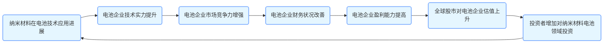

# 全球股市估值与纳米材料在电池技术中的应用

> 关键词：全球股市估值、纳米材料、电池技术、金融与科技融合、投资分析

> 摘要：本文旨在深入探讨全球股市估值与纳米材料在电池技术中的应用之间的关联。首先介绍了研究的背景、目的、预期读者、文档结构和相关术语。接着阐述了全球股市估值和纳米材料在电池技术应用的核心概念及联系，并通过流程图展示其关系。详细讲解了相关的核心算法原理，用 Python 代码进行了说明，同时给出了数学模型和公式，并举例解释。通过项目实战，搭建开发环境，实现并解读了相关代码。分析了该领域的实际应用场景，推荐了学习资源、开发工具框架和相关论文著作。最后总结了未来发展趋势与挑战，解答了常见问题，并提供了扩展阅读和参考资料，揭示了金融与科技领域相互影响、共同发展的重要意义。

## 1. 背景介绍 
### 1.1 目的和范围
本研究的主要目的是全面分析全球股市估值与纳米材料在电池技术中应用的内在联系。一方面，全球股市估值反映了金融市场对各个行业和企业的预期和评价，了解其变化规律对于投资者、金融分析师等具有重要意义。另一方面，纳米材料在电池技术中的应用是当前科技领域的热门研究方向，它有可能带来电池性能的重大突破，从而影响相关企业的市场价值和股市表现。本研究将涵盖全球主要股票市场的估值方法和影响因素，以及纳米材料在电池技术中的应用原理、发展现状和未来趋势，旨在为金融和科技领域的从业者提供有价值的参考。

### 1.2 预期读者
本文预期读者包括金融领域的投资者、股票分析师、基金经理等，他们希望通过了解科技发展对股市的影响，做出更明智的投资决策。同时，也适合科技领域的研究人员、工程师和创业者，他们可以从金融市场的角度了解纳米材料在电池技术应用的商业前景和市场需求。此外，对金融和科技交叉领域感兴趣的学生和爱好者也可以从本文中获取相关知识。

### 1.3 文档结构概述
本文将按照以下结构进行阐述：首先介绍核心概念与联系，通过文本示意图和 Mermaid 流程图展示全球股市估值与纳米材料在电池技术应用之间的关系。接着讲解核心算法原理和具体操作步骤，用 Python 代码详细说明。然后给出数学模型和公式，并举例进行详细讲解。通过项目实战，包括开发环境搭建、源代码实现和代码解读，进一步加深对相关知识的理解。分析实际应用场景，推荐学习资源、开发工具框架和相关论文著作。最后总结未来发展趋势与挑战，解答常见问题，并提供扩展阅读和参考资料。

### 1.4 术语表
#### 1.4.1 核心术语定义
- **全球股市估值**：是指对全球各个股票市场中上市公司的价值进行评估的过程和结果。通常通过各种估值方法，如市盈率（P/E）、市净率（P/B）等，来衡量股票的相对价值和市场对公司未来盈利能力的预期。
- **纳米材料**：是指在三维空间中至少有一维处于纳米尺度范围（1 - 100 纳米）或由它们作为基本单元构成的材料。纳米材料具有独特的物理、化学和生物学性质，在许多领域有着广泛的应用前景。
- **电池技术**：是研究和开发各种电池的设计、制造、性能优化和应用的技术领域。包括锂离子电池、铅酸电池、燃料电池等不同类型的电池，其性能指标如能量密度、充放电速度、循环寿命等是衡量电池优劣的重要标准。

#### 1.4.2 相关概念解释
- **市盈率（P/E）**：是指股票价格除以每股收益（EPS）的比率。它反映了市场对公司盈利能力的预期，较高的市盈率通常意味着市场对公司未来增长的预期较高。
- **市净率（P/B）**：是指股票价格除以每股净资产的比率。它反映了市场对公司资产价值的评估，较低的市净率可能表示股票被低估。
- **能量密度**：是指电池单位体积或单位质量所能存储的能量，通常用 Wh/kg 或 Wh/L 表示。能量密度越高，电池在相同体积或质量下能够存储的能量就越多，对于电动汽车、便携式电子设备等应用具有重要意义。

#### 1.4.3 缩略词列表
- **P/E**：Price - Earnings Ratio，市盈率
- **P/B**：Price - Book Ratio，市净率
- **EPS**：Earnings Per Share，每股收益
- **Wh/kg**：Watt - hour per kilogram，瓦时每千克
- **Wh/L**：Watt - hour per liter，瓦时每升

## 2. 核心概念与联系 

### 核心概念原理
#### 全球股市估值原理
全球股市估值是基于对上市公司未来盈利能力、资产价值、行业前景等多方面因素的综合评估。常用的估值方法包括相对估值法和绝对估值法。相对估值法通过比较同行业或类似公司的估值指标，如市盈率、市净率等，来判断目标公司股票的相对价值。绝对估值法主要是通过对公司未来现金流的折现来计算公司的内在价值，如贴现现金流模型（DCF）。

#### 纳米材料在电池技术中的应用原理
纳米材料由于其独特的纳米尺度效应，如小尺寸效应、表面效应和量子尺寸效应，能够显著改善电池的性能。例如，在锂离子电池中，纳米材料可以增加电极材料的比表面积，提高锂离子的嵌入和脱出速度，从而提高电池的充放电速度和倍率性能。同时，纳米材料还可以改善电极材料的结构稳定性，延长电池的循环寿命。

### 架构的文本示意图
全球股市估值与纳米材料在电池技术中的应用之间存在着复杂的相互关系。纳米材料在电池技术中的应用进展会影响相关电池企业的技术实力和市场竞争力，进而影响其财务状况和盈利能力。这些变化会反映在企业的股票价格和股市估值上。反之，股市估值的变化也会影响投资者对纳米材料在电池技术领域的投资热情和资金投入，从而影响该领域的研发和产业化进程。

### Mermaid 流程图


## 3. 核心算法原理 & 具体操作步骤 

### 全球股市估值算法原理
#### 市盈率估值法
市盈率估值法是一种相对简单且常用的估值方法。其基本原理是通过比较目标公司与同行业其他公司的市盈率，来估算目标公司的合理股价。计算公式为：
$$P = EPS \times PE$$
其中，$P$ 表示股票价格，$EPS$ 表示每股收益，$PE$ 表示市盈率。

#### Python 代码实现
```python
def pe_valuation(eps, pe):
    """
    市盈率估值法计算股票价格
    :param eps: 每股收益
    :param pe: 市盈率
    :return: 股票价格
    """
    return eps * pe

# 示例数据
eps = 2.5
pe = 20
price = pe_valuation(eps, pe)
print(f"通过市盈率估值法计算的股票价格为: {price} 元")
```

### 纳米材料电池性能评估算法原理
纳米材料电池的性能评估通常涉及多个指标，如能量密度、充放电速度等。这里以能量密度为例，其计算公式为：
$$E = \frac{Q \times U}{m}$$
其中，$E$ 表示能量密度（Wh/kg），$Q$ 表示电池的电荷量（Ah），$U$ 表示电池的电压（V），$m$ 表示电池的质量（kg）。

#### Python 代码实现
```python
def energy_density(q, u, m):
    """
    计算电池的能量密度
    :param q: 电池的电荷量（Ah）
    :param u: 电池的电压（V）
    :param m: 电池的质量（kg）
    :return: 能量密度（Wh/kg）
    """
    return (q * u) / m

# 示例数据
q = 5
u = 3.7
m = 0.5
density = energy_density(q, u, m)
print(f"电池的能量密度为: {density} Wh/kg")
```

### 具体操作步骤
#### 全球股市估值操作步骤
1. 收集目标公司和同行业其他公司的财务数据，包括每股收益和市盈率。
2. 计算目标公司的每股收益和同行业的平均市盈率。
3. 使用市盈率估值法公式计算目标公司的合理股价。
4. 将计算结果与目标公司的当前股价进行比较，判断股票是否被低估或高估。

#### 纳米材料电池性能评估操作步骤
1. 测量纳米材料电池的电荷量、电压和质量。
2. 使用能量密度计算公式计算电池的能量密度。
3. 将计算结果与行业标准或其他同类电池进行比较，评估纳米材料电池的性能。

## 4. 数学模型和公式 & 详细讲解 & 举例说明 

### 全球股市估值数学模型
#### 贴现现金流模型（DCF）
贴现现金流模型是一种绝对估值法，其基本思想是将公司未来的现金流折现到当前时刻，以计算公司的内在价值。数学公式为：
$$V = \sum_{t = 1}^{n} \frac{CF_t}{(1 + r)^t}$$
其中，$V$ 表示公司的内在价值，$CF_t$ 表示第 $t$ 期的现金流，$r$ 表示折现率，$n$ 表示预测期数。

#### 详细讲解
该模型的核心在于预测公司未来的现金流和选择合适的折现率。现金流的预测需要考虑公司的业务模式、市场前景、竞争状况等因素。折现率反映了投资者对投资风险的要求，通常可以使用资本资产定价模型（CAPM）来确定。

#### 举例说明
假设一家公司未来三年的现金流分别为 100 万元、120 万元和 150 万元，折现率为 10%。则该公司的内在价值为：
$$V = \frac{100}{(1 + 0.1)^1} + \frac{120}{(1 + 0.1)^2} + \frac{150}{(1 + 0.1)^3}$$
```python
import math

cf = [100, 120, 150]
r = 0.1
v = 0
for t in range(len(cf)):
    v += cf[t] / math.pow(1 + r, t + 1)
print(f"公司的内在价值为: {v} 万元")
```

### 纳米材料电池性能数学模型
#### 电极反应动力学模型
在纳米材料电池中，电极反应动力学模型可以用来描述锂离子在电极材料中的嵌入和脱出过程。以锂离子电池的正极材料为例，其电极反应可以表示为：
$$LiMO_2 \rightleftharpoons Li_{1 - x}MO_2 + xLi^+ + xe^-$$
其中，$LiMO_2$ 表示正极材料，$Li_{1 - x}MO_2$ 表示脱锂后的正极材料，$x$ 表示锂离子的脱出量。

根据能斯特方程，电极电位与锂离子浓度之间的关系为：
$$E = E^0 + \frac{RT}{nF} \ln \frac{[Li^+]_{s}}{[Li^+]_{b}}$$
其中，$E$ 表示电极电位，$E^0$ 表示标准电极电位，$R$ 表示气体常数，$T$ 表示温度，$n$ 表示电子转移数，$F$ 表示法拉第常数，$[Li^+]_{s}$ 表示电极表面锂离子浓度，$[Li^+]_{b}$ 表示电解液中锂离子浓度。

#### 详细讲解
该模型描述了电极电位与锂离子浓度之间的关系，对于理解纳米材料电池的充放电过程和性能具有重要意义。通过控制电极表面锂离子浓度和电解液中锂离子浓度，可以调节电极电位，从而影响电池的充放电性能。

#### 举例说明
假设在某一温度下，锂离子电池正极材料的标准电极电位 $E^0 = 3.8$ V，电子转移数 $n = 1$，气体常数 $R = 8.314$ J/(mol·K)，法拉第常数 $F = 96485$ C/mol，电极表面锂离子浓度 $[Li^+]_{s} = 0.1$ mol/L，电解液中锂离子浓度 $[Li^+]_{b} = 1$ mol/L，温度 $T = 298$ K。则电极电位为：
$$E = 3.8 + \frac{8.314 \times 298}{1 \times 96485} \ln \frac{0.1}{1}$$
```python
import math

E0 = 3.8
R = 8.314
T = 298
n = 1
F = 96485
Li_s = 0.1
Li_b = 1

E = E0 + (R * T / (n * F)) * math.log(Li_s / Li_b)
print(f"电极电位为: {E} V")
```

## 5. 项目实战：代码实际案例和详细解释说明 

### 5.1  开发环境搭建
#### 操作系统
可以选择 Windows、Linux 或 macOS 操作系统。本项目建议使用 Linux 系统，如 Ubuntu 18.04 及以上版本，因为 Linux 系统在开发和数据分析方面具有更好的稳定性和兼容性。

#### Python 环境
安装 Python 3.7 及以上版本。可以从 Python 官方网站（https://www.python.org/downloads/）下载并安装。安装完成后，使用以下命令验证 Python 版本：
```bash
python --version
```

#### 依赖库安装
本项目需要使用以下 Python 库：
- `pandas`：用于数据处理和分析。
- `numpy`：用于数值计算。
- `matplotlib`：用于数据可视化。

可以使用以下命令安装这些库：
```bash
pip install pandas numpy matplotlib
```

### 5.2  源代码详细实现和代码解读
#### 全球股市数据获取与分析
```python
import pandas as pd
import numpy as np
import matplotlib.pyplot as plt

# 模拟获取全球股市数据
data = {
    'Company': ['Company A', 'Company B', 'Company C'],
    'EPS': [2.5, 3.0, 2.0],
    'PE': [20, 25, 18]
}
df = pd.DataFrame(data)

# 计算股票价格
df['Price'] = df['EPS'] * df['PE']

# 可视化股票价格
plt.bar(df['Company'], df['Price'])
plt.xlabel('Company')
plt.ylabel('Stock Price')
plt.title('Stock Price Calculation using PE Valuation')
plt.show()

# 代码解读
# 1. 导入必要的库：pandas 用于数据处理，numpy 用于数值计算，matplotlib 用于数据可视化。
# 2. 模拟获取全球股市数据，创建一个包含公司名称、每股收益和市盈率的字典，并将其转换为 DataFrame。
# 3. 使用市盈率估值法计算股票价格，并将结果添加到 DataFrame 中。
# 4. 使用 matplotlib 绘制柱状图，展示不同公司的股票价格。
```

#### 纳米材料电池性能数据模拟与分析
```python
import pandas as pd
import numpy as np
import matplotlib.pyplot as plt

# 模拟纳米材料电池性能数据
data = {
    'Battery': ['Battery 1', 'Battery 2', 'Battery 3'],
    'Charge': [5, 6, 4],
    'Voltage': [3.7, 3.8, 3.6],
    'Mass': [0.5, 0.6, 0.4]
}
df = pd.DataFrame(data)

# 计算能量密度
df['Energy Density'] = (df['Charge'] * df['Voltage']) / df['Mass']

# 可视化能量密度
plt.bar(df['Battery'], df['Energy Density'])
plt.xlabel('Battery')
plt.ylabel('Energy Density (Wh/kg)')
plt.title('Energy Density Calculation of Nanomaterial Batteries')
plt.show()

# 代码解读
# 1. 导入必要的库：pandas 用于数据处理，numpy 用于数值计算，matplotlib 用于数据可视化。
# 2. 模拟纳米材料电池性能数据，创建一个包含电池名称、电荷量、电压和质量的字典，并将其转换为 DataFrame。
# 3. 使用能量密度计算公式计算电池的能量密度，并将结果添加到 DataFrame 中。
# 4. 使用 matplotlib 绘制柱状图，展示不同电池的能量密度。
```

### 5.3  代码解读与分析
#### 全球股市数据获取与分析代码分析
- 数据模拟：通过创建字典并转换为 DataFrame 的方式模拟获取全球股市数据，实际应用中可以从金融数据提供商（如 Bloomberg、Yahoo Finance 等）获取真实数据。
- 股票价格计算：使用市盈率估值法计算股票价格，这是一种简单且常用的估值方法，但实际中需要考虑更多因素，如公司的财务状况、行业前景等。
- 数据可视化：使用 matplotlib 绘制柱状图，直观展示不同公司的股票价格，有助于投资者快速比较和分析。

#### 纳米材料电池性能数据模拟与分析代码分析
- 数据模拟：同样通过创建字典并转换为 DataFrame 的方式模拟纳米材料电池性能数据，实际应用中可以通过实验测量获取真实数据。
- 能量密度计算：使用能量密度计算公式计算电池的能量密度，这是评估纳米材料电池性能的重要指标之一。
- 数据可视化：使用 matplotlib 绘制柱状图，直观展示不同电池的能量密度，有助于研究人员比较和评估不同纳米材料电池的性能。

## 6. 实际应用场景 

### 金融投资领域
- **股票投资决策**：投资者可以通过分析纳米材料在电池技术中的应用进展，评估相关电池企业的发展前景和市场竞争力，进而判断其股票的投资价值。例如，如果某家企业在纳米材料电池技术方面取得重大突破，其股票可能具有较高的投资潜力。
- **基金资产配置**：基金经理可以根据全球股市估值和纳米材料电池技术的发展趋势，调整基金的资产配置。例如，增加对纳米材料电池相关企业的投资比例，以获取更高的收益。

### 科技研发领域
- **电池技术创新**：研究人员可以根据市场对电池性能的需求和股市对相关企业的估值，确定纳米材料在电池技术中的研发方向和重点。例如，如果市场对高能量密度电池的需求较大，且股市对具有高能量密度电池技术的企业给予较高估值，研究人员可以加大在纳米材料提高电池能量密度方面的研发投入。
- **企业战略规划**：电池企业可以根据全球股市估值和纳米材料电池技术的发展趋势，制定企业的战略规划。例如，企业可以加大在纳米材料电池技术研发和产业化方面的投入，提高自身的市场竞争力和股市估值。

### 能源应用领域
- **电动汽车行业**：纳米材料在电池技术中的应用可以提高电动汽车电池的性能，如能量密度、充放电速度等，从而推动电动汽车行业的发展。股市对电动汽车相关企业的估值也会受到纳米材料电池技术进展的影响。
- **储能领域**：纳米材料电池在储能领域具有广阔的应用前景，如电网储能、可再生能源储能等。股市对储能相关企业的估值也会与纳米材料电池技术的发展密切相关。

## 7. 工具和资源推荐
### 7.1 学习资源推荐
#### 7.1.1 书籍推荐
- 《金融市场学》：全面介绍了金融市场的基本概念、理论和运行机制，对于理解全球股市估值具有重要帮助。
- 《纳米材料科学与技术》：系统阐述了纳米材料的基本原理、制备方法和应用领域，是学习纳米材料在电池技术中应用的重要参考书籍。
- 《电池技术基础》：详细介绍了各种电池的工作原理、性能特点和应用场景，对于深入了解电池技术具有重要意义。

#### 7.1.2 在线课程
- Coursera 上的“Financial Markets”课程：由耶鲁大学教授 Robert Shiller 主讲，介绍了金融市场的基本理论和实践，包括股票市场估值方法。
- edX 上的“Nanomaterials: From Fundamentals to Applications”课程：由新加坡国立大学教授带领学习纳米材料的基础知识和应用领域，包括纳米材料在电池技术中的应用。
- Udemy 上的“Battery Technology: Principles, Design, and Applications”课程：详细讲解了电池技术的原理、设计和应用，适合初学者和专业人士学习。

#### 7.1.3 技术博客和网站
- Seeking Alpha：提供全球股市的分析和评论，包括公司财报分析、行业趋势研究等，对于投资者了解全球股市估值具有重要参考价值。
- Nanowerk：专注于纳米技术领域的新闻和研究成果报道，提供纳米材料在电池技术中应用的最新进展和研究动态。
- Battery University：是一个关于电池技术的专业网站，提供电池的基础知识、使用技巧、性能测试等方面的信息，对于学习电池技术非常有帮助。

### 7.2 开发工具框架推荐
#### 7.2.1 IDE和编辑器
- PyCharm：是一款专业的 Python 集成开发环境，具有代码编辑、调试、自动补全、版本控制等功能，适合开发和调试 Python 代码。
- Jupyter Notebook：是一个基于网页的交互式开发环境，支持 Python、R 等多种编程语言，适合进行数据分析、模型训练和可视化等工作。
- Visual Studio Code：是一款轻量级的代码编辑器，支持多种编程语言和插件扩展，具有良好的代码编辑体验和开发效率。

#### 7.2.2 调试和性能分析工具
- PDB：是 Python 内置的调试器，可以帮助开发者在代码运行过程中进行调试和定位问题。
- cProfile：是 Python 内置的性能分析工具，可以分析代码的运行时间和函数调用情况，帮助开发者优化代码性能。
- Py-Spy：是一个用于 Python 代码性能分析的工具，可以实时监测代码的运行状态和性能瓶颈。

#### 7.2.3 相关框架和库
- Pandas：是一个用于数据处理和分析的 Python 库，提供了高效的数据结构和数据分析工具，适合处理和分析全球股市数据和纳米材料电池性能数据。
- Numpy：是一个用于数值计算的 Python 库，提供了高效的多维数组对象和数学函数，适合进行科学计算和模型训练。
- Matplotlib：是一个用于数据可视化的 Python 库，提供了丰富的绘图函数和工具，适合绘制各种类型的图表和可视化数据。

### 7.3 相关论文著作推荐
#### 7.3.1 经典论文
- “The Capital Asset Pricing Model: Theory and Evidence”：由 Eugene F. Fama 和 Kenneth R. French 撰写，是资本资产定价模型领域的经典论文，对于理解股票市场估值和投资风险具有重要意义。
- “Nanostructured Materials for Advanced Energy Conversion and Storage Devices”：由 Yi Cui 等人撰写，介绍了纳米结构材料在先进能源转换和存储设备中的应用，对于学习纳米材料在电池技术中的应用具有重要参考价值。
- “Lithium-Ion Batteries: Science and Technologies”：由 Bruno Scrosati、Doron Aurbach 和 Jean-Marie Tarascon 编辑，是锂离子电池领域的经典著作，全面介绍了锂离子电池的原理、技术和应用。

#### 7.3.2 最新研究成果
- 可以通过学术数据库（如 IEEE Xplore、ACM Digital Library、ScienceDirect 等）搜索关于全球股市估值和纳米材料在电池技术中应用的最新研究论文。这些论文通常涵盖了最新的研究方法、技术和应用案例。
- 参加相关的学术会议（如 IEEE International Conference on Nanotechnology、International Battery Seminar and Exhibit 等），可以了解该领域的最新研究动态和前沿成果。

#### 7.3.3 应用案例分析
- 《金融科技前沿：案例与实践》：介绍了金融科技领域的各种应用案例，包括股票市场估值模型的应用和金融科技在投资决策中的应用。
- 《纳米技术在能源领域的应用案例集》：收集了纳米技术在能源领域的各种应用案例，包括纳米材料在电池技术中的应用案例，对于了解实际应用场景和技术实现具有重要参考价值。

## 8. 总结：未来发展趋势与挑战
### 未来发展趋势
#### 全球股市估值方面
- **科技驱动的行业估值提升**：随着纳米材料在电池技术等科技领域的不断应用和突破，相关科技企业的市场竞争力和盈利能力将不断提高，其在全球股市中的估值也将随之提升。科技驱动的行业将成为股市的重要增长点。
- **国际化和多元化**：全球股市的联系将更加紧密，投资者将更加关注国际市场的动态和机会。同时，股市的投资品种也将更加多元化，除了传统的股票，还将出现更多与科技、新能源等领域相关的金融衍生品。
- **数据驱动的估值方法创新**：随着大数据、人工智能等技术的发展，股市估值方法将更加注重数据的分析和挖掘。通过对海量的市场数据、企业财务数据和行业信息进行分析，将开发出更加准确和有效的估值模型。

#### 纳米材料在电池技术应用方面
- **高性能电池的研发**：未来将继续致力于提高纳米材料电池的能量密度、充放电速度、循环寿命等性能指标。例如，开发新型的纳米电极材料和电解质材料，以满足电动汽车、储能等领域对高性能电池的需求。
- **产业化进程加速**：随着纳米材料电池技术的不断成熟和成本的不断降低，其产业化进程将加速。越来越多的企业将进入纳米材料电池领域，推动该技术的大规模应用和商业化发展。
- **与其他技术的融合发展**：纳米材料电池技术将与其他技术（如人工智能、物联网、新能源等）进行融合发展。例如，通过人工智能技术实现电池的智能管理和优化，提高电池的使用效率和安全性。

### 挑战
#### 全球股市估值方面
- **市场不确定性增加**：全球政治、经济形势的不确定性将增加股市的波动性和风险。例如，贸易摩擦、地缘政治冲突、经济衰退等因素都可能对股市估值产生负面影响。
- **估值方法的局限性**：现有的股市估值方法存在一定的局限性，无法完全准确地反映企业的真实价值和未来发展潜力。特别是对于一些新兴科技企业，由于其业务模式和盈利模式较为复杂，传统的估值方法可能不适用。
- **投资者情绪的影响**：投资者情绪对股市估值具有重要影响。在市场乐观时，投资者可能会高估股票的价值；而在市场悲观时，投资者可能会低估股票的价值。投资者情绪的波动增加了股市估值的难度和不确定性。

#### 纳米材料在电池技术应用方面
- **技术难题待突破**：虽然纳米材料在电池技术中具有巨大的应用潜力，但仍面临一些技术难题。例如，纳米材料的制备工艺复杂、成本较高，纳米电极材料的稳定性和安全性有待提高等。
- **产业化成本较高**：纳米材料电池的产业化需要大量的资金投入和技术支持，目前其生产成本仍然较高。降低生产成本，提高产品的性价比，是纳米材料电池产业化面临的重要挑战。
- **环境和安全问题**：纳米材料的应用可能会带来一些环境和安全问题。例如，纳米材料的生产和使用过程中可能会产生环境污染，纳米材料在电池中的安全性也需要进一步研究和评估。

## 9. 附录：常见问题与解答
### 全球股市估值相关问题
#### 问：市盈率估值法有哪些局限性？
答：市盈率估值法的局限性主要包括：一是没有考虑公司的未来增长潜力，只关注了当前的盈利情况；二是不同行业的市盈率水平差异较大，不能简单地进行跨行业比较；三是市盈率容易受到市场情绪和短期盈利波动的影响，不能准确反映公司的长期价值。

#### 问：贴现现金流模型中的折现率如何确定？
答：折现率的确定通常可以使用资本资产定价模型（CAPM），其公式为：$r = R_f + \beta (R_m - R_f)$，其中 $r$ 表示折现率，$R_f$ 表示无风险利率，$\beta$ 表示股票的贝塔系数，$R_m$ 表示市场收益率。无风险利率可以使用国债收益率等近似替代，贝塔系数反映了股票相对于市场的波动程度，可以通过历史数据进行估算，市场收益率可以使用股票市场的平均收益率。

### 纳米材料在电池技术应用相关问题
#### 问：纳米材料在电池技术中的应用会带来哪些安全隐患？
答：纳米材料在电池技术中的应用可能会带来一些安全隐患。例如，纳米材料的高比表面积可能会导致电池在充放电过程中发生副反应，产生热量和气体，从而增加电池的热失控风险。此外，纳米材料的小尺寸效应可能会导致其在电池内部的迁移和聚集，影响电池的性能和安全性。

#### 问：如何提高纳米材料电池的产业化水平？
答：提高纳米材料电池的产业化水平需要从多个方面入手。一是加大研发投入，突破技术难题，提高纳米材料电池的性能和稳定性；二是优化制备工艺，降低生产成本，提高产品的性价比；三是加强与上下游企业的合作，建立完善的产业链，提高产业化的效率和规模；四是加强政策支持，引导社会资本投入，为纳米材料电池的产业化创造良好的政策环境。

## 10. 扩展阅读 & 参考资料
### 扩展阅读
- 《金融炼金术》：乔治·索罗斯的经典著作，探讨了金融市场的运行规律和投资者的心理行为，对于理解全球股市估值和市场波动具有重要启示。
- 《纳米科技前沿》：介绍了纳米科技领域的最新研究成果和应用前景，包括纳米材料在能源、生物医学、信息技术等领域的应用，有助于拓宽对纳米材料在电池技术中应用的认识。
- 《电动汽车革命》：讲述了电动汽车行业的发展历程、技术现状和未来趋势，对于了解纳米材料电池在电动汽车领域的应用和市场需求具有重要参考价值。

### 参考资料
- Bloomberg Terminal：提供全球金融市场的实时数据、分析报告和新闻资讯，是金融领域专业人士常用的信息工具。
- Web of Science：是一个综合性的学术数据库，涵盖了自然科学、工程技术、社会科学等多个领域的学术文献，可用于查找关于全球股市估值和纳米材料在电池技术中应用的学术论文。
- International Energy Agency (IEA)：发布全球能源市场的统计数据和分析报告，对于了解能源领域的发展趋势和市场需求具有重要参考价值。

作者：AI天才研究院/AI Genius Institute & 禅与计算机程序设计艺术 /Zen And The Art of Computer Programming