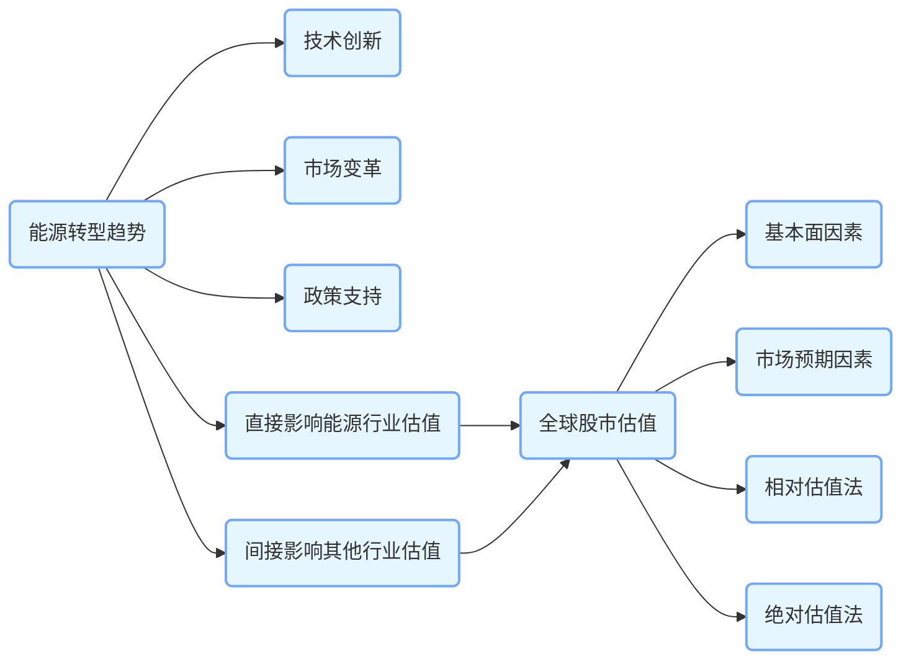

# 全球股市估值与能源转型趋势的关系

> 关键词：全球股市估值、能源转型趋势、股市与能源关联、能源转型影响、估值分析

> 摘要：本文深入探讨了全球股市估值与能源转型趋势之间的紧密联系。首先介绍了研究的背景、目的、预期读者等信息，为后续内容奠定基础。接着阐述了股市估值和能源转型的核心概念及两者的联系，通过原理、架构示意图和流程图进行清晰展示。详细讲解了分析两者关系的核心算法原理及操作步骤，运用Python代码进行说明。从数学模型和公式的角度对这种关系进行量化分析，并举例说明。通过项目实战案例，展示如何在实际中研究两者关系，包括开发环境搭建、代码实现与解读。探讨了在不同领域的实际应用场景，推荐了相关的学习资源、开发工具框架以及论文著作。最后总结了未来的发展趋势与挑战，解答常见问题并给出扩展阅读和参考资料，旨在为投资者、研究者和行业从业者提供全面深入的见解。

## 1. 背景介绍 
### 1.1 目的和范围
在当今全球化的经济格局下，能源转型已成为世界各国关注的焦点。随着对环境保护、可持续发展的重视以及技术的不断进步，传统能源向清洁能源的转变正在加速。同时，全球股市作为经济的重要组成部分，其估值受到众多因素的影响，能源转型趋势便是其中之一。本文的目的在于深入研究全球股市估值与能源转型趋势之间的内在联系，分析能源转型如何影响不同行业和企业的股市估值，以及股市估值的变化如何反映能源转型的进程和趋势。

研究范围涵盖全球主要股票市场，包括但不限于美国、欧洲、亚洲等地区的股票指数和相关行业板块。同时，涉及多种能源类型，如传统的石油、煤炭、天然气等化石能源，以及太阳能、风能、水能等清洁能源。通过对不同市场和能源类型的综合分析，全面揭示两者之间的关系。

### 1.2 预期读者
本文的预期读者包括金融投资者、股票分析师、能源行业从业者、政策制定者以及对经济和能源领域感兴趣的研究人员。对于投资者来说，了解股市估值与能源转型趋势的关系有助于做出更明智的投资决策，把握市场机会；股票分析师可以将此研究作为分析股票走势和行业前景的重要参考；能源行业从业者能够从股市估值的角度了解行业的发展态势和市场认可度；政策制定者可以根据研究结果制定更合理的能源政策和经济政策；研究人员则可以在此基础上进行更深入的学术研究。

### 1.3 文档结构概述
本文共分为十个部分。第一部分为背景介绍，阐述了研究的目的、范围、预期读者和文档结构，为后续内容提供了基本框架。第二部分介绍核心概念与联系，详细解释股市估值和能源转型的概念，并展示两者之间的关系。第三部分讲解核心算法原理和具体操作步骤，通过Python代码实现相关分析。第四部分运用数学模型和公式对两者关系进行量化分析，并举例说明。第五部分是项目实战，包括开发环境搭建、源代码实现和代码解读。第六部分探讨实际应用场景，分析两者关系在不同领域的应用。第七部分推荐相关的学习资源、开发工具框架和论文著作。第八部分总结未来发展趋势与挑战。第九部分为附录，解答常见问题。第十部分提供扩展阅读和参考资料，方便读者进一步深入研究。

### 1.4 术语表
#### 1.4.1 核心术语定义
- **全球股市估值**：指对全球范围内各个股票市场上上市公司的股票价值进行评估的过程和结果。常用的估值指标包括市盈率（P/E）、市净率（P/B）、股息率等，这些指标反映了市场对公司未来盈利能力、资产价值和分红水平的预期。
- **能源转型**：是指从传统的以化石能源为主的能源体系向以清洁能源和可再生能源为主的能源体系转变的过程。这一过程涉及能源生产、消费、技术创新、政策法规等多个方面的变革。
- **市盈率（P/E）**：是指股票价格除以每股收益（EPS）的比率，反映了投资者为获得公司每一元盈利所愿意支付的价格。较高的市盈率通常表示市场对公司未来盈利增长的预期较高。
- **市净率（P/B）**：是指股票价格除以每股净资产的比率，反映了市场对公司资产价值的评估。市净率小于1时，通常表示股票价格低于公司的净资产价值。

#### 1.4.2 相关概念解释
- **清洁能源**：是指在生产和使用过程中不产生或极少产生污染物排放的能源，主要包括太阳能、风能、水能、生物能、地热能等。清洁能源具有可再生、环境友好等特点，是能源转型的主要方向。
- **化石能源**：是指由古代生物的化石沉积而来的能源，主要包括石油、煤炭、天然气等。化石能源是目前全球能源消费的主要来源，但在燃烧过程中会产生大量的二氧化碳、二氧化硫等污染物，对环境造成严重影响。
- **能源结构**：是指各种能源在能源总消费中所占的比例关系。能源结构的优化是能源转型的重要目标之一，通过提高清洁能源在能源结构中的比重，可以实现能源的可持续发展。

#### 1.4.3 缩略词列表
- **P/E**：市盈率（Price-to-Earnings Ratio）
- **P/B**：市净率（Price-to-Book Ratio）
- **EPS**：每股收益（Earnings Per Share）
- **GDP**：国内生产总值（Gross Domestic Product）

## 2. 核心概念与联系 
### 2.1 全球股市估值的原理
全球股市估值是一个复杂的过程，涉及到多个因素的综合考量。从基本原理来看，股市估值主要基于公司的基本面和市场预期。公司的基本面包括盈利能力、资产状况、现金流等指标，这些指标反映了公司的实际价值。市场预期则受到宏观经济环境、行业发展趋势、政策法规等因素的影响，反映了投资者对公司未来发展的信心和预期。

常用的股市估值方法包括相对估值法和绝对估值法。相对估值法是通过与同行业或类似公司的估值指标进行比较，来评估目标公司的价值。常见的相对估值指标有市盈率、市净率、市销率等。绝对估值法是通过对公司未来现金流的折现来计算公司的内在价值，常见的绝对估值模型有股息贴现模型（DDM）、自由现金流贴现模型（DCF）等。

### 2.2 能源转型趋势的内涵
能源转型是一个长期而复杂的过程，涉及到能源技术的创新、能源市场的变革和能源政策的调整。从技术层面来看，能源转型主要包括清洁能源技术的研发和应用，如太阳能光伏发电技术、风力发电技术、储能技术等。这些技术的不断进步使得清洁能源的成本不断降低，竞争力不断提高。

从市场层面来看，能源转型导致能源市场的结构发生变化。传统化石能源的市场份额逐渐下降，清洁能源的市场份额逐渐上升。同时，能源转型也催生了新的能源市场和商业模式，如分布式能源、能源互联网等。

从政策层面来看，各国政府纷纷出台相关政策支持能源转型，如制定可再生能源发展目标、提供补贴和税收优惠、加强能源监管等。这些政策措施为能源转型提供了有力的保障和推动。

### 2.3 两者的联系
能源转型趋势对全球股市估值有着重要的影响。一方面，能源转型会直接影响能源行业的股市估值。随着能源转型的推进，传统化石能源企业面临着市场需求下降、环保压力增大等挑战，其股市估值可能会受到负面影响。相反，清洁能源企业则受益于政策支持和市场需求增长，其股市估值可能会上升。

另一方面，能源转型也会间接影响其他行业的股市估值。能源是经济发展的基础，能源转型会改变各行业的能源消费结构和成本，从而影响其盈利能力和市场竞争力。例如，交通运输行业向电动汽车转型会减少对石油的需求，对石油行业的股市估值产生负面影响；同时，电动汽车产业链上的企业，如电池制造商、充电桩运营商等，其股市估值可能会上升。

### 2.4 文本示意图
```plaintext
全球股市估值
|
|-- 基本面因素（盈利能力、资产状况等）
|-- 市场预期因素（宏观经济、行业趋势等）
|
|-- 相对估值法（P/E、P/B等）
|-- 绝对估值法（DDM、DCF等）

能源转型趋势
|
|-- 技术创新（清洁能源技术）
|-- 市场变革（能源市场结构变化）
|-- 政策支持（可再生能源政策）

两者联系
|
|-- 直接影响：能源行业估值变化（化石能源企业 vs 清洁能源企业）
|-- 间接影响：其他行业估值变化（因能源消费结构改变）
```

### 2.5 Mermaid流程图


## 3. 核心算法原理 & 具体操作步骤 
### 3.1 核心算法原理
为了分析全球股市估值与能源转型趋势的关系，我们可以采用时间序列分析和回归分析的方法。时间序列分析可以用于观察股市估值和能源转型相关指标随时间的变化趋势，找出两者之间的同步性或滞后性。回归分析则可以用于量化两者之间的关系，确定能源转型指标对股市估值的影响程度。

具体来说，我们可以选取一些代表股市估值的指标，如市盈率、市净率等，以及一些代表能源转型趋势的指标，如清洁能源在能源消费中的占比、可再生能源装机容量等。然后，将这些指标作为变量，建立回归模型进行分析。

### 3.2 Python代码实现
以下是一个简单的Python代码示例，用于演示如何进行时间序列分析和回归分析：

```python
import pandas as pd
import numpy as np
import matplotlib.pyplot as plt
from statsmodels.tsa.seasonal import seasonal_decompose
from sklearn.linear_model import LinearRegression

# 读取数据
data = pd.read_csv('stock_energy_data.csv')

# 提取股市估值指标和能源转型指标
stock_valuation = data['PE_ratio']  # 市盈率
energy_transition = data['Renewable_energy_share']  # 可再生能源占比

# 时间序列分析：季节性分解
decomposition = seasonal_decompose(stock_valuation, model='additive', period=12)
trend = decomposition.trend
seasonal = decomposition.seasonal
residual = decomposition.resid

# 绘制时间序列分解图
plt.figure(figsize=(12, 8))
plt.subplot(411)
plt.plot(stock_valuation, label='Original')
plt.legend(loc='best')
plt.subplot(412)
plt.plot(trend, label='Trend')
plt.legend(loc='best')
plt.subplot(413)
plt.plot(seasonal, label='Seasonal')
plt.legend(loc='best')
plt.subplot(414)
plt.plot(residual, label='Residual')
plt.legend(loc='best')
plt.tight_layout()
plt.show()

# 回归分析
X = energy_transition.values.reshape(-1, 1)
y = stock_valuation.values

model = LinearRegression()
model.fit(X, y)

# 输出回归系数和截距
print('回归系数:', model.coef_[0])
print('截距:', model.intercept_)

# 绘制回归直线
plt.scatter(X, y, color='blue')
plt.plot(X, model.predict(X), color='red', linewidth=2)
plt.xlabel('Renewable Energy Share')
plt.ylabel('PE Ratio')
plt.title('Regression Analysis of Stock Valuation and Energy Transition')
plt.show()
```

### 3.3 具体操作步骤
1. **数据收集**：收集全球股市估值数据和能源转型相关数据。股市估值数据可以从金融数据提供商（如彭博、路透社等）获取，能源转型数据可以从国际能源署（IEA）、各国能源部门等官方机构获取。
2. **数据预处理**：对收集到的数据进行清洗、整理和缺失值处理。确保数据的准确性和一致性。
3. **时间序列分析**：使用Python的`statsmodels`库进行季节性分解，观察股市估值指标的趋势、季节性和残差。
4. **回归分析**：使用Python的`sklearn`库建立线性回归模型，分析能源转型指标对股市估值指标的影响。
5. **结果分析**：根据回归系数和截距，判断能源转型指标对股市估值指标的影响方向和程度。同时，观察回归直线的拟合程度，评估模型的有效性。

## 4. 数学模型和公式 & 详细讲解 & 举例说明 
### 4.1 线性回归模型
线性回归是一种用于建立自变量和因变量之间线性关系的统计模型。在分析全球股市估值与能源转型趋势的关系时，我们可以建立如下的线性回归模型：

$$
y = \beta_0 + \beta_1x + \epsilon
$$

其中，$y$ 表示股市估值指标（如市盈率），$x$ 表示能源转型指标（如可再生能源占比），$\beta_0$ 是截距，$\beta_1$ 是回归系数，$\epsilon$ 是误差项。

回归系数 $\beta_1$ 表示自变量 $x$ 每变化一个单位，因变量 $y$ 的平均变化量。如果 $\beta_1 > 0$，表示能源转型指标与股市估值指标呈正相关；如果 $\beta_1 < 0$，表示两者呈负相关。

### 4.2 最小二乘法
为了估计回归系数 $\beta_0$ 和 $\beta_1$，我们通常使用最小二乘法。最小二乘法的目标是使观测值与回归直线的误差平方和最小。误差平方和的计算公式为：

$$
SSE = \sum_{i=1}^{n}(y_i - \hat{y}_i)^2 = \sum_{i=1}^{n}(y_i - (\beta_0 + \beta_1x_i))^2
$$

其中，$y_i$ 是第 $i$ 个观测值，$\hat{y}_i$ 是第 $i$ 个预测值，$n$ 是样本数量。

通过对 $SSE$ 分别求关于 $\beta_0$ 和 $\beta_1$ 的偏导数，并令偏导数等于0，可以得到回归系数的估计值：

$$
\hat{\beta}_1 = \frac{\sum_{i=1}^{n}(x_i - \bar{x})(y_i - \bar{y})}{\sum_{i=1}^{n}(x_i - \bar{x})^2}
$$

$$
\hat{\beta}_0 = \bar{y} - \hat{\beta}_1\bar{x}
$$

其中，$\bar{x}$ 和 $\bar{y}$ 分别是 $x$ 和 $y$ 的样本均值。

### 4.3 举例说明
假设我们收集了某国过去10年的股市市盈率和可再生能源占比数据，如下表所示：

| 年份 | 市盈率（$y$） | 可再生能源占比（$x$） |
|------|---------------|-----------------------|
| 2011 | 15            | 10%                   |
| 2012 | 16            | 12%                   |
| 2013 | 17            | 15%                   |
| 2014 | 18            | 18%                   |
| 2015 | 19            | 20%                   |
| 2016 | 20            | 22%                   |
| 2017 | 21            | 25%                   |
| 2018 | 22            | 28%                   |
| 2019 | 23            | 30%                   |
| 2020 | 24            | 32%                   |

首先，计算 $x$ 和 $y$ 的样本均值：

$$
\bar{x} = \frac{10 + 12 + 15 + 18 + 20 + 22 + 25 + 28 + 30 + 32}{10} = 20.2
$$

$$
\bar{y} = \frac{15 + 16 + 17 + 18 + 19 + 20 + 21 + 22 + 23 + 24}{10} = 19.5
$$

然后，计算回归系数 $\hat{\beta}_1$：

$$
\begin{align*}
\sum_{i=1}^{10}(x_i - \bar{x})(y_i - \bar{y}) &= (10 - 20.2)(15 - 19.5) + (12 - 20.2)(16 - 19.5) + \cdots + (32 - 20.2)(24 - 19.5) \\
&= 102.6
\end{align*}
$$

$$
\begin{align*}
\sum_{i=1}^{10}(x_i - \bar{x})^2 &= (10 - 20.2)^2 + (12 - 20.2)^2 + \cdots + (32 - 20.2)^2 \\
&= 283.6
\end{align*}
$$

$$
\hat{\beta}_1 = \frac{102.6}{283.6} \approx 0.362
$$

最后，计算截距 $\hat{\beta}_0$：

$$
\hat{\beta}_0 = 19.5 - 0.362 \times 20.2 \approx 12.2
$$

因此，回归方程为：

$$
y = 12.2 + 0.362x
$$

这表明可再生能源占比每增加1%，股市市盈率平均增加0.362。

## 5. 项目实战：代码实际案例和详细解释说明 
### 5.1  开发环境搭建
为了实现上述代码，我们需要搭建一个Python开发环境。以下是具体的步骤：

1. **安装Python**：从Python官方网站（https://www.python.org/downloads/）下载并安装Python 3.x版本。

2. **安装必要的库**：使用`pip`命令安装所需的库，包括`pandas`、`numpy`、`matplotlib`、`statsmodels`和`sklearn`。

```bash
pip install pandas numpy matplotlib statsmodels scikit-learn
```

3. **准备数据**：将收集到的股市估值数据和能源转型数据保存为CSV文件，例如`stock_energy_data.csv`。确保文件中包含所需的列，如`PE_ratio`（市盈率）和`Renewable_energy_share`（可再生能源占比）。

### 5.2  源代码详细实现和代码解读
```python
import pandas as pd
import numpy as np
import matplotlib.pyplot as plt
from statsmodels.tsa.seasonal import seasonal_decompose
from sklearn.linear_model import LinearRegression

# 读取数据
data = pd.read_csv('stock_energy_data.csv')

# 提取股市估值指标和能源转型指标
stock_valuation = data['PE_ratio']  # 市盈率
energy_transition = data['Renewable_energy_share']  # 可再生能源占比

# 时间序列分析：季节性分解
decomposition = seasonal_decompose(stock_valuation, model='additive', period=12)
trend = decomposition.trend
seasonal = decomposition.seasonal
residual = decomposition.resid

# 绘制时间序列分解图
plt.figure(figsize=(12, 8))
plt.subplot(411)
plt.plot(stock_valuation, label='Original')
plt.legend(loc='best')
plt.subplot(412)
plt.plot(trend, label='Trend')
plt.legend(loc='best')
plt.subplot(413)
plt.plot(seasonal, label='Seasonal')
plt.legend(loc='best')
plt.subplot(414)
plt.plot(residual, label='Residual')
plt.legend(loc='best')
plt.tight_layout()
plt.show()

# 回归分析
X = energy_transition.values.reshape(-1, 1)
y = stock_valuation.values

model = LinearRegression()
model.fit(X, y)

# 输出回归系数和截距
print('回归系数:', model.coef_[0])
print('截距:', model.intercept_)

# 绘制回归直线
plt.scatter(X, y, color='blue')
plt.plot(X, model.predict(X), color='red', linewidth=2)
plt.xlabel('Renewable Energy Share')
plt.ylabel('PE Ratio')
plt.title('Regression Analysis of Stock Valuation and Energy Transition')
plt.show()
```

### 代码解读：
1. **导入必要的库**：`pandas`用于数据处理，`numpy`用于数值计算，`matplotlib`用于数据可视化，`statsmodels`用于时间序列分析，`sklearn`用于线性回归分析。
2. **读取数据**：使用`pd.read_csv`函数读取CSV文件，并将数据存储在`data`变量中。
3. **提取指标**：从数据中提取股市估值指标（市盈率）和能源转型指标（可再生能源占比）。
4. **时间序列分析**：使用`seasonal_decompose`函数对股市估值指标进行季节性分解，得到趋势、季节性和残差。
5. **绘制时间序列分解图**：使用`matplotlib`库绘制原始数据、趋势、季节性和残差的图形，以便观察数据的特征。
6. **回归分析**：将能源转型指标作为自变量，股市估值指标作为因变量，建立线性回归模型，并使用`fit`方法进行拟合。
7. **输出回归系数和截距**：使用`model.coef_`和`model.intercept_`属性输出回归系数和截距。
8. **绘制回归直线**：使用`matplotlib`库绘制散点图和回归直线，直观展示两者之间的关系。

### 5.3  代码解读与分析
通过上述代码，我们可以完成对全球股市估值与能源转型趋势关系的初步分析。时间序列分析可以帮助我们了解股市估值指标的长期趋势和季节性变化，而回归分析可以量化能源转型指标对股市估值指标的影响程度。

从回归系数和截距的结果中，我们可以判断能源转型指标与股市估值指标之间的相关性。如果回归系数为正，说明能源转型趋势对股市估值有正向影响；如果回归系数为负，说明能源转型趋势对股市估值有负向影响。

同时，我们还可以通过观察回归直线的拟合程度来评估模型的有效性。如果回归直线能够较好地拟合数据点，说明模型能够较好地解释两者之间的关系；反之，则需要进一步优化模型或考虑其他因素。

## 6. 实际应用场景 
### 6.1 投资决策
对于投资者来说，了解全球股市估值与能源转型趋势的关系可以帮助他们做出更明智的投资决策。在能源转型的背景下，投资者可以关注清洁能源行业的发展前景，选择具有潜力的清洁能源企业进行投资。同时，投资者也需要警惕传统化石能源企业的投资风险，因为随着能源转型的推进，这些企业可能面临市场份额下降、资产减值等问题。

例如，投资者可以通过分析股市估值指标和能源转型指标的关系，判断清洁能源行业的估值是否合理。如果回归分析结果显示能源转型指标与股市估值指标呈正相关，且清洁能源企业的估值相对较低，那么投资者可以考虑增加对清洁能源行业的投资。

### 6.2 行业分析
对于行业分析师来说，研究全球股市估值与能源转型趋势的关系可以帮助他们深入了解各个行业的发展态势。能源转型不仅会影响能源行业本身，还会对其他相关行业产生连锁反应。通过分析不同行业的股市估值变化，可以发现能源转型带来的机遇和挑战。

例如，汽车行业向电动汽车转型是能源转型的一个重要方面。分析师可以通过研究汽车行业和能源行业的股市估值关系，评估电动汽车产业链的发展前景。如果回归分析结果显示能源转型指标与汽车行业的股市估值呈正相关，且电动汽车企业的估值上升趋势明显，那么可以预测电动汽车行业将迎来快速发展。

### 6.3 政策制定
对于政策制定者来说，了解全球股市估值与能源转型趋势的关系可以为制定能源政策和经济政策提供参考。政策制定者可以通过观察股市估值的变化，了解市场对能源转型政策的反应，评估政策的实施效果。

例如，如果政策制定者推出了一项鼓励可再生能源发展的政策，通过分析股市估值数据可以观察到清洁能源企业的估值是否上升，从而判断政策是否有效。同时，政策制定者还可以根据回归分析结果，调整政策力度和方向，以促进能源转型的顺利进行。

### 6.4 风险管理
对于金融机构和企业来说，研究全球股市估值与能源转型趋势的关系可以帮助他们进行风险管理。能源转型带来的不确定性会对股市估值产生影响，从而增加投资风险。通过建立风险模型，分析能源转型指标与股市估值指标的关系，可以预测股市估值的波动情况，提前采取风险防范措施。

例如，金融机构可以根据回归分析结果，调整投资组合的配置，降低对受能源转型影响较大的行业的投资比例，增加对清洁能源等新兴行业的投资比例。企业也可以通过分析自身所处行业的股市估值变化，评估能源转型对企业的影响，制定相应的风险管理策略。

## 7. 工具和资源推荐
### 7.1 学习资源推荐
#### 7.1.1 书籍推荐
- 《金融市场学》：全面介绍了金融市场的基本概念、理论和实践，包括股票市场、债券市场、期货市场等。对于理解股市估值的基本原理和方法有很大帮助。
- 《能源经济学》：系统阐述了能源经济的基本理论和方法，包括能源市场、能源政策、能源与经济增长的关系等。对于了解能源转型的经济背景和影响有重要参考价值。
- 《时间序列分析》：详细介绍了时间序列分析的理论和方法，包括平稳性检验、自回归模型、移动平均模型等。对于进行股市估值和能源转型数据的时间序列分析非常有用。

#### 7.1.2 在线课程
- Coursera上的“Financial Markets”：由耶鲁大学教授Robert Shiller主讲，介绍了金融市场的基本原理和投资策略。
- edX上的“Energy and the Environment”：由麻省理工学院教授John Sterman主讲，探讨了能源与环境的关系以及能源转型的挑战和机遇。
- Udemy上的“Python for Data Science and Machine Learning Bootcamp”：全面介绍了Python在数据科学和机器学习中的应用，包括数据处理、数据分析、模型建立等。

#### 7.1.3 技术博客和网站
- Seeking Alpha：提供全球股市的分析和评论，包括公司财报分析、行业趋势研究等。
- International Energy Agency (IEA)：国际能源署的官方网站，提供全球能源市场的最新数据和分析报告，对于了解能源转型趋势非常有帮助。
- Towards Data Science：一个专注于数据科学和机器学习的技术博客，提供各种数据分析和建模的教程和案例。

### 7.2 开发工具框架推荐
#### 7.2.1 IDE和编辑器
- PyCharm：一款专业的Python集成开发环境，提供代码编辑、调试、版本控制等功能，适合开发Python数据分析和机器学习项目。
- Jupyter Notebook：一个交互式的开发环境，支持Python、R等多种编程语言，适合进行数据探索和模型实验。
- Visual Studio Code：一款轻量级的代码编辑器，支持多种编程语言和插件扩展，适合快速开发和调试Python代码。

#### 7.2.2 调试和性能分析工具
- pdb：Python自带的调试器，可以帮助开发者定位和解决代码中的错误。
- cProfile：Python的性能分析工具，可以分析代码的运行时间和函数调用情况，帮助开发者优化代码性能。
- Py-Spy：一个用于分析Python程序性能的工具，可以实时监测程序的CPU使用情况和函数调用栈。

#### 7.2.3 相关框架和库
- Pandas：一个强大的数据处理和分析库，提供了数据结构和数据操作方法，方便进行数据清洗、整理和分析。
- NumPy：一个用于科学计算的基础库，提供了多维数组对象和各种数学函数，支持高效的数值计算。
- Matplotlib：一个用于数据可视化的库，提供了各种绘图函数和工具，方便创建各种类型的图表和图形。
- Statsmodels：一个用于统计建模和分析的库，提供了各种统计模型和方法，包括线性回归、时间序列分析等。
- Scikit-learn：一个用于机器学习的库，提供了各种机器学习算法和工具，包括分类、回归、聚类等。

### 7.3 相关论文著作推荐
#### 7.3.1 经典论文
- Fama, E. F., & French, K. R. (1992). The cross-section of expected stock returns. The Journal of Finance, 47(2), 427-465. 这篇论文提出了著名的Fama-French三因子模型，用于解释股票收益率的差异。
- Stern, N. (2006). Stern review on the economics of climate change. HM Treasury. 这篇报告全面分析了气候变化的经济影响和应对策略，对于理解能源转型的经济背景具有重要意义。
- Hansen, L. P. (1982). Large sample properties of generalized method of moments estimators. Econometrica: Journal of the Econometric Society, 1029-1054. 这篇论文提出了广义矩估计方法，在计量经济学中具有广泛的应用。

#### 7.3.2 最新研究成果
- IEA (2021). World Energy Outlook 2021. International Energy Agency. 该报告对全球能源市场的未来发展进行了展望，分析了能源转型的趋势和挑战。
- BloombergNEF (2021). New Energy Outlook 2021. BloombergNEF. 这份报告提供了全球清洁能源市场的最新数据和分析，对能源转型的技术和经济前景进行了预测。
- McKinsey Global Institute (2020). Net-zero America: Potential pathways, infrastructure, and impacts. McKinsey Global Institute. 该报告研究了美国实现净零排放的路径和影响，对于理解能源转型的政策和实践具有参考价值。

#### 7.3.3 应用案例分析
- BP (2021). Energy Transition Outlook 2021. BP. 该报告分析了BP公司在能源转型方面的战略和实践，提供了能源企业应对能源转型的案例。
- Tesla (2021). Impact Report 2021. Tesla. 这份报告介绍了特斯拉公司在电动汽车和清洁能源领域的发展情况，展示了能源转型在企业层面的应用案例。
- Denmark (2020). Energy Strategy 2050. Danish Energy Agency. 该报告介绍了丹麦在能源转型方面的政策和实践，为其他国家提供了能源转型的成功案例。

## 8. 总结：未来发展趋势与挑战
### 8.1 未来发展趋势
- **清洁能源加速发展**：随着技术的不断进步和成本的不断降低，清洁能源将在全球能源结构中占据越来越重要的地位。太阳能、风能、水能等清洁能源的装机容量将继续快速增长，其在能源消费中的占比也将不断提高。
- **能源与金融深度融合**：能源转型将带动能源金融市场的发展，如绿色债券、碳交易市场等。金融机构将更加关注能源转型相关的投资机会，为清洁能源项目提供更多的融资支持。
- **数字化和智能化应用增加**：数字化和智能化技术将在能源领域得到广泛应用，如智能电网、能源互联网、能源大数据等。这些技术将提高能源的生产、传输和消费效率，促进能源转型的加速推进。
- **国际合作加强**：能源转型是一个全球性的挑战，需要各国共同合作应对。未来，国际间在能源技术研发、能源政策协调、能源市场开放等方面的合作将不断加强。

### 8.2 挑战
- **技术瓶颈**：虽然清洁能源技术取得了很大进展，但仍存在一些技术瓶颈，如储能技术、氢能技术等。这些技术的突破将对能源转型的进程产生重要影响。
- **成本压力**：清洁能源的开发和利用成本仍然较高，需要大量的资金投入。如何降低清洁能源的成本，提高其市场竞争力，是能源转型面临的重要挑战之一。
- **政策不确定性**：能源转型需要政府的政策支持，但政策的不确定性可能会影响投资者的信心和能源市场的稳定。各国政府需要制定长期稳定的能源政策，为能源转型提供良好的政策环境。
- **社会接受度**：能源转型涉及到能源结构的调整和社会生活方式的改变，可能会遇到一些社会阻力。如何提高社会对能源转型的接受度，促进能源转型的顺利进行，是需要解决的问题。

## 9. 附录：常见问题与解答
### 9.1 股市估值指标有哪些局限性？
股市估值指标虽然可以反映市场对公司价值的评估，但也存在一定的局限性。例如，市盈率指标没有考虑公司的债务情况和现金流状况，可能会高估或低估公司的价值；市净率指标没有考虑公司的品牌价值和技术创新能力等无形资产，也可能会导致估值不准确。此外，股市估值指标还受到市场情绪、宏观经济环境等因素的影响，可能会出现波动较大的情况。

### 9.2 能源转型对传统能源企业有哪些影响？
能源转型对传统能源企业带来了多方面的影响。一方面，随着清洁能源的发展，传统能源的市场需求将逐渐下降，传统能源企业的销售收入和利润可能会受到影响。另一方面，传统能源企业面临着环保压力增大、资产减值等问题。为了应对能源转型的挑战，传统能源企业需要加快转型升级，加大对清洁能源的投资和研发，提高自身的竞争力。

### 9.3 如何判断能源转型指标与股市估值指标之间的关系是否显著？
可以通过回归分析中的显著性检验来判断能源转型指标与股市估值指标之间的关系是否显著。常用的显著性检验方法包括t检验和F检验。t检验用于检验回归系数是否显著不为零，如果t检验的p值小于设定的显著性水平（通常为0.05），则说明回归系数显著不为零，即能源转型指标与股市估值指标之间存在显著的线性关系。F检验用于检验整个回归模型的显著性，如果F检验的p值小于设定的显著性水平，则说明回归模型整体显著，即能源转型指标能够解释股市估值指标的变化。

### 9.4 能源转型趋势是否会导致股市波动加剧？
能源转型趋势可能会导致股市波动加剧。一方面，能源转型带来的技术创新和市场变革会导致不同行业和企业的发展前景发生变化，从而引起股市估值的调整。例如，清洁能源企业的崛起可能会导致传统能源企业的股价下跌，而新能源汽车产业链上的企业股价可能会上涨。另一方面，能源转型政策的不确定性也会增加股市的波动性。政府出台的能源政策可能会对相关企业的经营和发展产生重大影响，投资者会根据政策变化调整投资策略，从而导致股市波动。

## 10. 扩展阅读 & 参考资料
### 10.1 扩展阅读
- 《可再生能源经济学》：深入探讨了可再生能源的经济特性和市场机制，对于理解能源转型的经济原理有很大帮助。
- 《金融科技与能源金融创新》：介绍了金融科技在能源金融领域的应用和创新，为能源转型提供了新的金融解决方案。
- 《可持续发展与能源转型》：从可持续发展的角度出发，探讨了能源转型的必要性和实现路径。

### 10.2 参考资料
- 国际能源署（IEA）官方网站：https://www.iea.org/
- 彭博新能源财经（BloombergNEF）官方网站：https://about.bnef.com/
- 世界银行（World Bank）官方网站：https://www.worldbank.org/

作者：AI天才研究院/AI Genius Institute & 禅与计算机程序设计艺术 /Zen And The Art of Computer Programming