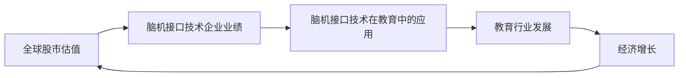

# 全球股市估值与脑机接口在教育中的应用

> 关键词：全球股市估值、脑机接口、教育应用、金融分析、技术创新

> 摘要：本文深入探讨了全球股市估值和脑机接口在教育中的应用这两个看似不相关却又可能存在潜在联系的领域。首先详细分析全球股市估值的原理、方法及影响因素，帮助读者理解股市的运行规律和价值评估体系。接着阐述脑机接口技术的核心概念、原理以及其在教育领域的具体应用场景和优势。最后探讨两者之间可能存在的关联以及对未来金融市场和教育行业发展的影响。通过对这两个领域的研究，为投资者、教育从业者和技术爱好者提供有价值的参考和见解。

## 1. 背景介绍 
### 1.1 目的和范围
本文章的主要目的是全面深入地探讨全球股市估值的方法和原理，以及脑机接口技术在教育领域的应用现状和未来发展趋势。在全球股市估值方面，我们将涵盖各种主流的估值模型和方法，分析影响股市估值的宏观和微观因素，旨在帮助投资者和金融从业者更好地理解股市的内在价值和波动规律。对于脑机接口在教育中的应用，我们将研究其技术原理、实际应用场景以及可能带来的教育变革，为教育工作者和技术开发者提供有益的参考。

### 1.2 预期读者
本文预期读者包括金融领域的投资者、分析师、基金经理，他们可以从全球股市估值的分析中获取投资决策的依据；教育行业的教师、教育研究者和教育政策制定者，能够从脑机接口在教育中的应用中获得创新教育方法的灵感；同时，对科技和金融交叉领域感兴趣的普通读者也能通过本文了解到这两个前沿领域的最新动态和发展趋势。

### 1.3 文档结构概述
本文将按照以下结构展开：首先介绍相关的背景知识和核心概念，包括全球股市估值的基本概念和脑机接口技术的原理；接着详细阐述全球股市估值的核心算法原理和具体操作步骤，以及脑机接口在教育中应用的技术实现和应用场景；然后通过数学模型和公式对股市估值和脑机接口技术进行深入分析，并结合实际案例进行说明；之后介绍在实际项目中如何进行开发和应用，包括开发环境搭建、源代码实现和代码解读；再探讨全球股市估值和脑机接口在教育中应用的实际场景和相关工具资源推荐；最后对未来的发展趋势和挑战进行总结，并提供常见问题解答和扩展阅读资料。

### 1.4 术语表
#### 1.4.1 核心术语定义
- **全球股市估值**：指对全球范围内各个股票市场中上市公司的价值进行评估和衡量的过程，通过各种方法和指标来确定股票的合理价格和市场的整体估值水平。
- **脑机接口（Brain-Computer Interface，BCI）**：一种不依赖于常规大脑信息输出通路（外周神经和肌肉）的通信系统，它能够实现大脑与外部设备之间的直接信息交换，将大脑活动转化为可识别的信号，从而控制外部设备或接收外部信息反馈。
- **市盈率（Price-Earnings Ratio，P/E）**：是股票价格除以每股收益的比率，用于衡量股票的估值水平，反映了投资者为获取公司每一元盈利所愿意支付的价格。
- **市净率（Price-Book Ratio，P/B）**：是股票价格与每股净资产的比率，用于评估公司的市场价值与账面价值之间的关系，反映了市场对公司资产质量和盈利能力的预期。

#### 1.4.2 相关概念解释
- **股市泡沫**：指股票市场价格脱离公司基本面价值而大幅上涨的现象，通常是由于投资者的过度乐观和投机行为导致的，最终可能引发市场的大幅下跌。
- **教育个性化**：根据每个学生的学习能力、兴趣爱好、学习风格等个体差异，提供定制化的教育内容和教学方法，以提高学习效果和满足学生的个性化需求。
- **神经可塑性**：指大脑在经历学习、训练或损伤等过程中，其结构和功能发生改变的能力，脑机接口技术可以利用神经可塑性来促进学习和康复。

#### 1.4.3 缩略词列表
- **BCI**：Brain-Computer Interface（脑机接口）
- **P/E**：Price-Earnings Ratio（市盈率）
- **P/B**：Price-Book Ratio（市净率）
- **GDP**：Gross Domestic Product（国内生产总值）

## 2. 核心概念与联系 

### 2.1 全球股市估值的核心概念
全球股市估值是金融领域的一个重要概念，它旨在确定股票市场中上市公司的合理价值。股市估值的结果对于投资者的投资决策、公司的融资和并购活动以及金融市场的稳定都具有重要影响。

股市估值的核心在于比较股票的市场价格与公司的内在价值。内在价值是指公司未来预期现金流的现值，它反映了公司的盈利能力、资产质量、成长潜力等基本面因素。如果股票的市场价格低于其内在价值，那么该股票被认为是低估的，具有投资价值；反之，如果市场价格高于内在价值，则股票被高估，投资风险较大。

常见的股市估值方法包括相对估值法和绝对估值法。相对估值法是通过比较同行业或类似公司的估值指标，如市盈率、市净率等，来评估目标公司的价值。绝对估值法是基于公司的未来现金流预测，通过折现模型计算公司的内在价值，如现金流折现模型（DCF）。

### 2.2 脑机接口技术的核心概念
脑机接口技术是一种将大脑与外部设备直接连接的技术，它打破了传统的通过肌肉和神经进行信息输出的方式，实现了大脑与机器之间的直接通信。

脑机接口技术的核心原理是通过记录大脑的电活动、磁活动或代谢活动等信号，对这些信号进行分析和处理，提取出大脑的意图信息，然后将这些信息转化为控制指令，驱动外部设备执行相应的操作。常见的脑机接口信号包括脑电图（EEG）、脑磁图（MEG）、功能磁共振成像（fMRI）等。

脑机接口技术的应用领域非常广泛，包括医疗康复、娱乐游戏、智能家居、军事等。在教育领域，脑机接口技术可以为学生提供更加个性化、高效的学习体验，促进教育的创新和发展。

### 2.3 全球股市估值与脑机接口在教育中应用的联系
虽然全球股市估值和脑机接口在教育中的应用看似是两个不同的领域，但它们之间可能存在一些潜在的联系。

一方面，脑机接口技术的发展和应用可能会对相关上市公司的业绩和估值产生影响。随着脑机接口技术在教育领域的逐渐普及，相关的科技公司可能会获得更多的市场份额和收入增长，从而提高其在股市中的估值。例如，一些专注于脑机接口技术研发和应用的企业，其股价可能会随着技术的突破和市场需求的增加而上涨。

另一方面，全球股市的估值情况也可能会影响脑机接口技术在教育领域的发展。如果股市处于牛市，投资者对科技行业的信心较高，可能会有更多的资金流入脑机接口技术相关的企业，促进技术的研发和应用。相反，如果股市处于熊市，企业的融资难度增加，可能会影响脑机接口技术在教育领域的推广和应用速度。

### 2.4 文本示意图和 Mermaid 流程图

#### 2.4.1 文本示意图
全球股市估值与脑机接口在教育中应用的关系可以用以下文本示意图表示：

全球股市估值 <-> 脑机接口技术企业业绩 <-> 脑机接口技术在教育中的应用 <-> 教育行业发展 <-> 经济增长 <-> 全球股市估值

这个示意图展示了全球股市估值与脑机接口在教育中应用之间的循环影响关系。全球股市估值影响脑机接口技术企业的融资和发展，进而影响脑机接口技术在教育中的应用；教育行业的发展会促进经济增长，经济增长又会对全球股市估值产生影响。

#### 2.4.2 Mermaid 流程图


这个流程图直观地展示了全球股市估值与脑机接口在教育中应用之间的相互影响关系，形成了一个闭环的反馈系统。

## 3. 核心算法原理 & 具体操作步骤 

### 3.1 全球股市估值的核心算法原理及 Python 实现

#### 3.1.1 市盈率估值法
市盈率估值法是一种常用的相对估值法，它通过比较目标公司的市盈率与同行业或市场平均市盈率，来评估目标公司的股票价值。

市盈率的计算公式为：

$P/E = \frac{股票价格}{每股收益}$

根据市盈率估值法，目标公司的合理股票价格可以通过以下公式计算：

$合理股票价格 = 每股收益 \times 可比公司平均市盈率$

以下是使用 Python 实现市盈率估值法的代码示例：

```python
# 定义每股收益和可比公司平均市盈率
eps = 2.5  # 每股收益
pe_ratio = 15  # 可比公司平均市盈率

# 计算合理股票价格
fair_price = eps * pe_ratio

print(f"目标公司的合理股票价格为: {fair_price} 元")
```

#### 3.1.2 现金流折现模型（DCF）
现金流折现模型是一种绝对估值法，它通过预测公司未来的现金流，并将其折现到当前时刻，来计算公司的内在价值。

现金流折现模型的基本公式为：

$V = \sum_{t=1}^{n} \frac{CF_t}{(1 + r)^t} + \frac{TV}{(1 + r)^n}$

其中，$V$ 表示公司的内在价值，$CF_t$ 表示第 $t$ 期的现金流，$r$ 表示折现率，$TV$ 表示终值，$n$ 表示预测期数。

以下是使用 Python 实现现金流折现模型的代码示例：

```python
import numpy as np

# 定义参数
cash_flows = [100, 120, 150, 180, 200]  # 未来 5 年的现金流
discount_rate = 0.1  # 折现率
terminal_growth_rate = 0.03  # 终值增长率

# 计算终值
terminal_value = cash_flows[-1] * (1 + terminal_growth_rate) / (discount_rate - terminal_growth_rate)

# 计算现金流现值
discounted_cash_flows = []
for i, cf in enumerate(cash_flows):
    discounted_cf = cf / (1 + discount_rate) ** (i + 1)
    discounted_cash_flows.append(discounted_cf)

# 计算终值现值
discounted_terminal_value = terminal_value / (1 + discount_rate) ** len(cash_flows)

# 计算公司内在价值
intrinsic_value = np.sum(discounted_cash_flows) + discounted_terminal_value

print(f"公司的内在价值为: {intrinsic_value} 元")
```

### 3.2 脑机接口在教育中应用的核心算法原理及 Python 实现

#### 3.2.1 脑电图（EEG）信号处理
脑电图（EEG）是脑机接口中最常用的信号之一，它记录了大脑皮层的电活动。在教育中，EEG 信号可以用于监测学生的学习状态，如注意力、疲劳程度等。

EEG 信号处理的主要步骤包括滤波、特征提取和分类。以下是一个简单的 EEG 信号处理的 Python 代码示例：

```python
import numpy as np
import scipy.signal as signal
from sklearn.svm import SVC
from sklearn.model_selection import train_test_split
from sklearn.metrics import accuracy_score

# 生成模拟 EEG 信号
np.random.seed(0)
n_samples = 1000
eeg_signal = np.random.randn(n_samples)

# 滤波处理
fs = 100  # 采样频率
lowcut = 1  # 低频截止频率
highcut = 30  # 高频截止频率
nyquist = 0.5 * fs
low = lowcut / nyquist
high = highcut / nyquist
b, a = signal.butter(4, [low, high], btype='band')
filtered_signal = signal.lfilter(b, a, eeg_signal)

# 特征提取
# 这里简单使用信号的均值和标准差作为特征
features = [np.mean(filtered_signal), np.std(filtered_signal)]

# 生成模拟标签
labels = np.random.randint(0, 2, n_samples)

# 划分训练集和测试集
X_train, X_test, y_train, y_test = train_test_split([features] * n_samples, labels, test_size=0.2, random_state=42)

# 训练分类器
clf = SVC()
clf.fit(X_train, y_train)

# 预测
y_pred = clf.predict(X_test)

# 计算准确率
accuracy = accuracy_score(y_test, y_pred)
print(f"分类准确率为: {accuracy}")
```

#### 3.2.2 基于脑机接口的学习状态监测
在教育中，脑机接口可以用于实时监测学生的学习状态，如注意力、兴趣度等。通过分析学生的脑电信号，可以判断学生是否处于专注学习状态，并及时调整教学策略。

以下是一个简单的基于脑机接口的学习状态监测的 Python 代码示例：

```python
import numpy as np
import scipy.signal as signal

# 模拟脑电信号
np.random.seed(0)
n_samples = 1000
eeg_signal = np.random.randn(n_samples)

# 滤波处理
fs = 100  # 采样频率
lowcut = 1  # 低频截止频率
highcut = 30  # 高频截止频率
nyquist = 0.5 * fs
low = lowcut / nyquist
high = highcut / nyquist
b, a = signal.butter(4, [low, high], btype='band')
filtered_signal = signal.lfilter(b, a, eeg_signal)

# 计算注意力指标
# 这里简单使用信号的能量作为注意力指标
attention_index = np.sum(filtered_signal ** 2)

# 判断学习状态
if attention_index > 100:
    print("学生处于专注学习状态")
else:
    print("学生注意力不集中")
```

## 4. 数学模型和公式 & 详细讲解 & 举例说明 

### 4.1 全球股市估值的数学模型和公式

#### 4.1.1 市盈率估值法
市盈率估值法的核心公式为：

$P/E = \frac{股票价格}{每股收益}$

其中，$P/E$ 表示市盈率，股票价格是指股票在市场上的交易价格，每股收益是指公司每股股票的盈利。

市盈率估值法的原理是假设同行业或类似公司具有相似的盈利能力和市场估值水平。通过比较目标公司的市盈率与同行业或市场平均市盈率，可以判断目标公司的股票是否被低估或高估。

例如，假设同行业公司的平均市盈率为 20，目标公司的每股收益为 3 元，那么根据市盈率估值法，目标公司的合理股票价格为：

$合理股票价格 = 每股收益 \times 可比公司平均市盈率 = 3 \times 20 = 60$（元）

如果目标公司的当前股票价格为 50 元，那么该股票被认为是低估的，具有投资价值；反之，如果当前股票价格为 70 元，那么股票被高估，投资风险较大。

#### 4.1.2 市净率估值法
市净率估值法的公式为：

$P/B = \frac{股票价格}{每股净资产}$

其中，$P/B$ 表示市净率，每股净资产是指公司每股股票所对应的净资产价值。

市净率估值法的原理是通过比较公司的市场价值与账面价值之间的关系，来评估公司的投资价值。一般来说，市净率较低的公司可能被认为是被低估的，具有投资价值；而市净率较高的公司可能存在估值泡沫，投资风险较大。

例如，假设目标公司的每股净资产为 10 元，市净率为 1.5，那么目标公司的股票价格为：

$股票价格 = 每股净资产 \times 市净率 = 10 \times 1.5 = 15$（元）

#### 4.1.3 现金流折现模型（DCF）
现金流折现模型的基本公式为：

$V = \sum_{t=1}^{n} \frac{CF_t}{(1 + r)^t} + \frac{TV}{(1 + r)^n}$

其中，$V$ 表示公司的内在价值，$CF_t$ 表示第 $t$ 期的现金流，$r$ 表示折现率，$TV$ 表示终值，$n$ 表示预测期数。

现金流折现模型的原理是将公司未来的现金流折现到当前时刻，以反映这些现金流的时间价值。折现率 $r$ 通常采用公司的加权平均资本成本（WACC），它反映了投资者对公司投资的预期回报率。

终值 $TV$ 是指预测期结束后公司的持续经营价值，通常采用永续增长模型计算：

$TV = \frac{CF_n \times (1 + g)}{r - g}$

其中，$CF_n$ 表示预测期最后一期的现金流，$g$ 表示终值增长率。

例如，假设某公司未来 5 年的现金流分别为 100 万元、120 万元、150 万元、180 万元、200 万元，折现率为 10%，终值增长率为 3%。则该公司的内在价值计算如下：

首先，计算终值：

$TV = \frac{200 \times (1 + 0.03)}{0.1 - 0.03} = \frac{206}{0.07} \approx 2942.86$（万元）

然后，计算各期现金流的现值：

$PV_1 = \frac{100}{(1 + 0.1)^1} \approx 90.91$（万元）

$PV_2 = \frac{120}{(1 + 0.1)^2} \approx 99.17$（万元）

$PV_3 = \frac{150}{(1 + 0.1)^3} \approx 112.70$（万元）

$PV_4 = \frac{180}{(1 + 0.1)^4} \approx 122.94$（万元）

$PV_5 = \frac{200}{(1 + 0.1)^5} \approx 124.18$（万元）

最后，计算公司的内在价值：

$V = PV_1 + PV_2 + PV_3 + PV_4 + PV_5 + \frac{TV}{(1 + 0.1)^5} \approx 90.91 + 99.17 + 112.70 + 122.94 + 124.18 + \frac{2942.86}{(1 + 0.1)^5} \approx 2013.6$（万元）

### 4.2 脑机接口在教育中应用的数学模型和公式

#### 4.2.1 脑电图（EEG）信号处理
脑电图（EEG）信号处理中常用的数学模型和公式包括滤波和特征提取。

##### 滤波
在 EEG 信号处理中，常用的滤波方法是巴特沃斯滤波器。巴特沃斯滤波器的传递函数为：

$H(s) = \frac{1}{\sqrt{1 + (\frac{s}{\omega_c})^{2n}}}$

其中，$s$ 是复变量，$\omega_c$ 是截止频率，$n$ 是滤波器的阶数。

在离散时间域中，巴特沃斯滤波器的差分方程可以通过双线性变换得到。例如，对于二阶巴特沃斯低通滤波器，其差分方程为：

$y[n] = b_0x[n] + b_1x[n - 1] + b_2x[n - 2] - a_1y[n - 1] - a_2y[n - 2]$

其中，$x[n]$ 是输入信号，$y[n]$ 是输出信号，$b_0$、$b_1$、$b_2$、$a_1$、$a_2$ 是滤波器的系数。

##### 特征提取
在 EEG 信号处理中，常用的特征包括时域特征、频域特征和时频域特征。例如，时域特征中的均值和标准差的计算公式分别为：

$均值 = \frac{1}{N} \sum_{i=1}^{N} x_i$

$标准差 = \sqrt{\frac{1}{N} \sum_{i=1}^{N} (x_i - \bar{x})^2}$

其中，$x_i$ 是 EEG 信号的第 $i$ 个样本，$N$ 是样本总数，$\bar{x}$ 是信号的均值。

#### 4.2.2 基于脑机接口的学习状态监测
在基于脑机接口的学习状态监测中，常用的数学模型是分类模型，如支持向量机（SVM）。支持向量机的目标是找到一个最优的超平面，将不同类别的样本分开。

对于线性可分的情况，支持向量机的优化问题可以表示为：

$\min_{\mathbf{w}, b} \frac{1}{2} \mathbf{w}^T \mathbf{w}$

$s.t. \quad y_i(\mathbf{w}^T \mathbf{x}_i + b) \geq 1, \quad i = 1, 2, \cdots, N$

其中，$\mathbf{w}$ 是超平面的法向量，$b$ 是偏置项，$\mathbf{x}_i$ 是第 $i$ 个样本的特征向量，$y_i$ 是第 $i$ 个样本的标签，$N$ 是样本总数。

通过求解上述优化问题，可以得到最优的超平面参数 $\mathbf{w}$ 和 $b$，从而实现样本的分类。

## 5. 项目实战：代码实际案例和详细解释说明 

### 5.1  开发环境搭建

#### 5.1.1 全球股市估值项目开发环境搭建
- **Python 环境**：首先需要安装 Python 编程语言，建议使用 Python 3.7 及以上版本。可以从 Python 官方网站（https://www.python.org/downloads/）下载并安装。
- **相关库**：安装用于数据处理、分析和可视化的库，如 Pandas、Numpy、Matplotlib 等。可以使用 pip 命令进行安装：
```sh
pip install pandas numpy matplotlib
```
- **数据获取**：可以使用第三方数据接口，如 Tushare、Yahoo Finance 等获取全球股市数据。以 Tushare 为例，需要注册并获取 API Token，然后安装 Tushare 库：
```sh
pip install tushare
```

#### 5.1.2 脑机接口在教育中应用项目开发环境搭建
- **Python 环境**：同样需要安装 Python 3.7 及以上版本。
- **相关库**：安装用于脑电信号处理和机器学习的库，如 MNE、Scikit-learn 等。可以使用 pip 命令进行安装：
```sh
pip install mne scikit-learn
```
- **硬件设备**：需要使用脑电采集设备，如 Emotiv Insight、OpenBCI 等，将设备与计算机连接，并安装相应的驱动程序。

### 5.2  源代码详细实现和代码解读

#### 5.2.1 全球股市估值项目源代码实现和解读
以下是一个使用 Tushare 获取全球股市数据并进行市盈率估值的代码示例：

```python
import tushare as ts

# 设置 Tushare API Token
ts.set_token('your_token')
pro = ts.pro_api()

# 获取某只股票的基本信息
df = pro.daily_basic(ts_code='000001.SZ', trade_date='20231001', fields='ts_code,trade_date,pe_ttm,eps')

# 提取市盈率和每股收益
pe_ratio = df['pe_ttm'].values[0]
eps = df['eps'].values[0]

# 计算合理股票价格
fair_price = eps * pe_ratio

print(f"目标股票的合理股票价格为: {fair_price} 元")
```

代码解读：
1. **设置 Tushare API Token**：使用 `ts.set_token` 方法设置 Tushare 的 API Token，然后使用 `ts.pro_api` 创建 API 对象。
2. **获取股票基本信息**：使用 `pro.daily_basic` 方法获取某只股票的基本信息，包括市盈率（`pe_ttm`）和每股收益（`eps`）。
3. **计算合理股票价格**：根据市盈率估值法的公式，计算目标股票的合理股票价格。
4. **输出结果**：使用 `print` 函数输出计算结果。

#### 5.2.2 脑机接口在教育中应用项目源代码实现和解读
以下是一个使用 MNE 库处理脑电信号并进行特征提取的代码示例：

```python
import mne
import numpy as np

# 读取脑电数据
raw = mne.io.read_raw_fif('your_eeg_data.fif')

# 滤波处理
raw.filter(l_freq=1, h_freq=30)

# 提取 epochs
events = mne.find_events(raw)
epochs = mne.Epochs(raw, events, tmin=-0.2, tmax=0.5)

# 特征提取
data = epochs.get_data()
mean_features = np.mean(data, axis=2)
std_features = np.std(data, axis=2)

print(f"特征提取完成，均值特征形状: {mean_features.shape}，标准差特征形状: {std_features.shape}")
```

代码解读：
1. **读取脑电数据**：使用 `mne.io.read_raw_fif` 方法读取脑电数据文件。
2. **滤波处理**：使用 `raw.filter` 方法对脑电数据进行滤波处理，设置低频截止频率为 1Hz，高频截止频率为 30Hz。
3. **提取 epochs**：使用 `mne.find_events` 方法找到事件标记，然后使用 `mne.Epochs` 方法提取 epochs。
4. **特征提取**：使用 `epochs.get_data` 方法获取 epochs 的数据，然后计算数据的均值和标准差作为特征。
5. **输出结果**：使用 `print` 函数输出特征提取的结果。

### 5.3  代码解读与分析

#### 5.3.1 全球股市估值项目代码分析
在全球股市估值项目中，代码的主要功能是获取股票的基本信息，并使用市盈率估值法计算股票的合理价格。代码的优点是简单易懂，使用 Tushare 库可以方便地获取全球股市数据。然而，该代码也存在一些局限性，例如只考虑了市盈率这一种估值方法，没有考虑其他因素对股票估值的影响。在实际应用中，可以结合多种估值方法，如市净率估值法、现金流折现模型等，进行更全面的股票估值。

#### 5.3.2 脑机接口在教育中应用项目代码分析
在脑机接口在教育中应用项目中，代码的主要功能是读取脑电数据，进行滤波处理和特征提取。代码使用了 MNE 库，该库提供了丰富的脑电信号处理工具，方便开发者进行脑电数据的处理和分析。然而，该代码只是一个简单的示例，在实际应用中，还需要进一步进行特征选择、分类模型训练等步骤，以实现更准确的学习状态监测。

## 6. 实际应用场景 

### 6.1 全球股市估值的实际应用场景

#### 6.1.1 投资决策
全球股市估值对于投资者的投资决策具有重要指导意义。投资者可以通过分析股票的估值情况，判断股票是否被低估或高估，从而决定是否买入或卖出股票。例如，如果某只股票的市盈率低于同行业平均水平，且公司的基本面良好，那么该股票可能被低估，具有投资价值，投资者可以考虑买入；反之，如果股票的市盈率过高，且存在业绩下滑等风险因素，那么投资者应该谨慎投资或卖出股票。

#### 6.1.2 公司融资和并购
公司在进行融资和并购活动时，需要对自身的价值进行评估。股市估值可以为公司提供一个参考价值，帮助公司确定合理的融资规模和并购价格。例如，在进行股权融资时，公司可以根据自身的估值情况，确定发行股票的数量和价格，以吸引投资者；在进行并购时，收购方可以通过对目标公司的估值，判断并购是否具有经济可行性。

#### 6.1.3 宏观经济分析
全球股市估值的变化可以反映宏观经济的运行状况。当股市估值整体上升时，通常意味着市场对经济前景的预期较为乐观，投资者愿意为股票支付更高的价格；反之，当股市估值下降时，可能预示着经济面临下行压力。因此，政府和金融机构可以通过监测股市估值的变化，及时调整宏观经济政策，以维护金融市场的稳定。

### 6.2 脑机接口在教育中的实际应用场景

#### 6.2.1 个性化学习
脑机接口技术可以实时监测学生的学习状态，如注意力、兴趣度等。根据学生的脑电信号反馈，教育系统可以为学生提供个性化的学习内容和教学方法。例如，当监测到学生注意力不集中时，系统可以自动调整教学节奏或更换教学内容，以提高学生的学习积极性和效果。

#### 6.2.2 特殊教育
对于一些特殊学生，如自闭症、多动症等，脑机接口技术可以为他们提供一种新的学习和交流方式。通过脑机接口设备，特殊学生可以直接将大脑的意图转化为指令，控制外部设备进行学习和交流，从而提高他们的学习能力和生活质量。

#### 6.2.3 教师培训
脑机接口技术可以用于教师培训，帮助教师更好地了解学生的学习状态和需求。通过监测学生的脑电信号，教师可以及时调整教学策略，提高教学效果。同时，脑机接口技术还可以为教师提供教学反馈，帮助教师不断改进教学方法和提高教学水平。

## 7. 工具和资源推荐

### 7.1 学习资源推荐

#### 7.1.1 书籍推荐
- 《证券分析》（Security Analysis）：由本杰明·格雷厄姆（Benjamin Graham）和戴维·多德（David Dodd）所著，是价值投资领域的经典著作，详细介绍了股票估值的方法和原理。
- 《脑机接口：原理与应用》（Brain-Computer Interfaces: Principles and Practice）：由雅克·沃尔帕（Jacques J. Vidal）所著，全面介绍了脑机接口技术的基本原理、信号处理方法和应用领域。
- 《Python 数据分析实战》（Python for Data Analysis）：由韦斯·麦金尼（Wes McKinney）所著，详细介绍了使用 Python 进行数据分析的方法和技巧，适合初学者学习。

#### 7.1.2 在线课程
- Coursera 上的“Financial Markets”课程：由耶鲁大学教授罗伯特·席勒（Robert Shiller）主讲，介绍了金融市场的基本原理和投资策略。
- edX 上的“Brain-Computer Interfaces”课程：由瑞士联邦理工学院（ETH Zurich）的教授主讲，系统介绍了脑机接口技术的理论和实践。
- 慕课网上的“Python 数据分析入门”课程：适合初学者学习 Python 数据分析的基础知识和技能。

#### 7.1.3 技术博客和网站
- Seeking Alpha：是一个提供金融市场分析和投资建议的网站，有很多专业的分析师和投资者分享他们的观点和研究成果。
- NeurotechX：是一个专注于神经技术领域的社区网站，提供脑机接口技术的最新研究动态和应用案例。
- 博客园和 CSDN：是国内知名的技术博客平台，有很多开发者分享关于股市估值和脑机接口技术的学习经验和代码实现。

### 7.2 开发工具框架推荐

#### 7.2.1 IDE和编辑器
- PyCharm：是一款专门为 Python 开发设计的集成开发环境（IDE），具有代码编辑、调试、自动补全、版本控制等功能，适合开发全球股市估值和脑机接口相关的 Python 项目。
- Jupyter Notebook：是一个基于网页的交互式开发环境，支持多种编程语言，适合进行数据探索、分析和可视化。在股市估值和脑机接口数据处理中，Jupyter Notebook 可以方便地进行代码编写和结果展示。
- Visual Studio Code：是一款轻量级的代码编辑器，支持多种编程语言和插件扩展。它具有丰富的代码编辑功能和调试工具，适合快速开发和调试项目。

#### 7.2.2 调试和性能分析工具
- Py-Spy：是一个用于 Python 代码性能分析的工具，它可以实时监测 Python 程序的 CPU 使用情况和函数调用栈，帮助开发者找出性能瓶颈。
- pdb：是 Python 内置的调试器，它可以在代码中设置断点，逐行执行代码，查看变量的值和程序的执行流程，方便开发者进行代码调试。
- MNE-BIDS：是一个用于脑电数据处理和分析的工具包，它提供了一系列的函数和工具，用于数据读取、预处理、特征提取和可视化，同时支持 BIDS 数据格式，方便数据的管理和共享。

#### 7.2.3 相关框架和库
- Pandas：是一个用于数据处理和分析的 Python 库，它提供了高效的数据结构和数据操作方法，适合处理全球股市数据和脑电数据。
- Scikit-learn：是一个用于机器学习的 Python 库，它提供了丰富的机器学习算法和工具，如分类、回归、聚类等，适合进行股市估值模型训练和脑机接口信号分类。
- TensorFlow 和 PyTorch：是两个流行的深度学习框架，它们提供了强大的深度学习模型构建和训练功能，适合处理复杂的脑机接口信号处理和分析任务。

### 7.3 相关论文著作推荐

#### 7.3.1 经典论文
- Fama, E. F., & French, K. R. (1992). The cross-section of expected stock returns. The Journal of Finance, 47(2), 427-465. 该论文提出了著名的 Fama-French 三因子模型，对股票收益率的横截面进行了深入分析，是股市估值领域的经典之作。
- Wolpaw, J. R., Birbaumer, N., McFarland, D. J., Pfurtscheller, G., & Vaughan, T. M. (2002). Brain-computer interfaces for communication and control. Clinical neurophysiology, 113(6), 767-791. 该论文是脑机接口领域的经典综述论文，系统介绍了脑机接口技术的基本概念、发展历程和应用前景。

#### 7.3.2 最新研究成果
- 关注《Journal of Financial Economics》《Neuron》《Nature Biotechnology》等顶级学术期刊，这些期刊经常发表关于全球股市估值和脑机接口技术的最新研究成果。

#### 7.3.3 应用案例分析
- 可以参考一些知名金融机构和科技公司的研究报告和案例分析，如高盛、摩根大通等金融机构的股市研究报告，以及 Facebook、Neuralink 等科技公司的脑机接口技术应用案例。

## 8. 总结：未来发展趋势与挑战

### 8.1 全球股市估值的未来发展趋势与挑战

#### 8.1.1 发展趋势
- **智能化和自动化**：随着人工智能和机器学习技术的发展，股市估值将越来越智能化和自动化。投资者可以使用智能算法和模型对大量的股市数据进行分析和处理，快速准确地评估股票的价值。
- **全球化和多元化**：全球股市的互联互通日益加强，投资者将更加关注全球范围内的股市估值情况。同时，股市估值的方法和指标也将更加多元化，除了传统的市盈率、市净率等指标外，还将引入更多的非财务指标，如创新能力、社会责任等。
- **与宏观经济的深度融合**：股市估值将更加紧密地与宏观经济因素相结合。投资者将更加关注宏观经济政策、经济周期、地缘政治等因素对股市估值的影响，以制定更加合理的投资策略。

#### 8.1.2 挑战
- **数据质量和可靠性**：股市估值需要大量的准确数据作为支撑，但数据的质量和可靠性往往受到多种因素的影响，如数据采集方法、数据来源、数据更新频率等。因此，如何保证数据的质量和可靠性是股市估值面临的一个重要挑战。
- **模型的局限性**：目前的股市估值模型大多基于历史数据和假设，存在一定的局限性。在市场环境发生剧烈变化时，这些模型可能无法准确反映股票的真实价值。因此，需要不断改进和完善股市估值模型，提高其适应性和准确性。
- **市场情绪和投资者行为的影响**：股市估值不仅受到公司基本面因素的影响，还受到市场情绪和投资者行为的影响。投资者的恐慌、贪婪等情绪可能导致股市价格的大幅波动，从而影响股市估值的准确性。如何准确评估市场情绪和投资者行为对股市估值的影响，是一个亟待解决的问题。

### 8.2 脑机接口在教育中应用的未来发展趋势与挑战

#### 8.2.1 发展趋势
- **技术的不断创新和进步**：随着神经科学、信号处理、机器学习等技术的不断发展，脑机接口技术将不断创新和进步。未来的脑机接口设备将更加小型化、便携化、高精度化，信号处理和分析方法也将更加先进和高效。
- **应用场景的不断拓展**：脑机接口在教育中的应用场景将不断拓展，除了个性化学习、特殊教育和教师培训外，还将应用于虚拟学习环境、教育游戏等领域。脑机接口技术将为教育带来更多的创新和变革。
- **与其他技术的融合发展**：脑机接口技术将与虚拟现实（VR）、增强现实（AR）、人工智能等技术融合发展，创造出更加沉浸式、个性化的学习体验。例如，结合 VR 技术，学生可以身临其境地学习历史、地理等知识；结合人工智能技术，教育系统可以根据学生的脑电信号自动调整教学策略，实现真正的个性化教育。

#### 8.2.2 挑战
- **技术的安全性和可靠性**：脑机接口技术涉及到人体的大脑活动和隐私信息，因此技术的安全性和可靠性至关重要。如何保证脑机接口设备的安全性，防止数据泄露和恶意攻击，是一个需要解决的问题。
- **伦理和法律问题**：脑机接口技术的应用可能会引发一系列的伦理和法律问题，如隐私保护、人权问题、责任界定等。例如，脑机接口设备记录的个人大脑活动信息是否可以被他人获取和使用，如何保障个人的隐私权和自主权等。
- **社会接受度**：脑机接口技术在教育中的应用还面临着社会接受度的挑战。一些人可能对脑机接口技术存在疑虑和担忧，担心其会对人类的认知和行为产生不良影响。因此，需要加强对脑机接口技术的宣传和科普，提高社会对该技术的认知和接受度。

## 9. 附录：常见问题与解答

### 9.1 全球股市估值相关问题

#### 9.1.1 问：市盈率估值法有哪些局限性？
答：市盈率估值法的局限性主要包括以下几点：
- **行业差异**：不同行业的市盈率水平可能存在较大差异，不能简单地将不同行业的公司进行比较。例如，科技行业的市盈率通常较高，而传统制造业的市盈率相对较低。
- **盈利波动**：如果公司的盈利存在较大波动，市盈率可能无法准确反映公司的真实价值。例如，一些周期性行业的公司，其盈利会随着经济周期的变化而波动，此时市盈率可能会出现较大的波动。
- **会计政策**：不同公司的会计政策可能不同，这会影响每股收益的计算，从而导致市盈率的可比性降低。例如，一些公司可能采用激进的会计政策，高估了每股收益，从而使市盈率看起来较低。

#### 9.1.2 问：现金流折现模型的关键参数有哪些？如何确定这些参数？
答：现金流折现模型的关键参数包括未来现金流预测、折现率和终值增长率。

- **未来现金流预测**：需要对公司未来的经营情况进行分析和预测，考虑公司的市场份额、产品竞争力、行业发展趋势等因素。可以参考公司的历史财务数据、行业研究报告和分析师的预测等。
- **折现率**：通常采用公司的加权平均资本成本（WACC），它反映了投资者对公司投资的预期回报率。WACC 的计算需要考虑公司的股权成本和债务成本，可以使用资本资产定价模型（CAPM）等方法计算股权成本。
- **终值增长率**：是指预测期结束后公司的持续经营增长率。终值增长率的确定需要考虑行业的长期发展趋势、公司的竞争优势等因素。一般来说，终值增长率应该低于宏观经济的长期增长率。

### 9.2 脑机接口在教育中应用相关问题

#### 9.2.1 问：脑机接口设备的准确性和可靠性如何？
答：脑机接口设备的准确性和可靠性受到多种因素的影响，如设备的质量、信号处理方法、个体差异等。目前，脑机接口技术还处于发展阶段，设备的准确性和可靠性还有待提高。

一些研究表明，脑机接口设备在特定任务中的分类准确率可以达到 70% - 90% 左右，但在实际应用中，由于环境干扰、个体差异等因素的影响，准确率可能会有所下降。为了提高脑机接口设备的准确性和可靠性，需要不断改进设备的设计和信号处理方法，同时进行大量的实验和验证。

#### 9.2.2 问：脑机接口技术在教育中的应用是否会侵犯学生的隐私？
答：脑机接口技术在教育中的应用可能会涉及到学生的大脑活动信息，这些信息属于个人隐私范畴。为了保护学生的隐私，需要采取一系列的措施：
- **数据加密**：对脑机接口设备采集到的学生大脑活动数据进行加密处理，防止数据在传输和存储过程中被泄露。
- **严格的数据使用规定**：制定严格的数据使用规定，明确数据的使用目的、范围和权限，确保数据只能用于教育相关的研究和应用，不得用于其他目的。
- **学生和家长的知情同意**：在使用脑机接口技术之前，需要向学生和家长充分说明技术的原理、应用场景和可能存在的风险，获得他们的知情同意。

## 10. 扩展阅读 & 参考资料

### 10.1 扩展阅读
- 《金融炼金术》（The Alchemy of Finance）：由乔治·索罗斯（George Soros）所著，探讨了金融市场的运行规律和投资者的心理行为，对全球股市估值有一定的启示作用。
- 《脑机革命：人机融合如何改变未来》（The Brain Machine Interface Revolution: How the Mind and Machine Will Merge to Transform the Future）：由雷·库兹韦尔（Ray Kurzweil）所著，展望了脑机接口技术的未来发展前景和对人类社会的影响。

### 10.2 参考资料
- Tushare 官方文档：https://tushare.pro/document/1
- MNE 官方文档：https://mne.tools/stable/index.html
- Scikit-learn 官方文档：https://scikit-learn.org/stable/

作者：AI天才研究院/AI Genius Institute & 禅与计算机程序设计艺术 /Zen And The Art of Computer Programming