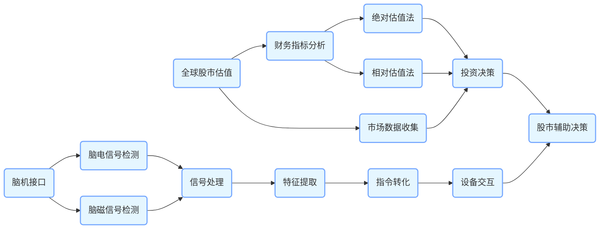

# 全球股市估值与脑机接口在辅助决策中的应用

> 关键词：全球股市估值、脑机接口、辅助决策、金融科技、人工智能

> 摘要：本文聚焦于全球股市估值以及脑机接口在辅助决策中的应用。首先介绍了全球股市估值的重要性和常用方法，接着阐述了脑机接口技术的原理和发展现状。分析了脑机接口如何在股市决策场景中发挥作用，包括获取投资者情绪数据、优化决策模型等。通过实际案例展示了两者结合的可行性和优势，并探讨了其在未来金融领域的潜在应用和面临的挑战。旨在为投资者和金融从业者提供新的思路和方法，推动金融科技的创新发展。

## 1. 背景介绍 
### 1.1 目的和范围
本文章的主要目的是深入探讨全球股市估值的方法和现状，以及脑机接口技术在股市辅助决策中的应用可能性和潜在价值。我们将研究全球不同地区股市的估值体系，分析影响股市估值的各种因素。同时，详细了解脑机接口技术的原理、发展阶段和应用场景，探讨如何将脑机接口技术与股市决策相结合，以提高决策的准确性和效率。研究范围涵盖了全球主要的股票市场，包括但不限于美国、欧洲、亚洲等地区的股市，以及脑机接口技术在医疗、科研、消费等多个领域的应用情况。

### 1.2 预期读者
本文预期读者主要包括金融领域的专业人士，如股票分析师、投资经理、基金管理人等，他们可以从文章中获取新的决策思路和方法，提升投资决策的质量。同时，计算机科学和人工智能领域的研究人员和开发者也会对脑机接口技术在金融领域的应用感兴趣，文章可以为他们提供新的研究方向和应用场景。此外，对金融科技和新兴技术有兴趣的普通投资者和爱好者也可以通过阅读本文，了解全球股市估值和脑机接口技术的基本概念和应用前景。

### 1.3 文档结构概述
本文将按照以下结构进行组织：首先介绍全球股市估值和脑机接口技术的背景信息，包括目的、预期读者和文档结构概述，以及相关的术语定义。接着阐述全球股市估值和脑机接口的核心概念和它们之间的联系，通过文本示意图和 Mermaid 流程图进行直观展示。然后详细讲解核心算法原理和具体操作步骤，使用 Python 源代码进行示例说明。再介绍相关的数学模型和公式，并通过举例进行详细讲解。之后通过项目实战部分，展示代码实际案例并进行详细解释。接着探讨实际应用场景，推荐相关的工具和资源。最后对未来发展趋势与挑战进行总结，并提供常见问题与解答以及扩展阅读和参考资料。

### 1.4 术语表
#### 1.4.1 核心术语定义
- **全球股市估值**：对全球不同地区股票市场中上市公司的价值进行评估的过程和方法，通常通过各种财务指标和市场数据来确定股票的合理价格范围。
- **脑机接口（BCI）**：一种在大脑和外部设备之间建立直接通信通道的技术，允许大脑信号被检测、解读并转化为指令，从而实现人与外部设备的交互。
- **股市辅助决策**：利用各种信息和技术手段，为投资者在股票投资决策过程中提供支持和建议，帮助他们做出更明智的投资选择。

#### 1.4.2 相关概念解释
- **市盈率（P/E）**：股票价格与每股收益的比率，是衡量股票估值的常用指标之一，反映了投资者为获取公司每股盈利所愿意支付的价格。
- **市净率（P/B）**：股票价格与每股净资产的比率，用于评估公司的市场价值相对于其账面价值的高低。
- **脑电信号（EEG）**：大脑神经元活动产生的电信号，可以通过头皮电极记录下来，是脑机接口技术中常用的信号源之一。

#### 1.4.3 缩略词列表
- **BCI**：Brain - Computer Interface（脑机接口）
- **EEG**：Electroencephalogram（脑电图，脑电信号）
- **P/E**：Price - Earnings Ratio（市盈率）
- **P/B**：Price - Book Ratio（市净率）

## 2. 核心概念与联系 
### 全球股市估值核心概念
全球股市估值是一个复杂的过程，旨在确定股票的内在价值，以便投资者做出合理的投资决策。常用的估值方法包括绝对估值法和相对估值法。绝对估值法主要基于公司的未来现金流折现来计算股票的价值，例如股利贴现模型（DDM）和自由现金流贴现模型（FCFF）。相对估值法则是通过比较公司与同行业其他公司的财务指标，如市盈率、市净率等，来评估股票的相对价值。

### 脑机接口核心概念
脑机接口技术是一种新兴的技术，它允许大脑直接与外部设备进行通信。其基本原理是通过传感器检测大脑产生的生物电信号，如脑电信号（EEG）、脑磁信号（MEG）等，然后对这些信号进行处理和分析，提取出有意义的信息，并将其转化为控制指令，从而实现人与外部设备的交互。脑机接口技术的发展经历了多个阶段，目前已经在医疗康复、游戏娱乐、智能家居等领域得到了一定的应用。

### 两者的联系
脑机接口技术可以为全球股市估值和辅助决策提供新的视角和方法。一方面，通过脑机接口技术可以获取投资者的情绪和认知状态等信息，这些信息可以作为股市估值和决策的补充因素。例如，投资者的恐惧和贪婪情绪会影响他们的投资行为，进而影响股票价格。通过监测投资者的脑电信号，可以实时了解他们的情绪状态，从而更准确地预测市场走势。另一方面，脑机接口技术可以与人工智能和机器学习算法相结合，优化股市决策模型。将脑电信号等生物信息纳入模型训练，可以提高模型的准确性和适应性。

### 文本示意图
```plaintext
全球股市估值 <---> 脑机接口
|                     |
| 财务指标、市场数据  | 脑电信号、脑磁信号
|                     |
| 绝对估值法、相对估值法 | 信号处理、特征提取
|                     |
| 投资决策            | 指令转化、设备交互
```

### Mermaid 流程图


## 3. 核心算法原理 & 具体操作步骤 
### 全球股市估值算法原理及 Python 实现
#### 市盈率估值法
市盈率估值法是一种相对估值方法，其原理是通过比较目标公司的市盈率与同行业平均市盈率，来评估目标公司股票的价值。计算公式为：

$股票价值 = 每股收益 \times 行业平均市盈率$

以下是使用 Python 实现市盈率估值法的代码示例：
```python
def pe_valuation(eps, industry_pe):
    """
    市盈率估值法计算股票价值
    :param eps: 每股收益
    :param industry_pe: 行业平均市盈率
    :return: 股票价值
    """
    return eps * industry_pe

# 示例数据
eps = 2.5
industry_pe = 20

# 计算股票价值
stock_value = pe_valuation(eps, industry_pe)
print(f"使用市盈率估值法计算的股票价值为: {stock_value}")
```

#### 自由现金流贴现模型（FCFF）
自由现金流贴现模型是一种绝对估值方法，其原理是将公司未来的自由现金流折现到当前时刻，以计算公司的内在价值。计算公式为：

$V = \sum_{t=1}^{n} \frac{FCFF_t}{(1 + r)^t} + \frac{TV}{(1 + r)^n}$

其中，$V$ 是公司的内在价值，$FCFF_t$ 是第 $t$ 年的自由现金流，$r$ 是折现率，$TV$ 是终值。

以下是使用 Python 实现自由现金流贴现模型的代码示例：
```python
def fcff_valuation(fcff_list, discount_rate, terminal_value):
    """
    自由现金流贴现模型计算公司内在价值
    :param fcff_list: 未来各年的自由现金流列表
    :param discount_rate: 折现率
    :param terminal_value: 终值
    :return: 公司内在价值
    """
    n = len(fcff_list)
    present_value = 0
    for t in range(n):
        present_value += fcff_list[t] / ((1 + discount_rate) ** (t + 1))
    present_value += terminal_value / ((1 + discount_rate) ** n)
    return present_value

# 示例数据
fcff_list = [100, 120, 150, 180, 200]
discount_rate = 0.1
terminal_value = 2500

# 计算公司内在价值
company_value = fcff_valuation(fcff_list, discount_rate, terminal_value)
print(f"使用自由现金流贴现模型计算的公司内在价值为: {company_value}")
```

### 脑机接口信号处理算法原理及 Python 实现
#### 脑电信号滤波
脑电信号通常会受到各种噪声的干扰，如工频干扰、肌电干扰等。为了提高信号的质量，需要对脑电信号进行滤波处理。常用的滤波方法包括低通滤波、高通滤波和带通滤波。以下是使用 Python 的 `scipy` 库实现简单的低通滤波的代码示例：
```python
import numpy as np
from scipy.signal import butter, filtfilt

def butter_lowpass(cutoff, fs, order=5):
    nyquist = 0.5 * fs
    normal_cutoff = cutoff / nyquist
    b, a = butter(order, normal_cutoff, btype='low', analog=False)
    return b, a

def butter_lowpass_filter(data, cutoff, fs, order=5):
    b, a = butter_lowpass(cutoff, fs, order=order)
    y = filtfilt(b, a, data)
    return y

# 示例数据
fs = 100  # 采样频率
t = np.linspace(0, 1, fs, endpoint=False)
data = np.sin(2 * np.pi * 5 * t) + 0.5 * np.sin(2 * np.pi * 50 * t)  # 包含 5Hz 和 50Hz 信号

# 低通滤波
cutoff = 10  # 截止频率
filtered_data = butter_lowpass_filter(data, cutoff, fs)

import matplotlib.pyplot as plt
plt.figure(figsize=(10, 6))
plt.subplot(2, 1, 1)
plt.plot(t, data, label='Original Signal')
plt.title('Original Signal')
plt.xlabel('Time [s]')
plt.ylabel('Amplitude')
plt.legend()

plt.subplot(2, 1, 2)
plt.plot(t, filtered_data, label='Filtered Signal', color='orange')
plt.title('Filtered Signal')
plt.xlabel('Time [s]')
plt.ylabel('Amplitude')
plt.legend()

plt.tight_layout()
plt.show()
```

#### 脑电信号特征提取
脑电信号的特征提取是脑机接口技术中的关键步骤，常用的特征包括时域特征（如均值、方差）和频域特征（如功率谱密度）。以下是使用 Python 计算脑电信号功率谱密度的代码示例：
```python
from scipy.signal import welch

# 示例数据
fs = 100  # 采样频率
t = np.linspace(0, 1, fs, endpoint=False)
data = np.sin(2 * np.pi * 5 * t) + 0.5 * np.sin(2 * np.pi * 50 * t)

# 计算功率谱密度
f, Pxx = welch(data, fs, nperseg=256)

plt.figure(figsize=(10, 6))
plt.plot(f, Pxx)
plt.title('Power Spectral Density')
plt.xlabel('Frequency [Hz]')
plt.ylabel('Power/Frequency [dB/Hz]')
plt.grid(True)
plt.show()
```

## 4. 数学模型和公式 & 详细讲解 & 举例说明 
### 全球股市估值数学模型
#### 股利贴现模型（DDM）
股利贴现模型是一种基于公司未来股利分配的绝对估值模型，其基本思想是将公司未来的股利折现到当前时刻，以计算股票的内在价值。

#### 基本公式
- 零增长模型：假设公司的股利每年保持不变，即 $D_1 = D_2 = \cdots = D$，则股票的内在价值计算公式为：
$$V = \frac{D}{r}$$
其中，$V$ 是股票的内在价值，$D$ 是每年的股利，$r$ 是投资者要求的必要收益率。

- 固定增长模型：假设公司的股利每年以固定的增长率 $g$ 增长，即 $D_{t+1}=D_t(1 + g)$，则股票的内在价值计算公式为：
$$V = \frac{D_1}{r - g}$$
其中，$D_1$ 是下一年的股利，$r$ 是投资者要求的必要收益率，$g$ 是股利增长率。

#### 详细讲解
零增长模型适用于那些股利分配比较稳定，且没有明显增长趋势的公司。例如，一些成熟的公用事业公司，其业务相对稳定，每年的股利分配变化不大，可以使用零增长模型进行估值。

固定增长模型则适用于那些股利有稳定增长趋势的公司。例如，一家科技公司处于成长期，其盈利和股利每年都以一定的速度增长，就可以使用固定增长模型进行估值。

#### 举例说明
假设某公司下一年的股利 $D_1 = 2$ 元，投资者要求的必要收益率 $r = 0.1$，股利增长率 $g = 0.05$，则根据固定增长模型，该股票的内在价值为：
$$V=\frac{D_1}{r - g}=\frac{2}{0.1 - 0.05}=\frac{2}{0.05}=40$$（元）

### 脑机接口数学模型
#### 线性判别分析（LDA）
线性判别分析是一种常用的模式识别方法，在脑机接口中常用于对脑电信号进行分类。

#### 基本公式
假设有两类样本 $\mathbf{X}_1$ 和 $\mathbf{X}_2$，分别属于类别 $C_1$ 和 $C_2$，样本的特征向量为 $\mathbf{x}$。线性判别分析的目标是找到一个投影方向 $\mathbf{w}$，使得投影后两类样本的类间距离最大，类内距离最小。

类间散度矩阵 $S_b$ 和类内散度矩阵 $S_w$ 分别定义为：
$$S_b = (\mathbf{m}_1 - \mathbf{m}_2)(\mathbf{m}_1 - \mathbf{m}_2)^T$$
$$S_w=\sum_{i = 1}^{2}\sum_{\mathbf{x}\in C_i}(\mathbf{x}-\mathbf{m}_i)(\mathbf{x}-\mathbf{m}_i)^T$$
其中，$\mathbf{m}_1$ 和 $\mathbf{m}_2$ 分别是两类样本的均值向量。

投影方向 $\mathbf{w}$ 可以通过求解广义特征值问题得到：
$$S_b\mathbf{w}=\lambda S_w\mathbf{w}$$
最优投影方向 $\mathbf{w}$ 是对应于最大广义特征值的特征向量。

#### 详细讲解
线性判别分析通过寻找一个最优的投影方向，将高维的样本数据投影到一维空间中，从而实现样本的分类。在脑机接口中，不同的脑电信号模式可以看作是不同类别的样本，通过线性判别分析可以将这些信号模式进行有效分类，例如区分用户的不同意图（如向左、向右移动等）。

#### 举例说明
假设我们有两类脑电信号样本，每类样本有 10 个特征，共 20 个样本。我们可以使用 Python 的 `sklearn` 库实现线性判别分析：
```python
from sklearn.discriminant_analysis import LinearDiscriminantAnalysis
import numpy as np

# 生成示例数据
X = np.random.rand(20, 10)
y = np.array([0] * 10 + [1] * 10)

# 创建 LDA 模型
lda = LinearDiscriminantAnalysis()

# 训练模型
lda.fit(X, y)

# 预测新样本
new_sample = np.random.rand(1, 10)
prediction = lda.predict(new_sample)
print(f"预测结果: {prediction}")
```

## 5. 项目实战：代码实际案例和详细解释说明 
### 5.1  开发环境搭建
#### 安装 Python
首先，需要安装 Python 编程语言。可以从 Python 官方网站（https://www.python.org/downloads/）下载适合自己操作系统的 Python 安装包，并按照安装向导进行安装。建议安装 Python 3.7 及以上版本。

#### 安装必要的库
在项目中，我们需要使用一些 Python 库来完成全球股市估值和脑机接口信号处理的任务。可以使用 `pip` 命令来安装这些库：
```sh
pip install numpy scipy pandas matplotlib scikit-learn
```
- `numpy`：用于数值计算和数组操作。
- `scipy`：提供了科学计算和信号处理的工具。
- `pandas`：用于数据处理和分析。
- `matplotlib`：用于数据可视化。
- `scikit-learn`：提供了机器学习算法和工具。

### 5.2  源代码详细实现和代码解读
#### 全球股市估值项目实战
我们将实现一个简单的全球股市估值系统，使用市盈率估值法和自由现金流贴现模型对股票进行估值。

```python
import pandas as pd

# 市盈率估值法函数
def pe_valuation(eps, industry_pe):
    return eps * industry_pe

# 自由现金流贴现模型函数
def fcff_valuation(fcff_list, discount_rate, terminal_value):
    n = len(fcff_list)
    present_value = 0
    for t in range(n):
        present_value += fcff_list[t] / ((1 + discount_rate) ** (t + 1))
    present_value += terminal_value / ((1 + discount_rate) ** n)
    return present_value

# 示例数据
data = {
    '股票代码': ['AAPL', 'GOOG'],
    '每股收益': [3.2, 5.5],
    '行业平均市盈率': [25, 30],
    '自由现金流列表': [[100, 120, 150, 180, 200], [200, 220, 250, 280, 300]],
    '折现率': [0.1, 0.12],
    '终值': [2500, 3000]
}

df = pd.DataFrame(data)

# 计算市盈率估值
df['市盈率估值'] = df.apply(lambda row: pe_valuation(row['每股收益'], row['行业平均市盈率']), axis=1)

# 计算自由现金流贴现估值
df['自由现金流贴现估值'] = df.apply(lambda row: fcff_valuation(row['自由现金流列表'], row['折现率'], row['终值']), axis=1)

print(df)
```

#### 代码解读
- 首先，定义了 `pe_valuation` 函数和 `fcff_valuation` 函数，分别用于计算市盈率估值和自由现金流贴现估值。
- 然后，创建了一个包含股票信息的字典 `data`，并使用 `pandas` 的 `DataFrame` 函数将其转换为数据框。
- 接着，使用 `apply` 方法对数据框的每一行应用 `pe_valuation` 函数和 `fcff_valuation` 函数，计算市盈率估值和自由现金流贴现估值，并将结果添加到数据框中。
- 最后，打印出包含估值结果的数据框。

#### 脑机接口项目实战
我们将实现一个简单的脑机接口信号处理系统，对脑电信号进行滤波和特征提取。

```python
import numpy as np
from scipy.signal import butter, filtfilt, welch
import matplotlib.pyplot as plt

# 低通滤波函数
def butter_lowpass(cutoff, fs, order=5):
    nyquist = 0.5 * fs
    normal_cutoff = cutoff / nyquist
    b, a = butter(order, normal_cutoff, btype='low', analog=False)
    return b, a

def butter_lowpass_filter(data, cutoff, fs, order=5):
    b, a = butter_lowpass(cutoff, fs, order=order)
    y = filtfilt(b, a, data)
    return y

# 示例数据
fs = 100  # 采样频率
t = np.linspace(0, 1, fs, endpoint=False)
data = np.sin(2 * np.pi * 5 * t) + 0.5 * np.sin(2 * np.pi * 50 * t)  # 包含 5Hz 和 50Hz 信号

# 低通滤波
cutoff = 10  # 截止频率
filtered_data = butter_lowpass_filter(data, cutoff, fs)

# 计算功率谱密度
f, Pxx = welch(filtered_data, fs, nperseg=256)

# 数据可视化
plt.figure(figsize=(10, 6))
plt.subplot(2, 1, 1)
plt.plot(t, data, label='Original Signal')
plt.title('Original Signal')
plt.xlabel('Time [s]')
plt.ylabel('Amplitude')
plt.legend()

plt.subplot(2, 1, 2)
plt.plot(t, filtered_data, label='Filtered Signal', color='orange')
plt.title('Filtered Signal')
plt.xlabel('Time [s]')
plt.ylabel('Amplitude')
plt.legend()

plt.figure(figsize=(10, 6))
plt.plot(f, Pxx)
plt.title('Power Spectral Density')
plt.xlabel('Frequency [Hz]')
plt.ylabel('Power/Frequency [dB/Hz]')
plt.grid(True)

plt.show()
```

#### 代码解读
- 首先，定义了 `butter_lowpass` 函数和 `butter_lowpass_filter` 函数，用于设计低通滤波器和对信号进行滤波处理。
- 然后，生成了一个包含 5Hz 和 50Hz 信号的示例脑电信号。
- 接着，使用 `butter_lowpass_filter` 函数对信号进行低通滤波，去除 50Hz 的干扰信号。
- 再使用 `welch` 函数计算滤波后信号的功率谱密度。
- 最后，使用 `matplotlib` 库将原始信号、滤波后信号和功率谱密度进行可视化展示。

### 5.3  代码解读与分析
#### 全球股市估值代码分析
通过上述代码，我们实现了一个简单的全球股市估值系统。使用市盈率估值法和自由现金流贴现模型可以快速计算股票的估值，但需要注意的是，这些方法都有一定的局限性。市盈率估值法依赖于行业平均市盈率的准确性，而自由现金流贴现模型则需要对未来的自由现金流和折现率进行合理的预测。在实际应用中，还需要结合其他因素进行综合分析，如公司的财务状况、行业前景、宏观经济环境等。

#### 脑机接口代码分析
在脑机接口信号处理代码中，我们对脑电信号进行了低通滤波和功率谱密度计算。低通滤波可以有效去除高频噪声，提高信号的质量。功率谱密度分析可以帮助我们了解信号的频率成分，从而提取有用的特征。在实际的脑机接口系统中，还需要进行更复杂的信号处理和特征提取，如小波变换、时频分析等，以提高系统的性能和准确性。

## 6. 实际应用场景 
### 投资者决策辅助
对于个人投资者和机构投资者来说，全球股市估值和脑机接口技术的结合可以为他们提供更全面的决策依据。通过全球股市估值方法，投资者可以了解不同股票的内在价值，判断股票是否被高估或低估。而脑机接口技术可以帮助投资者实时监测自己的情绪状态，避免因情绪波动而做出错误的投资决策。例如，当投资者处于过度兴奋或恐惧状态时，脑机接口设备可以发出提醒，帮助他们保持冷静。

### 金融机构风险管理
金融机构如银行、证券公司等可以利用全球股市估值和脑机接口技术来进行风险管理。通过对全球股市的估值分析，金融机构可以评估投资组合的风险水平，合理配置资产。同时，脑机接口技术可以用于监测交易员的工作状态，及时发现交易员的疲劳、压力等问题，避免因人为因素导致的交易风险。

### 股市预测与研究
研究机构和学者可以利用全球股市估值和脑机接口技术进行股市预测和研究。通过建立更准确的股市估值模型和分析投资者的情绪数据，可以提高股市预测的准确性。例如，结合脑电信号分析投资者对不同市场信息的反应，研究市场情绪对股票价格的影响机制。

### 金融产品创新
全球股市估值和脑机接口技术的结合还可以推动金融产品的创新。例如，开发基于投资者情绪和股市估值的智能投资顾问产品，根据投资者的情绪状态和市场估值情况，为投资者提供个性化的投资建议。或者推出与投资者情绪相关的金融衍生品，如情绪指数期货等。

## 7. 工具和资源推荐
### 7.1 学习资源推荐
#### 7.1.1 书籍推荐
- 《证券分析》（Security Analysis）：由本杰明·格雷厄姆（Benjamin Graham）和大卫·多德（David Dodd）所著，是价值投资领域的经典著作，详细介绍了股票估值的基本方法和原则。
- 《脑机接口：原理与实践》（Brain - Computer Interfaces: Principles and Practice）：全面介绍了脑机接口技术的基本原理、信号处理方法、系统设计和应用案例。
- 《Python 金融数据分析实战》（Python for Finance: Analyze Big Financial Data）：介绍了如何使用 Python 进行金融数据的分析和处理，包括股票估值、风险分析等内容。

#### 7.1.2 在线课程
- Coursera 平台上的 “Financial Markets” 课程：由耶鲁大学的罗伯特·席勒（Robert Shiller）教授授课，讲解了金融市场的基本原理和投资策略。
- edX 平台上的 “Brain - Computer Interfaces” 课程：介绍了脑机接口技术的最新进展和应用，包括信号处理、机器学习等方面的内容。
- 网易云课堂上的 “Python 数据分析与挖掘实战” 课程：通过实际案例讲解了 Python 在数据分析和挖掘中的应用，对金融数据分析有很大的帮助。

#### 7.1.3 技术博客和网站
- Seeking Alpha：提供全球股市的分析和评论，以及股票估值的相关文章和数据。
- BCI Society：脑机接口领域的专业网站，发布最新的研究成果、技术动态和行业资讯。
- Medium 上的金融科技和人工智能相关博客：可以找到很多关于全球股市估值和脑机接口技术应用的优秀文章。

### 7.2 开发工具框架推荐
#### 7.2.1 IDE和编辑器
- PyCharm：一款专业的 Python 集成开发环境，提供了丰富的代码编辑、调试和分析功能，适合开发复杂的金融和脑机接口项目。
- Jupyter Notebook：一种交互式的开发环境，支持 Python、R 等多种编程语言，非常适合进行数据探索和分析。
- Visual Studio Code：一款轻量级的代码编辑器，支持多种编程语言和插件扩展，可用于快速开发和调试代码。

#### 7.2.2 调试和性能分析工具
- pdb：Python 自带的调试器，可以帮助开发者逐步调试代码，找出程序中的错误。
- cProfile：Python 的性能分析工具，可以分析代码的运行时间和函数调用情况，帮助开发者优化代码性能。
- TensorBoard：用于可视化深度学习模型的训练过程和性能指标，在脑机接口的机器学习模型开发中非常有用。

#### 7.2.3 相关框架和库
- Pandas：用于数据处理和分析，提供了高效的数据结构和数据操作方法，是金融数据分析的必备工具。
- Scikit - learn：提供了丰富的机器学习算法和工具，可用于股票估值模型的建立和脑机接口信号的分类。
- MNE - Python：专门用于脑电信号处理和分析的 Python 库，提供了信号滤波、特征提取、源定位等功能。

### 7.3 相关论文著作推荐
#### 7.3.1 经典论文
- “The Theory of Investment Value” by John Burr Williams：提出了股利贴现模型的基本思想，对股票估值理论的发展产生了深远影响。
- “Pattern Recognition and Machine Learning” by Christopher M. Bishop：机器学习领域的经典著作，其中包含了线性判别分析等模式识别方法的详细介绍，对脑机接口信号处理有重要的参考价值。
- “A Quantitative Approach to Tactical Asset Allocation” by Richard C. Grinold and Ronald N. Kahn：介绍了量化投资和资产配置的方法和模型，对全球股市估值和投资决策有很大的帮助。

#### 7.3.2 最新研究成果
- 关注 IEEE Transactions on Neural Systems and Rehabilitation Engineering、Journal of Financial Economics 等学术期刊，这些期刊会发表全球股市估值和脑机接口技术领域的最新研究成果。
- 参加相关的学术会议，如国际脑机接口会议（BCI Conference）和金融计量经济学年会（Annual Conference on Financial Econometrics），可以了解到该领域的前沿动态和最新研究进展。

#### 7.3.3 应用案例分析
- 研究一些金融科技公司的实际应用案例，如 Betterment、Wealthfront 等智能投资顾问平台，了解它们如何利用全球股市估值和数据分析技术为投资者提供服务。
- 分析一些脑机接口技术在医疗康复和游戏娱乐领域的应用案例，如 BrainCo 的专注力训练头环和 Emotiv 的脑机接口游戏，从中获取灵感并探索其在金融领域的应用可能性。

## 8. 总结：未来发展趋势与挑战
### 未来发展趋势
#### 技术融合深化
全球股市估值和脑机接口技术将与人工智能、大数据、区块链等新兴技术进一步融合。人工智能算法可以用于优化股市估值模型和脑机接口信号处理算法，提高决策的准确性和效率。大数据技术可以提供更丰富的市场数据和投资者情绪数据，为股市估值和决策提供更全面的支持。区块链技术可以保证数据的安全性和可信度，为金融交易和数据共享提供更好的解决方案。

#### 应用场景拓展
除了投资者决策辅助、金融机构风险管理等现有应用场景外，全球股市估值和脑机接口技术的结合将拓展到更多领域。例如，在企业融资决策中，利用脑机接口技术了解投资者对企业的信心和期望，结合股市估值方法确定合理的融资方案。在金融监管方面，通过监测投资者的情绪和市场估值情况，及时发现潜在的金融风险，采取相应的监管措施。

#### 个性化服务增强
未来的金融服务将更加注重个性化。根据投资者的脑电信号和情绪特征，结合全球股市估值情况，为投资者提供个性化的投资组合建议和风险预警。同时，金融产品也将更加多样化，满足不同投资者的需求。

### 面临的挑战
#### 技术难题
脑机接口技术目前还存在一些技术难题，如信号检测的准确性和稳定性、信号处理的复杂度和实时性等。在股市估值方面，如何准确预测未来的现金流和折现率也是一个挑战。此外，将脑机接口技术与股市估值和决策相结合，还需要解决数据融合、模型优化等技术问题。

#### 伦理和法律问题
脑机接口技术涉及到个人隐私和人类意识的干预，可能会引发一系列伦理和法律问题。例如，如何保护投资者的脑电信号数据不被泄露和滥用，如何确保脑机接口技术的使用符合伦理道德规范等。在股市估值和决策中，也需要遵循相关的法律法规，避免操纵市场和欺诈行为。

#### 市场接受度
投资者和金融机构对全球股市估值和脑机接口技术的结合可能存在一定的疑虑和担忧。一些投资者可能对脑机接口技术的可靠性和安全性存在质疑，不愿意采用这种新技术进行投资决策。金融机构也需要时间和成本来推广和应用这些新技术，提高市场接受度。

## 9. 附录：常见问题与解答
### 全球股市估值相关问题
#### 问：市盈率估值法有哪些局限性？
答：市盈率估值法的局限性主要包括：它依赖于行业平均市盈率的准确性，如果行业平均市盈率不合理，会导致估值结果偏差。此外，市盈率没有考虑公司的未来增长潜力和财务风险等因素，对于一些新兴行业或财务状况不稳定的公司，市盈率估值法可能不太适用。

#### 问：自由现金流贴现模型中，如何确定折现率和终值？
答：折现率通常可以根据投资者要求的必要收益率来确定，一般可以参考市场无风险利率加上风险溢价。风险溢价的大小取决于公司的风险水平，如行业风险、财务风险等。终值的确定方法有多种，常见的是使用永续增长模型，假设公司在预测期后以一个固定的增长率持续增长，根据公式 $TV=\frac{FCFF_{n + 1}}{r - g}$ 计算，其中 $FCFF_{n+1}$ 是预测期后第一年的自由现金流，$r$ 是折现率，$g$ 是永续增长率。

### 脑机接口相关问题
#### 问：脑机接口技术对人体有危害吗？
答：目前大多数脑机接口技术采用非侵入式的方法，如脑电图（EEG），通过头皮电极记录脑电信号，对人体没有明显的危害。但一些侵入式的脑机接口技术，如植入式电极，可能会对大脑组织造成一定的损伤，并且存在感染等风险。不过，随着技术的发展，非侵入式脑机接口技术的性能不断提高，逐渐成为主流应用。

#### 问：脑机接口信号处理复杂吗？
答：脑机接口信号处理相对复杂。脑电信号本身非常微弱，容易受到各种噪声的干扰，如工频干扰、肌电干扰等。因此，需要进行滤波、降噪等预处理。此外，脑电信号的特征提取和分类也需要使用复杂的算法，如机器学习和深度学习算法。不过，随着计算机技术和信号处理算法的不断发展，脑机接口信号处理的效率和准确性也在不断提高。

### 两者结合相关问题
#### 问：脑机接口技术如何应用于股市决策？
答：脑机接口技术可以通过监测投资者的脑电信号，获取投资者的情绪和认知状态等信息。这些信息可以作为股市决策的补充因素，帮助投资者更好地了解自己的心理状态，避免因情绪波动而做出错误的决策。同时，脑机接口技术还可以与人工智能和机器学习算法相结合，优化股市决策模型，提高决策的准确性和效率。

#### 问：全球股市估值和脑机接口技术结合的前景如何？
答：全球股市估值和脑机接口技术结合具有广阔的前景。随着技术的不断发展和应用场景的不断拓展，这种结合可以为投资者和金融机构提供更全面、更准确的决策支持，推动金融科技的创新发展。但同时也面临着技术、伦理和市场接受度等方面的挑战，需要各方共同努力克服。

## 10. 扩展阅读 & 参考资料
### 扩展阅读
- 《金融炼金术》（The Alchemy of Finance）by George Soros：乔治·索罗斯的经典著作，探讨了金融市场的反身性理论，对理解股市估值和市场波动有很大的启发。
- 《思考，快与慢》（Thinking, Fast and Slow）by Daniel Kahneman：丹尼尔·卡尼曼的著作，介绍了人类思维的两种模式，以及它们在决策过程中的影响，对理解投资者的情绪和决策行为有重要意义。
- 《人工智能时代与人类未来》（The Age of AI and Our Human Future）by Henry Kissinger, Eric Schmidt, and Daniel Huttenlocher：探讨了人工智能技术的发展对人类社会的影响，包括在金融领域的应用前景和挑战。

### 参考资料
- Graham, B., & Dodd, D. (1934). Security Analysis. McGraw - Hill.
- Wolpaw, J. R., Birbaumer, N., McFarland, D. J., Pfurtscheller, G., & Vaughan, T. M. (2002). Brain - computer interfaces for communication and control. Clinical neurophysiology, 113(6), 767 - 791.
- Williams, J. B. (1938). The Theory of Investment Value. Harvard University Press.

作者：AI天才研究院/AI Genius Institute & 禅与计算机程序设计艺术 /Zen And The Art of Computer Programming