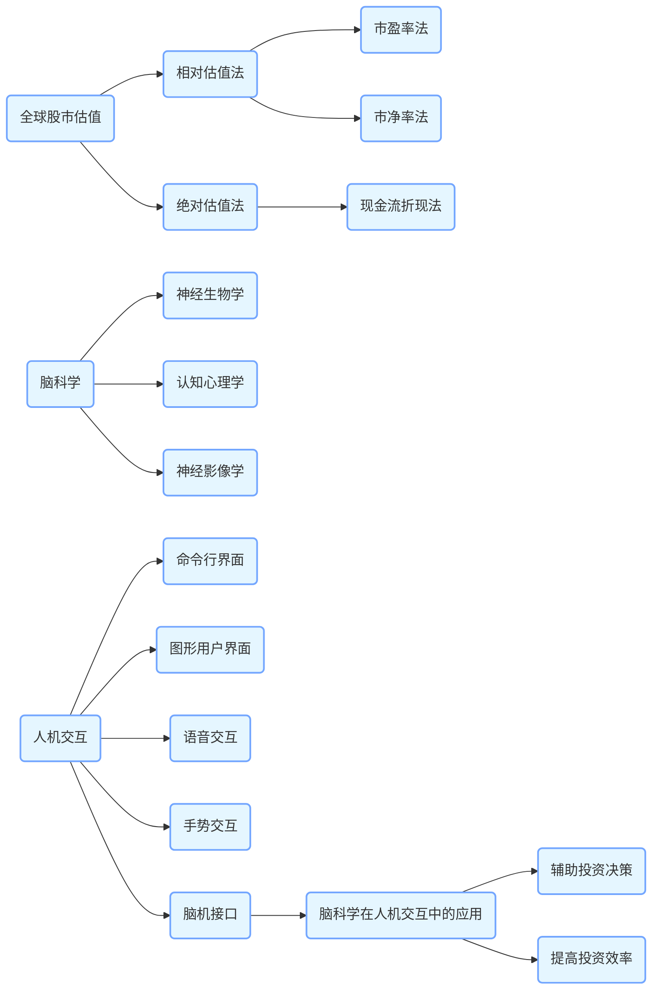

# 全球股市估值与脑科学在人机交互中的应用

> 关键词：全球股市估值、脑科学、人机交互、投资决策、神经技术

> 摘要：本文旨在探讨全球股市估值与脑科学在人机交互中的应用。首先介绍了全球股市估值的基本概念、方法以及其在投资决策中的重要性。接着深入阐述脑科学的原理，包括大脑神经机制、认知过程等，以及脑科学在人机交互领域的应用现状和发展趋势。分析了如何将脑科学融入到股市投资的人机交互场景中，以辅助投资者做出更明智的决策。通过项目实战展示了相关技术的实现，同时列举了实际应用场景和推荐了学习资源、开发工具等。最后对未来发展趋势与挑战进行了总结，并解答了常见问题。

## 1. 背景介绍 
### 1.1 目的和范围
本文章的主要目的是深入探讨全球股市估值的原理和方法，以及脑科学在人机交互中的应用，并研究如何将两者结合起来为股市投资决策提供新的思路和方法。范围涵盖了全球股市估值的理论基础、脑科学的核心概念、人机交互技术的发展现状，以及两者融合在实际投资场景中的应用案例。

### 1.2 预期读者
本文预期读者包括金融投资领域的专业人士，如股票分析师、基金经理、投资顾问等；计算机科学和人工智能领域的研究人员和开发者，对人机交互技术和脑机接口技术感兴趣的人员；以及对金融科技和新兴技术融合应用有探索欲望的普通投资者和科技爱好者。

### 1.3 文档结构概述
本文将按照以下结构进行阐述：首先介绍相关背景知识，包括核心概念的定义和解释；接着深入讲解全球股市估值的算法原理和脑科学在人机交互中的具体操作步骤；然后通过数学模型和公式进一步说明相关理论；通过项目实战展示如何将这些理论应用到实际代码中；列举实际应用场景；推荐相关的学习资源、开发工具和论文著作；最后总结未来发展趋势与挑战，解答常见问题并提供扩展阅读和参考资料。

### 1.4 术语表
#### 1.4.1 核心术语定义
- **全球股市估值**：指对全球范围内各个股票市场上上市公司的股票价值进行评估和判断的过程，通过各种方法确定股票的内在价值，以判断其是否被高估或低估。
- **脑科学**：是研究脑的结构和功能的科学，包括对大脑神经细胞的活动、神经网络的形成、认知过程、情感体验等方面的研究。
- **人机交互**：是指人与计算机之间进行信息交流和互动的过程，通过各种输入输出设备实现人与计算机系统之间的有效沟通。
- **脑机接口（BCI）**：是一种不依赖于常规的大脑信息输出通路（外周神经和肌肉组织）的通信系统，它可以直接获取大脑的神经信号，并将其转化为计算机能够理解和处理的指令。

#### 1.4.2 相关概念解释
- **股票估值方法**：常见的有市盈率法（P/E）、市净率法（P/B）、现金流折现法（DCF）等。市盈率法是用股票价格除以每股收益，反映了投资者为获得每一元收益所愿意支付的价格；市净率法是用股票价格除以每股净资产，衡量了股票价格相对于净资产的倍数；现金流折现法是通过预测公司未来的现金流，并将其折现到当前时刻，以确定股票的内在价值。
- **大脑神经机制**：大脑由大量的神经细胞（神经元）组成，神经元之间通过突触相互连接形成复杂的神经网络。神经信号通过电活动和化学物质的传递在神经网络中传播，从而实现信息的处理和传递。认知过程如感知、注意、记忆、决策等都与大脑神经机制密切相关。

#### 1.4.3 缩略词列表
- **P/E**：市盈率（Price-to-Earnings Ratio）
- **P/B**：市净率（Price-to-Book Ratio）
- **DCF**：现金流折现法（Discounted Cash Flow）
- **BCI**：脑机接口（Brain-Computer Interface）

## 2. 核心概念与联系 

### 全球股市估值
全球股市估值是金融领域的重要概念，它对于投资者做出投资决策至关重要。股票的估值是基于公司的基本面信息，如财务报表、盈利情况、行业前景等，通过一定的方法来确定股票的合理价格。常见的估值方法有相对估值法和绝对估值法。相对估值法是通过与同行业其他公司或市场平均水平进行比较来评估股票的价值，如市盈率法和市净率法；绝对估值法是通过对公司未来现金流的预测和折现来确定股票的内在价值，如现金流折现法。

### 脑科学
脑科学是研究大脑结构和功能的科学，它涉及到神经生物学、认知心理学、神经影像学等多个学科领域。大脑是人体最复杂的器官，它控制着人体的各种生理和心理活动。脑科学的研究目标是揭示大脑的工作原理，包括神经信号的传递、神经网络的形成、认知过程的神经机制等。通过对大脑的研究，我们可以更好地理解人类的思维、情感和行为。

### 人机交互
人机交互是指人与计算机之间进行信息交流和互动的过程。随着计算机技术的发展，人机交互的方式越来越多样化，从最初的命令行界面到现在的图形用户界面、语音交互、手势交互等。人机交互的目标是提高人机之间的交互效率和用户体验，使用户能够更加自然、便捷地与计算机系统进行交互。

### 脑科学在人机交互中的应用
脑科学在人机交互中的应用主要是通过脑机接口技术实现的。脑机接口技术可以直接获取大脑的神经信号，并将其转化为计算机能够理解和处理的指令。通过脑机接口，用户可以直接用大脑控制计算机系统，实现更加自然和高效的人机交互。在股市投资领域，脑科学在人机交互中的应用可以帮助投资者更好地理解自己的投资决策过程，提高投资决策的准确性和效率。

### 文本示意图
```plaintext
全球股市估值
|-- 相对估值法
|   |-- 市盈率法
|   |-- 市净率法
|-- 绝对估值法
|   |-- 现金流折现法

脑科学
|-- 神经生物学
|-- 认知心理学
|-- 神经影像学

人机交互
|-- 命令行界面
|-- 图形用户界面
|-- 语音交互
|-- 手势交互
|-- 脑机接口

脑科学在人机交互中的应用
|-- 辅助投资决策
|-- 提高投资效率
```

### Mermaid 流程图


## 3. 核心算法原理 & 具体操作步骤 

### 全球股市估值算法原理及 Python 实现

#### 市盈率法（P/E）
市盈率法是一种相对估值方法，通过计算股票的市盈率来评估股票的价值。市盈率（P/E）的计算公式为：
$$P/E = \frac{股票价格}{每股收益}$$

Python 代码实现：
```python
def calculate_pe_ratio(stock_price, earnings_per_share):
    """
    计算市盈率
    :param stock_price: 股票价格
    :param earnings_per_share: 每股收益
    :return: 市盈率
    """
    if earnings_per_share == 0:
        return None
    return stock_price / earnings_per_share

# 示例数据
stock_price = 50
earnings_per_share = 5

pe_ratio = calculate_pe_ratio(stock_price, earnings_per_share)
print(f"市盈率: {pe_ratio}")
```

#### 市净率法（P/B）
市净率法也是一种相对估值方法，通过计算股票的市净率来评估股票的价值。市净率（P/B）的计算公式为：
$$P/B = \frac{股票价格}{每股净资产}$$

Python 代码实现：
```python
def calculate_pb_ratio(stock_price, book_value_per_share):
    """
    计算市净率
    :param stock_price: 股票价格
    :param book_value_per_share: 每股净资产
    :return: 市净率
    """
    if book_value_per_share == 0:
        return None
    return stock_price / book_value_per_share

# 示例数据
stock_price = 50
book_value_per_share = 10

pb_ratio = calculate_pb_ratio(stock_price, book_value_per_share)
print(f"市净率: {pb_ratio}")
```

#### 现金流折现法（DCF）
现金流折现法是一种绝对估值方法，通过预测公司未来的现金流，并将其折现到当前时刻，以确定股票的内在价值。现金流折现法的基本公式为：
$$V = \sum_{t=1}^{n} \frac{CF_t}{(1 + r)^t}$$
其中，$V$ 是股票的内在价值，$CF_t$ 是第 $t$ 期的现金流，$r$ 是折现率，$n$ 是预测期数。

Python 代码实现：
```python
def calculate_dcf_value(cash_flows, discount_rate):
    """
    计算现金流折现价值
    :param cash_flows: 未来各期的现金流列表
    :param discount_rate: 折现率
    :return: 现金流折现价值
    """
    total_value = 0
    for t, cf in enumerate(cash_flows, start=1):
        total_value += cf / ((1 + discount_rate) ** t)
    return total_value

# 示例数据
cash_flows = [100, 120, 150, 180, 200]
discount_rate = 0.1

dcf_value = calculate_dcf_value(cash_flows, discount_rate)
print(f"现金流折现价值: {dcf_value}")
```

### 脑科学在人机交互中的操作步骤

#### 数据采集
使用脑电信号采集设备（如脑电图仪）采集用户的脑电信号。脑电信号是大脑神经活动产生的电信号，它包含了大脑的各种信息。采集到的脑电信号通常是模拟信号，需要通过模数转换器将其转换为数字信号。

#### 信号预处理
采集到的脑电信号通常包含噪声和干扰，需要进行预处理以提高信号的质量。信号预处理的步骤包括滤波、去噪、特征提取等。滤波可以去除信号中的高频噪声和低频漂移，去噪可以采用小波变换、主成分分析等方法，特征提取可以提取脑电信号中的有用特征，如功率谱特征、时域特征等。

#### 模式识别
通过模式识别算法对预处理后的脑电信号进行分类和识别，以确定用户的意图。常见的模式识别算法有支持向量机、神经网络、决策树等。

#### 指令生成与交互
根据模式识别的结果，生成相应的计算机指令，并实现人机交互。例如，如果识别结果表明用户想要买入某只股票，则生成买入指令并发送给交易系统。

以下是一个简单的脑电信号分类示例代码：
```python
import numpy as np
from sklearn.svm import SVC
from sklearn.model_selection import train_test_split
from sklearn.metrics import accuracy_score

# 生成示例数据
np.random.seed(42)
n_samples = 100
n_features = 10
X = np.random.randn(n_samples, n_features)
y = np.random.randint(0, 2, n_samples)

# 划分训练集和测试集
X_train, X_test, y_train, y_test = train_test_split(X, y, test_size=0.2, random_state=42)

# 创建支持向量机分类器
clf = SVC()

# 训练模型
clf.fit(X_train, y_train)

# 预测
y_pred = clf.predict(X_test)

# 计算准确率
accuracy = accuracy_score(y_test, y_pred)
print(f"分类准确率: {accuracy}")
```

## 4. 数学模型和公式 & 详细讲解 & 举例说明 

### 全球股市估值数学模型

#### 市盈率法（P/E）
市盈率法的数学模型为：
$$P = P/E \times EPS$$
其中，$P$ 是股票价格，$P/E$ 是市盈率，$EPS$ 是每股收益。

举例说明：假设某公司的每股收益为 $5$ 元，同行业平均市盈率为 $20$，则该公司股票的合理价格为：
$$P = 20 \times 5 = 100$$（元）

#### 市净率法（P/B）
市净率法的数学模型为：
$$P = P/B \times BVPS$$
其中，$P$ 是股票价格，$P/B$ 是市净率，$BVPS$ 是每股净资产。

举例说明：假设某公司的每股净资产为 $10$ 元，同行业平均市净率为 $3$，则该公司股票的合理价格为：
$$P = 3 \times 10 = 30$$（元）

#### 现金流折现法（DCF）
现金流折现法的数学模型为：
$$V = \sum_{t=1}^{n} \frac{CF_t}{(1 + r)^t} + \frac{TV}{(1 + r)^n}$$
其中，$V$ 是股票的内在价值，$CF_t$ 是第 $t$ 期的现金流，$r$ 是折现率，$n$ 是预测期数，$TV$ 是终值。

终值的计算通常采用永续增长模型：
$$TV = \frac{CF_{n+1}}{r - g}$$
其中，$CF_{n+1}$ 是第 $n+1$ 期的现金流，$g$ 是永续增长率。

举例说明：假设某公司未来 $5$ 年的现金流分别为 $100$ 万元、$120$ 万元、$150$ 万元、$180$ 万元、$200$ 万元，折现率为 $10\%$，永续增长率为 $3\%$。第 $6$ 年的现金流预计为 $200 \times (1 + 3\%) = 206$ 万元。

首先计算终值：
$$TV = \frac{206}{0.1 - 0.03} \approx 2942.86$$（万元）

然后计算现金流折现价值：
$$V = \frac{100}{(1 + 0.1)^1} + \frac{120}{(1 + 0.1)^2} + \frac{150}{(1 + 0.1)^3} + \frac{180}{(1 + 0.1)^4} + \frac{200}{(1 + 0.1)^5} + \frac{2942.86}{(1 + 0.1)^5}$$
$$V \approx 90.91 + 99.17 + 112.69 + 122.94 + 124.18 + 1827.95$$
$$V \approx 2377.84$$（万元）

### 脑科学相关数学模型

#### 脑电信号功率谱分析
脑电信号的功率谱分析是一种常用的信号处理方法，用于分析脑电信号在不同频率上的能量分布。功率谱密度（PSD）的计算公式为：
$$PSD(f) = \frac{1}{T} \left| \int_{0}^{T} x(t) e^{-j2\pi ft} dt \right|^2$$
其中，$x(t)$ 是脑电信号，$T$ 是信号的持续时间，$f$ 是频率。

举例说明：假设我们采集到一段时长为 $10$ 秒的脑电信号 $x(t)$，采样频率为 $256$ Hz。我们可以使用 Python 的 `scipy` 库进行功率谱分析：
```python
import numpy as np
from scipy import signal
import matplotlib.pyplot as plt

# 生成示例脑电信号
fs = 256  # 采样频率
t = np.linspace(0, 10, fs * 10)
x = np.sin(2 * np.pi * 10 * t) + 0.5 * np.sin(2 * np.pi * 20 * t)

# 计算功率谱密度
f, Pxx = signal.welch(x, fs, nperseg=256)

# 绘制功率谱密度图
plt.plot(f, Pxx)
plt.xlabel('Frequency (Hz)')
plt.ylabel('Power Spectral Density (dB/Hz)')
plt.title('Power Spectral Density of EEG Signal')
plt.show()
```

#### 脑电信号特征提取
脑电信号的特征提取是模式识别的重要步骤，常用的特征有均值、方差、标准差、峰峰值等。

均值的计算公式为：
$$\bar{x} = \frac{1}{N} \sum_{i=1}^{N} x_i$$
其中，$x_i$ 是脑电信号的第 $i$ 个样本，$N$ 是样本总数。

方差的计算公式为：
$$\sigma^2 = \frac{1}{N} \sum_{i=1}^{N} (x_i - \bar{x})^2$$

标准差的计算公式为：
$$\sigma = \sqrt{\frac{1}{N} \sum_{i=1}^{N} (x_i - \bar{x})^2}$$

举例说明：假设我们有一段脑电信号 $x = [1, 2, 3, 4, 5]$，则其均值为：
$$\bar{x} = \frac{1 + 2 + 3 + 4 + 5}{5} = 3$$
方差为：
$$\sigma^2 = \frac{(1 - 3)^2 + (2 - 3)^2 + (3 - 3)^2 + (4 - 3)^2 + (5 - 3)^2}{5} = 2$$
标准差为：
$$\sigma = \sqrt{2} \approx 1.414$$

## 5. 项目实战：代码实际案例和详细解释说明 

### 5.1  开发环境搭建
#### 硬件环境
- **脑电信号采集设备**：如 NeuroSky MindWave Mobile 2、Emotiv Insight 等。这些设备可以采集用户的脑电信号，并通过蓝牙或 USB 接口将信号传输到计算机。
- **计算机**：建议使用性能较好的笔记本电脑或台式机，具备足够的内存和处理器性能，以处理采集到的脑电信号。

#### 软件环境
- **操作系统**：推荐使用 Windows 10 或 Ubuntu Linux 操作系统。
- **编程语言**：Python 是一种常用的编程语言，具有丰富的科学计算库和机器学习库，适合用于脑电信号处理和股市估值计算。
- **开发工具**：可以使用 Anaconda 来管理 Python 环境和安装相关的库，使用 PyCharm 或 Jupyter Notebook 作为开发工具。

#### 安装必要的 Python 库
```bash
pip install numpy scipy scikit-learn matplotlib pandas
```

### 5.2  源代码详细实现和代码解读

#### 全球股市估值模块
```python
import pandas as pd

def calculate_pe_ratio(stock_price, earnings_per_share):
    """
    计算市盈率
    :param stock_price: 股票价格
    :param earnings_per_share: 每股收益
    :return: 市盈率
    """
    if earnings_per_share == 0:
        return None
    return stock_price / earnings_per_share

def calculate_pb_ratio(stock_price, book_value_per_share):
    """
    计算市净率
    :param stock_price: 股票价格
    :param book_value_per_share: 每股净资产
    :return: 市净率
    """
    if book_value_per_share == 0:
        return None
    return stock_price / book_value_per_share

def calculate_dcf_value(cash_flows, discount_rate):
    """
    计算现金流折现价值
    :param cash_flows: 未来各期的现金流列表
    :param discount_rate: 折现率
    :return: 现金流折现价值
    """
    total_value = 0
    for t, cf in enumerate(cash_flows, start=1):
        total_value += cf / ((1 + discount_rate) ** t)
    return total_value

# 示例数据
data = {
    '股票代码': ['000001', '000002'],
    '股票价格': [50, 60],
    '每股收益': [5, 6],
    '每股净资产': [10, 12],
    '未来现金流': [[100, 120, 150, 180, 200], [120, 140, 160, 180, 200]],
    '折现率': [0.1, 0.1]
}

df = pd.DataFrame(data)

# 计算市盈率
df['市盈率'] = df.apply(lambda row: calculate_pe_ratio(row['股票价格'], row['每股收益']), axis=1)

# 计算市净率
df['市净率'] = df.apply(lambda row: calculate_pb_ratio(row['股票价格'], row['每股净资产']), axis=1)

# 计算现金流折现价值
df['现金流折现价值'] = df.apply(lambda row: calculate_dcf_value(row['未来现金流'], row['折现率']), axis=1)

print(df)
```

代码解读：
- 定义了三个函数 `calculate_pe_ratio`、`calculate_pb_ratio` 和 `calculate_dcf_value` 分别用于计算市盈率、市净率和现金流折现价值。
- 使用 `pandas` 库创建一个数据框 `df`，包含股票代码、股票价格、每股收益、每股净资产、未来现金流和折现率等信息。
- 使用 `apply` 方法对数据框的每一行应用相应的计算函数，计算市盈率、市净率和现金流折现价值，并将结果添加到数据框中。
- 最后打印出计算结果。

#### 脑电信号处理与模式识别模块
```python
import numpy as np
from scipy import signal
from sklearn.svm import SVC
from sklearn.model_selection import train_test_split
from sklearn.metrics import accuracy_score

# 模拟采集脑电信号
def simulate_eeg_signal():
    fs = 256  # 采样频率
    t = np.linspace(0, 10, fs * 10)
    x = np.sin(2 * np.pi * 10 * t) + 0.5 * np.sin(2 * np.pi * 20 * t)
    return x

# 信号预处理：滤波
def preprocess_eeg_signal(x, fs):
    # 设计低通滤波器
    nyquist = 0.5 * fs
    cutoff = 30
    normal_cutoff = cutoff / nyquist
    b, a = signal.butter(4, normal_cutoff, btype='low', analog=False)
    y = signal.lfilter(b, a, x)
    return y

# 特征提取：计算均值和方差
def extract_features(x):
    mean = np.mean(x)
    var = np.var(x)
    return [mean, var]

# 生成示例数据
n_samples = 100
X = []
y = []
for i in range(n_samples):
    x = simulate_eeg_signal()
    x = preprocess_eeg_signal(x, 256)
    features = extract_features(x)
    X.append(features)
    y.append(np.random.randint(0, 2))

X = np.array(X)
y = np.array(y)

# 划分训练集和测试集
X_train, X_test, y_train, y_test = train_test_split(X, y, test_size=0.2, random_state=42)

# 创建支持向量机分类器
clf = SVC()

# 训练模型
clf.fit(X_train, y_train)

# 预测
y_pred = clf.predict(X_test)

# 计算准确率
accuracy = accuracy_score(y_test, y_pred)
print(f"分类准确率: {accuracy}")
```

代码解读：
- `simulate_eeg_signal` 函数用于模拟采集脑电信号，生成一个包含 $10$ 秒时长的正弦波信号。
- `preprocess_eeg_signal` 函数用于对采集到的脑电信号进行预处理，使用低通滤波器去除高频噪声。
- `extract_features` 函数用于提取脑电信号的特征，计算信号的均值和方差。
- 生成 $100$ 个样本的示例数据，对每个样本进行信号采集、预处理和特征提取。
- 使用 `train_test_split` 函数将数据划分为训练集和测试集。
- 创建支持向量机分类器 `SVC`，并使用训练集进行训练。
- 使用测试集进行预测，并计算分类准确率。

### 5.3  代码解读与分析
#### 全球股市估值模块
- 市盈率、市净率和现金流折现法是常见的股票估值方法，通过代码实现可以方便地对不同股票进行估值计算。
- 使用 `pandas` 库可以高效地处理和管理股票数据，通过 `apply` 方法可以对数据框的每一行进行批量计算。

#### 脑电信号处理与模式识别模块
- 信号预处理是脑电信号处理的重要步骤，通过滤波可以去除噪声，提高信号质量。
- 特征提取可以将脑电信号转换为具有代表性的特征向量，便于后续的模式识别。
- 支持向量机是一种常用的模式识别算法，通过训练模型可以对脑电信号进行分类，实现人机交互。

## 6. 实际应用场景 
### 投资决策辅助
通过全球股市估值模型，投资者可以对不同股票的价值进行评估，判断股票是否被高估或低估，从而做出投资决策。同时，结合脑科学在人机交互中的应用，投资者可以通过脑机接口设备直接表达自己的投资意愿，提高投资决策的效率和准确性。例如，投资者在看到股票行情时，大脑产生的兴奋或紧张情绪可以通过脑电信号被捕捉到，系统可以根据这些信号分析投资者的心理状态，并提供相应的投资建议。

### 金融市场情绪分析
脑科学可以帮助分析金融市场参与者的情绪状态，从而预测市场的走势。通过采集大量投资者的脑电信号，分析他们在不同市场情况下的情绪变化，可以了解市场的整体情绪氛围。例如，当市场参与者普遍表现出恐慌情绪时，可能预示着市场即将下跌；而当市场参与者普遍表现出乐观情绪时，可能预示着市场即将上涨。

### 个性化投资服务
根据投资者的脑电信号和投资历史数据，为投资者提供个性化的投资服务。不同的投资者具有不同的风险偏好和投资习惯，通过分析投资者的脑电信号可以了解他们的心理特征，从而为他们量身定制投资组合和投资策略。例如，对于风险偏好较高的投资者，可以推荐一些高风险高收益的股票；对于风险偏好较低的投资者，可以推荐一些稳健型的投资产品。

### 交易系统优化
将脑科学应用于交易系统中，可以优化交易系统的性能。例如，通过监测交易员的脑电信号，判断他们的疲劳程度和注意力集中程度，当交易员出现疲劳或注意力不集中时，系统可以自动提醒或暂停交易，避免因人为因素导致的交易失误。同时，系统可以根据交易员的脑电信号实时调整交易策略，提高交易的成功率。

## 7. 工具和资源推荐
### 7.1 学习资源推荐
#### 7.1.1 书籍推荐
- 《聪明的投资者》（The Intelligent Investor）：由本杰明·格雷厄姆（Benjamin Graham）所著，是价值投资领域的经典之作，介绍了股票投资的基本原理和方法，对全球股市估值有深入的阐述。
- 《脑与行为的生物学》（Biological Psychology: An Introduction to Behavioral, Cognitive, and Clinical Neuroscience）：由詹姆斯·W·卡拉特（James W. Kalat）所著，是一本全面介绍脑科学的教材，涵盖了大脑的结构、功能、神经机制等方面的知识。
- 《人机交互：原理与设计》（Human-Computer Interaction: Principles and Design）：由艾伦·塞科德（Alan Dix）等人所著，系统地介绍了人机交互的基本原理、设计方法和技术，对脑科学在人机交互中的应用有一定的参考价值。

#### 7.1.2 在线课程
- Coursera 上的“Financial Markets”课程：由耶鲁大学教授罗伯特·席勒（Robert Shiller）授课，介绍了金融市场的基本原理和投资策略，包括股票估值方法等内容。
- edX 上的“Brain Science”课程：由哈佛大学教授大卫·珀尔马特（David Perlmutter）授课，深入讲解了脑科学的前沿知识和研究成果。
- Udemy 上的“Human-Computer Interaction: Designing Engaging Experiences”课程：介绍了人机交互的设计原则和实践方法，帮助学习者掌握人机交互的核心技能。

#### 7.1.3 技术博客和网站
- Seeking Alpha：是一个金融投资领域的知名博客网站，提供全球股市的分析和评论，以及股票估值的相关文章。
- Neurosciencenews.com：专注于脑科学领域的新闻和研究成果报道，及时更新脑科学的最新进展。
- Interaction-design.org：是人机交互领域的专业网站，提供人机交互的设计案例、研究报告和学术论文等资源。

### 7.2 开发工具框架推荐
#### 7.2.1 IDE和编辑器
- PyCharm：是一款专门为 Python 开发设计的集成开发环境，具有强大的代码编辑、调试和分析功能，适合用于开发股票估值和脑电信号处理的 Python 程序。
- Jupyter Notebook：是一个基于网页的交互式开发环境，支持 Python、R 等多种编程语言，适合用于数据探索、模型开发和实验验证。
- Visual Studio Code：是一款轻量级的代码编辑器，支持多种编程语言和插件扩展，具有丰富的代码提示和调试功能，可用于开发各种类型的项目。

#### 7.2.2 调试和性能分析工具
- Py-Spy：是一个 Python 性能分析工具，可以实时监测 Python 程序的 CPU 使用率和函数调用情况，帮助开发者找出程序的性能瓶颈。
- cProfile：是 Python 内置的性能分析模块，可以统计 Python 程序中各个函数的执行时间和调用次数，为优化程序提供依据。
- TensorBoard：是 TensorFlow 提供的可视化工具，可以用于可视化神经网络的训练过程、模型结构和性能指标等。

#### 7.2.3 相关框架和库
- Pandas：是一个用于数据处理和分析的 Python 库，提供了高效的数据结构和数据操作方法，适合用于处理股票数据和脑电信号数据。
- NumPy：是 Python 的科学计算基础库，提供了多维数组对象和各种数学函数，用于进行数值计算和数组操作。
- Scikit-learn：是一个常用的机器学习库，提供了各种机器学习算法和工具，包括分类、回归、聚类等算法，可用于脑电信号的模式识别和股票估值模型的建立。
- MNE-Python：是一个专门用于脑电信号处理和分析的 Python 库，提供了丰富的脑电信号处理功能，如滤波、特征提取、源定位等。

### 7.3 相关论文著作推荐
#### 7.3.1 经典论文
- “The Capital Asset Pricing Model: Theory and Evidence”：由尤金·法玛（Eugene F. Fama）和肯尼斯·弗伦奇（Kenneth R. French）所著，是资本资产定价模型领域的经典论文，对股票估值和投资组合理论有重要的贡献。
- “Neural Coding of Reward Prediction Error in the Basal Ganglia”：由沃尔夫拉姆·舒尔茨（Wolfram Schultz）等人所著，揭示了大脑中基底神经节对奖励预测误差的编码机制，为理解大脑的决策过程提供了重要的理论基础。
- “Designing for User Experience in Human-Computer Interaction”：由唐纳德·诺曼（Donald A. Norman）所著，探讨了人机交互中用户体验的设计原则和方法，对人机交互设计领域产生了深远的影响。

#### 7.3.2 最新研究成果
- 关注《Journal of Financial Economics》、《Neuron》、《ACM Transactions on Computer-Human Interaction》等学术期刊，这些期刊经常发表全球股市估值、脑科学和人机交互领域的最新研究成果。
- 参加国际金融会议、神经科学会议和人机交互会议，如 ACM SIGCHI Conference on Human Factors in Computing Systems、NeurIPS 等，了解最新的研究动态和技术趋势。

#### 7.3.3 应用案例分析
- 可以参考一些金融科技公司和科研机构发布的应用案例报告，了解全球股市估值和脑科学在人机交互中的实际应用情况和效果。例如，一些公司利用脑机接口技术开发的投资决策辅助系统、金融市场情绪分析系统等。

## 8. 总结：未来发展趋势与挑战
### 未来发展趋势
#### 技术融合趋势
全球股市估值与脑科学在人机交互中的应用将呈现出更加深度的技术融合趋势。一方面，金融科技将与脑科学、人工智能等技术进一步融合，开发出更加智能化、个性化的投资决策辅助系统。例如，结合深度学习算法和脑电信号分析技术，实现对投资者情绪和意图的更精准识别，为投资者提供更加符合其心理特征的投资建议。另一方面，人机交互技术将不断创新，脑机接口设备将更加小型化、便携化和智能化，提高用户的使用体验和交互效率。

#### 数据驱动决策
随着大数据和人工智能技术的发展，数据将成为投资决策的重要依据。在全球股市估值方面，将利用更多的数据源，如社交媒体数据、宏观经济数据、公司财务数据等，通过数据分析和挖掘技术，更准确地评估股票的价值和市场趋势。在脑科学领域，将积累大量的脑电信号数据，通过机器学习算法建立更加准确的脑电信号模型，提高对大脑活动和心理状态的理解和预测能力。

#### 个性化服务
未来的投资服务将更加注重个性化。根据投资者的脑电信号、投资历史、风险偏好等多方面信息，为投资者提供量身定制的投资组合和投资策略。同时，人机交互界面也将根据用户的个性化需求进行设计，提供更加友好、便捷的交互体验。

### 挑战
#### 数据隐私和安全问题
在全球股市估值和脑科学在人机交互中的应用中，涉及到大量的个人敏感数据，如股票交易数据、脑电信号数据等。这些数据的隐私和安全问题是一个重要的挑战。需要建立完善的数据保护机制，确保数据不被泄露和滥用。同时，要加强对数据传输和存储的安全防护，防止数据被攻击和篡改。

#### 技术可靠性和准确性
脑科学和人机交互技术还处于发展阶段，其可靠性和准确性还存在一定的问题。例如，脑电信号的采集和分析容易受到噪声和干扰的影响，导致模式识别的准确率不高。在全球股市估值方面，估值模型也存在一定的局限性，受到市场不确定性和数据质量的影响。需要进一步提高技术的可靠性和准确性，加强对技术的验证和评估。

#### 伦理和法律问题
脑科学在人机交互中的应用涉及到一些伦理和法律问题。例如，脑机接口技术可能会侵犯个人的隐私和自主权，如何在技术应用中保障个人的合法权益是一个需要解决的问题。同时，对于利用脑科学技术进行投资决策辅助等应用，也需要制定相应的法律法规，规范其行为和责任。

## 9. 附录：常见问题与解答
### 1. 全球股市估值方法的准确性如何？
全球股市估值方法都有其局限性，没有一种方法可以完全准确地评估股票的价值。市盈率法和市净率法是相对估值方法，它们通过与同行业其他公司或市场平均水平进行比较来评估股票的价值，但这种比较可能存在偏差。现金流折现法是绝对估值方法，它通过预测公司未来的现金流来确定股票的内在价值，但未来现金流的预测具有很大的不确定性。因此，在实际应用中，通常需要综合使用多种估值方法，并结合市场情况和公司基本面进行分析。

### 2. 脑机接口技术在股市投资中的应用是否成熟？
脑机接口技术在股市投资中的应用还处于探索和发展阶段，尚未完全成熟。目前，脑机接口技术在信号采集、处理和模式识别等方面还存在一些问题，如信号质量不稳定、识别准确率不高等。同时，将脑机接口技术应用于股市投资还需要解决伦理、法律和安全等方面的问题。但是，随着技术的不断进步和研究的深入，脑机接口技术在股市投资中的应用前景广阔。

### 3. 如何保护脑电信号数据的隐私和安全？
保护脑电信号数据的隐私和安全可以从以下几个方面入手：
- **数据加密**：在数据传输和存储过程中，采用加密算法对脑电信号数据进行加密，确保数据在传输和存储过程中不被窃取和篡改。
- **访问控制**：建立严格的访问控制机制，只有授权人员才能访问脑电信号数据，防止数据被非法获取。
- **匿名化处理**：在对脑电信号数据进行分析和研究时，对数据进行匿名化处理，去除个人身份信息，保护用户的隐私。
- **安全审计**：定期对数据系统进行安全审计，及时发现和处理安全漏洞和异常情况。

### 4. 学习全球股市估值和脑科学在人机交互中的应用需要具备哪些知识和技能？
学习全球股市估值和脑科学在人机交互中的应用需要具备以下知识和技能：
- **金融知识**：了解股票市场的基本原理、投资策略和估值方法，掌握财务报表分析和宏观经济分析的方法。
- **脑科学知识**：了解大脑的结构和功能、神经信号的传递机制、认知过程的神经基础等脑科学知识。
- **计算机科学知识**：掌握编程语言（如 Python）、数据处理和分析方法、机器学习算法等计算机科学知识。
- **人机交互知识**：了解人机交互的基本原理、设计方法和技术，掌握用户体验设计的原则和方法。

## 10. 扩展阅读 & 参考资料
### 扩展阅读
- 《金融炼金术》（The Alchemy of Finance）：由乔治·索罗斯（George Soros）所著，探讨了金融市场的不确定性和反身性原理，对理解全球股市的运行机制有一定的启发。
- 《思考，快与慢》（Thinking, Fast and Slow）：由丹尼尔·卡尼曼（Daniel Kahneman）所著，介绍了人类思维的两种模式——快思考和慢思考，以及它们在决策过程中的影响，对理解投资者的心理和行为有重要的参考价值。
- 《脑机接口：改变人类未来的新技术》：介绍了脑机接口技术的发展历程、原理和应用前景，对脑科学在人机交互中的应用有更深入的了解。

### 参考资料
- 财经网站：如新浪财经、东方财富网等，提供全球股市的实时行情、财经新闻和分析报告。
- 学术数据库：如 IEEE Xplore、ACM Digital Library、PubMed 等，可查找全球股市估值、脑科学和人机交互领域的学术论文和研究报告。
- 相关书籍和教材：如前文推荐的《聪明的投资者》、《脑与行为的生物学》等。

作者：AI天才研究院/AI Genius Institute & 禅与计算机程序设计艺术 /Zen And The Art of Computer Programming