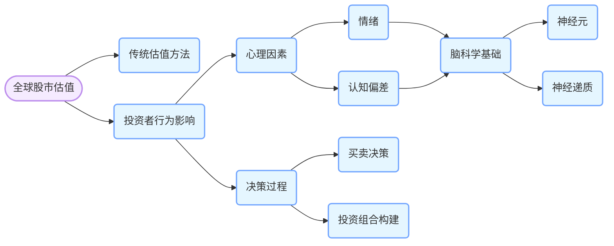

# 全球股市估值与脑科学研究的关联

> 关键词：全球股市估值、脑科学研究、投资者行为、神经经济学、市场预测

> 摘要：本文旨在深入探讨全球股市估值与脑科学研究之间的关联。通过研究脑科学领域的相关理论和发现，分析其如何影响投资者的决策过程，进而对全球股市估值产生作用。首先介绍了研究的背景、目的、预期读者和文档结构，接着阐述了核心概念及其联系，包括股市估值原理、脑科学基础概念等，并给出了相应的示意图和流程图。然后详细讲解了核心算法原理，用 Python 代码进行了说明，同时介绍了相关的数学模型和公式。通过实际案例展示了如何在项目中运用这些原理和方法，分析了其在不同应用场景中的表现。最后推荐了相关的学习资源、开发工具和论文著作，总结了未来发展趋势与挑战，并对常见问题进行了解答。

## 1. 背景介绍 
### 1.1 目的和范围
全球股市作为经济的重要组成部分，其估值的准确性对于投资者、企业和政策制定者都至关重要。传统的股市估值方法主要基于财务数据、宏观经济指标等，但越来越多的研究表明，投资者的心理和行为因素也对股市估值有着显著影响。脑科学研究为我们理解投资者的决策过程提供了新的视角。本研究的目的是探索脑科学研究成果与全球股市估值之间的内在联系，分析脑科学因素如何影响投资者的决策，以及这种影响如何反映在股市估值中。研究范围涵盖了全球主要股票市场，包括美国、欧洲、亚洲等地区的股市，同时涉及脑科学领域的多个方面，如神经生物学、认知心理学等。

### 1.2 预期读者
本文的预期读者包括金融领域的专业人士，如投资者、基金经理、分析师等，他们可以从脑科学的角度深入理解股市估值的影响因素，优化投资决策。同时，脑科学研究人员也可以通过本文了解其研究成果在金融领域的应用，拓展研究思路。此外，对金融和脑科学交叉领域感兴趣的学者和学生也能从本文中获取有价值的信息。

### 1.3 文档结构概述
本文将按照以下结构进行组织：首先介绍相关的核心概念，包括全球股市估值和脑科学研究的基本原理，以及它们之间的联系；接着详细阐述核心算法原理和具体操作步骤，用 Python 代码进行说明；然后介绍相关的数学模型和公式，并通过具体例子进行解释；通过实际项目案例展示如何将这些理论应用到实际中；分析全球股市估值与脑科学研究关联的实际应用场景；推荐相关的学习资源、开发工具和论文著作；最后总结未来发展趋势与挑战，解答常见问题，并提供扩展阅读和参考资料。

### 1.4 术语表
#### 1.4.1 核心术语定义
- **全球股市估值**：指对全球范围内各个股票市场中上市公司股票价值的评估，通常基于公司的财务状况、盈利能力、市场前景等因素，通过一定的估值模型计算得出。
- **脑科学研究**：是一门研究脑的结构和功能的综合性学科，涉及神经生物学、认知心理学、神经影像学等多个领域，旨在揭示大脑的工作机制和人类行为的神经基础。
- **投资者行为**：指投资者在金融市场中的决策和行动，包括股票的买卖、投资组合的构建等，受到投资者的心理、认知和情感等因素的影响。
- **神经经济学**：是一门将神经科学和经济学相结合的交叉学科，研究人类在经济决策过程中的神经机制，探索大脑如何处理经济信息和做出决策。

#### 1.4.2 相关概念解释
- **股市泡沫**：指股票市场价格远远高于其内在价值的现象，通常是由于投资者的过度乐观和投机行为导致的。
- **风险偏好**：指投资者对风险的承受能力和意愿，不同的投资者具有不同的风险偏好，会影响他们的投资决策。
- **认知偏差**：指人类在认知过程中由于各种因素的影响而产生的偏差，如过度自信、锚定效应等，这些偏差会影响投资者的决策。

#### 1.4.3 缩略词列表
- **GDP**：国内生产总值（Gross Domestic Product）
- **PET**：正电子发射断层扫描（Positron Emission Tomography）
- **fMRI**：功能磁共振成像（Functional Magnetic Resonance Imaging）

## 2. 核心概念与联系 

### 2.1 全球股市估值原理
全球股市估值是一个复杂的过程，通常基于多种方法和模型。常见的估值方法包括市盈率（P/E）法、市净率（P/B）法、现金流折现法（DCF）等。市盈率法是通过将公司的股票价格除以每股收益来评估公司的相对价值；市净率法是将股票价格除以每股净资产；现金流折现法是通过预测公司未来的现金流，并将其折现到当前来计算公司的内在价值。

### 2.2 脑科学研究基础概念
脑科学研究主要关注大脑的结构和功能，以及它们如何影响人类的行为和认知。大脑由数十亿个神经元组成，这些神经元通过突触相互连接，形成复杂的神经网络。神经递质如多巴胺、血清素等在神经元之间传递信息，影响人类的情绪、动机和决策。认知心理学研究人类的感知、注意、记忆、思维等认知过程，发现人类在决策过程中存在各种认知偏差。

### 2.3 两者之间的联系
投资者的决策过程受到大脑的控制，脑科学研究成果可以帮助我们理解投资者的心理和行为。例如，当投资者处于过度自信状态时，他们可能会高估自己的投资能力，从而做出过度冒险的决策，导致股市泡沫的产生。相反，当投资者感到恐惧时，他们可能会过度抛售股票，导致股市下跌。神经经济学通过研究大脑在经济决策过程中的活动，揭示了投资者决策的神经机制，为股市估值提供了新的视角。

### 2.4 文本示意图
```plaintext
全球股市估值
|
|-- 传统估值方法（P/E、P/B、DCF等）
|
|-- 投资者行为影响
|   |
|   |-- 心理因素（情绪、认知偏差等）
|   |   |
|   |   |-- 脑科学基础（神经元、神经递质等）
|   |
|   |-- 决策过程（买卖决策、投资组合构建等）
```

### 2.5 Mermaid 流程图


## 3. 核心算法原理 & 具体操作步骤 

### 3.1 基于投资者情绪的股市估值调整算法
投资者的情绪会影响他们对股票的预期收益和风险评估，从而影响股市估值。我们可以通过构建一个基于投资者情绪的股市估值调整模型来反映这种影响。

#### 3.1.1 算法原理
假设股票的基本估值为 $V_0$，投资者情绪指标为 $S$，我们可以通过以下公式来调整股票的估值：

$V = V_0 \times (1 + \alpha \times S)$

其中，$V$ 是调整后的股票估值，$\alpha$ 是情绪调整系数，反映了投资者情绪对估值的影响程度。

#### 3.1.2 Python 代码实现
```python
def adjust_stock_valuation(base_valuation, sentiment_index, alpha):
    """
    基于投资者情绪调整股票估值
    :param base_valuation: 股票的基本估值
    :param sentiment_index: 投资者情绪指标
    :param alpha: 情绪调整系数
    :return: 调整后的股票估值
    """
    adjusted_valuation = base_valuation * (1 + alpha * sentiment_index)
    return adjusted_valuation

# 示例
base_valuation = 100  # 基本估值
sentiment_index = 0.2  # 投资者情绪指标
alpha = 0.5  # 情绪调整系数

adjusted_valuation = adjust_stock_valuation(base_valuation, sentiment_index, alpha)
print(f"调整后的股票估值: {adjusted_valuation}")
```

### 3.2 具体操作步骤
1. **确定股票的基本估值**：使用传统的估值方法，如市盈率法、现金流折现法等，计算股票的基本估值 $V_0$。
2. **获取投资者情绪指标**：可以通过问卷调查、社交媒体分析、新闻报道等方式获取投资者的情绪指标 $S$。
3. **确定情绪调整系数**：根据历史数据和经验，确定情绪调整系数 $\alpha$。
4. **计算调整后的股票估值**：使用上述公式计算调整后的股票估值 $V$。

## 4. 数学模型和公式 & 详细讲解 & 举例说明 

### 4.1 基于神经经济学的投资决策模型
神经经济学认为，投资者的决策过程是大脑中多个神经回路相互作用的结果。我们可以构建一个基于神经经济学的投资决策模型来描述这个过程。

#### 4.1.1 数学模型
假设投资者面临两种投资选择：股票 A 和股票 B。投资者的决策取决于他们对两种股票的预期收益和风险的评估。设股票 A 的预期收益为 $R_A$，风险为 $\sigma_A$；股票 B 的预期收益为 $R_B$，风险为 $\sigma_B$。投资者的效用函数可以表示为：

$U = \beta_1 R - \beta_2 \sigma$

其中，$U$ 是投资者的效用，$\beta_1$ 和 $\beta_2$ 是投资者对收益和风险的偏好系数。投资者会选择效用最大的投资选项。

#### 4.1.2 详细讲解
这个模型考虑了投资者对收益和风险的偏好。$\beta_1$ 越大，投资者越看重收益；$\beta_2$ 越大，投资者越厌恶风险。投资者会根据自己的偏好对不同股票的预期收益和风险进行权衡，选择能给自己带来最大效用的投资选项。

#### 4.1.3 举例说明
假设投资者对收益的偏好系数 $\beta_1 = 0.8$，对风险的偏好系数 $\beta_2 = 0.2$。股票 A 的预期收益 $R_A = 0.1$，风险 $\sigma_A = 0.05$；股票 B 的预期收益 $R_B = 0.12$，风险 $\sigma_B = 0.08$。

计算股票 A 的效用：

$U_A = \beta_1 R_A - \beta_2 \sigma_A = 0.8 \times 0.1 - 0.2 \times 0.05 = 0.08 - 0.01 = 0.07$

计算股票 B 的效用：

$U_B = \beta_1 R_B - \beta_2 \sigma_B = 0.8 \times 0.12 - 0.2 \times 0.08 = 0.096 - 0.016 = 0.08$

因为 $U_B > U_A$，所以投资者会选择股票 B。

### 4.2 股市估值的动态调整模型
股市估值会随着市场环境和投资者情绪的变化而动态调整。我们可以构建一个动态调整模型来描述这种变化。

#### 4.2.1 数学模型
设 $V_t$ 是第 $t$ 期的股市估值，$V_{t-1}$ 是第 $t-1$ 期的股市估值，$S_t$ 是第 $t$ 期的投资者情绪指标，$\gamma$ 是调整系数。则股市估值的动态调整模型可以表示为：

$V_t = V_{t-1} \times (1 + \gamma \times S_t)$

#### 4.2.2 详细讲解
这个模型表明，第 $t$ 期的股市估值是在第 $t-1$ 期的基础上，根据第 $t$ 期的投资者情绪指标进行调整的。$\gamma$ 越大，投资者情绪对股市估值的影响越大。

#### 4.2.3 举例说明
假设第 $t-1$ 期的股市估值 $V_{t-1} = 1000$，第 $t$ 期的投资者情绪指标 $S_t = 0.1$，调整系数 $\gamma = 0.2$。

计算第 $t$ 期的股市估值：

$V_t = V_{t-1} \times (1 + \gamma \times S_t) = 1000 \times (1 + 0.2 \times 0.1) = 1000 \times 1.02 = 1020$

## 5. 项目实战：代码实际案例和详细解释说明 

### 5.1  开发环境搭建
为了实现上述算法和模型，我们需要搭建一个 Python 开发环境。以下是具体步骤：

1. **安装 Python**：从 Python 官方网站（https://www.python.org/downloads/）下载并安装 Python 3.x 版本。
2. **安装必要的库**：我们需要安装一些常用的 Python 库，如 `numpy`、`pandas` 等。可以使用以下命令进行安装：
```sh
pip install numpy pandas
```

### 5.2  源代码详细实现和代码解读
#### 5.2.1 基于投资者情绪的股市估值调整模型实现
```python
import numpy as np
import pandas as pd

# 模拟股票基本估值数据
base_valuations = np.random.randint(50, 200, 10)  # 生成 10 个基本估值数据
# 模拟投资者情绪指标数据
sentiment_indices = np.random.uniform(-0.2, 0.2, 10)  # 生成 10 个投资者情绪指标数据
alpha = 0.5  # 情绪调整系数

# 定义调整函数
def adjust_stock_valuation(base_valuation, sentiment_index, alpha):
    adjusted_valuation = base_valuation * (1 + alpha * sentiment_index)
    return adjusted_valuation

# 计算调整后的股票估值
adjusted_valuations = []
for i in range(len(base_valuations)):
    adjusted_valuation = adjust_stock_valuation(base_valuations[i], sentiment_indices[i], alpha)
    adjusted_valuations.append(adjusted_valuation)

# 创建 DataFrame 存储数据
data = {
    'Base Valuation': base_valuations,
    'Sentiment Index': sentiment_indices,
    'Adjusted Valuation': adjusted_valuations
}
df = pd.DataFrame(data)

print(df)
```

#### 5.2.2 代码解读
- 首先，我们使用 `numpy` 库生成了模拟的股票基本估值数据和投资者情绪指标数据。
- 然后，定义了 `adjust_stock_valuation` 函数，用于根据投资者情绪调整股票估值。
- 接着，使用循环遍历每个基本估值和情绪指标，调用 `adjust_stock_valuation` 函数计算调整后的股票估值，并将结果存储在 `adjusted_valuations` 列表中。
- 最后，使用 `pandas` 库创建了一个 DataFrame 来存储数据，并打印输出。

### 5.3  代码解读与分析
通过上述代码，我们可以看到如何根据投资者情绪对股票估值进行调整。模拟数据可以帮助我们理解算法的工作原理。在实际应用中，我们需要获取真实的股票基本估值数据和投资者情绪指标数据，以提高模型的准确性。同时，我们可以对代码进行优化，例如使用向量化操作来提高计算效率。

## 6. 实际应用场景 
### 6.1 投资决策
投资者可以利用脑科学研究成果和股市估值模型来优化投资决策。通过了解自己的风险偏好和认知偏差，投资者可以更加理性地评估股票的价值，避免盲目跟风和过度交易。例如，当投资者意识到自己存在过度自信的认知偏差时，可以更加谨慎地对待自己的投资决策，避免做出过于冒险的投资。

### 6.2 市场预测
金融机构和分析师可以利用脑科学研究和股市估值模型来预测市场走势。通过监测投资者情绪和市场动态，结合传统的经济指标和财务数据，可以提高市场预测的准确性。例如，当投资者情绪过度乐观时，可能预示着股市泡沫的出现，分析师可以提前发出预警。

### 6.3 政策制定
政策制定者可以根据脑科学研究和股市估值的关联，制定更加有效的金融政策。例如，当市场出现过度波动时，政策制定者可以采取措施来稳定投资者情绪，避免市场恐慌。同时，政策制定者可以通过教育和宣传，提高投资者的金融素养，减少认知偏差对市场的影响。

## 7. 工具和资源推荐
### 7.1 学习资源推荐
#### 7.1.1 书籍推荐
- 《思考，快与慢》（丹尼尔·卡尼曼著）：介绍了人类思维的两种模式，以及认知偏差对决策的影响，对理解投资者行为有很大帮助。
- 《神经经济学：决策与大脑》（保罗·格莱姆齐著）：系统介绍了神经经济学的基本原理和研究方法，探讨了大脑在经济决策中的作用。
- 《金融心理学：掌握市场波动的真谛》（拉斯·特维德著）：结合心理学和金融学的知识，分析了投资者的心理和行为对金融市场的影响。

#### 7.1.2 在线课程
- Coursera 上的“神经经济学”课程：由知名教授授课，深入讲解神经经济学的理论和应用。
- edX 上的“行为金融学”课程：介绍了行为金融学的基本概念和模型，帮助学习者理解投资者的非理性行为。

#### 7.1.3 技术博客和网站
- Seeking Alpha：提供金融市场的分析和评论，包括投资者情绪分析和股市估值研究。
- Neuroeconomics Society 官方网站：发布神经经济学领域的最新研究成果和学术动态。

### 7.2 开发工具框架推荐
#### 7.2.1 IDE和编辑器
- PyCharm：一款功能强大的 Python 集成开发环境，提供代码编辑、调试、版本控制等功能。
- Jupyter Notebook：交互式的开发环境，适合进行数据分析和模型实验。

#### 7.2.2 调试和性能分析工具
- pdb：Python 自带的调试工具，可以帮助开发者定位代码中的问题。
- cProfile：Python 标准库中的性能分析工具，用于分析代码的运行时间和资源消耗。

#### 7.2.3 相关框架和库
- TensorFlow：一个开源的机器学习框架，可以用于构建和训练神经网络模型，在投资者情绪分析等方面有应用。
- scikit-learn：一个常用的机器学习库，提供了丰富的机器学习算法和工具，可用于股市估值模型的构建和评估。

### 7.3 相关论文著作推荐
#### 7.3.1 经典论文
- “Prospect Theory: An Analysis of Decision under Risk”（丹尼尔·卡尼曼和阿莫斯·特沃斯基著）：提出了前景理论，解释了人类在不确定情况下的决策行为。
- “Neuroeconomics: How Neuroscience Can Inform Economics”（科林·卡默勒等著）：阐述了神经经济学的基本概念和研究方法，探讨了神经科学对经济学的影响。

#### 7.3.2 最新研究成果
- 定期关注《Journal of Financial Economics》《Review of Financial Studies》等金融领域顶级期刊，获取关于股市估值和投资者行为的最新研究成果。
- 关注《Neuron》《Nature Neuroscience》等神经科学领域顶级期刊，了解脑科学研究的最新进展。

#### 7.3.3 应用案例分析
- 一些金融机构和研究机构会发布关于股市估值和投资者行为的应用案例分析报告，可以通过它们的官方网站获取相关资料。

## 8. 总结：未来发展趋势与挑战
### 8.1 未来发展趋势
- **跨学科研究的深入**：全球股市估值与脑科学研究的关联将吸引更多不同学科的专家参与，如神经科学家、金融学家、心理学家等，跨学科研究将更加深入和广泛。
- **技术的应用**：随着脑科学技术的不断发展，如更先进的神经影像学技术、脑机接口技术等，将为研究投资者的决策过程提供更准确的数据和更深入的见解。同时，人工智能和大数据技术也将在股市估值和投资者行为分析中得到更广泛的应用。
- **实践应用的拓展**：基于脑科学研究的投资策略和风险管理方法将得到更多的实践应用，金融机构和投资者将更加重视投资者情绪和认知偏差对市场的影响。

### 8.2 挑战
- **数据获取和分析的难度**：获取准确的投资者情绪数据和大脑活动数据存在一定的难度，同时对这些数据的分析和处理也需要专业的技术和方法。
- **伦理和法律问题**：脑科学研究涉及到人类的大脑和隐私，在应用过程中需要考虑伦理和法律问题，确保研究和应用的合法性和合规性。
- **模型的准确性和可靠性**：目前基于脑科学研究的股市估值模型还不够完善，模型的准确性和可靠性有待提高，需要进一步的研究和验证。

## 9. 附录：常见问题与解答
### 9.1 脑科学研究如何具体影响投资者的决策？
脑科学研究发现，投资者的决策过程受到大脑中多个神经回路的控制，神经递质如多巴胺、血清素等会影响投资者的情绪和动机。例如，多巴胺的分泌会使人感到兴奋和愉悦，当投资者在股票市场中获得收益时，多巴胺的分泌会增加，导致他们更加乐观和冒险，可能会做出过度投资的决策。同时，认知心理学研究发现，人类在决策过程中存在各种认知偏差，如过度自信、锚定效应等，这些偏差也会影响投资者的决策。

### 9.2 如何衡量投资者的情绪？
衡量投资者情绪的方法有多种，常见的包括：
- **问卷调查**：通过设计问卷，询问投资者对市场的看法、预期和情绪状态，如乐观、悲观等。
- **社交媒体分析**：分析社交媒体上关于股票市场的讨论和评论，提取投资者的情绪信息。
- **新闻报道分析**：分析新闻媒体对股票市场的报道，通过情感分析技术判断报道的情感倾向，从而推断投资者的情绪。

### 9.3 基于脑科学研究的股市估值模型是否可靠？
目前基于脑科学研究的股市估值模型还处于发展阶段，其可靠性还需要进一步的研究和验证。虽然这些模型考虑了投资者的心理和行为因素，但股市估值受到多种因素的影响，包括宏观经济环境、公司基本面等。因此，在实际应用中，需要将基于脑科学研究的模型与传统的估值方法相结合，综合考虑各种因素，以提高估值的准确性。

## 10. 扩展阅读 & 参考资料
### 10.1 扩展阅读
- 《行为投资学手册》：深入探讨了投资者的行为偏差和心理因素对投资决策的影响，提供了应对这些偏差的方法和策略。
- 《金融炼金术》（乔治·索罗斯著）：介绍了索罗斯的投资哲学和反身性理论，对理解金融市场的波动和投资者行为有重要启示。

### 10.2 参考资料
- 相关的学术论文和研究报告，如上述推荐的经典论文和最新研究成果。
- 金融机构和研究机构发布的市场分析报告和研究报告。

作者：AI天才研究院/AI Genius Institute & 禅与计算机程序设计艺术 /Zen And The Art of Computer Programming