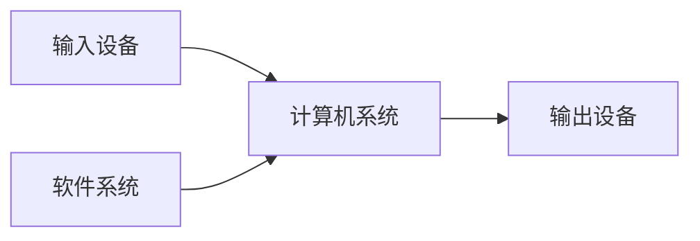

# 全球股市估值与虚拟现实技术的关系

> 关键词：全球股市估值、虚拟现实技术、市场趋势、行业影响、技术创新、投资分析、经济关联

> 摘要：本文深入探讨了全球股市估值与虚拟现实技术之间的关系。通过分析虚拟现实技术的发展现状、核心原理和市场趋势，研究其对全球股市不同行业估值的影响。从技术创新推动股价波动到行业变革重塑市场格局，详细阐述了两者之间复杂的关联。同时，结合实际案例和数学模型，为投资者和行业研究者提供了深入的见解和分析方法，以更好地理解和应对这一动态关系带来的机遇和挑战。

## 1. 背景介绍 
### 1.1 目的和范围
本研究旨在全面剖析全球股市估值与虚拟现实技术之间的内在联系。随着科技的飞速发展，虚拟现实技术逐渐从概念走向实际应用，对各个行业产生了深远的影响。全球股市作为经济的重要晴雨表，也不可避免地受到虚拟现实技术发展的冲击。本文将研究范围涵盖全球主要股票市场，分析虚拟现实技术在不同行业的渗透程度以及对相关企业股市估值的影响。通过对市场数据的分析和案例研究，揭示两者之间的互动机制，为投资者、企业管理者和政策制定者提供有价值的参考。

### 1.2 预期读者
本文的预期读者包括金融投资者，他们可以从中获取关于虚拟现实技术相关股票投资的分析和建议；企业管理者，能够了解虚拟现实技术对行业竞争格局和企业估值的影响，以便制定战略决策；学术研究者，为他们的研究提供实证数据和理论分析；以及政策制定者，帮助他们评估虚拟现实技术对经济发展的影响，制定相应的政策。

### 1.3 文档结构概述
本文将首先介绍相关的术语和概念，为后续的分析奠定基础。接着阐述虚拟现实技术的核心概念和架构，以及它与全球股市估值之间的联系。然后详细讲解分析两者关系所涉及的核心算法原理和具体操作步骤，同时给出相关的数学模型和公式，并举例说明。之后通过项目实战案例，深入分析代码实现和解读。再探讨虚拟现实技术在实际中的应用场景，以及与之相关的工具和资源推荐。最后对未来的发展趋势和挑战进行总结，并解答常见问题，提供扩展阅读和参考资料。

### 1.4 术语表
#### 1.4.1 核心术语定义
- **全球股市估值**：指对全球范围内各个股票市场中上市公司股票价值的评估。它综合考虑了公司的财务状况、盈利能力、市场前景等多种因素，是投资者判断股票投资价值的重要依据。
- **虚拟现实技术（VR）**：利用计算机生成一种模拟环境，通过多种传感设备使用户沉浸到该环境中，产生身临其境的感觉。它结合了计算机图形学、传感器技术、人机交互技术等多种技术，为用户提供全新的体验。
- **市盈率（P/E）**：股票价格除以每股收益的比率，是衡量股票估值的常用指标之一。它反映了市场对公司未来盈利的预期。
- **市净率（P/B）**：股票价格与每股净资产的比率，用于评估公司的市场价值相对于其账面价值的高低。

#### 1.4.2 相关概念解释
- **沉浸式体验**：在虚拟现实技术中，指用户完全沉浸在虚拟环境中，感觉自己仿佛身处其中。这需要高度逼真的视觉、听觉和触觉反馈，使用户能够与虚拟环境进行自然的交互。
- **行业渗透率**：指虚拟现实技术在某个行业中的应用程度，通常用采用该技术的企业数量或业务占比来衡量。
- **市场情绪**：投资者对市场的整体看法和预期，它会影响股票的买卖行为，进而影响股市估值。

#### 1.4.3 缩略词列表
- **VR**：虚拟现实技术（Virtual Reality）
- **AR**：增强现实技术（Augmented Reality）
- **MR**：混合现实技术（Mixed Reality）
- **P/E**：市盈率（Price-to-Earnings Ratio）
- **P/B**：市净率（Price-to-Book Ratio）

## 2. 核心概念与联系 

### 虚拟现实技术的核心原理和架构
虚拟现实技术的核心原理是通过计算机生成虚拟环境，并利用各种传感器设备让用户与该环境进行交互。其架构主要包括以下几个部分：

1. **输入设备**：如头戴式显示器（HMD）、手柄、手套等，用于捕捉用户的动作和输入信息。
2. **计算机系统**：负责生成虚拟环境的图像、声音和物理模拟等。它需要具备强大的计算能力，以实时处理复杂的图形和数据。
3. **输出设备**：主要是头戴式显示器，将生成的虚拟图像呈现给用户。此外，还可能包括音频设备，提供逼真的声音效果。
4. **软件系统**：包括操作系统、图形渲染引擎、物理模拟引擎等，用于管理和控制整个虚拟现实系统的运行。

以下是虚拟现实技术架构的文本示意图：

```
输入设备（HMD、手柄、手套等） --> 计算机系统（图形处理、物理模拟等） --> 输出设备（头戴式显示器、音频设备）
                                         ^
                                         |
                                   软件系统（操作系统、渲染引擎等）
```

下面是使用 Mermaid 绘制的流程图：



### 全球股市估值的基本概念
全球股市估值是对上市公司股票价值的综合评估。常用的估值方法包括市盈率法、市净率法、现金流折现法等。市盈率反映了市场对公司未来盈利的预期，市净率则衡量了公司的市场价值相对于其账面价值的高低。现金流折现法通过预测公司未来的现金流，并将其折现到当前，来评估公司的内在价值。

### 虚拟现实技术与全球股市估值的联系
虚拟现实技术的发展对全球股市估值产生了多方面的影响：

1. **技术创新推动股价波动**：当虚拟现实技术取得重大突破时，相关企业的股价往往会受到积极影响。例如，新的显示技术或交互技术的出现，可能会提升市场对该企业未来盈利的预期，从而推动股价上涨。
2. **行业变革重塑市场格局**：虚拟现实技术的应用可能会导致某些行业的竞争格局发生变化。一些传统行业可能会受到冲击，而新兴的虚拟现实相关行业则可能崛起。这会影响到不同行业企业的股市估值。
3. **市场情绪影响估值**：投资者对虚拟现实技术的热情和预期会影响市场情绪。如果市场普遍看好虚拟现实技术的发展前景，那么相关股票的估值可能会被高估；反之，如果市场对其发展持谨慎态度，估值可能会受到抑制。

## 3. 核心算法原理 & 具体操作步骤 

### 算法原理讲解
为了分析全球股市估值与虚拟现实技术的关系，我们可以采用多元线性回归模型。该模型可以帮助我们量化虚拟现实技术对股市估值的影响程度。

假设我们有以下变量：
- $Y$：表示股票的估值指标，如市盈率（P/E）或市净率（P/B）。
- $X_1$：表示虚拟现实技术的发展指标，如行业渗透率、技术专利数量等。
- $X_2, X_3, \cdots, X_n$：表示其他可能影响股票估值的因素，如公司的财务指标、宏观经济指标等。

多元线性回归模型的一般形式为：

$Y = \beta_0 + \beta_1X_1 + \beta_2X_2 + \cdots + \beta_nX_n + \epsilon$

其中，$\beta_0$ 是截距项，$\beta_1, \beta_2, \cdots, \beta_n$ 是回归系数，$\epsilon$ 是误差项。

### Python 源代码实现

```python
import pandas as pd
import numpy as np
from sklearn.linear_model import LinearRegression

# 假设我们有以下数据
# 股票估值指标（P/E）
y = np.array([10, 12, 15, 18, 20])
# 虚拟现实技术发展指标（行业渗透率）
x1 = np.array([0.1, 0.2, 0.3, 0.4, 0.5])
# 其他影响因素（公司盈利能力）
x2 = np.array([0.2, 0.3, 0.4, 0.5, 0.6])

# 合并自变量
X = np.column_stack((x1, x2))

# 创建线性回归模型
model = LinearRegression()

# 拟合模型
model.fit(X, y)

# 输出回归系数
print("截距项:", model.intercept_)
print("回归系数:", model.coef_)
```

### 具体操作步骤
1. **数据收集**：收集全球股市中相关企业的估值数据，以及虚拟现实技术的发展指标和其他可能影响估值的因素数据。
2. **数据预处理**：对收集到的数据进行清洗、缺失值处理和标准化等操作，以提高模型的准确性。
3. **模型建立**：根据上述算法原理，建立多元线性回归模型。
4. **模型训练**：使用预处理后的数据对模型进行训练，得到回归系数。
5. **模型评估**：使用评估指标（如均方误差、决定系数等）评估模型的性能。
6. **结果分析**：分析回归系数的含义，判断虚拟现实技术对股市估值的影响程度和方向。

## 4. 数学模型和公式 & 详细讲解 & 举例说明 

### 多元线性回归模型的数学推导
多元线性回归模型的目标是找到一组回归系数 $\beta_0, \beta_1, \cdots, \beta_n$，使得误差项 $\epsilon$ 的平方和最小。即：

$min \sum_{i=1}^{m} \epsilon_i^2 = min \sum_{i=1}^{m} (y_i - \beta_0 - \beta_1x_{i1} - \beta_2x_{i2} - \cdots - \beta_nx_{in})^2$

其中，$m$ 是样本数量，$y_i$ 是第 $i$ 个样本的因变量值，$x_{ij}$ 是第 $i$ 个样本的第 $j$ 个自变量值。

为了求解上述最小化问题，我们可以对回归系数求偏导数，并令其等于零。得到正规方程组：

$X^TX\beta = X^Ty$

其中，$X$ 是自变量矩阵，$y$ 是因变量向量，$\beta$ 是回归系数向量。

解上述正规方程组，即可得到回归系数的估计值：

$\hat{\beta} = (X^TX)^{-1}X^Ty$

### 决定系数（$R^2$）
决定系数是衡量回归模型拟合优度的指标，它表示因变量的变异中可以由自变量解释的比例。其计算公式为：

$R^2 = 1 - \frac{\sum_{i=1}^{m} (y_i - \hat{y}_i)^2}{\sum_{i=1}^{m} (y_i - \bar{y})^2}$

其中，$\hat{y}_i$ 是模型预测值，$\bar{y}$ 是因变量的均值。

$R^2$ 的取值范围在 $0$ 到 $1$ 之间，$R^2$ 越接近 $1$，说明模型的拟合效果越好。

### 举例说明
假设我们通过上述多元线性回归模型得到了以下结果：

截距项 $\beta_0 = 5$，回归系数 $\beta_1 = 2$，$\beta_2 = 3$。这意味着当虚拟现实技术发展指标（$X_1$）每增加 $1$ 个单位，股票估值指标（$Y$）将增加 $2$ 个单位；当其他影响因素（$X_2$）每增加 $1$ 个单位，股票估值指标将增加 $3$ 个单位。

同时，假设模型的决定系数 $R^2 = 0.8$，这说明因变量（股票估值指标）的 $80\%$ 的变异可以由自变量（虚拟现实技术发展指标和其他影响因素）解释，模型的拟合效果较好。

## 5. 项目实战：代码实际案例和详细解释说明 

### 5.1 开发环境搭建
为了实现上述算法，我们需要搭建以下开发环境：

1. **Python 环境**：建议使用 Python 3.7 及以上版本。可以从 Python 官方网站（https://www.python.org/）下载并安装。
2. **数据分析库**：安装 Pandas、NumPy 和 Scikit-learn 库。可以使用以下命令进行安装：
```sh
pip install pandas numpy scikit-learn
```

### 5.2 源代码详细实现和代码解读
```python
import pandas as pd
import numpy as np
from sklearn.linear_model import LinearRegression
from sklearn.model_selection import train_test_split
from sklearn.metrics import mean_squared_error, r2_score

# 读取数据
data = pd.read_csv('stock_valuation_data.csv')

# 提取自变量和因变量
X = data[['vr_permeation_rate', 'company_profitability']]
y = data['pe_ratio']

# 划分训练集和测试集
X_train, X_test, y_train, y_test = train_test_split(X, y, test_size=0.2, random_state=42)

# 创建线性回归模型
model = LinearRegression()

# 拟合模型
model.fit(X_train, y_train)

# 预测测试集
y_pred = model.predict(X_test)

# 评估模型
mse = mean_squared_error(y_test, y_pred)
r2 = r2_score(y_test, y_pred)

# 输出结果
print("均方误差:", mse)
print("决定系数:", r2)
print("截距项:", model.intercept_)
print("回归系数:", model.coef_)
```

### 代码解读与分析
1. **数据读取**：使用 Pandas 库的 `read_csv` 函数读取存储在 CSV 文件中的数据。
2. **数据划分**：使用 `train_test_split` 函数将数据划分为训练集和测试集，其中测试集占总数据的 $20\%$。
3. **模型创建和拟合**：创建线性回归模型，并使用训练集数据对模型进行拟合。
4. **模型预测**：使用拟合好的模型对测试集数据进行预测。
5. **模型评估**：使用均方误差（MSE）和决定系数（$R^2$）评估模型的性能。均方误差衡量了预测值与真实值之间的平均误差，决定系数表示模型对数据的拟合程度。
6. **结果输出**：输出模型的评估指标、截距项和回归系数。

## 6. 实际应用场景 
### 游戏行业
虚拟现实技术在游戏行业的应用最为广泛。通过虚拟现实设备，玩家可以获得沉浸式的游戏体验，仿佛置身于游戏世界中。这不仅提升了游戏的趣味性和吸引力，也为游戏公司带来了新的盈利增长点。例如，一些大型游戏公司推出了虚拟现实游戏，吸引了大量玩家，其股价也随之上涨。

### 教育行业
在教育领域，虚拟现实技术可以创建逼真的教学场景，帮助学生更好地理解和掌握知识。例如，在历史、地理等学科的教学中，通过虚拟现实技术可以让学生身临其境地感受历史事件和地理环境。一些教育科技公司将虚拟现实技术应用于在线教育平台，受到了市场的关注，其股市估值也得到了提升。

### 医疗行业
虚拟现实技术在医疗领域的应用包括手术培训、康复治疗等。通过虚拟现实模拟手术场景，医生可以进行反复的练习，提高手术技能。在康复治疗中，虚拟现实技术可以为患者提供更加生动和有趣的康复训练环境，提高康复效果。相关的医疗科技企业因为虚拟现实技术的应用，其市场价值和股市估值也有所增加。

### 房地产行业
房地产开发商可以利用虚拟现实技术为客户提供虚拟看房体验。客户无需实地看房，就可以通过虚拟现实设备浏览房屋的内部结构和周边环境。这不仅提高了看房效率，也扩大了客户群体。一些房地产科技公司在这方面进行了创新，其股市表现也较为突出。

## 7. 工具和资源推荐
### 7.1 学习资源推荐
#### 7.1.1 书籍推荐
- 《虚拟现实：从概念到实现》：全面介绍了虚拟现实技术的基本概念、原理和实现方法，适合初学者阅读。
- 《金融市场学》：涵盖了股市估值的基本理论和方法，对于理解股市估值与虚拟现实技术的关系有很大帮助。
- 《Python 数据分析实战》：介绍了使用 Python 进行数据分析的方法和技巧，是学习数据分析的实用书籍。

#### 7.1.2 在线课程
- Coursera 上的“虚拟现实技术基础”课程：由知名高校的教授授课，系统讲解了虚拟现实技术的相关知识。
- Udemy 上的“股市投资分析”课程：提供了股市估值的分析方法和实战案例。
- edX 上的“Python 数据科学”课程：深入介绍了 Python 在数据科学领域的应用。

#### 7.1.3 技术博客和网站
- 映维网：专注于虚拟现实技术的资讯和分析，提供了大量的行业动态和技术文章。
- 东方财富网：提供了丰富的股市数据和分析工具，对于研究股市估值有很大帮助。
- Medium 上的数据分析和金融科技相关博客：可以获取到最新的研究成果和行业见解。

### 7.2 开发工具框架推荐
#### 7.2.1 IDE和编辑器
- PyCharm：功能强大的 Python 集成开发环境，提供了代码编辑、调试、版本控制等功能。
- Jupyter Notebook：交互式的开发环境，适合进行数据分析和模型实验。
- Visual Studio Code：轻量级的代码编辑器，支持多种编程语言和插件扩展。

#### 7.2.2 调试和性能分析工具
- PDB：Python 自带的调试工具，可以帮助开发者定位代码中的问题。
- cProfile：Python 的性能分析工具，可以分析代码的运行时间和资源消耗。
- TensorBoard：用于可视化深度学习模型的训练过程和性能指标。

#### 7.2.3 相关框架和库
- Pandas：用于数据处理和分析的 Python 库，提供了高效的数据结构和数据分析工具。
- NumPy：Python 的数值计算库，提供了多维数组和矩阵运算的功能。
- Scikit-learn：用于机器学习的 Python 库，提供了各种机器学习算法和工具。

### 7.3 相关论文著作推荐
#### 7.3.1 经典论文
- 《虚拟现实技术的发展趋势与应用前景》：探讨了虚拟现实技术的发展历程和未来发展方向。
- 《股市估值模型的比较与应用》：对常见的股市估值模型进行了比较和分析。
- 《技术创新对股市估值的影响机制研究》：研究了技术创新如何影响股市估值。

#### 7.3.2 最新研究成果
- 一些顶级学术期刊（如《管理科学学报》、《金融研究》等）上发表的关于虚拟现实技术与股市估值关系的研究论文。
- 国际学术会议（如 SIGGRAPH、ACM SIGKDD 等）上的相关研究报告。

#### 7.3.3 应用案例分析
- 一些知名咨询公司（如麦肯锡、波士顿咨询等）发布的关于虚拟现实技术在不同行业应用的案例分析报告。
- 上市公司的年报和招股说明书中关于虚拟现实技术应用的相关内容。

## 8. 总结：未来发展趋势与挑战
### 未来发展趋势
1. **技术融合加速**：虚拟现实技术将与增强现实（AR）、混合现实（MR）、人工智能等技术深度融合，创造出更加丰富和逼真的体验。这将进一步拓展虚拟现实技术的应用领域，对股市估值产生更大的影响。
2. **行业应用普及**：随着技术的不断进步和成本的降低，虚拟现实技术将在更多行业得到普及应用。除了游戏、教育、医疗等行业，还将渗透到工业制造、交通运输、文化娱乐等领域，推动相关企业的发展和股市估值的提升。
3. **市场规模扩大**：全球虚拟现实市场规模将持续增长，吸引更多的投资者和企业进入该领域。这将促进市场竞争，推动技术创新和产业升级，进一步影响股市估值的变化。

### 挑战
1. **技术瓶颈**：目前虚拟现实技术在显示效果、交互体验、设备舒适度等方面还存在一定的技术瓶颈。这些问题如果得不到有效解决，将限制虚拟现实技术的发展和应用，进而影响相关企业的股市估值。
2. **市场竞争激烈**：随着虚拟现实市场的不断扩大，竞争也将日益激烈。一些小型企业可能会面临生存压力，而大型企业之间的竞争也将加剧。这可能导致市场份额的重新分配，对股市估值产生不确定性。
3. **监管政策**：虚拟现实技术的发展可能会带来一些新的社会和伦理问题，如隐私保护、沉迷问题等。政府可能会出台相关的监管政策，对虚拟现实行业进行规范和管理。这将对企业的经营和股市估值产生影响。

## 9. 附录：常见问题与解答
### 1. 虚拟现实技术对股市估值的影响是长期的还是短期的？
虚拟现实技术对股市估值的影响既有短期的也有长期的。短期内，技术的突破和市场的炒作可能会导致相关股票价格的大幅波动。但从长期来看，虚拟现实技术的应用能否真正带来企业盈利能力的提升，才是决定股市估值的关键因素。

### 2. 如何判断虚拟现实技术相关企业的股市估值是否合理？
可以从多个方面进行判断，如企业的财务状况、技术实力、市场份额、行业前景等。同时，可以参考同行业其他企业的估值水平，以及使用合理的估值模型进行评估。

### 3. 虚拟现实技术的发展会对传统行业的股市估值产生怎样的影响？
虚拟现实技术的发展可能会对传统行业的股市估值产生分化影响。一些能够积极应用虚拟现实技术进行转型升级的企业，其股市估值可能会得到提升；而那些忽视技术创新的企业，可能会面临市场份额下降和估值下降的风险。

### 4. 投资虚拟现实技术相关股票需要注意哪些风险？
投资虚拟现实技术相关股票需要注意技术风险、市场风险、竞争风险和政策风险等。技术发展的不确定性可能导致企业的技术优势丧失；市场需求的变化可能影响企业的销售业绩；激烈的市场竞争可能导致企业的盈利能力下降；政策的变化可能对企业的经营产生不利影响。

## 10. 扩展阅读 & 参考资料
### 扩展阅读
- 《人工智能时代的金融科技革命》
- 《未来科技趋势与投资机会》
- 《虚拟现实技术在企业数字化转型中的应用》

### 参考资料
- 相关行业研究报告，如市场调研机构发布的虚拟现实市场研究报告、股市分析报告等。
- 上市公司的财务报表和公告，了解企业的经营状况和发展战略。
- 学术期刊和会议论文，获取最新的研究成果和理论知识。

作者：AI天才研究院/AI Genius Institute & 禅与计算机程序设计艺术 /Zen And The Art of Computer Programming