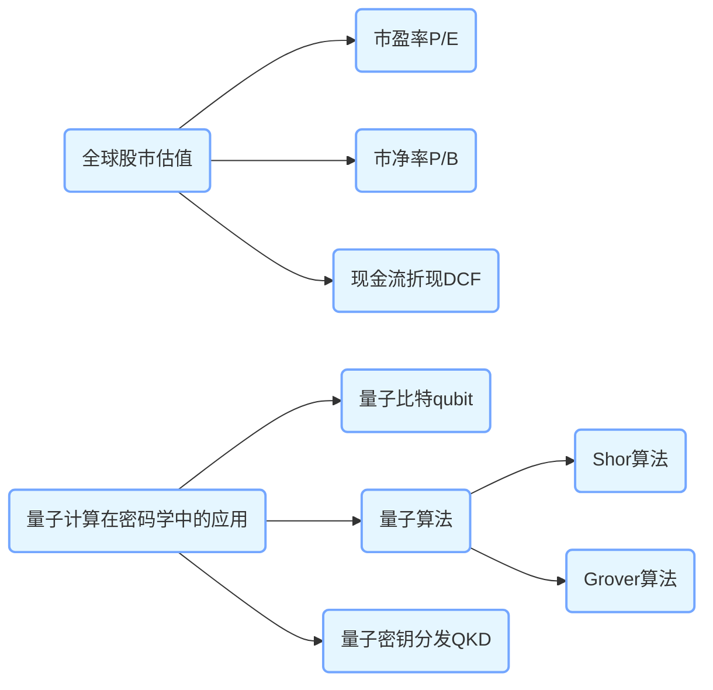

# 全球股市估值与量子计算在密码学中的应用

> 关键词：全球股市估值、量子计算、密码学、估值模型、加密算法

> 摘要：本文旨在深入探讨全球股市估值的方法和原理，同时详细研究量子计算在密码学领域的应用。首先介绍全球股市估值的背景知识，包括其目的、预期读者和文档结构等。接着阐述核心概念，如股市估值的相关指标和量子计算密码学的基本原理，并给出相应的示意图和流程图。详细讲解股市估值的核心算法和量子计算密码学的具体操作步骤，结合Python代码进行说明。通过数学模型和公式对相关内容进行深入分析，并举例说明。给出项目实战案例，包括开发环境搭建、源代码实现和代码解读。探讨全球股市估值和量子计算在密码学中的实际应用场景，推荐相关的学习资源、开发工具和论文著作。最后总结未来发展趋势与挑战，解答常见问题并提供扩展阅读和参考资料。

## 1. 背景介绍 
### 1.1 目的和范围
全球股市估值是金融领域的重要课题，准确的估值有助于投资者做出合理的投资决策，对于金融机构进行资产配置和风险管理也具有关键意义。本部分旨在系统地介绍全球股市估值的常见方法和理论，以及量子计算在密码学中应用的原理和影响。范围涵盖了全球主要股票市场的估值分析，以及量子计算对现有密码学体系的挑战和变革。

### 1.2 预期读者
本文预期读者包括金融投资者、金融分析师、密码学研究人员、计算机科学家以及对金融和科技交叉领域感兴趣的爱好者。投资者可以从中了解股市估值的方法，为投资决策提供参考；研究人员可以深入探讨量子计算在密码学中的前沿应用；爱好者可以拓宽对金融和科技领域的知识面。

### 1.3 文档结构概述
本文首先介绍背景知识，为读者建立基本的认知框架。接着阐述核心概念，包括全球股市估值的相关指标和量子计算密码学的原理。然后详细讲解核心算法和操作步骤，结合Python代码进行说明。通过数学模型和公式对内容进行深入分析，并举例说明。给出项目实战案例，包括开发环境搭建、源代码实现和代码解读。探讨实际应用场景，推荐相关的学习资源、开发工具和论文著作。最后总结未来发展趋势与挑战，解答常见问题并提供扩展阅读和参考资料。

### 1.4 术语表
#### 1.4.1 核心术语定义
- **全球股市估值**：对全球各个股票市场上的上市公司股票价值进行评估的过程，通过各种方法和指标来确定股票的合理价格。
- **量子计算**：基于量子力学原理的计算方式，利用量子比特的叠加和纠缠特性，具有强大的计算能力。
- **密码学**：研究信息加密、解密和认证等技术的学科，旨在保护信息的安全性和隐私性。
- **估值模型**：用于计算股票价值的数学模型，如市盈率模型、现金流折现模型等。
- **加密算法**：用于对信息进行加密的数学算法，如RSA算法、AES算法等。

#### 1.4.2 相关概念解释
- **市盈率（P/E）**：股票价格与每股收益的比率，反映了市场对公司盈利能力的预期。
- **市净率（P/B）**：股票价格与每股净资产的比率，衡量了股票的估值水平。
- **量子比特（qubit）**：量子计算中的基本信息单位，与经典比特不同，它可以同时处于0和1的叠加态。
- **密钥**：在加密和解密过程中使用的参数，只有拥有正确密钥的人才能解密信息。

#### 1.4.3 缩略词列表
- **P/E**：市盈率（Price-to-Earnings Ratio）
- **P/B**：市净率（Price-to-Book Ratio）
- **DCF**：现金流折现（Discounted Cash Flow）
- **RSA**：一种非对称加密算法（Rivest-Shamir-Adleman）
- **AES**：高级加密标准（Advanced Encryption Standard）

## 2. 核心概念与联系 

### 全球股市估值核心概念
全球股市估值涉及多个重要概念和指标，其核心目标是确定股票的内在价值，以判断股票是否被高估或低估。常见的估值指标包括市盈率（P/E）、市净率（P/B）、现金流折现（DCF）等。

- **市盈率（P/E）**：是最常用的估值指标之一，计算公式为 $P/E = \frac{股票价格}{每股收益}$。它反映了市场对公司盈利能力的预期，较高的P/E值可能表示市场对公司未来盈利增长有较高期望，但也可能意味着股票被高估。
- **市净率（P/B）**：计算公式为 $P/B = \frac{股票价格}{每股净资产}$。市净率衡量了股票价格相对于公司净资产的倍数，较低的P/B值可能表示股票被低估，但也可能暗示公司存在潜在问题。
- **现金流折现（DCF）**：该方法基于未来现金流的现值来评估股票价值。其基本思想是将公司未来的现金流按照一定的折现率折现到当前，得到公司的内在价值。公式为 $V = \sum_{t=1}^{n} \frac{CF_t}{(1 + r)^t}$，其中 $V$ 是公司的内在价值，$CF_t$ 是第 $t$ 期的现金流，$r$ 是折现率，$n$ 是预测期数。

### 量子计算在密码学中的核心概念
量子计算的发展对传统密码学提出了巨大挑战，同时也为密码学带来了新的机遇。

- **量子比特（qubit）**：是量子计算的基本信息单位，与经典比特不同，它可以同时处于0和1的叠加态。这使得量子计算机在某些计算任务上具有指数级的速度优势。
- **量子算法**：如Shor算法和Grover算法，对传统密码学产生了重大影响。Shor算法可以在多项式时间内分解大整数，这对基于大整数分解难题的RSA等非对称加密算法构成了威胁。Grover算法可以加速搜索未排序数据库，对对称加密算法的密钥搜索有潜在影响。
- **量子密钥分发（QKD）**：利用量子力学原理实现安全的密钥分发。基于量子态的不可克隆性和测量的不确定性，QKD可以确保密钥在传输过程中的安全性，即使被窃听也会被发现。

### 核心概念联系示意图


该示意图展示了全球股市估值和量子计算在密码学中各自的核心概念，以及它们之间的层次关系。全球股市估值主要围绕市盈率、市净率和现金流折现等指标展开；量子计算在密码学中的应用则涉及量子比特、量子算法和量子密钥分发等关键概念，其中量子算法又包括Shor算法和Grover算法。

## 3. 核心算法原理 & 具体操作步骤 

### 全球股市估值核心算法原理及Python实现

#### 市盈率估值法
市盈率估值法的基本原理是通过同行业或类似公司的平均市盈率来估算目标公司的股票价值。假设目标公司的每股收益为 $EPS$，同行业平均市盈率为 $P/E_{avg}$，则目标公司的股票估值 $V$ 为：$V = EPS \times P/E_{avg}$。

以下是使用Python实现市盈率估值法的代码示例：
```python
def pe_valuation(eps, pe_avg):
    """
    市盈率估值法计算股票价值
    :param eps: 每股收益
    :param pe_avg: 同行业平均市盈率
    :return: 股票估值
    """
    return eps * pe_avg

# 示例数据
eps = 2.5
pe_avg = 15

# 计算股票估值
valuation = pe_valuation(eps, pe_avg)
print(f"根据市盈率估值法，股票估值为: {valuation}")
```
在上述代码中，定义了一个名为 `pe_valuation` 的函数，该函数接受每股收益和同行业平均市盈率作为参数，返回股票的估值。然后使用示例数据调用该函数并打印结果。

#### 现金流折现估值法
现金流折现估值法的核心是将公司未来的现金流按照一定的折现率折现到当前，得到公司的内在价值。假设公司未来 $n$ 期的现金流分别为 $CF_1, CF_2, \cdots, CF_n$，折现率为 $r$，则公司的内在价值 $V$ 为：$V = \sum_{t=1}^{n} \frac{CF_t}{(1 + r)^t}$。

以下是使用Python实现现金流折现估值法的代码示例：
```python
def dcf_valuation(cash_flows, discount_rate):
    """
    现金流折现估值法计算公司内在价值
    :param cash_flows: 未来各期现金流列表
    :param discount_rate: 折现率
    :return: 公司内在价值
    """
    value = 0
    for t, cf in enumerate(cash_flows, start=1):
        value += cf / ((1 + discount_rate) ** t)
    return value

# 示例数据
cash_flows = [100, 120, 150, 180, 200]
discount_rate = 0.1

# 计算公司内在价值
valuation = dcf_valuation(cash_flows, discount_rate)
print(f"根据现金流折现估值法，公司内在价值为: {valuation}")
```
在上述代码中，定义了一个名为 `dcf_valuation` 的函数，该函数接受未来各期现金流列表和折现率作为参数，通过循环计算各期现金流的现值并累加，最终返回公司的内在价值。然后使用示例数据调用该函数并打印结果。

### 量子计算在密码学中的核心算法原理及操作步骤

#### Shor算法原理及操作步骤
Shor算法的主要目的是在多项式时间内分解大整数，这对基于大整数分解难题的RSA等非对称加密算法构成了威胁。其基本步骤如下：
1. **选择一个待分解的大整数 $N$**：$N$ 是RSA算法中的公钥的一部分。
2. **随机选择一个整数 $a$，满足 $1 < a < N$**：计算 $a$ 和 $N$ 的最大公约数 $gcd(a, N)$。如果 $gcd(a, N) > 1$，则 $gcd(a, N)$ 是 $N$ 的一个因子，分解完成；否则，继续下一步。
3. **使用量子计算机计算函数 $f(x) = a^x \mod N$ 的周期 $r$**：这是Shor算法的核心步骤，利用量子傅里叶变换等技术可以在多项式时间内完成。
4. **检查 $r$ 是否为偶数**：如果 $r$ 是偶数且 $a^{r/2} \not\equiv -1 \mod N$，则 $gcd(a^{r/2} + 1, N)$ 和 $gcd(a^{r/2} - 1, N)$ 是 $N$ 的两个非平凡因子，分解完成；否则，返回步骤2重新选择 $a$。

由于Shor算法的实现涉及复杂的量子计算操作，目前在经典计算机上只能进行模拟。以下是一个简单的Python代码示例，用于模拟Shor算法的部分步骤：
```python
import math
from sympy import gcd

def shor_algorithm(N):
    """
    模拟Shor算法的部分步骤
    :param N: 待分解的大整数
    :return: 可能的因子
    """
    while True:
        # 随机选择一个整数a
        a = 2  # 简单示例，实际应随机选择
        if gcd(a, N) > 1:
            return gcd(a, N)
        # 模拟计算周期r（实际需要量子计算机）
        r = 4  # 简单示例，实际需要量子算法计算
        if r % 2 == 0 and pow(a, r // 2, N)!= -1 % N:
            factor1 = gcd(pow(a, r // 2) + 1, N)
            factor2 = gcd(pow(a, r // 2) - 1, N)
            if factor1 > 1 and factor1 < N:
                return factor1
            elif factor2 > 1 and factor2 < N:
                return factor2

# 示例数据
N = 15
factor = shor_algorithm(N)
print(f"使用Shor算法分解 {N} 得到的一个因子为: {factor}")
```
在上述代码中，定义了一个名为 `shor_algorithm` 的函数，该函数接受一个待分解的大整数 $N$ 作为参数。在函数内部，首先随机选择一个整数 $a$，计算 $a$ 和 $N$ 的最大公约数。如果最大公约数大于1，则返回该公约数作为 $N$ 的一个因子。然后模拟计算周期 $r$，如果 $r$ 满足条件，则计算可能的因子并返回。最后使用示例数据调用该函数并打印结果。

#### Grover算法原理及操作步骤
Grover算法的主要目的是加速搜索未排序数据库，对对称加密算法的密钥搜索有潜在影响。其基本步骤如下：
1. **初始化量子态**：将所有量子比特初始化为等概率叠加态。
2. **定义目标状态**：确定要搜索的目标元素。
3. **应用Grover迭代**：包括相位反转和扩散操作，重复多次迭代以增加目标状态的概率振幅。
4. **测量量子态**：测量量子态，以较高的概率得到目标状态。

以下是一个简单的Python代码示例，用于模拟Grover算法的部分步骤：
```python
import numpy as np

def grover_algorithm(num_qubits, target):
    """
    模拟Grover算法的部分步骤
    :param num_qubits: 量子比特数
    :param target: 目标状态
    :return: 可能的搜索结果
    """
    # 初始化量子态
    num_states = 2 ** num_qubits
    state = np.ones(num_states) / np.sqrt(num_states)
    # 定义Oracle函数
    oracle = np.eye(num_states)
    oracle[target, target] = -1
    # 定义扩散算子
    diffusion = 2 * np.ones((num_states, num_states)) / num_states - np.eye(num_states)
    # 迭代次数
    iterations = int(np.pi / 4 * np.sqrt(num_states))
    for _ in range(iterations):
        # 应用Oracle函数
        state = np.dot(oracle, state)
        # 应用扩散算子
        state = np.dot(diffusion, state)
    # 测量量子态
    probabilities = np.abs(state) ** 2
    result = np.random.choice(num_states, p=probabilities)
    return result

# 示例数据
num_qubits = 3
target = 5
result = grover_algorithm(num_qubits, target)
print(f"使用Grover算法搜索得到的结果为: {result}")
```
在上述代码中，定义了一个名为 `grover_algorithm` 的函数，该函数接受量子比特数和目标状态作为参数。在函数内部，首先初始化量子态为等概率叠加态，然后定义Oracle函数和扩散算子。接着进行多次迭代，每次迭代包括应用Oracle函数和扩散算子。最后测量量子态，根据概率分布选择一个结果并返回。使用示例数据调用该函数并打印结果。

## 4. 数学模型和公式 & 详细讲解 & 举例说明 

### 全球股市估值数学模型和公式

#### 市盈率模型
市盈率（P/E）模型是最简单也是最常用的股市估值模型之一。其基本公式为：
$$P/E = \frac{P}{EPS}$$
其中，$P$ 是股票价格，$EPS$ 是每股收益。通过变形可以得到股票估值公式：
$$P = EPS \times P/E$$

例如，某公司的每股收益为 $5$ 元，同行业平均市盈率为 $20$，则该公司股票的估值为：
$$P = 5 \times 20 = 100 \text{ 元}$$

#### 市净率模型
市净率（P/B）模型通过比较股票价格和每股净资产来评估股票价值。公式为：
$$P/B = \frac{P}{BVPS}$$
其中，$P$ 是股票价格，$BVPS$ 是每股净资产。变形后得到股票估值公式：
$$P = BVPS \times P/B$$

假设某公司每股净资产为 $10$ 元，市净率为 $1.5$，则该公司股票的估值为：
$$P = 10 \times 1.5 = 15 \text{ 元}$$

#### 现金流折现模型
现金流折现（DCF）模型是一种基于未来现金流的估值方法。假设公司未来 $n$ 期的现金流分别为 $CF_1, CF_2, \cdots, CF_n$，折现率为 $r$，则公司的内在价值 $V$ 为：
$$V = \sum_{t=1}^{n} \frac{CF_t}{(1 + r)^t}$$

例如，某公司未来 $3$ 年的现金流分别为 $100$ 万元、$120$ 万元和 $150$ 万元，折现率为 $10\%$，则该公司的内在价值为：
$$V = \frac{100}{(1 + 0.1)^1} + \frac{120}{(1 + 0.1)^2} + \frac{150}{(1 + 0.1)^3}$$
$$V = \frac{100}{1.1} + \frac{120}{1.21} + \frac{150}{1.331}$$
$$V \approx 90.91 + 99.17 + 112.69 = 302.77 \text{ 万元}$$

### 量子计算在密码学中的数学模型和公式

#### Shor算法相关公式
Shor算法的核心是计算函数 $f(x) = a^x \mod N$ 的周期 $r$。在量子计算中，通过量子傅里叶变换（QFT）来实现这一计算。量子傅里叶变换的公式为：
$$\text{QFT}(\vert x \rangle) = \frac{1}{\sqrt{2^n}} \sum_{y=0}^{2^n - 1} e^{2\pi i \frac{xy}{2^n}} \vert y \rangle$$
其中，$\vert x \rangle$ 是输入的量子态，$n$ 是量子比特数。

假设要分解的大整数 $N = 15$，选择 $a = 2$，则函数 $f(x) = 2^x \mod 15$ 的周期 $r$ 为 $4$，因为：
$$2^0 \mod 15 = 1$$
$$2^1 \mod 15 = 2$$
$$2^2 \mod 15 = 4$$
$$2^3 \mod 15 = 8$$
$$2^4 \mod 15 = 1$$

#### Grover算法相关公式
Grover算法的核心是通过迭代操作增加目标状态的概率振幅。每次迭代包括相位反转和扩散操作。

相位反转操作的矩阵表示为：
$$O = I - 2 \vert t \rangle \langle t \vert$$
其中，$\vert t \rangle$ 是目标状态，$I$ 是单位矩阵。

扩散操作的矩阵表示为：
$$D = 2 \vert s \rangle \langle s \vert - I$$
其中，$\vert s \rangle$ 是初始的等概率叠加态。

假设使用 $2$ 个量子比特进行搜索，目标状态为 $\vert 11 \rangle$，初始叠加态为 $\vert s \rangle = \frac{1}{2} (\vert 00 \rangle + \vert 01 \rangle + \vert 10 \rangle + \vert 11 \rangle)$。经过一次Grover迭代后，目标状态的概率振幅会增加。

## 5. 项目实战：代码实际案例和详细解释说明 

### 5.1  开发环境搭建
#### 全球股市估值项目
- **Python环境**：建议使用Python 3.7及以上版本。可以从Python官方网站（https://www.python.org/downloads/）下载并安装。
- **第三方库**：需要安装 `pandas`、`numpy` 等库，用于数据处理和计算。可以使用 `pip` 命令进行安装：
```sh
pip install pandas numpy
```

#### 量子计算在密码学中的应用项目
- **Python环境**：同样建议使用Python 3.7及以上版本。
- **第三方库**：需要安装 `qiskit` 库，用于量子计算模拟。可以使用 `pip` 命令进行安装：
```sh
pip install qiskit
```

### 5.2  源代码详细实现和代码解读

#### 全球股市估值项目
以下是一个完整的全球股市估值项目示例，使用市盈率和现金流折现法对股票进行估值：
```python
import pandas as pd
import numpy as np

def pe_valuation(eps, pe_avg):
    """
    市盈率估值法计算股票价值
    :param eps: 每股收益
    :param pe_avg: 同行业平均市盈率
    :return: 股票估值
    """
    return eps * pe_avg

def dcf_valuation(cash_flows, discount_rate):
    """
    现金流折现估值法计算公司内在价值
    :param cash_flows: 未来各期现金流列表
    :param discount_rate: 折现率
    :return: 公司内在价值
    """
    value = 0
    for t, cf in enumerate(cash_flows, start=1):
        value += cf / ((1 + discount_rate) ** t)
    return value

# 示例数据
eps = 2.5
pe_avg = 15
cash_flows = [100, 120, 150, 180, 200]
discount_rate = 0.1

# 市盈率估值
pe_val = pe_valuation(eps, pe_avg)
print(f"根据市盈率估值法，股票估值为: {pe_val}")

# 现金流折现估值
dcf_val = dcf_valuation(cash_flows, discount_rate)
print(f"根据现金流折现估值法，公司内在价值为: {dcf_val}")
```
**代码解读**：
- `pe_valuation` 函数：接受每股收益和同行业平均市盈率作为参数，返回股票的估值。
- `dcf_valuation` 函数：接受未来各期现金流列表和折现率作为参数，通过循环计算各期现金流的现值并累加，返回公司的内在价值。
- 示例数据部分：定义了每股收益、同行业平均市盈率、未来各期现金流和折现率。
- 估值计算部分：分别调用 `pe_valuation` 和 `dcf_valuation` 函数进行市盈率估值和现金流折现估值，并打印结果。

#### 量子计算在密码学中的应用项目
以下是一个使用 `qiskit` 库模拟Grover算法的项目示例：
```python
import numpy as np
from qiskit import QuantumCircuit, Aer, execute
from qiskit.visualization import plot_histogram
import matplotlib.pyplot as plt

def grover_algorithm(num_qubits, target):
    """
    使用qiskit模拟Grover算法
    :param num_qubits: 量子比特数
    :param target: 目标状态
    :return: 测量结果
    """
    # 创建量子电路
    qc = QuantumCircuit(num_qubits, num_qubits)
    # 初始化量子态为等概率叠加态
    for qubit in range(num_qubits):
        qc.h(qubit)
    # 迭代次数
    iterations = int(np.pi / 4 * np.sqrt(2 ** num_qubits))
    for _ in range(iterations):
        # 定义Oracle函数
        oracle = QuantumCircuit(num_qubits)
        oracle.x(target)
        oracle.mct(list(range(num_qubits - 1)), num_qubits - 1)
        oracle.x(target)
        qc.compose(oracle, inplace=True)
        # 定义扩散算子
        diffusion = QuantumCircuit(num_qubits)
        for qubit in range(num_qubits):
            diffusion.h(qubit)
            diffusion.x(qubit)
        diffusion.mct(list(range(num_qubits - 1)), num_qubits - 1)
        for qubit in range(num_qubits):
            diffusion.x(qubit)
            diffusion.h(qubit)
        qc.compose(diffusion, inplace=True)
    # 测量量子态
    qc.measure(range(num_qubits), range(num_qubits))
    # 模拟运行
    simulator = Aer.get_backend('qasm_simulator')
    job = execute(qc, simulator, shots=1000)
    result = job.result()
    counts = result.get_counts(qc)
    return counts

# 示例数据
num_qubits = 3
target = 5
counts = grover_algorithm(num_qubits, target)
# 绘制测量结果直方图
plot_histogram(counts).show()
```
**代码解读**：
- `grover_algorithm` 函数：接受量子比特数和目标状态作为参数，返回测量结果。
- 量子电路创建部分：使用 `QuantumCircuit` 类创建量子电路，并将所有量子比特初始化为等概率叠加态。
- 迭代部分：根据Grover算法的迭代次数，重复应用Oracle函数和扩散算子。
- Oracle函数部分：通过 `x` 门和多控制非门（`mct`）实现目标状态的相位反转。
- 扩散算子部分：通过 `h` 门和 `x` 门以及多控制非门实现扩散操作。
- 测量部分：使用 `measure` 方法测量量子态，并使用 `qasm_simulator` 进行模拟运行。
- 结果展示部分：使用 `plot_histogram` 函数绘制测量结果的直方图。

### 5.3  代码解读与分析

#### 全球股市估值项目
- **代码优点**：代码结构清晰，将市盈率估值和现金流折现估值分别封装成函数，提高了代码的复用性。使用Python的基本数据类型和循环结构，易于理解和修改。
- **代码缺点**：示例数据是硬编码的，实际应用中需要从数据源（如金融数据库）获取数据。没有考虑更多的影响因素，如宏观经济环境、行业竞争等。
- **改进方向**：可以使用 `pandas` 库从金融数据源读取数据，如雅虎财经、Tushare等。增加更多的估值方法和影响因素，提高估值的准确性。

#### 量子计算在密码学中的应用项目
- **代码优点**：使用 `qiskit` 库进行量子计算模拟，代码具有较好的可读性和可扩展性。通过绘制测量结果的直方图，直观地展示了Grover算法的搜索效果。
- **代码缺点**：模拟的规模较小，实际的量子计算需要使用真正的量子计算机。Oracle函数和扩散算子的实现相对简单，对于复杂的问题可能需要更复杂的设计。
- **改进方向**：可以尝试使用更高级的量子算法和技术，如量子纠错码，提高模拟的准确性。与实际的量子计算机进行连接，进行真实的实验。

## 6. 实际应用场景 

### 全球股市估值的实际应用场景
#### 投资者决策
投资者可以使用全球股市估值方法来评估不同股票的价值，从而做出投资决策。例如，通过市盈率估值法比较同行业不同公司的估值水平，选择被低估的股票进行投资。现金流折现估值法可以帮助投资者评估公司的长期价值，对于长期投资具有重要意义。

#### 金融机构资产配置
金融机构如基金公司、保险公司等在进行资产配置时，需要对全球股市进行估值分析。通过合理的估值，金融机构可以确定不同股票市场和行业的投资比例，优化资产组合，降低风险，提高收益。

#### 企业并购和重组
在企业并购和重组过程中，需要对目标企业的价值进行评估。全球股市估值方法可以为企业提供参考，帮助企业确定合理的收购价格和交易方案。

### 量子计算在密码学中的实际应用场景
#### 量子密钥分发
量子密钥分发（QKD）是量子计算在密码学中的重要应用之一。通过利用量子态的不可克隆性和测量的不确定性，QKD可以实现安全的密钥分发。在金融、政府、军事等领域，对信息安全要求较高，QKD可以为这些领域提供更高级别的安全保障。

#### 后量子密码学研究
随着量子计算技术的发展，传统的密码学算法面临着被破解的风险。后量子密码学研究旨在开发能够抵抗量子计算机攻击的新型密码算法。量子计算的原理和技术可以为后量子密码学的研究提供重要的理论支持和实验手段。

#### 量子安全通信网络
构建量子安全通信网络是量子计算在密码学中的另一个重要应用场景。通过将量子密钥分发技术与传统通信网络相结合，可以实现端到端的量子安全通信。量子安全通信网络可以应用于云计算、物联网等领域，保障这些领域的数据安全。

## 7. 工具和资源推荐
### 7.1 学习资源推荐
#### 7.1.1 书籍推荐
- 《证券分析》（Security Analysis）：由本杰明·格雷厄姆（Benjamin Graham）和戴维·多德（David Dodd）所著，是价值投资领域的经典著作，详细介绍了股票估值的方法和理论。
- 《量子计算与量子信息》（Quantum Computation and Quantum Information）：由迈克尔·尼尔森（Michael Nielsen）和艾萨克·庄（Isaac Chuang）所著，是量子计算领域的权威教材，全面介绍了量子计算的原理、算法和应用。
- 《密码学原理与实践》（Cryptography: Theory and Practice）：由道格拉斯·斯廷森（Douglas Stinson）所著，系统介绍了密码学的基本原理、算法和应用，是密码学领域的经典教材。

#### 7.1.2 在线课程
- Coursera上的“金融市场”（Financial Markets）课程：由耶鲁大学教授罗伯特·席勒（Robert Shiller）授课，介绍了金融市场的基本原理和投资策略，包括股市估值方法。
- edX上的“量子计算基础”（Fundamentals of Quantum Computation）课程：由加拿大滑铁卢大学教授米歇尔·莫斯卡（Michele Mosca）授课，系统介绍了量子计算的基本概念、原理和算法。
- Udemy上的“密码学基础”（Cryptography Fundamentals）课程：介绍了密码学的基本原理、算法和应用，适合初学者学习。

#### 7.1.3 技术博客和网站
- 雪球（https://xueqiu.com/）：是国内知名的金融投资社区，提供了丰富的股市估值分析文章和讨论。
- Quantum Computing Report（https://www.quantumcomputingreport.com/）：专注于量子计算领域的新闻、分析和研究报告。
- Cryptology ePrint Archive（https://eprint.iacr.org/）：是密码学领域的预印本服务器，提供了最新的密码学研究成果。

### 7.2 开发工具框架推荐
#### 7.2.1 IDE和编辑器
- PyCharm：是一款功能强大的Python集成开发环境，支持代码编辑、调试、版本控制等功能，适合开发全球股市估值和量子计算相关的Python项目。
- Jupyter Notebook：是一个交互式的开发环境，支持Python、R等多种编程语言。可以方便地进行代码编写、数据可视化和文档撰写，适合进行算法验证和实验。

#### 7.2.2 调试和性能分析工具
- PDB：是Python自带的调试工具，可以在代码中设置断点，逐步执行代码，查看变量的值和程序的执行流程。
- cProfile：是Python的性能分析工具，可以统计代码中各个函数的执行时间和调用次数，帮助开发者找出性能瓶颈。

#### 7.2.3 相关框架和库
- Pandas：是Python中用于数据处理和分析的强大库，提供了丰富的数据结构和函数，适合处理金融数据和进行股市估值分析。
- Qiskit：是IBM开发的开源量子计算框架，提供了量子电路设计、模拟和实验的工具，适合进行量子计算在密码学中的应用开发。
- Crypto：是Python的密码学库，提供了各种加密算法的实现，如RSA、AES等，适合进行密码学算法的实验和验证。

### 7.3 相关论文著作推荐
#### 7.3.1 经典论文
- “A Method for Obtaining Digital Signatures and Public-Key Cryptosystems”：由罗纳德·李维斯特（Ronald Rivest）、阿迪·沙米尔（Adi Shamir）和伦纳德·阿德曼（Leonard Adleman）发表，介绍了RSA非对称加密算法，是密码学领域的经典论文。
- “Polynomial-Time Algorithms for Prime Factorization and Discrete Logarithms on a Quantum Computer”：由彼得·肖尔（Peter Shor）发表，提出了Shor算法，证明了量子计算机可以在多项式时间内分解大整数，对传统密码学产生了重大影响。
- “A Fast Quantum Mechanical Algorithm for Database Search”：由洛夫·格罗弗（Lov Grover）发表，提出了Grover算法，展示了量子计算机在搜索未排序数据库方面的优势。

#### 7.3.2 最新研究成果
- 关注量子计算和密码学领域的顶级学术会议，如ACM SIGSAC Conference on Computer and Communications Security（CCS）、IEEE Symposium on Security and Privacy（SP）等，这些会议上会发表最新的研究成果。
- 关注相关学术期刊，如Journal of Cryptology、Quantum Information & Computation等，这些期刊会刊登量子计算和密码学领域的高质量研究论文。

#### 7.3.3 应用案例分析
- 关注金融机构和科技公司的研究报告和案例分析，了解全球股市估值和量子计算在密码学中的实际应用案例。例如，IBM的量子计算应用案例、金融机构的股市估值模型和投资策略报告等。

## 8. 总结：未来发展趋势与挑战

### 全球股市估值的未来发展趋势与挑战
#### 发展趋势
- **智能化和自动化**：随着人工智能和机器学习技术的发展，股市估值将越来越智能化和自动化。利用大数据和深度学习算法，可以更准确地预测股票价格和公司业绩，提高估值的准确性和效率。
- **多因素综合估值**：未来的股市估值将不再局限于传统的市盈率、市净率等指标，而是会综合考虑更多的因素，如宏观经济环境、行业竞争、公司治理等。通过构建多因素模型，可以更全面地评估股票的价值。
- **国际化和全球化**：随着全球经济一体化的发展，全球股市之间的联系越来越紧密。未来的股市估值将更加注重国际化和全球化，考虑不同国家和地区的经济、政治、文化等因素对股市的影响。

#### 挑战
- **数据质量和可靠性**：股市估值需要大量的金融数据，数据的质量和可靠性直接影响估值的准确性。如何获取准确、及时、完整的金融数据，并进行有效的数据清洗和预处理，是股市估值面临的重要挑战。
- **市场不确定性**：股票市场具有高度的不确定性，受到宏观经济环境、政策变化、突发事件等多种因素的影响。如何在不确定性的市场环境中准确地评估股票的价值，是股市估值面临的另一个挑战。
- **模型的局限性**：现有的股市估值模型都有一定的局限性，无法完全准确地反映股票的真实价值。如何不断改进和完善估值模型，提高模型的适应性和准确性，是股市估值领域需要解决的问题。

### 量子计算在密码学中的未来发展趋势与挑战
#### 发展趋势
- **量子密码技术的实用化**：随着量子计算技术的不断发展，量子密码技术将逐渐从实验室走向实用化。量子密钥分发、后量子密码学等技术将在金融、政府、军事等领域得到广泛应用，为信息安全提供更高级别的保障。
- **量子计算与传统密码学的融合**：未来的密码学体系将是量子计算与传统密码学的融合。一方面，利用量子计算的强大计算能力来破解传统密码算法；另一方面，开发能够抵抗量子计算机攻击的新型密码算法，将传统密码学与量子密码学相结合，构建更加安全的密码学体系。
- **量子安全通信网络的建设**：构建量子安全通信网络是量子计算在密码学中的重要发展方向。未来，随着量子密钥分发技术的不断完善和成本的降低，量子安全通信网络将逐渐普及，实现全球范围内的安全通信。

#### 挑战
- **量子计算技术的发展瓶颈**：目前，量子计算技术还面临着许多技术瓶颈，如量子比特的稳定性、量子门的精度、量子纠错等。如何突破这些技术瓶颈，提高量子计算机的性能和可靠性，是量子计算在密码学中应用的关键挑战。
- **后量子密码算法的标准化**：随着量子计算技术的发展，传统的密码算法面临着被破解的风险。开发能够抵抗量子计算机攻击的后量子密码算法是当务之急。然而，目前后量子密码算法还没有形成统一的标准，如何选择和推广合适的后量子密码算法，是密码学领域需要解决的问题。
- **量子安全意识的提高**：量子计算对传统密码学的冲击需要引起社会各界的广泛关注。提高人们的量子安全意识，加强对量子安全技术的研究和应用，是保障信息安全的重要前提。

## 9. 附录：常见问题与解答

### 全球股市估值相关问题
#### 问：市盈率估值法有什么局限性？
答：市盈率估值法的局限性主要包括：它只考虑了公司的盈利情况，没有考虑公司的资产质量、现金流等因素；不同行业的市盈率水平差异较大，不能简单地进行跨行业比较；市盈率是基于过去的盈利数据计算的，不能准确反映公司未来的盈利增长情况。

#### 问：现金流折现估值法中的折现率如何确定？
答：折现率的确定需要综合考虑多种因素，如无风险利率、市场风险溢价、公司的风险水平等。无风险利率通常可以参考国债收益率；市场风险溢价反映了投资者对股票市场整体风险的补偿；公司的风险水平可以通过分析公司的财务状况、行业竞争等因素来评估。

### 量子计算在密码学中相关问题
#### 问：量子计算机什么时候能够破解现有的密码算法？
答：目前量子计算机的性能还不足以破解现有的密码算法，但随着量子计算技术的不断发展，未来存在这种可能性。具体的时间难以预测，取决于量子比特的数量、稳定性、量子门的精度等技术指标的发展速度。

#### 问：量子密钥分发是否绝对安全？
答：量子密钥分发基于量子力学原理，具有理论上的绝对安全性。但在实际应用中，由于设备的不完善和环境的干扰等因素，可能会存在一定的安全漏洞。因此，需要不断改进和完善量子密钥分发技术，提高其安全性和可靠性。

## 10. 扩展阅读 & 参考资料
### 扩展阅读
- 《聪明的投资者》（The Intelligent Investor）：由本杰明·格雷厄姆所著，进一步阐述了价值投资的理念和方法，对于理解股市估值具有重要的参考价值。
- 《上帝掷骰子吗？量子物理史话》：由曹天元所著，以生动有趣的方式介绍了量子物理的发展历程和基本概念，有助于读者更好地理解量子计算在密码学中的应用。
- 《密码朋克：自由与互联网的未来》（Crypto Anarchy, Cyberstates, and Pirate Utopias）：由朱利安·阿桑奇（Julian Assange）等人所著，探讨了密码学在互联网自由和隐私保护方面的应用和影响。

### 参考资料
- Yahoo Finance（https://finance.yahoo.com/）：提供全球股市的实时行情、财务数据等信息，是进行股市估值分析的重要数据源。
- IBM Quantum（https://quantum-computing.ibm.com/）：提供量子计算的学习资源、在线模拟器和实际量子计算机的访问接口，是进行量子计算研究和开发的重要平台。
- International Association for Cryptologic Research（IACR）（https://www.iacr.org/）：是密码学领域的国际学术组织，提供密码学领域的最新研究成果、学术会议和期刊等信息。

作者：AI天才研究院/AI Genius Institute & 禅与计算机程序设计艺术 /Zen And The Art of Computer Programming