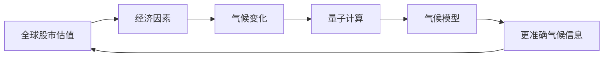

# 全球股市估值与量子计算在气候模型中的应用

> 关键词：全球股市估值、量子计算、气候模型、金融市场、环境科学

> 摘要：本文旨在深入探讨全球股市估值以及量子计算在气候模型中的应用。首先介绍全球股市估值的相关背景知识，包括其目的、适用读者群体等，阐述核心概念与联系，分析其核心算法原理并给出操作步骤。接着引入量子计算在气候模型中的应用，讲解相关的概念、算法和数学模型。通过项目实战案例，展示两者在实际中的应用情况。探讨它们各自的实际应用场景，推荐学习所需的工具和资源。最后总结未来发展趋势与挑战，解答常见问题并提供扩展阅读和参考资料，为金融和环境科学领域的研究者和从业者提供全面且深入的技术参考。

## 1. 背景介绍 
### 1.1 目的和范围
本部分旨在全面阐述全球股市估值以及量子计算在气候模型中的应用相关知识。对于全球股市估值，我们将详细介绍其原理、方法和实际应用，帮助投资者和金融从业者更准确地评估股票价值，做出合理的投资决策。而对于量子计算在气候模型中的应用，我们将探讨量子计算如何为气候模型带来革新，提高气候预测的准确性和效率，为环境科学领域的研究和决策提供支持。

### 1.2 预期读者
本文预期读者包括金融领域的投资者、分析师、基金经理等，他们希望通过了解全球股市估值的方法和技术，提升投资收益和风险管理能力。同时，环境科学领域的研究人员、气象学家、政策制定者等也可以从量子计算在气候模型中的应用中获取有价值的信息，推动气候研究和环境保护工作的发展。此外，对金融和环境科学交叉领域感兴趣的学生和研究人员也可以从本文中获得启发。

### 1.3 文档结构概述
本文将按照以下结构进行组织：首先介绍背景信息，包括目的、预期读者和文档结构概述。接着分别阐述全球股市估值和量子计算在气候模型中的应用的核心概念与联系，详细讲解核心算法原理和具体操作步骤，给出相关的数学模型和公式，并举例说明。通过项目实战案例，展示两者在实际中的应用情况。探讨它们各自的实际应用场景，推荐学习所需的工具和资源。最后总结未来发展趋势与挑战，解答常见问题并提供扩展阅读和参考资料。

### 1.4 术语表
#### 1.4.1 核心术语定义
- **全球股市估值**：指对全球范围内股票市场中各类股票的价值进行评估的过程和方法，旨在确定股票的内在价值，为投资决策提供依据。
- **量子计算**：基于量子力学原理进行信息处理的计算方式，具有强大的并行计算能力，能够在某些问题上比传统计算机更高效地求解。
- **气候模型**：通过数学方程和物理规律描述地球气候系统的计算机模型，用于模拟和预测气候变化。

#### 1.4.2 相关概念解释
- **股票内在价值**：股票所代表的企业未来预期现金流的现值，是股票的真实价值，不受市场短期波动的影响。
- **量子比特**：量子计算中的基本信息单位，与传统计算机中的比特类似，但具有量子叠加和纠缠等特性。
- **气候系统**：包括大气圈、水圈、岩石圈、生物圈和冰冻圈等多个圈层相互作用的复杂系统。

#### 1.4.3 缩略词列表
- **GDP**：国内生产总值（Gross Domestic Product）
- **CPI**：消费者物价指数（Consumer Price Index）
- **QC**：量子计算（Quantum Computing）

## 2. 核心概念与联系 

### 全球股市估值核心概念
全球股市估值是金融领域的重要课题，其核心在于确定股票的合理价值。常见的估值方法包括市盈率（P/E）法、市净率（P/B）法、现金流折现法（DCF）等。市盈率是指股票价格与每股收益的比率，反映了投资者为获取每股收益所愿意支付的价格。市净率是股票价格与每股净资产的比率，衡量了股票价格相对于净资产的溢价程度。现金流折现法是通过预测企业未来的现金流，并将其折现到当前时刻，得到股票的内在价值。

### 量子计算在气候模型中的应用核心概念
量子计算在气候模型中的应用主要基于其强大的计算能力。传统的气候模型由于计算资源的限制，在模拟复杂的气候系统时存在一定的局限性。量子计算可以通过并行计算的方式，同时处理大量的数据和复杂的计算任务，提高气候模型的精度和效率。例如，量子计算机可以更准确地模拟大气环流、海洋温度变化等复杂的气候现象。

### 核心概念的联系
虽然全球股市估值和量子计算在气候模型中的应用看似是两个不同的领域，但它们之间也存在一定的联系。一方面，气候变化可能会对全球经济和股市产生影响，例如极端天气事件可能会影响企业的生产和经营，从而影响股票的价值。另一方面，量子计算在气候模型中的应用可以为投资者提供更准确的气候信息，帮助他们更好地评估气候变化对企业和股市的影响，从而做出更合理的投资决策。

### 文本示意图
```plaintext
全球股市估值 <---- 经济因素 ----> 气候变化 <---- 量子计算 ----> 气候模型
```

### Mermaid 流程图


## 3. 核心算法原理 & 具体操作步骤 

### 全球股市估值核心算法原理及 Python 实现

#### 市盈率法
市盈率法的核心原理是通过比较股票的市盈率与同行业或市场平均市盈率，来判断股票的估值是否合理。计算公式为：

$P/E = \frac{股价}{每股收益}$

以下是使用 Python 实现市盈率法的代码示例：
```python
def pe_ratio(stock_price, earnings_per_share):
    """
    计算市盈率
    :param stock_price: 股票价格
    :param earnings_per_share: 每股收益
    :return: 市盈率
    """
    return stock_price / earnings_per_share

# 示例数据
stock_price = 50
earnings_per_share = 5

# 计算市盈率
pe = pe_ratio(stock_price, earnings_per_share)
print(f"市盈率: {pe}")
```

#### 现金流折现法
现金流折现法的核心原理是将企业未来的现金流折现到当前时刻，得到股票的内在价值。计算公式为：

$V = \sum_{t=1}^{n} \frac{CF_t}{(1 + r)^t}$

其中，$V$ 为股票的内在价值，$CF_t$ 为第 $t$ 期的现金流，$r$ 为折现率，$n$ 为预测期数。

以下是使用 Python 实现现金流折现法的代码示例：
```python
def dcf(cash_flows, discount_rate):
    """
    现金流折现法计算股票内在价值
    :param cash_flows: 未来现金流列表
    :param discount_rate: 折现率
    :return: 股票内在价值
    """
    present_value = 0
    for t, cf in enumerate(cash_flows, start=1):
        present_value += cf / ((1 + discount_rate) ** t)
    return present_value

# 示例数据
cash_flows = [100, 120, 150, 180, 200]
discount_rate = 0.1

# 计算股票内在价值
intrinsic_value = dcf(cash_flows, discount_rate)
print(f"股票内在价值: {intrinsic_value}")
```

### 量子计算在气候模型中的应用核心算法原理及 Python 示例（简化模拟）

量子计算在气候模型中的应用涉及到复杂的量子算法，这里我们给出一个简化的模拟示例，展示量子计算如何处理气候数据。

```python
import numpy as np

# 假设我们有一个简单的气候数据矩阵
climate_data = np.array([[1, 2, 3], [4, 5, 6], [7, 8, 9]])

# 模拟量子计算的并行处理
def quantum_simulate(data):
    """
    模拟量子计算对气候数据的处理
    :param data: 气候数据矩阵
    :return: 处理后的结果
    """
    # 这里简单地对矩阵进行平方运算来模拟量子计算的并行处理能力
    result = data ** 2
    return result

# 进行量子模拟
processed_data = quantum_simulate(climate_data)
print("处理后的气候数据:")
print(processed_data)
```

## 4. 数学模型和公式 & 详细讲解 & 举例说明 

### 全球股市估值数学模型和公式

#### 市盈率法
如前面所述，市盈率的计算公式为：

$P/E = \frac{股价}{每股收益}$

详细讲解：市盈率是衡量股票估值的常用指标之一。如果某只股票的市盈率高于同行业平均水平，可能意味着该股票被高估；反之，则可能被低估。例如，某行业平均市盈率为 20，而某只股票的市盈率为 30，说明该股票相对较贵。

#### 市净率法
市净率的计算公式为：

$P/B = \frac{股价}{每股净资产}$

详细讲解：市净率反映了股票价格相对于净资产的溢价程度。一般来说，市净率较低的股票可能具有较高的投资价值。例如，某只股票的市净率为 1.5，说明其股价是每股净资产的 1.5 倍。

#### 现金流折现法
现金流折现法的计算公式为：

$V = \sum_{t=1}^{n} \frac{CF_t}{(1 + r)^t}$

详细讲解：该公式中，$CF_t$ 表示第 $t$ 期的现金流，$r$ 为折现率，$n$ 为预测期数。折现率反映了资金的时间价值和投资风险。例如，假设某企业未来 5 年的现金流分别为 100 万元、120 万元、150 万元、180 万元、200 万元，折现率为 10%，则可以使用上述公式计算该企业股票的内在价值。

### 量子计算在气候模型中的应用数学模型和公式

#### 量子态表示
在量子计算中，量子比特的状态可以用向量表示。一个量子比特的状态可以表示为：

$|\psi\rangle = \alpha|0\rangle + \beta|1\rangle$

其中，$\alpha$ 和 $\beta$ 是复数，满足 $|\alpha|^2 + |\beta|^2 = 1$。$|0\rangle$ 和 $|1\rangle$ 是基态。

详细讲解：量子比特的这种表示方式体现了量子叠加的特性，即一个量子比特可以同时处于 $|0\rangle$ 和 $|1\rangle$ 两种状态的叠加。例如，当 $\alpha = \frac{1}{\sqrt{2}}$，$\beta = \frac{1}{\sqrt{2}}$ 时，量子比特处于 $|0\rangle$ 和 $|1\rangle$ 等概率叠加的状态。

#### 量子门操作
量子门是量子计算中的基本操作，类似于传统计算机中的逻辑门。常见的量子门有 Pauli 门、Hadamard 门等。以 Hadamard 门为例，其矩阵表示为：

$H = \frac{1}{\sqrt{2}} \begin{bmatrix} 1 & 1 \\ 1 & -1 \end{bmatrix}$

详细讲解：Hadamard 门可以将一个量子比特从基态转换为叠加态。例如，将 $|0\rangle$ 态的量子比特通过 Hadamard 门后，得到的状态为 $\frac{1}{\sqrt{2}}(|0\rangle + |1\rangle)$。

## 5. 项目实战：代码实际案例和详细解释说明 

### 5.1  开发环境搭建
#### 全球股市估值项目
- **编程语言**：Python
- **开发工具**：PyCharm 或 Jupyter Notebook
- **所需库**：pandas、numpy、yfinance（用于获取股票数据）

安装所需库的命令如下：
```sh
pip install pandas numpy yfinance
```

#### 量子计算在气候模型中的应用项目
- **编程语言**：Python
- **开发工具**：PyCharm 或 Jupyter Notebook
- **所需库**：qiskit（用于量子计算模拟）

安装所需库的命令如下：
```sh
pip install qiskit
```

### 5.2  源代码详细实现和代码解读

#### 全球股市估值项目
```python
import yfinance as yf
import pandas as pd

# 定义获取股票数据的函数
def get_stock_data(ticker, start_date, end_date):
    """
    获取指定股票在指定日期范围内的数据
    :param ticker: 股票代码
    :param start_date: 开始日期
    :param end_date: 结束日期
    :return: 股票数据
    """
    data = yf.download(ticker, start=start_date, end=end_date)
    return data

# 定义计算市盈率的函数
def calculate_pe_ratio(data):
    """
    计算市盈率
    :param data: 股票数据
    :return: 市盈率
    """
    # 假设每股收益为 1（这里简化处理）
    earnings_per_share = 1
    latest_price = data['Close'].iloc[-1]
    pe = latest_price / earnings_per_share
    return pe

# 示例数据
ticker = 'AAPL'
start_date = '2023-01-01'
end_date = '2023-12-31'

# 获取股票数据
stock_data = get_stock_data(ticker, start_date, end_date)

# 计算市盈率
pe_ratio = calculate_pe_ratio(stock_data)
print(f"{ticker} 的市盈率: {pe_ratio}")
```

代码解读：首先，使用 `yfinance` 库获取指定股票在指定日期范围内的数据。然后，定义了一个计算市盈率的函数，假设每股收益为 1（这里进行了简化处理），通过最新的收盘价除以每股收益得到市盈率。最后，打印出该股票的市盈率。

#### 量子计算在气候模型中的应用项目
```python
from qiskit import QuantumCircuit, Aer, execute
import numpy as np

# 定义一个简单的量子电路
def create_quantum_circuit():
    """
    创建一个简单的量子电路
    :return: 量子电路
    """
    circuit = QuantumCircuit(2)  # 创建一个包含 2 个量子比特的电路
    circuit.h(0)  # 在第一个量子比特上应用 Hadamard 门
    circuit.cx(0, 1)  # 在两个量子比特上应用 CNOT 门
    circuit.measure_all()  # 对所有量子比特进行测量
    return circuit

# 模拟量子计算
def simulate_quantum_circuit(circuit):
    """
    模拟量子电路的运行
    :param circuit: 量子电路
    :return: 测量结果
    """
    backend = Aer.get_backend('qasm_simulator')  # 使用 QASM 模拟器
    job = execute(circuit, backend, shots=1000)  # 运行 1000 次
    result = job.result()
    counts = result.get_counts(circuit)
    return counts

# 创建量子电路
qc = create_quantum_circuit()

# 模拟量子计算
measurement_results = simulate_quantum_circuit(qc)
print("量子计算测量结果:")
print(measurement_results)
```

代码解读：首先，使用 `qiskit` 库创建一个包含 2 个量子比特的量子电路。在第一个量子比特上应用 Hadamard 门，将其置于叠加态，然后在两个量子比特上应用 CNOT 门，实现量子纠缠。最后对所有量子比特进行测量。使用 QASM 模拟器运行该电路 1000 次，得到测量结果并打印输出。

### 5.3  代码解读与分析

#### 全球股市估值项目
- **数据获取**：使用 `yfinance` 库可以方便地获取股票的历史数据，包括开盘价、收盘价、最高价、最低价等。
- **市盈率计算**：在计算市盈率时，为了简化处理，假设每股收益为 1。在实际应用中，需要从财务报表中获取准确的每股收益数据。
- **局限性**：该项目仅考虑了市盈率这一种估值方法，实际的股市估值需要综合考虑多种因素，如企业的财务状况、行业前景、宏观经济环境等。

#### 量子计算在气候模型中的应用项目
- **量子电路创建**：通过 `qiskit` 库创建量子电路，应用了 Hadamard 门和 CNOT 门，展示了量子叠加和纠缠的特性。
- **模拟运行**：使用 QASM 模拟器对量子电路进行模拟运行，通过多次测量得到统计结果。
- **局限性**：该项目只是一个简单的模拟示例，实际的量子计算在气候模型中的应用需要处理更复杂的量子算法和大规模的气候数据。

## 6. 实际应用场景 

### 全球股市估值的实际应用场景
- **投资决策**：投资者可以通过对全球股市进行估值，选择被低估的股票进行投资，以获取更高的收益。例如，价值投资者通常会关注市盈率和市净率较低的股票。
- **风险管理**：金融机构可以通过对股市估值的分析，评估投资组合的风险，调整资产配置，降低风险暴露。例如，当股市整体估值过高时，减少股票投资比例，增加债券等其他资产的投资。
- **宏观经济分析**：股市估值可以反映宏观经济的运行状况。当股市估值过高时，可能预示着经济过热；反之，则可能表示经济衰退。政府和政策制定者可以根据股市估值情况制定相应的宏观经济政策。

### 量子计算在气候模型中的应用实际应用场景
- **气候预测**：量子计算可以提高气候模型的精度和效率，更准确地预测气候变化，如气温变化、降水分布、极端天气事件等。这对于农业、水资源管理、能源规划等领域具有重要意义。
- **气候政策制定**：政府和政策制定者可以根据量子计算得到的更准确的气候信息，制定科学合理的气候政策，如碳排放目标、能源转型策略等。
- **环境风险评估**：企业可以利用量子计算在气候模型中的应用，评估气候变化对自身业务的影响，提前采取措施应对环境风险，如调整生产布局、开发适应气候变化的产品等。

## 7. 工具和资源推荐
### 7.1 学习资源推荐
#### 7.1.1 书籍推荐
- 《证券分析》（本杰明·格雷厄姆）：经典的金融投资著作，详细介绍了股票估值的方法和理论。
- 《量子计算与量子信息》（Michael A. Nielsen 和 Isaac L. Chuang）：全面介绍量子计算的原理、算法和应用，是量子计算领域的权威教材。
- 《气候模型基础》（John M. Wallace 和 Peter V. Hobbs）：系统讲解气候模型的基本原理和构建方法，适合环境科学领域的初学者。

#### 7.1.2 在线课程
- Coursera 上的“金融市场”课程：由耶鲁大学教授罗伯特·希勒讲授，涵盖了金融市场的基本原理和股票估值的方法。
- edX 上的“量子计算基础”课程：由麻省理工学院等知名高校的教授授课，介绍量子计算的基础知识和算法。
- 中国大学 MOOC 上的“气候系统与气候变化”课程：由国内高校的专家讲解气候系统的基本概念和气候变化的机制。

#### 7.1.3 技术博客和网站
- Seeking Alpha：提供全球股市的分析和研究报告，帮助投资者了解股市动态和估值情况。
- Quantum Computing Report：专注于量子计算领域的新闻、技术和应用，及时报道量子计算的最新发展。
- IPCC 官网（https://www.ipcc.ch/）：政府间气候变化专门委员会的官方网站，提供权威的气候科学研究报告和信息。

### 7.2 开发工具框架推荐
#### 7.2.1 IDE和编辑器
- PyCharm：功能强大的 Python 集成开发环境，提供代码编辑、调试、版本控制等功能，适合开发全球股市估值和量子计算相关项目。
- Jupyter Notebook：交互式的编程环境，支持 Python、R 等多种编程语言，方便进行数据分析和代码演示，适合进行项目实验和验证。

#### 7.2.2 调试和性能分析工具
- Py-Spy：用于分析 Python 程序的性能，找出性能瓶颈，提高程序的运行效率。
- Qiskit Aqua：Qiskit 库中的量子算法开发工具，提供了调试和优化量子算法的功能。

#### 7.2.3 相关框架和库
- pandas：用于数据处理和分析的 Python 库，在全球股市估值项目中可以方便地处理股票数据。
- qiskit：用于量子计算开发的 Python 库，提供了量子电路创建、模拟和运行的功能，适合进行量子计算在气候模型中的应用项目开发。

### 7.3 相关论文著作推荐
#### 7.3.1 经典论文
- Fama, Eugene F., and Kenneth R. French. "The Cross-Section of Expected Stock Returns." The Journal of Finance 47.2 (1992): 427-465.：提出了 Fama-French 三因子模型，对股票收益率的横截面进行了深入分析。
- Shor, Peter W. "Algorithms for quantum computation: discrete logarithms and factoring." Proceedings 35th annual symposium on foundations of computer science. IEEE, 1994.：提出了 Shor 算法，证明了量子计算机在整数分解问题上的高效性，是量子计算领域的经典论文。

#### 7.3.2 最新研究成果
- 关注 Nature、Science 等顶级学术期刊上关于全球股市估值和量子计算在气候模型中的应用的最新研究论文，了解该领域的前沿动态。

#### 7.3.3 应用案例分析
- 一些知名金融机构和科研团队会发布关于全球股市估值和量子计算在气候模型中的应用的案例分析报告，可以通过他们的官方网站或专业数据库获取。

## 8. 总结：未来发展趋势与挑战
### 全球股市估值的未来发展趋势与挑战
#### 未来发展趋势
- **多元化估值方法**：随着金融市场的不断发展和创新，未来的股市估值将不再局限于传统的市盈率、市净率等方法，而是会综合考虑更多的因素，如企业的创新能力、社会责任等，采用多元化的估值方法。
- **大数据和人工智能的应用**：大数据和人工智能技术将在股市估值中发挥越来越重要的作用。通过分析海量的金融数据和非金融数据，利用机器学习和深度学习算法，可以更准确地预测股票的价值和走势。
- **全球一体化估值**：随着全球经济一体化的加深，股市之间的关联性越来越强。未来的股市估值将更加注重全球市场的整体情况，进行全球一体化的估值分析。

#### 挑战
- **数据质量和可靠性**：股市估值需要大量的金融数据和企业信息，数据的质量和可靠性直接影响估值的准确性。然而，数据的获取和处理过程中可能存在数据缺失、错误等问题，需要解决数据质量和可靠性的挑战。
- **市场不确定性**：股市受到宏观经济、政策法规、国际形势等多种因素的影响，市场不确定性较大。如何在复杂多变的市场环境中准确地进行股市估值，是一个巨大的挑战。
- **模型的适应性**：不同的股票和行业具有不同的特点，传统的估值模型可能无法完全适应所有情况。需要不断改进和优化估值模型，提高模型的适应性和准确性。

### 量子计算在气候模型中的应用未来发展趋势与挑战
#### 未来发展趋势
- **更精确的气候模拟**：随着量子计算技术的不断发展，未来的气候模型将能够更精确地模拟气候系统的复杂过程，提高气候预测的准确性和可靠性。
- **多学科融合**：量子计算在气候模型中的应用将与气象学、物理学、数学等多学科进行深度融合，推动气候科学的发展和创新。
- **实际应用拓展**：量子计算在气候模型中的应用将从学术研究逐渐拓展到实际应用领域，如气候变化应对策略制定、能源系统规划等，为解决实际问题提供支持。

#### 挑战
- **量子硬件的限制**：目前量子计算机的性能和稳定性还存在一定的限制，量子比特的数量和相干时间有限，无法处理大规模的气候数据和复杂的量子算法。需要不断研发和改进量子硬件技术，提高量子计算机的性能。
- **算法设计和优化**：量子计算在气候模型中的应用需要设计和优化专门的量子算法，以充分发挥量子计算的优势。然而，量子算法的设计和优化是一个复杂的问题，需要深入研究量子力学和计算机科学的知识。
- **人才短缺**：量子计算是一个新兴的领域，相关的专业人才短缺。培养既懂量子计算又懂气候科学的复合型人才是推动量子计算在气候模型中应用的关键。

## 9. 附录：常见问题与解答
### 全球股市估值相关问题
- **问**：市盈率法的局限性是什么？
**答**：市盈率法只考虑了股票的当前盈利情况，没有考虑企业的未来发展潜力和风险。此外，不同行业的市盈率水平可能存在较大差异，不能简单地进行比较。
- **问**：现金流折现法中折现率如何确定？
**答**：折现率的确定需要考虑资金的时间价值和投资风险。一般可以参考市场利率、行业平均收益率等因素，结合企业的具体情况进行调整。

### 量子计算在气候模型中的应用相关问题
- **问**：量子计算与传统计算在气候模型中的主要区别是什么？
**答**：量子计算具有强大的并行计算能力，能够同时处理大量的数据和复杂的计算任务，而传统计算则是串行处理。因此，量子计算可以在更短的时间内完成更复杂的气候模拟，提高气候模型的精度和效率。
- **问**：目前量子计算在气候模型中的应用处于什么阶段？
**答**：目前量子计算在气候模型中的应用还处于研究和实验阶段，虽然已经取得了一些进展，但距离实际应用还有一定的距离。主要原因是量子硬件的性能和稳定性还存在限制，需要进一步的技术突破。

## 10. 扩展阅读 & 参考资料
### 扩展阅读
- 《金融炼金术》（乔治·索罗斯）：探讨了金融市场的运行规律和投资者的心理行为，对股市估值有一定的启示作用。
- 《时间简史》（斯蒂芬·霍金）：虽然主要介绍宇宙学，但其中关于量子力学的部分可以帮助读者更好地理解量子计算的原理。
- 《气候变化：科学与社会》：从多个角度介绍气候变化的相关知识，包括气候模型的应用和影响。

### 参考资料
- Yahoo Finance：提供全球股市的实时数据和分析报告。
- Qiskit 官方文档：详细介绍了 Qiskit 库的使用方法和量子计算的相关知识。
- IPCC 报告：政府间气候变化专门委员会发布的权威气候科学研究报告。

作者：AI天才研究院/AI Genius Institute & 禅与计算机程序设计艺术 /Zen And The Art of Computer Programming