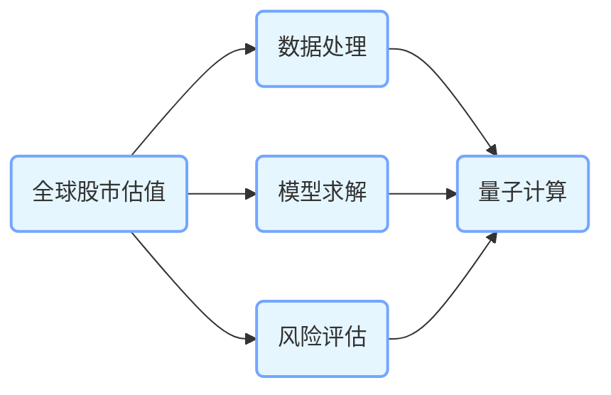

# 全球股市估值与量子计算应用的关系

> 关键词：全球股市估值、量子计算、金融市场、计算效率、投资决策

> 摘要：本文深入探讨了全球股市估值与量子计算应用之间的关系。首先介绍了相关的背景知识，包括研究目的、预期读者、文档结构等。接着阐述了核心概念，如股市估值和量子计算的原理与架构。详细讲解了相关的核心算法原理及操作步骤，并通过数学模型和公式进行了理论支撑。通过项目实战展示了量子计算在股市估值中的具体应用，分析了实际应用场景。同时推荐了学习和开发所需的工具与资源，最后总结了未来的发展趋势与挑战，还对常见问题进行了解答并提供了扩展阅读和参考资料。旨在帮助读者全面了解全球股市估值与量子计算应用的内在联系，以及量子计算在金融领域的巨大潜力和发展方向。

## 1. 背景介绍 
### 1.1 目的和范围
本研究的目的在于深入探究全球股市估值与量子计算应用之间的内在联系和相互影响。随着金融市场的日益复杂和数据量的爆炸式增长，传统的计算方法在处理股市估值相关问题时面临着诸多挑战。量子计算作为一种具有巨大潜力的新兴技术，其独特的计算原理可能为股市估值带来新的突破和变革。

本研究的范围涵盖了全球主要股市的估值方法和模型，以及量子计算在金融领域的各种应用场景。通过对相关理论和实践的研究，分析量子计算如何影响股市估值的准确性、效率和决策过程，为金融从业者、投资者和研究人员提供有价值的参考。

### 1.2 预期读者
本文的预期读者包括金融领域的专业人士，如股票分析师、投资经理、金融研究员等，他们可以从量子计算的角度获取新的分析思路和方法，提升股市估值的准确性和决策的科学性。同时，计算机科学领域的研究人员和开发者也可以从中了解量子计算在金融市场的具体应用需求，为量子计算技术的进一步发展提供方向。此外，对金融和科技交叉领域感兴趣的爱好者也能通过本文了解相关的前沿知识。

### 1.3 文档结构概述
本文将按照以下结构进行阐述：首先介绍背景知识，包括研究目的、预期读者和文档结构等。接着详细讲解全球股市估值和量子计算的核心概念及其联系，通过文本示意图和 Mermaid 流程图进行直观展示。然后阐述核心算法原理和具体操作步骤，结合 Python 源代码进行详细说明。再通过数学模型和公式对相关理论进行深入讲解，并举例说明。之后进行项目实战，展示量子计算在股市估值中的实际应用，包括开发环境搭建、源代码实现和代码解读。分析量子计算在股市估值中的实际应用场景，推荐学习和开发所需的工具与资源。最后总结未来的发展趋势与挑战，解答常见问题并提供扩展阅读和参考资料。

### 1.4 术语表
#### 1.4.1 核心术语定义
- **全球股市估值**：指对全球范围内各个股票市场中上市公司的价值进行评估的过程和方法。它是投资者进行投资决策的重要依据，通过对公司的财务状况、行业前景、市场竞争力等多方面因素的分析，确定股票的合理价格。
- **量子计算**：是一种基于量子力学原理的计算模式，利用量子比特的叠加和纠缠特性，能够在某些问题上实现指数级的计算速度提升，为解决复杂的计算问题提供了新的途径。
- **股市估值模型**：是用于评估股票价值的数学模型，常见的有股息贴现模型、市盈率模型、市净率模型等。这些模型通过对公司的财务数据和市场信息进行分析，预测股票的未来收益和风险，从而确定股票的合理估值。
- **量子比特**：是量子计算中的基本信息单位，与传统计算机中的比特不同，量子比特可以同时处于 0 和 1 的叠加状态，使得量子计算机能够并行处理大量的计算任务。

#### 1.4.2 相关概念解释
- **金融市场效率**：指金融市场中信息传递和价格形成的效率。在有效市场中，股票价格能够及时、准确地反映所有可用的信息，投资者难以通过分析公开信息获得超额收益。量子计算的应用可能提高金融市场的信息处理效率，从而影响市场的有效性。
- **投资组合优化**：是指投资者在众多的投资资产中选择最优的组合，以实现风险和收益的平衡。量子计算可以通过快速求解复杂的优化问题，帮助投资者找到更优的投资组合。
- **风险评估**：是对投资过程中可能面临的各种风险进行评估和分析的过程。量子计算可以更准确地模拟和分析市场风险，为投资者提供更可靠的风险评估结果。

#### 1.4.3 缩略词列表
- **QPU**：Quantum Processing Unit，量子处理单元，是量子计算机的核心组件，用于执行量子计算任务。
- **HPC**：High-Performance Computing，高性能计算，是指利用集群计算机等技术实现的高速计算能力。
- **CAPM**：Capital Asset Pricing Model，资本资产定价模型，是一种用于计算资产预期收益率的模型。

## 2. 核心概念与联系 
### 全球股市估值原理
全球股市估值是一个复杂的过程，涉及到多个因素的综合分析。其基本原理是通过对上市公司的财务状况、行业前景、市场竞争力等方面的评估，确定公司的内在价值，进而确定股票的合理价格。常见的股市估值方法包括股息贴现模型、市盈率模型、市净率模型等。

股息贴现模型（Dividend Discount Model，DDM）认为股票的价值等于其未来股息的现值之和。其基本公式为：

$$V = \sum_{t=1}^{\infty} \frac{D_t}{(1 + r)^t}$$

其中，$V$ 表示股票的价值，$D_t$ 表示第 $t$ 期的股息，$r$ 表示贴现率。

市盈率模型（Price-Earnings Ratio Model，P/E Model）则是通过比较股票的价格与每股收益（Earnings Per Share，EPS）来评估股票的价值。其计算公式为：

$$P = EPS \times P/E$$

其中，$P$ 表示股票的价格，$EPS$ 表示每股收益，$P/E$ 表示市盈率。

市净率模型（Price-Book Ratio Model，P/B Model）是通过比较股票的价格与每股净资产（Book Value Per Share，BVPS）来评估股票的价值。其计算公式为：

$$P = BVPS \times P/B$$

其中，$P$ 表示股票的价格，$BVPS$ 表示每股净资产，$P/B$ 表示市净率。

### 量子计算原理
量子计算是基于量子力学原理的计算模式，其核心概念包括量子比特、叠加和纠缠。

量子比特（Qubit）是量子计算中的基本信息单位，与传统计算机中的比特不同，量子比特可以同时处于 0 和 1 的叠加状态。例如，一个量子比特可以表示为：

$$|\psi\rangle = \alpha|0\rangle + \beta|1\rangle$$

其中，$|\psi\rangle$ 表示量子比特的状态，$\alpha$ 和 $\beta$ 是复数，满足 $|\alpha|^2 + |\beta|^2 = 1$。

叠加原理使得量子计算机能够同时处理多个计算任务，从而实现计算速度的指数级提升。例如，一个由 $n$ 个量子比特组成的量子寄存器可以同时表示 $2^n$ 个状态。

纠缠是量子力学中的一种特殊现象，当两个或多个量子比特处于纠缠状态时，它们之间存在一种非经典的关联，其中一个量子比特的状态变化会瞬间影响其他量子比特的状态。纠缠特性可以用于实现量子通信和量子算法的加速。

### 核心概念的联系
量子计算的高速计算能力可以为全球股市估值带来多方面的影响。首先，在数据处理方面，股市估值需要处理大量的历史数据、实时数据和宏观经济数据等，传统计算机在处理这些数据时可能面临计算资源和时间的限制。量子计算的并行计算能力可以快速处理这些数据，提高数据处理的效率和准确性。

其次，在模型求解方面，股市估值模型往往涉及到复杂的数学计算和优化问题，如多变量的非线性方程求解、投资组合的优化等。量子算法可以利用量子比特的叠加和纠缠特性，更高效地求解这些问题，从而提高股市估值的准确性和效率。

最后，在风险评估方面，量子计算可以更准确地模拟和分析市场风险，通过对大量市场数据的分析和建模，预测市场的变化趋势，为投资者提供更可靠的风险评估结果。

### 文本示意图
```plaintext
全球股市估值 <-- 数据处理 -- 量子计算
            <-- 模型求解 -- 量子计算
            <-- 风险评估 -- 量子计算
```

### Mermaid 流程图


## 3. 核心算法原理 & 具体操作步骤 
### 量子计算在股市估值数据处理中的算法原理
在股市估值中，数据处理是一个重要的环节，需要对大量的历史数据、实时数据和宏观经济数据进行清洗、分析和挖掘。量子计算可以利用量子搜索算法来提高数据处理的效率。

量子搜索算法（如 Grover 算法）是一种用于在无序数据库中搜索特定元素的量子算法。其基本思想是通过量子比特的叠加和纠缠特性，同时对数据库中的所有元素进行搜索，从而实现搜索速度的二次提升。

以下是 Grover 算法的 Python 源代码示例：
```python
import numpy as np
from qiskit import QuantumCircuit, Aer, execute

# 定义数据库的大小
N = 8
# 计算所需的量子比特数
n = int(np.log2(N))

# 定义目标元素的索引
target_index = 3

# 创建量子电路
qc = QuantumCircuit(n)

# 初始化所有量子比特为叠加态
for qubit in range(n):
    qc.h(qubit)

# 定义 Oracle 函数，用于标记目标元素
def oracle(qc, target_index):
    target_binary = format(target_index, 'b').zfill(n)
    for qubit in range(n):
        if target_binary[qubit] == '0':
            qc.x(qubit)
    qc.mct(list(range(n - 1)), n - 1)  # 多控非门
    for qubit in range(n):
        if target_binary[qubit] == '0':
            qc.x(qubit)
    return qc

# 定义扩散算子
def diffusion(qc):
    for qubit in range(n):
        qc.h(qubit)
        qc.x(qubit)
    qc.mct(list(range(n - 1)), n - 1)  # 多控非门
    for qubit in range(n):
        qc.x(qubit)
        qc.h(qubit)
    return qc

# 执行 Grover 算法的迭代步骤
iterations = int(np.floor(np.pi / 4 * np.sqrt(N)))
for _ in range(iterations):
    qc = oracle(qc, target_index)
    qc = diffusion(qc)

# 添加测量操作
qc.measure_all()

# 模拟量子电路
backend = Aer.get_backend('qasm_simulator')
job = execute(qc, backend, shots=1024)
result = job.result()
counts = result.get_counts(qc)

# 输出结果
print("测量结果：", counts)
```
### 具体操作步骤
1. **数据准备**：收集全球股市的相关数据，包括历史股价、财务报表、宏观经济数据等，并进行数据清洗和预处理，将数据转换为适合量子计算的格式。
2. **量子电路设计**：根据具体的问题和算法要求，设计量子电路。例如，在使用 Grover 算法进行数据搜索时，需要设计 Oracle 函数和扩散算子。
3. **量子计算执行**：将设计好的量子电路加载到量子计算机或量子模拟器上进行执行。在执行过程中，量子计算机利用量子比特的叠加和纠缠特性进行并行计算。
4. **结果测量和分析**：对量子计算的结果进行测量，得到经典的测量结果。然后对测量结果进行分析和处理，提取有用的信息，如搜索到的目标元素、数据的统计特征等。

### 量子计算在股市估值模型求解中的算法原理
在股市估值模型求解中，往往涉及到复杂的优化问题，如投资组合的优化。量子计算可以利用量子退火算法来求解这些优化问题。

量子退火算法是一种基于量子力学原理的优化算法，其基本思想是通过量子比特的量子隧穿效应，在搜索空间中寻找最优解。量子退火算法可以在多项式时间内求解一些 NP 难问题，具有较高的计算效率。

以下是一个简单的量子退火算法求解投资组合优化问题的 Python 源代码示例：
```python
from dwave.system import DWaveSampler, EmbeddingComposite
import dimod

# 定义投资组合优化问题的参数
num_assets = 3
covariance_matrix = np.array([[1.0, 0.2, 0.3],
                              [0.2, 1.0, 0.4],
                              [0.3, 0.4, 1.0]])
expected_returns = np.array([0.1, 0.2, 0.3])
risk_aversion = 0.5

# 构建二次无约束二进制优化 (QUBO) 模型
Q = {}
for i in range(num_assets):
    for j in range(num_assets):
        if i == j:
            Q[(i, j)] = -expected_returns[i] + risk_aversion * covariance_matrix[i, j]
        else:
            Q[(i, j)] = risk_aversion * covariance_matrix[i, j]

# 定义问题类型
bqm = dimod.BinaryQuadraticModel.from_qubo(Q)

# 选择量子退火器
sampler = EmbeddingComposite(DWaveSampler())

# 求解问题
sampleset = sampler.sample(bqm, num_reads=1000)

# 输出最优解
best_sample = sampleset.first.sample
print("最优投资组合：", best_sample)
```
### 具体操作步骤
1. **问题建模**：将股市估值模型中的优化问题转换为适合量子退火算法求解的形式，如二次无约束二进制优化 (QUBO) 模型。
2. **量子退火器选择**：选择合适的量子退火器，如 D-Wave 量子退火器。
3. **问题求解**：将 QUBO 模型加载到量子退火器上进行求解，量子退火器通过量子隧穿效应在搜索空间中寻找最优解。
4. **结果分析**：对量子退火器的求解结果进行分析，得到最优的投资组合或其他优化结果。

## 4. 数学模型和公式 & 详细讲解 & 举例说明 
### 股市估值模型的数学公式
#### 股息贴现模型（DDM）
股息贴现模型认为股票的价值等于其未来股息的现值之和。其基本公式为：

$$V = \sum_{t=1}^{\infty} \frac{D_t}{(1 + r)^t}$$

其中，$V$ 表示股票的价值，$D_t$ 表示第 $t$ 期的股息，$r$ 表示贴现率。

详细讲解：股息贴现模型的核心思想是将股票的价值看作是其未来股息的现金流的现值。贴现率 $r$ 反映了投资者对股票投资的预期收益率，通常由无风险利率和风险溢价组成。

举例说明：假设某股票预计未来每年的股息为 2 元，投资者要求的贴现率为 10%。则该股票的价值为：

$$V = \frac{2}{0.1} = 20 \text{ 元}$$

#### 市盈率模型（P/E Model）
市盈率模型通过比较股票的价格与每股收益（EPS）来评估股票的价值。其计算公式为：

$$P = EPS \times P/E$$

其中，$P$ 表示股票的价格，$EPS$ 表示每股收益，$P/E$ 表示市盈率。

详细讲解：市盈率是衡量股票相对估值的一个重要指标，反映了市场对公司未来盈利的预期。不同行业和公司的市盈率可能存在较大差异。

举例说明：假设某公司的每股收益为 5 元，行业平均市盈率为 20 倍。则该公司股票的合理价格为：

$$P = 5 \times 20 = 100 \text{ 元}$$

#### 市净率模型（P/B Model）
市净率模型通过比较股票的价格与每股净资产（BVPS）来评估股票的价值。其计算公式为：

$$P = BVPS \times P/B$$

其中，$P$ 表示股票的价格，$BVPS$ 表示每股净资产，$P/B$ 表示市净率。

详细讲解：市净率反映了股票价格相对于每股净资产的倍数，通常用于评估公司的资产价值。较低的市净率可能表示股票被低估。

举例说明：假设某公司的每股净资产为 10 元，市净率为 1.5 倍。则该公司股票的合理价格为：

$$P = 10 \times 1.5 = 15 \text{ 元}$$

### 量子计算算法的数学原理
#### Grover 算法
Grover 算法的核心是通过量子比特的叠加和纠缠特性，在无序数据库中搜索特定元素。其数学原理基于量子态的演化和测量。

假设数据库中有 $N = 2^n$ 个元素，用 $n$ 个量子比特表示。初始