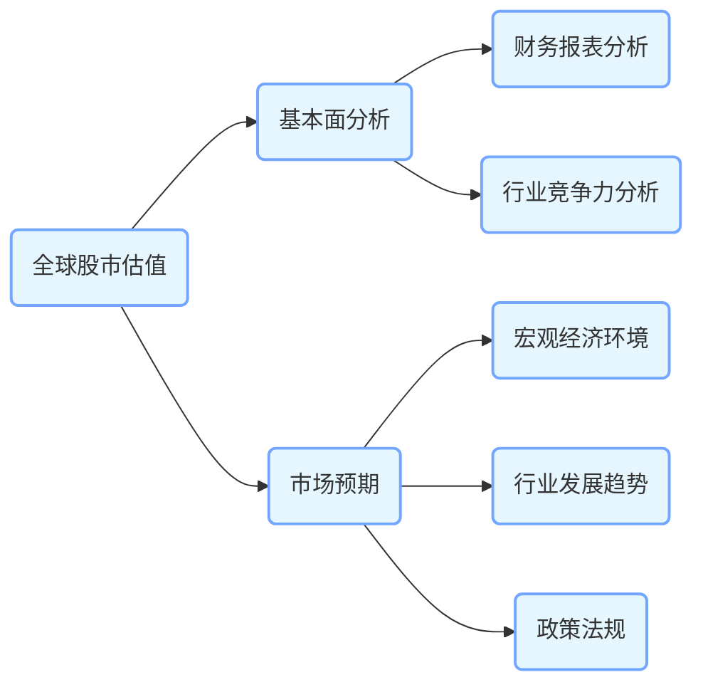
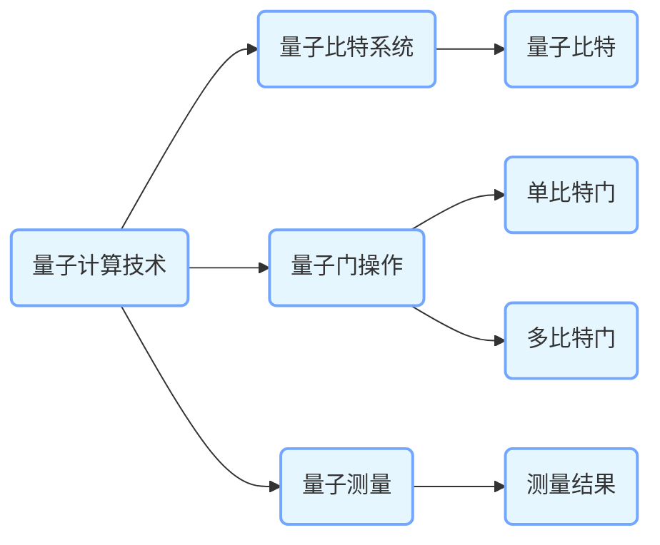

# 全球股市估值与量子计算技术的潜在关联

> 关键词：全球股市估值、量子计算技术、关联分析、金融市场、技术变革

> 摘要：本文旨在深入探讨全球股市估值与量子计算技术之间的潜在关联。通过对相关核心概念的阐述、算法原理的分析、数学模型的构建以及实际案例的研究，揭示量子计算技术如何影响全球股市估值。同时，介绍了在该领域的实际应用场景、推荐了相关的工具和资源，并对未来发展趋势与挑战进行了总结。这对于投资者、金融分析师以及科技研究者理解金融市场与新兴技术之间的相互作用具有重要意义。

## 1. 背景介绍 
### 1.1 目的和范围
本研究的目的是全面剖析全球股市估值与量子计算技术之间可能存在的潜在关联。随着科技的飞速发展，量子计算技术作为一项具有革命性的技术，正逐渐对各个领域产生深远影响。金融市场作为经济的核心领域之一，必然也会受到量子计算技术发展的冲击。我们的研究范围将涵盖全球主要股票市场，分析量子计算技术在不同层面上对股市估值的影响机制，包括企业的盈利能力、市场的风险偏好以及宏观经济环境等方面。

### 1.2 预期读者
本文的预期读者主要包括金融领域的专业人士，如股票分析师、投资经理、金融研究员等，他们可以从本文中获取关于新兴技术对股市估值影响的深入见解，为投资决策提供参考。同时，科技领域的研究者和从业者也能了解到量子计算技术在金融市场的潜在应用和影响，促进跨领域的合作与创新。此外，对金融市场和新兴技术感兴趣的普通读者也可以通过本文初步了解两者之间的关联。

### 1.3 文档结构概述
本文将按照以下结构展开：首先介绍相关的核心概念，包括全球股市估值和量子计算技术的定义、原理和架构；接着详细阐述核心算法原理和具体操作步骤，通过 Python 代码进行说明；然后构建数学模型和公式，并结合实际例子进行讲解；之后通过项目实战展示代码的实际应用和详细解释；再分析实际应用场景，探讨量子计算技术在全球股市估值中的具体应用；推荐相关的工具和资源，包括学习资源、开发工具框架和相关论文著作；最后总结未来发展趋势与挑战，并提供常见问题与解答以及扩展阅读和参考资料。

### 1.4 术语表
#### 1.4.1 核心术语定义
- **全球股市估值**：是指对全球范围内各个股票市场上的上市公司股票价值进行评估的过程和结果。它综合考虑了公司的财务状况、盈利能力、市场竞争力、行业前景等多种因素，常用的估值方法包括市盈率（P/E）、市净率（P/B）、现金流折现法（DCF）等。
- **量子计算技术**：是一种基于量子力学原理的计算技术，它利用量子比特（qubit）的特性，如叠加态和纠缠态，实现并行计算，从而在某些特定问题上具有比经典计算机指数级的计算优势。

#### 1.4.2 相关概念解释
- **市盈率（P/E）**：是指股票价格除以每股收益（EPS）的比率，反映了投资者为获取公司每一元盈利所愿意支付的价格。较高的市盈率通常表示市场对公司未来盈利增长的预期较高。
- **市净率（P/B）**：是指股票价格除以每股净资产的比率，用于衡量股票价格相对于公司净资产的倍数。市净率较低的股票可能被认为具有一定的投资价值。
- **现金流折现法（DCF）**：是一种通过预测公司未来的自由现金流，并将其折现到当前价值的估值方法。该方法考虑了货币的时间价值，能够更准确地评估公司的内在价值。
- **量子比特（qubit）**：是量子计算中的基本信息单位，与经典比特（只能表示 0 或 1）不同，量子比特可以同时处于 0 和 1 的叠加态，这使得量子计算机能够同时处理多个计算任务。

#### 1.4.3 缩略词列表
- **P/E**：Price-to-Earnings Ratio，市盈率
- **P/B**：Price-to-Book Ratio，市净率
- **DCF**：Discounted Cash Flow，现金流折现法
- **qubit**：Quantum Bit，量子比特

## 2. 核心概念与联系 

### 2.1 全球股市估值的原理和架构
全球股市估值是一个复杂的系统工程，其原理基于对上市公司基本面的分析和市场预期的综合考量。从基本面来看，公司的财务报表是估值的重要依据，包括资产负债表、利润表和现金流量表等。通过分析这些报表中的各项指标，如营业收入、净利润、资产负债率等，可以评估公司的盈利能力、偿债能力和运营效率。

市场预期则受到多种因素的影响，如宏观经济环境、行业发展趋势、政策法规等。例如，在经济增长强劲的时期，市场对上市公司的盈利预期通常较高，从而推动股市估值上升；而在经济衰退时期，市场预期则较为悲观，股市估值可能会下降。

全球股市估值的架构可以用以下示意图表示：



### 2.2 量子计算技术的原理和架构
量子计算技术基于量子力学的基本原理，主要利用量子比特的叠加态和纠缠态来实现并行计算。量子比特可以同时处于多个状态的叠加，这使得量子计算机能够在一次计算中处理多个数据，从而大大提高计算效率。

量子计算的架构主要包括量子比特系统、量子门操作和量子测量三个部分。量子比特系统是量子计算的核心，用于存储和处理量子信息；量子门操作则是对量子比特进行各种逻辑运算的基本单元；量子测量则是将量子态转换为经典信息的过程。

量子计算技术的原理和架构可以用以下示意图表示：



### 2.3 全球股市估值与量子计算技术的潜在联系
量子计算技术的发展可能会从多个方面影响全球股市估值。首先，量子计算的强大计算能力可以提高金融分析的效率和准确性。例如，在使用现金流折现法进行股票估值时，需要对公司未来的现金流进行大量的预测和计算，量子计算机可以在更短的时间内完成这些复杂的计算，从而为投资者提供更及时、准确的估值结果。

其次，量子计算技术可能会引发金融市场的创新，推出新的金融产品和服务。这些创新可能会改变市场的竞争格局，影响上市公司的盈利能力和市场价值，进而对股市估值产生影响。

此外，量子计算技术的安全性也可能会对金融市场产生影响。量子加密技术可以提供更高级别的信息安全保障，减少金融交易中的风险。如果上市公司能够率先采用量子加密技术，可能会提高其市场竞争力和投资者的信心，从而提升其股票估值。

## 3. 核心算法原理 & 具体操作步骤 

### 3.1 量子计算在股市估值中的应用算法原理
在股市估值中，量子计算可以应用于优化问题和机器学习算法。例如，在投资组合优化问题中，经典计算机需要对大量的投资组合进行计算和比较，以找到最优的投资组合。而量子计算机可以利用量子退火算法等方法，在更短的时间内找到接近最优的投资组合。

以下是一个简单的量子退火算法的 Python 示例，使用 D-Wave 的 Ocean SDK：

```python
import dimod
from dwave.system.samplers import DWaveSampler
from dwave.system.composites import EmbeddingComposite

# 定义一个简单的二次无约束二进制优化（QUBO）问题
Q = {('a', 'b'): 1, ('a', 'c'): -1, ('b', 'c'): 2}

# 创建一个采样器
sampler = EmbeddingComposite(DWaveSampler())

# 进行采样
response = sampler.sample_qubo(Q, num_reads=100)

# 输出结果
for sample, energy in response.data(['sample', 'energy']):
    print(sample, energy)
```

### 3.2 具体操作步骤
#### 3.2.1 问题建模
首先，需要将股市估值中的具体问题转化为量子计算可以处理的形式。例如，将投资组合优化问题转化为二次无约束二进制优化（QUBO）问题。在 QUBO 问题中，每个变量都是二进制的（0 或 1），目标是最小化一个二次函数。

#### 3.2.2 选择量子计算平台
根据问题的规模和复杂度，选择合适的量子计算平台。目前，市场上有一些商业化的量子计算平台，如 D-Wave、IBM Quantum 等。

#### 3.2.3 编写量子算法代码
使用所选量子计算平台提供的 SDK，编写量子算法代码。例如，在使用 D-Wave 平台时，可以使用 Ocean SDK 编写量子退火算法的代码。

#### 3.2.4 运行算法并分析结果
将编写好的代码上传到量子计算平台上运行，并分析得到的结果。根据结果进行决策，如调整投资组合等。

## 4. 数学模型和公式 & 详细讲解 & 举例说明 

### 4.1 全球股市估值的数学模型
#### 4.1.1 市盈率模型
市盈率模型是一种简单而常用的股市估值模型，其公式为：

$$P = EPS \times P/E$$

其中，$P$ 表示股票价格，$EPS$ 表示每股收益，$P/E$ 表示市盈率。

例如，某公司的每股收益为 2 元，市场上该行业的平均市盈率为 20 倍，则该公司的股票价格可以估计为：

$$P = 2 \times 20 = 40$$（元）

#### 4.1.2 现金流折现模型
现金流折现模型是一种更为复杂和精确的股市估值模型，其基本公式为：

$$V = \sum_{t=1}^{n} \frac{FCF_t}{(1 + r)^t} + \frac{TV}{(1 + r)^n}$$

其中，$V$ 表示公司的内在价值，$FCF_t$ 表示第 $t$ 期的自由现金流，$r$ 表示折现率，$n$ 表示预测期数，$TV$ 表示终值。

例如，假设某公司未来 3 年的自由现金流分别为 100 万元、120 万元和 150 万元，折现率为 10%，3 年后的终值为 1000 万元，则该公司的内在价值为：

$$V = \frac{100}{(1 + 0.1)^1} + \frac{120}{(1 + 0.1)^2} + \frac{150}{(1 + 0.1)^3} + \frac{1000}{(1 + 0.1)^3}$$

$$V = \frac{100}{1.1} + \frac{120}{1.21} + \frac{150}{1.331} + \frac{1000}{1.331}$$

$$V \approx 90.91 + 99.17 + 112.69 + 751.31 = 1054.08$$（万元）

### 4.2 量子计算对股市估值模型的影响
量子计算的强大计算能力可以提高股市估值模型的计算效率和准确性。例如，在现金流折现模型中，需要对大量的未来现金流进行预测和折现计算，这对于经典计算机来说是一个非常耗时的任务。而量子计算机可以利用并行计算的优势，在更短的时间内完成这些计算。

假设在经典计算机上计算上述现金流折现模型需要 $T_c$ 时间，而在量子计算机上计算需要 $T_q$ 时间，由于量子计算的并行性，$T_q$ 可能会远远小于 $T_c$。具体的时间复杂度关系可以表示为：

$$T_q = O(f(n))$$

$$T_c = O(g(n))$$

其中，$f(n)$ 和 $g(n)$ 分别是量子计算和经典计算的时间复杂度函数，$n$ 是问题的规模。在某些情况下，$f(n)$ 可能是多项式时间复杂度，而 $g(n)$ 可能是指数时间复杂度。

## 5. 项目实战：代码实际案例和详细解释说明 

### 5.1  开发环境搭建
#### 5.1.1 安装 Python
首先，需要安装 Python 编程语言。可以从 Python 官方网站（https://www.python.org/downloads/）下载适合自己操作系统的 Python 安装包，并按照安装向导进行安装。

#### 5.1.2 安装量子计算 SDK
如果使用 D-Wave 平台，需要安装 D-Wave 的 Ocean SDK。可以使用以下命令进行安装：

```bash
pip install dwave-ocean-sdk
```

如果使用 IBM Quantum 平台，需要安装 Qiskit。可以使用以下命令进行安装：

```bash
pip install qiskit
```

#### 5.1.3 配置开发环境
安装完成后，需要配置开发环境。对于 D-Wave 平台，需要注册一个 D-Wave 账号，并获取 API 令牌，然后在代码中进行配置。对于 IBM Quantum 平台，需要在 IBM Quantum 网站上注册账号，并获取 API 密钥，然后在代码中进行配置。

### 5.2  源代码详细实现和代码解读
以下是一个使用 Qiskit 实现简单量子算法并应用于股市估值问题的示例代码：

```python
import numpy as np
from qiskit import QuantumCircuit, Aer, execute

# 定义一个简单的量子电路
qc = QuantumCircuit(2, 2)

# 应用量子门操作
qc.h(0)
qc.cx(0, 1)

# 进行测量
qc.measure([0, 1], [0, 1])

# 选择模拟器
backend = Aer.get_backend('qasm_simulator')

# 运行量子电路
job = execute(qc, backend, shots=1000)
result = job.result()

# 获取测量结果
counts = result.get_counts(qc)

# 输出结果
print(counts)
```

代码解读：
1. **导入必要的库**：导入 `numpy` 用于数值计算，`QuantumCircuit` 用于创建量子电路，`Aer` 用于选择模拟器，`execute` 用于运行量子电路。
2. **创建量子电路**：创建一个包含 2 个量子比特和 2 个经典比特的量子电路。
3. **应用量子门操作**：对第一个量子比特应用 Hadamard 门（`h`），使其处于叠加态；然后应用 CNOT 门（`cx`），实现两个量子比特之间的纠缠。
4. **进行测量**：将量子比特的状态测量到经典比特上。
5. **选择模拟器**：选择 `qasm_simulator` 作为模拟器。
6. **运行量子电路**：使用 `execute` 函数运行量子电路，并设置测量次数为 1000 次。
7. **获取测量结果**：使用 `result.get_counts(qc)` 函数获取测量结果。
8. **输出结果**：打印测量结果。

### 5.3  代码解读与分析
上述代码实现了一个简单的量子电路，通过应用 Hadamard 门和 CNOT 门，创建了一个纠缠态。测量结果反映了量子比特的状态分布。在股市估值问题中，可以将这个量子电路作为一个基本模块，用于解决一些复杂的优化问题或机器学习任务。

例如，可以将量子电路的测量结果作为输入，训练一个机器学习模型，用于预测股票价格。通过不断调整量子电路的参数和机器学习模型的超参数，可以提高预测的准确性。

## 6. 实际应用场景 
### 6.1 投资组合优化
量子计算可以帮助投资者在众多的投资标的中找到最优的投资组合。传统的投资组合优化方法需要对大量的投资组合进行计算和比较，计算复杂度较高。而量子计算可以利用量子退火算法等方法，在更短的时间内找到接近最优的投资组合，从而提高投资效率和收益。

### 6.2 风险评估
在金融市场中，准确评估风险是非常重要的。量子计算可以处理大量的历史数据和复杂的风险模型，从而更准确地评估投资组合的风险。例如，通过量子计算可以快速计算投资组合的 VaR（Value at Risk）值，帮助投资者制定合理的风险控制策略。

### 6.3 股票价格预测
量子计算可以结合机器学习算法，对股票价格进行更准确的预测。量子计算机的强大计算能力可以处理更多的特征和更复杂的模型，从而提高预测的准确性。例如，可以使用量子神经网络对股票价格进行预测，考虑更多的市场因素和公司基本面信息。

### 6.4 金融衍生品定价
金融衍生品的定价通常涉及到复杂的数学模型和大量的计算。量子计算可以在更短的时间内完成这些计算，从而提高金融衍生品定价的效率和准确性。例如，对于期权定价，可以使用量子算法来解决布莱克 - 斯科尔斯模型等复杂的定价模型。

## 7. 工具和资源推荐
### 7.1 学习资源推荐
#### 7.1.1 书籍推荐
- 《量子计算与量子信息》（Quantum Computation and Quantum Information）：由 Michael A. Nielsen 和 Isaac L. Chuang 所著，是量子计算领域的经典教材，全面介绍了量子计算的基本原理、算法和应用。
- 《金融数学》（Mathematics of Finance）：介绍了金融市场中的各种数学模型和方法，包括股票估值、投资组合优化、风险评估等，对于理解金融市场和股市估值有很大帮助。
- 《Python 数据分析实战》（Python for Data Analysis）：由 Wes McKinney 所著，详细介绍了使用 Python 进行数据分析的方法和技巧，对于处理金融数据和实现股市估值模型非常有用。

#### 7.1.2 在线课程
- Coursera 上的“量子计算基础”（Foundations of Quantum Computing）课程：由马里兰大学提供，介绍了量子计算的基本概念、原理和算法。
- edX 上的“金融工程与风险管理”（Financial Engineering and Risk Management）课程：由哥伦比亚大学提供，涵盖了金融工程的各个方面，包括股票估值、投资组合优化、衍生品定价等。
- Udemy 上的“Python 金融数据分析”（Python for Financial Data Analysis）课程：介绍了使用 Python 进行金融数据分析的方法和技巧，包括数据获取、清洗、分析和可视化等。

#### 7.1.3 技术博客和网站
- Quantum Computing Report：提供量子计算领域的最新消息、技术进展和市场动态。
- Seeking Alpha：是一个金融市场分析和投资建议的网站，提供了大量的股票分析和估值报告。
- Towards Data Science：是一个数据科学和机器学习领域的博客平台，有很多关于金融数据分析和股市估值的文章。

### 7.2 开发工具框架推荐
#### 7.2.1 IDE和编辑器
- PyCharm：是一款专业的 Python 集成开发环境，提供了丰富的代码编辑、调试和分析功能，适合开发量子计算和金融数据分析的 Python 代码。
- Jupyter Notebook：是一个交互式的开发环境，支持 Python、R 等多种编程语言，适合进行数据探索、模型实验和结果展示。
- Visual Studio Code：是一款轻量级的代码编辑器，支持多种编程语言和插件，具有丰富的扩展功能，适合快速开发和调试代码。

#### 7.2.2 调试和性能分析工具
- Qiskit Debugger：是 Qiskit 提供的调试工具，可以帮助开发者调试量子电路和算法。
- D-Wave Inspector：是 D-Wave 提供的调试和分析工具，可以帮助开发者分析量子退火算法的运行结果和性能。
- Python 的 `cProfile` 模块：可以用于分析 Python 代码的性能，找出代码中的瓶颈和优化点。

#### 7.2.3 相关框架和库
- Qiskit：是 IBM 开发的开源量子计算框架，提供了丰富的量子算法和工具，支持多种量子计算平台。
- Ocean SDK：是 D-Wave 开发的量子计算软件开发工具包，提供了量子退火算法和相关工具，支持 D-Wave 的量子计算平台。
- NumPy、Pandas 和 Matplotlib：是 Python 中常用的数据分析和可视化库，对于处理金融数据和展示分析结果非常有用。

### 7.3 相关论文著作推荐
#### 7.3.1 经典论文
- Shor, P. W. (1994). Algorithms for quantum computation: discrete logarithms and factoring. Proceedings of the 35th Annual Symposium on Foundations of Computer Science, 124-134. 该论文提出了 Shor 算法，是量子计算领域的经典论文之一，展示了量子计算机在因式分解问题上的指数级加速优势。
- Grover, L. K. (1996). A fast quantum mechanical algorithm for database search. Proceedings of the Twenty-Eighth Annual ACM Symposium on Theory of Computing, 212-219. 该论文提出了 Grover 算法，是量子计算领域的另一个经典算法，用于解决数据库搜索问题。
- Black, F., & Scholes, M. (1973). The pricing of options and corporate liabilities. Journal of Political Economy, 81(3), 637-654. 该论文提出了布莱克 - 斯科尔斯期权定价模型，是金融衍生品定价领域的经典论文，对金融市场的发展产生了深远影响。

#### 7.3.2 最新研究成果
- Quantum Computing for Finance: State of the Art and Future Prospects. 该研究报告总结了量子计算在金融领域的最新应用和研究进展，探讨了量子计算对金融市场的潜在影响和挑战。
- Applying Quantum Computing to Portfolio Optimization. 该论文研究了如何使用量子计算技术解决投资组合优化问题，提出了一种基于量子退火算法的投资组合优化方法。
- Quantum Machine Learning for Stock Price Prediction. 该论文探讨了如何使用量子机器学习算法对股票价格进行预测，展示了量子计算在金融预测领域的潜力。

#### 7.3.3 应用案例分析
- Case Studies in Quantum Computing for Financial Services. 该报告通过实际案例分析，介绍了量子计算在金融服务领域的应用，包括投资组合优化、风险评估、衍生品定价等方面。
- Quantum Computing in the Financial Industry: Real-World Applications and Challenges. 该论文分析了量子计算在金融行业的实际应用案例，探讨了在实际应用中面临的挑战和解决方案。

## 8. 总结：未来发展趋势与挑战
### 8.1 未来发展趋势
#### 8.1.1 量子计算技术的不断发展
随着科技的不断进步，量子计算技术将不断发展和完善。量子比特的数量将不断增加，量子计算的稳定性和可靠性将不断提高，从而使得量子计算在金融市场中的应用更加广泛和深入。

#### 8.1.2 金融市场与量子计算的深度融合
金融市场将越来越依赖于量子计算技术，量子计算将成为金融分析、投资决策和风险管理的重要工具。同时，金融市场的需求也将推动量子计算技术的发展，促进量子计算算法和应用的创新。

#### 8.1.3 跨领域合作的加强
量子计算技术与金融市场的结合需要跨领域的专业知识和技能。未来，不同领域的专家和学者将加强合作，共同推动量子计算在金融市场中的应用和发展。

### 8.2 挑战
#### 8.2.1 技术挑战
目前，量子计算技术还处于发展阶段，存在一些技术难题需要解决。例如，量子比特的稳定性和抗干扰能力较差，量子计算的误差率较高，这些问题限制了量子计算在金融市场中的实际应用。

#### 8.2.2 人才短缺
量子计算和金融市场都是专业性很强的领域，需要具备跨领域知识和技能的人才。目前，这类人才非常短缺，制约了量子计算在金融市场中的应用和发展。

#### 8.2.3 安全和监管问题
量子计算的强大计算能力可能会对金融市场的安全和稳定产生影响。例如，量子计算可以破解现有的加密算法，导致金融信息泄露和交易风险增加。因此，需要加强量子计算的安全研究和监管，确保金融市场的安全和稳定。

## 9. 附录：常见问题与解答
### 9.1 量子计算技术何时能够在金融市场中得到广泛应用？
目前，量子计算技术还处于发展阶段，虽然已经在一些特定问题上展示了其优势，但要在金融市场中得到广泛应用还需要一定的时间。预计在未来 5 - 10 年内，随着量子计算技术的不断发展和成熟，量子计算将在金融市场中得到越来越多的应用。

### 9.2 量子计算对传统金融分析方法有何影响？
量子计算可以提高传统金融分析方法的效率和准确性。例如，在投资组合优化和风险评估等问题上，量子计算可以在更短的时间内处理更多的数据和更复杂的模型，从而为投资者提供更准确的决策依据。同时，量子计算也可能会引发金融分析方法的创新，推动金融市场的发展。

### 9.3 如何学习量子计算和金融市场的相关知识？
可以通过阅读相关的书籍和论文、参加在线课程、加入技术社区等方式学习量子计算和金融市场的相关知识。同时，也可以通过实践项目来提高自己的技能和能力。例如，可以使用开源的量子计算框架和金融数据分析库进行实验和开发。

### 9.4 量子计算技术会对金融行业的就业市场产生什么影响？
量子计算技术的发展可能会对金融行业的就业市场产生一定的影响。一方面，量子计算技术的应用需要具备跨领域知识和技能的人才，如量子计算专家、金融分析师等，这将创造一些新的就业机会。另一方面，一些传统的金融分析和决策工作可能会被量子计算技术所取代，导致部分就业岗位的减少。因此，金融行业的从业者需要不断学习和提升自己的技能，以适应技术变革的需求。

## 10. 扩展阅读 & 参考资料
### 10.1 扩展阅读
- 《量子计算：从基础到应用》
- 《金融市场与金融机构》
- 《机器学习在金融领域的应用》

### 10.2 参考资料
- Nielsen, M. A., & Chuang, I. L. (2000). Quantum Computation and Quantum Information. Cambridge University Press.
- Hull, J. C. (2017). Options, Futures, and Other Derivatives. Pearson.
- McKinney, W. (2012). Python for Data Analysis. O'Reilly Media.

作者：AI天才研究院/AI Genius Institute & 禅与计算机程序设计艺术 /Zen And The Art of Computer Programming