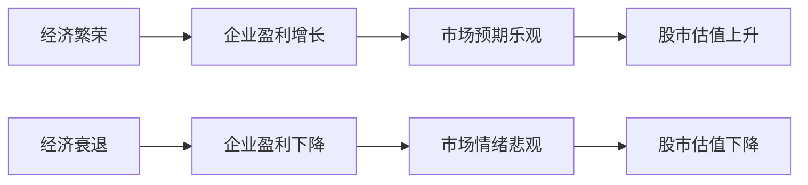

# 全球股市估值周期性特征探讨

> 关键词：全球股市、估值周期性、股市分析、经济周期、投资策略

> 摘要：本文旨在深入探讨全球股市估值的周期性特征。通过对股市估值核心概念的阐述、相关算法原理的分析、数学模型的构建以及实际案例的研究，全面剖析股市估值周期性的形成机制和表现形式。同时，探讨其在实际投资中的应用场景，推荐相关的学习资源、开发工具和研究论文，最后对全球股市估值周期性的未来发展趋势与挑战进行总结，并提供常见问题解答和扩展阅读参考资料，为投资者和研究者提供全面而深入的理论和实践指导。

## 1. 背景介绍 
### 1.1 目的和范围
本研究的主要目的是系统地探讨全球股市估值的周期性特征。范围涵盖了全球主要股票市场，包括美国、欧洲、亚洲等地区的重要证券交易所。通过对不同市场在不同时间跨度内的估值数据进行分析，揭示股市估值周期性的普遍规律和地域差异。

### 1.2 预期读者
本文预期读者包括金融投资者、证券分析师、金融研究人员以及对全球股市感兴趣的爱好者。对于投资者来说，了解股市估值周期性特征有助于制定更合理的投资策略；对于分析师和研究人员而言，可为进一步的学术研究和市场分析提供参考。

### 1.3 文档结构概述
本文将按照以下结构展开：首先介绍核心概念与联系，包括股市估值的定义、相关指标以及与经济周期的关系；接着阐述核心算法原理和具体操作步骤，通过 Python 代码实现对估值数据的分析；然后构建数学模型并进行详细讲解和举例说明；之后通过项目实战展示代码的实际应用和分析；探讨实际应用场景；推荐相关的工具和资源；最后总结未来发展趋势与挑战，提供常见问题解答和扩展阅读参考资料。

### 1.4 术语表
#### 1.4.1 核心术语定义
- **股市估值**：指对股票市场整体或个别股票的价值进行评估的过程和结果。常见的估值指标包括市盈率（P/E）、市净率（P/B）等。
- **周期性特征**：指股市估值随时间呈现出的规律性波动，通常与经济周期、市场情绪等因素相关。
- **经济周期**：经济活动沿着经济发展的总体趋势所经历的有规律的扩张和收缩，一般分为繁荣、衰退、萧条和复苏四个阶段。

#### 1.4.2 相关概念解释
- **市盈率（P/E）**：是指股票价格除以每股收益（EPS）的比率，反映了投资者为获取公司每一元盈利所愿意支付的价格。
- **市净率（P/B）**：是指股票价格与每股净资产的比率，用于评估股票相对于其净资产的估值水平。

#### 1.4.3 缩略词列表
- **P/E**：Price-to-Earnings Ratio，市盈率
- **P/B**：Price-to-Book Ratio，市净率

## 2. 核心概念与联系 

### 股市估值的核心概念
股市估值是金融领域中一个重要的概念，它是衡量股票市场投资价值的重要依据。通过对股市估值的分析，投资者可以判断当前市场是否被高估或低估，从而做出合理的投资决策。

常见的股市估值指标包括市盈率（P/E）、市净率（P/B）、股息率等。市盈率是最常用的估值指标之一，它反映了市场对公司未来盈利的预期。市净率则侧重于评估公司的净资产价值，适用于一些资产密集型行业。股息率则反映了公司分红对投资者的回报水平。

### 股市估值与经济周期的联系
股市估值的周期性特征与经济周期密切相关。在经济繁荣阶段，企业盈利增长强劲，市场对未来预期乐观，股市估值往往会上升；而在经济衰退阶段，企业盈利下降，市场情绪悲观，股市估值则会下降。

可以用以下的 Mermaid 流程图来表示这种关系：


### 全球股市估值的地域差异
不同地区的股市估值周期性特征可能存在差异。这主要是由于不同地区的经济发展水平、政策环境、行业结构等因素的影响。例如，发达国家的股市可能更加成熟，估值波动相对较小；而新兴市场的股市则可能受到宏观经济政策和外部资金流动的影响较大，估值波动更为剧烈。

## 3. 核心算法原理 & 具体操作步骤 

### 数据获取
要分析全球股市估值的周期性特征，首先需要获取相关的股市估值数据。可以使用 Python 的第三方库 `pandas-datareader` 从雅虎财经等数据源获取股市数据。以下是获取美国标普 500 指数市盈率数据的示例代码：
```python
import pandas as pd
import pandas_datareader.data as web
import datetime

# 设置数据获取的时间范围
start = datetime.datetime(2000, 1, 1)
end = datetime.datetime(2023, 12, 31)

# 获取标普 500 指数的市盈率数据
sp500_pe = web.DataReader('^GSPC', 'yahoo-actions', start, end)
```

### 数据预处理
获取到的数据可能存在缺失值、异常值等问题，需要进行预处理。可以使用 `pandas` 库进行数据清洗和处理。以下是处理缺失值的示例代码：
```python
# 检查数据中的缺失值
missing_values = sp500_pe.isnull().sum()

# 处理缺失值，这里采用向前填充的方法
sp500_pe = sp500_pe.fillna(method='ffill')
```

### 周期性分析算法
可以使用时间序列分析方法来分析股市估值的周期性特征。常用的方法包括自相关函数（ACF）和偏自相关函数（PACF）。以下是计算自相关函数的示例代码：
```python
from statsmodels.graphics.tsaplots import plot_acf
import matplotlib.pyplot as plt

# 计算自相关函数
plot_acf(sp500_pe['Close'])
plt.show()
```

### 具体操作步骤总结
1. 确定数据获取的时间范围和数据源。
2. 使用相应的库获取股市估值数据。
3. 对获取的数据进行预处理，包括处理缺失值、异常值等。
4. 选择合适的周期性分析算法，如自相关函数、偏自相关函数等。
5. 对分析结果进行可视化展示，以便更好地理解股市估值的周期性特征。

## 4. 数学模型和公式 & 详细讲解 & 举例说明 

### 自相关函数（ACF）
自相关函数用于衡量时间序列在不同滞后阶数下的相关性。其数学公式为：
$$
\rho_k = \frac{\gamma_k}{\gamma_0}
$$
其中，$\rho_k$ 表示滞后 $k$ 阶的自相关系数，$\gamma_k$ 表示滞后 $k$ 阶的自协方差，$\gamma_0$ 表示零阶自协方差。

自协方差的计算公式为：
$$
\gamma_k = \frac{1}{n} \sum_{t=k+1}^{n} (x_t - \bar{x})(x_{t-k} - \bar{x})
$$
其中，$x_t$ 表示时间序列在 $t$ 时刻的值，$\bar{x}$ 表示时间序列的均值，$n$ 表示时间序列的长度。

### 偏自相关函数（PACF）
偏自相关函数用于衡量在控制了中间滞后阶数的影响后，时间序列在不同滞后阶数下的相关性。其计算方法相对复杂，通常使用递归算法进行计算。

### 举例说明
假设我们有一个简单的时间序列 $x = [1, 2, 3, 4, 5]$，我们可以手动计算其自相关函数。

首先，计算均值 $\bar{x} = \frac{1 + 2 + 3 + 4 + 5}{5} = 3$。

然后，计算零阶自协方差 $\gamma_0$：
$$
\gamma_0 = \frac{1}{5} \sum_{t=1}^{5} (x_t - 3)^2 = \frac{(1 - 3)^2 + (2 - 3)^2 + (3 - 3)^2 + (4 - 3)^2 + (5 - 3)^2}{5} = 2
$$

接着，计算滞后 1 阶的自协方差 $\gamma_1$：
$$
\gamma_1 = \frac{1}{5} \sum_{t=2}^{5} (x_t - 3)(x_{t-1} - 3) = \frac{(2 - 3)(1 - 3) + (3 - 3)(2 - 3) + (4 - 3)(3 - 3) + (5 - 3)(4 - 3)}{5} = 1
$$

最后，计算滞后 1 阶的自相关系数 $\rho_1$：
$$
\rho_1 = \frac{\gamma_1}{\gamma_0} = \frac{1}{2} = 0.5
$$

通过以上计算，我们可以得到该时间序列滞后 1 阶的自相关系数为 0.5。

## 5. 项目实战：代码实际案例和详细解释说明 

### 5.1  开发环境搭建
在进行项目实战之前，需要搭建相应的开发环境。建议使用 Anaconda 来管理 Python 环境，同时安装所需的第三方库，如 `pandas`、`pandas-datareader`、`statsmodels`、`matplotlib` 等。可以使用以下命令进行安装：
```sh
conda install pandas pandas-datareader statsmodels matplotlib
```

### 5.2  源代码详细实现和代码解读
以下是一个完整的项目实战代码示例，用于分析美国标普 500 指数市盈率的周期性特征：
```python
import pandas as pd
import pandas_datareader.data as web
import datetime
from statsmodels.graphics.tsaplots import plot_acf
import matplotlib.pyplot as plt

# 设置数据获取的时间范围
start = datetime.datetime(2000, 1, 1)
end = datetime.datetime(2023, 12, 31)

# 获取标普 500 指数的市盈率数据
sp500_pe = web.DataReader('^GSPC', 'yahoo-actions', start, end)

# 检查数据中的缺失值
missing_values = sp500_pe.isnull().sum()

# 处理缺失值，这里采用向前填充的方法
sp500_pe = sp500_pe.fillna(method='ffill')

# 计算自相关函数
plot_acf(sp500_pe['Close'])
plt.title('Autocorrelation Function of S&P 500 P/E Ratio')
plt.xlabel('Lag')
plt.ylabel('Autocorrelation')
plt.show()
```

### 代码解读与分析
1. **数据获取**：使用 `pandas_datareader` 库从雅虎财经获取标普 500 指数的市盈率数据，时间范围为 2000 年 1 月 1 日至 2023 年 12 月 31 日。
2. **数据预处理**：检查数据中的缺失值，并使用向前填充的方法处理缺失值。
3. **周期性分析**：使用 `statsmodels` 库中的 `plot_acf` 函数计算并绘制自相关函数图。
4. **可视化展示**：使用 `matplotlib` 库对自相关函数图进行可视化展示，方便观察股市估值的周期性特征。

通过对自相关函数图的分析，我们可以判断股市估值数据是否存在周期性。如果自相关系数在某些滞后阶数下显著不为零，则说明数据存在周期性。

## 6. 实际应用场景 
### 投资决策
投资者可以根据股市估值的周期性特征制定投资策略。当股市估值处于历史低位时，说明市场可能被低估，投资者可以考虑增加股票投资；而当股市估值处于历史高位时，说明市场可能被高估，投资者可以考虑减少股票投资或进行风险对冲。

### 风险管理
金融机构可以利用股市估值的周期性特征进行风险管理。通过对股市估值的监测和分析，提前预警市场风险，采取相应的风险控制措施，如调整投资组合、增加对冲工具等。

### 宏观经济分析
股市估值的周期性特征与宏观经济周期密切相关。政府和研究机构可以通过分析股市估值的变化，了解宏观经济的运行状况和发展趋势，为制定宏观经济政策提供参考。

## 7. 工具和资源推荐
### 7.1 学习资源推荐
#### 7.1.1 书籍推荐
- 《证券分析》（Security Analysis）：由本杰明·格雷厄姆（Benjamin Graham）和大卫·多德（David Dodd）所著，是价值投资领域的经典著作，深入介绍了股票估值的方法和理论。
- 《聪明的投资者》（The Intelligent Investor）：同样是本杰明·格雷厄姆的经典之作，为投资者提供了实用的投资策略和风险管理方法。
- 《金融市场与金融机构基础》（Foundations of Financial Markets and Institutions）：全面介绍了金融市场和金融机构的基本知识，包括股市估值的相关内容。

#### 7.1.2 在线课程
- Coursera 上的“Financial Markets”课程：由耶鲁大学的罗伯特·席勒（Robert Shiller）教授授课，深入讲解了金融市场的运作机制和股票估值的方法。
- edX 上的“Investment Management”课程：提供了系统的投资管理知识，包括股市估值和投资组合管理等内容。

#### 7.1.3 技术博客和网站
- Seeking Alpha：提供了丰富的股市分析和投资建议，包括对全球股市估值的研究和评论。
- Bloomberg：全球知名的金融资讯平台，提供实时的股市数据和分析报告。

### 7.2 开发工具框架推荐
#### 7.2.1 IDE和编辑器
- PyCharm：一款专业的 Python 集成开发环境，提供了丰富的代码编辑、调试和分析功能。
- Jupyter Notebook：交互式的编程环境，适合进行数据分析和可视化展示。

#### 7.2.2 调试和性能分析工具
- `pdb`：Python 自带的调试工具，可用于调试 Python 代码。
- `cProfile`：Python 标准库中的性能分析工具，可用于分析代码的运行时间和性能瓶颈。

#### 7.2.3 相关框架和库
- `pandas`：强大的数据处理和分析库，可用于处理股市估值数据。
- `numpy`：提供了高效的数值计算功能，常用于数据分析和科学计算。
- `statsmodels`：用于统计建模和时间序列分析的 Python 库，可用于分析股市估值的周期性特征。

### 7.3 相关论文著作推荐
#### 7.3.1 经典论文
- “The Dividend-Price Ratio and Expectations of Future Dividends and Discount Factors” by John Y. Campbell and Robert J. Shiller：该论文研究了股息 - 价格比率与未来股息和贴现因子的关系，对股市估值理论有重要贡献。
- “Stock Market Prices Do Not Follow Random Walks: Evidence from a Simple Specification Test” by Andrew W. Lo and A. Craig MacKinlay：论文通过实证研究证明了股市价格并非遵循随机游走，为股市估值的周期性研究提供了理论基础。

#### 7.3.2 最新研究成果
- 关注顶级金融学术期刊，如《Journal of Finance》、《Review of Financial Studies》等，这些期刊会发表关于股市估值和周期性特征的最新研究成果。

#### 7.3.3 应用案例分析
- 可以参考一些知名金融机构的研究报告，如高盛、摩根士丹利等，这些报告中通常会包含对全球股市估值的分析和应用案例。

## 8. 总结：未来发展趋势与挑战
### 未来发展趋势
- **全球化趋势加强**：随着全球经济一体化的深入，不同地区股市之间的关联性将进一步增强，股市估值的周期性特征也将更加复杂。投资者需要更加关注全球市场的动态，进行跨市场的投资分析和决策。
- **科技驱动创新**：人工智能、大数据等技术的发展将为股市估值分析带来新的方法和工具。通过利用这些技术，可以更准确地预测股市估值的周期性变化，提高投资决策的准确性。
- **绿色金融崛起**：随着全球对环境保护和可持续发展的重视，绿色金融将成为未来股市的重要发展方向。股市估值也将更多地考虑企业的环境、社会和治理（ESG）因素，这将对股市估值的周期性特征产生影响。

### 挑战
- **不确定性增加**：全球政治、经济环境的不确定性不断增加，如贸易摩擦、地缘政治冲突等，这些因素将对股市估值的周期性特征产生干扰，增加了投资分析和决策的难度。
- **数据质量和安全问题**：股市估值分析需要大量的高质量数据，但数据的准确性、完整性和安全性存在一定的挑战。同时，数据隐私保护也是一个重要的问题。
- **模型局限性**：现有的股市估值模型和分析方法存在一定的局限性，无法完全准确地预测股市估值的周期性变化。需要不断改进和完善模型，提高分析的准确性和可靠性。

## 9. 附录：常见问题与解答
### 问题 1：股市估值的周期性特征是否稳定？
答：股市估值的周期性特征并非完全稳定，会受到多种因素的影响，如宏观经济政策、市场情绪、突发事件等。虽然在一定时间范围内可以观察到周期性规律，但这些规律可能会随着市场环境的变化而发生改变。

### 问题 2：如何判断股市估值是否处于合理区间？
答：可以通过与历史估值数据进行比较，分析当前估值水平在历史上的位置。同时，结合宏观经济指标、企业盈利情况等因素进行综合判断。例如，当市盈率低于历史平均水平且企业盈利增长稳定时，可能说明股市估值处于合理区间。

### 问题 3：股市估值的周期性特征对短期投资和长期投资有何影响？
答：对于短期投资，股市估值的周期性波动可能提供了一些交易机会，投资者可以根据估值的高低进行短期的买卖操作。对于长期投资，更应该关注股市估值的长期趋势和企业的基本面，周期性波动可以作为调整投资组合的参考，但不应该成为长期投资决策的唯一依据。

## 10. 扩展阅读 & 参考资料
### 扩展阅读
- 《漫步华尔街》（A Random Walk Down Wall Street）：介绍了股票市场的各种投资理论和策略，对股市估值和周期性特征有深入的探讨。
- 《非理性繁荣》（Irrational Exuberance）：由罗伯特·席勒所著，分析了股市泡沫的形成和破灭机制，对理解股市估值的周期性变化有重要意义。

### 参考资料
- 雅虎财经（https://finance.yahoo.com/）：提供全球股市的实时数据和历史数据。
- 世界银行（https://data.worldbank.org/）：提供宏观经济数据和金融市场数据，可用于分析股市估值与宏观经济的关系。

作者：AI天才研究院/AI Genius Institute & 禅与计算机程序设计艺术 /Zen And The Art of Computer Programming