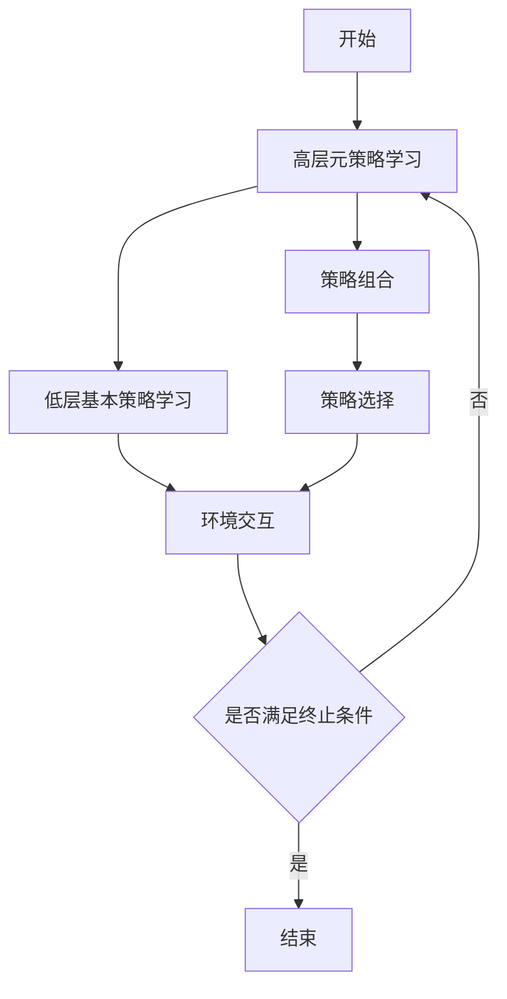

# 分层元强化学习:自动化策略组合与选择

> 关键词：分层元强化学习、自动化策略组合、策略选择、强化学习、元学习

> 摘要：本文围绕分层元强化学习中的自动化策略组合与选择展开深入探讨。首先介绍了相关背景，包括目的、预期读者、文档结构和术语表等。接着阐述了核心概念及其联系，给出了原理和架构的文本示意图与 Mermaid 流程图。详细讲解了核心算法原理，并用 Python 代码进行说明，同时给出了数学模型和公式。通过项目实战展示了代码的实际案例和详细解释。分析了分层元强化学习在不同场景下的实际应用，推荐了相关的学习资源、开发工具框架和论文著作。最后总结了未来发展趋势与挑战，并对常见问题进行了解答，提供了扩展阅读和参考资料。

## 1. 背景介绍 
### 1.1 目的和范围
在复杂的现实环境中，传统的强化学习方法往往面临着样本效率低、泛化能力差等问题。分层元强化学习作为一种新兴的技术，旨在通过自动化策略组合与选择，提高强化学习的效率和适应性。本文的目的是深入剖析分层元强化学习中自动化策略组合与选择的原理、算法和应用，涵盖从理论基础到实际项目的多个方面，为读者提供全面而深入的理解。

### 1.2 预期读者
本文预期读者包括对强化学习、元学习等领域感兴趣的研究人员、开发者，以及相关专业的学生。对于那些希望了解如何在复杂环境中提高强化学习性能，实现自动化策略组合与选择的人士，本文将提供有价值的参考。

### 1.3 文档结构概述
本文将按照以下结构进行组织：首先介绍分层元强化学习的背景知识，包括相关术语和概念。接着阐述核心概念及其联系，给出直观的示意图和流程图。然后详细讲解核心算法原理，并使用 Python 代码进行实现。之后介绍数学模型和公式，并通过具体例子进行说明。通过项目实战展示代码的实际应用和详细解释。分析分层元强化学习在不同场景下的实际应用。推荐相关的学习资源、开发工具框架和论文著作。最后总结未来发展趋势与挑战，解答常见问题，并提供扩展阅读和参考资料。

### 1.4 术语表
#### 1.4.1 核心术语定义
- **分层元强化学习**：结合了分层强化学习和元学习的思想，通过在不同层次上学习和优化策略，实现更高效的学习和决策。
- **自动化策略组合**：根据环境的特点和任务需求，自动地将多个基本策略组合成一个更有效的复合策略。
- **策略选择**：在多个可用策略中，选择最适合当前环境和任务的策略。
- **强化学习**：一种通过智能体与环境进行交互，根据环境反馈的奖励信号来学习最优策略的机器学习方法。
- **元学习**：也称为“学习如何学习”，旨在通过学习多个相关任务的经验，快速适应新的任务。

#### 1.4.2 相关概念解释
- **策略**：智能体在环境中采取行动的规则，通常表示为一个从状态到动作的映射。
- **状态**：环境在某一时刻的描述，包含了智能体决策所需的信息。
- **动作**：智能体在环境中可以采取的行为。
- **奖励**：环境对智能体采取的动作的反馈，用于指导智能体学习最优策略。

#### 1.4.3 缩略词列表
- **RL**：强化学习（Reinforcement Learning）
- **Meta-RL**：元强化学习（Meta Reinforcement Learning）
- **HRL**：分层强化学习（Hierarchical Reinforcement Learning）
- **HMeta-RL**：分层元强化学习（Hierarchical Meta Reinforcement Learning）

## 2. 核心概念与联系 
### 核心概念原理
分层元强化学习的核心思想是将学习过程分为多个层次，每个层次负责不同的任务。在较低层次，学习基本的策略；在较高层次，学习如何组合和选择这些基本策略。通过这种分层结构，可以提高学习效率和泛化能力。

元学习为分层强化学习提供了一种快速适应新任务的机制。在元学习阶段，智能体学习多个相关任务的经验，得到一个元策略。在面对新任务时，智能体可以利用元策略快速调整自己的行为，实现快速学习。

自动化策略组合与选择是分层元强化学习的关键环节。通过自动化策略组合，可以将多个基本策略组合成一个更强大的复合策略，以应对复杂的环境和任务。策略选择则是在多个可用策略中，选择最适合当前环境和任务的策略，提高决策的效率和准确性。

### 架构的文本示意图
```plaintext
+------------------------+
|  分层元强化学习系统    |
+------------------------+
|  高层元策略学习模块    |
|    - 学习策略组合规则  |
|    - 学习策略选择方法  |
+------------------------+
|  低层基本策略学习模块  |
|    - 学习基本策略      |
+------------------------+
|  环境交互模块          |
|    - 与环境进行交互    |
|    - 获取奖励信号      |
+------------------------+
```

### Mermaid 流程图


## 3. 核心算法原理 & 具体操作步骤 
### 核心算法原理
分层元强化学习中的自动化策略组合与选择可以基于多种算法实现，这里以基于价值的方法为例进行说明。

#### 基于价值的策略组合
在基于价值的方法中，每个基本策略都有一个对应的价值函数，表示在该策略下智能体的预期累积奖励。策略组合的目标是找到一个最优的策略组合，使得复合策略的价值函数最大。

设 $V_1(s), V_2(s), \cdots, V_n(s)$ 分别为 $n$ 个基本策略的价值函数，复合策略的价值函数可以表示为：

$$V_{composite}(s) = \sum_{i=1}^{n} w_i V_i(s)$$

其中 $w_i$ 是第 $i$ 个基本策略的权重，满足 $\sum_{i=1}^{n} w_i = 1$ 且 $w_i \geq 0$。

#### 基于价值的策略选择
策略选择的目标是在多个可用策略中，选择价值函数最大的策略。设 $V_1(s), V_2(s), \cdots, V_n(s)$ 分别为 $n$ 个可用策略的价值函数，策略选择的规则为：

$$\pi(s) = \arg\max_{i} V_i(s)$$

### 具体操作步骤
1. **初始化**：初始化基本策略的价值函数和权重。
2. **低层基本策略学习**：使用传统的强化学习算法，如 Q-learning 或 Deep Q-Network（DQN），学习基本策略的价值函数。
3. **高层元策略学习**：使用元学习算法，如 Model-Agnostic Meta-Learning（MAML），学习策略组合的权重和策略选择的规则。
4. **策略组合**：根据学习到的权重，组合基本策略得到复合策略。
5. **策略选择**：在每个时间步，根据学习到的规则选择最优策略。
6. **环境交互**：智能体使用选择的策略与环境进行交互，获取奖励信号。
7. **更新**：根据奖励信号更新基本策略的价值函数和高层元策略。
8. **重复步骤 2 - 7**，直到满足终止条件。

### Python 代码实现
```python
import numpy as np

# 定义基本策略的价值函数
class BasicPolicy:
    def __init__(self, num_states, num_actions):
        self.q_table = np.zeros((num_states, num_actions))

    def get_value(self, state, action):
        return self.q_table[state][action]

    def update_value(self, state, action, reward, next_state, alpha=0.1, gamma=0.9):
        max_q_next = np.max(self.q_table[next_state])
        self.q_table[state][action] += alpha * (reward + gamma * max_q_next - self.q_table[state][action])

# 定义策略组合类
class PolicyCombination:
    def __init__(self, policies):
        self.policies = policies
        self.weights = np.ones(len(policies)) / len(policies)

    def get_composite_value(self, state, action):
        composite_value = 0
        for i, policy in enumerate(self.policies):
            composite_value += self.weights[i] * policy.get_value(state, action)
        return composite_value

    def update_weights(self, new_weights):
        self.weights = new_weights

# 定义策略选择类
class PolicySelection:
    def __init__(self, policies):
        self.policies = policies

    def select_policy(self, state):
        values = [policy.get_value(state, np.argmax(policy.q_table[state])) for policy in self.policies]
        best_policy_index = np.argmax(values)
        return self.policies[best_policy_index]

# 环境交互
def interact_with_environment(policy, state, action, reward, next_state):
    policy.update_value(state, action, reward, next_state)
    return next_state

# 主程序
if __name__ == "__main__":
    num_states = 10
    num_actions = 4
    num_policies = 3

    # 初始化基本策略
    policies = [BasicPolicy(num_states, num_actions) for _ in range(num_policies)]

    # 初始化策略组合和选择
    policy_combination = PolicyCombination(policies)
    policy_selection = PolicySelection(policies)

    # 模拟环境交互
    state = 0
    for _ in range(100):
        selected_policy = policy_selection.select_policy(state)
        action = np.argmax(selected_policy.q_table[state])
        reward = np.random.randint(0, 10)
        next_state = np.random.randint(0, num_states)
        state = interact_with_environment(selected_policy, state, action, reward, next_state)

    print("Final Q-tables of basic policies:")
    for i, policy in enumerate(policies):
        print(f"Policy {i}:")
        print(policy.q_table)
```

## 4. 数学模型和公式 & 详细讲解 & 举例说明 
### 数学模型和公式
#### 价值函数
在强化学习中，价值函数是衡量智能体在某个状态下的预期累积奖励的指标。对于策略 $\pi$，状态 $s$ 的价值函数 $V^{\pi}(s)$ 定义为：

$$V^{\pi}(s) = \mathbb{E}_{\pi}\left[\sum_{t=0}^{\infty} \gamma^t r_{t+1} \mid s_0 = s\right]$$

其中 $\gamma \in [0, 1]$ 是折扣因子，用于平衡即时奖励和未来奖励；$r_{t+1}$ 是在时间步 $t+1$ 获得的奖励。

动作价值函数 $Q^{\pi}(s, a)$ 表示在状态 $s$ 采取动作 $a$，并遵循策略 $\pi$ 之后的预期累积奖励：

$$Q^{\pi}(s, a) = \mathbb{E}_{\pi}\left[\sum_{t=0}^{\infty} \gamma^t r_{t+1} \mid s_0 = s, a_0 = a\right]$$

#### 贝尔曼方程
价值函数和动作价值函数满足贝尔曼方程。对于价值函数，贝尔曼方程为：

$$V^{\pi}(s) = \sum_{a \in \mathcal{A}} \pi(a \mid s) \left(r(s, a) + \gamma \sum_{s' \in \mathcal{S}} P(s' \mid s, a) V^{\pi}(s')\right)$$

其中 $\mathcal{A}$ 是动作空间，$\pi(a \mid s)$ 是在状态 $s$ 采取动作 $a$ 的概率，$r(s, a)$ 是在状态 $s$ 采取动作 $a$ 获得的即时奖励，$P(s' \mid s, a)$ 是在状态 $s$ 采取动作 $a$ 转移到状态 $s'$ 的概率。

对于动作价值函数，贝尔曼方程为：

$$Q^{\pi}(s, a) = r(s, a) + \gamma \sum_{s' \in \mathcal{S}} P(s' \mid s, a) \sum_{a' \in \mathcal{A}} \pi(a' \mid s') Q^{\pi}(s', a')$$

#### 策略组合和选择的公式
如前面所述，复合策略的价值函数为：

$$V_{composite}(s) = \sum_{i=1}^{n} w_i V_i(s)$$

策略选择的规则为：

$$\pi(s) = \arg\max_{i} V_i(s)$$

### 详细讲解
价值函数和动作价值函数是强化学习中的核心概念，它们描述了智能体在不同状态下的预期收益。贝尔曼方程则提供了一种递归的方式来计算价值函数，使得我们可以通过迭代的方法求解最优策略。

策略组合的公式通过加权求和的方式将多个基本策略的价值函数组合成一个复合策略的价值函数。权重 $w_i$ 表示每个基本策略在复合策略中的重要性。策略选择的公式则根据价值函数的大小选择最优策略。

### 举例说明
假设我们有一个简单的网格世界环境，智能体可以在网格中上下左右移动。有两个基本策略 $\pi_1$ 和 $\pi_2$，它们的价值函数分别为 $V_1(s)$ 和 $V_2(s)$。

在某个状态 $s$ 下，$V_1(s) = 5$，$V_2(s) = 3$。如果我们采用策略选择的规则，那么在状态 $s$ 下应该选择策略 $\pi_1$。

假设我们要进行策略组合，权重 $w_1 = 0.6$，$w_2 = 0.4$，则复合策略的价值函数为：

$$V_{composite}(s) = 0.6 \times 5 + 0.4 \times 3 = 4.2$$

## 5. 项目实战：代码实际案例和详细解释说明 
### 5.1  开发环境搭建
#### 安装 Python
首先需要安装 Python，建议使用 Python 3.7 及以上版本。可以从 Python 官方网站（https://www.python.org/downloads/）下载并安装。

#### 安装依赖库
本项目需要使用 `numpy` 库，可以使用以下命令进行安装：

```sh
pip install numpy
```

### 5.2  源代码详细实现和代码解读
```python
import numpy as np

# 定义基本策略的价值函数
class BasicPolicy:
    def __init__(self, num_states, num_actions):
        # 初始化 Q 表，用于存储每个状态-动作对的价值
        self.q_table = np.zeros((num_states, num_actions))

    def get_value(self, state, action):
        # 获取指定状态-动作对的价值
        return self.q_table[state][action]

    def update_value(self, state, action, reward, next_state, alpha=0.1, gamma=0.9):
        # 使用 Q-learning 算法更新 Q 表
        # alpha 是学习率，gamma 是折扣因子
        max_q_next = np.max(self.q_table[next_state])
        self.q_table[state][action] += alpha * (reward + gamma * max_q_next - self.q_table[state][action])

# 定义策略组合类
class PolicyCombination:
    def __init__(self, policies):
        # 初始化基本策略列表
        self.policies = policies
        # 初始化权重，初始权重相等
        self.weights = np.ones(len(policies)) / len(policies)

    def get_composite_value(self, state, action):
        # 计算复合策略的价值
        composite_value = 0
        for i, policy in enumerate(self.policies):
            composite_value += self.weights[i] * policy.get_value(state, action)
        return composite_value

    def update_weights(self, new_weights):
        # 更新权重
        self.weights = new_weights

# 定义策略选择类
class PolicySelection:
    def __init__(self, policies):
        # 初始化基本策略列表
        self.policies = policies

    def select_policy(self, state):
        # 选择最优策略
        values = [policy.get_value(state, np.argmax(policy.q_table[state])) for policy in self.policies]
        best_policy_index = np.argmax(values)
        return self.policies[best_policy_index]

# 环境交互
def interact_with_environment(policy, state, action, reward, next_state):
    # 与环境交互，更新策略的价值函数
    policy.update_value(state, action, reward, next_state)
    return next_state

# 主程序
if __name__ == "__main__":
    num_states = 10
    num_actions = 4
    num_policies = 3

    # 初始化基本策略
    policies = [BasicPolicy(num_states, num_actions) for _ in range(num_policies)]

    # 初始化策略组合和选择
    policy_combination = PolicyCombination(policies)
    policy_selection = PolicySelection(policies)

    # 模拟环境交互
    state = 0
    for _ in range(100):
        selected_policy = policy_selection.select_policy(state)
        action = np.argmax(selected_policy.q_table[state])
        reward = np.random.randint(0, 10)
        next_state = np.random.randint(0, num_states)
        state = interact_with_environment(selected_policy, state, action, reward, next_state)

    print("Final Q-tables of basic policies:")
    for i, policy in enumerate(policies):
        print(f"Policy {i}:")
        print(policy.q_table)
```

### 代码解读与分析
#### `BasicPolicy` 类
- `__init__` 方法：初始化 Q 表，用于存储每个状态-动作对的价值。
- `get_value` 方法：获取指定状态-动作对的价值。
- `update_value` 方法：使用 Q-learning 算法更新 Q 表。

#### `PolicyCombination` 类
- `__init__` 方法：初始化基本策略列表和权重。
- `get_composite_value` 方法：计算复合策略的价值。
- `update_weights` 方法：更新权重。

#### `PolicySelection` 类
- `__init__` 方法：初始化基本策略列表。
- `select_policy` 方法：选择最优策略。

#### `interact_with_environment` 函数
该函数模拟智能体与环境的交互，根据奖励信号更新策略的价值函数。

#### 主程序
- 初始化基本策略、策略组合和选择。
- 模拟环境交互，进行 100 个时间步的学习。
- 输出每个基本策略的最终 Q 表。

## 6. 实际应用场景 
### 机器人控制
在机器人控制中，分层元强化学习的自动化策略组合与选择可以帮助机器人快速适应不同的任务和环境。例如，在一个机器人导航任务中，基本策略可以包括向前移动、向左转弯、向右转弯等。通过自动化策略组合和选择，机器人可以根据当前的环境和目标，选择最优的策略组合，实现高效的导航。

### 游戏开发
在游戏开发中，分层元强化学习可以用于实现智能的游戏 AI。例如，在一个角色扮演游戏中，基本策略可以包括攻击、防御、逃跑等。通过自动化策略组合和选择，游戏 AI 可以根据对手的状态和当前的游戏局势，选择最优的策略，提高游戏的趣味性和挑战性。

### 金融投资
在金融投资领域，分层元强化学习可以用于优化投资策略。基本策略可以包括买入、卖出、持有等。通过自动化策略组合和选择，投资者可以根据市场的变化和自身的风险偏好，选择最优的投资策略，实现资产的增值。

### 智能交通
在智能交通系统中，分层元强化学习可以用于交通流量控制和车辆调度。基本策略可以包括调整交通信号灯的时间、引导车辆选择不同的路线等。通过自动化策略组合和选择，可以提高交通效率，减少拥堵。

## 7. 工具和资源推荐
### 7.1 学习资源推荐
#### 7.1.1 书籍推荐
- 《Reinforcement Learning: An Introduction》（《强化学习：原理与Python实现》）：这是一本经典的强化学习教材，详细介绍了强化学习的基本概念、算法和应用。
- 《Meta-Learning: A Survey》：对元学习进行了全面的综述，介绍了元学习的各种方法和应用。
- 《Hierarchical Reinforcement Learning: Foundations, Algorithms, and Applications》：专门介绍了分层强化学习的理论和实践。

#### 7.1.2 在线课程
- Coursera 上的“Reinforcement Learning Specialization”：由著名学者 Richard Sutton 等人授课，系统地介绍了强化学习的理论和实践。
- edX 上的“Artificial Intelligence: Reinforcement Learning”：提供了强化学习的深入学习资源。
- Udemy 上的“Meta Learning: Learn to Learn in Machine Learning”：专门介绍了元学习的知识。

#### 7.1.3 技术博客和网站
- OpenAI Blog（https://openai.com/blog/）：OpenAI 发布的最新研究成果和技术文章。
- DeepMind Blog（https://deepmind.com/blog/）：DeepMind 发布的人工智能领域的研究进展。
- Towards Data Science（https://towardsdatascience.com/）：提供了大量关于机器学习和强化学习的技术文章和教程。

### 7.2 开发工具框架推荐
#### 7.2.1 IDE和编辑器
- PyCharm：一款专业的 Python 集成开发环境，提供了丰富的功能和插件，方便开发和调试。
- Jupyter Notebook：一种交互式的开发环境，适合进行数据分析和模型实验。
- Visual Studio Code：一款轻量级的代码编辑器，支持多种编程语言，具有丰富的插件生态系统。

#### 7.2.2 调试和性能分析工具
- TensorBoard：用于可视化深度学习模型的训练过程和性能指标。
- Py-Spy：用于分析 Python 程序的性能瓶颈。
- cProfile：Python 内置的性能分析工具，用于分析程序的运行时间和函数调用次数。

#### 7.2.3 相关框架和库
- TensorFlow：一个开源的深度学习框架，提供了丰富的工具和函数，方便开发和训练强化学习模型。
- PyTorch：另一个流行的深度学习框架，具有简洁的 API 和高效的计算性能。
- Stable Baselines：一个基于 TensorFlow 和 PyTorch 的强化学习库，提供了多种预训练的强化学习算法。

### 7.3 相关论文著作推荐
#### 7.3.1 经典论文
- “Model-Agnostic Meta-Learning for Fast Adaptation of Deep Networks”：提出了 MAML 算法，是元学习领域的经典论文。
- “Hierarchical Deep Reinforcement Learning: Integrating Temporal Abstraction and Intrinsic Motivation”：介绍了分层深度强化学习的方法和应用。
- “Deep Reinforcement Learning with Double Q-learning”：提出了 Double Q-learning 算法，解决了传统 Q-learning 算法中的过估计问题。

#### 7.3.2 最新研究成果
- 关注顶级学术会议，如 NeurIPS、ICML、AAAI 等，这些会议上会发布最新的分层元强化学习研究成果。
- 关注知名学术期刊，如 Journal of Artificial Intelligence Research（JAIR）、Artificial Intelligence 等。

#### 7.3.3 应用案例分析
- 可以在相关的学术数据库中搜索分层元强化学习在不同领域的应用案例，如机器人控制、游戏开发、金融投资等。
- 一些知名的科技公司，如 Google、Microsoft、Facebook 等，会在其官方博客上发布相关的应用案例和技术文章。

## 8. 总结：未来发展趋势与挑战
### 未来发展趋势
- **更复杂环境的适应**：随着现实环境的日益复杂，分层元强化学习将需要能够处理更复杂的状态空间、动作空间和动态变化。例如，在自动驾驶、智能医疗等领域，需要处理大量的传感器数据和不确定性。
- **与其他技术的融合**：分层元强化学习可能会与其他技术，如深度学习、计算机视觉、自然语言处理等进行更深入的融合。例如，结合计算机视觉技术，实现对环境的更准确感知；结合自然语言处理技术，实现与人类的更自然交互。
- **多智能体协作**：在多智能体系统中，分层元强化学习可以用于实现智能体之间的协作和竞争。例如，在机器人团队协作、智能交通系统等领域，多个智能体需要通过协作来完成共同的任务。
- **可解释性和安全性**：随着分层元强化学习在关键领域的应用，其可解释性和安全性将变得越来越重要。未来的研究将致力于开发可解释的强化学习算法，以及提高系统的安全性和可靠性。

### 挑战
- **样本效率问题**：分层元强化学习仍然面临样本效率低的问题，需要大量的样本才能学习到有效的策略。如何提高样本效率，减少学习时间和成本，是未来需要解决的重要问题。
- **模型复杂度问题**：随着分层结构的增加和策略组合的复杂化，模型的复杂度也会相应增加。如何有效地管理和优化模型的复杂度，避免过拟合和计算资源的浪费，是一个挑战。
- **环境动态变化问题**：现实环境往往是动态变化的，分层元强化学习需要能够快速适应环境的变化。如何设计具有良好适应性的算法，是未来研究的重点。
- **伦理和法律问题**：分层元强化学习在一些关键领域的应用，如自动驾驶、智能医疗等，可能会引发伦理和法律问题。如何确保系统的决策符合伦理和法律要求，是一个需要关注的问题。

## 9. 附录：常见问题与解答
### 问题 1：分层元强化学习与传统强化学习有什么区别？
分层元强化学习结合了分层强化学习和元学习的思想，通过在不同层次上学习和优化策略，实现更高效的学习和决策。与传统强化学习相比，分层元强化学习可以更好地处理复杂的环境和任务，提高样本效率和泛化能力。

### 问题 2：如何选择合适的基本策略？
选择合适的基本策略需要考虑环境的特点和任务的需求。一般来说，基本策略应该具有一定的通用性和独立性，能够覆盖环境中的主要行为模式。可以通过先验知识、领域经验或实验来确定基本策略。

### 问题 3：策略组合的权重如何确定？
策略组合的权重可以通过多种方法确定，如元学习算法、启发式方法或基于数据的方法。元学习算法可以通过学习多个相关任务的经验，自动调整权重；启发式方法可以根据先验知识或领域经验来确定权重；基于数据的方法可以通过分析历史数据来确定权重。

### 问题 4：分层元强化学习的计算复杂度如何？
分层元强化学习的计算复杂度通常比传统强化学习要高，因为需要在多个层次上进行学习和优化。计算复杂度主要取决于分层结构的深度、基本策略的数量和复杂度等因素。可以通过优化算法、并行计算等方法来降低计算复杂度。

## 10. 扩展阅读 & 参考资料
### 扩展阅读
- “Meta Reinforcement Learning for Adaptive Visual Navigation”：介绍了元强化学习在视觉导航中的应用。
- “Hierarchical Policy Gradient with Stochastic Options”：提出了一种基于随机选项的分层策略梯度算法。
- “Learning to Reinforcement Learn”：探讨了如何学习如何进行强化学习的问题。

### 参考资料
- Sutton, R. S., & Barto, A. G. (2018). Reinforcement Learning: An Introduction. MIT press.
- Finn, C., Abbeel, P., & Levine, S. (2017). Model-Agnostic Meta-Learning for Fast Adaptation of Deep Networks. Proceedings of the 34th International Conference on Machine Learning-Volume 70.
- Kulkarni, T. D., Narasimhan, K., Saeedi, A., & Tenenbaum, J. B. (2016). Hierarchical Deep Reinforcement Learning: Integrating Temporal Abstraction and Intrinsic Motivation. Advances in Neural Information Processing Systems.

作者：AI天才研究院/AI Genius Institute & 禅与计算机程序设计艺术 /Zen And The Art of Computer Programming