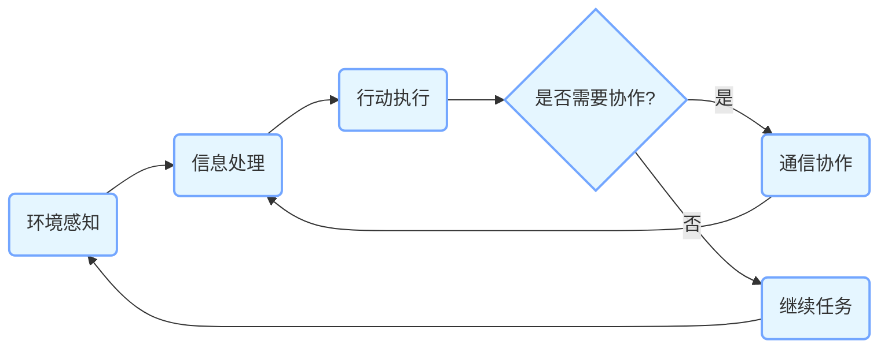

# 分布式AI Agent系统：设计与实现

> 关键词：分布式系统、AI Agent、系统设计、系统实现、多智能体协作

> 摘要：本文围绕分布式AI Agent系统的设计与实现展开深入探讨。首先介绍了分布式AI Agent系统的背景知识，包括目的范围、预期读者、文档结构和术语表。接着阐述了核心概念及其联系，通过文本示意图和Mermaid流程图清晰展示。详细讲解了核心算法原理，并给出Python源代码示例。对系统涉及的数学模型和公式进行了详细推导与举例说明。通过项目实战，从开发环境搭建、源代码实现到代码解读进行了全面分析。探讨了系统的实际应用场景，推荐了学习资源、开发工具框架以及相关论文著作。最后总结了系统的未来发展趋势与挑战，提供了常见问题解答和扩展阅读参考资料，旨在为相关领域的研究者和开发者提供全面且深入的技术指导。

## 1. 背景介绍 
### 1.1 目的和范围
分布式AI Agent系统旨在解决传统集中式系统在处理复杂任务、大规模数据和高并发场景时的局限性。通过将多个AI Agent分布在不同的节点上协同工作，可以提高系统的性能、可扩展性和容错性。本文章的范围涵盖了分布式AI Agent系统的设计原理、实现方法、相关算法、数学模型，以及实际应用场景等方面。从理论基础到实际项目开发，全面深入地探讨分布式AI Agent系统的各个环节。

### 1.2 预期读者
本文预期读者包括人工智能领域的研究者、软件开发者、系统架构师以及对分布式系统和AI Agent技术感兴趣的专业人士。对于初学者，本文可以作为入门教程，帮助他们了解分布式AI Agent系统的基本概念和实现方法；对于有一定经验的开发者和研究者，本文提供了深入的技术分析和实际案例，可作为进一步研究和开发的参考。

### 1.3 文档结构概述
本文共分为十个部分。第一部分是背景介绍，阐述了文章的目的、预期读者、文档结构和术语表。第二部分介绍核心概念与联系，通过文本示意图和Mermaid流程图展示系统的基本架构和原理。第三部分讲解核心算法原理，并给出Python源代码示例。第四部分分析数学模型和公式，进行详细推导和举例说明。第五部分是项目实战，包括开发环境搭建、源代码实现和代码解读。第六部分探讨实际应用场景。第七部分推荐学习资源、开发工具框架和相关论文著作。第八部分总结未来发展趋势与挑战。第九部分是附录，提供常见问题解答。第十部分列出扩展阅读和参考资料。

### 1.4 术语表
#### 1.4.1 核心术语定义
- **分布式系统**：由多个独立的计算节点通过网络连接组成的系统，这些节点可以协同工作来完成共同的任务。
- **AI Agent**：具有自主决策和行动能力的智能实体，能够感知环境、处理信息并采取相应的行动以实现特定的目标。
- **多智能体系统（MAS）**：由多个AI Agent组成的系统，这些Agent之间可以相互协作、竞争或通信，以实现整体的系统目标。
- **通信协议**：定义了分布式系统中各个节点之间进行信息交换的规则和格式。
- **任务分配**：将复杂的任务分解为多个子任务，并将这些子任务分配给不同的AI Agent来完成的过程。

#### 1.4.2 相关概念解释
- **自主性**：AI Agent能够在没有外部干预的情况下自主地感知环境、做出决策和采取行动。
- **反应性**：AI Agent能够对环境中的变化及时做出反应，调整自己的行为以适应环境。
- **社会性**：AI Agent能够与其他Agent进行交互和协作，共同完成任务。
- **智能性**：AI Agent具有一定的知识和推理能力，能够根据环境信息和自身目标做出合理的决策。

#### 1.4.3 缩略词列表
- **MAS**：Multi-Agent System（多智能体系统）
- **RPC**：Remote Procedure Call（远程过程调用）
- **REST**：Representational State Transfer（表现层状态转移）
- **MQTT**：Message Queuing Telemetry Transport（消息队列遥测传输）

## 2. 核心概念与联系 

### 核心概念原理
分布式AI Agent系统的核心是多个AI Agent在分布式环境下的协同工作。每个AI Agent可以看作是一个独立的智能体，具有自主决策和行动的能力。这些Agent通过网络进行通信和协作，共同完成复杂的任务。

系统的基本工作流程如下：
1. **环境感知**：每个AI Agent通过传感器或其他方式感知周围的环境信息。
2. **信息处理**：AI Agent对感知到的信息进行处理和分析，结合自身的知识和目标，做出决策。
3. **行动执行**：AI Agent根据决策结果采取相应的行动，这些行动可能包括与其他Agent进行通信、执行特定的任务等。
4. **通信协作**：不同的AI Agent之间通过通信协议进行信息交换和协作，以实现整体的系统目标。

### 架构的文本示意图
```plaintext
+---------------------+
| 分布式AI Agent系统   |
+---------------------+
| 节点1: AI Agent 1    |
| 节点2: AI Agent 2    |
|...                  |
| 节点n: AI Agent n    |
+---------------------+
| 通信网络            |
+---------------------+
| 任务管理器          |
+---------------------+
```

### Mermaid流程图


## 3. 核心算法原理 & 具体操作步骤 

### 核心算法原理
在分布式AI Agent系统中，任务分配算法是一个核心算法，它的主要目的是将复杂的任务合理地分配给不同的AI Agent，以提高系统的整体性能。这里我们介绍一种基于遗传算法的任务分配算法。

遗传算法是一种模拟自然选择和遗传机制的优化算法，它通过模拟生物进化过程中的选择、交叉和变异操作，不断迭代搜索最优解。在任务分配问题中，每个个体表示一种任务分配方案，每个基因表示一个任务分配给哪个AI Agent。

### 具体操作步骤
1. **初始化种群**：随机生成一组任务分配方案作为初始种群。
2. **适应度评估**：计算每个个体的适应度值，适应度值表示该任务分配方案的优劣程度。适应度函数可以根据任务完成时间、资源利用率等因素来定义。
3. **选择操作**：根据个体的适应度值，选择一部分个体作为父代，用于产生下一代个体。
4. **交叉操作**：对选中的父代个体进行交叉操作，生成新的个体。
5. **变异操作**：对新生成的个体进行变异操作，引入新的基因，增加种群的多样性。
6. **终止条件判断**：判断是否满足终止条件，如达到最大迭代次数或找到满意的解。如果满足终止条件，则算法结束；否则，返回步骤2继续迭代。

### Python源代码示例
```python
import random

# 定义任务和AI Agent的数量
num_tasks = 10
num_agents = 5

# 初始化种群
def initialize_population(pop_size):
    population = []
    for _ in range(pop_size):
        individual = [random.randint(0, num_agents - 1) for _ in range(num_tasks)]
        population.append(individual)
    return population

# 适应度评估
def fitness_function(individual):
    # 这里简单假设适应度值为任务分配的均匀程度
    agent_load = [0] * num_agents
    for task, agent in enumerate(individual):
        agent_load[agent] += 1
    variance = sum((load - sum(agent_load) / num_agents) ** 2 for load in agent_load)
    return 1 / (1 + variance)

# 选择操作
def selection(population, fitness_values):
    total_fitness = sum(fitness_values)
    probabilities = [fitness / total_fitness for fitness in fitness_values]
    selected_indices = random.choices(range(len(population)), weights=probabilities, k=2)
    return [population[i] for i in selected_indices]

# 交叉操作
def crossover(parent1, parent2):
    crossover_point = random.randint(1, num_tasks - 1)
    child1 = parent1[:crossover_point] + parent2[crossover_point:]
    child2 = parent2[:crossover_point] + parent1[crossover_point:]
    return child1, child2

# 变异操作
def mutation(individual, mutation_rate):
    for i in range(num_tasks):
        if random.random() < mutation_rate:
            individual[i] = random.randint(0, num_agents - 1)
    return individual

# 遗传算法主函数
def genetic_algorithm(pop_size, num_generations, mutation_rate):
    population = initialize_population(pop_size)
    for _ in range(num_generations):
        fitness_values = [fitness_function(individual) for individual in population]
        new_population = []
        for _ in range(pop_size // 2):
            parents = selection(population, fitness_values)
            child1, child2 = crossover(parents[0], parents[1])
            child1 = mutation(child1, mutation_rate)
            child2 = mutation(child2, mutation_rate)
            new_population.extend([child1, child2])
        population = new_population
    best_individual = max(population, key=fitness_function)
    return best_individual

# 运行遗传算法
pop_size = 100
num_generations = 200
mutation_rate = 0.01
best_allocation = genetic_algorithm(pop_size, num_generations, mutation_rate)
print("Best task allocation:", best_allocation)
```

## 4. 数学模型和公式 & 详细讲解 & 举例说明 

### 数学模型
在分布式AI Agent系统中，任务分配问题可以用数学模型来描述。假设我们有 $m$ 个任务 $T = \{t_1, t_2, \cdots, t_m\}$ 和 $n$ 个AI Agent $A = \{a_1, a_2, \cdots, a_n\}$。任务分配方案可以用一个矩阵 $X = [x_{ij}]_{m \times n}$ 表示，其中 $x_{ij}$ 是一个二进制变量，如果任务 $t_i$ 分配给AI Agent $a_j$，则 $x_{ij} = 1$，否则 $x_{ij} = 0$。

### 约束条件
1. **每个任务只能分配给一个AI Agent**：
   $$\sum_{j=1}^{n} x_{ij} = 1, \quad i = 1, 2, \cdots, m$$
2. **每个AI Agent的负载不能超过其最大处理能力**：
   $$\sum_{i=1}^{m} w_{i} x_{ij} \leq c_j, \quad j = 1, 2, \cdots, n$$
其中 $w_i$ 是任务 $t_i$ 的工作量，$c_j$ 是AI Agent $a_j$ 的最大处理能力。

### 目标函数
目标函数可以根据不同的优化目标来定义，例如最小化任务完成时间、最大化资源利用率等。这里我们以最小化任务完成时间为例，假设任务 $t_i$ 在AI Agent $a_j$ 上的处理时间为 $p_{ij}$，则目标函数为：
$$\min \max_{j=1}^{n} \sum_{i=1}^{m} p_{ij} x_{ij}$$

### 详细讲解
上述数学模型将任务分配问题转化为一个整数规划问题。约束条件保证了每个任务只能分配给一个AI Agent，并且每个AI Agent的负载不超过其最大处理能力。目标函数的目的是找到一种任务分配方案，使得所有AI Agent中完成任务的最长时间最短，从而提高系统的整体性能。

### 举例说明
假设我们有3个任务 $T = \{t_1, t_2, t_3\}$ 和2个AI Agent $A = \{a_1, a_2\}$，任务的工作量分别为 $w_1 = 2, w_2 = 3, w_3 = 4$，AI Agent的最大处理能力分别为 $c_1 = 5, c_2 = 6$，任务在不同AI Agent上的处理时间如下表所示：

| 任务 | AI Agent $a_1$ | AI Agent $a_2$ |
|------|----------------|----------------|
| $t_1$ | 3              | 2              |
| $t_2$ | 4              | 3              |
| $t_3$ | 5              | 4              |

任务分配矩阵 $X$ 可以表示为：
$$X = \begin{bmatrix}
x_{11} & x_{12} \\
x_{21} & x_{22} \\
x_{31} & x_{32}
\end{bmatrix}$$

约束条件为：
$$x_{11} + x_{12} = 1$$
$$x_{21} + x_{22} = 1$$
$$x_{31} + x_{32} = 1$$
$$2x_{11} + 3x_{21} + 4x_{31} \leq 5$$
$$2x_{12} + 3x_{22} + 4x_{32} \leq 6$$

目标函数为：
$$\min \max\left\{3x_{11} + 4x_{21} + 5x_{31}, 2x_{12} + 3x_{22} + 4x_{32}\right\}$$

通过求解这个整数规划问题，我们可以得到最优的任务分配方案。

## 5. 项目实战：代码实际案例和详细解释说明 

### 5.1  开发环境搭建
#### 操作系统
建议使用Linux系统，如Ubuntu 20.04，因为Linux系统在分布式开发方面具有更好的稳定性和兼容性。

#### 编程语言
使用Python 3.8及以上版本，Python具有丰富的库和工具，适合快速开发分布式AI Agent系统。

#### 开发工具
- **PyCharm**：一款功能强大的Python集成开发环境（IDE），提供代码编辑、调试、版本控制等功能。
- **Git**：用于代码版本管理，方便团队协作开发。

#### 依赖库安装
在项目中，我们需要安装一些必要的Python库，如`numpy`、`scikit-learn`、`pika`（用于消息队列）等。可以使用以下命令进行安装：
```bash
pip install numpy scikit-learn pika
```

### 5.2  源代码详细实现和代码解读
#### 任务管理器代码
```python
import pika
import json

# 任务管理器类
class TaskManager:
    def __init__(self, host='localhost'):
        # 连接到RabbitMQ消息队列
        self.connection = pika.BlockingConnection(pika.ConnectionParameters(host=host))
        self.channel = self.connection.channel()
        # 声明任务队列
        self.channel.queue_declare(queue='task_queue')

    def distribute_tasks(self, tasks):
        # 遍历任务列表
        for task in tasks:
            # 将任务转换为JSON格式并发送到任务队列
            message = json.dumps(task)
            self.channel.basic_publish(exchange='', routing_key='task_queue', body=message)
            print(f" [x] Sent task: {task}")
        # 关闭连接
        self.connection.close()

# 示例任务列表
tasks = [
    {"task_id": 1, "data": [1, 2, 3]},
    {"task_id": 2, "data": [4, 5, 6]},
    {"task_id": 3, "data": [7, 8, 9]}
]

# 创建任务管理器实例并分发任务
task_manager = TaskManager()
task_manager.distribute_tasks(tasks)
```
**代码解读**：
- `TaskManager`类负责将任务分发给AI Agent。
- 在`__init__`方法中，我们连接到RabbitMQ消息队列，并声明一个任务队列。
- `distribute_tasks`方法将任务列表中的每个任务转换为JSON格式，并发送到任务队列中。

#### AI Agent代码
```python
import pika
import json

# AI Agent类
class AIAgent:
    def __init__(self, host='localhost'):
        # 连接到RabbitMQ消息队列
        self.connection = pika.BlockingConnection(pika.ConnectionParameters(host=host))
        self.channel = self.connection.channel()
        # 声明任务队列
        self.channel.queue_declare(queue='task_queue')
        # 定义回调函数，处理接收到的任务
        self.channel.basic_consume(queue='task_queue', on_message_callback=self.callback, auto_ack=True)

    def callback(self, ch, method, properties, body):
        # 将接收到的消息转换为任务字典
        task = json.loads(body.decode())
        print(f" [x] Received task: {task}")
        # 模拟任务处理
        result = sum(task["data"])
        print(f" [x] Processed task {task['task_id']}, result: {result}")

    def start(self):
        print(' [*] Waiting for tasks. To exit press CTRL+C')
        # 开始消费任务队列中的消息
        self.channel.start_consuming()

# 创建AI Agent实例并启动
agent = AIAgent()
agent.start()
```
**代码解读**：
- `AIAgent`类负责接收和处理任务。
- 在`__init__`方法中，我们连接到RabbitMQ消息队列，并声明一个任务队列。
- `callback`方法是一个回调函数，用于处理接收到的任务。在这个方法中，我们将接收到的消息转换为任务字典，并模拟任务处理过程。
- `start`方法开始消费任务队列中的消息。

### 5.3  代码解读与分析
#### 任务管理器
任务管理器通过RabbitMQ消息队列将任务分发给AI Agent。使用消息队列的好处是可以实现任务的异步处理，提高系统的并发性能。任务管理器只需要将任务发送到队列中，而不需要等待AI Agent的处理结果。

#### AI Agent
AI Agent从任务队列中接收任务，并进行处理。每个AI Agent可以独立地处理任务，提高了系统的可扩展性。如果需要增加处理能力，只需要启动更多的AI Agent实例即可。

## 6. 实际应用场景 
### 智能交通系统
在智能交通系统中，分布式AI Agent系统可以用于交通流量控制和车辆调度。每个路口的交通信号灯可以看作是一个AI Agent，它们可以感知周围的交通流量信息，并根据这些信息调整信号灯的时间。同时，车辆也可以作为AI Agent，它们可以与交通信号灯和其他车辆进行通信，选择最优的行驶路线，从而提高整个交通系统的效率。

### 工业自动化
在工业自动化领域，分布式AI Agent系统可以用于生产过程的监控和优化。每个生产设备可以看作是一个AI Agent，它们可以实时监测自身的运行状态，并将数据发送给中央控制系统。中央控制系统可以根据这些数据进行分析和决策，调整生产参数，提高生产效率和产品质量。

### 医疗保健
在医疗保健领域，分布式AI Agent系统可以用于医疗资源的分配和患者的健康管理。每个医院、诊所和医疗设备可以看作是一个AI Agent，它们可以共享患者的医疗信息，并根据患者的病情和需求，合理分配医疗资源。同时，患者也可以作为AI Agent，通过可穿戴设备实时监测自己的健康状况，并将数据发送给医生，实现远程医疗服务。

### 金融服务
在金融服务领域，分布式AI Agent系统可以用于风险评估和投资决策。每个金融机构和交易平台可以看作是一个AI Agent，它们可以收集和分析市场数据，评估投资风险，并根据客户的需求提供个性化的投资建议。同时，不同的AI Agent之间可以进行协作，共同完成复杂的金融交易。

## 7. 工具和资源推荐
### 7.1 学习资源推荐
#### 7.1.1 书籍推荐
- 《Multiagent Systems: Algorithmic, Game-Theoretic, and Logical Foundations》：这本书全面介绍了多智能体系统的理论和算法，包括智能体的建模、决策、通信和协作等方面。
- 《Distributed Systems: Principles and Paradigms》：详细讲解了分布式系统的基本原理和设计方法，对于理解分布式AI Agent系统的架构和通信机制非常有帮助。
- 《Artificial Intelligence: A Modern Approach》：经典的人工智能教材，涵盖了人工智能的各个领域，包括AI Agent的概念和技术。

#### 7.1.2 在线课程
- Coursera上的“Artificial Intelligence for Robotics”：该课程介绍了人工智能在机器人领域的应用，包括多机器人协作和分布式控制等内容。
- edX上的“Distributed Systems”：由知名高校教授授课，深入讲解分布式系统的原理和实践。
- Udemy上的“Multi-Agent Systems in Python”：通过Python代码实践，学习多智能体系统的开发和应用。

#### 7.1.3 技术博客和网站
- Medium上的“Towards Data Science”：有很多关于人工智能和分布式系统的技术文章，涵盖了最新的研究成果和实践经验。
- arXiv.org：提供了大量的学术论文，包括分布式AI Agent系统的相关研究。
- GitHub上的开源项目：可以搜索相关的分布式AI Agent系统的开源项目，学习他人的代码和实现思路。

### 7.2 开发工具框架推荐
#### 7.2.1 IDE和编辑器
- PyCharm：功能强大的Python集成开发环境，提供代码编辑、调试、版本控制等功能。
- Visual Studio Code：轻量级的代码编辑器，支持多种编程语言和插件扩展，适合快速开发和调试。
- Jupyter Notebook：交互式的开发环境，适合数据分析和算法验证，方便展示代码和结果。

#### 7.2.2 调试和性能分析工具
- PDB：Python自带的调试器，可以帮助开发者定位代码中的问题。
- cProfile：Python的性能分析工具，可以分析代码的执行时间和函数调用情况。
- Grafana和Prometheus：用于监控分布式系统的性能指标，如CPU使用率、内存使用率、网络带宽等。

#### 7.2.3 相关框架和库
- Mesa：一个用于构建基于代理的模型的Python框架，提供了丰富的工具和接口，方便开发分布式AI Agent系统。
- Ray：一个用于构建分布式应用的开源框架，支持分布式训练、推理和多智能体协作等任务。
- Pika：Python的RabbitMQ客户端库，用于实现消息队列通信，方便任务的分发和处理。

### 7.3 相关论文著作推荐
#### 7.3.1 经典论文
- “Distributed Problem Solving and Expert Systems”：这篇论文提出了分布式问题求解的概念和方法，为分布式AI Agent系统的发展奠定了基础。
- “The Belief-Desire-Intention Model of Agents”：介绍了BDI模型，这是一种常用的AI Agent建模方法，用于描述智能体的信念、愿望和意图。
- “Multi-Agent Planning: An Overview”：对多智能体规划问题进行了全面的综述，包括规划算法、协调机制和应用场景等方面。

#### 7.3.2 最新研究成果
- “Deep Reinforcement Learning for Multi-Agent Systems: A Review”：综述了深度强化学习在多智能体系统中的应用，包括合作、竞争和通信等方面的研究进展。
- “Distributed AI Agents for Smart Grid Management”：探讨了分布式AI Agent系统在智能电网管理中的应用，提出了一种基于多智能体的电网调度和控制方法。
- “Federated Learning in Multi-Agent Systems”：研究了联邦学习在多智能体系统中的应用，解决了数据隐私和安全问题。

#### 7.3.3 应用案例分析
- “Case Studies in Multi-Agent Systems for Healthcare”：通过实际案例分析，介绍了多智能体系统在医疗保健领域的应用，包括医疗资源分配、患者健康管理和疾病预测等方面。
- “Multi-Agent Systems in Industrial Automation: A Case Study”：以工业自动化为背景，分析了多智能体系统在生产过程监控、故障诊断和优化调度等方面的应用。
- “Distributed AI Agents for Traffic Management: A Real-World Case Study”：通过实际交通场景的案例，展示了分布式AI Agent系统在交通流量控制和车辆调度方面的应用效果。

## 8. 总结：未来发展趋势与挑战
### 未来发展趋势
#### 与区块链技术的融合
区块链技术具有去中心化、不可篡改和安全可信等特点，与分布式AI Agent系统相结合，可以提高系统的安全性和可靠性。例如，在分布式AI Agent系统中使用区块链技术进行数据共享和交易，可以保证数据的真实性和完整性，防止数据被篡改和泄露。

#### 强化学习和深度学习的应用
强化学习和深度学习在人工智能领域取得了显著的成果，未来将在分布式AI Agent系统中得到更广泛的应用。通过强化学习，AI Agent可以在动态环境中不断学习和优化自己的行为，提高系统的性能和适应性。深度学习可以用于处理复杂的感知和决策任务，如图像识别、自然语言处理等。

#### 边缘计算和物联网的结合
随着边缘计算和物联网技术的发展，分布式AI Agent系统可以部署在边缘设备上，实现实时数据处理和决策。例如，在智能交通系统中，车辆和交通信号灯可以作为边缘设备，通过分布式AI Agent系统进行实时通信和协作，提高交通效率和安全性。

### 挑战
#### 通信和协调问题
在分布式AI Agent系统中，多个AI Agent需要通过网络进行通信和协作。由于网络延迟、带宽限制和通信故障等问题，可能会导致信息传输不及时或不准确，影响系统的性能和稳定性。因此，如何设计高效的通信协议和协调机制是一个重要的挑战。

#### 数据隐私和安全问题
分布式AI Agent系统通常需要处理大量的敏感数据，如用户的个人信息、医疗记录和金融交易数据等。如何保证数据的隐私和安全，防止数据被泄露和滥用，是一个亟待解决的问题。同时，在多智能体协作过程中，如何确保每个智能体的行为符合安全和合规要求，也是一个挑战。

#### 系统的可扩展性和容错性
随着系统规模的不断扩大和任务复杂度的增加，分布式AI Agent系统需要具备良好的可扩展性和容错性。如何设计可扩展的系统架构，使得系统能够轻松应对节点的增加和任务的变化，以及如何在节点出现故障时保证系统的正常运行，是需要进一步研究的问题。

## 9. 附录：常见问题与解答
### 问题1：分布式AI Agent系统与传统集中式系统有什么区别？
**解答**：传统集中式系统将所有的计算和数据存储集中在一个中心节点上，而分布式AI Agent系统将多个AI Agent分布在不同的节点上，通过网络进行通信和协作。分布式AI Agent系统具有更好的可扩展性、容错性和性能，能够处理大规模数据和复杂任务。

### 问题2：如何选择合适的通信协议？
**解答**：选择通信协议需要考虑多个因素，如系统的规模、通信的实时性要求、数据的安全性等。常见的通信协议包括RPC、REST、MQTT等。如果需要实时通信和高性能，可以选择RPC协议；如果需要简单易用和跨平台兼容性，可以选择REST协议；如果需要低功耗和高效的数据传输，可以选择MQTT协议。

### 问题3：如何评估分布式AI Agent系统的性能？
**解答**：可以从多个方面评估分布式AI Agent系统的性能，如任务完成时间、资源利用率、系统的可扩展性和容错性等。可以使用性能分析工具，如cProfile、Grafana和Prometheus等，对系统的性能指标进行监测和分析。

### 问题4：如何保证分布式AI Agent系统的安全性？
**解答**：可以采取多种措施保证分布式AI Agent系统的安全性，如使用加密技术对数据进行加密传输和存储，使用身份验证和授权机制对用户和智能体进行身份验证和权限管理，定期对系统进行安全审计和漏洞扫描等。

## 10. 扩展阅读 & 参考资料
### 扩展阅读
- 《Complex Adaptive Systems: An Introduction to Computational Models of Social Life》：介绍了复杂适应系统的概念和建模方法，对于理解分布式AI Agent系统中的多智能体交互和协作有一定的帮助。
- 《Cyber-Physical Systems: Design Challenges》：探讨了信息物理系统的设计挑战和解决方案，分布式AI Agent系统可以看作是信息物理系统的一种应用。
- 《The Second Machine Age: Work, Progress, and Prosperity in a Time of Brilliant Technologies》：分析了科技发展对社会和经济的影响，分布式AI Agent系统作为一种新兴技术，将在未来的社会和经济发展中发挥重要作用。

### 参考资料
- [RabbitMQ官方文档](https://www.rabbitmq.com/documentation.html)
- [Ray官方文档](https://docs.ray.io/en/latest/)
- [Mesa官方文档](https://mesa.readthedocs.io/en/stable/)

作者：AI天才研究院/AI Genius Institute & 禅与计算机程序设计艺术 /Zen And The Art of Computer Programming