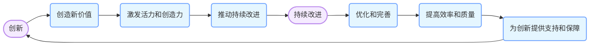

# 创新与持续改进

> 关键词：创新、持续改进、技术发展、企业竞争力、创新方法、改进策略、未来趋势

> 摘要：本文深入探讨了创新与持续改进在 IT 领域及企业发展中的重要性。首先介绍了创新与持续改进的背景，包括目的、预期读者等内容。接着阐述了核心概念及其联系，通过文本示意图和 Mermaid 流程图进行清晰展示。详细讲解了核心算法原理与具体操作步骤，运用 Python 代码进行说明。同时给出了相关数学模型和公式，并举例说明。通过项目实战案例，详细解释了代码实现和解读。分析了实际应用场景，推荐了学习资源、开发工具框架以及相关论文著作。最后总结了未来发展趋势与挑战，还包含常见问题解答和扩展阅读参考资料，旨在为读者全面呈现创新与持续改进的理论与实践内容，助力其在技术和企业发展中实现创新与持续进步。

## 1. 背景介绍 
### 1.1 目的和范围
在当今快速发展的信息时代，技术革新日新月异，企业面临着前所未有的竞争压力。创新与持续改进成为企业生存和发展的关键要素。本文的目的在于全面阐述创新与持续改进的相关理论、方法和实践，涵盖了从概念理解到实际应用的各个方面，旨在为企业管理者、技术人员、科研工作者等提供一套系统的指导，帮助他们更好地理解和实施创新与持续改进策略，以提升企业的竞争力和适应市场变化的能力。

### 1.2 预期读者
本文的预期读者包括但不限于以下几类人群：
- **企业管理者**：希望通过创新与持续改进提升企业绩效、推动企业发展的中高层管理人员。
- **技术人员**：从事软件开发、人工智能、大数据等领域的工程师和技术专家，希望在工作中不断创新和优化技术方案。
- **科研工作者**：关注技术创新和行业发展趋势的研究人员，希望从理论和实践的角度深入探索创新与持续改进的方法。
- **创业者**：正在创业或准备创业的人士，希望借鉴创新与持续改进的理念和方法，打造具有竞争力的创业项目。

### 1.3 文档结构概述
本文将按照以下结构进行阐述：
- **核心概念与联系**：介绍创新与持续改进的基本概念、原理和它们之间的联系，通过文本示意图和 Mermaid 流程图进行直观展示。
- **核心算法原理 & 具体操作步骤**：讲解与创新和持续改进相关的核心算法原理，并通过 Python 代码详细说明具体操作步骤。
- **数学模型和公式 & 详细讲解 & 举例说明**：给出相关的数学模型和公式，详细讲解其含义和应用，并通过实际例子进行说明。
- **项目实战：代码实际案例和详细解释说明**：通过具体的项目实战案例，介绍开发环境搭建、源代码实现和代码解读，帮助读者更好地理解和应用创新与持续改进的方法。
- **实际应用场景**：分析创新与持续改进在不同领域的实际应用场景，展示其在实际工作中的重要性和价值。
- **工具和资源推荐**：推荐相关的学习资源、开发工具框架和论文著作，帮助读者进一步深入学习和研究。
- **总结：未来发展趋势与挑战**：总结创新与持续改进的未来发展趋势和面临的挑战，为读者提供前瞻性的思考。
- **附录：常见问题与解答**：解答读者在学习和实践过程中可能遇到的常见问题。
- **扩展阅读 & 参考资料**：提供相关的扩展阅读材料和参考资料，方便读者进一步深入学习。

### 1.4 术语表
#### 1.4.1 核心术语定义
- **创新**：指引入新的思想、方法、产品、服务或商业模式，以创造新的价值或改善现有状况的过程。
- **持续改进**：指不断地对产品、过程或服务进行优化和完善，以提高其质量、效率和竞争力的过程。
- **技术创新**：指在技术领域引入新的知识、技术或工艺，以推动技术进步和产业升级的过程。
- **管理创新**：指在管理领域引入新的理念、方法或制度，以提高组织的管理效率和绩效的过程。

#### 1.4.2 相关概念解释
- **创新文化**：指企业或组织中鼓励创新、支持创新和容忍失败的文化氛围。
- **创新生态系统**：指由企业、高校、科研机构、政府等多种主体组成的，相互协作、相互促进的创新环境。
- **持续改进循环**：指一种不断循环的过程，包括计划、执行、检查和处理四个阶段，通过不断地循环来实现持续改进。

#### 1.4.3 缩略词列表
- **PDCA**：Plan-Do-Check-Act，即计划、执行、检查、处理，是持续改进循环的基本模型。
- **R&D**：Research and Development，即研究与开发，是创新过程中的重要环节。

## 2. 核心概念与联系 

### 2.1 创新的概念与原理
创新是一个复杂的过程，它涉及到多个方面的因素。从本质上讲，创新是对现有知识、技术和方法的突破和超越，旨在创造新的价值。创新可以分为多个层次，包括产品创新、技术创新、管理创新和商业模式创新等。

产品创新是指开发新的产品或对现有产品进行改进，以满足客户的需求和市场的变化。技术创新是指在技术领域引入新的知识、技术或工艺，以提高生产效率和产品质量。管理创新是指在管理领域引入新的理念、方法或制度，以提高组织的管理效率和绩效。商业模式创新是指对企业的商业模式进行重新设计和优化，以创造新的商业价值。

### 2.2 持续改进的概念与原理
持续改进是一种不断追求卓越的理念和方法。它强调通过不断地对产品、过程或服务进行优化和完善，以提高其质量、效率和竞争力。持续改进的核心是不断地发现问题、分析问题和解决问题，通过持续的循环来实现不断的进步。

持续改进通常采用 PDCA 循环模型，即计划（Plan）、执行（Do）、检查（Check）和处理（Act）四个阶段。在计划阶段，需要明确改进的目标和计划；在执行阶段，需要按照计划进行实施；在检查阶段，需要对实施的结果进行检查和评估；在处理阶段，需要根据检查的结果进行总结和改进，将成功的经验纳入标准，将未解决的问题转入下一个循环。

### 2.3 创新与持续改进的联系
创新与持续改进是相辅相成、相互促进的关系。创新是持续改进的动力和源泉，它为持续改进提供了新的思路和方法；持续改进是创新的基础和保障，它为创新提供了稳定的环境和条件。

一方面，创新可以推动持续改进的进程。通过引入新的思想、方法、产品或服务，可以打破现有的思维定式和工作模式，激发组织的活力和创造力，从而推动持续改进的深入开展。另一方面，持续改进可以为创新提供支持和保障。通过不断地优化和完善产品、过程或服务，可以提高组织的效率和质量，降低成本和风险，为创新提供更好的基础和条件。

### 2.4 文本示意图
创新与持续改进的关系可以用以下文本示意图表示：

创新 --> 创造新价值 --> 激发活力和创造力 --> 推动持续改进
持续改进 --> 优化和完善 --> 提高效率和质量 --> 为创新提供支持和保障

### 2.5 Mermaid 流程图


## 3. 核心算法原理 & 具体操作步骤 

### 3.1 创新算法原理
创新过程中涉及到多个算法和方法，其中一个重要的算法是头脑风暴算法。头脑风暴算法是一种激发创造力和创新思维的方法，它通过组织一群人在一起自由地提出各种想法和建议，以寻找解决问题的新方法和新思路。

头脑风暴算法的基本原理是鼓励参与者自由地表达自己的想法，不受任何限制和批评。在头脑风暴过程中，参与者可以提出各种看似不合理或荒谬的想法，这些想法可能会激发其他人的灵感，从而产生更多的创新想法。

### 3.2 持续改进算法原理
持续改进过程中常用的算法是 PDCA 循环算法。PDCA 循环算法是一种不断循环的过程，它包括计划、执行、检查和处理四个阶段。通过不断地循环，PDCA 算法可以实现对产品、过程或服务的持续优化和完善。

### 3.3 Python 代码实现头脑风暴算法
```python
import random

# 定义问题描述
problem_description = "如何提高公司的销售额？"

# 定义参与者列表
participants = ["Alice", "Bob", "Charlie", "David"]

# 定义头脑风暴函数
def brainstorming(problem, participants, num_ideas=10):
    ideas = []
    for _ in range(num_ideas):
        participant = random.choice(participants)
        idea = input(f"{participant}, 请针对问题 '{problem}' 提出一个想法：")
        ideas.append(idea)
    return ideas

# 执行头脑风暴
result_ideas = brainstorming(problem_description, participants)

# 输出结果
print("头脑风暴产生的想法：")
for i, idea in enumerate(result_ideas, 1):
    print(f"{i}. {idea}")
```

### 3.4 Python 代码实现 PDCA 循环算法
```python
# 定义 PDCA 循环类
class PDCA:
    def __init__(self, goal):
        self.goal = goal
        self.plan = None
        self.do_result = None
        self.check_result = None

    # 计划阶段
    def plan_stage(self):
        self.plan = input(f"请针对目标 '{self.goal}' 制定一个计划：")
        print(f"计划：{self.plan}")

    # 执行阶段
    def do_stage(self):
        self.do_result = input(f"请按照计划 '{self.plan}' 执行，并输入执行结果：")
        print(f"执行结果：{self.do_result}")

    # 检查阶段
    def check_stage(self):
        self.check_result = input(f"请检查执行结果 '{self.do_result}' 是否达到目标 '{self.goal}'，并输入检查结果：")
        print(f"检查结果：{self.check_result}")

    # 处理阶段
    def act_stage(self):
        if self.check_result == "达到目标":
            print("目标已达成，将成功经验纳入标准。")
        else:
            print("目标未达成，将未解决的问题转入下一个循环。")

    # 执行 PDCA 循环
    def execute_pdca(self):
        self.plan_stage()
        self.do_stage()
        self.check_stage()
        self.act_stage()

# 示例使用
goal = "提高产品质量"
pdca_cycle = PDCA(goal)
pdca_cycle.execute_pdca()
```

### 3.5 具体操作步骤
#### 3.5.1 头脑风暴算法操作步骤
1. **确定问题**：明确需要解决的问题或需要创新的领域。
2. **组织参与者**：邀请相关领域的专家、员工或其他利益相关者参与头脑风暴。
3. **进行头脑风暴**：鼓励参与者自由地提出各种想法和建议，不进行批评和评价。
4. **记录想法**：将参与者提出的想法记录下来，以便后续分析和筛选。
5. **筛选和评估想法**：对记录的想法进行筛选和评估，选择有价值的想法进行进一步的研究和开发。

#### 3.5.2 PDCA 循环算法操作步骤
1. **计划阶段**：明确改进的目标和计划，包括具体的措施、责任人、时间节点等。
2. **执行阶段**：按照计划进行实施，确保各项措施得到有效执行。
3. **检查阶段**：对实施的结果进行检查和评估，比较实际结果与目标的差距。
4. **处理阶段**：根据检查的结果进行总结和改进，将成功的经验纳入标准，将未解决的问题转入下一个循环。

## 4. 数学模型和公式 & 详细讲解 & 举例说明 

### 4.1 创新效果评估数学模型
创新效果评估是衡量创新活动成效的重要手段。一种常用的创新效果评估数学模型是基于层次分析法（AHP）和模糊综合评价法的模型。

#### 4.1.1 层次分析法（AHP）
层次分析法是一种将复杂问题分解为多个层次，通过比较各层次元素之间的相对重要性，确定各元素权重的方法。其基本步骤如下：
1. **建立层次结构模型**：将问题分解为目标层、准则层和方案层。
2. **构造判断矩阵**：对同一层次的元素进行两两比较，确定它们之间的相对重要性，构造判断矩阵。
3. **计算权重**：通过求解判断矩阵的特征值和特征向量，得到各元素的权重。
4. **一致性检验**：检验判断矩阵的一致性，确保权重的合理性。

#### 4.1.2 模糊综合评价法
模糊综合评价法是一种基于模糊数学的综合评价方法，它通过对多个因素进行综合评价，得到一个综合评价结果。其基本步骤如下：
1. **确定评价因素集**：确定影响创新效果的因素集合。
2. **确定评语集**：确定评价创新效果的评语集合，如“好”、“较好”、“一般”、“较差”、“差”等。
3. **确定权重向量**：通过层次分析法确定各评价因素的权重向量。
4. **构造模糊关系矩阵**：对每个评价因素进行单因素评价，得到模糊关系矩阵。
5. **进行模糊综合评价**：将权重向量与模糊关系矩阵进行合成运算，得到综合评价结果。

### 4.2 数学公式
#### 4.2.1 层次分析法判断矩阵
设判断矩阵为 $A=(a_{ij})_{n\times n}$，其中 $a_{ij}$ 表示元素 $i$ 与元素 $j$ 的相对重要性，满足 $a_{ij}=\frac{1}{a_{ji}}$，$a_{ii}=1$。

#### 4.2.2 层次分析法权重计算
通过求解判断矩阵 $A$ 的特征方程 $\vert A-\lambda I\vert=0$，得到最大特征值 $\lambda_{max}$ 和对应的特征向量 $W=(w_1,w_2,\cdots,w_n)^T$，其中 $w_i$ 为元素 $i$ 的权重。

#### 4.2.3 一致性检验指标
一致性指标 $CI=\frac{\lambda_{max}-n}{n-1}$，其中 $n$ 为判断矩阵的阶数。

随机一致性指标 $RI$ 可通过查表得到，不同阶数的 $RI$ 值如下：
| 阶数 $n$ | 1 | 2 | 3 | 4 | 5 | 6 | 7 | 8 | 9 |
| --- | --- | --- | --- | --- | --- | --- | --- | --- | --- |
| $RI$ | 0 | 0 | 0.58 | 0.90 | 1.12 | 1.24 | 1.32 | 1.41 | 1.45 |

一致性比率 $CR=\frac{CI}{RI}$，当 $CR\lt0.1$ 时，认为判断矩阵具有满意的一致性。

#### 4.2.4 模糊综合评价法合成运算
设权重向量为 $W=(w_1,w_2,\cdots,w_n)$，模糊关系矩阵为 $R=(r_{ij})_{n\times m}$，则综合评价结果 $B=W\circ R$，其中 $\circ$ 表示合成运算，常用的合成运算有最大 - 最小合成法和加权平均合成法。

### 4.3 举例说明
假设我们要评估一个创新项目的效果，评价因素集 $U=\{技术创新性, 市场竞争力, 经济效益\}$，评语集 $V=\{好, 较好, 一般, 较差, 差\}$。

#### 4.3.1 层次分析法确定权重
通过专家打分，构造判断矩阵 $A$ 如下：
$$
A = 
\begin{bmatrix}
1 & 3 & 5 \\
\frac{1}{3} & 1 & 3 \\
\frac{1}{5} & \frac{1}{3} & 1
\end{bmatrix}
$$
求解特征方程 $\vert A-\lambda I\vert=0$，得到最大特征值 $\lambda_{max}=3.0385$，对应的特征向量 $W=(0.637, 0.258, 0.105)^T$。

计算一致性指标 $CI=\frac{3.0385 - 3}{3 - 1}=0.0192$，随机一致性指标 $RI=0.58$，一致性比率 $CR=\frac{0.0192}{0.58}=0.0331\lt0.1$，判断矩阵具有满意的一致性，所以权重向量 $W=(0.637, 0.258, 0.105)$