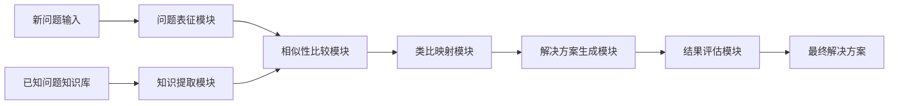

# 创新问题解决中神经类比推理的效果研究

> 关键词：创新问题解决、神经类比推理、认知机制、效果评估、脑科学

> 摘要：本文聚焦于创新问题解决中神经类比推理的效果研究。通过对神经类比推理的核心概念、算法原理、数学模型等方面进行深入剖析，结合项目实战案例和实际应用场景分析，探讨其在创新问题解决中的作用和效果。同时，推荐了相关的学习资源、开发工具和研究论文，总结了未来发展趋势与挑战，并提供常见问题解答和扩展阅读资料，旨在为该领域的研究和实践提供全面而深入的参考。

## 1. 背景介绍 
### 1.1 目的和范围
本研究旨在深入探究神经类比推理在创新问题解决过程中的效果。创新问题解决是各个领域不断进步和发展的关键环节，而神经类比推理作为一种基于大脑认知机制的推理方式，可能为创新问题的解决提供新的思路和方法。研究范围涵盖神经类比推理的基本原理、相关算法、在实际创新问题中的应用，以及对其效果的评估和分析。

### 1.2 预期读者
本文预期读者包括计算机科学、认知科学、心理学等领域的研究人员，对创新方法和人工智能技术感兴趣的开发者，以及关注创新问题解决的企业管理人员和创业者。

### 1.3 文档结构概述
本文首先介绍神经类比推理的核心概念和相关联系，包括其原理和架构的示意图与流程图。接着阐述核心算法原理和具体操作步骤，并使用 Python 源代码进行详细说明。然后介绍相关的数学模型和公式，并通过举例进行讲解。之后通过项目实战案例展示神经类比推理在实际中的应用，包括开发环境搭建、源代码实现和代码解读。再分析神经类比推理的实际应用场景，推荐相关的工具和资源。最后总结未来发展趋势与挑战，提供常见问题解答和扩展阅读资料。

### 1.4 术语表
#### 1.4.1 核心术语定义
- **创新问题解决**：指在面对具有新颖性和挑战性的问题时，通过创造性的思维和方法找到有效的解决方案的过程。
- **神经类比推理**：基于大脑神经系统的类比思维机制，通过将已知领域的知识和经验类比到未知领域，从而实现推理和问题解决的方法。
- **认知机制**：大脑处理信息、产生认知和行为的内在过程和方式。
- **类比映射**：在类比推理中，将源领域的结构和关系映射到目标领域的过程。

#### 1.4.2 相关概念解释
- **大脑神经网络**：由大量神经元相互连接形成的复杂网络，是大脑信息处理和认知功能的基础。
- **知识表征**：将知识以某种形式存储和表示在大脑或计算机系统中的方式。
- **启发式搜索**：在问题解决过程中，利用启发式信息来引导搜索方向，提高搜索效率的方法。

#### 1.4.3 缩略词列表
- **AI**：Artificial Intelligence，人工智能
- **ML**：Machine Learning，机器学习
- **DL**：Deep Learning，深度学习

## 2. 核心概念与联系 

### 核心概念原理
神经类比推理的核心原理基于大脑的类比思维机制。类比思维是人类认知的一种重要方式，当人们遇到一个新问题时，会自动地在记忆中搜索与之相似的已知问题，并将已知问题的解决方案或相关知识迁移到新问题上。在神经层面，这种类比过程涉及多个脑区的协同工作，包括前额叶皮层、颞叶皮层等。

前额叶皮层负责高级认知功能，如问题表征、策略制定和推理。颞叶皮层则与语义记忆和知识存储有关。当进行类比推理时，前额叶皮层会从颞叶皮层中提取相关的知识和经验，对新问题和已知问题进行表征和比较，找到它们之间的相似性，然后进行类比映射，将已知问题的解决方案应用到新问题上。

### 架构的文本示意图
```plaintext
+-----------------+          +-----------------+
| 新问题输入      |          | 已知问题知识库  |
+-----------------+          +-----------------+
         |                          |
         v                          v
+-----------------+          +-----------------+
| 问题表征模块    |          | 知识提取模块    |
+-----------------+          +-----------------+
         |                          |
         v                          v
+-----------------+          +-----------------+
| 相似性比较模块  |          | 类比映射模块    |
+-----------------+          +-----------------+
         |                          |
         v                          v
+-----------------+          +-----------------+
| 解决方案生成模块|          | 结果评估模块    |
+-----------------+          +-----------------+
         |
         v
+-----------------+
| 最终解决方案    |
+-----------------+
```

### Mermaid 流程图


## 3. 核心算法原理 & 具体操作步骤 

### 算法原理
神经类比推理的核心算法主要包括以下几个步骤：
1. **问题表征**：将新问题和已知问题用合适的特征向量或图结构进行表示，以便后续的比较和处理。
2. **相似性计算**：计算新问题和已知问题之间的相似性，常用的相似性度量方法包括余弦相似度、欧氏距离等。
3. **类比映射**：根据相似性计算的结果，选择最相似的已知问题，并将其结构和关系映射到新问题上。
4. **解决方案生成**：根据类比映射的结果，生成新问题的解决方案。
5. **结果评估**：对生成的解决方案进行评估，判断其有效性和可行性。

### Python 源代码实现

```python
import numpy as np

# 问题表征：假设问题用特征向量表示
def problem_representation(problem):
    # 简单示例：将问题转换为一维向量
    return np.array(problem).flatten()

# 相似性计算：使用余弦相似度
def cosine_similarity(vec1, vec2):
    dot_product = np.dot(vec1, vec2)
    norm_vec1 = np.linalg.norm(vec1)
    norm_vec2 = np.linalg.norm(vec2)
    if norm_vec1 == 0 or norm_vec2 == 0:
        return 0
    return dot_product / (norm_vec1 * norm_vec2)

# 类比映射：选择最相似的已知问题
def analogy_mapping(new_problem, known_problems):
    new_vec = problem_representation(new_problem)
    similarities = []
    for problem in known_problems:
        known_vec = problem_representation(problem)
        similarity = cosine_similarity(new_vec, known_vec)
        similarities.append(similarity)
    most_similar_index = np.argmax(similarities)
    return most_similar_index

# 解决方案生成：简单假设已知问题的解决方案直接应用
def solution_generation(new_problem, known_problems, solutions):
    most_similar_index = analogy_mapping(new_problem, known_problems)
    return solutions[most_similar_index]

# 结果评估：简单示例，假设评估函数是根据某种标准判断解决方案是否有效
def result_evaluation(solution):
    # 这里只是简单示例，实际中需要根据具体问题设计评估函数
    if len(solution) > 0:
        return True
    return False

# 示例使用
new_problem = [[1, 2, 3], [4, 5, 6]]
known_problems = [[[7, 8, 9], [10, 11, 12]], [[13, 14, 15], [16, 17, 18]]]
solutions = ["Solution 1", "Solution 2"]

generated_solution = solution_generation(new_problem, known_problems, solutions)
evaluation_result = result_evaluation(generated_solution)

print("Generated Solution:", generated_solution)
print("Evaluation Result:", evaluation_result)
```

### 具体操作步骤
1. **数据准备**：收集已知问题及其对应的解决方案，构建已知问题知识库。
2. **问题输入**：将新问题输入到系统中。
3. **问题表征**：使用 `problem_representation` 函数将新问题和已知问题进行表征。
4. **相似性计算**：使用 `cosine_similarity` 函数计算新问题和已知问题之间的相似性。
5. **类比映射**：使用 `analogy_mapping` 函数选择最相似的已知问题。
6. **解决方案生成**：使用 `solution_generation` 函数根据类比映射的结果生成新问题的解决方案。
7. **结果评估**：使用 `result_evaluation` 函数对生成的解决方案进行评估。

## 4. 数学模型和公式 & 详细讲解 & 举例说明 

### 数学模型
神经类比推理的数学模型主要涉及相似性度量和类比映射。相似性度量用于衡量新问题和已知问题之间的相似程度，类比映射则用于将已知问题的结构和关系迁移到新问题上。

### 相似性度量公式
常用的相似性度量方法之一是余弦相似度，其公式为：

$$
\text{Cosine Similarity}(\vec{A}, \vec{B}) = \frac{\vec{A} \cdot \vec{B}}{\|\vec{A}\| \|\vec{B}\|}
$$

其中，$\vec{A}$ 和 $\vec{B}$ 分别是两个问题的特征向量，$\vec{A} \cdot \vec{B}$ 是向量的点积，$\|\vec{A}\|$ 和 $\|\vec{B}\|$ 分别是向量的模。

### 详细讲解
余弦相似度的取值范围在 $[-1, 1]$ 之间，值越接近 1 表示两个向量越相似，值越接近 -1 表示两个向量越不相似。在神经类比推理中，我们通过计算新问题和已知问题的特征向量之间的余弦相似度，来找到最相似的已知问题。

### 举例说明
假设我们有两个问题的特征向量 $\vec{A} = [1, 2, 3]$ 和 $\vec{B} = [4, 5, 6]$，则它们的余弦相似度计算如下：

$$
\vec{A} \cdot \vec{B} = 1 \times 4 + 2 \times 5 + 3 \times 6 = 4 + 10 + 18 = 32
$$

$$
\|\vec{A}\| = \sqrt{1^2 + 2^2 + 3^2} = \sqrt{1 + 4 + 9} = \sqrt{14}
$$

$$
\|\vec{B}\| = \sqrt{4^2 + 5^2 + 6^2} = \sqrt{16 + 25 + 36} = \sqrt{77}
$$

$$
\text{Cosine Similarity}(\vec{A}, \vec{B}) = \frac{32}{\sqrt{14} \sqrt{77}} \approx 0.974
$$

这表明 $\vec{A}$ 和 $\vec{B}$ 非常相似。

## 5. 项目实战：代码实际案例和详细解释说明 

### 5.1  开发环境搭建
本项目使用 Python 进行开发，需要安装以下库：
- `numpy`：用于数值计算。
可以使用以下命令安装所需库：
```sh
pip install numpy
```

### 5.2  源代码详细实现和代码解读
以下是完整的代码实现：

```python
import numpy as np

# 问题表征：假设问题用特征向量表示
def problem_representation(problem):
    # 简单示例：将问题转换为一维向量
    return np.array(problem).flatten()

# 相似性计算：使用余弦相似度
def cosine_similarity(vec1, vec2):
    dot_product = np.dot(vec1, vec2)
    norm_vec1 = np.linalg.norm(vec1)
    norm_vec2 = np.linalg.norm(vec2)
    if norm_vec1 == 0 or norm_vec2 == 0:
        return 0
    return dot_product / (norm_vec1 * norm_vec2)

# 类比映射：选择最相似的已知问题
def analogy_mapping(new_problem, known_problems):
    new_vec = problem_representation(new_problem)
    similarities = []
    for problem in known_problems:
        known_vec = problem_representation(problem)
        similarity = cosine_similarity(new_vec, known_vec)
        similarities.append(similarity)
    most_similar_index = np.argmax(similarities)
    return most_similar_index

# 解决方案生成：简单假设已知问题的解决方案直接应用
def solution_generation(new_problem, known_problems, solutions):
    most_similar_index = analogy_mapping(new_problem, known_problems)
    return solutions[most_similar_index]

# 结果评估：简单示例，假设评估函数是根据某种标准判断解决方案是否有效
def result_evaluation(solution):
    # 这里只是简单示例，实际中需要根据具体问题设计评估函数
    if len(solution) > 0:
        return True
    return False

# 示例使用
new_problem = [[1, 2, 3], [4, 5, 6]]
known_problems = [[[7, 8, 9], [10, 11, 12]], [[13, 14, 15], [16, 17, 18]]]
solutions = ["Solution 1", "Solution 2"]

generated_solution = solution_generation(new_problem, known_problems, solutions)
evaluation_result = result_evaluation(generated_solution)

print("Generated Solution:", generated_solution)
print("Evaluation Result:", evaluation_result)
```

### 代码解读
1. **`problem_representation` 函数**：将问题转换为一维向量，方便后续的相似性计算。
2. **`cosine_similarity` 函数**：计算两个向量之间的余弦相似度。
3. **`analogy_mapping` 函数**：遍历已知问题，计算新问题和每个已知问题的相似性，选择最相似的已知问题的索引。
4. **`solution_generation` 函数**：根据类比映射的结果，选择最相似已知问题的解决方案作为新问题的解决方案。
5. **`result_evaluation` 函数**：对生成的解决方案进行评估，这里只是简单判断解决方案的长度是否大于 0。
6. **示例使用部分**：定义新问题、已知问题和对应的解决方案，调用上述函数生成解决方案并进行评估，最后输出结果。

### 5.3  代码解读与分析
这个代码示例实现了一个简单的神经类比推理系统。优点是代码简单易懂，基本实现了神经类比推理的核心步骤。缺点是问题表征和解决方案生成比较简单，实际应用中可能需要更复杂的方法。例如，问题表征可以使用更高级的特征提取方法，解决方案生成可以根据类比映射的结果进行适当的调整和优化。

## 6. 实际应用场景 
### 科学研究
在科学研究中，神经类比推理可以帮助科学家从已知的科学理论和实验结果中类比出解决新问题的思路。例如，在物理学中，科学家可以将经典力学中的原理类比到量子力学中，从而提出新的理论和模型。

### 工程设计
在工程设计领域，设计师可以利用神经类比推理从已有的成功设计案例中获取灵感，解决新的设计问题。比如，在建筑设计中，设计师可以将传统建筑的结构和功能类比到现代建筑中，创造出新颖而实用的建筑作品。

### 创新教育
在教育领域，神经类比推理可以作为一种创新教学方法，培养学生的创造性思维和问题解决能力。教师可以引导学生通过类比已知的知识和问题，解决新的学习问题，提高学生的学习效果和创新能力。

### 商业决策
在商业领域，企业管理者可以运用神经类比推理分析市场趋势和竞争对手的策略，制定创新的商业决策。例如，通过类比其他行业的成功商业模式，开拓新的市场机会。

## 7. 工具和资源推荐
### 7.1 学习资源推荐
#### 7.1.1 书籍推荐
- 《思考，快与慢》：作者丹尼尔·卡尼曼，介绍了人类思维的两种模式，包括类比思维等认知机制，对理解神经类比推理的基础有很大帮助。
- 《人工智能：一种现代的方法》：全面介绍了人工智能的各个领域，包括类比推理等相关内容，是人工智能领域的经典教材。

#### 7.1.2 在线课程
- Coursera 上的“人工智能基础”课程：涵盖了人工智能的基本概念和方法，包括类比推理的相关知识。
- edX 上的“认知科学导论”课程：从认知科学的角度介绍了人类的思维和推理机制，对理解神经类比推理有重要意义。

#### 7.1.3 技术博客和网站
- Medium 上的人工智能相关博客：有很多关于类比推理和创新问题解决的文章和案例分享。
- AI 研习社：提供了丰富的人工智能技术文章和视频教程，包括神经类比推理的研究进展。

### 7.2 开发工具框架推荐
#### 7.2.1 IDE和编辑器
- PyCharm：功能强大的 Python 集成开发环境，适合开发基于 Python 的神经类比推理项目。
- Jupyter Notebook：交互式的开发环境，方便进行代码调试和结果展示，适合进行算法实验和研究。

#### 7.2.2 调试和性能分析工具
- PySnooper：可以自动记录 Python 代码的执行过程，方便调试和查找问题。
- cProfile：Python 自带的性能分析工具，可以分析代码的运行时间和函数调用情况，帮助优化代码性能。

#### 7.2.3 相关框架和库
- NumPy：用于数值计算，在神经类比推理中可以用于向量和矩阵的运算。
- SciPy：提供了丰富的科学计算工具，包括相似性度量等函数。

### 7.3 相关论文著作推荐
#### 7.3.1 经典论文
- “Analogical Mapping by Constraint Satisfaction”：提出了基于约束满足的类比映射方法，是类比推理领域的经典论文。
- “Structure - Mapping: A Theoretical Framework for Analogy”：介绍了结构映射理论，为类比推理的研究提供了重要的理论基础。

#### 7.3.2 最新研究成果
- 关注顶级学术会议如 NeurIPS、ICML 等上关于类比推理和创新问题解决的最新研究论文，了解该领域的前沿动态。

#### 7.3.3 应用案例分析
- 一些行业报告和研究论文会分析神经类比推理在不同领域的应用案例，可以从中学习实际应用中的经验和方法。

## 8. 总结：未来发展趋势与挑战
### 未来发展趋势
- **与深度学习的融合**：将神经类比推理与深度学习技术相结合，利用深度学习强大的特征提取和表示能力，提高类比推理的准确性和效率。
- **跨领域应用拓展**：神经类比推理将在更多领域得到应用，如医疗、金融、艺术等，为不同领域的创新问题解决提供支持。
- **认知计算的发展**：随着认知计算的发展，神经类比推理将作为认知计算的重要组成部分，模拟人类的认知过程，实现更加智能的问题解决。

### 挑战
- **知识表征和获取**：如何有效地对知识进行表征和获取，以便在类比推理中更好地利用知识，是一个亟待解决的问题。
- **类比映射的准确性**：在复杂的问题场景中，如何提高类比映射的准确性，避免错误的类比，是神经类比推理面临的挑战之一。
- **计算资源和效率**：随着问题规模的增大，神经类比推理的计算复杂度也会增加，如何在有限的计算资源下提高推理效率是一个重要挑战。

## 9. 附录：常见问题与解答
### 问题 1：神经类比推理和传统类比推理有什么区别？
神经类比推理是基于大脑神经系统的类比思维机制，强调从神经层面理解类比推理的过程。而传统类比推理更侧重于逻辑和符号层面的处理。神经类比推理可以更好地模拟人类的类比思维过程，具有更强的灵活性和适应性。

### 问题 2：如何提高神经类比推理的效果？
可以从以下几个方面提高神经类比推理的效果：
- 优化问题表征方法，使用更合适的特征向量或图结构来表示问题。
- 改进相似性度量方法，选择更适合问题场景的相似性度量函数。
- 增加已知问题知识库的规模和质量，提供更多的类比资源。
- 对类比映射结果进行适当的调整和优化，结合其他推理方法提高解决方案的质量。

### 问题 3：神经类比推理在实际应用中有哪些局限性？
神经类比推理在实际应用中的局限性包括：
- 依赖于已知问题知识库，如果知识库不完善，可能无法找到合适的类比。
- 类比映射的准确性受问题表征和相似性度量的影响，在复杂问题场景中可能出现错误的类比。
- 计算复杂度较高，在处理大规模问题时效率较低。

## 10. 扩展阅读 & 参考资料
- [《认知心理学》](https://book.douban.com/subject/1056775/)
- [NeurIPS 会议官网](https://neurips.cc/)
- [ICML 会议官网](https://icml.cc/)

作者：AI天才研究院/AI Genius Institute & 禅与计算机程序设计艺术 /Zen And The Art of Computer Programming