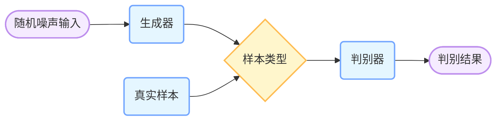

# 创造性推理中对抗生成网络的潜力探索

> 关键词：创造性推理、对抗生成网络、潜力探索、人工智能、生成模型

> 摘要：本文聚焦于创造性推理中对抗生成网络（GAN）的潜力探索。首先介绍了研究的背景、目的、预期读者和文档结构等信息。接着详细阐述了对抗生成网络的核心概念与联系，包括其原理和架构，并以示意图和流程图呈现。然后深入讲解了核心算法原理，结合Python代码进行具体操作步骤的说明。通过数学模型和公式进一步剖析GAN的工作机制，并举例说明。在项目实战部分，给出了开发环境搭建、源代码实现和解读。探讨了GAN在不同实际应用场景中的表现，推荐了相关的学习资源、开发工具框架和论文著作。最后总结了GAN在创造性推理领域的未来发展趋势与挑战，解答了常见问题并提供扩展阅读和参考资料。

## 1. 背景介绍 
### 1.1 目的和范围
随着人工智能技术的不断发展，创造性推理成为了研究的热点之一。对抗生成网络（Generative Adversarial Networks，GAN）作为一种强大的生成模型，在图像生成、文本生成等多个领域取得了显著的成果。本研究的目的在于深入探索GAN在创造性推理中的潜力，分析其工作原理、应用场景以及未来发展方向。范围涵盖了GAN的基本概念、核心算法、数学模型、实际应用案例等方面。

### 1.2 预期读者
本文预期读者包括人工智能领域的研究人员、开发者、学生以及对创造性推理和对抗生成网络感兴趣的技术爱好者。对于有一定编程基础和机器学习知识的读者，能够更深入地理解文中的算法原理和代码实现；而对于初学者，也可以通过本文了解GAN的基本概念和应用场景。

### 1.3 文档结构概述
本文将按照以下结构进行阐述：首先介绍对抗生成网络的背景信息，包括目的、预期读者和文档结构等。接着详细讲解GAN的核心概念与联系，通过文本示意图和Mermaid流程图展示其架构。然后深入分析核心算法原理，结合Python代码说明具体操作步骤。利用数学模型和公式进一步解释GAN的工作机制，并举例说明。在项目实战部分，给出开发环境搭建、源代码实现和解读。探讨GAN在实际应用场景中的表现，推荐相关的学习资源、开发工具框架和论文著作。最后总结GAN在创造性推理领域的未来发展趋势与挑战，解答常见问题并提供扩展阅读和参考资料。

### 1.4 术语表
#### 1.4.1 核心术语定义
- **对抗生成网络（GAN）**：由生成器（Generator）和判别器（Discriminator）组成的深度学习模型，通过二者的对抗训练来学习数据的分布并生成新的数据样本。
- **生成器**：负责接收随机噪声作为输入，生成与真实数据相似的样本。
- **判别器**：负责判断输入的样本是真实数据还是生成器生成的假数据。
- **创造性推理**：指利用已有知识和信息，通过创新的方式生成新的想法、解决方案或数据的过程。

#### 1.4.2 相关概念解释
- **生成模型**：一类能够学习数据分布并生成新样本的模型，GAN是生成模型的一种。
- **对抗训练**：生成器和判别器在训练过程中相互博弈，生成器试图生成更逼真的样本以欺骗判别器，判别器则试图更准确地区分真实样本和生成样本。

#### 1.4.3 缩略词列表
- **GAN**：Generative Adversarial Networks（对抗生成网络）
- **CNN**：Convolutional Neural Network（卷积神经网络）
- **MLP**：Multi-Layer Perceptron（多层感知机）

## 2. 核心概念与联系 

### 核心概念原理
对抗生成网络（GAN）的核心思想是通过两个神经网络——生成器（Generator）和判别器（Discriminator）的对抗训练来学习数据的分布。生成器接收随机噪声作为输入，尝试生成与真实数据相似的样本；判别器则接收真实数据和生成器生成的假数据作为输入，判断其是真实数据还是假数据。在训练过程中，生成器和判别器相互博弈，生成器不断提高生成样本的质量以欺骗判别器，判别器则不断提高判别能力以区分真实样本和生成样本。最终，当生成器生成的样本能够以假乱真，判别器无法准确区分时，GAN达到了一种平衡状态，此时生成器就学会了真实数据的分布，可以生成高质量的新样本。

### 架构的文本示意图
```plaintext
                     +-----------------+
                     | 随机噪声输入     |
                     +-----------------+
                            |
                            v
                     +-----------------+
                     | 生成器 (Generator) |
                     +-----------------+
                            |
                            v
          +-----------------+-----------------+
          | 生成的假样本                   | 真实样本       |
          +-----------------+-----------------+
                            |
                            v
                     +-----------------+
                     | 判别器 (Discriminator) |
                     +-----------------+
                            |
                            v
                     +-----------------+
                     | 判别结果 (真/假) |
                     +-----------------+
```

### Mermaid 流程图


## 3. 核心算法原理 & 具体操作步骤 

### 核心算法原理
GAN的核心算法是基于博弈论中的极小极大博弈。生成器和判别器的目标可以用以下公式表示：

- 判别器的目标是最大化正确判别的概率，即：
$$
\max_D \mathbb{E}_{x \sim p_{data}(x)}[\log D(x)] + \mathbb{E}_{z \sim p_z(z)}[\log (1 - D(G(z)))]
$$
其中，$x$ 是真实数据，$p_{data}(x)$ 是真实数据的分布，$z$ 是随机噪声，$p_z(z)$ 是随机噪声的分布，$G(z)$ 是生成器根据随机噪声 $z$ 生成的样本，$D(x)$ 是判别器对真实样本 $x$ 的判别结果，$D(G(z))$ 是判别器对生成样本 $G(z)$ 的判别结果。

- 生成器的目标是最小化判别器正确判别的概率，即：
$$
\min_G \mathbb{E}_{z \sim p_z(z)}[\log (1 - D(G(z)))]
$$

### 具体操作步骤及Python代码实现
以下是一个简单的GAN实现示例，使用Python和PyTorch库：

```python
import torch
import torch.nn as nn
import torch.optim as optim
import numpy as np
import matplotlib.pyplot as plt

# 定义生成器
class Generator(nn.Module):
    def __init__(self, input_size, output_size):
        super(Generator, self).__init__()
        self.model = nn.Sequential(
            nn.Linear(input_size, 128),
            nn.LeakyReLU(0.2),
            nn.Linear(128, output_size),
            nn.Tanh()
        )

    def forward(self, z):
        return self.model(z)

# 定义判别器
class Discriminator(nn.Module):
    def __init__(self, input_size):
        super(Discriminator, self).__init__()
        self.model = nn.Sequential(
            nn.Linear(input_size, 128),
            nn.LeakyReLU(0.2),
            nn.Linear(128, 1),
            nn.Sigmoid()
        )

    def forward(self, x):
        return self.model(x)

# 超参数设置
input_size = 100
output_size = 1
batch_size = 32
num_epochs = 1000
learning_rate = 0.0002

# 初始化生成器和判别器
generator = Generator(input_size, output_size)
discriminator = Discriminator(output_size)

# 定义损失函数和优化器
criterion = nn.BCELoss()
g_optimizer = optim.Adam(generator.parameters(), lr=learning_rate)
d_optimizer = optim.Adam(discriminator.parameters(), lr=learning_rate)

# 训练过程
for epoch in range(num_epochs):
    # 生成随机噪声
    z = torch.randn(batch_size, input_size)

    # 生成假样本
    fake_samples = generator(z)

    # 生成真实样本（这里简单使用正态分布生成）
    real_samples = torch.FloatTensor(np.random.normal(0, 1, (batch_size, output_size)))

    # 训练判别器
    d_optimizer.zero_grad()

    # 计算判别器对真实样本的损失
    real_labels = torch.ones(batch_size, 1)
    real_output = discriminator(real_samples)
    d_real_loss = criterion(real_output, real_labels)

    # 计算判别器对假样本的损失
    fake_labels = torch.zeros(batch_size, 1)
    fake_output = discriminator(fake_samples.detach())
    d_fake_loss = criterion(fake_output, fake_labels)

    # 判别器总损失
    d_loss = d_real_loss + d_fake_loss
    d_loss.backward()
    d_optimizer.step()

    # 训练生成器
    g_optimizer.zero_grad()
    fake_labels = torch.ones(batch_size, 1)
    fake_output = discriminator(fake_samples)
    g_loss = criterion(fake_output, fake_labels)
    g_loss.backward()
    g_optimizer.step()

    if epoch % 100 == 0:
        print(f'Epoch [{epoch}/{num_epochs}] D_loss: {d_loss.item():.4f} G_loss: {g_loss.item():.4f}')

# 生成一些样本进行可视化
z = torch.randn(100, input_size)
generated_samples = generator(z).detach().numpy()
plt.hist(generated_samples, bins=20)
plt.show()
```

### 代码解释
1. **生成器和判别器的定义**：使用PyTorch的`nn.Module`类定义了生成器和判别器。生成器接收随机噪声作为输入，通过一个全连接网络生成假样本；判别器接收样本作为输入，通过一个全连接网络输出判别结果。
2. **损失函数和优化器**：使用二元交叉熵损失函数（`nn.BCELoss`）来计算判别器和生成器的损失。使用Adam优化器来更新生成器和判别器的参数。
3. **训练过程**：在每个epoch中，首先生成随机噪声并通过生成器生成假样本，同时生成真实样本。然后训练判别器，分别计算判别器对真实样本和假样本的损失，将二者相加得到判别器的总损失，并进行反向传播更新判别器的参数。接着训练生成器，计算生成器的损失并进行反向传播更新生成器的参数。
4. **可视化**：训练结束后，生成一些样本并使用直方图进行可视化，观察生成样本的分布。

## 4. 数学模型和公式 & 详细讲解 & 举例说明 

### 数学模型和公式
#### 判别器的目标函数
判别器的目标是最大化正确判别的概率，其目标函数可以表示为：
$$
\max_D \mathbb{E}_{x \sim p_{data}(x)}[\log D(x)] + \mathbb{E}_{z \sim p_z(z)}[\log (1 - D(G(z)))]
$$
详细讲解：
- $\mathbb{E}_{x \sim p_{data}(x)}[\log D(x)]$ 表示判别器对真实样本的期望对数似然。$x$ 是从真实数据分布 $p_{data}(x)$ 中采样得到的真实样本，$D(x)$ 是判别器对真实样本 $x$ 的判别结果（取值范围在 $[0, 1]$ 之间），$\log D(x)$ 表示判别器正确判断真实样本为真的对数概率。判别器希望这个值越大越好，即正确判断真实样本为真的概率越高越好。
- $\mathbb{E}_{z \sim p_z(z)}[\log (1 - D(G(z)))]$ 表示判别器对生成样本的期望对数似然。$z$ 是从随机噪声分布 $p_z(z)$ 中采样得到的随机噪声，$G(z)$ 是生成器根据随机噪声 $z$ 生成的样本，$D(G(z))$ 是判别器对生成样本 $G(z)$ 的判别结果，$\log (1 - D(G(z)))$ 表示判别器正确判断生成样本为假的对数概率。判别器希望这个值越大越好，即正确判断生成样本为假的概率越高越好。

#### 生成器的目标函数
生成器的目标是最小化判别器正确判别的概率，其目标函数可以表示为：
$$
\min_G \mathbb{E}_{z \sim p_z(z)}[\log (1 - D(G(z)))]
$$
详细讲解：
- $\mathbb{E}_{z \sim p_z(z)}[\log (1 - D(G(z)))]$ 表示判别器对生成样本的期望对数似然。生成器希望这个值越小越好，即判别器正确判断生成样本为假的概率越低越好。也就是说，生成器希望生成的样本能够欺骗判别器，让判别器将其判断为真实样本。

### 举例说明
假设我们有一个简单的一维数据分布，真实数据服从正态分布 $N(0, 1)$。生成器接收一个100维的随机噪声向量 $z$，并输出一个一维的样本 $G(z)$。判别器接收一个一维的样本 $x$，并输出一个介于 $[0, 1]$ 之间的概率值 $D(x)$，表示 $x$ 是真实样本的概率。

在训练过程中，判别器会尝试最大化正确判别的概率。例如，对于一个真实样本 $x = 1.2$，判别器希望 $D(1.2)$ 尽可能接近1；对于一个生成样本 $G(z)$，判别器希望 $D(G(z))$ 尽可能接近0。而生成器则会尝试最小化判别器正确判别的概率，即希望 $D(G(z))$ 尽可能接近1，让判别器将生成样本误判为真实样本。

通过不断的对抗训练，生成器会逐渐学习到真实数据的分布，最终生成的样本会越来越接近真实数据的分布。

## 5. 项目实战：代码实际案例和详细解释说明 

### 5.1  开发环境搭建
#### 安装Python
首先需要安装Python，建议使用Python 3.7及以上版本。可以从Python官方网站（https://www.python.org/downloads/）下载并安装。

#### 安装PyTorch
PyTorch是一个常用的深度学习框架，用于实现GAN。可以根据自己的系统和CUDA版本选择合适的安装方式，具体安装命令可以参考PyTorch官方网站（https://pytorch.org/get-started/locally/）。例如，对于CPU版本的PyTorch，可以使用以下命令安装：
```sh
pip install torch torchvision
```

#### 安装其他依赖库
还需要安装一些其他的依赖库，如`numpy`、`matplotlib`等，可以使用以下命令安装：
```sh
pip install numpy matplotlib
```

### 5.2  源代码详细实现和代码解读
以下是一个完整的GAN实现示例，用于生成手写数字图像：

```python
import torch
import torch.nn as nn
import torch.optim as optim
import torchvision
import torchvision.datasets as datasets
import torchvision.transforms as transforms
from torch.utils.data import DataLoader
import matplotlib.pyplot as plt
import numpy as np

# 定义生成器
class Generator(nn.Module):
    def __init__(self, z_dim=100, img_dim=784):
        super(Generator, self).__init__()
        self.gen = nn.Sequential(
            nn.Linear(z_dim, 256),
            nn.LeakyReLU(0.1),
            nn.Linear(256, img_dim),
            nn.Tanh()
        )

    def forward(self, x):
        return self.gen(x)

# 定义判别器
class Discriminator(nn.Module):
    def __init__(self, img_dim=784):
        super(Discriminator, self).__init__()
        self.disc = nn.Sequential(
            nn.Linear(img_dim, 128),
            nn.LeakyReLU(0.1),
            nn.Linear(128, 1),
            nn.Sigmoid()
        )

    def forward(self, x):
        return self.disc(x)

# 超参数设置
device = torch.device("cuda" if torch.cuda.is_available() else "cpu")
lr = 3e-4
z_dim = 100
img_dim = 28 * 28
batch_size = 32
num_epochs = 50

# 加载数据集
transform = transforms.Compose([
    transforms.ToTensor(),
    transforms.Normalize((0.5,), (0.5,))
])
dataset = datasets.MNIST(root='./data', train=True, transform=transform, download=True)
dataloader = DataLoader(dataset, batch_size=batch_size, shuffle=True)

# 初始化生成器和判别器
gen = Generator(z_dim, img_dim).to(device)
disc = Discriminator(img_dim).to(device)

# 定义损失函数和优化器
criterion = nn.BCELoss()
opt_gen = optim.Adam(gen.parameters(), lr=lr)
opt_disc = optim.Adam(disc.parameters(), lr=lr)

# 训练过程
for epoch in range(num_epochs):
    for batch_idx, (real, _) in enumerate(dataloader):
        real = real.view(-1, 784).to(device)
        batch_size = real.shape[0]

        ### 训练判别器
        noise = torch.randn(batch_size, z_dim).to(device)
        fake = gen(noise)
        disc_real = disc(real).view(-1)
        lossD_real = criterion(disc_real, torch.ones_like(disc_real))
        disc_fake = disc(fake.detach()).view(-1)
        lossD_fake = criterion(disc_fake, torch.zeros_like(disc_fake))
        lossD = (lossD_real + lossD_fake) / 2
        disc.zero_grad()
        lossD.backward()
        opt_disc.step()

        ### 训练生成器
        output = disc(fake).view(-1)
        lossG = criterion(output, torch.ones_like(output))
        gen.zero_grad()
        lossG.backward()
        opt_gen.step()

    print(f'Epoch [{epoch + 1}/{num_epochs}] Loss D: {lossD.item():.4f}, Loss G: {lossG.item():.4f}')

# 生成一些样本进行可视化
num_samples = 16
noise = torch.randn(num_samples, z_dim).to(device)
generated_images = gen(noise).cpu().detach().view(num_samples, 28, 28).numpy()

fig, axes = plt.subplots(4, 4, figsize=(4, 4))
axes = axes.flatten()
for i in range(num_samples):
    axes[i].imshow(generated_images[i], cmap='gray')
    axes[i].axis('off')
plt.show()
```

### 代码解读与分析
1. **生成器和判别器的定义**：
    - 生成器接收一个100维的随机噪声向量 $z$，通过一个全连接网络生成一个784维的向量，对应于一个28x28的手写数字图像。
    - 判别器接收一个784维的向量，通过一个全连接网络输出一个介于 $[0, 1]$ 之间的概率值，表示输入的图像是真实图像的概率。

2. **数据集加载**：使用`torchvision.datasets.MNIST`加载MNIST手写数字数据集，并使用`DataLoader`进行批量加载。

3. **训练过程**：
    - **训练判别器**：首先生成随机噪声并通过生成器生成假样本，然后分别计算判别器对真实样本和假样本的损失，将二者相加并除以2得到判别器的总损失，最后进行反向传播更新判别器的参数。
    - **训练生成器**：计算生成器生成的假样本通过判别器后的损失，进行反向传播更新生成器的参数。

4. **可视化**：训练结束后，生成一些样本并使用子图进行可视化，观察生成的手写数字图像的质量。

## 6. 实际应用场景 
### 图像生成
GAN在图像生成领域取得了巨大的成功，例如生成逼真的人脸图像、风景图像等。通过学习大量的真实图像数据，GAN可以生成与真实图像几乎无差别的新图像。这在艺术创作、游戏开发、电影制作等领域有着广泛的应用。

### 数据增强
在机器学习和深度学习中，数据增强是一种常用的技术，用于增加训练数据的多样性。GAN可以生成与真实数据相似的新样本，从而扩充训练数据集，提高模型的泛化能力。例如，在图像分类任务中，可以使用GAN生成更多的图像样本进行训练，提高分类模型的性能。

### 图像修复和转换
GAN可以用于图像修复和转换任务。例如，通过学习大量的图像数据，GAN可以将模糊的图像修复为清晰的图像，或者将一种风格的图像转换为另一种风格的图像。这在图像编辑、文物修复等领域有着重要的应用。

### 文本生成
GAN也可以应用于文本生成领域。通过学习大量的文本数据，GAN可以生成自然流畅的文本，如新闻文章、诗歌等。这在自然语言处理、智能写作等领域有着潜在的应用价值。

## 7. 工具和资源推荐
### 7.1 学习资源推荐
#### 7.1.1 书籍推荐
- 《深度学习》（Deep Learning）：由Ian Goodfellow、Yoshua Bengio和Aaron Courville撰写，是深度学习领域的经典教材，涵盖了GAN等生成模型的基本原理和算法。
- 《Python深度学习》（Deep Learning with Python）：由Francois Chollet撰写，介绍了如何使用Python和Keras库进行深度学习开发，包括GAN的实现。

#### 7.1.2 在线课程
- Coursera上的“深度学习专项课程”（Deep Learning Specialization）：由Andrew Ng教授授课，包含了GAN等生成模型的相关内容。
- Udemy上的“GAN实战：从零开始构建生成对抗网络”（GANs实战：从零开始构建生成对抗网络）：详细介绍了GAN的原理和实现，通过实际案例帮助学员掌握GAN的应用。

#### 7.1.3 技术博客和网站
- Medium上的“Towards Data Science”：有很多关于GAN的技术文章和案例分析，涵盖了GAN的最新研究成果和应用场景。
- arXiv.org：是一个预印本数据库，包含了大量的计算机科学领域的研究论文，其中有很多关于GAN的最新研究成果。

### 7.2 开发工具框架推荐
#### 7.2.1 IDE和编辑器
- PyCharm：是一个专业的Python集成开发环境，提供了丰富的代码编辑、调试和项目管理功能，适合开发GAN等深度学习项目。
- Jupyter Notebook：是一个交互式的开发环境，适合进行数据分析和模型实验，方便展示代码和结果。

#### 7.2.2 调试和性能分析工具
- TensorBoard：是TensorFlow提供的一个可视化工具，可以用于监控GAN的训练过程，如损失函数的变化、生成样本的质量等。
- PyTorch Profiler：是PyTorch提供的一个性能分析工具，可以帮助开发者分析GAN的性能瓶颈，优化代码。

#### 7.2.3 相关框架和库
- PyTorch：是一个常用的深度学习框架，提供了丰富的神经网络层和优化算法，方便实现GAN。
- TensorFlow：是另一个流行的深度学习框架，也提供了GAN的实现示例和工具。

### 7.3 相关论文著作推荐
#### 7.3.1 经典论文
- “Generative Adversarial Networks”：由Ian Goodfellow等人发表，是GAN的开山之作，介绍了GAN的基本原理和算法。
- “Unsupervised Representation Learning with Deep Convolutional Generative Adversarial Networks”：提出了DCGAN，将卷积神经网络应用于GAN中，提高了图像生成的质量。

#### 7.3.2 最新研究成果
- 在arXiv.org上可以找到很多关于GAN的最新研究成果，如改进的GAN架构、新的训练方法等。

#### 7.3.3 应用案例分析
- 在IEEE Xplore、ACM Digital Library等学术数据库中可以找到很多关于GAN在不同领域的应用案例分析，如医学图像分析、自动驾驶等。

## 8. 总结：未来发展趋势与挑战
### 未来发展趋势
- **多样化的应用场景**：随着GAN技术的不断发展，其应用场景将越来越多样化，除了图像生成、数据增强等领域，还将在更多的领域得到应用，如药物研发、金融风险预测等。
- **与其他技术的融合**：GAN将与其他技术如强化学习、迁移学习等融合，产生更强大的模型和算法。例如，将GAN与强化学习结合，可以实现更智能的决策和控制。
- **提高生成质量和效率**：未来的研究将致力于提高GAN的生成质量和效率，减少训练时间和计算资源的消耗。例如，开发更高效的训练算法、优化网络架构等。

### 挑战
- **训练稳定性**：GAN的训练过程往往不稳定，容易出现模式崩溃、梯度消失等问题。如何提高GAN的训练稳定性是一个亟待解决的问题。
- **评估指标**：目前缺乏有效的评估指标来衡量GAN生成样本的质量和多样性。如何设计合理的评估指标是GAN研究的一个重要方向。
- **伦理和法律问题**：GAN生成的虚假内容可能会带来伦理和法律问题，如虚假新闻、深度伪造等。如何应对这些问题是GAN发展过程中需要考虑的重要因素。

## 9. 附录：常见问题与解答
### 问题1：GAN训练过程中出现模式崩溃怎么办？
解答：模式崩溃是GAN训练中常见的问题，表现为生成器只能生成少数几种模式的样本。可以尝试以下方法来解决：
- 调整超参数：如学习率、批量大小等，不同的超参数设置可能会影响GAN的训练效果。
- 使用更好的优化算法：如Adam优化算法，其自适应的学习率调整可以提高训练的稳定性。
- 引入正则化：如谱归一化、梯度惩罚等，可以防止生成器和判别器的梯度爆炸或消失。

### 问题2：如何评估GAN生成样本的质量？
解答：目前常用的评估指标有：
- **Inception Score（IS）**：通过计算生成样本在Inception模型上的预测结果的熵来评估生成样本的质量和多样性。
- **Frechet Inception Distance（FID）**：通过计算生成样本和真实样本在Inception模型上的特征向量的Frechet距离来评估生成样本与真实样本的相似度。

### 问题3：GAN可以用于生成高分辨率的图像吗？
解答：可以，但需要解决一些技术挑战。传统的GAN在生成高分辨率图像时可能会出现质量下降的问题。可以采用以下方法来生成高分辨率的图像：
- **渐进式训练**：从低分辨率开始训练，逐步增加图像的分辨率。
- **使用更复杂的网络架构**：如生成对抗网络的变体StyleGAN，其采用了自适应实例归一化等技术，可以生成高质量的高分辨率图像。

## 10. 扩展阅读 & 参考资料
### 扩展阅读
- Goodfellow, I. J., Bengio, Y., & Courville, A. (2016). Deep Learning. MIT Press.
- Chollet, F. (2017). Deep Learning with Python. Manning Publications.

### 参考资料
- Goodfellow, I. J., et al. (2014). Generative Adversarial Networks. arXiv preprint arXiv:1406.2661.
- Radford, A., Metz, L., & Chintala, S. (2015). Unsupervised Representation Learning with Deep Convolutional Generative Adversarial Networks. arXiv preprint arXiv:1511.06434.

作者：AI天才研究院/AI Genius Institute & 禅与计算机程序设计艺术 /Zen And The Art of Computer Programming