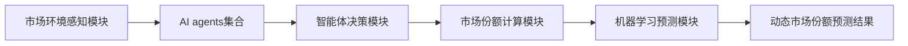

# 利用AI agents构建动态市场份额预测模型：把握竞争态势

> 关键词：AI agents、动态市场份额预测模型、竞争态势、多智能体系统、机器学习

> 摘要：本文聚焦于利用AI agents构建动态市场份额预测模型以把握竞争态势这一核心主题。首先介绍了背景信息，包括研究目的、预期读者、文档结构和相关术语。接着阐述了核心概念，如AI agents和市场份额预测模型的原理与联系，并给出相应的文本示意图和Mermaid流程图。详细讲解了核心算法原理，用Python代码进行了具体实现。同时给出了相关的数学模型和公式，并举例说明。通过项目实战，展示了如何搭建开发环境、实现源代码并进行解读分析。探讨了该模型的实际应用场景，推荐了学习资源、开发工具框架以及相关论文著作。最后总结了未来发展趋势与挑战，提供了常见问题解答和扩展阅读参考资料，旨在为读者全面呈现利用AI agents构建动态市场份额预测模型的技术全貌。

## 1. 背景介绍 
### 1.1 目的和范围
在当今竞争激烈的商业环境中，准确预测市场份额对于企业制定战略决策至关重要。传统的市场份额预测方法往往基于静态数据和简单的统计模型，难以适应市场的动态变化和复杂的竞争关系。本研究的目的是利用AI agents构建动态市场份额预测模型，以更精准地把握市场竞争态势。

本研究的范围涵盖了从AI agents的基本概念和原理，到动态市场份额预测模型的构建、算法实现、数学建模，再到实际项目的开发和应用。通过综合运用多智能体系统、机器学习等技术，为企业提供一种更有效的市场份额预测解决方案。

### 1.2 预期读者
本文预期读者包括企业的市场分析师、战略规划人员、市场营销人员，以及对人工智能在商业领域应用感兴趣的研究人员和开发者。对于希望深入了解如何利用先进技术进行市场分析和预测的人士，本文将提供有价值的参考。

### 1.3 文档结构概述
本文共分为十个部分。第一部分为背景介绍，阐述研究的目的、范围、预期读者和文档结构。第二部分介绍核心概念与联系，包括AI agents和市场份额预测模型的原理及相互关系，并给出相应的示意图和流程图。第三部分详细讲解核心算法原理，并使用Python代码进行具体实现。第四部分给出数学模型和公式，并进行详细讲解和举例说明。第五部分通过项目实战，展示开发环境搭建、源代码实现和代码解读。第六部分探讨该模型的实际应用场景。第七部分推荐学习资源、开发工具框架和相关论文著作。第八部分总结未来发展趋势与挑战。第九部分为附录，提供常见问题与解答。第十部分列出扩展阅读和参考资料。

### 1.4 术语表
#### 1.4.1 核心术语定义
- **AI agents（人工智能智能体）**：是一种能够感知环境、自主决策并采取行动以实现特定目标的软件实体。在市场份额预测模型中，每个AI agent可以代表一个企业或竞争对手，根据市场环境和自身策略进行决策。
- **动态市场份额预测模型**：是一种能够随着时间变化和市场环境的动态调整，对企业或产品在市场中的份额进行预测的模型。该模型考虑了多种因素，如竞争对手的行为、市场需求的变化等。
- **多智能体系统（Multi - Agent System，MAS）**：由多个AI agents组成的系统，这些智能体之间可以相互交互、合作或竞争，以实现共同的或各自的目标。在市场份额预测中，多智能体系统可以模拟市场中多个企业之间的复杂关系。
- **机器学习（Machine Learning）**：是一门多领域交叉学科，涉及概率论、统计学、逼近论、凸分析、算法复杂度理论等多门学科。它专门研究计算机怎样模拟或实现人类的学习行为，以获取新的知识或技能，重新组织已有的知识结构使之不断改善自身的性能。在市场份额预测模型中，机器学习算法可用于分析市场数据和训练预测模型。

#### 1.4.2 相关概念解释
- **市场竞争态势**：指市场中各企业之间的竞争关系和状态，包括市场份额的分布、竞争对手的策略、市场需求的变化等因素。把握市场竞争态势有助于企业制定合理的市场策略。
- **预测精度**：指预测结果与实际情况的接近程度，通常用误差率等指标来衡量。在市场份额预测中，提高预测精度可以为企业提供更准确的决策依据。

#### 1.4.3 缩略词列表
- **MAS**：Multi - Agent System（多智能体系统）
- **ML**：Machine Learning（机器学习）

## 2. 核心概念与联系 
### 核心概念原理
#### AI agents原理
AI agents是具有自主性、反应性、社会性和主动性的软件实体。自主性意味着智能体能够独立地感知环境并做出决策；反应性表示智能体能够对环境的变化做出及时响应；社会性指智能体可以与其他智能体进行交互；主动性则体现为智能体能够主动采取行动以实现自身目标。

在市场份额预测模型中，每个AI agent可以代表一个企业或竞争对手。智能体通过感知市场环境（如市场需求、竞争对手的价格、产品质量等），根据自身的策略（如定价策略、营销策略等）做出决策，从而影响自身的市场份额。

#### 动态市场份额预测模型原理
动态市场份额预测模型基于多智能体系统和机器学习技术。多智能体系统模拟市场中多个企业之间的竞争关系，每个智能体的决策会影响市场的整体状态。机器学习算法用于分析市场数据，挖掘数据中的规律和模式，从而对市场份额进行预测。

该模型考虑了市场的动态变化，如市场需求的季节性波动、竞争对手的新策略等。通过不断更新智能体的状态和市场数据，模型可以实时调整预测结果，提高预测的准确性。

### 架构的文本示意图
```plaintext
+----------------------+
|  市场环境感知模块    |
|  （市场需求、价格等） |
+----------------------+
          |
          v
+----------------------+
|  AI agents集合       |
|  （企业智能体、竞    |
|  争对手智能体等）    |
+----------------------+
          |
          v
+----------------------+
|  智能体决策模块      |
|  （定价、营销等策略）|
+----------------------+
          |
          v
+----------------------+
|  市场份额计算模块    |
|  （根据智能体决策）  |
+----------------------+
          |
          v
+----------------------+
|  机器学习预测模块    |
|  （训练预测模型）    |
+----------------------+
          |
          v
+----------------------+
|  动态市场份额预测结果|
+----------------------+
```

### Mermaid流程图


## 3. 核心算法原理 & 具体操作步骤 
### 核心算法原理
本模型主要采用强化学习算法来训练AI agents，使其能够根据市场环境做出最优决策。强化学习是一种通过智能体与环境进行交互，不断尝试不同的行动并根据反馈的奖励来学习最优策略的机器学习方法。

具体来说，每个AI agent的目标是最大化自身的市场份额。智能体在每个时间步根据当前的市场状态选择一个行动（如调整价格、增加广告投入等），环境会根据智能体的行动给出一个奖励（如市场份额的增加或减少）。智能体通过不断地尝试和学习，逐渐找到能够获得最大奖励的行动策略。

### 具体操作步骤
#### 步骤1：定义状态空间
状态空间是指市场环境的所有可能状态。在市场份额预测模型中，状态可以包括市场需求、竞争对手的价格、产品质量等因素。例如，我们可以将状态表示为一个向量 $s = [d, p_1, p_2, \cdots, p_n, q_1, q_2, \cdots, q_n]$，其中 $d$ 表示市场需求，$p_i$ 表示第 $i$ 个竞争对手的价格，$q_i$ 表示第 $i$ 个竞争对手的产品质量。

#### 步骤2：定义动作空间
动作空间是指AI agent可以采取的所有可能行动。例如，智能体可以选择调整产品价格、增加广告投入、推出新产品等。我们可以将动作表示为一个向量 $a = [\Delta p, \Delta a, \Delta n]$，其中 $\Delta p$ 表示价格调整幅度，$\Delta a$ 表示广告投入增加量，$\Delta n$ 表示新产品推出的可能性。

#### 步骤3：定义奖励函数
奖励函数用于衡量智能体采取某个行动后获得的奖励。在市场份额预测模型中，奖励可以定义为市场份额的增加或减少。例如，奖励函数可以表示为 $r(s, a) = \Delta m$，其中 $\Delta m$ 表示采取行动 $a$ 后市场份额的变化。

#### 步骤4：训练强化学习模型
使用强化学习算法（如Q - learning、Deep Q - Network等）训练AI agents。在每个时间步，智能体根据当前状态选择一个行动，环境根据行动给出奖励，智能体根据奖励更新自身的策略。

### Python源代码实现
```python
import numpy as np
import random

# 定义状态空间维度
STATE_DIM = 5
# 定义动作空间维度
ACTION_DIM = 3
# 定义Q表
Q_TABLE = np.zeros((10**STATE_DIM, ACTION_DIM))
# 定义学习率
LEARNING_RATE = 0.1
# 定义折扣因子
DISCOUNT_FACTOR = 0.9
# 定义探索率
EXPLORATION_RATE = 0.1

def get_state_index(state):
    """
    将状态向量转换为Q表的索引
    """
    index = 0
    for i in range(STATE_DIM):
        index += state[i] * (10**i)
    return index

def choose_action(state):
    """
    根据当前状态选择一个行动
    """
    state_index = get_state_index(state)
    if random.uniform(0, 1) < EXPLORATION_RATE:
        # 探索：随机选择一个行动
        action = random.randint(0, ACTION_DIM - 1)
    else:
        # 利用：选择Q值最大的行动
        action = np.argmax(Q_TABLE[state_index])
    return action

def update_q_table(state, action, reward, next_state):
    """
    更新Q表
    """
    state_index = get_state_index(state)
    next_state_index = get_state_index(next_state)
    max_q_next = np.max(Q_TABLE[next_state_index])
    Q_TABLE[state_index][action] = (1 - LEARNING_RATE) * Q_TABLE[state_index][action] + \
                                   LEARNING_RATE * (reward + DISCOUNT_FACTOR * max_q_next)

# 模拟训练过程
num_episodes = 1000
for episode in range(num_episodes):
    # 初始化状态
    state = np.random.randint(0, 10, STATE_DIM)
    for step in range(100):
        # 选择行动
        action = choose_action(state)
        # 模拟环境反馈
        next_state = np.random.randint(0, 10, STATE_DIM)
        reward = np.random.randint(-10, 10)
        # 更新Q表
        update_q_table(state, action, reward, next_state)
        state = next_state
```

## 4. 数学模型和公式 & 详细讲解 & 举例说明 
### 数学模型和公式
#### Q - learning算法公式
Q - learning是一种无模型的强化学习算法，其核心思想是通过不断更新Q值来学习最优策略。Q值表示在某个状态下采取某个行动的预期累积奖励。Q - learning的更新公式如下：

$$Q(s_t, a_t) \leftarrow (1 - \alpha)Q(s_t, a_t) + \alpha\left[r_{t+1} + \gamma\max_{a}Q(s_{t+1}, a)\right]$$

其中：
- $Q(s_t, a_t)$ 表示在时间步 $t$ 处于状态 $s_t$ 时采取行动 $a_t$ 的Q值。
- $\alpha$ 是学习率，控制Q值更新的速度，取值范围为 $[0, 1]$。
- $r_{t+1}$ 是在时间步 $t + 1$ 获得的奖励。
- $\gamma$ 是折扣因子，用于衡量未来奖励的重要性，取值范围为 $[0, 1]$。
- $\max_{a}Q(s_{t+1}, a)$ 表示在时间步 $t + 1$ 处于状态 $s_{t+1}$ 时所有可能行动中最大的Q值。

#### 市场份额计算公式
假设市场中有 $n$ 个企业，第 $i$ 个企业的市场份额 $m_i$ 可以通过以下公式计算：

$$m_i=\frac{v_i}{\sum_{j = 1}^{n}v_j}$$

其中 $v_i$ 表示第 $i$ 个企业的产品的市场价值，市场价值可以根据产品的价格、质量、品牌影响力等因素综合计算。

### 详细讲解
#### Q - learning算法公式讲解
Q - learning算法的核心是通过不断更新Q值来逼近最优策略。学习率 $\alpha$ 控制了新的经验对Q值的影响程度。如果 $\alpha$ 较大，新的经验会对Q值产生较大的影响；如果 $\alpha$ 较小，Q值的更新会比较缓慢。

折扣因子 $\gamma$ 表示未来奖励的重要性。如果 $\gamma$ 接近1，智能体更注重长期奖励；如果 $\gamma$ 接近0，智能体更注重即时奖励。

#### 市场份额计算公式讲解
市场份额计算公式基于产品的市场价值。市场价值越高，企业的市场份额就越大。在实际应用中，市场价值的计算需要考虑多个因素，如产品的价格、质量、品牌影响力等。可以通过加权平均的方法来计算市场价值，例如：

$$v_i = w_1p_i+w_2q_i + w_3b_i$$

其中 $p_i$ 表示第 $i$ 个企业的产品价格，$q_i$ 表示产品质量，$b_i$ 表示品牌影响力，$w_1, w_2, w_3$ 是相应的权重系数，且 $w_1 + w_2+w_3 = 1$。

### 举例说明
#### Q - learning算法举例
假设在一个简单的市场环境中，状态空间只有两个状态 $s_1$ 和 $s_2$，行动空间有两个行动 $a_1$ 和 $a_2$。初始时，Q表如下：

| 状态 | $a_1$ | $a_2$ |
|------|-------|-------|
| $s_1$ | 0 | 0 |
| $s_2$ | 0 | 0 |

假设当前状态 $s_t = s_1$，智能体选择行动 $a_t = a_1$，获得奖励 $r_{t+1}= 5$，下一个状态 $s_{t+1}=s_2$。学习率 $\alpha = 0.1$，折扣因子 $\gamma = 0.9$。

首先，在状态 $s_2$ 下，$\max_{a}Q(s_{t+1}, a)=\max\{Q(s_2, a_1), Q(s_2, a_2)\}=0$。

然后，根据Q - learning更新公式：

$$Q(s_1, a_1)=(1 - 0.1)\times0+0.1\times(5 + 0.9\times0)=0.5$$

更新后的Q表如下：

| 状态 | $a_1$ | $a_2$ |
|------|-------|-------|
| $s_1$ | 0.5 | 0 |
| $s_2$ | 0 | 0 |

#### 市场份额计算举例
假设市场中有三个企业，它们的产品市场价值分别为 $v_1 = 100$，$v_2 = 200$，$v_3 = 300$。

根据市场份额计算公式，企业1的市场份额为：

$$m_1=\frac{100}{100 + 200+300}=\frac{100}{600}=\frac{1}{6}\approx0.167$$

企业2的市场份额为：

$$m_2=\frac{200}{100 + 200+300}=\frac{200}{600}=\frac{1}{3}\approx0.333$$

企业3的市场份额为：

$$m_3=\frac{300}{100 + 200+300}=\frac{300}{600}=\frac{1}{2}=0.5$$

## 5. 项目实战：代码实际案例和详细解释说明 
### 5.1  开发环境搭建
#### 操作系统
本项目可以在Windows、Linux或macOS操作系统上进行开发。建议使用Linux系统，因为它对Python开发环境的支持更好。

#### Python环境
安装Python 3.7及以上版本。可以从Python官方网站（https://www.python.org/downloads/）下载安装包进行安装。

#### 依赖库安装
本项目需要使用以下Python库：
- `numpy`：用于数值计算。
- `random`：用于生成随机数。

可以使用以下命令安装这些库：
```sh
pip install numpy
```

### 5.2  源代码详细实现和代码解读
```python
import numpy as np
import random

# 定义状态空间维度
STATE_DIM = 5
# 定义动作空间维度
ACTION_DIM = 3
# 定义Q表
Q_TABLE = np.zeros((10**STATE_DIM, ACTION_DIM))
# 定义学习率
LEARNING_RATE = 0.1
# 定义折扣因子
DISCOUNT_FACTOR = 0.9
# 定义探索率
EXPLORATION_RATE = 0.1

def get_state_index(state):
    """
    将状态向量转换为Q表的索引
    """
    index = 0
    for i in range(STATE_DIM):
        index += state[i] * (10**i)
    return index

def choose_action(state):
    """
    根据当前状态选择一个行动
    """
    state_index = get_state_index(state)
    if random.uniform(0, 1) < EXPLORATION_RATE:
        # 探索：随机选择一个行动
        action = random.randint(0, ACTION_DIM - 1)
    else:
        # 利用：选择Q值最大的行动
        action = np.argmax(Q_TABLE[state_index])
    return action

def update_q_table(state, action, reward, next_state):
    """
    更新Q表
    """
    state_index = get_state_index(state)
    next_state_index = get_state_index(next_state)
    max_q_next = np.max(Q_TABLE[next_state_index])
    Q_TABLE[state_index][action] = (1 - LEARNING_RATE) * Q_TABLE[state_index][action] + \
                                   LEARNING_RATE * (reward + DISCOUNT_FACTOR * max_q_next)

# 模拟训练过程
num_episodes = 1000
for episode in range(num_episodes):
    # 初始化状态
    state = np.random.randint(0, 10, STATE_DIM)
    for step in range(100):
        # 选择行动
        action = choose_action(state)
        # 模拟环境反馈
        next_state = np.random.randint(0, 10, STATE_DIM)
        reward = np.random.randint(-10, 10)
        # 更新Q表
        update_q_table(state, action, reward, next_state)
        state = next_state
```

#### 代码解读
1. **导入库**：导入 `numpy` 和 `random` 库，分别用于数值计算和生成随机数。
2. **定义常量**：定义状态空间维度 `STATE_DIM`、动作空间维度 `ACTION_DIM`、Q表 `Q_TABLE`、学习率 `LEARNING_RATE`、折扣因子 `DISCOUNT_FACTOR` 和探索率 `EXPLORATION_RATE`。
3. **`get_state_index` 函数**：将状态向量转换为Q表的索引，方便在Q表中查找和更新Q值。
4. **`choose_action` 函数**：根据当前状态选择一个行动。以一定的概率（探索率）随机选择一个行动进行探索，否则选择Q值最大的行动进行利用。
5. **`update_q_table` 函数**：根据Q - learning更新公式更新Q表。
6. **模拟训练过程**：通过循环模拟多个训练回合，每个回合包含多个时间步。在每个时间步，智能体选择一个行动，模拟环境反馈，更新Q表。

### 5.3  代码解读与分析
#### 优点
- **简单易懂**：代码结构清晰，使用了基本的Python语法和 `numpy` 库，易于理解和实现。
- **可扩展性**：可以通过修改状态空间维度、动作空间维度、学习率、折扣因子等参数，对模型进行扩展和优化。

#### 缺点
- **模拟环境简单**：代码中使用随机数模拟环境反馈，与实际市场环境存在较大差距。在实际应用中，需要使用真实的市场数据和更复杂的环境模型。
- **Q表存储问题**：当状态空间维度较大时，Q表的存储会占用大量的内存。可以考虑使用深度强化学习算法（如Deep Q - Network）来解决这个问题。

## 6. 实际应用场景 
### 企业战略规划
企业可以利用动态市场份额预测模型来制定战略规划。通过预测不同市场策略下的市场份额变化，企业可以选择最优的策略，如定价策略、产品研发策略、市场营销策略等。例如，企业可以通过模拟不同价格调整方案对市场份额的影响，选择最能提高市场份额的价格。

### 竞争对手分析
该模型可以帮助企业分析竞争对手的行为和策略。通过模拟竞争对手的智能体，企业可以预测竞争对手在不同市场环境下的决策和市场份额变化，从而提前制定应对策略。例如，企业可以预测竞争对手推出新产品后自身市场份额的变化，及时调整产品研发和营销策略。

### 市场趋势预测
动态市场份额预测模型可以对市场趋势进行预测。通过分析市场份额的动态变化，企业可以了解市场的发展趋势，如市场需求的变化、新兴市场的崛起等。这有助于企业提前布局，抓住市场机会。例如，企业可以根据市场份额预测模型预测某个行业未来几年的市场增长趋势，决定是否进入该行业。

### 投资决策
投资者可以利用该模型来评估企业的市场竞争力和发展潜力。通过预测企业的市场份额变化，投资者可以判断企业的盈利能力和投资价值，从而做出更明智的投资决策。例如，投资者可以比较不同企业在未来一段时间内的市场份额预测结果，选择投资市场份额增长潜力较大的企业。

## 7. 工具和资源推荐
### 7.1 学习资源推荐
#### 7.1.1 书籍推荐
- 《强化学习：原理与Python实现》：本书详细介绍了强化学习的基本原理和算法，并通过Python代码进行了实现。适合初学者深入学习强化学习。
- 《多智能体系统导论》：全面介绍了多智能体系统的基本概念、理论和应用，对于理解AI agents和多智能体系统在市场份额预测中的应用有很大帮助。
- 《机器学习》（周志华）：被称为“西瓜书”，是机器学习领域的经典教材，涵盖了机器学习的各个方面，包括监督学习、无监督学习、强化学习等。

#### 7.1.2 在线课程
- Coursera上的“Reinforcement Learning Specialization”：由DeepMind的研究人员授课，系统地介绍了强化学习的理论和实践。
- edX上的“Artificial Intelligence: Search Algorithms for Robotics”：介绍了人工智能中的搜索算法，对于理解智能体的决策过程有很大帮助。
- 中国大学MOOC上的“机器学习”：由国内知名高校的教授授课，内容丰富，适合初学者入门。

#### 7.1.3 技术博客和网站
- Medium：有很多关于人工智能、强化学习和市场分析的技术博客文章，作者来自世界各地的研究人员和开发者。
- Towards Data Science：专注于数据科学和机器学习领域的技术博客，提供了很多实用的教程和案例分析。
- arXiv：是一个预印本数据库，收录了大量的计算机科学、人工智能等领域的最新研究论文。

### 7.2 开发工具框架推荐
#### 7.2.1 IDE和编辑器
- PyCharm：是一款专业的Python集成开发环境，具有代码自动补全、调试、版本控制等功能，适合Python开发。
- Jupyter Notebook：是一个交互式的开发环境，支持Python、R等多种编程语言。可以方便地进行代码编写、数据可视化和文档撰写。
- Visual Studio Code：是一款轻量级的代码编辑器，支持多种编程语言和插件扩展。可以通过安装Python插件来进行Python开发。

#### 7.2.2 调试和性能分析工具
- pdb：是Python自带的调试器，可以在代码中设置断点，逐行调试代码。
- cProfile：是Python的性能分析工具，可以分析代码的运行时间和函数调用次数，帮助优化代码性能。
- TensorBoard：是TensorFlow的可视化工具，可以用于可视化深度学习模型的训练过程和性能指标。

#### 7.2.3 相关框架和库
- OpenAI Gym：是一个用于开发和比较强化学习算法的工具包，提供了多种模拟环境和基准测试。
- Stable Baselines：是一个基于OpenAI Gym的强化学习库，提供了多种预训练的强化学习算法和模型。
- NumPy：是Python的数值计算库，提供了高效的多维数组对象和数学函数，用于数值计算和数据处理。

### 7.3 相关论文著作推荐
#### 7.3.1 经典论文
- “Q - learning” by Christopher J. C. H. Watkins and Peter Dayan：是Q - learning算法的经典论文，详细介绍了Q - learning的原理和算法。
- “Multi - Agent Systems: A Modern Approach to Distributed Artificial Intelligence” by Gerhard Weiss：是多智能体系统领域的经典著作，全面介绍了多智能体系统的理论和应用。
- “Playing Atari with Deep Reinforcement Learning” by Volodymyr Mnih et al.：提出了Deep Q - Network（DQN）算法，将深度学习和强化学习相结合，在Atari游戏中取得了很好的效果。

#### 7.3.2 最新研究成果
- 关注arXiv上关于强化学习、多智能体系统和市场分析的最新研究论文，了解该领域的最新技术和方法。
- 参加国际人工智能会议（如IJCAI、AAAI）和机器学习会议（如NeurIPS、ICML），获取最新的研究成果和趋势。

#### 7.3.3 应用案例分析
- 研究一些知名企业在市场分析和预测中应用人工智能技术的案例，如亚马逊的市场份额预测、谷歌的广告投放策略等。可以从企业的官方博客、技术报告和学术论文中获取相关信息。

## 8. 总结：未来发展趋势与挑战
### 未来发展趋势
#### 与大数据和云计算的融合
随着大数据技术的发展，市场数据的规模和复杂度不断增加。未来，动态市场份额预测模型将与大数据和云计算技术深度融合，利用大数据的存储和处理能力，处理更大量、更复杂的市场数据，提高预测的准确性和实时性。

#### 多模态数据的应用
除了传统的结构化数据（如价格、销量等），未来的市场份额预测模型将更多地利用多模态数据，如文本数据（新闻报道、社交媒体评论等）、图像数据（产品图片、广告海报等）和视频数据（产品宣传视频等）。通过综合分析多模态数据，可以更全面地了解市场需求和竞争态势。

#### 智能决策系统的发展
动态市场份额预测模型将与智能决策系统相结合，实现自动化的决策过程。智能决策系统可以根据预测结果自动生成最优的市场策略，并实时调整策略以适应市场变化。

### 挑战
#### 数据质量和隐私问题
市场数据的质量和隐私是影响预测模型准确性和可靠性的重要因素。低质量的数据可能导致模型过拟合或欠拟合，而数据隐私问题则可能引发用户的信任危机。因此，如何保证数据的质量和隐私是未来需要解决的重要问题。

#### 模型复杂度和可解释性
随着模型的不断发展，模型的复杂度也在不断增加。复杂的模型虽然可以提高预测的准确性，但也会降低模型的可解释性。在实际应用中，企业往往需要了解模型的决策过程和依据，因此如何提高模型的可解释性是一个挑战。

#### 市场环境的不确定性
市场环境是复杂多变的，存在很多不确定性因素，如政策变化、突发事件等。这些不确定性因素会对市场份额预测模型的准确性产生影响。如何在不确定性环境下提高模型的鲁棒性和适应性是未来需要研究的方向。

## 9. 附录：常见问题与解答
### 问题1：AI agents和传统的数据分析方法有什么区别？
AI agents具有自主性、反应性、社会性和主动性，能够根据市场环境自主决策并采取行动。而传统的数据分析方法主要是基于历史数据进行统计分析和建模，缺乏自主性和实时决策能力。AI agents可以模拟市场中企业的行为和决策过程，更真实地反映市场的动态变化。

### 问题2：如何选择合适的强化学习算法？
选择合适的强化学习算法需要考虑多个因素，如问题的复杂度、状态空间和动作空间的大小、数据的可用性等。对于简单的问题，可以选择Q - learning等传统的强化学习算法；对于复杂的问题，如大规模状态空间和连续动作空间的问题，可以选择深度强化学习算法，如Deep Q - Network、Proximal Policy Optimization等。

### 问题3：如何评估动态市场份额预测模型的准确性？
可以使用多种指标来评估模型的准确性，如均方误差（Mean Squared Error，MSE）、平均绝对误差（Mean Absolute Error，MAE）、准确率等。在实际应用中，可以将模型的预测结果与实际市场份额进行对比，计算这些指标的值。同时，还可以进行交叉验证和回测，以评估模型的稳定性和泛化能力。

### 问题4：模型训练需要多长时间？
模型训练的时间取决于多个因素，如数据的规模、模型的复杂度、硬件资源等。对于简单的模型和小规模的数据，训练时间可能只需要几分钟到几小时；对于复杂的模型和大规模的数据，训练时间可能需要几天甚至几周。可以通过优化算法、并行计算等方法来缩短训练时间。

## 10. 扩展阅读 & 参考资料
### 扩展阅读
- 《人工智能：现代方法》：全面介绍了人工智能的各个领域，包括搜索算法、机器学习、自然语言处理等，是人工智能领域的经典教材。
- 《深度学习》（Ian Goodfellow等）：深度学习领域的权威著作，详细介绍了深度学习的理论和实践。
- 《市场营销管理》（菲利普·科特勒）：市场营销领域的经典教材，介绍了市场营销的基本概念、理论和方法。

### 参考资料
- Watkins, C. J. C. H., & Dayan, P. (1992). Q - learning. Machine learning, 8(3 - 4), 279 - 292.
- Weiss, G. (Ed.). (2013). Multi - Agent Systems: A Modern Approach to Distributed Artificial Intelligence. MIT press.
- Mnih, V., Kavukcuoglu, K., Silver, D., Graves, A., Antonoglou, I., Wierstra, D., & Riedmiller, M. (2013). Playing Atari with Deep Reinforcement Learning. arXiv preprint arXiv:1312.5602.

作者：AI天才研究院/AI Genius Institute & 禅与计算机程序设计艺术 /Zen And The Art of Computer Programming