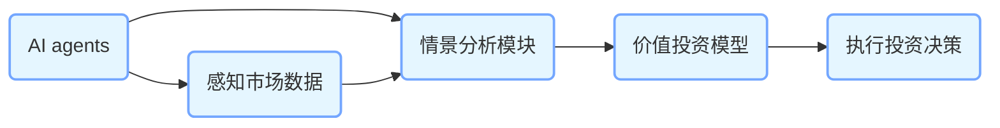

# 利用AI agents进行情景分析：增强价值投资的适应性

> 关键词：AI agents、情景分析、价值投资、适应性、投资决策

> 摘要：本文聚焦于利用AI agents进行情景分析以增强价值投资的适应性这一主题。首先介绍了相关背景知识，包括目的范围、预期读者等。接着阐述了AI agents和价值投资等核心概念及其联系，通过文本示意图和Mermaid流程图进行清晰展示。详细讲解了核心算法原理和具体操作步骤，结合Python源代码进行说明。探讨了相关的数学模型和公式，并举例分析。通过项目实战给出代码实际案例及详细解释。列举了实际应用场景，推荐了学习资源、开发工具框架以及相关论文著作。最后总结了未来发展趋势与挑战，解答常见问题并提供扩展阅读和参考资料，旨在为投资者和相关从业者提供全面且深入的技术指导。

## 1. 背景介绍 
### 1.1 目的和范围
本文章的主要目的是探讨如何运用AI agents进行情景分析，从而增强价值投资的适应性。随着金融市场的复杂性不断增加，传统的价值投资方法面临着诸多挑战，难以应对市场的动态变化。AI agents具有强大的数据分析和决策能力，能够对不同的市场情景进行模拟和分析，为价值投资提供更科学、更灵活的决策依据。

本文的范围涵盖了AI agents的基本概念、核心算法原理、数学模型，以及如何将其应用于价值投资的情景分析中。同时，通过实际的项目案例展示了具体的实现过程，并对未来的发展趋势和挑战进行了分析。

### 1.2 预期读者
本文的预期读者包括金融投资者、金融分析师、人工智能研究者、软件开发人员以及对金融科技领域感兴趣的人士。对于投资者和分析师来说，本文可以帮助他们了解如何利用AI agents优化价值投资决策；对于人工智能研究者和软件开发人员，本文提供了在金融领域应用AI agents的具体方法和技术细节。

### 1.3 文档结构概述
本文将按照以下结构进行组织：
1. 背景介绍：阐述文章的目的、范围、预期读者和文档结构，以及相关术语的定义。
2. 核心概念与联系：介绍AI agents、情景分析和价值投资的核心概念，并展示它们之间的联系。
3. 核心算法原理 & 具体操作步骤：详细讲解AI agents进行情景分析的核心算法原理，并给出具体的操作步骤，同时使用Python源代码进行说明。
4. 数学模型和公式 & 详细讲解 & 举例说明：介绍相关的数学模型和公式，并通过具体的例子进行详细讲解。
5. 项目实战：代码实际案例和详细解释说明：通过一个实际的项目案例，展示如何使用AI agents进行情景分析以增强价值投资的适应性，并对代码进行详细解读。
6. 实际应用场景：列举AI agents在价值投资情景分析中的实际应用场景。
7. 工具和资源推荐：推荐学习资源、开发工具框架以及相关论文著作。
8. 总结：未来发展趋势与挑战：总结本文的主要内容，分析未来的发展趋势和面临的挑战。
9. 附录：常见问题与解答：解答读者在阅读过程中可能遇到的常见问题。
10. 扩展阅读 & 参考资料：提供相关的扩展阅读材料和参考资料。

### 1.4 术语表
#### 1.4.1 核心术语定义
- **AI agents（人工智能代理）**：是一种能够感知环境、做出决策并采取行动的人工智能实体。它可以根据预设的目标和规则，自主地处理信息并与环境进行交互。
- **情景分析（Scenario analysis）**：是一种通过对不同情景进行模拟和分析，评估各种因素对投资结果影响的方法。情景分析可以帮助投资者更好地理解市场的不确定性，制定更具适应性的投资策略。
- **价值投资（Value investing）**：是一种基于公司内在价值进行投资的策略。价值投资者通过分析公司的财务状况、行业前景等因素，寻找被低估的股票，并长期持有以获取收益。

#### 1.4.2 相关概念解释
- **机器学习（Machine learning）**：是AI agents的核心技术之一，它使计算机能够从数据中学习模式和规律，并根据这些模式和规律进行预测和决策。常见的机器学习算法包括决策树、神经网络、支持向量机等。
- **强化学习（Reinforcement learning）**：是一种机器学习方法，通过智能体与环境进行交互，根据环境反馈的奖励信号来学习最优的行为策略。在价值投资情景分析中，强化学习可以用于优化投资决策。

#### 1.4.3 缩略词列表
- **AI（Artificial Intelligence）**：人工智能
- **ML（Machine Learning）**：机器学习
- **RL（Reinforcement Learning）**：强化学习

## 2. 核心概念与联系 

### 核心概念原理
#### AI agents
AI agents是人工智能系统的一种抽象表示，它由感知器、决策器和执行器组成。感知器负责收集环境信息，决策器根据感知到的信息和预设的目标进行决策，执行器则根据决策结果采取相应的行动。在价值投资情景分析中，AI agents可以感知市场数据（如股票价格、财务报表等），通过分析这些数据做出投资决策，并执行买入、卖出等操作。

#### 情景分析
情景分析是一种基于假设的分析方法，它通过设定不同的情景（如经济衰退、行业竞争加剧等），模拟各种情景下投资组合的表现。情景分析可以帮助投资者识别潜在的风险和机会，评估投资策略的适应性。

#### 价值投资
价值投资的核心思想是寻找被低估的股票，即股票的市场价格低于其内在价值。价值投资者通过分析公司的基本面（如盈利能力、资产负债表等）来评估公司的内在价值，并在股票价格低于内在价值时买入，等待价格回归价值时卖出。

### 架构的文本示意图
```plaintext
           +----------------+
           |    AI agents   |
           +----------------+
           |  - 感知器      |
           |  - 决策器      |
           |  - 执行器      |
           +----------------+
                  |
                  v
           +----------------+
           |  情景分析模块  |
           +----------------+
           |  - 情景设定    |
           |  - 情景模拟    |
           |  - 结果评估    |
           +----------------+
                  |
                  v
           +----------------+
           |  价值投资模型  |
           +----------------+
           |  - 基本面分析  |
           |  - 内在价值评估|
           |  - 投资决策    |
           +----------------+
```

### Mermaid流程图


## 3. 核心算法原理 & 具体操作步骤 

### 核心算法原理
在利用AI agents进行情景分析以增强价值投资适应性的过程中，主要涉及到机器学习和强化学习算法。

#### 机器学习算法
以决策树算法为例，决策树是一种基于树结构进行决策的机器学习算法。它通过对数据进行划分，构建一棵决策树，每个内部节点表示一个属性上的测试，每个分支表示一个测试输出，每个叶节点表示一个类别或值。在价值投资情景分析中，决策树可以用于对市场情景进行分类，预测不同情景下股票的表现。

#### 强化学习算法
强化学习通过智能体与环境进行交互，根据环境反馈的奖励信号来学习最优的行为策略。在价值投资中，智能体可以是AI agents，环境是金融市场，奖励信号可以是投资收益。智能体通过不断尝试不同的投资决策，根据获得的收益来调整自己的策略，以最大化长期收益。

### 具体操作步骤
#### 数据收集与预处理
1. 收集市场数据，包括股票价格、财务报表、宏观经济数据等。
2. 对数据进行清洗，去除缺失值、异常值等。
3. 对数据进行特征工程，提取有价值的特征，如市盈率、市净率等。

#### 情景设定
1. 根据历史数据和专家经验，设定不同的市场情景，如牛市、熊市、震荡市等。
2. 为每个情景设定相应的参数，如市场波动率、利率变化等。

#### 模型训练
1. 使用机器学习算法（如决策树、神经网络等）对历史数据进行训练，建立情景分类模型。
2. 使用强化学习算法（如Q-learning、深度Q网络等）训练AI agents，使其学习最优的投资策略。

#### 情景模拟与分析
1. 根据设定的情景，使用训练好的模型进行情景模拟，预测不同情景下股票的表现。
2. 分析模拟结果，评估投资策略的适应性和风险。

#### 投资决策
1. 根据情景分析的结果，AI agents做出投资决策，如买入、卖出或持有股票。
2. 执行投资决策，并根据市场反馈不断调整策略。

### Python源代码实现
```python
import pandas as pd
from sklearn.tree import DecisionTreeClassifier
from sklearn.model_selection import train_test_split
from sklearn.metrics import accuracy_score

# 数据收集与预处理
# 假设已经有一个包含股票数据的CSV文件
data = pd.read_csv('stock_data.csv')
# 去除缺失值
data = data.dropna()
# 提取特征和标签
X = data.drop('label', axis=1)
y = data['label']

# 划分训练集和测试集
X_train, X_test, y_train, y_test = train_test_split(X, y, test_size=0.2, random_state=42)

# 模型训练
model = DecisionTreeClassifier()
model.fit(X_train, y_train)

# 模型评估
y_pred = model.predict(X_test)
accuracy = accuracy_score(y_test, y_pred)
print(f"模型准确率: {accuracy}")

# 情景模拟与分析
# 假设新的情景数据
new_scenario = pd.DataFrame([[1, 2, 3, 4, 5]])
prediction = model.predict(new_scenario)
print(f"新情景预测结果: {prediction}")
```

## 4. 数学模型和公式 & 详细讲解 & 举例说明 

### 决策树算法的数学模型和公式
决策树算法的核心是信息增益，信息增益用于衡量划分属性的重要性。信息增益的计算公式如下：

$$IG(D, a) = Ent(D) - \sum_{v=1}^{V} \frac{|D^v|}{|D|} Ent(D^v)$$

其中，$IG(D, a)$ 表示属性 $a$ 对数据集 $D$ 的信息增益，$Ent(D)$ 表示数据集 $D$ 的信息熵，$V$ 表示属性 $a$ 的取值个数，$D^v$ 表示属性 $a$ 取值为 $v$ 的样本子集。

信息熵的计算公式如下：

$$Ent(D) = - \sum_{k=1}^{K} p_k \log_2 p_k$$

其中，$K$ 表示数据集 $D$ 中类别的个数，$p_k$ 表示第 $k$ 类样本在数据集 $D$ 中所占的比例。

### 详细讲解
信息熵是衡量数据集纯度的指标，信息熵越大，数据集的纯度越低。信息增益表示在使用属性 $a$ 对数据集 $D$ 进行划分后，数据集纯度的提升程度。在决策树的构建过程中，每次选择信息增益最大的属性作为划分属性，直到数据集被划分得足够纯或达到预设的停止条件。

### 举例说明
假设我们有一个包含 10 个样本的数据集 $D$，其中正类样本有 6 个，负类样本有 4 个。则数据集 $D$ 的信息熵为：

$$Ent(D) = - \frac{6}{10} \log_2 \frac{6}{10} - \frac{4}{10} \log_2 \frac{4}{10} \approx 0.971$$

假设我们有一个属性 $a$，它有两个取值 $v_1$ 和 $v_2$，其中 $D^{v_1}$ 包含 4 个样本，其中正类样本有 3 个，负类样本有 1 个；$D^{v_2}$ 包含 6 个样本，其中正类样本有 3 个，负类样本有 3 个。则 $D^{v_1}$ 和 $D^{v_2}$ 的信息熵分别为：

$$Ent(D^{v_1}) = - \frac{3}{4} \log_2 \frac{3}{4} - \frac{1}{4} \log_2 \frac{1}{4} \approx 0.811$$

$$Ent(D^{v_2}) = - \frac{3}{6} \log_2 \frac{3}{6} - \frac{3}{6} \log_2 \frac{3}{6} = 1$$

属性 $a$ 对数据集 $D$ 的信息增益为：

$$IG(D, a) = Ent(D) - \frac{4}{10} Ent(D^{v_1}) - \frac{6}{10} Ent(D^{v_2}) \approx 0.971 - \frac{4}{10} \times 0.811 - \frac{6}{10} \times 1 \approx 0.126$$

## 5. 项目实战：代码实际案例和详细解释说明 

### 5.1  开发环境搭建
#### 操作系统
本项目可以在 Windows、Linux 或 macOS 操作系统上进行开发。

#### Python环境
建议使用 Python 3.7 及以上版本。可以通过 Anaconda 或 Python 官方网站下载安装 Python。

#### 依赖库安装
在命令行中使用以下命令安装所需的依赖库：
```sh
pip install pandas scikit-learn matplotlib
```

### 5.2  源代码详细实现和代码解读
```python
import pandas as pd
import numpy as np
from sklearn.model_selection import train_test_split
from sklearn.ensemble import RandomForestClassifier
from sklearn.metrics import accuracy_score
import matplotlib.pyplot as plt

# 数据收集与预处理
# 假设已经有一个包含股票数据的CSV文件
data = pd.read_csv('stock_data.csv')
# 去除缺失值
data = data.dropna()
# 提取特征和标签
X = data.drop('label', axis=1)
y = data['label']

# 划分训练集和测试集
X_train, X_test, y_train, y_test = train_test_split(X, y, test_size=0.2, random_state=42)

# 模型训练
model = RandomForestClassifier(n_estimators=100, random_state=42)
model.fit(X_train, y_train)

# 模型评估
y_pred = model.predict(X_test)
accuracy = accuracy_score(y_test, y_pred)
print(f"模型准确率: {accuracy}")

# 特征重要性分析
feature_importances = model.feature_importances_
feature_names = X.columns
indices = np.argsort(feature_importances)

plt.figure(figsize=(10, 6))
plt.title("特征重要性")
plt.barh(range(len(indices)), feature_importances[indices], color='b', align='center')
plt.yticks(range(len(indices)), [feature_names[i] for i in indices])
plt.xlabel("特征重要性")
plt.show()

# 情景模拟与分析
# 假设新的情景数据
new_scenario = pd.DataFrame([[1, 2, 3, 4, 5]])
prediction = model.predict(new_scenario)
print(f"新情景预测结果: {prediction}")
```

### 5.3  代码解读与分析
1. **数据收集与预处理**：使用 `pandas` 库读取 CSV 文件，并去除缺失值。提取特征和标签，将数据集划分为训练集和测试集。
2. **模型训练**：使用 `RandomForestClassifier` 构建随机森林分类器，并使用训练集进行训练。
3. **模型评估**：使用测试集对模型进行评估，计算模型的准确率。
4. **特征重要性分析**：通过 `feature_importances_` 属性获取每个特征的重要性，并使用 `matplotlib` 库绘制特征重要性图。
5. **情景模拟与分析**：假设新的情景数据，使用训练好的模型进行预测，并输出预测结果。

## 6. 实际应用场景 
### 市场风险评估
AI agents可以通过情景分析评估不同市场情景下投资组合的风险。例如，在经济衰退情景下，AI agents可以模拟股票价格下跌、利率上升等情况，评估投资组合的价值变化和风险水平。投资者可以根据评估结果调整投资组合，降低风险。

### 投资策略优化
AI agents可以根据情景分析的结果优化投资策略。例如，在牛市情景下，AI agents可以建议增加股票投资比例；在熊市情景下，建议减少股票投资比例，增加债券等避险资产的投资比例。

### 新投资机会发现
AI agents可以通过情景分析发现新的投资机会。例如，在行业变革情景下，AI agents可以分析新兴行业的发展趋势，预测相关股票的表现，为投资者提供投资建议。

### 资产配置决策
AI agents可以根据情景分析为投资者提供资产配置决策。例如，根据不同的市场情景和投资者的风险偏好，AI agents可以建议投资者将资产分配到不同的资产类别（如股票、债券、基金等）中，以实现资产的最优配置。

## 7. 工具和资源推荐
### 7.1 学习资源推荐
#### 7.1.1 书籍推荐
- 《机器学习》（周志华）：全面介绍了机器学习的基本概念、算法和应用，是机器学习领域的经典教材。
- 《Python机器学习》（Sebastian Raschka）：结合Python语言，详细介绍了机器学习的算法实现和应用案例。
- 《价值投资：从格雷厄姆到巴菲特》（布鲁斯·格林沃尔德）：系统阐述了价值投资的理论和方法，是价值投资领域的权威著作。

#### 7.1.2 在线课程
- Coursera上的“机器学习”课程（Andrew Ng教授）：全球知名的机器学习课程，由斯坦福大学的Andrew Ng教授授课，内容丰富，讲解详细。
- edX上的“人工智能基础”课程：介绍了人工智能的基本概念、算法和应用，适合初学者学习。
- Udemy上的“金融数据分析与机器学习”课程：结合金融数据，介绍了机器学习在金融领域的应用。

#### 7.1.3 技术博客和网站
- Medium：一个汇集了众多技术博客的平台，有很多关于人工智能和金融科技的优质文章。
- Towards Data Science：专注于数据科学和机器学习领域的博客网站，提供了大量的技术文章和案例分析。
- Seeking Alpha：一个金融投资领域的网站，提供了丰富的市场分析和投资建议。

### 7.2 开发工具框架推荐
#### 7.2.1 IDE和编辑器
- PyCharm：一款专业的Python集成开发环境，具有代码编辑、调试、版本控制等功能，适合Python开发。
- Jupyter Notebook：一个交互式的开发环境，支持Python、R等多种编程语言，适合数据分析和机器学习实验。
- Visual Studio Code：一款轻量级的代码编辑器，支持多种编程语言和插件扩展，适合快速开发和调试。

#### 7.2.2 调试和性能分析工具
- pdb：Python自带的调试工具，可以帮助开发者定位和解决代码中的问题。
- cProfile：Python的性能分析工具，可以分析代码的运行时间和函数调用情况，帮助开发者优化代码性能。
- TensorBoard：TensorFlow的可视化工具，可以帮助开发者可视化模型的训练过程和性能指标。

#### 7.2.3 相关框架和库
- scikit-learn：一个简单易用的机器学习库，提供了各种机器学习算法和工具，适合初学者快速上手。
- TensorFlow：一个开源的深度学习框架，由Google开发，广泛应用于图像识别、自然语言处理等领域。
- PyTorch：一个基于Python的深度学习框架，具有动态图和易于使用的特点，受到了很多研究者和开发者的喜爱。

### 7.3 相关论文著作推荐
#### 7.3.1 经典论文
- “A Machine Learning Approach to Stock Price Prediction”：介绍了使用机器学习算法进行股票价格预测的方法和实验结果。
- “Reinforcement Learning for Portfolio Management”：探讨了强化学习在投资组合管理中的应用。
- “Value Investing: The Use of Historical Financial Statement Information to Separate Winners from Losers”：阐述了价值投资中如何使用历史财务报表信息进行股票筛选。

#### 7.3.2 最新研究成果
- 关注顶级学术会议（如NeurIPS、ICML等）和期刊（如Journal of Financial Economics、Journal of Machine Learning Research等）上的最新研究成果，了解AI agents在价值投资情景分析中的前沿应用。

#### 7.3.3 应用案例分析
- 一些金融科技公司和研究机构会发布AI agents在价值投资中的应用案例分析报告，可以通过他们的官方网站或相关媒体获取这些报告。

## 8. 总结：未来发展趋势与挑战
### 未来发展趋势
#### 融合多源数据
未来，AI agents将融合更多类型的数据，如社交媒体数据、卫星图像数据等，以更全面地了解市场情况和公司基本面，提高情景分析的准确性和投资决策的科学性。

#### 与区块链技术结合
区块链技术具有去中心化、不可篡改等特点，可以为AI agents提供更可靠的数据来源和安全的交易环境。两者的结合将有助于提高价值投资的透明度和可信度。

#### 个性化投资服务
随着AI agents技术的不断发展，未来可以为投资者提供更加个性化的投资服务。根据投资者的风险偏好、投资目标和财务状况，AI agents可以为其量身定制投资策略和情景分析报告。

### 面临的挑战
#### 数据质量和隐私问题
AI agents的性能高度依赖于数据的质量。金融市场数据往往存在噪声、缺失值和异常值等问题，需要进行有效的数据清洗和预处理。同时，数据隐私问题也是一个重要的挑战，如何在保护投资者隐私的前提下，合理使用数据是需要解决的问题。

#### 模型解释性
AI agents中的一些复杂模型（如深度学习模型）往往具有较高的预测性能，但缺乏解释性。在价值投资领域，投资者需要了解模型的决策依据，以便做出合理的投资决策。因此，提高模型的解释性是一个亟待解决的问题。

#### 市场不确定性
金融市场具有高度的不确定性，未来的市场情景难以准确预测。AI agents虽然可以进行情景分析，但无法完全消除市场不确定性带来的风险。如何在不确定的市场环境中提高投资决策的适应性和稳定性是一个挑战。

## 9. 附录：常见问题与解答
### 问题1：AI agents在价值投资情景分析中的准确性如何保证？
答：为了保证AI agents在价值投资情景分析中的准确性，可以采取以下措施：
1. 收集高质量的数据，并进行有效的数据清洗和预处理，去除噪声和异常值。
2. 选择合适的机器学习和强化学习算法，并进行模型调优，以提高模型的性能。
3. 进行交叉验证和模型评估，确保模型在不同数据集上具有稳定的表现。
4. 结合专家经验和市场知识，对模型的结果进行综合分析和判断。

### 问题2：AI agents能否完全替代人类投资者进行价值投资？
答：目前，AI agents还不能完全替代人类投资者进行价值投资。虽然AI agents具有强大的数据分析和决策能力，但金融市场具有高度的复杂性和不确定性，人类投资者的经验、直觉和判断力在投资决策中仍然起着重要的作用。AI agents可以作为人类投资者的辅助工具，为其提供更科学、更全面的决策依据。

### 问题3：使用AI agents进行价值投资情景分析需要具备哪些技术知识？
答：使用AI agents进行价值投资情景分析需要具备以下技术知识：
1. 机器学习和强化学习的基本概念和算法，如决策树、神经网络、Q-learning等。
2. Python编程语言，以及相关的数据分析和机器学习库，如pandas、scikit-learn、TensorFlow等。
3. 金融市场的基本知识，如股票、债券、基金等金融产品的特点和交易规则。
4. 数据处理和特征工程的方法，能够从海量数据中提取有价值的信息。

## 10. 扩展阅读 & 参考资料
### 扩展阅读
- 《智能金融：AI如何重塑金融行业》：介绍了人工智能在金融行业的应用现状和未来发展趋势。
- 《大数据金融》：探讨了大数据技术在金融领域的应用，包括风险管理、投资决策等方面。
- 《量化投资：策略与技术》：详细介绍了量化投资的方法和技术，包括数据处理、模型构建、策略回测等。

### 参考资料
- 相关的学术论文和研究报告，可以通过学术数据库（如IEEE Xplore、ACM Digital Library等）获取。
- 金融市场的官方网站和数据提供商，如雅虎财经、东方财富网等，可以获取最新的市场数据和信息。
- 人工智能和机器学习的开源项目和代码库，如GitHub上的相关项目，可以学习和参考他人的代码实现。

作者：AI天才研究院/AI Genius Institute & 禅与计算机程序设计艺术 /Zen And The Art of Computer Programming