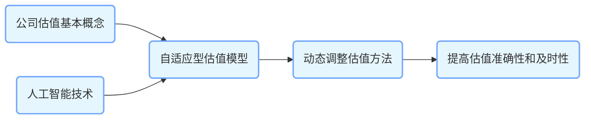

# 利用AI构建自适应型公司估值模型：动态调整估值方法

> 关键词：人工智能、自适应型公司估值模型、动态调整、估值方法、机器学习

> 摘要：本文聚焦于利用人工智能构建自适应型公司估值模型并实现动态调整估值方法。首先介绍了研究的背景、目的、预期读者等内容，接着阐述了核心概念及其联系，详细讲解了核心算法原理与具体操作步骤，给出了相关数学模型和公式并举例说明。通过项目实战展示了代码实现与解读，分析了实际应用场景。同时推荐了学习资源、开发工具框架以及相关论文著作。最后总结了未来发展趋势与挑战，提供了常见问题解答和扩展阅读参考资料，旨在为投资者、金融从业者和相关研究人员提供全面且深入的关于利用AI进行公司估值的知识和方法。

## 1. 背景介绍 
### 1.1 目的和范围
在当今复杂多变的金融市场环境中，准确评估公司的价值对于投资者、企业管理者以及金融监管机构等都具有至关重要的意义。传统的公司估值方法往往基于静态的假设和固定的参数，难以适应市场动态变化和公司自身发展的不确定性。本研究的目的在于利用人工智能技术构建自适应型公司估值模型，实现估值方法的动态调整，以提高估值的准确性和及时性。

本研究的范围涵盖了常见的公司估值方法，如现金流折现法、相对估值法等，并结合人工智能算法，如机器学习、深度学习等，对这些方法进行优化和改进。同时，考虑了宏观经济因素、行业竞争态势、公司财务数据等多方面的影响，以构建全面、有效的自适应型估值模型。

### 1.2 预期读者
本文的预期读者主要包括以下几类人群：
- **投资者**：包括个人投资者、机构投资者等，他们希望通过更准确的公司估值来做出投资决策，提高投资回报率。
- **金融从业者**：如投资银行家、财务分析师、基金经理等，需要掌握先进的估值方法和技术，为客户提供专业的金融服务。
- **企业管理者**：企业管理者需要了解公司的真实价值，以便制定合理的战略规划、融资决策和股权激励计划等。
- **研究人员**：从事金融、经济、人工智能等领域研究的学者和科研人员，对公司估值模型的创新和发展感兴趣。

### 1.3 文档结构概述
本文将按照以下结构进行组织：
- **核心概念与联系**：介绍公司估值的基本概念、人工智能在估值中的应用以及自适应型估值模型的原理和架构。
- **核心算法原理 & 具体操作步骤**：详细阐述用于构建自适应型估值模型的人工智能算法，如决策树、神经网络等，并给出具体的操作步骤和Python代码实现。
- **数学模型和公式 & 详细讲解 & 举例说明**：推导和解释与公司估值相关的数学模型和公式，通过实际案例说明如何应用这些模型和公式进行估值计算。
- **项目实战：代码实际案例和详细解释说明**：通过一个具体的项目实例，展示如何使用Python代码构建自适应型公司估值模型，并对代码进行详细解读和分析。
- **实际应用场景**：分析自适应型公司估值模型在不同场景下的应用，如投资决策、并购重组、企业融资等。
- **工具和资源推荐**：推荐一些学习人工智能和公司估值的相关书籍、在线课程、技术博客和网站，以及开发工具、框架和相关论文著作。
- **总结：未来发展趋势与挑战**：总结本文的主要内容，探讨利用AI构建自适应型公司估值模型的未来发展趋势和面临的挑战。
- **附录：常见问题与解答**：提供一些常见问题的解答，帮助读者更好地理解和应用本文介绍的方法和技术。
- **扩展阅读 & 参考资料**：列出一些扩展阅读的文献和参考资料，供读者进一步深入研究。

### 1.4 术语表
#### 1.4.1 核心术语定义
- **公司估值**：指对一家公司的价值进行评估和估算的过程，通常基于公司的财务数据、市场前景、行业竞争等因素。
- **自适应型估值模型**：一种能够根据市场环境和公司自身情况的变化自动调整估值方法和参数的估值模型。
- **人工智能（AI）**：指计算机系统能够执行通常需要人类智能才能完成的任务，如学习、推理、决策等。
- **机器学习**：人工智能的一个分支，通过让计算机从数据中学习模式和规律，从而实现预测和决策。
- **深度学习**：一种基于神经网络的机器学习方法，具有强大的特征提取和模式识别能力。

#### 1.4.2 相关概念解释
- **现金流折现法（DCF）**：一种基于公司未来现金流的估值方法，通过将未来现金流折现到当前时刻来计算公司的价值。
- **相对估值法**：通过比较公司与同行业其他公司的财务指标，如市盈率、市净率等，来评估公司的价值。
- **特征工程**：指从原始数据中提取和选择有价值的特征，以提高机器学习模型的性能。
- **模型训练**：指使用训练数据对机器学习模型进行参数调整，以使其能够准确地预测目标变量。
- **模型评估**：指使用测试数据对训练好的机器学习模型进行评估，以衡量其性能和准确性。

#### 1.4.3 缩略词列表
- **DCF**：现金流折现法（Discounted Cash Flow）
- **AI**：人工智能（Artificial Intelligence）
- **ML**：机器学习（Machine Learning）
- **DL**：深度学习（Deep Learning）
- **PE**：市盈率（Price-to-Earnings Ratio）
- **PB**：市净率（Price-to-Book Ratio）

## 2. 核心概念与联系 

### 2.1 公司估值的基本概念
公司估值是金融领域的核心问题之一，其目的是确定一家公司的内在价值。常见的公司估值方法可以分为两类：绝对估值法和相对估值法。

绝对估值法主要基于公司的未来现金流，通过将未来现金流折现到当前时刻来计算公司的价值。其中，现金流折现法（DCF）是最常用的绝对估值方法之一。其基本思想是，公司的价值等于其未来各期现金流的现值之和。公式如下：

$$V = \sum_{t=1}^{n} \frac{CF_t}{(1 + r)^t}$$

其中，$V$ 表示公司的价值，$CF_t$ 表示第 $t$ 期的现金流，$r$ 表示折现率，$n$ 表示预测期数。

相对估值法是通过比较公司与同行业其他公司的财务指标来评估公司的价值。常见的相对估值指标包括市盈率（PE）、市净率（PB）、市销率（PS）等。例如，市盈率法的计算公式为：

$$V = EPS \times PE$$

其中，$V$ 表示公司的价值，$EPS$ 表示每股收益，$PE$ 表示市盈率。

### 2.2 人工智能在公司估值中的应用
传统的公司估值方法存在一些局限性，如对市场变化的适应性较差、难以处理复杂的非线性关系等。人工智能技术的发展为解决这些问题提供了新的思路和方法。

人工智能可以通过机器学习和深度学习算法，从大量的历史数据中学习公司价值与各种影响因素之间的关系，从而构建更加准确和灵活的估值模型。例如，机器学习算法可以自动识别和提取数据中的特征，发现潜在的规律和模式；深度学习算法可以处理复杂的非线性关系，提高估值的准确性。

### 2.3 自适应型估值模型的原理和架构
自适应型估值模型的核心思想是能够根据市场环境和公司自身情况的变化自动调整估值方法和参数。其原理主要基于以下几点：

- **数据驱动**：通过收集和分析大量的历史数据，包括公司财务数据、宏观经济数据、行业数据等，构建数据集。
- **模型选择**：根据不同的市场环境和公司特点，选择合适的估值方法和机器学习算法。
- **动态调整**：实时监测市场变化和公司数据的更新，根据新的数据对估值模型进行动态调整。

自适应型估值模型的架构可以分为以下几个部分：

- **数据采集层**：负责收集和整理与公司估值相关的数据，包括财务报表、市场行情、行业报告等。
- **特征工程层**：对采集到的数据进行预处理和特征提取，选择有价值的特征作为模型的输入。
- **模型选择层**：根据不同的市场环境和公司特点，选择合适的估值方法和机器学习算法。
- **模型训练层**：使用训练数据对选择的模型进行训练，调整模型的参数。
- **模型评估层**：使用测试数据对训练好的模型进行评估，衡量模型的性能和准确性。
- **动态调整层**：实时监测市场变化和公司数据的更新，根据新的数据对估值模型进行动态调整。

### 2.4 核心概念的联系
公司估值的基本概念是构建自适应型估值模型的基础，人工智能技术为自适应型估值模型的实现提供了技术支持。自适应型估值模型通过结合公司估值的基本方法和人工智能算法，实现了估值方法的动态调整，提高了估值的准确性和及时性。

以下是核心概念联系的Mermaid流程图：



## 3. 核心算法原理 & 具体操作步骤 

### 3.1 决策树算法原理
决策树是一种常用的机器学习算法，它通过构建一棵树状结构来进行决策。决策树的每个内部节点表示一个特征上的测试，每个分支表示一个测试输出，每个叶节点表示一个类别或值。

决策树的构建过程主要包括以下几个步骤：

- **特征选择**：选择一个最优的特征作为当前节点的划分特征。常用的特征选择方法包括信息增益、信息增益比、基尼指数等。
- **划分数据集**：根据选择的特征将数据集划分为不同的子集。
- **递归构建子树**：对每个子集递归地构建子树，直到满足终止条件。

### 3.2 决策树算法的Python实现
以下是使用Python的`scikit-learn`库实现决策树算法的示例代码：

```python
from sklearn.datasets import load_iris
from sklearn.model_selection import train_test_split
from sklearn.tree import DecisionTreeClassifier
from sklearn.metrics import accuracy_score

# 加载数据集
iris = load_iris()
X = iris.data
y = iris.target

# 划分训练集和测试集
X_train, X_test, y_train, y_test = train_test_split(X, y, test_size=0.2, random_state=42)

# 创建决策树分类器
clf = DecisionTreeClassifier()

# 训练模型
clf.fit(X_train, y_train)

# 预测
y_pred = clf.predict(X_test)

# 评估模型
accuracy = accuracy_score(y_test, y_pred)
print("Accuracy:", accuracy)
```

### 3.3 神经网络算法原理
神经网络是一种模仿人类神经系统的机器学习算法，它由多个神经元组成，可以自动学习数据中的复杂模式和关系。

神经网络的基本结构包括输入层、隐藏层和输出层。输入层接收输入数据，隐藏层对输入数据进行处理和变换，输出层输出最终的预测结果。

神经网络的训练过程主要包括以下几个步骤：

- **前向传播**：将输入数据从输入层传递到输出层，计算预测结果。
- **损失计算**：计算预测结果与真实标签之间的损失。
- **反向传播**：根据损失函数的梯度，更新神经网络的权重和偏置。

### 3.4 神经网络算法的Python实现
以下是使用Python的`TensorFlow`库实现简单神经网络的示例代码：

```python
import tensorflow as tf
from tensorflow.keras.datasets import mnist
from tensorflow.keras.models import Sequential
from tensorflow.keras.layers import Dense, Flatten
from tensorflow.keras.utils import to_categorical

# 加载数据集
(X_train, y_train), (X_test, y_test) = mnist.load_data()

# 数据预处理
X_train = X_train / 255.0
X_test = X_test / 255.0
y_train = to_categorical(y_train)
y_test = to_categorical(y_test)

# 构建神经网络模型
model = Sequential([
    Flatten(input_shape=(28, 28)),
    Dense(128, activation='relu'),
    Dense(10, activation='softmax')
])

# 编译模型
model.compile(optimizer='adam',
              loss='categorical_crossentropy',
              metrics=['accuracy'])

# 训练模型
model.fit(X_train, y_train, epochs=5, batch_size=32)

# 评估模型
test_loss, test_acc = model.evaluate(X_test, y_test)
print("Test accuracy:", test_acc)
```

### 3.5 具体操作步骤
利用人工智能构建自适应型公司估值模型的具体操作步骤如下：

1. **数据收集**：收集与公司估值相关的数据，包括财务报表、市场行情、行业报告等。
2. **数据预处理**：对收集到的数据进行清洗、缺失值处理、异常值处理等操作，确保数据的质量。
3. **特征工程**：从预处理后的数据中提取和选择有价值的特征，如财务比率、市场指标等。
4. **模型选择**：根据数据的特点和问题的需求，选择合适的人工智能算法，如决策树、神经网络等。
5. **模型训练**：使用训练数据对选择的模型进行训练，调整模型的参数。
6. **模型评估**：使用测试数据对训练好的模型进行评估，衡量模型的性能和准确性。
7. **动态调整**：实时监测市场变化和公司数据的更新，根据新的数据对估值模型进行动态调整。

## 4. 数学模型和公式 & 详细讲解 & 举例说明 

### 4.1 现金流折现法的数学模型和公式
现金流折现法（DCF）是一种基于公司未来现金流的估值方法，其基本公式如下：

$$V = \sum_{t=1}^{n} \frac{CF_t}{(1 + r)^t}$$

其中，$V$ 表示公司的价值，$CF_t$ 表示第 $t$ 期的现金流，$r$ 表示折现率，$n$ 表示预测期数。

### 4.2 详细讲解
现金流折现法的核心思想是，公司的价值等于其未来各期现金流的现值之和。在实际应用中，需要对未来现金流和折现率进行合理的预测和估计。

- **未来现金流的预测**：通常需要考虑公司的业务模式、市场前景、行业竞争等因素，对未来各期的现金流进行预测。可以采用历史数据分析法、行业比较法、专家意见法等方法进行预测。
- **折现率的估计**：折现率反映了投资者对投资风险的要求，通常采用加权平均资本成本（WACC）作为折现率。WACC的计算公式如下：

$$WACC = E/V \times r_e + D/V \times r_d \times (1 - T_c)$$

其中，$E$ 表示公司的股权价值，$D$ 表示公司的债务价值，$V = E + D$ 表示公司的总价值，$r_e$ 表示股权成本，$r_d$ 表示债务成本，$T_c$ 表示公司的所得税税率。

### 4.3 举例说明
假设某公司未来三年的现金流分别为100万元、120万元和150万元，折现率为10%，预测期数为3年。则该公司的价值可以计算如下：

$$V = \frac{100}{(1 + 0.1)^1} + \frac{120}{(1 + 0.1)^2} + \frac{150}{(1 + 0.1)^3}$$

```python
import numpy as np

cf = np.array([100, 120, 150])
r = 0.1
n = len(cf)

V = sum(cf / (1 + r) ** np.arange(1, n + 1))
print("公司价值:", V)
```

运行上述代码，得到该公司的价值约为305.71万元。

### 4.4 相对估值法的数学模型和公式
相对估值法是通过比较公司与同行业其他公司的财务指标来评估公司的价值。常见的相对估值指标包括市盈率（PE）、市净率（PB）、市销率（PS）等。

以市盈率法为例，其计算公式为：

$$V = EPS \times PE$$

其中，$V$ 表示公司的价值，$EPS$ 表示每股收益，$PE$ 表示市盈率。

### 4.5 详细讲解
相对估值法的基本思想是，同行业的公司具有相似的经营特征和市场环境，因此可以通过比较它们的财务指标来评估公司的价值。

在使用相对估值法时，需要注意以下几点：

- **选择合适的可比公司**：可比公司应该与目标公司在业务模式、市场规模、财务状况等方面具有相似性。
- **确定合理的估值指标**：不同的行业和公司可能适合不同的估值指标，需要根据具体情况进行选择。
- **调整估值指标**：由于可比公司与目标公司之间可能存在差异，需要对估值指标进行适当的调整。

### 4.6 举例说明
假设某公司的每股收益为2元，同行业可比公司的平均市盈率为15倍。则该公司的价值可以计算如下：

$$V = 2 \times 15 = 30$$（元/股）

## 5. 项目实战：代码实际案例和详细解释说明 

### 5.1  开发环境搭建
本项目使用Python语言进行开发，需要安装以下必要的库：

- `pandas`：用于数据处理和分析。
- `numpy`：用于数值计算。
- `scikit-learn`：用于机器学习算法的实现。
- `tensorflow`：用于深度学习算法的实现。

可以使用以下命令进行安装：

```sh
pip install pandas numpy scikit-learn tensorflow
```

### 5.2  源代码详细实现和代码解读
以下是一个利用决策树算法构建公司估值模型的示例代码：

```python
import pandas as pd
from sklearn.model_selection import train_test_split
from sklearn.tree import DecisionTreeRegressor
from sklearn.metrics import mean_squared_error

# 加载数据集
data = pd.read_csv('company_valuation_data.csv')

# 分离特征和目标变量
X = data.drop('valuation', axis=1)
y = data['valuation']

# 划分训练集和测试集
X_train, X_test, y_train, y_test = train_test_split(X, y, test_size=0.2, random_state=42)

# 创建决策树回归器
regressor = DecisionTreeRegressor()

# 训练模型
regressor.fit(X_train, y_train)

# 预测
y_pred = regressor.predict(X_test)

# 评估模型
mse = mean_squared_error(y_test, y_pred)
print("Mean Squared Error:", mse)
```

### 代码解读：
1. **数据加载**：使用`pandas`库的`read_csv`函数加载公司估值数据集。
2. **特征和目标变量分离**：将数据集中的特征和目标变量分离，目标变量为`valuation`。
3. **数据集划分**：使用`train_test_split`函数将数据集划分为训练集和测试集，测试集占比为20%。
4. **模型创建**：创建一个决策树回归器对象。
5. **模型训练**：使用训练集数据对决策树回归器进行训练。
6. **模型预测**：使用训练好的模型对测试集数据进行预测。
7. **模型评估**：使用均方误差（MSE）评估模型的性能。

### 5.3  代码解读与分析
上述代码通过决策树算法构建了一个简单的公司估值模型。决策树算法的优点是易于理解和解释，能够处理非线性关系。然而，决策树算法也存在一些缺点，如容易过拟合、对数据的变化比较敏感等。

为了提高模型的性能，可以考虑以下几点：

- **特征工程**：对特征进行进一步的处理和选择，提取更有价值的特征。
- **模型调优**：使用交叉验证等方法对决策树的参数进行调优，避免过拟合。
- **集成学习**：使用集成学习方法，如随机森林、梯度提升树等，提高模型的准确性和稳定性。

## 6. 实际应用场景 
### 6.1 投资决策
在投资决策中，投资者需要准确评估公司的价值，以确定是否值得投资。自适应型公司估值模型可以根据市场环境和公司自身情况的变化动态调整估值方法和参数，提高估值的准确性和及时性，为投资者提供更可靠的决策依据。

例如，在股票投资中，投资者可以使用自适应型估值模型对不同公司的股票进行估值，选择被低估的股票进行投资，从而提高投资回报率。

### 6.2 并购重组
在并购重组过程中，准确评估目标公司的价值是关键。自适应型公司估值模型可以考虑到并购重组带来的协同效应、市场竞争格局的变化等因素，对目标公司的价值进行更准确的评估，为并购重组的定价和谈判提供支持。

例如，在企业并购中，收购方可以使用自适应型估值模型评估目标公司的价值，确定合理的收购价格，避免过高或过低的出价。

### 6.3 企业融资
企业在进行融资时，需要向投资者展示公司的价值，以吸引投资。自适应型公司估值模型可以根据企业的发展阶段、市场前景等因素，动态调整估值方法和参数，为企业提供更合理的估值，帮助企业获得更好的融资条件。

例如，在创业企业融资中，创业者可以使用自适应型估值模型向投资者展示公司的潜在价值，提高投资者的信心，从而获得更多的融资支持。

### 6.4 财务报告和监管
在财务报告和监管方面，准确的公司估值对于财务信息的披露和监管机构的监督至关重要。自适应型公司估值模型可以提供更准确和及时的估值结果，提高财务报告的质量，为监管机构提供更有效的监管手段。

例如，上市公司在披露财务信息时，可以使用自适应型估值模型对资产和负债进行估值，确保财务报表的真实性和准确性。监管机构可以使用自适应型估值模型对金融机构的资产质量进行评估，防范金融风险。

## 7. 工具和资源推荐
### 7.1 学习资源推荐
#### 7.1.1 书籍推荐
- 《Python机器学习》：介绍了Python在机器学习中的应用，包括各种机器学习算法的原理和实现。
- 《深度学习》：由深度学习领域的三位权威专家编写，系统地介绍了深度学习的理论和实践。
- 《公司金融》：全面介绍了公司金融的基本理论和方法，包括公司估值、资本结构、投资决策等内容。

#### 7.1.2 在线课程
- Coursera上的“机器学习”课程：由斯坦福大学教授Andrew Ng主讲，是机器学习领域的经典课程。
- edX上的“深度学习基础”课程：由深度学习领域的知名学者授课，介绍了深度学习的基本概念和方法。
- 网易云课堂上的“Python数据分析与挖掘实战”课程：介绍了Python在数据分析和挖掘中的应用，包括数据处理、特征工程、模型选择等内容。

#### 7.1.3 技术博客和网站
- Towards Data Science：是一个专注于数据科学和机器学习的技术博客，提供了大量的优质文章和教程。
- Kaggle：是一个数据科学竞赛平台，上面有很多关于机器学习和数据分析的项目和案例，可以学习到很多实践经验。
- GitHub：是一个开源代码托管平台，上面有很多优秀的机器学习和深度学习项目，可以参考和学习。

### 7.2 开发工具框架推荐
#### 7.2.1 IDE和编辑器
- PyCharm：是一款专门为Python开发设计的集成开发环境，具有强大的代码编辑、调试和项目管理功能。
- Jupyter Notebook：是一个交互式的开发环境，适合进行数据分析和机器学习的实验和演示。
- Visual Studio Code：是一款轻量级的代码编辑器，支持多种编程语言，具有丰富的插件和扩展功能。

#### 7.2.2 调试和性能分析工具
- TensorBoard：是TensorFlow提供的一个可视化工具，可以用于可视化模型的训练过程、网络结构和性能指标。
- Scikit-learn的`GridSearchCV`和`RandomizedSearchCV`：可以用于模型的参数调优和性能评估。
- PyTorch的`torch.utils.bottleneck`：可以用于分析和优化PyTorch代码的性能。

#### 7.2.3 相关框架和库
- Scikit-learn：是一个常用的机器学习库，提供了各种机器学习算法的实现和工具。
- TensorFlow：是一个开源的深度学习框架，由Google开发，具有强大的计算能力和广泛的应用场景。
- PyTorch：是一个基于Python的深度学习框架，具有简洁易用、动态图等特点，受到了很多研究者和开发者的喜爱。

### 7.3 相关论文著作推荐
#### 7.3.1 经典论文
- “A Decision-Theoretic Generalization of On-Line Learning and an Application to Boosting”：介绍了提升算法的理论基础和应用。
- “Gradient-Based Learning Applied to Document Recognition”：介绍了卷积神经网络在手写字符识别中的应用。
- “Deep Residual Learning for Image Recognition”：提出了残差网络（ResNet），解决了深度神经网络训练中的梯度消失问题。

#### 7.3.2 最新研究成果
- 关注顶级学术会议和期刊，如NeurIPS、ICML、CVPR等，了解人工智能和公司估值领域的最新研究成果。
- 关注知名研究机构和学者的研究动态，如OpenAI、DeepMind等。

#### 7.3.3 应用案例分析
- 阅读一些关于人工智能在金融领域应用的案例分析报告，了解实际应用中的问题和解决方案。
- 分析一些成功的公司估值案例，学习估值方法和技巧。

## 8. 总结：未来发展趋势与挑战
### 8.1 未来发展趋势
- **多模态数据融合**：未来的自适应型公司估值模型将不仅仅依赖于财务数据，还将融合更多的多模态数据，如文本数据、图像数据、社交媒体数据等，以更全面地了解公司的情况和市场环境。
- **强化学习的应用**：强化学习可以用于优化估值模型的决策过程，根据市场变化和反馈信息动态调整估值策略，提高估值的准确性和适应性。
- **与区块链技术的结合**：区块链技术可以提供更安全、透明和可信的数据存储和共享方式，与自适应型公司估值模型结合，可以提高数据的质量和可靠性，增强估值结果的可信度。
- **智能化决策支持系统**：将自适应型公司估值模型与智能化决策支持系统相结合，为投资者、企业管理者等提供更智能、便捷的决策支持服务。

### 8.2 挑战
- **数据质量和隐私问题**：人工智能模型的性能高度依赖于数据的质量，而金融数据往往存在噪声、缺失值和异常值等问题。同时，数据隐私和安全也是一个重要的挑战，需要采取有效的措施保护数据的隐私和安全。
- **模型可解释性**：深度学习等复杂的人工智能模型往往具有较高的预测性能，但缺乏可解释性。在金融领域，模型的可解释性至关重要，需要开发新的方法和技术来提高模型的可解释性。
- **市场不确定性**：金融市场具有高度的不确定性和复杂性，自适应型公司估值模型需要能够应对市场的快速变化和突发情况，提高模型的鲁棒性和适应性。
- **人才短缺**：人工智能和金融领域的交叉人才相对短缺，需要加强相关领域的人才培养和教育，提高从业人员的技术水平和综合素质。

## 9. 附录：常见问题与解答
### 9.1 如何选择合适的人工智能算法构建自适应型公司估值模型？
选择合适的人工智能算法需要考虑以下几个因素：

- **数据特点**：不同的算法适用于不同类型的数据。例如，决策树算法适用于处理离散型数据，神经网络算法适用于处理复杂的非线性关系。
- **问题需求**：根据具体的问题需求选择合适的算法。例如，如果需要预测公司的价值，可以选择回归算法；如果需要对公司进行分类，可以选择分类算法。
- **模型性能**：比较不同算法的性能指标，如准确率、召回率、均方误差等，选择性能最优的算法。
- **可解释性**：在金融领域，模型的可解释性很重要。如果需要对模型的决策过程进行解释，可以选择可解释性较强的算法，如决策树算法。

### 9.2 如何处理数据中的缺失值和异常值？
处理数据中的缺失值和异常值可以采用以下方法：

- **缺失值处理**：
    - **删除法**：如果缺失值的比例较小，可以直接删除包含缺失值的样本或特征。
    - **填充法**：可以使用均值、中位数、众数等统计量填充缺失值，也可以使用机器学习算法进行预测填充。
- **异常值处理**：
    - **识别异常值**：可以使用统计方法（如Z分数法、箱线图法）或机器学习方法（如聚类算法）识别异常值。
    - **处理异常值**：可以直接删除异常值，也可以对异常值进行修正或转换。

### 9.3 如何评估自适应型公司估值模型的性能？
评估自适应型公司估值模型的性能可以采用以下方法：

- **均方误差（MSE）**：计算预测值与真实值之间的均方误差，反映模型的预测精度。
- **平均绝对误差（MAE）**：计算预测值与真实值之间的平均绝对误差，反映模型的预测偏差。
- **决定系数（R²）**：衡量模型对数据的拟合程度，取值范围为[0, 1]，越接近1表示拟合效果越好。
- **交叉验证**：使用交叉验证方法评估模型的泛化能力，避免过拟合。

### 9.4 如何实现估值模型的动态调整？
实现估值模型的动态调整可以采用以下步骤：

- **实时数据监测**：实时收集和监测与公司估值相关的数据，包括市场行情、公司财务数据等。
- **数据更新**：定期更新模型的训练数据，确保模型能够适应市场变化和公司发展。
- **模型评估**：定期对模型的性能进行评估，判断模型是否需要调整。
- **模型调整**：根据评估结果和新的数据，对模型的参数或结构进行调整，以提高模型的性能。

## 10. 扩展阅读 & 参考资料
### 10.1 扩展阅读
- 《人工智能时代的金融科技》：介绍了人工智能在金融领域的应用和发展趋势。
- 《大数据与金融》：探讨了大数据技术在金融领域的应用和挑战。
- 《金融科技前沿：技术驱动的金融创新》：介绍了金融科技领域的最新研究成果和实践经验。

### 10.2 参考资料
- 《Python数据科学手册》：提供了Python在数据科学中的应用指南和案例。
- 《Scikit-learn官方文档》：详细介绍了Scikit-learn库的使用方法和API文档。
- 《TensorFlow官方文档》：提供了TensorFlow框架的详细介绍和教程。

作者：AI天才研究院/AI Genius Institute & 禅与计算机程序设计艺术 /Zen And The Art of Computer Programming