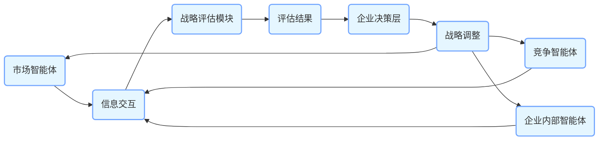

# 利用多智能体AI优化公司扩张战略评估

> 关键词：多智能体AI、公司扩张战略、战略评估、智能决策、优化算法

> 摘要：本文聚焦于利用多智能体AI技术来优化公司扩张战略评估这一重要课题。首先介绍了相关背景知识，包括目的、预期读者等内容。接着阐述了多智能体AI和公司扩张战略评估的核心概念及联系，详细讲解了核心算法原理与具体操作步骤，通过数学模型和公式深入剖析其内在逻辑，并结合实际案例进行说明。然后开展项目实战，展示开发环境搭建、源代码实现与解读。探讨了该技术在不同场景下的实际应用，推荐了相关学习资源、开发工具框架和论文著作。最后总结未来发展趋势与挑战，解答常见问题并提供扩展阅读与参考资料，旨在为企业借助多智能体AI实现更科学、高效的扩张战略评估提供全面且深入的指导。

## 1. 背景介绍 
### 1.1 目的和范围
在当今竞争激烈且复杂多变的商业环境中，公司的扩张战略决策至关重要。一个科学合理的扩张战略能够帮助企业抓住市场机遇，实现规模增长和效益提升；而错误的扩张决策则可能导致企业资源浪费、陷入经营困境。传统的公司扩张战略评估方法往往依赖于经验和有限的数据，难以全面、准确地考虑到市场动态、竞争对手行为以及内部资源等多方面因素的影响。

本研究的目的在于引入多智能体AI技术，利用其分布式、自适应和智能交互的特性，对公司扩张战略进行更全面、精准的评估。通过多智能体AI模拟不同的市场参与者和内部决策主体，考虑各种复杂的因素和动态变化，为企业提供更具前瞻性和科学性的扩张战略建议。

本研究的范围涵盖了多智能体AI的基本原理、算法实现，以及如何将其应用于公司扩张战略评估的各个环节，包括市场分析、战略制定、风险评估等。同时，通过实际案例展示多智能体AI在优化公司扩张战略评估中的具体应用效果。

### 1.2 预期读者
本文的预期读者包括企业战略规划人员、管理人员、市场营销人员等，他们需要深入了解如何利用先进的技术手段优化公司的扩张战略决策。此外，对多智能体AI技术感兴趣的研究人员、学者以及相关专业的学生也可以从本文中获取有价值的信息，了解多智能体AI在商业领域的应用场景和方法。

### 1.3 文档结构概述
本文共分为十个部分。第一部分为背景介绍，阐述研究的目的、范围、预期读者和文档结构概述，并对相关术语进行解释。第二部分介绍多智能体AI和公司扩张战略评估的核心概念及它们之间的联系，通过文本示意图和Mermaid流程图进行说明。第三部分详细讲解核心算法原理和具体操作步骤，使用Python源代码进行阐述。第四部分介绍数学模型和公式，并通过举例进行详细说明。第五部分开展项目实战，包括开发环境搭建、源代码详细实现和代码解读。第六部分探讨多智能体AI在公司扩张战略评估中的实际应用场景。第七部分推荐相关的学习资源、开发工具框架和论文著作。第八部分总结未来发展趋势与挑战。第九部分为附录，解答常见问题。第十部分提供扩展阅读与参考资料。

### 1.4 术语表
#### 1.4.1 核心术语定义
- **多智能体AI（Multi - Agent AI）**：是一种由多个智能体组成的人工智能系统。每个智能体具有一定的自主决策能力和感知环境的能力，它们通过相互协作和交互来完成共同的任务或实现特定的目标。
- **公司扩张战略**：指企业为了实现规模增长、市场份额扩大、利润提升等目标，采取的一系列进入新市场、拓展产品线、并购等战略举措。
- **战略评估**：对公司制定的战略方案进行全面、系统的分析和评价，以确定其可行性、有效性和风险程度，为战略决策提供依据。

#### 1.4.2 相关概念解释
- **智能体（Agent）**：在多智能体AI中，智能体是一个具有自主性、反应性、社会性和主动性的实体。它能够感知环境中的信息，根据自身的目标和规则进行决策，并采取相应的行动。
- **分布式系统**：多智能体AI是一种分布式系统，各个智能体分布在不同的位置或节点上，通过通信和协作来完成任务。这种分布式结构使得系统具有更好的灵活性、可扩展性和鲁棒性。
- **市场动态**：指市场中各种因素的变化情况，包括消费者需求、竞争对手行为、政策法规、技术创新等。市场动态的变化会对公司的扩张战略产生重要影响。

#### 1.4.3 缩略词列表
- **AI**：Artificial Intelligence（人工智能）
- **MAS**：Multi - Agent System（多智能体系统）

## 2. 核心概念与联系 

### 核心概念原理
#### 多智能体AI原理
多智能体AI的核心思想是将复杂的问题分解为多个相对简单的子问题，每个子问题由一个智能体来处理。智能体之间通过通信和协作来实现信息共享和协调行动。智能体通常具有以下几个关键特性：
- **自主性**：智能体能够在一定程度上独立地进行决策和行动，不受外部的直接控制。
- **反应性**：智能体能够感知环境的变化，并及时做出相应的反应。
- **社会性**：智能体能够与其他智能体进行交互和协作，共同完成任务。
- **主动性**：智能体能够主动地追求自己的目标，采取行动来实现这些目标。

#### 公司扩张战略评估原理
公司扩张战略评估是一个复杂的过程，需要综合考虑多个因素。一般来说，战略评估包括以下几个步骤：
- **环境分析**：对市场环境、竞争环境、政策法规等外部因素以及企业内部资源、能力等内部因素进行分析。
- **战略制定**：根据环境分析的结果，制定多种可能的扩张战略方案。
- **方案评估**：对制定的战略方案进行评估，考虑其可行性、收益性、风险等因素。
- **决策选择**：根据评估结果，选择最优的扩张战略方案。

### 架构的文本示意图
多智能体AI在公司扩张战略评估中的应用架构可以描述如下：

整个系统由多个智能体组成，包括市场智能体、竞争智能体、企业内部智能体等。市场智能体负责感知市场环境的变化，包括消费者需求、市场趋势等信息；竞争智能体负责收集竞争对手的信息，如竞争对手的战略、市场份额等；企业内部智能体负责管理企业的内部资源和能力，如人力资源、财务资源等。这些智能体通过通信网络进行信息交互和协作，共同对公司的扩张战略进行评估。评估结果反馈给企业决策层，为决策提供依据。

### Mermaid流程图


## 3. 核心算法原理 & 具体操作步骤 

### 核心算法原理
在利用多智能体AI优化公司扩张战略评估中，常用的算法包括强化学习算法和博弈论算法。

#### 强化学习算法
强化学习是一种通过智能体与环境进行交互来学习最优策略的算法。在公司扩张战略评估中，智能体可以看作是企业的决策主体，环境可以看作是市场环境和竞争环境。智能体通过采取不同的战略行动，观察环境的反馈（如收益、风险等），并根据反馈来调整自己的策略，以实现长期的最优收益。

强化学习的基本模型包括状态空间 $S$、动作空间 $A$、奖励函数 $R$ 和策略 $\pi$。智能体在每个时间步 $t$ 处于一个状态 $s_t \in S$，根据策略 $\pi$ 选择一个动作 $a_t \in A$，执行动作后环境会转移到下一个状态 $s_{t + 1} \in S$，并给予智能体一个奖励 $r_{t+1}=R(s_t,a_t,s_{t + 1})$。智能体的目标是最大化长期累积奖励。

#### 博弈论算法
博弈论是研究多个智能体之间策略互动的数学理论。在公司扩张战略评估中，企业需要考虑竞争对手的策略，以制定最优的扩张战略。博弈论可以帮助企业分析不同竞争对手的策略选择，并预测其可能的反应，从而制定出更具竞争力的战略。

博弈论中的经典模型包括囚徒困境、纳什均衡等。在公司扩张战略评估中，可以将企业和竞争对手看作博弈的参与者，不同的战略方案看作是参与者的策略，通过求解纳什均衡来确定最优的战略选择。

### 具体操作步骤
#### 步骤1：定义智能体和环境
- 定义市场智能体、竞争智能体和企业内部智能体，明确每个智能体的功能和职责。
- 定义环境，包括市场环境、竞争环境和企业内部环境，确定环境的状态空间和动作空间。

#### 步骤2：初始化智能体和环境
- 初始化智能体的参数和策略，如强化学习中的价值函数和策略函数。
- 初始化环境的状态，设置初始的市场条件、竞争态势和企业内部资源状况。

#### 步骤3：智能体交互和学习
- 市场智能体、竞争智能体和企业内部智能体通过通信网络进行信息交互。
- 企业内部智能体根据收集到的信息，选择一个扩张战略动作，并执行该动作。
- 环境根据智能体的动作进行状态转移，并给予智能体相应的奖励。
- 智能体根据奖励和环境的反馈，更新自己的策略和参数，进行学习。

#### 步骤4：战略评估和决策
- 根据智能体的学习结果，对不同的扩张战略方案进行评估，计算每个方案的收益、风险等指标。
- 根据评估结果，选择最优的扩张战略方案，为企业决策提供依据。

### Python源代码阐述
以下是一个简单的基于强化学习的多智能体AI在公司扩张战略评估中的Python示例代码：

```python
import numpy as np

# 定义状态空间和动作空间
state_space = 10  # 假设状态空间大小为10
action_space = 5  # 假设动作空间大小为5

# 初始化智能体的Q值表
Q_table = np.zeros((state_space, action_space))

# 定义超参数
alpha = 0.1  # 学习率
gamma = 0.9  # 折扣因子
epsilon = 0.1  # 探索率

# 定义奖励函数
def reward_function(state, action):
    # 这里简单定义一个奖励函数，实际应用中需要根据具体情况设计
    if state == 0 and action == 0:
        return 10
    else:
        return -1

# 定义智能体的动作选择策略
def choose_action(state):
    if np.random.uniform(0, 1) < epsilon:
        # 探索：随机选择一个动作
        action = np.random.choice(action_space)
    else:
        # 利用：选择Q值最大的动作
        action = np.argmax(Q_table[state, :])
    return action

# 强化学习训练过程
num_episodes = 1000
for episode in range(num_episodes):
    state = np.random.randint(0, state_space)  # 随机初始化状态
    done = False
    while not done:
        action = choose_action(state)
        reward = reward_function(state, action)
        # 简单假设下一个状态是随机的
        next_state = np.random.randint(0, state_space)
        
        # 更新Q值表
        Q_table[state, action] = Q_table[state, action] + alpha * (reward + gamma * np.max(Q_table[next_state, :]) - Q_table[state, action])
        
        state = next_state
        
        # 假设达到某个条件时结束当前回合
        if state == 9:
            done = True

# 输出最终的Q值表
print("Final Q-table:")
print(Q_table)
```

## 4. 数学模型和公式 & 详细讲解 & 举例说明 

### 强化学习数学模型
#### 马尔可夫决策过程（MDP）
强化学习通常基于马尔可夫决策过程（MDP）来建模。一个MDP可以用一个五元组 $(S, A, P, R, \gamma)$ 表示，其中：
- $S$ 是状态空间，包含所有可能的环境状态。
- $A$ 是动作空间，包含智能体可以采取的所有动作。
- $P(s'|s, a)$ 是状态转移概率，表示在状态 $s$ 下采取动作 $a$ 后转移到状态 $s'$ 的概率。
- $R(s, a, s')$ 是奖励函数，表示在状态 $s$ 下采取动作 $a$ 转移到状态 $s'$ 时获得的奖励。
- $\gamma \in [0, 1]$ 是折扣因子，用于权衡当前奖励和未来奖励的重要性。

#### 价值函数
在强化学习中，价值函数用于评估状态或状态 - 动作对的价值。常用的价值函数包括状态价值函数 $V(s)$ 和动作价值函数 $Q(s, a)$。

状态价值函数 $V(s)$ 表示从状态 $s$ 开始，遵循策略 $\pi$ 所能获得的长期累积奖励的期望值：
$$V^{\pi}(s) = \mathbb{E}_{\pi}\left[\sum_{t = 0}^{\infty}\gamma^{t}R_{t + 1}|S_0 = s\right]$$

动作价值函数 $Q(s, a)$ 表示在状态 $s$ 下采取动作 $a$，然后遵循策略 $\pi$ 所能获得的长期累积奖励的期望值：
$$Q^{\pi}(s, a) = \mathbb{E}_{\pi}\left[\sum_{t = 0}^{\infty}\gamma^{t}R_{t + 1}|S_0 = s, A_0 = a\right]$$

#### Q学习算法更新公式
Q学习是一种无模型的强化学习算法，用于学习最优的动作价值函数 $Q^*(s, a)$。Q学习的更新公式为：
$$Q(s_t, a_t) \leftarrow Q(s_t, a_t) + \alpha\left[R_{t + 1}+\gamma\max_{a}Q(s_{t + 1}, a)-Q(s_t, a_t)\right]$$
其中，$\alpha$ 是学习率，$\gamma$ 是折扣因子，$R_{t + 1}$ 是在状态 $s_t$ 下采取动作 $a_t$ 后获得的奖励，$s_{t + 1}$ 是下一个状态。

### 博弈论数学模型
#### 博弈的基本要素
一个博弈可以用一个三元组 $(N, S, u)$ 表示，其中：
- $N$ 是参与者集合，包含所有参与博弈的智能体。
- $S = S_1\times S_2\times\cdots\times S_n$ 是策略空间，其中 $S_i$ 是参与者 $i$ 的策略集合。
- $u=(u_1, u_2,\cdots, u_n)$ 是效用函数，其中 $u_i(s)$ 表示参与者 $i$ 在策略组合 $s=(s_1, s_2,\cdots, s_n)$ 下的效用。

#### 纳什均衡
纳什均衡是博弈论中的一个重要概念，表示在一个策略组合中，每个参与者的策略都是对其他参与者策略的最优反应。对于一个博弈 $(N, S, u)$，策略组合 $s^*=(s_1^*, s_2^*,\cdots, s_n^*)$ 是纳什均衡的充要条件是：
$$u_i(s_i^*, s_{-i}^*)\geq u_i(s_i, s_{-i}^*),\quad\forall s_i\in S_i, \forall i\in N$$
其中，$s_{-i}^*=(s_1^*,\cdots, s_{i - 1}^*, s_{i+1}^*,\cdots, s_n^*)$ 表示除参与者 $i$ 之外的其他参与者的策略组合。

### 举例说明
#### 强化学习举例
假设一个企业在市场中面临两种状态：高需求状态和低需求状态（$S=\{s_1, s_2\}$），企业可以采取两种扩张战略：激进扩张和保守扩张（$A=\{a_1, a_2\}$）。奖励函数如下：
- 在高需求状态下采取激进扩张战略，奖励为 10；采取保守扩张战略，奖励为 5。
- 在低需求状态下采取激进扩张战略，奖励为 -5；采取保守扩张战略，奖励为 2。

折扣因子 $\gamma = 0.9$，学习率 $\alpha = 0.1$。初始时，$Q(s_1, a_1)=0$，$Q(s_1, a_2)=0$，$Q(s_2, a_1)=0$，$Q(s_2, a_2)=0$。

假设当前状态为 $s_1$，智能体选择动作 $a_1$，获得奖励 $R = 10$，下一个状态为 $s_2$。根据Q学习更新公式：
$$Q(s_1, a_1) \leftarrow Q(s_1, a_1) + 0.1\times