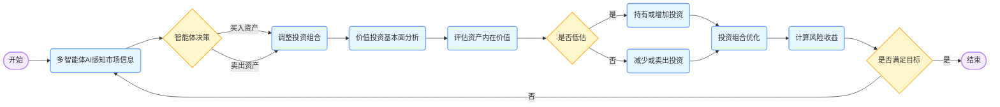

# 利用多智能体AI优化投资组合：价值投资新范式

> 关键词：多智能体AI、投资组合优化、价值投资、新范式、金融市场

> 摘要：本文聚焦于利用多智能体AI来优化投资组合，探讨其作为价值投资新范式的相关内容。首先介绍了研究的背景和目的，包括在金融市场中应用多智能体AI的意义和预期读者范围等。接着阐述了多智能体AI、投资组合优化和价值投资的核心概念及它们之间的联系，给出了相应的原理和架构示意图以及Mermaid流程图。详细讲解了核心算法原理，并使用Python源代码进行说明，同时给出了相关的数学模型和公式及具体例子。通过项目实战展示了代码的实际案例和详细解释，分析了代码实现和解读。探讨了多智能体AI优化投资组合在金融市场中的实际应用场景。推荐了学习、开发工具框架以及相关论文著作等资源。最后总结了未来发展趋势与挑战，提供了常见问题解答和扩展阅读参考资料。

## 1. 背景介绍 
### 1.1 目的和范围
在金融市场中，投资组合的优化一直是投资者关注的核心问题。传统的投资组合优化方法往往基于一些假设和简化，难以应对复杂多变的市场环境。随着人工智能技术的发展，多智能体AI为投资组合优化提供了新的思路和方法。本文的目的是深入探讨如何利用多智能体AI来优化投资组合，为价值投资带来新的范式。

本文的范围涵盖了多智能体AI的基本概念、投资组合优化的原理、价值投资的理念，以及如何将多智能体AI应用于投资组合优化的具体方法和实践。同时，还将探讨这种新范式在金融市场中的实际应用场景和未来发展趋势。

### 1.2 预期读者
本文预期读者包括金融从业者，如投资经理、分析师等，他们希望了解如何利用新兴的人工智能技术来优化投资组合，提高投资绩效。同时，也适合对人工智能和金融领域交叉研究感兴趣的科研人员、学生，以及对价值投资有深入思考的投资者。

### 1.3 文档结构概述
本文将按照以下结构进行阐述：首先介绍相关的背景信息，包括目的、预期读者和文档结构。接着讲解多智能体AI、投资组合优化和价值投资的核心概念及其联系，并给出相应的原理和架构示意图以及Mermaid流程图。然后详细介绍核心算法原理，并用Python源代码进行说明，同时给出数学模型和公式及具体例子。通过项目实战展示代码的实际应用和详细解释。探讨多智能体AI优化投资组合在金融市场中的实际应用场景。推荐学习、开发工具框架以及相关论文著作等资源。最后总结未来发展趋势与挑战，提供常见问题解答和扩展阅读参考资料。

### 1.4 术语表
#### 1.4.1 核心术语定义
- **多智能体AI**：由多个智能体组成的人工智能系统，每个智能体具有一定的自主决策能力，它们之间可以相互协作、竞争，共同完成复杂的任务。
- **投资组合优化**：在一定的风险约束下，通过合理分配资金到不同的资产中，以实现投资收益最大化的过程。
- **价值投资**：一种基于对资产内在价值评估的投资策略，投资者通过分析公司的基本面等因素，寻找被低估的资产进行投资。

#### 1.4.2 相关概念解释
- **智能体**：在多智能体AI中，智能体是具有感知、决策和行动能力的实体。它可以根据自身的目标和环境信息，做出相应的决策并采取行动。
- **资产配置**：投资组合优化中的一个重要环节，指的是将资金分配到不同类型的资产，如股票、债券、基金等。
- **风险度量**：用于衡量投资组合风险的指标，常见的有标准差、夏普比率等。

#### 1.4.3 缩略词列表
- **AI**：Artificial Intelligence，人工智能
- **MDP**：Markov Decision Process，马尔可夫决策过程
- **Sharpe Ratio**：夏普比率

## 2. 核心概念与联系 

### 2.1 核心概念原理
#### 2.1.1 多智能体AI原理
多智能体AI系统由多个智能体组成，每个智能体可以看作是一个独立的决策单元。智能体具有感知环境的能力，能够获取周围的信息，如市场价格、交易量等。根据这些信息，智能体可以依据自身的决策规则做出行动，例如买入或卖出某种资产。智能体之间可以通过通信进行协作或竞争，以实现共同的目标或各自的利益最大化。

多智能体AI的决策过程通常基于一定的算法和模型，如强化学习、博弈论等。强化学习可以让智能体通过与环境的交互不断学习，调整自己的策略以获得最大的奖励。博弈论则用于分析智能体之间的竞争和合作关系，帮助智能体做出最优的决策。

#### 2.1.2 投资组合优化原理
投资组合优化的目标是在风险和收益之间找到一个平衡点。根据现代投资组合理论，不同资产之间的收益率和风险具有一定的相关性。通过合理配置资产，可以降低投资组合的整体风险，同时提高收益。

投资组合优化的过程通常包括以下几个步骤：首先，确定投资的目标和约束条件，如期望收益率、最大风险容忍度等。然后，选择合适的资产作为投资对象，并对这些资产的收益率和风险进行估计。接下来，使用优化算法求解最优的资产配置方案，使得投资组合在满足约束条件的情况下达到最优的风险 - 收益平衡。

#### 2.1.3 价值投资原理
价值投资的核心思想是寻找被市场低估的资产。投资者通过对公司的基本面进行分析，包括财务报表、行业前景、管理层能力等，评估公司的内在价值。如果市场价格低于公司的内在价值，投资者认为该资产具有投资价值，从而买入并持有，等待市场价格回归内在价值以获取收益。

价值投资强调长期投资和基本面分析，注重资产的内在质量和盈利能力，而不是短期的市场波动。

### 2.2 核心概念架构的文本示意图
```plaintext
多智能体AI
|-- 智能体1
|   |-- 感知模块
|   |-- 决策模块
|   |-- 行动模块
|-- 智能体2
|   |-- 感知模块
|   |-- 决策模块
|   |-- 行动模块
|--...
|-- 通信模块

投资组合优化
|-- 目标设定
|-- 资产选择
|-- 风险收益估计
|-- 优化算法求解

价值投资
|-- 基本面分析
|   |-- 财务报表分析
|   |-- 行业前景分析
|   |-- 管理层能力分析
|-- 内在价值评估
|-- 投资决策
```

### 2.3 Mermaid流程图


## 3. 核心算法原理 & 具体操作步骤 

### 3.1 核心算法原理
在利用多智能体AI优化投资组合中，我们可以采用强化学习算法，如深度Q网络（Deep Q-Network，DQN）。DQN是一种结合了深度学习和Q学习的算法，用于解决马尔可夫决策过程（MDP）问题。

在投资组合优化的场景中，智能体的状态可以表示为当前投资组合的资产配置、市场价格等信息。智能体的动作可以是买入、卖出或持有某种资产。智能体的目标是通过不断与环境交互，学习到最优的策略，使得投资组合的长期收益最大化。

DQN的核心思想是使用一个深度神经网络来近似Q值函数。Q值函数表示在某个状态下采取某个动作的预期累积奖励。智能体通过不断更新神经网络的参数，使得Q值函数能够更准确地估计Q值，从而找到最优的动作。

### 3.2 具体操作步骤
#### 3.2.1 定义状态空间
状态空间可以表示为一个向量，包含当前投资组合中各种资产的比例、市场价格、收益率等信息。例如，假设我们有 $n$ 种资产，状态向量 $s$ 可以表示为：
$$s = [w_1, w_2, \cdots, w_n, p_1, p_2, \cdots, p_n, r_1, r_2, \cdots, r_n]$$
其中 $w_i$ 是第 $i$ 种资产在投资组合中的比例，$p_i$ 是第 $i$ 种资产的市场价格，$r_i$ 是第 $i$ 种资产的收益率。

#### 3.2.2 定义动作空间
动作空间可以表示为买入、卖出或持有某种资产的操作。例如，对于 $n$ 种资产，动作空间可以表示为一个 $n$ 维向量，每个元素取值为 $-1$（卖出）、$0$（持有）或 $1$（买入）。

#### 3.2.3 定义奖励函数
奖励函数用于衡量智能体采取某个动作后的收益情况。一种简单的奖励函数可以定义为投资组合的收益率：
$$R = \sum_{i=1}^{n} w_i r_i$$
其中 $R$ 是投资组合的收益率，$w_i$ 是第 $i$ 种资产在投资组合中的比例，$r_i$ 是第 $i$ 种资产的收益率。

#### 3.2.4 训练DQN网络
使用DQN算法训练智能体，具体步骤如下：
1. 初始化DQN网络的参数 $\theta$ 和目标网络的参数 $\theta^-$。
2. 初始化经验回放缓冲区 $D$。
3. 对于每个训练回合：
    - 初始化状态 $s_1$。
    - 对于每个时间步 $t$：
        - 根据当前状态 $s_t$，使用 $\epsilon$-贪心策略选择动作 $a_t$。
        - 执行动作 $a_t$，得到下一个状态 $s_{t+1}$ 和奖励 $R_t$。
        - 将 $(s_t, a_t, R_t, s_{t+1})$ 存储到经验回放缓冲区 $D$ 中。
        - 从经验回放缓冲区 $D$ 中随机采样一批数据 $(s_j, a_j, R_j, s_{j+1})$。
        - 计算目标Q值 $y_j$：
$$y_j = R_j + \gamma \max_{a'} Q(s_{j+1}, a'; \theta^-)$$
其中 $\gamma$ 是折扣因子。
        - 使用均方误差损失函数更新DQN网络的参数 $\theta$：
$$L(\theta) = \frac{1}{N} \sum_{j=1}^{N} (y_j - Q(s_j, a_j; \theta))^2$$
        - 每隔一定的时间步，将目标网络的参数 $\theta^-$ 更新为 $\theta$。

### 3.3 Python源代码实现
```python
import numpy as np
import torch
import torch.nn as nn
import torch.optim as optim
import random

# 定义DQN网络
class DQN(nn.Module):
    def __init__(self, state_size, action_size):
        super(DQN, self).__init__()
        self.fc1 = nn.Linear(state_size, 64)
        self.fc2 = nn.Linear(64, 64)
        self.fc3 = nn.Linear(64, action_size)

    def forward(self, x):
        x = torch.relu(self.fc1(x))
        x = torch.relu(self.fc2(x))
        x = self.fc3(x)
        return x

# 定义智能体类
class Agent:
    def __init__(self, state_size, action_size):
        self.state_size = state_size
        self.action_size = action_size
        self.gamma = 0.95  # 折扣因子
        self.epsilon = 1.0  # 探索率
        self.epsilon_min = 0.01
        self.epsilon_decay = 0.995
        self.learning_rate = 0.001
        self.model = DQN(state_size, action_size)
        self.target_model = DQN(state_size, action_size)
        self.optimizer = optim.Adam(self.model.parameters(), lr=self.learning_rate)
        self.memory = []
        self.batch_size = 32

    def remember(self, state, action, reward, next_state):
        self.memory.append((state, action, reward, next_state))

    def act(self, state):
        if np.random.rand() <= self.epsilon:
            return random.randrange(self.action_size)
        state = torch.FloatTensor(state).unsqueeze(0)
        act_values = self.model(state)
        action = np.argmax(act_values.detach().numpy())
        return action

    def replay(self):
        if len(self.memory) < self.batch_size:
            return
        minibatch = random.sample(self.memory, self.batch_size)
        for state, action, reward, next_state in minibatch:
            state = torch.FloatTensor(state).unsqueeze(0)
            next_state = torch.FloatTensor(next_state).unsqueeze(0)
            target = reward + self.gamma * torch.max(self.target_model(next_state)).item()
            target_f = self.model(state)
            target_f[0][action] = target
            self.optimizer.zero_grad()
            loss = nn.MSELoss()(self.model(state), target_f)
            loss.backward()
            self.optimizer.step()
        if self.epsilon > self.epsilon_min:
            self.epsilon *= self.epsilon_decay

    def update_target_model(self):
        self.target_model.load_state_dict(self.model.state_dict())

# 模拟投资环境
class InvestmentEnv:
    def __init__(self, num_assets):
        self.num_assets = num_assets
        self.state_size = 3 * num_assets  # 资产比例、价格、收益率
        self.action_size = num_assets * 3  # 买入、卖出、持有

    def reset(self):
        # 初始化状态
        initial_weights = np.ones(self.num_assets) / self.num_assets
        initial_prices = np.random.uniform(10, 100, self.num_assets)
        initial_returns = np.random.uniform(-0.1, 0.1, self.num_assets)
        state = np.concatenate([initial_weights, initial_prices, initial_returns])
        return state

    def step(self, state, action):
        # 执行动作，更新状态和奖励
        weights = state[:self.num_assets]
        prices = state[self.num_assets:2 * self.num_assets]
        returns = state[2 * self.num_assets:]

        # 处理动作
        action = action % self.num_assets
        action_type = action // self.num_assets
        if action_type == 0:  # 买入
            weights[action] += 0.1
        elif action_type == 1:  # 卖出
            weights[action] -= 0.1
        weights = np.clip(weights, 0, 1)
        weights = weights / np.sum(weights)

        # 更新价格和收益率
        new_prices = prices * (1 + np.random.uniform(-0.05, 0.05, self.num_assets))
        new_returns = (new_prices - prices) / prices

        # 计算奖励
        reward = np.sum(weights * new_returns)

        new_state = np.concatenate([weights, new_prices, new_returns])
        return new_state, reward

# 训练智能体
if __name__ == "__main__":
    num_assets = 3
    env = InvestmentEnv(num_assets)
    state_size = env.state_size
    action_size = env.action_size
    agent = Agent(state_size, action_size)
    episodes = 100
    for e in range(episodes):
        state = env.reset()
        total_reward = 0
        for time in range(50):
            action = agent.act(state)
            next_state, reward = env.step(state, action)
            agent.remember(state, action, reward, next_state)
            agent.replay()
            state = next_state
            total_reward += reward
        agent.update_target_model()
        print(f"Episode: {e + 1}/{episodes}, Total Reward: {total_reward}")
```

## 4. 数学模型和公式 & 详细讲解 & 举例说明 

### 4.1 马尔可夫决策过程（MDP）模型
马尔可夫决策过程是一个五元组 $(S, A, P, R, \gamma)$，其中：
- $S$ 是状态空间，表示系统可能处于的所有状态。在投资组合优化中，状态可以表示为当前投资组合的资产配置、市场价格等信息。
- $A$ 是动作空间，表示智能体可以采取的所有动作。在投资组合优化中，动作可以是买入、卖出或持有某种资产。
- $P(s'|s, a)$ 是状态转移概率，表示在状态 $s$ 下采取动作 $a$ 后转移到状态 $s'$ 的概率。在实际应用中，状态转移概率可能是未知的，需要通过智能体与环境的交互来估计。
- $R(s, a, s')$ 是奖励函数，表示在状态 $s$ 下采取动作 $a$ 后转移到状态 $s'$ 所获得的奖励。在投资组合优化中，奖励可以定义为投资组合的收益率。
- $\gamma$ 是折扣因子，取值范围为 $[0, 1]$，用于衡量未来奖励的重要性。

### 4.2 Q值函数和最优Q值函数
Q值函数 $Q(s, a)$ 表示在状态 $s$ 下采取动作 $a$ 的预期累积奖励，定义为：
$$Q(s, a) = \mathbb{E} \left[ \sum_{t=0}^{\infty} \gamma^t R(s_t, a_t, s_{t+1}) \mid s_0 = s, a_0 = a \right]$$
其中 $\mathbb{E}$ 表示期望运算符。

最优Q值函数 $Q^*(s, a)$ 表示在状态 $s$ 下采取动作 $a$ 所能获得的最大预期累积奖励，定义为：
$$Q^*(s, a) = \max_{\pi} \mathbb{E} \left[ \sum_{t=0}^{\infty} \gamma^t R(s_t, a_t, s_{t+1}) \mid s_0 = s, a_0 = a, \pi \right]$$
其中 $\pi$ 是策略，表示智能体在每个状态下选择动作的规则。

### 4.3 Bellman方程
Bellman方程描述了Q值函数的递归关系，对于最优Q值函数有：
$$Q^*(s, a) = \mathbb{E} \left[ R(s, a, s') + \gamma \max_{a'} Q^*(s', a') \right]$$
这个方程表明，在状态 $s$ 下采取动作 $a$ 的最优Q值等于当前奖励加上下一个状态的最大最优Q值的折扣。

### 4.4 举例说明
假设我们有一个简单的投资组合优化问题，只有两种资产 $A$ 和 $B$。状态空间 $S$ 可以表示为投资组合中资产 $A$ 和 $B$ 的比例，动作空间 $A$ 可以表示为买入、卖出或持有资产 $A$ 或 $B$。

假设当前状态 $s$ 下，资产 $A$ 的比例为 $0.6$，资产 $B$ 的比例为 $0.4$。智能体采取动作 $a$ 为买入资产 $A$，则状态转移到 $s'$，资产 $A$ 的比例变为 $0.7$，资产 $B$ 的比例变为 $0.3$。假设奖励函数 $R(s, a, s')$ 为投资组合的收益率，经过计算得到收益率为 $0.05$。

假设折扣因子 $\gamma = 0.9$，下一个状态 $s'$ 的最大最优Q值为 $0.2$，则根据Bellman方程，当前状态 $s$ 下采取动作 $a$ 的最优Q值为：
$$Q^*(s, a) = 0.05 + 0.9 \times 0.2 = 0.23$$

## 5. 项目实战：代码实际案例和详细解释说明 

### 5.1  开发环境搭建
#### 5.1.1 安装Python
首先需要安装Python，建议使用Python 3.7及以上版本。可以从Python官方网站（https://www.python.org/downloads/） 下载并安装。

#### 5.1.2 安装必要的库
在项目中，我们使用了 `numpy`、`torch` 等库。可以使用以下命令进行安装：
```sh
pip install numpy torch
```

### 5.2  源代码详细实现和代码解读
```python
import numpy as np
import torch
import torch.nn as nn
import torch.optim as optim
import random

# 定义DQN网络
class DQN(nn.Module):
    def __init__(self, state_size, action_size):
        super(DQN, self).__init__()
        self.fc1 = nn.Linear(state_size, 64)
        self.fc2 = nn.Linear(64, 64)
        self.fc3 = nn.Linear(64, action_size)

    def forward(self, x):
        x = torch.relu(self.fc1(x))
        x = torch.relu(self.fc2(x))
        x = self.fc3(x)
        return x
```
**代码解读**：
- 定义了一个DQN网络类 `DQN`，继承自 `nn.Module`。
- `__init__` 方法初始化了网络的三层全连接层，输入层的大小为 `state_size`，输出层的大小为 `action_size`。
- `forward` 方法定义了网络的前向传播过程，使用ReLU激活函数。

```python
# 定义智能体类
class Agent:
    def __init__(self, state_size, action_size):
        self.state_size = state_size
        self.action_size = action_size
        self.gamma = 0.95  # 折扣因子
        self.epsilon = 1.0  # 探索率
        self.epsilon_min = 0.01
        self.epsilon_decay = 0.995
        self.learning_rate = 0.001
        self.model = DQN(state_size, action_size)
        self.target_model = DQN(state_size, action_size)
        self.optimizer = optim.Adam(self.model.parameters(), lr=self.learning_rate)
        self.memory = []
        self.batch_size = 32

    def remember(self, state, action, reward, next_state):
        self.memory.append((state, action, reward, next_state))

    def act(self, state):
        if np.random.rand() <= self.epsilon:
            return random.randrange(self.action_size)
        state = torch.FloatTensor(state).unsqueeze(0)
        act_values = self.model(state)
        action = np.argmax(act_values.detach().numpy())
        return action

    def replay(self):
        if len(self.memory) < self.batch_size:
            return
        minibatch = random.sample(self.memory, self.batch_size)
        for state, action, reward, next_state in minibatch:
            state = torch.FloatTensor(state).unsqueeze(0)
            next_state = torch.FloatTensor(next_state).unsqueeze(0)
            target = reward + self.gamma * torch.max(self.target_model(next_state)).item()
            target_f = self.model(state)
            target_f[0][action] = target
            self.optimizer.zero_grad()
            loss = nn.MSELoss()(self.model(state), target_f)
            loss.backward()
            self.optimizer.step()
        if self.epsilon > self.epsilon_min:
            self.epsilon *= self.epsilon_decay

    def update_target_model(self):
        self.target_model.load_state_dict(self.model.state_dict())
```
**代码解读**：
- 定义了智能体类 `Agent`。
- `__init__` 方法初始化了智能体的各种参数，包括折扣因子、探索率、学习率等，同时初始化了DQN网络和目标网络，以及优化器和经验回放缓冲区。
- `remember` 方法用于将智能体的经验存储到经验回放缓冲区中。
- `act` 方法使用 $\epsilon$-贪心策略选择动作，在探索阶段随机选择动作，在利用阶段选择Q值最大的动作。
- `replay` 方法从经验回放缓冲区中随机采样一批数据，计算目标Q值，更新DQN网络的参数，并逐渐降低探索率。
- `update_target_model` 方法用于更新目标网络的参数。

```python
# 模拟投资环境
class InvestmentEnv:
    def __init__(self, num_assets):
        self.num_assets = num_assets
        self.state_size = 3 * num_assets  # 资产比例、价格、收益率
        self.action_size = num_assets * 3  # 买入、卖出、持有

    def reset(self):
        # 初始化状态
        initial_weights = np.ones(self.num_assets) / self.num_assets
        initial_prices = np.random.uniform(10, 100, self.num_assets)
        initial_returns = np.random.uniform(-0.1, 0.1, self.num_assets)
        state = np.concatenate([initial_weights, initial_prices, initial_returns])
        return state

    def step(self, state, action):
        # 执行动作，更新状态和奖励
        weights = state[:self.num_assets]
        prices = state[self.num_assets:2 * self.num_assets]
        returns = state[2 * self.num_assets:]

        # 处理动作
        action = action % self.num_assets
        action_type = action // self.num_assets
        if action_type == 0:  # 买入
            weights[action] += 0.1
        elif action_type == 1:  # 卖出
            weights[action] -= 0.1
        weights = np.clip(weights, 0, 1)
        weights = weights / np.sum(weights)

        # 更新价格和收益率
        new_prices = prices * (1 + np.random.uniform(-0.05, 0.05, self.num_assets))
        new_returns = (new_prices - prices) / prices

        # 计算奖励
        reward = np.sum(weights * new_returns)

        new_state = np.concatenate([weights, new_prices, new_returns])
        return new_state, reward
```
**代码解读**：
- 定义了模拟投资环境类 `InvestmentEnv`。
- `__init__` 方法初始化了投资环境的参数，包括资产数量、状态空间大小和动作空间大小。
- `reset` 方法用于初始化环境的状态，随机生成初始的资产比例、价格和收益率。
- `step` 方法根据智能体的动作更新环境的状态和奖励，包括处理动作、更新资产比例、价格和收益率，计算奖励等。

```python
# 训练智能体
if __name__ == "__main__":
    num_assets = 3
    env = InvestmentEnv(num_assets)
    state_size = env.state_size
    action_size = env.action_size
    agent = Agent(state_size, action_size)
    episodes = 100
    for e in range(episodes):
        state = env.reset()
        total_reward = 0
        for time in range(50):
            action = agent.act(state)
            next_state, reward = env.step(state, action)
            agent.remember(state, action, reward, next_state)
            agent.replay()
            state = next_state
            total_reward += reward
        agent.update_target_model()
        print(f"Episode: {e + 1}/{episodes}, Total Reward: {total_reward}")
```
**代码解读**：
- 主程序部分，初始化了投资环境和智能体，设置了训练的回合数。
- 对于每个回合，重置环境状态，智能体与环境交互，执行动作，更新状态和奖励，存储经验，进行回放训练，并更新目标网络。
- 最后打印每个回合的总奖励。

### 5.3  代码解读与分析
通过上述代码，我们实现了一个基于DQN算法的多智能体AI来优化投资组合。智能体通过不断与模拟投资环境交互，学习到最优的投资策略，使得投资组合的长期收益最大化。

在代码中，使用了经验回放和目标网络的技术来提高训练的稳定性和效率。经验回放可以打破数据之间的相关性，目标网络可以减少Q值估计的偏差。

同时，使用了 $\epsilon$-贪心策略来平衡探索和利用。在训练初期，智能体以较高的概率随机选择动作，以探索不同的投资策略；随着训练的进行，探索率逐渐降低，智能体更多地选择Q值最大的动作，以利用已经学习到的知识。

## 6. 实际应用场景 
### 6.1 量化投资
在量化投资领域，多智能体AI可以用于构建投资策略。智能体可以根据市场数据、公司基本面等信息，自动调整投资组合的资产配置。例如，不同的智能体可以负责不同类型的资产，如股票、债券、期货等，它们之间相互协作，共同优化投资组合的风险 - 收益特征。

### 6.2 对冲基金管理
对冲基金需要在复杂的市场环境中寻找投资机会，同时控制风险。多智能体AI可以帮助对冲基金经理更好地理解市场动态，发现潜在的投资机会。智能体可以通过分析大量的市场数据和新闻信息，识别市场趋势和异常情况，及时调整投资组合，实现对冲和套利。

### 6.3 个人投资
对于个人投资者来说，多智能体AI可以提供个性化的投资建议。根据个人的投资目标、风险承受能力等因素，智能体可以为投资者定制合适的投资组合。同时，智能体可以实时监测市场变化，提醒投资者调整投资策略，帮助投资者实现资产的保值增值。

## 7. 工具和资源推荐
### 7.1 学习资源推荐
#### 7.1.1 书籍推荐
- 《深度学习》（Deep Learning）：由Ian Goodfellow、Yoshua Bengio和Aaron Courville所著，是深度学习领域的经典教材，涵盖了深度学习的基本原理、算法和应用。
- 《强化学习：原理与Python实现》：详细介绍了强化学习的基本概念、算法和应用，通过Python代码实现了各种强化学习算法。
- 《金融市场的人工智能》：探讨了人工智能在金融市场中的应用，包括投资组合优化、风险预测等方面。

#### 7.1.2 在线课程
- Coursera上的“Deep Learning Specialization”：由Andrew Ng教授授课，是深度学习领域的经典在线课程，涵盖了深度学习的各个方面。
- edX上的“Reinforcement Learning”：介绍了强化学习的基本原理和算法，通过实际案例和代码实现帮助学生掌握强化学习的应用。
- Udemy上的“Algorithmic Trading with Python”：讲解了如何使用Python进行算法交易，包括数据获取、策略开发和回测等内容。

#### 7.1.3 技术博客和网站
- Medium：上面有很多关于人工智能和金融领域的技术博客文章，涵盖了最新的研究成果和实践经验。
- Towards Data Science：专注于数据科学和人工智能领域的技术博客，提供了丰富的学习资源和案例分析。
- arXiv：是一个预印本平台，上面可以找到最新的人工智能和金融领域的研究论文。

### 7.2 开发工具框架推荐
#### 7.2.1 IDE和编辑器
- PyCharm：是一款专业的Python集成开发环境，提供了丰富的代码编辑、调试和项目管理功能。
- Jupyter Notebook：是一个交互式的开发环境，适合进行数据探索和模型开发，支持多种编程语言。
- Visual Studio Code：是一款轻量级的代码编辑器，支持多种编程语言和插件，具有强大的代码编辑和调试功能。

#### 7.2.2 调试和性能分析工具
- TensorBoard：是TensorFlow提供的可视化工具，可以用于可视化模型的训练过程、参数变化等信息，帮助开发者进行调试和性能分析。
- PyTorch Profiler：是PyTorch提供的性能分析工具，可以用于分析模型的运行时间、内存使用等情况，帮助开发者优化模型性能。
- cProfile：是Python标准库中的性能分析工具，可以用于分析Python代码的运行时间和函数调用情况。

#### 7.2.3 相关框架和库
- PyTorch：是一个开源的深度学习框架，提供了丰富的神经网络层和优化算法，支持GPU加速，广泛应用于人工智能领域。
- TensorFlow：是另一个开源的深度学习框架，具有强大的分布式计算能力和可视化工具，被广泛应用于工业界和学术界。
- Stable Baselines3：是一个基于PyTorch的强化学习库，提供了多种强化学习算法的实现，方便开发者进行强化学习的实验和应用。

### 7.3 相关论文著作推荐
#### 7.3.1 经典论文
- “Playing Atari with Deep Reinforcement Learning”：提出了深度Q网络（DQN）算法，开启了深度强化学习在游戏领域的应用。
- “Markowitz Portfolio Selection”：提出了现代投资组合理论，为投资组合优化提供了理论基础。
- “Value Investing: The Use of Historical Financial Statement Information to Separate Winners from Losers”：阐述了价值投资的理论和方法，通过历史财务报表信息来筛选有投资价值的股票。

#### 7.3.2 最新研究成果
- 可以关注arXiv上关于人工智能和金融领域的最新研究论文，了解多智能体AI在投资组合优化中的最新应用和发展趋势。
- 一些顶级学术会议，如NeurIPS（神经信息处理系统大会）、ICML（国际机器学习会议）等，也会发表关于人工智能和金融领域的最新研究成果。

#### 7.3.3 应用案例分析
- 可以参考一些金融机构和研究机构发布的关于多智能体AI在投资组合优化中的应用案例分析报告，了解实际应用中的经验和挑战。

## 8. 总结：未来发展趋势与挑战
### 8.1 未来发展趋势
#### 8.1.1 多智能体协作优化
未来，多智能体AI在投资组合优化中的应用将更加注重智能体之间的协作。不同类型的智能体可以负责不同的任务，如市场预测、风险评估、资产配置等，它们之间通过协作和信息共享，共同优化投资组合的性能。

#### 8.1.2 融合更多数据源
随着数据技术的发展，多智能体AI将能够融合更多的数据源，如社交媒体数据、新闻信息、宏观经济数据等。通过分析这些多源数据，智能体可以更全面地了解市场动态，提高投资决策的准确性。

#### 8.1.3 与区块链技术结合
区块链技术具有去中心化、不可篡改等特点，可以为多智能体AI在投资组合优化中的应用提供更安全、可信的环境。例如，区块链可以用于记录投资交易信息，确保数据的真实性和完整性，同时实现智能合约的自动执行，提高投资效率。

### 8.2 挑战
#### 8.2.1 数据质量和隐私问题
多智能体AI需要大量的高质量数据进行训练和决策。然而，金融数据往往存在噪声、缺失值等问题，数据质量难以保证。同时，金融数据涉及到用户的隐私和敏感信息，如何在保护数据隐私的前提下进行数据的采集和分析是一个挑战。

#### 8.2.2 模型可解释性问题
多智能体AI模型通常是复杂的深度学习模型，其决策过程难以解释。在金融领域，投资者和监管机构需要了解模型的决策依据，以评估投资风险。因此，如何提高多智能体AI模型的可解释性是一个亟待解决的问题。

#### 8.2.3 市场不确定性和黑天鹅事件
金融市场具有高度的不确定性，经常会出现黑天鹅事件，如金融危机、突发事件等。多智能体AI模型在面对这些极端情况时，可能无法准确预测市场变化，导致投资损失。如何提高模型的鲁棒性和适应性，应对市场的不确定性是一个挑战。

## 9. 附录：常见问题与解答
### 9.1 多智能体AI优化投资组合与传统投资组合优化方法有什么区别？
传统投资组合优化方法通常基于一些假设和简化，如资产收益率服从正态分布等，难以应对复杂多变的市场环境。而多智能体AI可以通过学习大量的市场数据，自动发现市场规律和投资机会，具有更强的适应性和灵活性。同时，多智能体AI可以考虑智能体之间的协作和竞争关系，实现更优化的投资决策。

### 9.2 多智能体AI模型的训练时间和计算资源需求如何？
多智能体AI模型的训练时间和计算资源需求取决于模型的复杂度、数据量和训练算法等因素。一般来说，深度学习模型的训练需要大量的计算资源，如GPU等。训练时间可能从几小时到几天甚至更长，具体取决于实际情况。可以通过优化模型结构、使用分布式计算等方法来减少训练时间和计算资源需求。

### 9.3 如何评估多智能体AI优化投资组合的性能？
可以使用一些常见的投资组合评估指标，如夏普比率、最大回撤、年化收益率等。夏普比率衡量了投资组合的风险调整后收益，最大回撤反映了投资组合在一段时间内的最大损失，年化收益率表示投资组合的平均年化收益。同时，还可以进行回测实验，使用历史数据来验证模型的性能。

## 10. 扩展阅读 & 参考资料
### 10.1 扩展阅读
- 《人工智能时代的金融科技》：探讨了人工智能在金融科技领域的应用和发展趋势。
- 《智能投资新范式》：介绍了新兴的智能投资方法和技术，包括多智能体AI在投资领域的应用。

### 10.2 参考资料
- Goodfellow, I., Bengio, Y., & Courville, A. (2016). Deep Learning. MIT Press.
- Sutton, R. S., & Barto, A. G. (2018). Reinforcement Learning: An Introduction. MIT Press.
- Markowitz, H. M. (1952). Portfolio Selection. The Journal of Finance, 7(1), 77 - 91.

作者：AI天才研究院/AI Genius Institute & 禅与计算机程序设计艺术 /Zen And The Art of Computer Programming