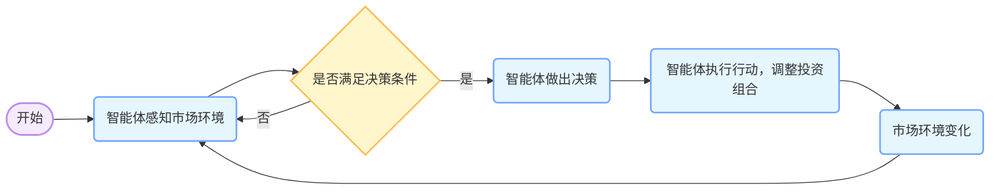

# 利用多智能体AI优化投资组合：价值投资的新纪元

> 关键词：多智能体AI、投资组合优化、价值投资、金融市场、强化学习

> 摘要：本文深入探讨了如何利用多智能体AI技术来优化投资组合，开启价值投资的新纪元。首先介绍了相关背景，包括目的、预期读者、文档结构和术语表。接着阐述了多智能体AI、投资组合优化和价值投资的核心概念及其联系，并给出了原理和架构的文本示意图与Mermaid流程图。详细讲解了核心算法原理，通过Python源代码进行了具体操作步骤的阐述，同时给出了相关数学模型和公式，并举例说明。在项目实战部分，展示了开发环境搭建、源代码详细实现和代码解读。分析了多智能体AI优化投资组合在金融市场的实际应用场景，推荐了学习资源、开发工具框架和相关论文著作。最后总结了未来发展趋势与挑战，提供了常见问题与解答以及扩展阅读和参考资料。

## 1. 背景介绍 
### 1.1 目的和范围
在当今复杂多变的金融市场中，投资者面临着诸多挑战，如市场的不确定性、信息的海量性和复杂性等。传统的投资组合优化方法往往难以应对这些挑战，无法充分利用市场中的各种信息来实现最优的投资决策。本文章的目的在于探讨如何利用多智能体AI技术来优化投资组合，为价值投资带来新的思路和方法。

文章的范围涵盖了多智能体AI的基本概念、核心算法原理、数学模型，以及如何将其应用于投资组合优化的实际项目中。同时，还会分析这种方法在金融市场中的实际应用场景，为投资者和金融从业者提供有价值的参考。

### 1.2 预期读者
本文的预期读者主要包括以下几类人群：
1. **投资者**：希望通过先进的技术手段优化投资组合，提高投资收益的个人和机构投资者。
2. **金融从业者**：如基金经理、分析师等，需要了解最新的技术趋势，为客户提供更优质的投资建议。
3. **人工智能研究者**：对多智能体系统在金融领域的应用感兴趣，希望深入研究相关算法和模型的科研人员。
4. **计算机科学专业学生**：学习人工智能、机器学习等相关课程，希望通过实际案例了解技术应用的学生。

### 1.3 文档结构概述
本文将按照以下结构进行组织：
1. **背景介绍**：阐述文章的目的、范围、预期读者、文档结构和术语表。
2. **核心概念与联系**：介绍多智能体AI、投资组合优化和价值投资的核心概念，以及它们之间的联系，并给出原理和架构的文本示意图与Mermaid流程图。
3. **核心算法原理 & 具体操作步骤**：详细讲解多智能体AI优化投资组合的核心算法原理，通过Python源代码进行具体操作步骤的阐述。
4. **数学模型和公式 & 详细讲解 & 举例说明**：给出相关数学模型和公式，并进行详细讲解，通过实际例子说明其应用。
5. **项目实战：代码实际案例和详细解释说明**：展示开发环境搭建、源代码详细实现和代码解读。
6. **实际应用场景**：分析多智能体AI优化投资组合在金融市场中的实际应用场景。
7. **工具和资源推荐**：推荐学习资源、开发工具框架和相关论文著作。
8. **总结：未来发展趋势与挑战**：总结多智能体AI优化投资组合的未来发展趋势和面临的挑战。
9. **附录：常见问题与解答**：提供常见问题的解答。
10. **扩展阅读 & 参考资料**：提供扩展阅读的建议和参考资料。

### 1.4 术语表
#### 1.4.1 核心术语定义
1. **多智能体AI（Multi - Agent AI）**：由多个智能体组成的人工智能系统，每个智能体都具有一定的自主决策能力，能够与其他智能体和环境进行交互。
2. **投资组合优化（Portfolio Optimization）**：在一定的风险约束下，通过合理分配资金到不同的资产中，以实现投资收益最大化的过程。
3. **价值投资（Value Investing）**：一种投资策略，投资者通过分析公司的基本面，寻找被低估的股票进行投资，以期获得长期的投资回报。
4. **智能体（Agent）**：在多智能体系统中，具有感知、决策和行动能力的个体。
5. **强化学习（Reinforcement Learning）**：一种机器学习方法，智能体通过与环境进行交互，根据环境反馈的奖励信号来学习最优的行为策略。

#### 1.4.2 相关概念解释
1. **市场环境**：指金融市场中的各种因素，如股票价格、利率、宏观经济数据等，这些因素会影响投资组合的收益和风险。
2. **资产分配**：将资金分配到不同的资产类别中，如股票、债券、基金等，以实现投资组合的多元化。
3. **风险度量**：用于衡量投资组合风险的指标，如标准差、夏普比率等。

#### 1.4.3 缩略词列表
1. **AI**：人工智能（Artificial Intelligence）
2. **RL**：强化学习（Reinforcement Learning）
3. **MDP**：马尔可夫决策过程（Markov Decision Process）

## 2. 核心概念与联系 
### 核心概念原理
#### 多智能体AI
多智能体AI系统由多个智能体组成，每个智能体都有自己的目标和决策能力。智能体之间可以通过通信和协作来完成共同的任务。在投资组合优化中，每个智能体可以代表一个投资者或一个投资策略，它们可以根据市场环境的变化自主地调整投资决策。

多智能体AI的核心原理基于分布式人工智能和博弈论。智能体通过感知环境信息，使用一定的算法进行决策，并与其他智能体进行交互。这种分布式的决策方式可以充分利用市场中的各种信息，提高决策的效率和准确性。

#### 投资组合优化
投资组合优化的目标是在给定的风险水平下，最大化投资组合的预期收益。传统的投资组合优化方法主要基于现代投资组合理论，如马科维茨的均值 - 方差模型。该模型通过计算资产的预期收益率和协方差矩阵，来确定最优的资产分配比例。

然而，现代金融市场的复杂性使得传统方法难以应对。多智能体AI可以通过学习市场的动态变化，实时调整投资组合，从而更好地适应市场环境。

#### 价值投资
价值投资强调通过分析公司的基本面，如财务报表、行业前景等，寻找被低估的股票进行投资。价值投资者相信，市场会在长期内纠正股票的价格，从而使投资者获得超额收益。

多智能体AI可以帮助价值投资者更准确地评估公司的价值，通过分析大量的市场数据和公司信息，发现潜在的投资机会。

### 架构的文本示意图
```plaintext
多智能体AI系统
├── 智能体1
│   ├── 感知模块（获取市场信息）
│   ├── 决策模块（基于强化学习算法）
│   ├── 行动模块（调整投资组合）
├── 智能体2
│   ├── 感知模块（获取市场信息）
│   ├── 决策模块（基于不同的算法）
│   ├── 行动模块（调整投资组合）
├──...
├── 通信模块（智能体之间的信息交互）
├── 环境（金融市场）
│   ├── 股票价格
│   ├── 宏观经济数据
│   ├── 公司财务报表
```

### Mermaid流程图


## 3. 核心算法原理 & 具体操作步骤 
### 核心算法原理
在多智能体AI优化投资组合中，常用的算法是强化学习算法。强化学习是一种通过智能体与环境进行交互，根据环境反馈的奖励信号来学习最优行为策略的机器学习方法。

在投资组合优化的场景中，智能体可以看作是投资者，环境是金融市场。智能体通过感知市场环境的信息，如股票价格、宏观经济数据等，做出投资决策，如买入、卖出或持有股票。市场环境会根据智能体的决策给出相应的奖励，如投资收益。智能体的目标是通过不断地学习，找到能够最大化长期奖励的投资策略。

一种常用的强化学习算法是Q - learning算法。Q - learning算法通过维护一个Q表来记录每个状态 - 动作对的价值。智能体在每个时间步根据当前状态选择一个动作，执行该动作后，环境会反馈一个奖励和下一个状态。智能体根据奖励和下一个状态更新Q表中的值，不断迭代，直到找到最优的Q表。

### 具体操作步骤
以下是使用Q - learning算法进行投资组合优化的具体操作步骤：

#### 步骤1：定义状态空间、动作空间和奖励函数
- **状态空间**：可以包括股票价格、收益率、宏观经济数据等。例如，状态可以表示为一个向量，包含当前股票的价格、过去一段时间的平均收益率等信息。
- **动作空间**：可以包括买入、卖出和持有股票。例如，动作可以用一个整数表示，0表示持有，1表示买入，2表示卖出。
- **奖励函数**：可以定义为投资组合的收益率。例如，如果智能体在一个时间步内的投资组合收益率为正，则奖励为正；否则，奖励为负。

#### 步骤2：初始化Q表
Q表是一个二维数组，行表示状态，列表示动作。初始时，Q表中的所有值都可以设为0。

#### 步骤3：智能体与环境进行交互
智能体在每个时间步根据当前状态从Q表中选择一个动作，执行该动作后，环境会反馈一个奖励和下一个状态。智能体根据奖励和下一个状态更新Q表中的值。

#### 步骤4：更新Q表
Q表的更新公式为：

$Q(s,a) = Q(s,a)+\alpha[r + \gamma\max_{a'}Q(s',a') - Q(s,a)]$

其中，$Q(s,a)$ 表示状态 $s$ 下执行动作 $a$ 的Q值，$\alpha$ 是学习率，$r$ 是环境反馈的奖励，$\gamma$ 是折扣因子，$s'$ 是下一个状态。

#### 步骤5：重复步骤3和步骤4，直到收敛
智能体不断地与环境进行交互，更新Q表，直到Q表的值收敛，即找到最优的投资策略。

### Python源代码实现
```python
import numpy as np

# 定义状态空间和动作空间
state_space_size = 10
action_space_size = 3

# 初始化Q表
Q_table = np.zeros((state_space_size, action_space_size))

# 定义超参数
learning_rate = 0.1
discount_factor = 0.9
epsilon = 0.1
num_episodes = 1000

# 定义奖励函数
def get_reward(state, action):
    # 这里简单模拟奖励，实际应用中需要根据市场数据计算
    if action == 1:
        return 1
    else:
        return -1

# 定义Q - learning算法
def q_learning():
    for episode in range(num_episodes):
        state = np.random.randint(0, state_space_size)
        done = False
        while not done:
            if np.random.uniform(0, 1) < epsilon:
                action = np.random.randint(0, action_space_size)
            else:
                action = np.argmax(Q_table[state, :])
            reward = get_reward(state, action)
            next_state = np.random.randint(0, state_space_size)
            Q_table[state, action] = Q_table[state, action] + learning_rate * (
                    reward + discount_factor * np.max(Q_table[next_state, :]) - Q_table[state, action])
            state = next_state
            if episode % 100 == 0:
                print(f"Episode {episode}: Q_table = {Q_table}")
    return Q_table

# 运行Q - learning算法
final_Q_table = q_learning()
print("Final Q_table:", final_Q_table)
```

## 4. 数学模型和公式 & 详细讲解 & 举例说明 
### 数学模型和公式
#### 马尔可夫决策过程（MDP）
多智能体AI优化投资组合可以建模为一个马尔可夫决策过程。马尔可夫决策过程由一个四元组 $(S,A,P,R)$ 表示，其中：
- $S$ 是状态空间，表示环境的所有可能状态。
- $A$ 是动作空间，表示智能体可以采取的所有可能动作。
- $P(s'|s,a)$ 是状态转移概率，表示在状态 $s$ 下执行动作 $a$ 后转移到状态 $s'$ 的概率。
- $R(s,a,s')$ 是奖励函数，表示在状态 $s$ 下执行动作 $a$ 后转移到状态 $s'$ 所获得的奖励。

#### Q - learning算法的更新公式
如前面所述，Q - learning算法的更新公式为：

$Q(s,a) = Q(s,a)+\alpha[r + \gamma\max_{a'}Q(s',a') - Q(s,a)]$

其中，$Q(s,a)$ 表示状态 $s$ 下执行动作 $a$ 的Q值，$\alpha$ 是学习率，$r$ 是环境反馈的奖励，$\gamma$ 是折扣因子，$s'$ 是下一个状态。

#### 投资组合优化的目标函数
投资组合优化的目标是在给定的风险水平下，最大化投资组合的预期收益。可以用以下公式表示：

$\max_{w} E[R_p] = \sum_{i = 1}^{n}w_iE[R_i]$

subject to $\sigma_p^2=\sum_{i = 1}^{n}\sum_{j = 1}^{n}w_iw_j\sigma_{ij}\leq \sigma_{max}^2$

$\sum_{i = 1}^{n}w_i = 1$

其中，$E[R_p]$ 是投资组合的预期收益，$w_i$ 是第 $i$ 种资产的权重，$E[R_i]$ 是第 $i$ 种资产的预期收益，$\sigma_p^2$ 是投资组合的方差，$\sigma_{ij}$ 是第 $i$ 种资产和第 $j$ 种资产的协方差，$\sigma_{max}^2$ 是允许的最大风险水平。

### 详细讲解
#### 马尔可夫决策过程
马尔可夫决策过程的核心思想是状态的转移只与当前状态和当前动作有关，而与历史状态和动作无关。在投资组合优化中，智能体根据当前的市场状态（如股票价格、宏观经济数据等）做出投资决策，市场状态的转移只取决于当前状态和智能体的决策。

#### Q - learning算法的更新公式
Q - learning算法的更新公式的核心思想是通过不断地更新Q表中的值，使得智能体能够找到最优的行为策略。公式中的 $r + \gamma\max_{a'}Q(s',a')$ 表示在状态 $s$ 下执行动作 $a$ 后，从下一个状态开始的最优累计奖励。$\alpha$ 是学习率，控制每次更新的步长。

#### 投资组合优化的目标函数
投资组合优化的目标函数的核心思想是在风险和收益之间进行权衡。通过最大化投资组合的预期收益，同时限制投资组合的风险不超过允许的最大风险水平，来找到最优的资产分配比例。

### 举例说明
#### 马尔可夫决策过程举例
假设市场有两种状态：牛市和熊市，智能体有两种动作：买入和卖出。状态转移概率如下：
- $P(牛市|牛市,买入)=0.8$
- $P(熊市|牛市,买入)=0.2$
- $P(牛市|牛市,卖出)=0.3$
- $P(熊市|牛市,卖出)=0.7$
- $P(牛市|熊市,买入)=0.2$
- $P(熊市|熊市,买入)=0.8$
- $P(牛市|熊市,卖出)=0.7$
- $P(熊市|熊市,卖出)=0.3$

奖励函数如下：
- $R(牛市,买入,牛市)=1$
- $R(牛市,买入,熊市)= - 1$
- $R(牛市,卖出,牛市)= - 0.5$
- $R(牛市,卖出,熊市)=0.5$
- $R(熊市,买入,牛市)=1$
- $R(熊市,买入,熊市)= - 1$
- $R(熊市,卖出,牛市)= - 0.5$
- $R(熊市,卖出,熊市)=0.5$

智能体可以根据这些信息，使用Q - learning算法来学习最优的投资策略。

#### Q - learning算法举例
假设状态空间 $S=\{s_1,s_2\}$，动作空间 $A=\{a_1,a_2\}$，初始Q表如下：

$Q=\begin{bmatrix}0 & 0\\0 & 0\end{bmatrix}$

智能体当前状态 $s = s_1$，选择动作 $a = a_1$，执行该动作后，环境反馈奖励 $r = 1$，下一个状态 $s' = s_2$。假设学习率 $\alpha = 0.1$，折扣因子 $\gamma = 0.9$。

根据Q - learning算法的更新公式，更新Q表：

$Q(s_1,a_1)=Q(s_1,a_1)+\alpha[r + \gamma\max_{a'}Q(s_2,a') - Q(s_1,a_1)]$

$=0 + 0.1\times[1+0.9\times\max\{0,0\}-0]$

$=0.1$

更新后的Q表为：

$Q=\begin{bmatrix}0.1 & 0\\0 & 0\end{bmatrix}$

#### 投资组合优化举例
假设有三种资产：股票A、股票B和债券C，它们的预期收益率分别为 $E[R_A]=0.1$，$E[R_B]=0.15$，$E[R_C]=0.05$，协方差矩阵为：

$\Sigma=\begin{bmatrix}0.04 & 0.02 & 0\\0.02 & 0.09 & 0\\0 & 0 & 0.01\end{bmatrix}$

允许的最大风险水平 $\sigma_{max}^2 = 0.05$。

设资产A、B、C的权重分别为 $w_A$、$w_B$、$w_C$，则投资组合的预期收益为：

$E[R_p]=w_A\times0.1 + w_B\times0.15+w_C\times0.05$

投资组合的方差为：

$\sigma_p^2=w_A^2\times0.04 + w_B^2\times0.09+w_C^2\times0.01+2w_Aw_B\times0.02$

约束条件为：

$w_A + w_B+w_C = 1$

$\sigma_p^2\leq0.05$

可以使用优化算法（如拉格朗日乘数法）来求解最优的权重 $w_A$、$w_B$、$w_C$。

## 5. 项目实战：代码实际案例和详细解释说明 
### 5.1  开发环境搭建
#### 操作系统
可以选择Windows、Linux或Mac OS等主流操作系统。

#### Python环境
安装Python 3.6及以上版本。可以从Python官方网站（https://www.python.org/downloads/）下载安装包进行安装。

#### 第三方库
需要安装以下第三方库：
- **NumPy**：用于数值计算。可以使用以下命令安装：
```bash
pip install numpy
```
- **Pandas**：用于数据处理和分析。可以使用以下命令安装：
```bash
pip install pandas
```
- **Matplotlib**：用于数据可视化。可以使用以下命令安装：
```bash
pip install matplotlib
```

### 5.2  源代码详细实现和代码解读
```python
import numpy as np
import pandas as pd
import matplotlib.pyplot as plt

# 生成模拟股票数据
def generate_stock_data(num_stocks, num_days):
    data = {}
    for i in range(num_stocks):
        stock_prices = np.random.randn(num_days).cumsum() + 100
        data[f'Stock_{i}'] = stock_prices
    return pd.DataFrame(data)

# 定义智能体类
class Agent:
    def __init__(self, state_space_size, action_space_size):
        self.state_space_size = state_space_size
        self.action_space_size = action_space_size
        self.Q_table = np.zeros((state_space_size, action_space_size))
        self.learning_rate = 0.1
        self.discount_factor = 0.9
        self.epsilon = 0.1

    def choose_action(self, state):
        if np.random.uniform(0, 1) < self.epsilon:
            action = np.random.randint(0, self.action_space_size)
        else:
            action = np.argmax(self.Q_table[state, :])
        return action

    def update_Q_table(self, state, action, reward, next_state):
        self.Q_table[state, action] = self.Q_table[state, action] + self.learning_rate * (
                reward + self.discount_factor * np.max(self.Q_table[next_state, :]) - self.Q_table[state, action])

# 定义投资组合优化函数
def portfolio_optimization(stock_data, num_episodes):
    num_stocks = stock_data.shape[1]
    state_space_size = 10
    action_space_size = 3
    agent = Agent(state_space_size, action_space_size)
    portfolio_value = []
    initial_value = 1000
    current_value = initial_value
    for episode in range(num_episodes):
        state = np.random.randint(0, state_space_size)
        for day in range(stock_data.shape[0] - 1):
            action = agent.choose_action(state)
            if action == 0:  # 持有
                pass
            elif action == 1:  # 买入
                current_value = current_value * (1 + stock_data.iloc[day + 1].mean() / stock_data.iloc[day].mean())
            elif action == 2:  # 卖出
                current_value = current_value * (1 - stock_data.iloc[day + 1].mean() / stock_data.iloc[day].mean())
            reward = current_value - initial_value
            next_state = np.random.randint(0, state_space_size)
            agent.update_Q_table(state, action, reward, next_state)
            state = next_state
        portfolio_value.append(current_value)
    return portfolio_value

# 生成模拟股票数据
num_stocks = 3
num_days = 100
stock_data = generate_stock_data(num_stocks, num_days)

# 运行投资组合优化
num_episodes = 100
portfolio_value = portfolio_optimization(stock_data, num_episodes)

# 绘制投资组合价值曲线
plt.plot(portfolio_value)
plt.xlabel('Episode')
plt.ylabel('Portfolio Value')
plt.title('Portfolio Value over Episodes')
plt.show()
```

### 5.3  代码解读与分析
#### 生成模拟股票数据
`generate_stock_data` 函数用于生成模拟的股票数据。通过随机生成股票价格的累计和，模拟股票价格的波动。

#### 定义智能体类
`Agent` 类表示一个智能体，包含以下主要方法：
- `__init__`：初始化智能体的Q表、学习率、折扣因子和探索率。
- `choose_action`：根据当前状态选择一个动作，使用 $\epsilon$ - 贪心策略。
- `update_Q_table`：根据环境反馈的奖励和下一个状态更新Q表。

#### 定义投资组合优化函数
`portfolio_optimization` 函数实现了投资组合优化的过程。在每个时间步，智能体根据当前状态选择一个动作，根据动作更新投资组合的价值，计算奖励，并更新Q表。

#### 绘制投资组合价值曲线
最后，使用 `matplotlib` 库绘制投资组合价值随迭代次数的变化曲线，直观地展示投资组合的优化效果。

## 6. 实际应用场景 
### 个人投资者
对于个人投资者来说，多智能体AI优化投资组合可以帮助他们更好地管理自己的投资。个人投资者通常缺乏专业的金融知识和分析能力，难以做出最优的投资决策。多智能体AI可以根据个人投资者的风险偏好和投资目标，自动调整投资组合，实现个性化的投资策略。

例如，一个风险偏好较低的个人投资者可以使用多智能体AI系统，该系统会根据市场环境的变化，自动将资金分配到风险较低的资产中，如债券、货币基金等。同时，系统还可以实时监测市场动态，及时调整投资组合，以应对市场的变化。

### 机构投资者
机构投资者，如基金公司、保险公司等，管理着大量的资金，需要进行复杂的投资组合优化。多智能体AI可以帮助机构投资者提高投资决策的效率和准确性。

例如，基金公司可以使用多智能体AI系统来管理多个基金产品。每个智能体可以代表一个基金产品，根据市场环境的变化自主地调整投资组合。智能体之间可以进行通信和协作，分享市场信息和投资策略，从而提高整个基金公司的投资收益。

### 金融科技公司
金融科技公司可以将多智能体AI优化投资组合技术应用于自己的金融产品中，为客户提供更加智能、高效的投资服务。

例如，一些智能投顾平台可以使用多智能体AI技术，根据客户的风险偏好和投资目标，为客户提供个性化的投资组合建议。同时，平台还可以实时监测客户的投资组合，根据市场环境的变化自动调整投资策略，为客户实现最优的投资回报。

## 7. 工具和资源推荐
### 7.1 学习资源推荐
#### 7.1.1 书籍推荐
- 《人工智能：一种现代的方法》（Artificial Intelligence: A Modern Approach）：这是一本经典的人工智能教材，涵盖了人工智能的各个领域，包括多智能体系统、强化学习等。
- 《Python机器学习》（Python Machine Learning）：介绍了如何使用Python进行机器学习，包括强化学习算法的实现。
- 《聪明的投资者》（The Intelligent Investor）：价值投资的经典著作，介绍了价值投资的基本原理和方法。

#### 7.1.2 在线课程
- Coursera上的“人工智能基础”（Fundamentals of Artificial Intelligence）课程：由知名高校的教授授课，系统地介绍了人工智能的基本概念和算法。
- edX上的“强化学习”（Reinforcement Learning）课程：深入讲解了强化学习的理论和实践。
- Udemy上的“金融市场数据分析与投资组合优化”（Financial Market Data Analysis and Portfolio Optimization）课程：结合金融市场的实际案例，介绍了投资组合优化的方法和技术。

#### 7.1.3 技术博客和网站
- Medium：有很多关于人工智能、金融科技的技术博客，如Towards Data Science等。
- arXiv：提供了大量的学术论文，包括多智能体系统、强化学习在金融领域的应用等方面的研究成果。
- Kaggle：一个数据科学竞赛平台，有很多关于金融数据挖掘和投资组合优化的数据集和代码示例。

### 7.2 开发工具框架推荐
#### 7.2.1 IDE和编辑器
- PyCharm：一款专业的Python集成开发环境，提供了丰富的代码编辑、调试和分析功能。
- Jupyter Notebook：一个交互式的开发环境，适合进行数据探索和模型实验。
- Visual Studio Code：一款轻量级的代码编辑器，支持多种编程语言，有丰富的插件可以扩展功能。

#### 7.2.2 调试和性能分析工具
- PDB：Python自带的调试工具，可以帮助开发者定位代码中的问题。
- cProfile：Python的性能分析工具，可以分析代码的运行时间和内存使用情况。
- TensorBoard：用于可视化深度学习模型的训练过程和性能指标。

#### 7.2.3 相关框架和库
- TensorFlow：一个开源的深度学习框架，提供了丰富的工具和库，用于构建和训练强化学习模型。
- PyTorch：另一个流行的深度学习框架，具有动态图的特点，易于使用和调试。
- Stable Baselines：一个基于OpenAI Gym的强化学习库，提供了多种强化学习算法的实现。

### 7.3 相关论文著作推荐
#### 7.3.1 经典论文
- “Reinforcement Learning: An Introduction”：强化学习领域的经典论文，介绍了强化学习的基本概念和算法。
- “Multi - Agent Systems: Algorithmic, Game - Theoretic, and Logical Foundations”：多智能体系统领域的经典著作，系统地介绍了多智能体系统的理论和方法。
- “Portfolio Selection”：马科维茨的经典论文，提出了现代投资组合理论。

#### 7.3.2 最新研究成果
- 通过搜索学术数据库（如IEEE Xplore、ACM Digital Library等），可以找到关于多智能体AI优化投资组合的最新研究成果。
- 关注顶级学术会议（如NeurIPS、ICML等）的论文，了解该领域的最新研究动态。

#### 7.3.3 应用案例分析
- 一些金融科技公司和研究机构会发布关于多智能体AI优化投资组合的应用案例分析报告，可以通过他们的官方网站或相关媒体获取。

## 8. 总结：未来发展趋势与挑战
### 未来发展趋势
#### 融合更多的数据源
未来，多智能体AI优化投资组合将融合更多的数据源，如社交媒体数据、新闻数据、卫星图像数据等。通过分析这些非结构化数据，可以更全面地了解市场环境和公司的基本面，从而做出更准确的投资决策。

#### 与区块链技术结合
区块链技术具有去中心化、不可篡改等特点，可以为多智能体AI优化投资组合提供更安全、可靠的交易环境。例如，通过区块链技术可以实现智能合约，自动执行投资策略，减少人为干预，提高交易效率。

#### 实现自适应学习
多智能体AI系统将具备更强的自适应学习能力，能够根据市场环境的变化实时调整投资策略。例如，当市场出现突发情况时，智能体可以快速学习新的模式，调整投资组合，降低风险。

### 挑战
#### 数据质量和隐私问题
多智能体AI优化投资组合需要大量的高质量数据。然而，金融数据往往存在噪声、缺失值等问题，影响模型的准确性。同时，数据隐私也是一个重要的问题，如何在保护用户数据隐私的前提下，充分利用数据进行模型训练是一个挑战。

#### 模型解释性问题
多智能体AI模型通常是复杂的黑盒模型，难以解释其决策过程和结果。在金融领域，模型的解释性非常重要，投资者需要了解模型是如何做出投资决策的，以便评估风险。因此，如何提高模型的解释性是一个亟待解决的问题。

#### 市场不确定性
金融市场具有高度的不确定性，市场环境随时可能发生变化。多智能体AI模型需要能够适应这种不确定性，及时调整投资策略。然而，准确预测市场的变化是非常困难的，这对模型的鲁棒性提出了很高的要求。

## 9. 附录：常见问题与解答
### 问题1：多智能体AI优化投资组合与传统投资组合优化方法有什么区别？
答：传统投资组合优化方法主要基于现代投资组合理论，如马科维茨的均值 - 方差模型，这些方法通常假设市场是静态的，数据是正态分布的。而多智能体AI优化投资组合可以通过学习市场的动态变化，实时调整投资组合，更好地适应市场环境。同时，多智能体AI可以利用更多的数据源，如非结构化数据，提高决策的准确性。

### 问题2：多智能体AI优化投资组合一定能获得更高的收益吗？
答：不一定。虽然多智能体AI可以通过学习和优化投资策略，提高投资组合的收益，但金融市场具有高度的不确定性，市场环境随时可能发生变化。多智能体AI模型也可能存在过拟合、误差等问题，导致投资决策失误。因此，多智能体AI优化投资组合不能保证一定能获得更高的收益，投资者仍然需要承担一定的风险。

### 问题3：如何评估多智能体AI优化投资组合的性能？
答：可以使用以下指标来评估多智能体AI优化投资组合的性能：
1. **收益率**：投资组合的实际收益率是评估性能的重要指标之一。
2. **夏普比率**：衡量投资组合在承担单位风险时所能获得的超额收益。
3. **最大回撤**：衡量投资组合在一段时间内的最大损失。
4. **信息比率**：衡量投资组合相对于基准指数的超额收益能力。

### 问题4：多智能体AI优化投资组合需要多少数据？
答：多智能体AI优化投资组合需要大量的数据来进行模型训练。具体需要多少数据取决于模型的复杂度、数据的质量和市场的变化情况。一般来说，数据量越大，模型的性能越好。同时，需要注意数据的多样性和时效性，以确保模型能够适应市场的变化。

## 10. 扩展阅读 & 参考资料
### 扩展阅读
- 《深度学习》（Deep Learning）：深入介绍了深度学习的理论和方法，对于理解多智能体AI中的神经网络模型有很大帮助。
- 《博弈论与经济行为》（Theory of Games and Economic Behavior）：博弈论是多智能体系统的重要理论基础，这本书系统地介绍了博弈论的基本概念和方法。
- 《金融时间序列分析》（Financial Time Series Analysis）：介绍了金融时间序列的建模和分析方法，对于处理金融市场数据有很大帮助。

### 参考资料
- 文章中提到的书籍、在线课程、技术博客和网站。
- 相关的学术论文和研究报告。
- 金融市场的历史数据和实时数据。

作者：AI天才研究院/AI Genius Institute & 禅与计算机程序设计艺术 /Zen And The Art of Computer Programming