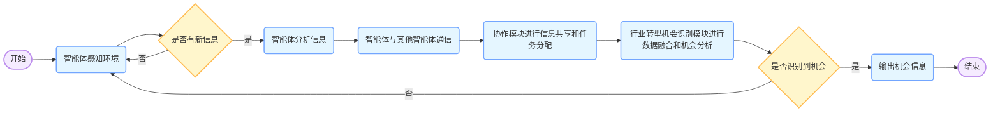

# 利用多智能体AI实现动态行业转型机会识别

> 关键词：多智能体AI、动态行业转型、机会识别、智能系统、数据分析

> 摘要：本文聚焦于利用多智能体AI实现动态行业转型机会识别这一前沿课题。首先介绍了相关背景，明确目的、预期读者和文档结构。接着阐述了多智能体AI及行业转型机会识别的核心概念与联系，给出原理和架构示意图及流程图。详细讲解了核心算法原理，用Python代码进行说明，并给出了相关数学模型和公式。通过项目实战展示了代码的实际应用，包括开发环境搭建、源代码实现与解读。探讨了该技术在实际中的应用场景，推荐了学习、开发相关的工具和资源，最后总结了未来发展趋势与挑战，提供了常见问题解答和扩展阅读参考资料，旨在为行业转型机会识别提供新的思路和方法。

## 1. 背景介绍 
### 1.1 目的和范围
在当今快速变化的商业环境中，各个行业都面临着不断转型的压力和机遇。传统的行业转型机会识别方法往往难以适应动态变化的市场环境，存在信息处理不及时、分析不够全面等问题。本研究的目的是利用多智能体AI技术，开发一种能够实时、准确地识别动态行业转型机会的方法和系统。

本研究的范围涵盖了多智能体AI技术的原理、算法和应用，行业转型机会识别的理论和方法，以及如何将多智能体AI应用于行业转型机会识别的具体实践。同时，将通过实际案例验证该方法的有效性和可行性。

### 1.2 预期读者
本文的预期读者包括从事人工智能、机器学习、数据分析等领域的研究人员和工程师，对行业转型和战略规划感兴趣的企业管理者和决策者，以及相关专业的学生和学者。

### 1.3 文档结构概述
本文将按照以下结构进行组织：
1. 背景介绍：阐述研究的目的、范围、预期读者和文档结构。
2. 核心概念与联系：介绍多智能体AI和行业转型机会识别的核心概念，以及它们之间的联系。
3. 核心算法原理 & 具体操作步骤：详细讲解多智能体AI用于行业转型机会识别的核心算法原理，并给出具体的操作步骤。
4. 数学模型和公式 & 详细讲解 & 举例说明：建立相关的数学模型，给出公式并进行详细讲解，通过实际例子进行说明。
5. 项目实战：代码实际案例和详细解释说明：通过一个实际的项目案例，展示如何使用多智能体AI实现行业转型机会识别。
6. 实际应用场景：探讨多智能体AI在行业转型机会识别中的实际应用场景。
7. 工具和资源推荐：推荐相关的学习资源、开发工具和框架，以及相关的论文著作。
8. 总结：未来发展趋势与挑战：总结研究成果，分析未来的发展趋势和面临的挑战。
9. 附录：常见问题与解答：提供常见问题的解答。
10. 扩展阅读 & 参考资料：提供扩展阅读的建议和相关的参考资料。

### 1.4 术语表
#### 1.4.1 核心术语定义
- **多智能体AI（Multi-Agent AI）**：由多个智能体组成的人工智能系统，每个智能体具有自主决策和行动的能力，能够与其他智能体进行交互和协作。
- **行业转型机会识别**：通过对行业内外部环境的分析，识别出可能导致行业转型的机会点。
- **智能体（Agent）**：具有感知、决策和行动能力的实体，能够根据环境信息做出相应的决策和行动。

#### 1.4.2 相关概念解释
- **动态行业环境**：指行业内外部环境不断变化的状态，包括市场需求、技术创新、政策法规等方面的变化。
- **机会点**：指在行业转型过程中，可能带来新的发展机遇的因素或事件。

#### 1.4.3 缩略词列表
- **AI**：Artificial Intelligence，人工智能
- **MAS**：Multi-Agent System，多智能体系统

## 2. 核心概念与联系 
### 2.1 多智能体AI原理
多智能体AI系统由多个智能体组成，每个智能体都有自己的目标、知识和能力。智能体之间通过通信和协作来完成共同的任务。智能体的基本结构包括感知模块、决策模块和行动模块。感知模块负责获取环境信息，决策模块根据感知到的信息和自身的目标做出决策，行动模块则根据决策结果执行相应的行动。

多智能体AI系统的优势在于其分布式、并行处理的能力，能够处理复杂的、动态的环境。不同的智能体可以专注于不同的任务，通过协作实现更高效的问题解决。

### 2.2 行业转型机会识别原理
行业转型机会识别需要对行业内外部环境进行全面的分析。内部环境包括企业的资源、能力、竞争力等方面，外部环境包括市场需求、技术发展、政策法规等方面。通过对这些因素的分析，可以识别出可能导致行业转型的机会点。

常用的行业转型机会识别方法包括SWOT分析、PEST分析、波特五力模型等。这些方法可以帮助企业了解自身的优势和劣势，以及外部环境的机会和威胁。

### 2.3 多智能体AI与行业转型机会识别的联系
多智能体AI可以为行业转型机会识别提供更高效、准确的方法。不同的智能体可以分别负责收集、分析不同类型的信息，如市场信息、技术信息、政策信息等。通过智能体之间的协作，可以实现对行业内外部环境的全面、实时的监测和分析。

例如，一个智能体可以负责收集市场需求的变化信息，另一个智能体可以负责分析技术发展的趋势。当两个智能体发现市场需求的变化与技术发展的趋势相匹配时，就可以识别出一个潜在的行业转型机会。

### 2.4 核心概念原理和架构的文本示意图
```plaintext
多智能体AI系统
|-- 智能体1（市场信息收集）
|   |-- 感知模块（收集市场数据）
|   |-- 决策模块（分析市场趋势）
|   |-- 行动模块（与其他智能体通信）
|-- 智能体2（技术信息分析）
|   |-- 感知模块（收集技术文献）
|   |-- 决策模块（预测技术发展）
|   |-- 行动模块（与其他智能体通信）
|-- 智能体3（政策信息监测）
|   |-- 感知模块（收集政策法规）
|   |-- 决策模块（评估政策影响）
|   |-- 行动模块（与其他智能体通信）
|-- 协作模块
|   |-- 信息共享
|   |-- 任务分配
|   |-- 冲突解决
|-- 行业转型机会识别模块
|   |-- 数据融合
|   |-- 机会分析
|   |-- 结果输出
```

### 2.5 Mermaid流程图


## 3. 核心算法原理 & 具体操作步骤 
### 3.1 核心算法原理
多智能体AI用于行业转型机会识别的核心算法主要包括智能体的决策算法和协作算法。

#### 3.1.1 智能体决策算法
智能体的决策算法可以采用基于规则的决策方法或基于机器学习的决策方法。

- **基于规则的决策方法**：根据预先定义的规则进行决策。例如，如果市场需求增长率超过一定阈值，且技术成熟度达到一定水平，则认为存在行业转型机会。规则可以根据领域知识和经验进行定义。
```python
# 基于规则的决策示例
def rule_based_decision(market_growth_rate, technology_maturity):
    if market_growth_rate > 0.1 and technology_maturity > 0.8:
        return True
    return False

# 测试
market_growth = 0.15
tech_maturity = 0.9
print(rule_based_decision(market_growth, tech_maturity))  
```

- **基于机器学习的决策方法**：使用机器学习算法对历史数据进行训练，然后根据训练好的模型进行决策。常用的机器学习算法包括决策树、支持向量机、神经网络等。
```python
from sklearn.tree import DecisionTreeClassifier
import numpy as np

# 示例数据
X = np.array([[0.1, 0.7], [0.2, 0.8], [0.05, 0.6], [0.15, 0.9]])
y = np.array([0, 1, 0, 1])

# 训练决策树模型
model = DecisionTreeClassifier()
model.fit(X, y)

# 测试
test_data = np.array([[0.12, 0.85]])
prediction = model.predict(test_data)
print(prediction)  
```

#### 3.1.2 协作算法
协作算法用于智能体之间的信息共享和任务分配。常用的协作算法包括合同网协议、拍卖算法等。

- **合同网协议**：一个智能体发布任务，其他智能体根据自己的能力进行投标，发布任务的智能体选择最合适的投标者并分配任务。
```python
# 简单的合同网协议示例
class Agent:
    def __init__(self, id):
        self.id = id
        self.capability = np.random.rand()

    def bid(self, task):
        if self.capability > task['requirement']:
            return self.capability
        return 0

    def receive_task(self, task):
        print(f"Agent {self.id} received task: {task}")

# 创建智能体
agents = [Agent(i) for i in range(3)]

# 发布任务
task = {'requirement': 0.5}
bids = []
for agent in agents:
    bid = agent.bid(task)
    bids.append((agent, bid))

# 选择最合适的投标者
best_agent = max(bids, key=lambda x: x[1])[0]
best_agent.receive_task(task)
```

### 3.2 具体操作步骤
#### 3.2.1 智能体初始化
- 定义智能体的类型和数量，如市场信息收集智能体、技术信息分析智能体等。
- 初始化智能体的属性，如感知范围、决策规则、通信能力等。

#### 3.2.2 环境感知
- 每个智能体通过感知模块收集相关的环境信息，如市场数据、技术文献、政策法规等。

#### 3.2.3 信息分析
- 智能体根据自身的决策算法对收集到的信息进行分析，判断是否存在潜在的机会。

#### 3.2.4 通信与协作
- 智能体之间通过通信模块进行信息共享和任务分配，协作模块协调智能体之间的工作。

#### 3.2.5 机会识别
- 行业转型机会识别模块对智能体提供的信息进行融合和分析，识别出可能的行业转型机会。

#### 3.2.6 结果输出
- 将识别出的行业转型机会信息输出，供决策者参考。

## 4. 数学模型和公式 & 详细讲解 & 举例说明 
### 4.1 智能体决策模型
#### 4.1.1 基于规则的决策模型
假设市场需求增长率为 $r_m$，技术成熟度为 $r_t$，预先定义的市场需求增长率阈值为 $r_{m0}$，技术成熟度阈值为 $r_{t0}$。则决策规则可以表示为：

$$
\text{机会存在} = 
\begin{cases}
\text{True}, & r_m > r_{m0} \text{ 且 } r_t > r_{t0} \\
\text{False}, & \text{否则}
\end{cases}
$$

例如，当 $r_{m0} = 0.1$，$r_{t0} = 0.8$，$r_m = 0.15$，$r_t = 0.9$ 时，根据上述规则可以判断存在行业转型机会。

#### 4.1.2 基于机器学习的决策模型
以决策树模型为例，假设输入特征向量为 $\mathbf{x} = [x_1, x_2, \cdots, x_n]$，决策树模型的决策函数为 $f(\mathbf{x})$，则预测结果为：

$$
\hat{y} = f(\mathbf{x})
$$

其中，$\hat{y}$ 为预测的类别（是否存在机会）。

例如，在前面的代码示例中，输入特征为市场需求增长率和技术成熟度，决策树模型根据训练好的规则对输入数据进行分类，输出预测结果。

### 4.2 协作模型
#### 4.2.1 合同网协议模型
假设任务的要求为 $r$，智能体 $i$ 的能力为 $c_i$，智能体 $i$ 的投标值为 $b_i$。则投标值可以表示为：

$$
b_i = 
\begin{cases}
c_i, & c_i > r \\
0, & \text{否则}
\end{cases}
$$

选择投标值最大的智能体作为任务的执行者。

例如，在前面的合同网协议代码示例中，任务要求为 $r = 0.5$，三个智能体的能力分别为 $c_1$，$c_2$，$c_3$，计算出投标值后选择投标值最大的智能体执行任务。

### 4.3 机会识别模型
假设智能体 $i$ 提供的信息向量为 $\mathbf{x}_i = [x_{i1}, x_{i2}, \cdots, x_{in}]$，行业转型机会识别模块的融合函数为 $F(\mathbf{x}_1, \mathbf{x}_2, \cdots, \mathbf{x}_m)$，则机会识别结果为：

$$
\text{机会得分} = F(\mathbf{x}_1, \mathbf{x}_2, \cdots, \mathbf{x}_m)
$$

当机会得分超过一定阈值时，认为存在行业转型机会。

例如，融合函数可以是加权求和的形式：

$$
F(\mathbf{x}_1, \mathbf{x}_2, \cdots, \mathbf{x}_m) = \sum_{i=1}^{m} w_i \cdot \mathbf{x}_i
$$

其中，$w_i$ 为权重系数。

## 5. 项目实战：代码实际案例和详细解释说明 
### 5.1  开发环境搭建
#### 5.1.1 安装Python
确保已经安装了Python 3.x版本，可以从Python官方网站（https://www.python.org/downloads/）下载并安装。

#### 5.1.2 安装必要的库
使用pip安装以下必要的库：
```bash
pip install numpy scikit-learn
```

### 5.2  源代码详细实现和代码解读
```python
import numpy as np
from sklearn.tree import DecisionTreeClassifier

# 定义智能体类
class Agent:
    def __init__(self, id, type):
        self.id = id
        self.type = type
        self.data = []

    def collect_data(self):
        # 模拟收集数据
        if self.type == 'market':
            # 市场信息收集
            self.data = [np.random.uniform(0, 0.2)]
        elif self.type == 'technology':
            # 技术信息收集
            self.data = [np.random.uniform(0, 1)]

    def analyze_data(self, model=None):
        if model is None:
            # 简单规则分析
            if self.type == 'market':
                return self.data[0] > 0.1
            elif self.type == 'technology':
                return self.data[0] > 0.8
        else:
            # 机器学习模型分析
            prediction = model.predict([self.data])
            return prediction[0]

# 定义行业转型机会识别类
class IndustryTransformationOpportunityRecognizer:
    def __init__(self):
        self.agents = []
        self.model = None

    def add_agent(self, agent):
        self.agents.append(agent)

    def train_model(self, X, y):
        self.model = DecisionTreeClassifier()
        self.model.fit(X, y)

    def recognize_opportunity(self):
        for agent in self.agents:
            agent.collect_data()

        if self.model is None:
            # 简单规则识别
            market_opportunity = False
            technology_opportunity = False
            for agent in self.agents:
                if agent.type == 'market':
                    market_opportunity = agent.analyze_data()
                elif agent.type == 'technology':
                    technology_opportunity = agent.analyze_data()
            return market_opportunity and technology_opportunity
        else:
            # 机器学习模型识别
            all_data = []
            for agent in self.agents:
                all_data.extend(agent.data)
            prediction = self.model.predict([all_data])
            return prediction[0]

# 主程序
if __name__ == "__main__":
    # 创建智能体
    market_agent = Agent(1, 'market')
    technology_agent = Agent(2, 'technology')

    # 创建机会识别器
    recognizer = IndustryTransformationOpportunityRecognizer()
    recognizer.add_agent(market_agent)
    recognizer.add_agent(technology_agent)

    # 示例数据用于训练模型
    X = np.array([[0.1, 0.7], [0.2, 0.8], [0.05, 0.6], [0.15, 0.9]])
    y = np.array([0, 1, 0, 1])
    recognizer.train_model(X, y)

    # 识别机会
    opportunity = recognizer.recognize_opportunity()
    print(f"是否存在行业转型机会: {opportunity}")
```

### 5.3  代码解读与分析
#### 5.3.1 智能体类（Agent）
- `__init__` 方法：初始化智能体的ID和类型，并创建一个空的数据列表。
- `collect_data` 方法：模拟收集市场或技术信息，根据智能体的类型生成随机数据。
- `analyze_data` 方法：对收集到的数据进行分析，可以使用简单规则或机器学习模型进行分析。

#### 5.3.2 行业转型机会识别类（IndustryTransformationOpportunityRecognizer）
- `__init__` 方法：初始化智能体列表和机器学习模型。
- `add_agent` 方法：将智能体添加到列表中。
- `train_model` 方法：使用示例数据训练决策树模型。
- `recognize_opportunity` 方法：调用智能体的收集和分析方法，根据是否有训练好的模型选择不同的识别方式。

#### 5.3.3 主程序
- 创建市场和技术智能体，并将它们添加到机会识别器中。
- 提供示例数据训练决策树模型。
- 调用机会识别器的 `recognize_opportunity` 方法识别行业转型机会，并输出结果。

## 6. 实际应用场景 
### 6.1 传统制造业转型
在传统制造业中，多智能体AI可以帮助企业识别行业转型机会。例如，市场信息收集智能体可以监测市场需求的变化，如消费者对环保产品的需求增加；技术信息分析智能体可以关注新材料、新工艺的发展，如3D打印技术的进步。当两个智能体发现市场需求与技术发展相匹配时，企业可以考虑向环保产品制造或3D打印制造等方向转型。

### 6.2 金融行业创新
金融行业面临着不断的创新和转型压力。多智能体AI可以用于识别金融科技领域的转型机会。市场智能体可以收集投资者对新型金融产品的需求信息，技术智能体可以分析区块链、人工智能等技术在金融领域的应用前景。通过多智能体的协作，金融机构可以及时推出符合市场需求的创新金融产品，如基于区块链的供应链金融服务。

### 6.3 医疗行业变革
在医疗行业，多智能体AI可以帮助识别行业转型机会。市场智能体可以了解患者对个性化医疗服务的需求，技术智能体可以关注基因编辑、远程医疗等技术的发展。当两者结合时，医疗机构可以考虑开展个性化医疗服务，如基于基因检测的精准治疗。

## 7. 工具和资源推荐
### 7.1 学习资源推荐
#### 7.1.1 书籍推荐
- 《多智能体系统：原理与编程》：介绍了多智能体系统的基本原理和编程方法。
- 《人工智能：一种现代的方法》：涵盖了人工智能的各个领域，包括多智能体AI。
- 《行业分析与竞争战略》：讲解了行业分析和竞争战略的方法，有助于理解行业转型机会识别。

#### 7.1.2 在线课程
- Coursera上的“人工智能基础”课程：提供了人工智能的基础知识，包括多智能体系统。
- edX上的“机器学习”课程：介绍了机器学习的算法和应用，对智能体的决策算法有帮助。

#### 7.1.3 技术博客和网站
- AI开源社区：提供了多智能体AI的开源代码和案例。
- 行业研究网站：如艾瑞咨询、Gartner等，提供了行业动态和分析报告。

### 7.2 开发工具框架推荐
#### 7.2.1 IDE和编辑器
- PyCharm：功能强大的Python集成开发环境，适合开发多智能体AI项目。
- Jupyter Notebook：交互式编程环境，方便进行代码调试和数据分析。

#### 7.2.2 调试和性能分析工具
- Py-Spy：用于分析Python程序的性能瓶颈。
- PDB：Python自带的调试工具，可用于调试多智能体AI代码。

#### 7.2.3 相关框架和库
- Mesa：用于构建多智能体系统的Python框架。
- OpenAI Gym：提供了一系列的强化学习环境，可用于智能体的训练和测试。

### 7.3 相关论文著作推荐
#### 7.3.1 经典论文
- “Multi-Agent Systems: A Modern Approach to Distributed Artificial Intelligence”：介绍了多智能体系统的经典理论和方法。
- “Industry Transformation and the Digital Economy”：探讨了行业转型与数字经济的关系。

#### 7.3.2 最新研究成果
- 每年在人工智能和管理科学领域的顶级会议上发表的关于多智能体AI和行业转型的研究论文。

#### 7.3.3 应用案例分析
- 一些知名企业的行业转型案例分析报告，如GE的数字化转型案例。

## 8. 总结：未来发展趋势与挑战
### 8.1 未来发展趋势
- **与其他技术融合**：多智能体AI将与区块链、物联网、大数据等技术深度融合，实现更高效的信息共享和协作，提高行业转型机会识别的准确性和实时性。
- **应用领域拓展**：除了传统的制造业、金融和医疗行业，多智能体AI将在更多领域得到应用，如农业、教育、交通等。
- **智能化水平提升**：智能体的自主学习和决策能力将不断提升，能够更好地适应动态变化的行业环境。

### 8.2 挑战
- **数据质量和安全**：多智能体AI需要大量的数据进行训练和决策，数据的质量和安全是关键问题。数据的不准确或泄露可能导致错误的决策。
- **智能体协作与协调**：多个智能体之间的协作和协调是一个挑战，需要解决通信协议、任务分配、冲突解决等问题。
- **伦理和法律问题**：随着多智能体AI的应用，伦理和法律问题也日益凸显，如智能体的责任界定、算法的透明度等。

## 9. 附录：常见问题与解答
### 9.1 多智能体AI与传统AI有什么区别？
传统AI通常是一个集中式的系统，由一个中心控制器进行决策和管理。而多智能体AI是分布式的系统，由多个智能体组成，每个智能体具有自主决策和行动的能力，通过协作完成任务。多智能体AI更适合处理复杂、动态的环境。

### 9.2 如何确定智能体的数量和类型？
智能体的数量和类型应根据具体的应用场景和需求来确定。一般来说，需要考虑要收集和分析的信息类型，如市场信息、技术信息、政策信息等，每种信息可以对应一个或多个智能体。同时，要根据系统的处理能力和性能要求来确定智能体的数量。

### 9.3 多智能体AI在行业转型机会识别中的准确率如何保证？
可以通过以下方法保证准确率：
- 使用高质量的数据进行训练和分析。
- 选择合适的决策算法和协作算法。
- 不断优化和调整模型和规则。
- 结合领域专家的知识和经验。

## 10. 扩展阅读 & 参考资料
### 10.1 扩展阅读
- 《智能时代：大数据与智能革命重新定义未来》：探讨了人工智能在各个领域的应用和影响。
- 《复杂适应系统：社会生活计算模型引论》：介绍了复杂适应系统的理论和方法，对理解多智能体系统有帮助。

### 10.2 参考资料
- 相关学术期刊：如《Artificial Intelligence》、《Journal of Multi-Agent and Grid Systems》等。
- 行业报告和研究机构的网站：如麦肯锡、波士顿咨询等。

作者：AI天才研究院/AI Genius Institute & 禅与计算机程序设计艺术 /Zen And The Art of Computer Programming