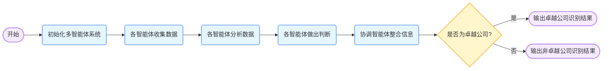

# 利用多智能体AI实现费雪式的卓越公司识别

> 关键词：多智能体AI、费雪式卓越公司识别、公司评估、人工智能应用、财务分析

> 摘要：本文旨在探讨如何利用多智能体AI技术实现费雪式的卓越公司识别。首先介绍了相关背景，包括目的、预期读者等。接着阐述了核心概念，如多智能体AI和费雪式卓越公司的原理与联系，并给出了相应的文本示意图和Mermaid流程图。详细讲解了核心算法原理和具体操作步骤，同时结合数学模型和公式进行说明。通过项目实战，展示了代码的实际案例和详细解释。分析了该技术的实际应用场景，推荐了相关的学习资源、开发工具框架和论文著作。最后总结了未来发展趋势与挑战，并提供了常见问题解答和扩展阅读参考资料。

## 1. 背景介绍 
### 1.1 目的和范围
在当今复杂多变的商业环境中，准确识别卓越公司对于投资者、企业管理者和研究人员都具有至关重要的意义。费雪式的卓越公司识别方法强调从多个维度全面评估公司的长期发展潜力和竞争优势。本研究的目的是利用多智能体AI技术，结合费雪的评估理念，开发一种高效、准确的卓越公司识别模型。研究范围涵盖了多智能体AI的理论与实践、费雪式评估指标的构建以及实际公司数据的应用。

### 1.2 预期读者
本文预期读者包括人工智能领域的研究人员和开发者、金融投资领域的专业人士、企业管理人员以及对公司评估和多智能体AI技术感兴趣的爱好者。对于人工智能研究者，可从中获取将多智能体技术应用于特定领域的思路；金融投资人士能借助该方法提升投资决策的准确性；企业管理人员可用于评估自身企业与同行的竞争力；爱好者则可了解相关技术的应用场景和实现方式。

### 1.3 文档结构概述
本文将按照以下结构进行阐述：首先介绍多智能体AI和费雪式卓越公司识别的核心概念及其联系；接着详细讲解核心算法原理和具体操作步骤，包括使用Python代码实现；然后给出相关的数学模型和公式，并举例说明；通过项目实战展示代码的实际应用和详细解释；分析该技术的实际应用场景；推荐相关的学习资源、开发工具框架和论文著作；最后总结未来发展趋势与挑战，提供常见问题解答和扩展阅读参考资料。

### 1.4 术语表
#### 1.4.1 核心术语定义
- **多智能体AI（Multi - Agent AI）**：由多个智能体组成的人工智能系统，每个智能体具有自主决策和行动的能力，通过相互协作和交互来完成复杂的任务。
- **费雪式卓越公司**：根据投资大师菲利普·费雪的投资理念，具备卓越管理、强大研发能力、良好财务状况、广阔市场前景等多方面优势，具有长期投资价值的公司。
- **智能体（Agent）**：在多智能体系统中，能够感知环境、做出决策并采取行动的实体。

#### 1.4.2 相关概念解释
- **自主决策**：智能体根据自身的知识和算法，独立地对环境信息进行分析和判断，做出相应的决策。
- **协作与交互**：多个智能体之间通过信息共享、协调行动等方式，共同完成任务。在卓越公司识别中，不同智能体可能负责不同的评估维度，通过协作得出综合评估结果。
- **费雪评估指标**：包括公司的研发能力、管理质量、市场竞争力、财务健康等方面的指标，用于衡量公司是否符合费雪式卓越公司的标准。

#### 1.4.3 缩略词列表
- **AI**：Artificial Intelligence，人工智能
- **MAS**：Multi - Agent System，多智能体系统

## 2. 核心概念与联系 

### 核心概念原理
#### 多智能体AI原理
多智能体AI系统由多个智能体组成，每个智能体可以看作是一个独立的个体，具有一定的感知、决策和行动能力。智能体通过传感器感知周围环境的信息，根据内置的算法和知识库对这些信息进行处理，然后做出决策并采取相应的行动。多个智能体之间可以通过通信机制进行信息交流和协作，以实现共同的目标。

例如，在一个城市交通管理的多智能体系统中，每个交通信号灯可以看作一个智能体。它们感知周围车辆的流量和行驶情况，根据预设的算法调整信号灯的时间，同时与其他信号灯智能体进行通信，协调整个交通网络的运行。

#### 费雪式卓越公司识别原理
费雪式卓越公司识别方法强调从多个维度对公司进行全面评估。菲利普·费雪认为，卓越公司应具备以下特点：
- **卓越的管理**：公司拥有优秀的管理层，能够制定合理的战略规划，高效地组织和管理企业资源。
- **强大的研发能力**：持续投入研发，推出具有创新性的产品或服务，以保持市场竞争力。
- **良好的财务状况**：包括稳定的盈利能力、合理的资产负债结构、充足的现金流等。
- **广阔的市场前景**：所处行业具有良好的发展趋势，公司在市场中具有一定的市场份额和竞争优势。

通过对这些维度的综合评估，可以识别出具有长期投资价值的卓越公司。

### 架构的文本示意图
```plaintext
多智能体AI系统
├── 智能体1（研发能力评估）
│   ├── 数据收集模块（收集公司研发投入、专利数量等数据）
│   ├── 数据分析模块（分析研发数据，评估研发能力）
│   ├── 决策模块（根据分析结果做出判断）
├── 智能体2（管理质量评估）
│   ├── 数据收集模块（收集管理层背景、管理策略等数据）
│   ├── 数据分析模块（分析管理数据，评估管理质量）
│   ├── 决策模块（根据分析结果做出判断）
├── 智能体3（财务状况评估）
│   ├── 数据收集模块（收集财务报表、现金流等数据）
│   ├── 数据分析模块（分析财务数据，评估财务状况）
│   ├── 决策模块（根据分析结果做出判断）
├── 智能体4（市场前景评估）
│   ├── 数据收集模块（收集行业报告、市场份额等数据）
│   ├── 数据分析模块（分析市场数据，评估市场前景）
│   ├── 决策模块（根据分析结果做出判断）
└── 协调智能体
    ├── 信息整合模块（整合各智能体的判断结果）
    ├── 综合评估模块（根据整合信息进行综合评估）
    └── 输出模块（输出卓越公司识别结果）
```

### Mermaid流程图


## 3. 核心算法原理 & 具体操作步骤 

### 核心算法原理
本系统采用的核心算法主要基于多智能体的协作和机器学习算法。每个智能体负责一个特定的评估维度，使用机器学习算法对收集到的数据进行分析和评估。常见的机器学习算法包括决策树、支持向量机、神经网络等。

以研发能力评估智能体为例，使用决策树算法进行说明。决策树是一种基于树结构进行决策的算法，它通过对数据的特征进行划分，构建一棵决策树，每个内部节点表示一个特征上的测试，每个分支表示一个测试输出，每个叶节点表示一个类别或值。

### Python源代码实现
```python
import pandas as pd
from sklearn.tree import DecisionTreeClassifier
from sklearn.model_selection import train_test_split
from sklearn.metrics import accuracy_score

# 示例数据：研发投入、专利数量、研发人员比例
data = {
    'R&D_Investment': [100, 200, 150, 300, 250],
    'Patent_Number': [5, 10, 8, 15, 12],
    'R&D_Staff_Ratio': [0.2, 0.3, 0.25, 0.4, 0.35],
    'Excellent': [0, 1, 0, 1, 1]
}
df = pd.DataFrame(data)

# 划分特征和标签
X = df[['R&D_Investment', 'Patent_Number', 'R&D_Staff_Ratio']]
y = df['Excellent']

# 划分训练集和测试集
X_train, X_test, y_train, y_test = train_test_split(X, y, test_size=0.2, random_state=42)

# 创建决策树分类器
clf = DecisionTreeClassifier()

# 训练模型
clf.fit(X_train, y_train)

# 预测
y_pred = clf.predict(X_test)

# 评估模型
accuracy = accuracy_score(y_test, y_pred)
print(f"模型准确率: {accuracy}")
```

### 具体操作步骤
1. **数据收集**：各智能体根据自身负责的评估维度，收集相关数据。例如，研发能力评估智能体收集公司的研发投入、专利数量等数据；管理质量评估智能体收集管理层背景、管理策略等数据。
2. **数据预处理**：对收集到的数据进行清洗、转换和归一化等处理，以提高数据的质量和可用性。
3. **模型训练**：使用机器学习算法对预处理后的数据进行训练，得到每个评估维度的评估模型。
4. **评估判断**：各智能体使用训练好的模型对新的数据进行评估，做出判断。
5. **信息整合**：协调智能体收集各智能体的判断结果，进行信息整合。
6. **综合评估**：根据整合后的信息，进行综合评估，得出卓越公司的识别结果。

## 4. 数学模型和公式 & 详细讲解 & 举例说明 

### 决策树算法的数学模型
决策树算法的核心是构建一棵决策树，其数学模型可以用递归的方式表示。设数据集 $D$ 包含 $n$ 个样本，每个样本有 $m$ 个特征，目标变量为 $y$。决策树的构建过程可以分为以下几个步骤：

1. **选择最优特征**：使用信息增益、信息增益比或基尼指数等指标，选择一个最优的特征 $A$ 作为当前节点的划分特征。
    - **信息增益**：信息增益是指划分前后信息熵的减少量。设数据集 $D$ 的信息熵为 $H(D)$，根据特征 $A$ 划分后的数据集为 $D_1, D_2, \cdots, D_k$，则信息增益 $g(D, A)$ 为：
$$g(D, A) = H(D) - \sum_{i = 1}^{k} \frac{|D_i|}{|D|} H(D_i)$$
其中，$|D|$ 表示数据集 $D$ 的样本数量，$|D_i|$ 表示划分后第 $i$ 个子数据集的样本数量，$H(D_i)$ 表示第 $i$ 个子数据集的信息熵。

    - **信息熵**：信息熵是衡量数据集不确定性的指标，计算公式为：
$$H(D) = - \sum_{k = 1}^{K} p_k \log_2 p_k$$
其中，$K$ 表示数据集 $D$ 中类别标签的数量，$p_k$ 表示第 $k$ 个类别标签在数据集中出现的概率。

2. **划分数据集**：根据选择的最优特征 $A$ 的不同取值，将数据集 $D$ 划分为多个子数据集 $D_1, D_2, \cdots, D_k$。
3. **递归构建子树**：对每个子数据集 $D_i$，重复步骤 1 和 2，直到满足停止条件（如子数据集的样本数量小于某个阈值、所有样本属于同一类别等）。

### 详细讲解
信息增益的本质是通过划分数据集，减少数据集的不确定性。信息熵越大，数据集的不确定性越大；信息增益越大，说明划分后数据集的不确定性减少得越多，即该特征对分类的贡献越大。

例如，假设有一个数据集 $D$ 包含 10 个样本，其中正类样本有 6 个，负类样本有 4 个。则数据集 $D$ 的信息熵为：
$$H(D) = - \frac{6}{10} \log_2 \frac{6}{10} - \frac{4}{10} \log_2 \frac{4}{10} \approx 0.971$$

假设根据特征 $A$ 划分后，得到两个子数据集 $D_1$ 和 $D_2$，其中 $D_1$ 包含 4 个样本，正类样本有 3 个，负类样本有 1 个；$D_2$ 包含 6 个样本，正类样本有 3 个，负类样本有 3 个。则 $D_1$ 和 $D_2$ 的信息熵分别为：
$$H(D_1) = - \frac{3}{4} \log_2 \frac{3}{4} - \frac{1}{4} \log_2 \frac{1}{4} \approx 0.811$$
$$H(D_2) = - \frac{3}{6} \log_2 \frac{3}{6} - \frac{3}{6} \log_2 \frac{3}{6} = 1$$

信息增益为：
$$g(D, A) = H(D) - \frac{4}{10} H(D_1) - \frac{6}{10} H(D_2) \approx 0.971 - \frac{4}{10} \times 0.811 - \frac{6}{10} \times 1 \approx 0.136$$

### 举例说明
继续以上述示例数据为例，假设我们要根据研发投入、专利数量和研发人员比例来判断一家公司是否为卓越公司。使用决策树算法构建决策树的过程如下：

1. 计算每个特征的信息增益，选择信息增益最大的特征作为根节点的划分特征。
2. 根据该特征的不同取值，将数据集划分为多个子数据集。
3. 对每个子数据集，重复步骤 1 和 2，直到满足停止条件。

最终得到的决策树可以用于对新的公司数据进行分类，判断其是否为卓越公司。

## 5. 项目实战：代码实际案例和详细解释说明 

### 5.1  开发环境搭建
- **操作系统**：推荐使用 Windows 10、Linux（如 Ubuntu）或 macOS。
- **Python 版本**：建议使用 Python 3.7 及以上版本。
- **开发工具**：可以使用 PyCharm、Jupyter Notebook 等集成开发环境。
- **依赖库安装**：使用以下命令安装所需的 Python 库：
```bash
pip install pandas scikit-learn
```

### 5.2  源代码详细实现和代码解读
```python
import pandas as pd
from sklearn.tree import DecisionTreeClassifier
from sklearn.model_selection import train_test_split
from sklearn.metrics import accuracy_score

# 步骤 1: 数据准备
# 示例数据：研发投入、专利数量、研发人员比例
data = {
    'R&D_Investment': [100, 200, 150, 300, 250],
    'Patent_Number': [5, 10, 8, 15, 12],
    'R&D_Staff_Ratio': [0.2, 0.3, 0.25, 0.4, 0.35],
    'Excellent': [0, 1, 0, 1, 1]
}
df = pd.DataFrame(data)

# 步骤 2: 划分特征和标签
X = df[['R&D_Investment', 'Patent_Number', 'R&D_Staff_Ratio']]
y = df['Excellent']

# 步骤 3: 划分训练集和测试集
X_train, X_test, y_train, y_test = train_test_split(X, y, test_size=0.2, random_state=42)

# 步骤 4: 创建决策树分类器
clf = DecisionTreeClassifier()

# 步骤 5: 训练模型
clf.fit(X_train, y_train)

# 步骤 6: 预测
y_pred = clf.predict(X_test)

# 步骤 7: 评估模型
accuracy = accuracy_score(y_test, y_pred)
print(f"模型准确率: {accuracy}")
```

### 代码解读与分析
1. **数据准备**：使用 `pandas` 库创建一个包含研发投入、专利数量、研发人员比例和是否为卓越公司标签的 DataFrame。
2. **划分特征和标签**：将 DataFrame 中的特征（研发投入、专利数量、研发人员比例）提取到变量 $X$ 中，将标签（是否为卓越公司）提取到变量 $y$ 中。
3. **划分训练集和测试集**：使用 `train_test_split` 函数将数据集划分为训练集和测试集，其中测试集占总数据集的 20%。
4. **创建决策树分类器**：使用 `DecisionTreeClassifier` 类创建一个决策树分类器对象。
5. **训练模型**：使用训练集数据对决策树分类器进行训练。
6. **预测**：使用训练好的模型对测试集数据进行预测，得到预测结果 $y_{pred}$。
7. **评估模型**：使用 `accuracy_score` 函数计算模型的准确率，即预测结果与真实标签的匹配程度。

通过以上步骤，我们可以使用决策树算法对公司的研发能力进行评估，判断其是否为卓越公司。

## 6. 实际应用场景 
### 投资决策
投资者可以利用多智能体AI实现的费雪式卓越公司识别系统，筛选出具有长期投资价值的公司。通过对公司的研发能力、管理质量、财务状况和市场前景等多个维度进行综合评估，投资者可以更准确地判断公司的投资潜力，降低投资风险。

### 企业战略规划
企业管理者可以使用该系统评估自身企业在行业中的竞争力，找出自身的优势和不足。根据评估结果，企业可以制定相应的战略规划，如加大研发投入、优化管理策略、拓展市场份额等，以提升企业的长期发展能力。

### 行业研究
研究人员可以利用该系统对整个行业的公司进行评估，分析行业的发展趋势和竞争格局。通过比较不同公司的评估结果，研究人员可以发现行业中的领先企业和潜在的新兴企业，为行业研究提供有价值的参考。

## 7. 工具和资源推荐
### 7.1 学习资源推荐
#### 7.1.1 书籍推荐
- 《人工智能：一种现代的方法》：全面介绍了人工智能的基本概念、算法和应用，是人工智能领域的经典教材。
- 《机器学习》：由周志华教授编写，系统地介绍了机器学习的各种算法和理论，适合初学者和有一定基础的读者。
- 《Python 数据分析实战》：详细介绍了使用 Python 进行数据分析的方法和技巧，包括数据处理、可视化和机器学习等方面。

#### 7.1.2 在线课程
- Coursera 上的 “机器学习” 课程：由斯坦福大学的 Andrew Ng 教授授课，是机器学习领域最受欢迎的在线课程之一。
- edX 上的 “人工智能基础” 课程：介绍了人工智能的基本概念、算法和应用，适合初学者学习。
- 中国大学 MOOC 上的 “Python 语言程序设计” 课程：帮助学习者掌握 Python 语言的基本语法和编程技巧。

#### 7.1.3 技术博客和网站
- Medium：上面有很多人工智能和机器学习领域的优秀博客文章，涵盖了最新的技术动态和研究成果。
- 开源中国：提供了丰富的技术文章和开源项目资源，对人工智能和软件开发感兴趣的读者可以在这里找到很多有价值的信息。
- Kaggle：是一个数据科学竞赛平台，上面有很多关于机器学习和数据分析的案例和教程，可以帮助学习者提高实践能力。

### 7.2 开发工具框架推荐
#### 7.2.1 IDE和编辑器
- PyCharm：是一款专门为 Python 开发设计的集成开发环境，具有代码自动补全、调试、版本控制等功能，适合专业开发者使用。
- Jupyter Notebook：是一个交互式的开发环境，支持多种编程语言，尤其适合数据分析和机器学习的实验和演示。
- Visual Studio Code：是一款轻量级的代码编辑器，具有丰富的插件生态系统，可以方便地进行 Python 开发。

#### 7.2.2 调试和性能分析工具
- PySnooper：可以自动记录 Python 代码的执行过程，方便开发者调试代码。
- cProfile：是 Python 标准库中的一个性能分析工具，可以帮助开发者找出代码中的性能瓶颈。
- TensorBoard：是 TensorFlow 提供的一个可视化工具，可以用于监控模型的训练过程和性能指标。

#### 7.2.3 相关框架和库
- Scikit - learn：是一个简单易用的机器学习库，提供了各种机器学习算法和工具，如分类、回归、聚类等。
- TensorFlow：是一个开源的深度学习框架，广泛应用于图像识别、自然语言处理等领域。
- PyTorch：是另一个流行的深度学习框架，具有动态图机制，易于使用和调试。

### 7.3 相关论文著作推荐
#### 7.3.1 经典论文
- “A Formal Theory of Inductive Inference”：由 Ray Solomonoff 发表，提出了归纳推理的形式化理论，为机器学习的发展奠定了基础。
- “Gradient - Based Learning Applied to Document Recognition”：由 Yann LeCun 等人发表，介绍了卷积神经网络在手写字符识别中的应用，是深度学习领域的经典论文之一。
- “Playing Atari with Deep Reinforcement Learning”：由 DeepMind 团队发表，展示了深度强化学习在游戏中的应用，推动了强化学习的发展。

#### 7.3.2 最新研究成果
- 关注顶级学术会议如 NeurIPS（神经信息处理系统大会）、ICML（国际机器学习会议）、CVPR（计算机视觉与模式识别会议）等的论文，了解多智能体AI和公司评估领域的最新研究动态。
- 查阅知名学术期刊如 Journal of Artificial Intelligence Research（JAIR）、Artificial Intelligence 等上的相关研究论文。

#### 7.3.3 应用案例分析
- 分析一些知名投资机构的研究报告，了解他们在公司评估和投资决策中使用的方法和技术。
- 研究一些成功企业的发展案例，分析其在研发、管理、市场等方面的优势和经验。

## 8. 总结：未来发展趋势与挑战
### 未来发展趋势
- **多智能体AI技术的不断发展**：随着人工智能技术的不断进步，多智能体AI将变得更加智能和灵活。智能体之间的协作和交互能力将不断提高，能够更好地处理复杂的任务。
- **与其他技术的融合**：多智能体AI将与大数据、区块链、物联网等技术深度融合，为卓越公司识别提供更全面、准确的数据支持和更高效的解决方案。
- **应用领域的拓展**：除了投资决策和企业战略规划，该技术还将在更多领域得到应用，如行业监管、风险管理等。

### 挑战
- **数据质量和隐私问题**：准确的卓越公司识别依赖于高质量的数据，但数据的收集、清洗和标注过程可能存在误差和偏差。同时，数据隐私问题也需要得到重视，确保数据的安全和合法使用。
- **智能体的协作和协调**：在多智能体系统中，智能体之间的协作和协调是一个挑战。如何确保智能体之间的信息共享和行动协调，避免冲突和矛盾，是需要解决的问题。
- **模型的可解释性**：机器学习模型，尤其是深度学习模型，往往具有较高的复杂度，其决策过程难以解释。在卓越公司识别中，需要提高模型的可解释性，以便用户理解和信任评估结果。

## 9. 附录：常见问题与解答
### 问题 1：多智能体AI系统中的智能体是如何进行通信的？
智能体之间的通信方式可以分为直接通信和间接通信。直接通信是指智能体之间直接交换信息，如通过消息传递机制。间接通信是指智能体通过共享环境或其他中间媒介进行信息交流。常见的通信协议包括 FIPA（智能体物理基础设施）等。

### 问题 2：如何选择合适的机器学习算法用于卓越公司识别？
选择合适的机器学习算法需要考虑多个因素，如数据的特点、问题的类型、算法的复杂度和可解释性等。对于小规模数据集和简单问题，可以选择决策树、支持向量机等算法；对于大规模数据集和复杂问题，可以考虑深度学习算法，如神经网络。同时，也可以通过实验和比较不同算法的性能，选择最优的算法。

### 问题 3：如何评估多智能体AI系统的性能？
可以从多个方面评估多智能体AI系统的性能，如准确性、稳定性、效率等。准确性可以通过比较系统的识别结果与真实标签来评估；稳定性可以通过多次实验的结果一致性来评估；效率可以通过系统的运行时间和资源消耗来评估。

## 10. 扩展阅读 & 参考资料
### 扩展阅读
- 《智能体系统与多智能体系统：理论与应用》：深入介绍了智能体系统和多智能体系统的理论和应用，适合对多智能体AI技术感兴趣的读者进一步学习。
- 《投资最重要的事》：由霍华德·马克斯编写，分享了投资领域的经验和智慧，对于理解费雪式卓越公司识别的投资理念有很大帮助。

### 参考资料
- 菲利普·费雪的著作《怎样选择成长股》：是费雪投资理念的经典之作，为费雪式卓越公司识别提供了理论基础。
- 相关的学术论文和研究报告，如在 IEEE、ACM 等学术数据库中搜索关于多智能体AI和公司评估的论文。

作者：AI天才研究院/AI Genius Institute & 禅与计算机程序设计艺术 /Zen And The Art of Computer Programming