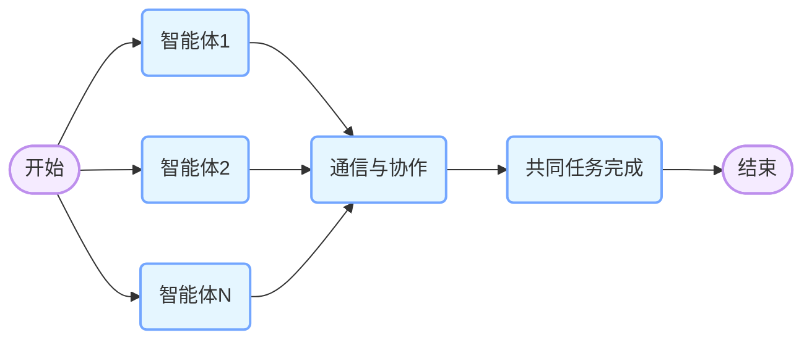

# 利用多智能体AI评估公司的数据资产价值

> 关键词：多智能体AI、数据资产价值评估、人工智能、数据评估模型、企业数据管理

> 摘要：本文聚焦于利用多智能体AI评估公司的数据资产价值这一前沿课题。随着数字化时代的发展，数据资产已成为企业的核心竞争力之一，但准确评估其价值面临诸多挑战。多智能体AI具有分布式、自主性和协作性等特点，能够为数据资产价值评估提供更全面、准确和智能的解决方案。文章将深入探讨多智能体AI的核心概念和原理，详细阐述用于数据资产价值评估的算法和操作步骤，结合数学模型和公式进行理论分析，并通过项目实战展示具体应用。此外，还将介绍该技术的实际应用场景、推荐相关工具和资源，最后对未来发展趋势与挑战进行总结。

## 1. 背景介绍 
### 1.1 目的和范围
在当今数字化经济时代，数据已成为企业最宝贵的资产之一。准确评估公司的数据资产价值对于企业的战略决策、投资分析、风险管理等方面都具有至关重要的意义。然而，数据资产具有独特的特性，如非物质性、易复制性、价值的动态性等，使得传统的资产评估方法难以准确衡量其价值。本文章的目的在于探讨如何利用多智能体AI技术来解决这一难题，为企业提供更科学、准确的数据资产价值评估方法。

本文的范围涵盖了多智能体AI的基本概念、核心算法原理、数学模型、实际应用案例等方面，旨在为读者提供一个全面、深入的关于利用多智能体AI评估公司数据资产价值的知识体系。

### 1.2 预期读者
本文的预期读者包括企业的高层管理人员、数据资产管理人员、数据科学家、人工智能研究人员以及对数据资产价值评估和多智能体AI技术感兴趣的专业人士。通过阅读本文，读者可以了解多智能体AI在数据资产价值评估中的应用原理和方法，为实际工作提供参考和指导。

### 1.3 文档结构概述
本文将按照以下结构进行组织：
- 核心概念与联系：介绍多智能体AI和数据资产价值评估的核心概念，以及它们之间的联系。
- 核心算法原理 & 具体操作步骤：详细阐述用于数据资产价值评估的多智能体AI算法原理，并给出具体的操作步骤。
- 数学模型和公式 & 详细讲解 & 举例说明：建立数学模型和公式，对数据资产价值评估进行理论分析，并通过具体例子进行说明。
- 项目实战：代码实际案例和详细解释说明：通过一个实际的项目案例，展示如何使用多智能体AI进行数据资产价值评估，并对代码进行详细解读。
- 实际应用场景：介绍多智能体AI在数据资产价值评估中的实际应用场景。
- 工具和资源推荐：推荐相关的学习资源、开发工具和框架，以及相关的论文著作。
- 总结：未来发展趋势与挑战：对多智能体AI在数据资产价值评估领域的未来发展趋势和面临的挑战进行总结。
- 附录：常见问题与解答：对读者可能关心的常见问题进行解答。
- 扩展阅读 & 参考资料：提供相关的扩展阅读材料和参考资料。

### 1.4 术语表
#### 1.4.1 核心术语定义
- **多智能体AI（Multi-Agent AI）**：由多个智能体组成的人工智能系统，每个智能体具有一定的自主性和协作能力，能够通过相互通信和协作完成复杂的任务。
- **数据资产价值评估**：对企业拥有的数据资产的价值进行量化评估的过程，包括数据的质量、数量、可用性、潜在价值等方面。
- **智能体（Agent）**：具有感知、决策和行动能力的实体，能够根据环境的变化自主地做出决策并执行相应的行动。
- **数据质量**：指数据的准确性、完整性、一致性、及时性等方面的特征，是影响数据资产价值的重要因素之一。

#### 1.4.2 相关概念解释
- **分布式计算**：将一个复杂的任务分解为多个子任务，分布在不同的计算节点上进行并行处理的计算方式。多智能体AI通常采用分布式计算的方式，以提高系统的效率和可靠性。
- **机器学习**：一门多领域交叉学科，涉及概率论、统计学、逼近论、凸分析、算法复杂度理论等多门学科。它专门研究计算机怎样模拟或实现人类的学习行为，以获取新的知识或技能，重新组织已有的知识结构使之不断改善自身的性能。在多智能体AI中，机器学习算法可以用于智能体的决策和学习。

#### 1.4.3 缩略词列表
- **AI**：Artificial Intelligence，人工智能
- **MAS**：Multi-Agent System，多智能体系统

## 2. 核心概念与联系 

### 多智能体AI的原理
多智能体AI系统由多个智能体组成，每个智能体都有自己的目标、知识和能力。智能体之间通过通信和协作来完成共同的任务。智能体的基本结构包括感知模块、决策模块和行动模块。感知模块用于感知环境的信息，决策模块根据感知到的信息和自身的知识做出决策，行动模块根据决策执行相应的行动。

多智能体AI的架构可以分为集中式架构和分布式架构。集中式架构中，有一个中央控制器负责协调所有智能体的行动；分布式架构中，智能体之间通过分布式通信协议进行自主协作，没有中央控制器。分布式架构具有更好的灵活性和扩展性，因此在实际应用中更为常见。

以下是多智能体AI架构的Mermaid流程图：


### 数据资产价值评估的原理
数据资产价值评估的核心是确定数据的质量、数量、可用性和潜在价值等因素，并将这些因素综合考虑，得出数据资产的价值。常用的数据资产价值评估方法包括成本法、市场法和收益法。

- **成本法**：根据数据资产的开发、维护和管理成本来评估其价值。
- **市场法**：通过比较类似数据资产的市场交易价格来评估其价值。
- **收益法**：根据数据资产未来可能带来的收益来评估其价值。

### 多智能体AI与数据资产价值评估的联系
多智能体AI可以为数据资产价值评估提供更全面、准确和智能的解决方案。具体来说，多智能体AI可以实现以下功能：
- **数据收集与整合**：多个智能体可以同时从不同的数据源收集数据，并将这些数据进行整合和清洗，提高数据的质量和可用性。
- **数据分析与挖掘**：智能体可以使用机器学习和数据分析算法对数据进行深入分析和挖掘，发现数据中的潜在价值和模式。
- **价值评估与决策**：多个智能体可以通过协作和协商，综合考虑各种因素，对数据资产的价值进行评估，并为企业提供决策支持。

## 3. 核心算法原理 & 具体操作步骤 

### 核心算法原理
在利用多智能体AI评估公司的数据资产价值时，常用的算法包括强化学习算法和遗传算法。

#### 强化学习算法
强化学习是一种机器学习方法，智能体通过与环境进行交互，根据环境的反馈（奖励或惩罚）来学习最优的行动策略。在数据资产价值评估中，智能体可以根据数据的质量、数量、可用性等因素来调整自己的行动，以最大化数据资产的价值。

以下是一个简单的强化学习算法的Python代码示例：
```python
import numpy as np

# 定义环境
class DataAssetEnvironment:
    def __init__(self):
        self.state = np.random.rand(3)  # 初始化状态，包含数据质量、数量、可用性
        self.reward = 0

    def step(self, action):
        # 根据行动更新状态和奖励
        if action == 0:  # 提高数据质量
            self.state[0] += 0.1
        elif action == 1:  # 增加数据数量
            self.state[1] += 0.1
        elif action == 2:  # 提高数据可用性
            self.state[2] += 0.1

        # 计算奖励
        self.reward = self.state[0] * 0.3 + self.state[1] * 0.5 + self.state[2] * 0.2

        return self.state, self.reward

# 定义智能体
class DataAssetAgent:
    def __init__(self):
        self.q_table = np.zeros((10, 3))  # Q表，状态空间为10，动作空间为3
        self.epsilon = 0.1  # 探索率
        self.alpha = 0.1  # 学习率
        self.gamma = 0.9  # 折扣因子

    def choose_action(self, state):
        if np.random.uniform() < self.epsilon:
            action = np.random.randint(0, 3)  # 随机选择动作
        else:
            state_index = int(state[0] * 10)
            action = np.argmax(self.q_table[state_index])  # 选择Q值最大的动作
        return action

    def learn(self, state, action, reward, next_state):
        state_index = int(state[0] * 10)
        next_state_index = int(next_state[0] * 10)
        q_predict = self.q_table[state_index, action]
        q_target = reward + self.gamma * np.max(self.q_table[next_state_index])
        self.q_table[state_index, action] += self.alpha * (q_target - q_predict)

# 训练智能体
env = DataAssetEnvironment()
agent = DataAssetAgent()

for episode in range(100):
    state = env.state
    for step in range(20):
        action = agent.choose_action(state)
        next_state, reward = env.step(action)
        agent.learn(state, action, reward, next_state)
        state = next_state

    print(f"Episode {episode}: Reward = {reward}")
```

#### 遗传算法
遗传算法是一种模拟自然选择和遗传机制的优化算法，通过模拟生物的进化过程，不断迭代寻找最优解。在数据资产价值评估中，遗传算法可以用于优化评估模型的参数，以提高评估的准确性。

### 具体操作步骤
利用多智能体AI评估公司的数据资产价值的具体操作步骤如下：
1. **数据收集与预处理**：使用多个智能体从不同的数据源收集数据，并对数据进行清洗、转换和整合，以提高数据的质量和可用性。
2. **智能体设计与训练**：设计多个智能体，每个智能体负责不同的任务，如数据质量评估、数据价值预测等。使用强化学习、遗传算法等算法对智能体进行训练，使其能够自主地完成任务。
3. **智能体协作与协商**：多个智能体通过通信和协作，共享信息和资源，共同完成数据资产价值评估的任务。在协作过程中，智能体可以通过协商和投票等方式解决冲突和分歧。
4. **价值评估与决策**：根据智能体的评估结果，综合考虑各种因素，对数据资产的价值进行评估，并为企业提供决策支持。

## 4. 数学模型和公式 & 详细讲解 & 举例说明 

### 数学模型
假设我们使用多智能体AI评估公司的数据资产价值，每个智能体 $A_i$ 都有自己的评估函数 $f_i(x)$，其中 $x$ 表示数据资产的特征向量，包括数据质量、数量、可用性等因素。最终的数据资产价值评估结果 $V$ 可以通过加权平均的方式得到：

$$V = \sum_{i=1}^{n} w_i f_i(x)$$

其中 $w_i$ 表示智能体 $A_i$ 的权重，满足 $\sum_{i=1}^{n} w_i = 1$。

### 详细讲解
- **评估函数 $f_i(x)$**：每个智能体的评估函数可以根据具体的任务和需求进行设计。例如，一个负责数据质量评估的智能体可以使用以下评估函数：

$$f_{quality}(x) = \alpha_1 \times accuracy + \alpha_2 \times completeness + \alpha_3 \times consistency$$

其中 $accuracy$ 表示数据的准确性，$completeness$ 表示数据的完整性，$consistency$ 表示数据的一致性，$\alpha_1, \alpha_2, \alpha_3$ 是权重系数，满足 $\alpha_1 + \alpha_2 + \alpha_3 = 1$。

- **权重 $w_i$**：权重 $w_i$ 表示每个智能体在最终评估结果中的重要程度。可以根据智能体的性能、经验和可靠性等因素来确定权重。例如，可以使用层次分析法（AHP）来确定权重。

### 举例说明
假设我们有三个智能体 $A_1, A_2, A_3$，分别负责数据质量评估、数据数量评估和数据可用性评估。它们的评估函数分别为：

$$f_1(x) = 0.3 \times accuracy + 0.5 \times completeness + 0.2 \times consistency$$
$$f_2(x) = 0.8 \times quantity$$
$$f_3(x) = 0.6 \times availability$$

假设三个智能体的权重分别为 $w_1 = 0.4, w_2 = 0.3, w_3 = 0.3$。已知数据资产的特征向量 $x$ 为：$accuracy = 0.8, completeness = 0.9, consistency = 0.7, quantity = 0.6, availability = 0.8$。

首先，计算每个智能体的评估结果：

$$f_1(x) = 0.3 \times 0.8 + 0.5 \times 0.9 + 0.2 \times 0.7 = 0.83$$
$$f_2(x) = 0.8 \times 0.6 = 0.48$$
$$f_3(x) = 0.6 \times 0.8 = 0.48$$

然后，计算最终的数据资产价值评估结果：

$$V = 0.4 \times 0.83 + 0.3 \times 0.48 + 0.3 \times 0.48 = 0.62$$

## 5. 项目实战：代码实际案例和详细解释说明 

### 5.1  开发环境搭建
在进行项目实战之前，需要搭建相应的开发环境。以下是具体的步骤：
1. **安装Python**：建议使用Python 3.7及以上版本，可以从Python官方网站（https://www.python.org/downloads/）下载并安装。
2. **安装必要的库**：使用以下命令安装必要的库：
```bash
pip install numpy pandas scikit-learn matplotlib
```
3. **安装开发工具**：可以使用PyCharm、Jupyter Notebook等开发工具进行代码编写和调试。

### 5.2  源代码详细实现和代码解读
以下是一个使用多智能体AI评估公司的数据资产价值的项目实战代码示例：
```python
import numpy as np
import pandas as pd
from sklearn.linear_model import LinearRegression
from sklearn.model_selection import train_test_split
from sklearn.metrics import mean_squared_error

# 生成模拟数据
def generate_data():
    np.random.seed(42)
    n_samples = 100
    data_quality = np.random.rand(n_samples)
    data_quantity = np.random.rand(n_samples)
    data_availability = np.random.rand(n_samples)
    target = 0.3 * data_quality + 0.5 * data_quantity + 0.2 * data_availability + np.random.normal(0, 0.1, n_samples)

    data = pd.DataFrame({
        'data_quality': data_quality,
        'data_quantity': data_quantity,
        'data_availability': data_availability,
        'target': target
    })

    return data

# 定义智能体类
class DataAgent:
    def __init__(self, feature):
        self.feature = feature
        self.model = LinearRegression()

    def train(self, X_train, y_train):
        self.model.fit(X_train[[self.feature]], y_train)

    def predict(self, X_test):
        return self.model.predict(X_test[[self.feature]])

# 数据预处理
data = generate_data()
X = data.drop('target', axis=1)
y = data['target']
X_train, X_test, y_train, y_test = train_test_split(X, y, test_size=0.2, random_state=42)

# 创建智能体
agent1 = DataAgent('data_quality')
agent2 = DataAgent('data_quantity')
agent3 = DataAgent('data_availability')

# 训练智能体
agent1.train(X_train, y_train)
agent2.train(X_train, y_train)
agent3.train(X_train, y_train)

# 预测
y_pred1 = agent1.predict(X_test)
y_pred2 = agent2.predict(X_test)
y_pred3 = agent3.predict(X_test)

# 加权平均
weights = [0.4, 0.3, 0.3]
y_pred = weights[0] * y_pred1 + weights[1] * y_pred2 + weights[2] * y_pred3

# 评估结果
mse = mean_squared_error(y_test, y_pred)
print(f"Mean Squared Error: {mse}")
```

### 代码解读与分析
1. **数据生成**：使用 `generate_data` 函数生成模拟数据，包括数据质量、数据数量、数据可用性和目标值。
2. **智能体定义**：定义 `DataAgent` 类，每个智能体负责使用线性回归模型对一个特征进行训练和预测。
3. **数据预处理**：使用 `train_test_split` 函数将数据分为训练集和测试集。
4. **智能体训练**：分别对三个智能体进行训练。
5. **预测**：每个智能体对测试集进行预测，并将预测结果进行加权平均。
6. **评估结果**：使用均方误差（MSE）评估最终的预测结果。

## 6. 实际应用场景 
### 企业战略决策
企业在制定战略决策时，需要准确了解自身的数据资产价值。利用多智能体AI评估数据资产价值可以为企业提供更科学、准确的决策依据。例如，企业可以根据数据资产的价值评估结果，决定是否加大对数据资产的投资、是否进行数据资产的并购等。

### 投资分析
投资者在进行投资决策时，需要评估企业的数据资产价值。多智能体AI可以为投资者提供更全面、准确的数据资产价值评估报告，帮助投资者做出更明智的投资决策。

### 风险管理
企业在运营过程中面临着各种风险，如数据泄露、数据质量下降等。通过定期评估数据资产价值，企业可以及时发现潜在的风险，并采取相应的措施进行防范和应对。

### 数据资产交易
在数据资产交易市场中，准确评估数据资产价值是交易成功的关键。多智能体AI可以为数据资产交易提供公正、客观的价值评估服务，促进数据资产的流通和交易。

## 7. 工具和资源推荐
### 7.1 学习资源推荐
#### 7.1.1 书籍推荐
- 《人工智能：一种现代的方法》：这本书是人工智能领域的经典教材，全面介绍了人工智能的基本概念、算法和应用。
- 《多智能体系统：原理与编程》：详细介绍了多智能体系统的原理、算法和编程方法。
- 《数据资产价值评估》：专门探讨了数据资产价值评估的理论和方法。

#### 7.1.2 在线课程
- Coursera上的“人工智能基础”课程：由知名高校的教授授课，系统介绍了人工智能的基础知识和算法。
- edX上的“多智能体系统”课程：深入讲解了多智能体系统的原理和应用。
- 中国大学MOOC上的“数据资产评估”课程：介绍了数据资产评估的方法和实践。

#### 7.1.3 技术博客和网站
- Medium：上面有很多关于人工智能和数据资产评估的技术博客文章。
- AI Stack Exchange：一个专门讨论人工智能问题的问答社区。
- 中国信通院数据资产网：提供了数据资产评估的相关标准和案例。

### 7.2 开发工具框架推荐
#### 7.2.1 IDE和编辑器
- PyCharm：一款专业的Python集成开发环境，具有代码编辑、调试、版本控制等功能。
- Jupyter Notebook：一个交互式的编程环境，适合进行数据分析和模型开发。
- Visual Studio Code：一款轻量级的代码编辑器，支持多种编程语言和插件扩展。

#### 7.2.2 调试和性能分析工具
- PDB：Python自带的调试工具，可以帮助开发者调试代码。
- cProfile：Python的性能分析工具，可以分析代码的运行时间和内存使用情况。
- TensorBoard：一个可视化工具，用于监控和分析深度学习模型的训练过程。

#### 7.2.3 相关框架和库
- OpenAI Gym：一个用于开发和比较强化学习算法的工具包。
- DEAP：一个用于实现遗传算法和其他进化算法的Python库。
- Scikit-learn：一个常用的机器学习库，提供了丰富的机器学习算法和工具。

### 7.3 相关论文著作推荐
#### 7.3.1 经典论文
- “Multi-Agent Systems: A Modern Approach to Distributed Artificial Intelligence”：介绍了多智能体系统的基本概念和理论。
- “Data Asset Valuation: A Review of Methods and Approaches”：对数据资产价值评估的方法和途径进行了综述。
- “Reinforcement Learning: An Introduction”：强化学习领域的经典著作，系统介绍了强化学习的理论和算法。

#### 7.3.2 最新研究成果
- 关注顶级学术会议如NeurIPS、ICML、AAAI等上关于多智能体AI和数据资产价值评估的最新研究成果。
- 查阅相关学术期刊如Artificial Intelligence、Journal of Artificial Intelligence Research等上的最新论文。

#### 7.3.3 应用案例分析
- 研究一些知名企业的数据资产价值评估案例，了解多智能体AI在实际应用中的效果和挑战。

## 8. 总结：未来发展趋势与挑战
### 未来发展趋势
- **智能化程度不断提高**：随着人工智能技术的不断发展，多智能体AI将具备更强的学习能力和决策能力，能够更准确地评估数据资产价值。
- **与其他技术融合**：多智能体AI将与区块链、云计算、大数据等技术深度融合，为数据资产价值评估提供更安全、高效的解决方案。
- **应用场景不断拓展**：除了企业战略决策、投资分析、风险管理等领域，多智能体AI在医疗、金融、交通等行业的数据资产价值评估中也将得到更广泛的应用。

### 挑战
- **数据隐私和安全问题**：在数据资产价值评估过程中，需要处理大量的敏感数据，如何保障数据的隐私和安全是一个重要的挑战。
- **算法复杂度和可解释性**：多智能体AI算法通常比较复杂，如何提高算法的可解释性，让企业能够理解评估结果的依据，是一个亟待解决的问题。
- **标准和规范缺失**：目前，数据资产价值评估的标准和规范还不够完善，需要进一步建立和完善相关的标准和规范，以促进多智能体AI在数据资产价值评估领域的健康发展。

## 9. 附录：常见问题与解答
### 问题1：多智能体AI与传统人工智能方法有什么区别？
多智能体AI由多个智能体组成，每个智能体具有一定的自主性和协作能力，能够通过相互通信和协作完成复杂的任务。而传统人工智能方法通常是集中式的，由一个中央控制器负责决策和控制。多智能体AI具有更好的灵活性、扩展性和适应性。

### 问题2：如何确定智能体的权重？
可以根据智能体的性能、经验和可靠性等因素来确定权重。常用的方法包括层次分析法（AHP）、熵权法等。

### 问题3：多智能体AI在数据资产价值评估中的准确性如何保证？
可以通过以下方式保证多智能体AI在数据资产价值评估中的准确性：
- 提高数据质量：确保收集到的数据准确、完整、一致。
- 优化算法：选择合适的算法，并对算法进行优化和调参。
- 增加智能体数量：通过增加智能体的数量，可以提高评估结果的准确性和可靠性。

## 10. 扩展阅读 & 参考资料
- 《人工智能：现代方法（第4版）》，Stuart Russell、Peter Norvig 著
- 《多智能体系统：原理与编程（第2版）》，伍京华 著
- “A Survey on Multi-Agent Reinforcement Learning”，OpenAI 研究报告
- 中国信通院发布的《数据资产白皮书》

作者：AI天才研究院/AI Genius Institute & 禅与计算机程序设计艺术 /Zen And The Art of Computer Programming