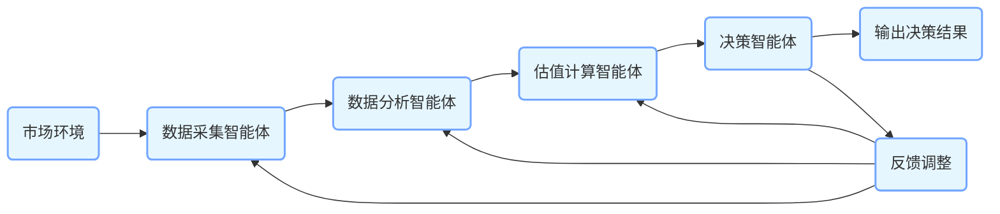

# 利用多智能体系统构建动态估值模型：适应市场变化

> 关键词：多智能体系统、动态估值模型、市场变化、人工智能、金融科技、适应性、建模

> 摘要：本文聚焦于利用多智能体系统构建动态估值模型以适应市场变化这一前沿课题。首先介绍了研究的背景、目的、预期读者等基础信息，接着深入阐述了多智能体系统和动态估值模型的核心概念及其联系，详细讲解了相关核心算法原理并给出Python源代码示例，同时分析了其数学模型和公式。通过项目实战展示了如何搭建开发环境、实现源代码并进行解读分析。探讨了该模型在不同实际场景中的应用，推荐了学习所需的工具和资源，最后总结了未来发展趋势与挑战，解答常见问题并提供扩展阅读和参考资料，旨在为相关领域的研究者和从业者提供全面且深入的技术指导和理论支持。

## 1. 背景介绍 
### 1.1 目的和范围
在当今快速变化的市场环境中，传统的估值模型往往难以适应市场的动态性和复杂性。静态的估值方法无法及时反映市场信息的变化，导致估值结果与实际情况存在偏差。本研究的目的在于利用多智能体系统构建动态估值模型，使模型能够实时感知市场变化，并自适应地调整估值策略，从而提高估值的准确性和及时性。

本研究的范围涵盖了多智能体系统的理论基础、动态估值模型的构建方法、相关算法的实现、数学模型的分析，以及在实际市场场景中的应用验证。通过对这些方面的研究，全面探讨利用多智能体系统构建动态估值模型的可行性和有效性。

### 1.2 预期读者
本文预期读者包括金融领域的分析师、投资经理、风险管理专家，计算机科学领域的人工智能研究者、程序员，以及对金融科技交叉领域感兴趣的学者和学生。对于金融从业者，本文将提供一种新的估值思路和方法，帮助他们更好地应对市场变化；对于计算机专业人员，本文将展示多智能体系统在金融领域的具体应用，拓展其技术应用场景。

### 1.3 文档结构概述
本文共分为十个部分。第一部分为背景介绍，阐述研究的目的、预期读者和文档结构；第二部分讲解多智能体系统和动态估值模型的核心概念及其联系，并给出相应的文本示意图和Mermaid流程图；第三部分详细介绍核心算法原理，并使用Python源代码进行阐述；第四部分分析数学模型和公式，并举例说明；第五部分通过项目实战，展示开发环境搭建、源代码实现和代码解读；第六部分探讨该模型在实际市场场景中的应用；第七部分推荐学习所需的工具和资源；第八部分总结未来发展趋势与挑战；第九部分解答常见问题；第十部分提供扩展阅读和参考资料。

### 1.4 术语表
#### 1.4.1 核心术语定义
- **多智能体系统（Multi - Agent System, MAS）**：由多个智能体组成的系统，每个智能体具有一定的自主性、社会性和反应性，能够通过与其他智能体和环境的交互来实现系统的整体目标。
- **动态估值模型（Dynamic Valuation Model）**：一种能够根据市场环境的变化实时调整估值参数和方法的模型，以适应不断变化的市场条件。
- **智能体（Agent）**：在多智能体系统中，具有感知、决策和行动能力的个体，能够根据自身的知识和目标，对环境的变化做出响应。

#### 1.4.2 相关概念解释
- **自主性**：智能体能够独立地进行决策和行动，不受其他智能体的直接控制。
- **社会性**：智能体能够与其他智能体进行通信和协作，以实现共同的目标。
- **反应性**：智能体能够感知环境的变化，并及时做出相应的反应。

#### 1.4.3 缩略词列表
- MAS：Multi - Agent System（多智能体系统）
- AI：Artificial Intelligence（人工智能）

## 2. 核心概念与联系 

### 核心概念原理
#### 多智能体系统原理
多智能体系统基于分布式人工智能的思想，将复杂的问题分解为多个子问题，由多个智能体分别处理。每个智能体具有自己的知识、目标和行为规则，通过与其他智能体的交互和协作，实现系统的整体功能。智能体的交互方式包括通信、协调和合作等。例如，在一个金融市场的多智能体系统中，不同的智能体可以代表不同的投资者、金融机构或市场监管者，它们通过交换信息、协商策略等方式，共同影响市场的运行。

#### 动态估值模型原理
动态估值模型的核心思想是根据市场环境的变化实时调整估值参数和方法。市场环境包括宏观经济指标、行业动态、公司财务状况等多个方面。模型通过不断收集和分析市场数据，识别市场变化的趋势和特征，然后根据这些信息调整估值模型的参数，如贴现率、增长率等，以确保估值结果能够准确反映市场的实际情况。

### 架构的文本示意图
多智能体系统构建动态估值模型的架构可以描述如下：

整个系统由多个智能体组成，包括数据采集智能体、数据分析智能体、估值计算智能体和决策智能体等。数据采集智能体负责收集市场数据，如股票价格、财务报表、宏观经济数据等；数据分析智能体对采集到的数据进行清洗、整理和分析，提取有用的信息；估值计算智能体根据数据分析的结果，使用合适的估值方法计算资产的价值；决策智能体根据估值结果和其他相关信息，做出投资决策或提供风险管理建议。各个智能体之间通过通信机制进行信息交换和协作，形成一个有机的整体。

### Mermaid流程图


## 3. 核心算法原理 & 具体操作步骤 

### 核心算法原理
在多智能体系统构建动态估值模型中，常用的算法包括强化学习算法和遗传算法等。这里以强化学习算法为例进行介绍。

强化学习是一种通过智能体与环境进行交互来学习最优策略的算法。智能体在环境中采取行动，环境会根据智能体的行动给出奖励或惩罚信号，智能体的目标是通过不断地尝试和学习，找到能够最大化累积奖励的策略。

在动态估值模型中，智能体可以将估值参数作为行动，将市场表现作为环境反馈的奖励信号。智能体通过不断调整估值参数，观察市场的反应，学习到在不同市场环境下最优的估值参数组合。

### 具体操作步骤
1. **定义智能体和环境**：确定智能体的状态、行动和奖励函数。状态可以包括市场数据、历史估值结果等；行动可以是估值参数的调整；奖励函数可以根据估值结果与市场实际价格的偏差来定义。
2. **初始化智能体的策略**：可以采用随机策略作为初始策略。
3. **智能体与环境交互**：智能体根据当前状态选择行动，环境根据智能体的行动给出奖励信号。
4. **更新智能体的策略**：根据奖励信号和智能体的经验，使用强化学习算法（如Q - learning算法）更新智能体的策略。
5. **重复步骤3和4**：直到智能体的策略收敛或达到预定的训练次数。

### Python源代码示例
```python
import numpy as np

# 定义环境类
class MarketEnvironment:
    def __init__(self):
        # 初始化市场状态
        self.state = np.random.rand(5)  # 假设市场状态由5个特征组成
        self.target_price = np.sum(self.state)  # 目标价格

    def step(self, action):
        # 智能体采取行动（调整估值参数）
        estimated_price = np.sum(self.state * action)  # 计算估计价格
        reward = -np.abs(estimated_price - self.target_price)  # 计算奖励
        # 更新市场状态（简单模拟市场变化）
        self.state += np.random.randn(5) * 0.1
        self.target_price = np.sum(self.state)
        return self.state, reward

# 定义智能体类
class Agent:
    def __init__(self, state_dim, action_dim):
        self.state_dim = state_dim
        self.action_dim = action_dim
        self.q_table = np.zeros((state_dim, action_dim))  # 初始化Q表
        self.learning_rate = 0.1
        self.discount_factor = 0.9
        self.epsilon = 0.1

    def choose_action(self, state):
        if np.random.uniform(0, 1) < self.epsilon:
            action = np.random.rand(self.action_dim)  # 随机选择行动
        else:
            action = self.q_table[state, :]  # 选择Q值最大的行动
        return action

    def update_q_table(self, state, action, reward, next_state):
        max_q_next = np.max(self.q_table[next_state, :])
        self.q_table[state, action] += self.learning_rate * (reward + self.discount_factor * max_q_next - self.q_table[state, action])

# 训练智能体
state_dim = 10  # 状态维度
action_dim = 5  # 行动维度
agent = Agent(state_dim, action_dim)
env = MarketEnvironment()

num_episodes = 1000
for episode in range(num_episodes):
    state = np.random.randint(0, state_dim)
    for step in range(100):
        action = agent.choose_action(state)
        next_state, reward = env.step(action)
        agent.update_q_table(state, action, reward, next_state)
        state = next_state
```

## 4. 数学模型和公式 & 详细讲解 & 举例说明 

### 数学模型
在多智能体系统构建动态估值模型中，常用的数学模型包括贴现现金流模型（DCF模型）和相对估值模型等。这里以DCF模型为例进行分析。

DCF模型的基本思想是将资产未来的现金流折现到当前时刻，以计算资产的内在价值。其数学表达式为：

$$V = \sum_{t = 1}^{n}\frac{CF_t}{(1 + r)^t}$$

其中，$V$ 表示资产的内在价值，$CF_t$ 表示第 $t$ 期的现金流，$r$ 表示贴现率，$n$ 表示现金流的期数。

### 详细讲解
- **现金流（$CF_t$）**：是指资产在未来各期产生的现金流入和流出的净额。现金流的预测是DCF模型的关键，需要考虑多种因素，如市场需求、竞争状况、公司战略等。
- **贴现率（$r$）**：反映了资金的时间价值和投资的风险。贴现率的确定通常基于市场利率、行业平均收益率和资产的风险水平等因素。
- **期数（$n$）**：表示预测现金流的时间范围。期数的选择需要根据资产的特点和市场情况进行合理确定。

### 举例说明
假设某公司预计未来三年的现金流分别为100万元、120万元和150万元，贴现率为10%。则该公司的内在价值为：

$$V=\frac{100}{(1 + 0.1)^1}+\frac{120}{(1 + 0.1)^2}+\frac{150}{(1 + 0.1)^3}$$

$$V=\frac{100}{1.1}+\frac{120}{1.21}+\frac{150}{1.331}$$

$$V\approx90.91 + 99.17+112.70$$

$$V\approx302.78\text{（万元）}$$

在动态估值模型中，现金流、贴现率和期数都可能随着市场环境的变化而变化。多智能体系统可以通过实时监测市场信息，调整这些参数，从而实现对资产价值的动态评估。

## 5. 项目实战：代码实际案例和详细解释说明 

### 5.1  开发环境搭建
1. **安装Python**：推荐使用Python 3.7及以上版本，可以从Python官方网站（https://www.python.org/downloads/）下载并安装。
2. **安装必要的库**：使用pip命令安装所需的库，如numpy、pandas、matplotlib等。
```sh
pip install numpy pandas matplotlib
```
3. **选择开发工具**：可以使用PyCharm、Jupyter Notebook等开发工具。

### 5.2  源代码详细实现和代码解读
以下是一个简单的多智能体系统构建动态估值模型的Python代码示例：

```python
import numpy as np
import pandas as pd
import matplotlib.pyplot as plt

# 定义智能体类
class Agent:
    def __init__(self, num_assets, learning_rate=0.1, discount_factor=0.9):
        self.num_assets = num_assets
        self.learning_rate = learning_rate
        self.discount_factor = discount_factor
        self.q_table = np.zeros((100, num_assets))  # 初始化Q表

    def choose_action(self, state):
        if np.random.uniform(0, 1) < 0.1:
            action = np.random.randint(0, self.num_assets)  # 随机选择行动
        else:
            action = np.argmax(self.q_table[state, :])  # 选择Q值最大的行动
        return action

    def update_q_table(self, state, action, reward, next_state):
        max_q_next = np.max(self.q_table[next_state, :])
        self.q_table[state, action] += self.learning_rate * (reward + self.discount_factor * max_q_next - self.q_table[state, action])

# 定义环境类
class MarketEnvironment:
    def __init__(self, num_assets):
        self.num_assets = num_assets
        self.asset_prices = np.random.rand(num_assets) * 100  # 初始化资产价格
        self.state = np.random.randint(0, 100)  # 初始化市场状态

    def step(self, action):
        # 模拟市场价格变化
        self.asset_prices += np.random.randn(self.num_assets) * 1
        # 计算奖励
        reward = self.asset_prices[action] - self.asset_prices[action] * 0.01  # 简单奖励计算
        # 更新市场状态
        self.state = np.random.randint(0, 100)
        return self.state, reward

# 训练智能体
num_assets = 5
agent = Agent(num_assets)
env = MarketEnvironment(num_assets)

num_episodes = 1000
rewards = []
for episode in range(num_episodes):
    state = env.state
    episode_reward = 0
    for step in range(100):
        action = agent.choose_action(state)
        next_state, reward = env.step(action)
        agent.update_q_table(state, action, reward, next_state)
        state = next_state
        episode_reward += reward
    rewards.append(episode_reward)

# 绘制奖励曲线
plt.plot(rewards)
plt.xlabel('Episode')
plt.ylabel('Reward')
plt.title('Training Rewards')
plt.show()
```

### 5.3  代码解读与分析
1. **智能体类（Agent）**：
    - `__init__` 方法：初始化智能体的参数，包括资产数量、学习率、折扣因子和Q表。
    - `choose_action` 方法：根据当前状态选择行动，采用ε - 贪心策略，以一定的概率随机选择行动，否则选择Q值最大的行动。
    - `update_q_table` 方法：根据奖励信号和下一个状态更新Q表。

2. **环境类（MarketEnvironment）**：
    - `__init__` 方法：初始化环境的参数，包括资产数量、资产价格和市场状态。
    - `step` 方法：模拟市场价格变化，计算奖励，并更新市场状态。

3. **训练过程**：
    - 初始化智能体和环境。
    - 进行多轮训练，每轮训练中智能体与环境交互多次，根据奖励信号更新Q表。
    - 记录每轮训练的总奖励，并绘制奖励曲线，以观察智能体的学习效果。

## 6. 实际应用场景 
### 金融投资领域
在股票投资中，利用多智能体系统构建的动态估值模型可以实时评估股票的价值。不同的智能体可以代表不同的投资者，如散户、机构投资者等，它们根据自己的投资策略和市场信息进行估值和决策。当市场出现重大变化时，模型可以及时调整估值参数，为投资者提供更准确的投资建议。

在债券投资中，模型可以根据宏观经济数据、利率走势等因素，动态评估债券的价值和风险。智能体可以通过与其他智能体的协作，预测债券市场的变化趋势，帮助投资者优化债券投资组合。

### 风险管理领域
在企业风险管理中，动态估值模型可以帮助企业实时评估资产的价值和风险。例如，在信用风险管理中，模型可以根据客户的财务状况、信用记录和市场环境等因素，动态评估客户的信用风险，及时调整信用额度和风险控制策略。

在市场风险管理中，模型可以监测市场波动对企业资产和负债的影响，通过调整资产配置和套期保值策略，降低市场风险。

### 保险领域
在保险产品定价中，动态估值模型可以根据被保险人