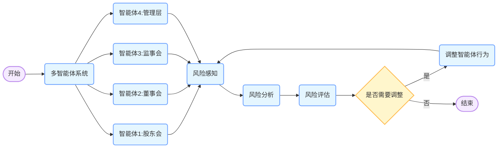

# 利用多智能体系统构建动态的公司治理风险评估模型

> 关键词：多智能体系统、公司治理、风险评估模型、动态模型、人工智能

> 摘要：本文旨在探讨如何利用多智能体系统构建动态的公司治理风险评估模型。首先介绍了研究的背景、目的、预期读者等内容，阐述了多智能体系统和公司治理风险评估的核心概念及其联系。详细讲解了构建模型的核心算法原理，并给出Python源代码示例。深入分析了相关的数学模型和公式，通过具体例子进行说明。在项目实战部分，从开发环境搭建到源代码实现与解读，完整呈现了模型的构建过程。接着探讨了该模型的实际应用场景，推荐了学习、开发相关的工具和资源。最后对未来发展趋势与挑战进行总结，并提供常见问题解答和扩展阅读参考资料，为利用多智能体系统进行公司治理风险评估提供全面且深入的技术指导。

## 1. 背景介绍 
### 1.1 目的和范围
在当今复杂多变的商业环境中，公司面临着各种各样的风险，有效的公司治理风险评估对于公司的生存和发展至关重要。传统的风险评估模型往往是静态的，难以适应公司内外部环境的快速变化。本研究的目的是利用多智能体系统的优势，构建一个动态的公司治理风险评估模型，能够实时感知和响应公司治理过程中的各种变化，提高风险评估的准确性和及时性。

本研究的范围涵盖了多智能体系统的基本原理、公司治理风险的主要类型和影响因素、动态风险评估模型的构建方法和技术实现，以及该模型在实际公司治理中的应用。

### 1.2 预期读者
本文的预期读者包括公司治理领域的管理人员、风险评估专业人员、人工智能和计算机科学领域的研究人员和开发者，以及对公司治理风险评估和多智能体系统感兴趣的学者和学生。

### 1.3 文档结构概述
本文共分为十个部分。第一部分为背景介绍，阐述研究的目的、范围、预期读者和文档结构概述。第二部分介绍多智能体系统和公司治理风险评估的核心概念及其联系。第三部分详细讲解构建动态风险评估模型的核心算法原理，并给出Python源代码示例。第四部分分析相关的数学模型和公式，通过具体例子进行说明。第五部分是项目实战，包括开发环境搭建、源代码详细实现和代码解读。第六部分探讨该模型的实际应用场景。第七部分推荐学习、开发相关的工具和资源。第八部分总结未来发展趋势与挑战。第九部分是附录，提供常见问题解答。第十部分列出扩展阅读和参考资料。

### 1.4 术语表
#### 1.4.1 核心术语定义
- **多智能体系统（Multi - Agent System，MAS）**：由多个自主的智能体组成的系统，这些智能体可以通过相互协作、通信和竞争来完成复杂的任务。
- **公司治理风险**：指由于公司治理结构、机制和过程中的缺陷或不足，导致公司目标无法实现、利益相关者权益受损的可能性。
- **动态风险评估模型**：能够根据公司内外部环境的变化实时调整评估结果的风险评估模型。

#### 1.4.2 相关概念解释
- **智能体（Agent）**：具有自主性、反应性、主动性和社会性的实体，能够感知环境并根据自身的目标和知识采取行动。
- **公司治理结构**：指公司内部的组织架构和权力分配体系，包括股东会、董事会、监事会和管理层等。
- **风险因素**：指可能导致公司治理风险发生的各种因素，如法律法规变化、市场竞争加剧、内部管理不善等。

#### 1.4.3 缩略词列表
- **MAS**：Multi - Agent System（多智能体系统）
- **AI**：Artificial Intelligence（人工智能）
- **ML**：Machine Learning（机器学习）

## 2. 核心概念与联系 

### 多智能体系统原理
多智能体系统是一种分布式人工智能系统，由多个智能体组成。每个智能体都有自己的目标、知识和能力，并且能够与其他智能体进行交互。智能体的行为可以分为个体行为和群体行为。个体行为是指智能体根据自身的目标和感知到的环境信息做出的决策和行动；群体行为是指多个智能体通过协作、竞争等方式共同完成的任务。

多智能体系统的架构通常包括智能体层、通信层和协调层。智能体层包含多个智能体，每个智能体负责完成特定的任务；通信层负责智能体之间的信息传递；协调层负责协调智能体之间的行为，以实现系统的整体目标。

### 公司治理风险评估概念
公司治理风险评估是对公司治理过程中可能出现的风险进行识别、分析和评价的过程。其目的是为了帮助公司管理层及时发现潜在的风险，并采取相应的措施进行防范和控制。公司治理风险评估的内容包括公司治理结构的合理性、内部控制制度的有效性、决策过程的科学性等。

### 两者联系
多智能体系统可以为公司治理风险评估提供一种有效的方法和技术手段。通过将公司治理过程中的各个参与方抽象为智能体，可以构建一个多智能体系统来模拟公司治理的实际情况。每个智能体可以根据自身的目标和知识对公司治理风险进行评估，并通过与其他智能体的交互和协作，实现对公司治理风险的全面、动态评估。

### 文本示意图
多智能体系统与公司治理风险评估的联系可以用以下文本示意图表示：

多智能体系统由多个智能体组成，每个智能体代表公司治理过程中的一个参与方，如股东会、董事会、监事会、管理层等。这些智能体通过通信和协作，对公司治理风险进行感知、分析和评估。智能体之间的交互和协作可以根据公司内外部环境的变化实时调整，从而实现动态的公司治理风险评估。

### Mermaid流程图


## 3. 核心算法原理 & 具体操作步骤 

### 核心算法原理
本模型采用基于规则的推理算法和机器学习算法相结合的方法。基于规则的推理算法用于处理已知的、明确的风险因素，通过预先定义的规则对风险进行评估。机器学习算法用于处理复杂的、不确定的风险因素，通过对历史数据的学习和分析，预测风险的发生概率和影响程度。

### 具体操作步骤
1. **智能体初始化**：根据公司治理的实际情况，初始化各个智能体的属性和参数，包括目标、知识、能力等。
2. **风险感知**：各个智能体通过感知公司内外部环境的变化，获取与公司治理风险相关的信息。
3. **风险分析**：智能体根据自身的知识和规则，对感知到的风险信息进行分析，确定风险的类型和等级。
4. **风险评估**：利用机器学习算法对风险进行评估，计算风险的发生概率和影响程度。
5. **信息交互与协作**：智能体之间通过通信和协作，共享风险信息，协调评估结果。
6. **动态调整**：根据公司内外部环境的变化，实时调整智能体的行为和评估模型的参数。

### Python源代码示例
```python
# 定义智能体类
class Agent:
    def __init__(self, name, knowledge, goals):
        self.name = name
        self.knowledge = knowledge
        self.goals = goals

    def perceive(self, environment):
        # 感知环境信息
        risk_info = []
        for info in environment:
            if info in self.knowledge:
                risk_info.append(info)
        return risk_info

    def analyze(self, risk_info):
        # 风险分析
        risk_type = []
        for info in risk_info:
            if info.startswith('law'):
                risk_type.append('legal risk')
            elif info.startswith('market'):
                risk_type.append('market risk')
            else:
                risk_type.append('other risk')
        return risk_type

    def evaluate(self, risk_type):
        # 风险评估
        risk_level = []
        for r_type in risk_type:
            if r_type == 'legal risk':
                risk_level.append('high')
            elif r_type == 'market risk':
                risk_level.append('medium')
            else:
                risk_level.append('low')
        return risk_level


# 初始化环境信息
environment = ['law_change', 'market_competition', 'internal_management_issue']

# 初始化智能体
agent1 = Agent('agent1', ['law_change', 'market_competition'], ['assess_company_risk'])

# 风险感知
risk_info = agent1.perceive(environment)
print("感知到的风险信息:", risk_info)

# 风险分析
risk_type = agent1.analyze(risk_info)
print("风险类型:", risk_type)

# 风险评估
risk_level = agent1.evaluate(risk_type)
print("风险等级:", risk_level)
```

## 4. 数学模型和公式 & 详细讲解 & 举例说明 

### 风险评估的数学模型
风险评估可以用以下数学模型表示：

设 $R$ 表示风险，$P$ 表示风险发生的概率，$I$ 表示风险的影响程度，则 $R = P \times I$。

### 详细讲解
风险发生的概率 $P$ 可以通过历史数据统计、专家评估等方法确定。风险的影响程度 $I$ 可以根据风险对公司的财务状况、声誉、市场竞争力等方面的影响进行评估。

### 举例说明
假设某公司面临市场竞争加剧的风险，通过对历史数据的分析，该风险发生的概率 $P = 0.6$。经过专家评估，该风险对公司的市场份额和利润有较大影响，影响程度 $I = 0.8$。则该风险的评估值为：

$$R = P \times I = 0.6 \times 0.8 = 0.48$$

### 多智能体协作的数学模型
在多智能体系统中，智能体之间的协作可以用以下数学模型表示：

设 $A_1, A_2, \cdots, A_n$ 表示 $n$ 个智能体，$R_{A_i}$ 表示智能体 $A_i$ 评估的风险值，$w_i$ 表示智能体 $A_i$ 的权重，则多智能体协作后的风险评估值 $R_{total}$ 为：

$$R_{total} = \frac{\sum_{i = 1}^{n} w_i R_{A_i}}{\sum_{i = 1}^{n} w_i}$$

### 详细讲解
智能体的权重 $w_i$ 可以根据智能体的知识、能力、经验等因素确定。通过加权平均的方法，可以综合考虑各个智能体的评估结果，提高风险评估的准确性。

### 举例说明
假设有三个智能体 $A_1, A_2, A_3$，它们评估的风险值分别为 $R_{A_1} = 0.4$，$R_{A_2} = 0.5$，$R_{A_3} = 0.6$，权重分别为 $w_1 = 0.3$，$w_2 = 0.4$，$w_3 = 0.3$。则多智能体协作后的风险评估值为：

$$R_{total} = \frac{0.3 \times 0.4 + 0.4 \times 0.5 + 0.3 \times 0.6}{0.3 + 0.4 + 0.3} = \frac{0.12 + 0.2 + 0.18}{1} = 0.5$$

## 5. 项目实战：代码实际案例和详细解释说明 

### 5.1  开发环境搭建
- **操作系统**：推荐使用Linux或Windows操作系统。
- **编程语言**：Python 3.x
- **开发工具**：推荐使用PyCharm或Jupyter Notebook。
- **相关库**：numpy、pandas、scikit - learn等。

### 5.2  源代码详细实现和代码解读
```python
import numpy as np
import pandas as pd
from sklearn.linear_model import LogisticRegression
from sklearn.model_selection import train_test_split
from sklearn.metrics import accuracy_score


# 定义智能体类
class Agent:
    def __init__(self, name, knowledge, goals):
        self.name = name
        self.knowledge = knowledge
        self.goals = goals
        self.model = LogisticRegression()

    def train_model(self, X, y):
        # 训练机器学习模型
        X_train, X_test, y_train, y_test = train_test_split(X, y, test_size=0.2, random_state=42)
        self.model.fit(X_train, y_train)
        y_pred = self.model.predict(X_test)
        accuracy = accuracy_score(y_test, y_pred)
        print(f"{self.name} 模型准确率: {accuracy}")

    def perceive(self, environment):
        # 感知环境信息
        risk_info = []
        for info in environment:
            if info in self.knowledge:
                risk_info.append(info)
        return risk_info

    def analyze(self, risk_info):
        # 风险分析
        risk_type = []
        for info in risk_info:
            if info.startswith('law'):
                risk_type.append('legal risk')
            elif info.startswith('market'):
                risk_type.append('market risk')
            else:
                risk_type.append('other risk')
        return risk_type

    def evaluate(self, X):
        # 风险评估
        risk_prob = self.model.predict_proba(X)[:, 1]
        return risk_prob


# 模拟数据集
data = {
    'feature1': np.random.rand(100),
    'feature2': np.random.rand(100),
    'label': np.random.randint(0, 2, 100)
}
df = pd.DataFrame(data)
X = df[['feature1', 'feature2']].values
y = df['label'].values

# 初始化智能体
agent1 = Agent('agent1', ['law_change', 'market_competition'], ['assess_company_risk'])

# 训练模型
agent1.train_model(X, y)

# 模拟环境信息
environment = ['law_change', 'market_competition', 'internal_management_issue']

# 风险感知
risk_info = agent1.perceive(environment)
print("感知到的风险信息:", risk_info)

# 风险分析
risk_type = agent1.analyze(risk_info)
print("风险类型:", risk_type)

# 风险评估
risk_prob = agent1.evaluate(X)
print("风险发生概率:", risk_prob)
```

### 5.3  代码解读与分析
- **智能体类 `Agent`**：
  - `__init__` 方法：初始化智能体的名称、知识、目标和机器学习模型。
  - `train_model` 方法：使用训练数据训练机器学习模型，并计算模型的准确率。
  - `perceive` 方法：感知环境信息，筛选出与智能体知识相关的信息。
  - `analyze` 方法：对感知到的风险信息进行分析，确定风险的类型。
  - `evaluate` 方法：使用训练好的模型对风险进行评估，计算风险发生的概率。

- **数据集模拟**：使用 `numpy` 和 `pandas` 模拟了一个包含特征和标签的数据集。
- **模型训练**：使用 `LogisticRegression` 模型对数据集进行训练，并计算模型的准确率。
- **风险感知、分析和评估**：模拟环境信息，智能体感知、分析和评估风险，并输出结果。

## 6. 实际应用场景 
### 上市公司治理
对于上市公司来说，面临着严格的法律法规监管和市场竞争压力。利用多智能体系统构建的动态风险评估模型可以实时监测公司的治理情况，及时发现潜在的法律风险、市场风险等，并提供相应的预警和决策建议，帮助公司管理层做出正确的决策，保护股东和投资者的利益。

### 金融机构治理
金融机构的稳定运行对于整个经济体系的安全至关重要。该模型可以用于评估金融机构的治理风险，包括信用风险、市场风险、操作风险等。通过实时监测和动态评估，金融机构可以及时调整风险管理策略，防范系统性金融风险的发生。

### 企业集团治理
企业集团通常具有复杂的组织结构和多元化的业务。利用该模型可以对企业集团的各个子公司和业务单元进行全面的风险评估，协调各方面的资源，优化集团的治理结构，提高集团的整体竞争力。

## 7. 工具和资源推荐
### 7.1 学习资源推荐
#### 7.1.1 书籍推荐
- 《多智能体系统》：全面介绍了多智能体系统的基本概念、理论和方法。
- 《公司治理》：深入探讨了公司治理的理论和实践。
-