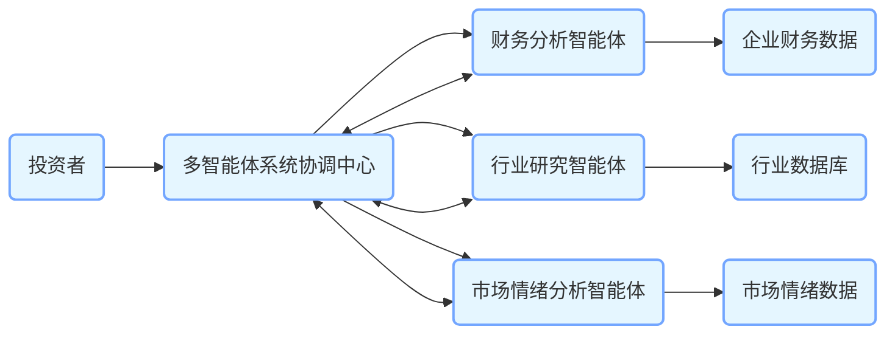

# 利用多智能体系统构建更全面的价值投资研究生态

> 关键词：多智能体系统、价值投资、研究生态、金融市场、人工智能

> 摘要：本文旨在探讨如何利用多智能体系统构建更全面的价值投资研究生态。首先介绍了多智能体系统和价值投资的背景知识，阐述了构建此研究生态的目的和范围，以及预期读者。接着详细讲解了多智能体系统与价值投资的核心概念及其联系，包括原理和架构的文本示意图与 Mermaid 流程图。深入分析了核心算法原理，并给出具体操作步骤，通过 Python 源代码进行详细阐述。同时给出了相关的数学模型和公式，并举例说明。通过项目实战，展示了代码实际案例和详细解释。探讨了该研究生态在实际中的应用场景，推荐了学习、开发所需的工具和资源，包括书籍、在线课程、技术博客、IDE、调试工具、相关框架和库以及论文著作等。最后总结了未来发展趋势与挑战，提供了常见问题与解答以及扩展阅读和参考资料。

## 1. 背景介绍 
### 1.1 目的和范围
价值投资作为一种重要的投资策略，强调对企业内在价值的评估和长期投资。然而，传统的价值投资研究方法往往面临信息获取不全面、分析效率低下等问题。多智能体系统（Multi - Agent System，MAS）是一种由多个智能体组成的分布式系统，每个智能体具有自主决策和交互的能力。本研究的目的是利用多智能体系统的优势，构建一个更全面的价值投资研究生态，提高价值投资研究的效率和准确性。

本研究的范围包括多智能体系统在价值投资研究中的应用原理、算法实现、实际案例分析以及相关工具和资源的推荐等方面。

### 1.2 预期读者
本文的预期读者包括金融领域的投资者、分析师、研究人员，以及对人工智能和金融交叉领域感兴趣的计算机科学专业人士。这些读者希望通过了解多智能体系统在价值投资研究中的应用，拓宽投资研究的思路和方法。

### 1.3 文档结构概述
本文共分为十个部分。第一部分为背景介绍，阐述了研究的目的、范围、预期读者和文档结构。第二部分介绍多智能体系统与价值投资的核心概念及其联系，并给出原理和架构的文本示意图与 Mermaid 流程图。第三部分深入分析核心算法原理，给出具体操作步骤并使用 Python 源代码详细阐述。第四部分介绍相关的数学模型和公式，并举例说明。第五部分通过项目实战展示代码实际案例和详细解释。第六部分探讨该研究生态在实际中的应用场景。第七部分推荐学习、开发所需的工具和资源。第八部分总结未来发展趋势与挑战。第九部分提供常见问题与解答。第十部分给出扩展阅读和参考资料。

### 1.4 术语表
#### 1.4.1 核心术语定义
- **多智能体系统（Multi - Agent System，MAS）**：由多个智能体组成的分布式系统，智能体之间可以进行交互和协作，以实现共同的目标。
- **价值投资（Value Investing）**：一种投资策略，通过评估企业的内在价值，寻找被低估的股票进行投资。
- **智能体（Agent）**：具有自主决策、感知环境和与其他智能体交互能力的实体。
- **内在价值（Intrinsic Value）**：企业的真实价值，通常通过对企业的财务状况、盈利能力、竞争优势等因素进行分析来评估。

#### 1.4.2 相关概念解释
- **分布式系统**：由多个独立的计算机节点组成的系统，这些节点通过网络进行通信和协作。多智能体系统是一种典型的分布式系统。
- **自主决策**：智能体能够根据自身的知识和目标，独立地做出决策，而不需要外部的直接干预。
- **交互与协作**：智能体之间通过消息传递等方式进行信息交换和合作，以实现共同的目标。

#### 1.4.3 缩略词列表
- **MAS**：Multi - Agent System（多智能体系统）

## 2. 核心概念与联系 

### 多智能体系统原理
多智能体系统由多个智能体组成，每个智能体具有自己的知识、目标和行为规则。智能体可以感知环境中的信息，并根据这些信息做出决策。智能体之间通过交互和协作来实现共同的目标。

例如，在一个股票投资研究的多智能体系统中，可能有财务分析智能体、行业研究智能体、市场情绪分析智能体等。财务分析智能体负责分析企业的财务报表，评估企业的盈利能力和财务状况；行业研究智能体负责研究行业的发展趋势和竞争格局；市场情绪分析智能体负责分析市场参与者的情绪和预期。这些智能体之间通过信息共享和协作，为投资者提供更全面的投资建议。

### 价值投资原理
价值投资的核心思想是寻找被低估的股票进行投资。投资者通过对企业的内在价值进行评估，将其与股票的市场价格进行比较。如果市场价格低于内在价值，那么该股票被认为是被低估的，具有投资价值。

评估企业内在价值的方法有很多种，常见的包括现金流折现法（DCF）、市盈率法（P/E）、市净率法（P/B）等。

### 核心概念联系
多智能体系统与价值投资的联系在于，多智能体系统可以为价值投资研究提供更全面、高效的信息获取和分析手段。通过不同类型的智能体，可以从多个角度对企业进行评估，从而更准确地确定企业的内在价值。

例如，财务分析智能体可以提供企业的财务数据和分析结果，行业研究智能体可以提供行业的发展趋势和竞争格局信息，市场情绪分析智能体可以提供市场参与者的情绪和预期信息。这些信息可以帮助投资者更全面地了解企业的情况，提高价值投资研究的准确性。

### 架构的文本示意图
```plaintext
多智能体系统价值投资研究生态架构

                     投资者
                        |
                        |  投资决策
                        v
            多智能体系统协调中心
           /            |            \
  财务分析智能体    行业研究智能体    市场情绪分析智能体
           |            |            |
           |  信息交互  |  信息交互  |  信息交互
           v            v            v
企业财务数据    行业数据库    市场情绪数据
```

### Mermaid 流程图


## 3. 核心算法原理 & 具体操作步骤 

### 核心算法原理
在多智能体系统构建的价值投资研究生态中，核心算法主要包括智能体的决策算法和多智能体之间的协作算法。

#### 智能体决策算法
以财务分析智能体为例，其决策算法可以基于财务指标的评估模型。例如，使用市盈率（P/E）、市净率（P/B）、净资产收益率（ROE）等指标来评估企业的投资价值。

设企业的每股收益为 $EPS$，股票价格为 $P$，则市盈率 $P/E=\frac{P}{EPS}$。一般来说，较低的市盈率可能表示股票被低估。

#### 多智能体协作算法
多智能体协作算法的目的是实现智能体之间的信息共享和协作。常见的协作算法包括合同网协议（Contract Net Protocol）和黑板模型（Blackboard Model）。

合同网协议通过招标 - 投标 - 中标机制来实现任务的分配和协作。当一个智能体有任务需要完成时，它会发布招标信息，其他智能体根据自身的能力进行投标，招标智能体选择最合适的投标者并签订合同。

黑板模型通过一个共享的黑板来实现信息的共享和协作。各个智能体可以在黑板上写入和读取信息，根据黑板上的信息进行决策和协作。

### 具体操作步骤
#### 步骤 1：智能体初始化
创建不同类型的智能体，如财务分析智能体、行业研究智能体、市场情绪分析智能体等，并对其进行初始化。例如，为财务分析智能体设置财务指标的评估模型。

```python
class FinancialAgent:
    def __init__(self):
        self.evaluation_model = {'PE_threshold': 15, 'PB_threshold': 1.5, 'ROE_threshold': 0.1}

    def evaluate(self, eps, p, bvps, roe):
        pe = p / eps
        pb = p / bvps
        if pe < self.evaluation_model['PE_threshold'] and pb < self.evaluation_model['PB_threshold'] and roe > self.evaluation_model['ROE_threshold']:
            return True
        return False
```

#### 步骤 2：信息收集
各个智能体收集相关的信息。例如，财务分析智能体收集企业的财务数据，行业研究智能体收集行业的发展趋势和竞争格局信息，市场情绪分析智能体收集市场参与者的情绪和预期信息。

```python
# 模拟信息收集
financial_agent = FinancialAgent()
eps = 2
p = 20
bvps = 15
roe = 0.12
```

#### 步骤 3：智能体决策
各个智能体根据收集到的信息进行决策。例如，财务分析智能体根据财务指标评估企业的投资价值。

```python
result = financial_agent.evaluate(eps, p, bvps, roe)
print(f"财务分析结果：{result}")
```

#### 步骤 4：多智能体协作
智能体之间进行信息共享和协作。例如，通过合同网协议或黑板模型，将各个智能体的决策结果进行整合，为投资者提供更全面的投资建议。

```python
# 模拟多智能体协作，简单将结果输出
if result:
    print("根据财务分析，该股票具有投资价值")
else:
    print("根据财务分析，该股票不具有投资价值")
```

## 4. 数学模型和公式 & 详细讲解 & 举例说明 

### 现金流折现法（DCF）
现金流折现法是一种常用的评估企业内在价值的方法。其基本思想是将企业未来的现金流折现到当前时刻，得到企业的内在价值。

#### 数学公式
设企业在第 $t$ 年的自由现金流为 $FCF_t$，折现率为 $r$，企业的持续经营期为 $n$ 年，终值为 $TV$，则企业的内在价值 $V$ 可以表示为：

$$V=\sum_{t = 1}^{n}\frac{FCF_t}{(1 + r)^t}+\frac{TV}{(1 + r)^n}$$

其中，终值 $TV$ 可以通过多种方法计算，常见的方法是使用永续增长模型：

$$TV=\frac{FCF_{n+1}}{r - g}$$

其中，$FCF_{n+1}$ 是第 $n + 1$ 年的自由现金流，$g$ 是永续增长率。

#### 详细讲解
现金流折现法的核心是预测企业未来的现金流和确定合适的折现率。预测企业未来的现金流需要考虑企业的经营状况、行业发展趋势等因素。折现率反映了投资者对投资风险的预期，一般可以使用加权平均资本成本（WACC）作为折现率。

#### 举例说明
假设某企业未来三年的自由现金流分别为 $FCF_1 = 100$ 万元，$FCF_2 = 120$ 万元，$FCF_3 = 150$ 万元，折现率 $r = 0.1$，永续增长率 $g = 0.05$。

首先计算第 4 年的自由现金流 $FCF_4=FCF_3\times(1 + g)=150\times(1 + 0.05)=157.5$ 万元。

然后计算终值 $TV=\frac{FCF_4}{r - g}=\frac{157.5}{0.1 - 0.05}=3150$ 万元。

最后计算企业的内在价值：

$$V=\frac{100}{(1 + 0.1)^1}+\frac{120}{(1 + 0.1)^2}+\frac{150}{(1 + 0.1)^3}+\frac{3150}{(1 + 0.1)^3}$$

$$V=\frac{100}{1.1}+\frac{120}{1.21}+\frac{150}{1.331}+\frac{3150}{1.331}$$

$$V\approx90.91 + 99.17+112.69 + 2366.64$$

$$V\approx2669.41$$ 万元

### 市盈率法（P/E）
#### 数学公式
市盈率 $P/E=\frac{P}{EPS}$，其中 $P$ 是股票价格，$EPS$ 是每股收益。

#### 详细讲解
市盈率反映了投资者为获得一元净利润所愿意支付的价格。一般来说，较低的市盈率可能表示股票被低估，具有投资价值；较高的市盈率可能表示股票被高估，投资风险较大。

#### 举例说明
某股票的价格 $P = 20$ 元，每股收益 $EPS = 2$ 元，则该股票的市盈率 $P/E=\frac{20}{2}=10$。如果同行业的平均市盈率为 15，则该股票可能被低估。

## 5. 项目实战：代码实际案例和详细解释说明 

### 5.1  开发环境搭建
#### 操作系统
可以选择 Windows、Linux 或 macOS 操作系统。

#### 编程语言
使用 Python 作为开发语言，Python 具有丰富的库和工具，适合进行数据分析和机器学习。

#### 安装必要的库
使用 pip 安装必要的库，如 pandas、numpy、matplotlib 等。

```bash
pip install pandas numpy matplotlib
```

### 5.2  源代码详细实现和代码解读
以下是一个简单的多智能体系统在价值投资研究中的代码示例：

```python
import pandas as pd

# 财务分析智能体
class FinancialAgent:
    def __init__(self):
        self.evaluation_model = {'PE_threshold': 15, 'PB_threshold': 1.5, 'ROE_threshold': 0.1}

    def evaluate(self, eps, p, bvps, roe):
        pe = p / eps
        pb = p / bvps
        if pe < self.evaluation_model['PE_threshold'] and pb < self.evaluation_model['PB_threshold'] and roe > self.evaluation_model['ROE_threshold']:
            return True
        return False

# 行业研究智能体
class IndustryAgent:
    def __init__(self):
        self.industry_growth_rate = 0.08

    def evaluate(self, company_growth_rate):
        if company_growth_rate > self.industry_growth_rate:
            return True
        return False

# 市场情绪分析智能体
class MarketSentimentAgent:
    def __init__(self):
        self.sentiment_threshold = 0.5

    def evaluate(self, sentiment_score):
        if sentiment_score > self.sentiment_threshold:
            return True
        return False

# 多智能体系统协调中心
class MultiAgentSystem:
    def __init__(self):
        self.financial_agent = FinancialAgent()
        self.industry_agent = IndustryAgent()
        self.market_sentiment_agent = MarketSentimentAgent()

    def evaluate_company(self, eps, p, bvps, roe, company_growth_rate, sentiment_score):
        financial_result = self.financial_agent.evaluate(eps, p, bvps, roe)
        industry_result = self.industry_agent.evaluate(company_growth_rate)
        market_sentiment_result = self.market_sentiment_agent.evaluate(sentiment_score)

        if financial_result and industry_result and market_sentiment_result:
            return True
        return False

# 模拟数据
data = {
    'EPS': [2, 1.5, 3],
    'Price': [20, 18, 35],
    'BVPS': [15, 12, 20],
    'ROE': [0.12, 0.1, 0.15],
    'CompanyGrowthRate': [0.1, 0.06, 0.12],
    'SentimentScore': [0.6, 0.4, 0.7]
}

df = pd.DataFrame(data)

# 创建多智能体系统
mas = MultiAgentSystem()

# 评估每家公司
results = []
for index, row in df.iterrows():
    result = mas.evaluate_company(row['EPS'], row['Price'], row['BVPS'], row['ROE'], row['CompanyGrowthRate'], row['SentimentScore'])
    results.append(result)

df['InvestmentValue'] = results
print(df)
```

### 5.3  代码解读与分析
#### 财务分析智能体（FinancialAgent）
- `__init__` 方法：初始化财务指标的评估阈值。
- `evaluate` 方法：根据输入的每股收益（EPS）、股票价格（P）、每股净资产（BVPS）和净资产收益率（ROE），计算市盈率（P/E）和市净率（P/B），并与评估阈值进行比较，判断该股票是否具有投资价值。

#### 行业研究智能体（IndustryAgent）
- `__init__` 方法：初始化行业增长率的评估阈值。
- `evaluate` 方法：根据输入的公司增长率，与行业增长率阈值进行比较，判断该公司的增长情况是否优于行业平均水平。

#### 市场情绪分析智能体（MarketSentimentAgent）
- `__init__` 方法：初始化市场情绪得分的评估阈值。
- `evaluate` 方法：根据输入的市场情绪得分，与评估阈值进行比较，判断市场对该股票的情绪是否积极。

#### 多智能体系统协调中心（MultiAgentSystem）
- `__init__` 方法：初始化三个智能体。
- `evaluate_company` 方法：调用三个智能体的评估方法，综合三个智能体的评估结果，判断该公司是否具有投资价值。

#### 主程序
- 模拟了三家公司的财务数据、公司增长率和市场情绪得分。
- 创建多智能体系统实例。
- 对每家公司进行评估，并将评估结果添加到数据框中。

## 6. 实际应用场景 
### 投资决策辅助
多智能体系统构建的价值投资研究生态可以为投资者提供更全面的投资建议。投资者可以根据不同智能体的评估结果，综合考虑企业的财务状况、行业发展趋势和市场情绪等因素，做出更明智的投资决策。

### 风险管理
通过多智能体系统对企业进行全面评估，可以及时发现潜在的风险。例如，财务分析智能体可以发现企业的财务风险，行业研究智能体可以发现行业竞争加剧带来的风险，市场情绪分析智能体可以发现市场情绪波动带来的风险。投资者可以根据这些风险信息，调整投资组合，降低投资风险。

### 投资策略优化
多智能体系统可以帮助投资者优化投资策略。通过对不同投资策略的模拟和评估，投资者可以找到最适合自己的投资策略。例如，投资者可以根据不同智能体的评估结果，调整投资组合中不同股票的权重，以实现收益最大化和风险最小化。

## 7. 工具和资源推荐
### 7.1 学习资源推荐
#### 7.1.1 书籍推荐
- 《聪明的投资者》（The Intelligent Investor）：本杰明·格雷厄姆（Benjamin Graham）著，价值投资领域的经典著作，介绍了价值投资的基本原理和方法。
- 《多智能体系统》（Multi - Agent Systems）：迈克尔·伍德里奇（Michael Wooldridge）著，全面介绍了多智能体系统的理论和应用。
- 《Python 数据分析实战》：利用 Python 进行数据分析的实用指南，涵盖了数据处理、可视化、机器学习等方面的内容。

#### 7.1.2 在线课程
- Coursera 上的“Financial Markets”：耶鲁大学教授罗伯特·席勒（Robert Shiller）讲授的金融市场课程，介绍了金融市场的基本原理和投资策略。
- edX 上的“Artificial Intelligence: Multi - Agent Systems”：学习多智能体系统的理论和应用，包括智能体的设计、决策算法和协作算法等方面的内容。
- 网易云课堂上的“Python 数据分析入门”：适合初学者学习 Python 数据分析的基础知识和技能。

#### 7.1.3 技术博客和网站
- Medium：一个技术博客平台，上面有很多关于人工智能、金融科技等领域的文章。
- Towards Data Science：专注于数据科学和机器学习领域的博客，提供了很多实用的技术文章和案例分析。
- 雪球网：一个专注于投资领域的社交网络，上面有很多投资者分享的投资经验和研究报告。

### 7.2 开发工具框架推荐
#### 7.2.1 IDE和编辑器
- PyCharm：一款功能强大的 Python 集成开发环境，提供了代码编辑、调试、版本控制等功能。
- Jupyter Notebook：一个交互式的编程环境，适合进行数据分析和机器学习实验。
- Visual Studio Code：一款轻量级的代码编辑器，支持多种编程语言，具有丰富的插件扩展功能。

#### 7.2.2 调试和性能分析工具
- PDB：Python 自带的调试工具，可以帮助开发者定位代码中的错误。
- cProfile：Python 自带的性能分析工具，可以分析代码的运行时间和内存使用情况。
- Py-Spy：一个用于分析 Python 程序性能的工具，可以实时监控程序的 CPU 使用率和函数调用情况。

#### 7.2.3 相关框架和库
- Pandas：一个用于数据处理和分析的 Python 库，提供了高效的数据结构和数据操作方法。
- Numpy：一个用于科学计算的 Python 库，提供了高效的数组操作和数学函数。
- Scikit-learn：一个用于机器学习的 Python 库，提供了各种机器学习算法和工具。

### 7.3 相关论文著作推荐
#### 7.3.1 经典论文
- “Rational Expectations and the Theory of Price Movements”：由尤金·法玛（Eugene F. Fama）发表，提出了有效市场假说，对金融市场的研究产生了深远影响。
- “Multi - Agent Systems: A Modern Approach to Distributed Artificial Intelligence”：介绍了多智能体系统的基本概念、理论和应用，是多智能体系统领域的经典论文之一。

#### 7.3.2 最新研究成果
- 关注顶级学术期刊如《Journal of Finance》、《Artificial Intelligence》等，上面会发表关于价值投资和多智能体系统的最新研究成果。

#### 7.3.3 应用案例分析
- 可以在 IEEE Xplore、ACM Digital Library 等数据库中搜索关于多智能体系统在金融领域应用的案例分析论文，了解实际应用中的经验和教训。

## 8. 总结：未来发展趋势与挑战
### 未来发展趋势
#### 智能化程度提高
随着人工智能技术的不断发展，多智能体系统的智能化程度将不断提高。智能体将能够更准确地感知环境信息，做出更智能的决策，并实现更高效的协作。

#### 与其他技术融合
多智能体系统将与区块链、物联网等技术融合，构建更加复杂和强大的价值投资研究生态。例如，区块链技术可以提供更安全、透明的信息共享平台，物联网技术可以提供更丰富的企业运营数据。

#### 应用领域拓展
多智能体系统在价值投资研究中的应用将拓展到更多的领域，如私募股权、风险投资等。同时，也将应用于金融监管、风险管理等领域，为金融市场的稳定和发展提供支持。

### 挑战
#### 数据质量和隐私问题
多智能体系统需要大量的数据来进行决策和协作，数据的质量和隐私问题将成为一个挑战。如何确保数据的准确性、完整性和安全性，以及如何保护用户的隐私，是需要解决的问题。

#### 智能体协作复杂性
随着智能体数量的增加和协作任务的复杂，智能体之间的协作将变得更加困难。如何设计高效的协作算法，解决智能体之间的冲突和协调问题，是需要研究的方向。

#### 法律法规和伦理问题
多智能体系统在金融领域的应用可能会涉及到法律法规和伦理问题。例如，智能体的决策是否符合监管要求，是否会对市场造成不公平竞争等。需要建立相应的法律法规和伦理准则来规范多智能体系统的应用。

## 9. 附录：常见问题与解答
### 问题 1：多智能体系统在价值投资研究中的优势是什么？
解答：多智能体系统可以从多个角度对企业进行评估，提供更全面、高效的信息获取和分析手段。不同类型的智能体可以分别负责财务分析、行业研究、市场情绪分析等任务，通过信息共享和协作，提高价值投资研究的准确性和效率。

### 问题 2：如何选择合适的折现率进行现金流折现法评估？
解答：折现率反映了投资者对投资风险的预期，一般可以使用加权平均资本成本（WACC）作为折现率。WACC 的计算需要考虑企业的股权成本和债务成本，可以通过资本资产定价模型（CAPM）等方法来计算股权成本。

### 问题 3：多智能体系统的开发难度大吗？
解答：多智能体系统的开发难度取决于系统的复杂程度。对于简单的多智能体系统，使用 Python 等编程语言和相关的库可以相对容易地实现。但对于复杂的多智能体系统，需要考虑智能体的设计、决策算法、协作算法等方面的问题，开发难度会相对较大。

### 问题 4：多智能体系统在实际应用中可能会遇到哪些问题？
解答：多智能体系统在实际应用中可能会遇到数据质量和隐私问题、智能体协作复杂性问题、法律法规和伦理问题等。需要采取相应的措施来解决这些问题，确保系统的正常运行和应用效果。

## 10. 扩展阅读 & 参考资料
### 扩展阅读
- 《金融炼金术》（The Alchemy of Finance）：乔治·索罗斯（George Soros）著，介绍了他的投资哲学和方法。
- 《人工智能：一种现代的方法》（Artificial Intelligence: A Modern Approach）：斯图尔特·罗素（Stuart J. Russell）和彼得·诺维格（Peter Norvig）著，全面介绍了人工智能的理论和方法。

### 参考资料
- Fama, E. F. (1970). Efficient capital markets: A review of theory and empirical work. The Journal of Finance, 25(2), 383 - 417.
- Wooldridge, M. (2009). An introduction to multiagent systems. John Wiley & Sons.

作者：AI天才研究院/AI Genius Institute & 禅与计算机程序设计艺术 /Zen And The Art of Computer Programming