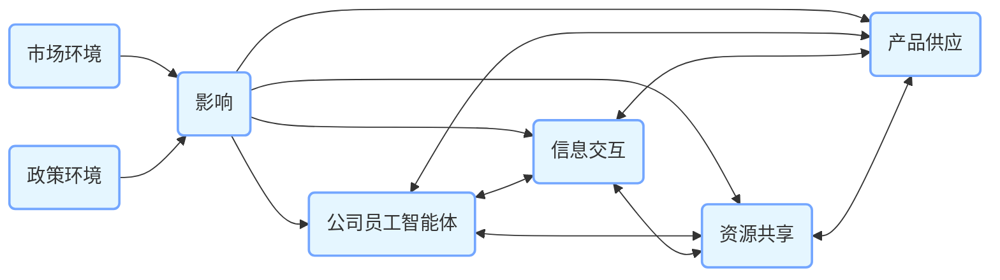

# 利用多智能体系统评估公司的创新生态系统

> 关键词：多智能体系统、创新生态系统、公司评估、智能体交互、系统建模

> 摘要：本文聚焦于利用多智能体系统评估公司的创新生态系统。首先介绍了相关背景，包括研究目的、预期读者等内容。接着阐述了多智能体系统和创新生态系统的核心概念及联系，通过示意图和流程图展示其架构。详细讲解了核心算法原理，结合Python代码进行具体操作步骤的说明。深入探讨了相关数学模型和公式，并举例说明。通过项目实战，从开发环境搭建到源代码实现及解读，全面展示了如何运用多智能体系统进行评估。还分析了实际应用场景，推荐了相关工具和资源。最后总结未来发展趋势与挑战，解答常见问题并给出扩展阅读与参考资料，旨在为公司创新生态系统的评估提供全面、深入的技术指导和理论支持。

## 1. 背景介绍 
### 1.1 目的和范围
在当今竞争激烈的商业环境中，公司的创新能力已成为决定其生存和发展的关键因素。创新生态系统涵盖了公司内部的各个部门、员工以及外部的合作伙伴、供应商、客户等多个主体，它们之间相互作用、相互影响，共同推动公司的创新发展。本研究的目的在于利用多智能体系统这一强大的建模和分析工具，对公司的创新生态系统进行全面、深入的评估，以揭示系统中各主体之间的复杂关系和交互机制，找出影响创新的关键因素，为公司制定有效的创新策略提供科学依据。

本研究的范围主要包括对公司创新生态系统的结构、功能、行为等方面的评估。具体涉及到智能体的定义、智能体之间的交互规则、系统的动态演化等内容，同时考虑了不同行业、不同规模公司的特点，力求使评估方法具有广泛的适用性。

### 1.2 预期读者
本文的预期读者主要包括以下几类人群：
1. **公司管理者**：希望通过了解公司创新生态系统的运行状况，制定合理的创新战略，提升公司的竞争力。
2. **研究人员**：对多智能体系统和创新生态系统的理论和应用感兴趣，希望深入研究相关领域的前沿问题。
3. **技术开发者**：有意愿将多智能体系统应用于实际项目中，进行系统建模和开发的专业人士。
4. **学生**：学习计算机科学、管理学、经济学等相关专业，希望了解创新生态系统评估方法的学生群体。

### 1.3 文档结构概述
本文将按照以下结构进行组织：
1. **背景介绍**：阐述研究的目的、范围、预期读者以及文档结构概述，并对相关术语进行定义和解释。
2. **核心概念与联系**：介绍多智能体系统和创新生态系统的核心概念，通过文本示意图和Mermaid流程图展示它们之间的联系和架构。
3. **核心算法原理 & 具体操作步骤**：详细讲解多智能体系统评估创新生态系统的核心算法原理，并结合Python源代码说明具体操作步骤。
4. **数学模型和公式 & 详细讲解 & 举例说明**：建立相关的数学模型，给出具体的公式，并通过实际例子进行详细讲解。
5. **项目实战：代码实际案例和详细解释说明**：介绍开发环境的搭建，给出源代码的详细实现和解读，对代码进行深入分析。
6. **实际应用场景**：分析多智能体系统评估公司创新生态系统在不同场景下的应用。
7. **工具和资源推荐**：推荐相关的学习资源、开发工具框架以及论文著作。
8. **总结：未来发展趋势与挑战**：总结多智能体系统在评估公司创新生态系统方面的未来发展趋势和面临的挑战。
9. **附录：常见问题与解答**：解答读者在阅读和实践过程中可能遇到的常见问题。
10. **扩展阅读 & 参考资料**：提供相关的扩展阅读材料和参考资料，方便读者进一步深入学习。

### 1.4 术语表
#### 1.4.1 核心术语定义
1. **多智能体系统（Multi - Agent System，MAS）**：由多个自主的智能体组成的系统，这些智能体能够感知环境、进行决策并采取行动，通过相互之间的交互实现系统的整体目标。
2. **创新生态系统（Innovation Ecosystem）**：由公司内部和外部的各种主体（如员工、合作伙伴、供应商、客户等）以及它们之间的关系所构成的复杂系统，旨在促进创新的产生和发展。
3. **智能体（Agent）**：具有自主性、反应性、社会性和主动性的实体，能够在一定的环境中感知信息，根据自身的目标和规则进行决策，并采取相应的行动。
4. **交互规则（Interaction Rules）**：规定了智能体之间进行信息交流和合作的方式和准则。
5. **系统演化（System Evolution）**：指创新生态系统随着时间的推移，在智能体的相互作用下发生的结构和功能的变化。

#### 1.4.2 相关概念解释
1. **自主性**：智能体能够独立地进行决策和行动，不受其他智能体的直接控制。
2. **反应性**：智能体能够感知环境的变化，并及时做出相应的反应。
3. **社会性**：智能体能够与其他智能体进行通信和合作，以实现共同的目标。
4. **主动性**：智能体能够主动地发起行动，追求自身的目标。

#### 1.4.3 缩略词列表
1. **MAS**：Multi - Agent System（多智能体系统）
2. **AI**：Artificial Intelligence（人工智能）
3. **ML**：Machine Learning（机器学习）

## 2. 核心概念与联系 

### 多智能体系统的核心概念
多智能体系统是一种分布式的人工智能系统，由多个智能体组成。每个智能体都具有一定的智能和自主决策能力，能够根据自身的目标和感知到的环境信息进行决策和行动。智能体之间通过通信和交互机制进行信息共享和合作，以实现系统的整体目标。

多智能体系统的主要特点包括：
1. **分布式**：智能体分布在不同的物理或逻辑位置，通过网络进行通信和协作。
2. **自主性**：每个智能体都能够独立地进行决策和行动，具有一定的自我管理能力。
3. **交互性**：智能体之间能够进行信息交流和合作，通过交互实现系统的整体功能。
4. **适应性**：智能体能够根据环境的变化和其他智能体的行为进行调整和适应。

### 创新生态系统的核心概念
创新生态系统是一个复杂的社会 - 技术系统，它包括公司内部的各个部门、员工以及外部的合作伙伴、供应商、客户等多个主体。这些主体之间相互作用、相互影响，形成了一个动态的、开放的系统。创新生态系统的核心目标是促进创新的产生和发展，提高公司的创新能力和竞争力。

创新生态系统的主要要素包括：
1. **创新主体**：包括公司内部的员工、研发团队，以及外部的合作伙伴、供应商、客户等。
2. **创新资源**：如资金、技术、人才、信息等。
3. **创新环境**：包括政策环境、市场环境、文化环境等。
4. **创新机制**：如激励机制、合作机制、知识共享机制等。

### 核心概念的联系
多智能体系统可以很好地模拟创新生态系统中各主体之间的复杂关系和交互机制。在多智能体系统中，每个创新主体可以被抽象为一个智能体，智能体之间的交互规则可以模拟创新主体之间的合作、竞争、信息共享等关系。通过对多智能体系统的建模和分析，可以深入了解创新生态系统的运行机制和演化规律，为评估公司的创新生态系统提供有力的工具。

### 文本示意图
以下是多智能体系统与创新生态系统的关系示意图：

创新生态系统包含多个创新主体，如公司员工、合作伙伴、供应商、客户等。每个创新主体可以看作是一个智能体，这些智能体分布在不同的层次和位置。智能体之间通过信息传递、合作、竞争等交互方式相互作用，形成一个复杂的网络。同时，智能体所处的环境包括市场环境、政策环境等，这些环境因素会影响智能体的行为和决策。多智能体系统通过对这些智能体的建模和仿真，模拟创新生态系统的运行过程，从而实现对创新生态系统的评估。

### Mermaid 流程图


## 3. 核心算法原理 & 具体操作步骤 

### 核心算法原理
在利用多智能体系统评估公司的创新生态系统时，主要涉及到以下几个核心算法：
1. **智能体决策算法**：每个智能体根据自身的目标和感知到的环境信息进行决策。常见的决策算法包括基于规则的决策算法、基于机器学习的决策算法等。
2. **交互算法**：规定了智能体之间进行信息交流和合作的方式。例如，智能体可以通过广播、点对点通信等方式进行信息传递，通过协商、协作等方式进行合作。
3. **系统演化算法**：描述了创新生态系统随着时间的推移，在智能体的相互作用下发生的结构和功能的变化。系统演化算法可以基于细胞自动机、复杂网络等理论进行建模。

### 具体操作步骤

#### 步骤 1：定义智能体
首先，需要定义创新生态系统中的各个智能体。每个智能体可以具有不同的属性和行为。以下是一个简单的Python代码示例，定义了一个员工智能体类：

```python
class EmployeeAgent:
    def __init__(self, id, expertise, motivation):
        self.id = id
        self.expertise = expertise
        self.motivation = motivation

    def make_decision(self, environment):
        # 简单的决策规则：如果动机大于0.5，则尝试创新
        if self.motivation > 0.5:
            # 模拟创新行为
            innovation_chance = self.expertise * self.motivation
            if innovation_chance > 0.3:
                return "innovate"
            else:
                return "continue_working"
        else:
            return "continue_working"
```

#### 步骤 2：定义交互规则
接下来，需要定义智能体之间的交互规则。例如，员工智能体可以与合作伙伴智能体进行信息交流和合作。以下是一个简单的交互规则示例：

```python
class InteractionRule:
    def __init__(self):
        pass

    def interact(self, agent1, agent2):
        # 简单的交互规则：信息共享
        if isinstance(agent1, EmployeeAgent) and isinstance(agent2, PartnerAgent):
            agent1.expertise += agent2.expertise * 0.1
            agent2.expertise += agent1.expertise * 0.1
```

#### 步骤 3：模拟系统演化
最后，需要模拟创新生态系统的演化过程。可以通过循环迭代的方式，让智能体不断地进行决策和交互，从而观察系统的动态变化。以下是一个简单的系统演化模拟代码示例：

```python
# 定义合作伙伴智能体类
class PartnerAgent:
    def __init__(self, id, expertise):
        self.id = id
        self.expertise = expertise

# 初始化智能体
employee1 = EmployeeAgent(1, 0.8, 0.6)
partner1 = PartnerAgent(2, 0.7)

interaction_rule = InteractionRule()

# 模拟系统演化
for i in range(10):
    decision1 = employee1.make_decision(None)
    print(f"Employee {employee1.id} decision: {decision1}")

    interaction_rule.interact(employee1, partner1)
    print(f"Employee {employee1.id} expertise after interaction: {employee1.expertise}")
    print(f"Partner {partner1.id} expertise after interaction: {partner1.expertise}")
```

## 4. 数学模型和公式 & 详细讲解 & 举例说明 

### 智能体决策模型
智能体的决策过程可以用一个效用函数来描述。假设智能体 $i$ 有 $n$ 个可选的行动 $a_1, a_2, \cdots, a_n$，每个行动的效用值可以表示为：

$$U_i(a_j) = \sum_{k = 1}^{m} w_{ik} \cdot x_{jk}$$

其中，$U_i(a_j)$ 表示智能体 $i$ 选择行动 $a_j$ 的效用值，$w_{ik}$ 表示智能体 $i$ 对第 $k$ 个属性的权重，$x_{jk}$ 表示行动 $a_j$ 在第 $k$ 个属性上的取值，$m$ 表示属性的数量。

智能体 $i$ 会选择效用值最大的行动，即：

$$a_{i}^* = \arg \max_{j = 1}^{n} U_i(a_j)$$

### 详细讲解
这个数学模型的核心思想是，智能体在进行决策时，会综合考虑多个属性的因素，并根据自己对这些属性的重视程度（权重）来计算每个行动的效用值。最终，智能体会选择效用值最大的行动作为最优决策。

### 举例说明
假设一个员工智能体需要在两个行动中做出选择：“继续当前工作”（$a_1$）和“尝试创新”（$a_2$）。考虑两个属性：“短期收益”（$x_1$）和“长期发展潜力”（$x_2$）。员工智能体对短期收益的权重为 $w_1 = 0.4$，对长期发展潜力的权重为 $w_2 = 0.6$。

行动 $a_1$ 在短期收益上的取值为 $x_{11} = 0.8$，在长期发展潜力上的取值为 $x_{12} = 0.3$；行动 $a_2$ 在短期收益上的取值为 $x_{21} = 0.3$，在长期发展潜力上的取值为 $x_{22} = 0.9$。

则行动 $a_1$ 的效用值为：

$$U(a_1) = w_1 \cdot x_{11} + w_2 \cdot x_{12} = 0.4 \times 0.8 + 0.6 \times 0.3 = 0.32 + 0.18 = 0.5$$

行动 $a_2$ 的效用值为：

$$U(a_2) = w_1 \cdot x_{21} + w_2 \cdot x_{22} = 0.4 \times 0.3 + 0.6 \times 0.9 = 0.12 + 0.54 = 0.66$$

因为 $U(a_2) > U(a_1)$，所以员工智能体会选择行动 $a_2$，即“尝试创新”。

### 智能体交互模型
智能体之间的交互可以用一个信息传递和合作的模型来描述。假设智能体 $i$ 和智能体 $j$ 之间进行信息共享，智能体 $i$ 的某个属性值 $x_i$ 会根据智能体 $j$ 的相应属性值 $x_j$ 进行更新：

$$x_i^{new} = x_i + \alpha \cdot (x_j - x_i)$$

其中，$x_i^{new}$ 表示智能体 $i$ 更新后的属性值，$\alpha$ 表示信息传递的系数，取值范围为 $[0, 1]$。

### 详细讲解
这个模型描述了智能体之间信息共享的过程。当智能体 $i$ 和智能体 $j$ 进行信息共享时，智能体 $i$ 的属性值会向智能体 $j$ 的属性值靠近，靠近的程度由信息传递系数 $\alpha$ 决定。如果 $\alpha = 0$，则智能体 $i$ 的属性值不会发生变化；如果 $\alpha = 1$，则智能体 $i$ 的属性值会完全变成智能体 $j$ 的属性值。

### 举例说明
假设员工智能体 $i$ 的专业技能属性值为 $x_i = 0.7$，合作伙伴智能体 $j$ 的专业技能属性值为 $x_j = 0.9$，信息传递系数 $\alpha = 0.2$。

则员工智能体 $i$ 更新后的专业技能属性值为：

$$x_i^{new} = x_i + \alpha \cdot (x_j - x_i) = 0.7 + 0.2 \times (0.9 - 0.7) = 0.7 + 0.2 \times 0.2 = 0.7 + 0.04 = 0.74$$

## 5. 项目实战：代码实际案例和详细解释说明 

### 5.1  开发环境搭建
为了实现利用多智能体系统评估公司的创新生态系统的项目，我们需要搭建相应的开发环境。以下是具体的步骤：

#### 1. 