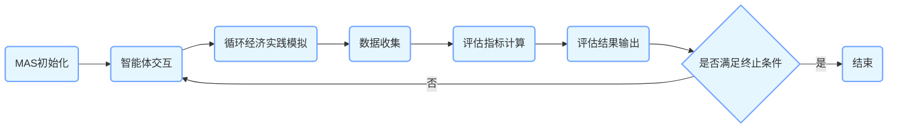

# 利用多智能体系统评估公司的循环经济实践

> 关键词：多智能体系统、循环经济实践、公司评估、智能决策、可持续发展

> 摘要：本文聚焦于利用多智能体系统对公司的循环经济实践进行评估。首先介绍了研究的背景，包括目的、预期读者、文档结构和相关术语。接着阐述了多智能体系统和循环经济实践的核心概念及其联系，并给出了相应的示意图和流程图。详细讲解了用于评估的核心算法原理，通过Python代码进行了具体说明。探讨了其中涉及的数学模型和公式，并举例解释。在项目实战部分，给出了开发环境搭建、源代码实现及解读。分析了该评估方法的实际应用场景，推荐了相关的学习资源、开发工具框架和论文著作。最后总结了未来发展趋势与挑战，解答了常见问题，并提供了扩展阅读和参考资料，旨在为企业和研究者提供全面且深入的技术指导。

## 1. 背景介绍 
### 1.1 目的和范围
在当今社会，循环经济已成为实现可持续发展的重要模式。公司的循环经济实践对于资源的高效利用、环境的保护以及经济的长期稳定发展具有重要意义。本研究的目的是利用多智能体系统建立一套科学、有效的评估体系，对公司的循环经济实践进行全面、客观的评估。通过评估，帮助公司了解自身在循环经济方面的优势和不足，为公司制定改进策略提供依据；同时，也为政府、投资者等利益相关者提供决策参考。

本研究的范围涵盖了公司循环经济实践的多个方面，包括资源利用效率、废弃物管理、产品设计与再利用等。通过多智能体系统模拟公司内部和外部的各种因素，综合考虑市场环境、政策法规等条件，实现对公司循环经济实践的动态评估。

### 1.2 预期读者
本文的预期读者主要包括以下几类：
- 企业管理人员：帮助他们了解如何利用多智能体系统评估公司的循环经济实践，从而制定更有效的可持续发展战略。
- 研究人员：为从事循环经济、多智能体系统等相关领域研究的学者提供新的研究思路和方法。
- 政府政策制定者：为其制定促进循环经济发展的政策提供参考依据。
- 投资者：辅助他们评估公司的可持续发展能力，做出更明智的投资决策。

### 1.3 文档结构概述
本文将按照以下结构展开：
- 核心概念与联系：介绍多智能体系统和循环经济实践的核心概念，阐述它们之间的联系，并通过示意图和流程图进行直观展示。
- 核心算法原理 & 具体操作步骤：详细讲解用于评估的核心算法原理，结合Python代码说明具体的操作步骤。
- 数学模型和公式 & 详细讲解 & 举例说明：给出评估过程中涉及的数学模型和公式，进行详细解释，并通过实际例子进行说明。
- 项目实战：代码实际案例和详细解释说明：介绍开发环境的搭建，给出源代码的详细实现和解读，分析代码的运行结果。
- 实际应用场景：探讨该评估方法在不同行业和场景中的实际应用。
- 工具和资源推荐：推荐相关的学习资源、开发工具框架和论文著作。
- 总结：未来发展趋势与挑战：总结多智能体系统评估公司循环经济实践的未来发展趋势，分析可能面临的挑战。
- 附录：常见问题与解答：解答读者在阅读过程中可能遇到的常见问题。
- 扩展阅读 & 参考资料：提供相关的扩展阅读内容和参考资料，方便读者进一步深入研究。

### 1.4 术语表
#### 1.4.1 核心术语定义
- 多智能体系统（Multi - Agent System, MAS）：由多个智能体组成的系统，每个智能体具有一定的自主性、智能性和交互能力，能够在复杂的环境中独立或协同完成任务。
- 循环经济实践（Circular Economy Practice）：公司为了实现资源的高效利用和减少废弃物排放，采取的一系列包括资源回收、再利用、产品设计优化等在内的经济活动。
- 评估指标体系（Evaluation Index System）：用于衡量公司循环经济实践水平的一系列指标的集合，包括资源利用率、废弃物回收率等。

#### 1.4.2 相关概念解释
- 智能体（Agent）：具有感知、决策和行动能力的实体，能够根据自身的目标和环境信息做出决策并采取相应的行动。
- 可持续发展（Sustainable Development）：既满足当代人的需求，又不损害后代人满足其需求的能力的发展模式。
- 生命周期评估（Life Cycle Assessment, LCA）：对产品、过程或活动从原材料获取到最终处置的整个生命周期内的环境影响进行评估的方法。

#### 1.4.3 缩略词列表
- MAS：Multi - Agent System（多智能体系统）
- LCA：Life Cycle Assessment（生命周期评估）

## 2. 核心概念与联系 

### 2.1 多智能体系统的原理
多智能体系统是一种分布式人工智能系统，由多个智能体组成。每个智能体可以看作是一个独立的个体，具有自己的知识、目标和能力。智能体之间通过通信和协作来完成共同的任务。

智能体的基本结构包括感知模块、决策模块和行动模块。感知模块用于获取环境信息，决策模块根据感知到的信息和自身的目标做出决策，行动模块根据决策结果采取相应的行动。

### 2.2 循环经济实践的内涵
循环经济实践强调资源的循环利用和减少废弃物的产生。公司的循环经济实践通常包括以下几个方面：
- 资源回收与再利用：对生产过程中产生的废弃物进行回收和再加工，使其重新成为可利用的资源。
- 产品设计优化：在产品设计阶段考虑产品的可拆解性、可回收性和可再利用性，延长产品的使用寿命。
- 绿色供应链管理：与供应商合作，确保原材料的可持续采购和运输，减少供应链中的环境影响。

### 2.3 多智能体系统与循环经济实践的联系
多智能体系统可以用于模拟公司循环经济实践中的各种因素和主体之间的交互。例如，可以将公司、供应商、消费者等看作不同的智能体，每个智能体具有自己的行为规则和目标。通过多智能体系统的模拟，可以评估公司的循环经济实践在不同市场环境和政策条件下的效果。

### 2.4 文本示意图
```plaintext
多智能体系统评估公司循环经济实践

                ┌─────────────────────┐
                │   多智能体系统    │
                ├─────────────────────┤
                │  智能体1（公司）    │
                │  智能体2（供应商）  │
                │  智能体3（消费者）  │
                │  ......            │
                └─────────────────────┘
                          │
                          │ 交互与协作
                          ▼
                ┌─────────────────────┐
                │  公司循环经济实践  │
                ├─────────────────────┤
                │  资源回收与再利用  │
                │  产品设计优化      │
                │  绿色供应链管理    │
                │  ......            │
                └─────────────────────┘
                          │
                          │ 评估结果
                          ▼
                ┌─────────────────────┐
                │  评估指标体系      │
                ├─────────────────────┤
                │  资源利用率        │
                │  废弃物回收率      │
                │  产品再利用比例    │
                │  ......            │
                └─────────────────────┘
```

### 2.5 Mermaid流程图


## 3. 核心算法原理 & 具体操作步骤 

### 3.1 核心算法原理
我们采用基于规则的算法来模拟多智能体系统中智能体的行为和交互。每个智能体根据预先定义的规则和自身的状态做出决策。例如，公司智能体根据市场需求、资源成本等因素决定是否增加资源回收和再利用的投入；供应商智能体根据公司的订单和自身的生产能力决定是否提供可持续的原材料。

在评估过程中，我们使用加权求和的方法计算公司循环经济实践的综合得分。每个评估指标赋予一个权重，通过将各指标的得分乘以相应的权重并求和，得到公司的综合得分。

### 3.2 具体操作步骤

#### 3.2.1 智能体初始化
为每个智能体设置初始状态和参数，包括公司的初始资源利用率、供应商的初始生产能力等。

#### 3.2.2 智能体交互
智能体之间进行通信和协作，根据环境信息和自身的目标做出决策。例如，公司向供应商发送订单，供应商根据订单情况做出响应。

#### 3.2.3 循环经济实践模拟
根据智能体的决策，模拟公司的循环经济实践过程，包括资源回收、产品设计优化等。

#### 3.2.4 数据收集
收集模拟过程中的相关数据，如资源利用率、废弃物排放量等。

#### 3.2.5 评估指标计算
根据收集到的数据，计算各项评估指标的得分。

#### 3.2.6 综合得分计算
根据各评估指标的权重，计算公司循环经济实践的综合得分。

#### 3.2.7 终止条件判断
判断是否满足终止条件，如达到预设的模拟时间或评估结果稳定。如果不满足终止条件，则返回步骤3.2.2继续进行模拟。

### 3.3 Python源代码实现
```python
import random

# 定义智能体类
class Agent:
    def __init__(self, name, initial_state):
        self.name = name
        self.state = initial_state

    def make_decision(self, environment):
        # 简单的决策规则示例
        if environment['market_demand'] > 50:
            self.state += random.randint(1, 5)
        else:
            self.state -= random.randint(1, 3)
        return self.state

# 定义环境类
class Environment:
    def __init__(self):
        self.market_demand = random.randint(1, 100)

    def update(self):
        self.market_demand = random.randint(1, 100)
        return self.market_demand

# 定义评估函数
def evaluate(company_state, supplier_state):
    # 简单的评估指标计算示例
    resource_utilization = (company_state + supplier_state) / 2
    return resource_utilization

# 主模拟函数
def simulation():
    # 初始化智能体
    company = Agent('Company', 50)
    supplier = Agent('Supplier', 60)
    environment = Environment()

    for i in range(10):
        # 智能体交互
        company_state = company.make_decision({'market_demand': environment.market_demand})
        supplier_state = supplier.make_decision({'market_demand': environment.market_demand})

        # 环境更新
        environment.update()

        # 评估
        score = evaluate(company_state, supplier_state)
        print(f'Step {i + 1}: Resource Utilization Score = {score}')

if __name__ == "__main__":
    simulation()
```

### 3.4 代码解释
- `Agent`类：表示智能体，包含智能体的名称和状态。`make_decision`方法根据环境信息做出决策，更新智能体的状态。
- `Environment`类：表示环境，包含市场需求信息。`update`方法用于更新市场需求。
- `evaluate`函数：根据公司和供应商的状态计算资源利用率得分。
- `simulation`函数：主模拟函数，初始化智能体和环境，进行多轮模拟，包括智能体交互、环境更新和评估。

## 4. 数学模型和公式 & 详细讲解 & 举例说明 

### 4.1 评估指标体系的数学模型
设公司循环经济实践的评估指标体系包含 $n$ 个指标，分别为 $x_1, x_2, \cdots, x_n$。每个指标的权重为 $w_1, w_2, \cdots, w_n$，且满足 $\sum_{i = 1}^{n} w_i = 1$。

公司循环经济实践的综合得分 $S$ 可以表示为：
$$S = \sum_{i = 1}^{n} w_i x_i$$

### 4.2 指标得分的计算
不同的评估指标有不同的计算方法。以下是几个常见指标的计算示例：

#### 4.2.1 资源利用率
资源利用率 $x_1$ 可以定义为公司实际利用的资源量 $R_{used}$ 与总资源投入量 $R_{total}$ 的比值：
$$x_1 = \frac{R_{used}}{R_{total}} \times 100\%$$

例如，公司在一个生产周期内投入了 100 吨原材料，实际利用了 80 吨，则资源利用率为：
$$x_1 = \frac{80}{100} \times 100\% = 80\%$$

#### 4.2.2 废弃物回收率
废弃物回收率 $x_2$ 可以定义为公司回收的废弃物量 $W_{recycled}$ 与产生的废弃物总量 $W_{total}$ 的比值：
$$x_2 = \frac{W_{recycled}}{W_{total}} \times 100\%$$

例如，公司在一个生产周期内产生了 50 吨废弃物，回收了 20 吨，则废弃物回收率为：
$$x_2 = \frac{20}{50} \times 100\% = 40\%$$

### 4.3 综合得分计算示例
假设评估指标体系包含资源利用率 $x_1$、废弃物回收率 $x_2$ 和产品再利用比例 $x_3$ 三个指标，权重分别为 $w_1 = 0.4$，$w_2 = 0.3$，$w_3 = 0.3$。

公司的资源利用率 $x_1 = 80\%$，废弃物回收率 $x_2 = 40\%$，产品再利用比例 $x_3 = 30\%$。

则公司循环经济实践的综合得分 $S$ 为：
$$S = 0.4 \times 80\% + 0.3 \times 40\% + 0.3 \times 30\%$$
$$S = 0.4 \times 0.8 + 0.3 \times 0.4 + 0.3 \times 0.3$$
$$S = 0.32 + 0.12 + 0.09$$
$$S = 0.53 = 53\%$$

## 5. 项目实战：代码实际案例和详细解释说明 

### 5.1  开发环境搭建
#### 5.1.1 安装Python
首先，需要安装Python开发环境。可以从Python官方网站（https://www.python.org/downloads/）下载适合自己操作系统的Python版本，并按照安装向导进行安装。

#### 5.1.2 安装必要的库
本项目主要使用Python的标准库，无需额外安装第三方库。如果需要进行数据可视化等操作，可以安装`matplotlib`、`seaborn`等库。可以使用以下命令进行安装：
```sh
pip install matplotlib seaborn
```

### 5.2  源代码详细实现和代码解读

#### 5.2.1 完整代码
```python
import random

# 定义智能体类
class Agent:
    def __init__(self, name, initial_state):
        self.name = name
        self.state = initial_state
        self.decision_history = []

    def make_decision(self, environment):
        # 复杂的决策规则示例
        if environment['market_demand'] > 70:
            if self.state < 80:
                self.state += random.randint(5, 10)
            else:
                self.state += random.randint(1, 3)
        elif environment['market_demand'] < 30:
            if self.state > 20:
                self.state -= random.randint(5, 10)
            else:
                self.state -= random.randint(1, 3)
        else:
            self.state += random.randint(-2, 2)

        self.decision_history.append(self.state)
        return self.state

# 定义环境类
class Environment:
    def __init__(self):
        self.market_demand = random.randint(1, 100)
        self.demand_history = [self.market_demand]

    def update(self):
        change = random.randint(-10, 10)
        self.market_demand = max(1, min(100, self.market_demand + change))
        self.demand_history.append(self.market_demand)
        return self.market_demand

# 定义评估函数
def evaluate(company_state, supplier_state):
    # 更复杂的评估指标计算示例
    resource_utilization = (company_state + supplier_state) / 2
    stability = abs(company_state - supplier_state)
    score = 0.7 * resource_utilization - 0.3 * stability
    return score

# 主模拟函数
def simulation():
    # 初始化智能体
    company = Agent('Company', 50)
    supplier = Agent('Supplier', 60)
    environment = Environment()

    scores = []
    for i in range(20):
        # 智能体交互
        company_state = company.make_decision({'market_demand': environment.market_demand})
        supplier_state = supplier.make_decision({'market_demand': environment.market_demand})

        # 环境更新
        environment.update()

        # 评估
        score = evaluate(company_state, supplier_state)
        scores.append(score)
        print(f'Step {i + 1}: Resource Utilization Score = {score}')

    import matplotlib.pyplot as plt
    plt.plot(range(1, 21), scores)
    plt.xlabel('Step')
    plt.ylabel('Score')
    plt.title('Company Circular Economy Practice Evaluation Score')
    plt.show()

if __name__ == "__main__":
    simulation()
```

#### 5.2.2 代码解读
- `Agent`类：
    - `__init__`方法：初始化智能体的名称、状态和决策历史记录。
    - `make_decision`方法：根据市场需求信息做出决策，更新智能体的状态，并记录决策历史。决策规则更加复杂，考虑了市场需求的不同区间和智能体自身的状态。
- `Environment`类：
    - `__init__`方法：初始化市场需求，并记录需求历史。
    - `update`方法：更新市场需求，确保需求在 1 到 100 之间，并记录更新后的需求。
- `evaluate`函数：计算评估得分，考虑了资源利用率和公司与供应商状态的稳定性。
- `simulation`函数：主模拟函数，进行 20 轮模拟，记录每一轮的评估得分，并使用`matplotlib`库绘制得分随轮数变化的折线图。

### 5.3  代码解读与分析
- 决策规则的改进：在`Agent`类的`make_decision`方法中，采用了更复杂的决策规则，考虑了市场需求的不同区间和智能体自身的状态，使智能体的决策更加符合实际情况。
- 评估指标的完善：在`evaluate`函数中，除了考虑资源利用率外，还考虑了公司与供应商状态的稳定性，使评估结果更加全面。
- 数据可视化：使用`matplotlib`库绘制评估得分随轮数变化的折线图，直观地展示了公司循环经济实践评估得分的变化趋势。

## 6. 实际应用场景 
### 6.1 制造业
在制造业中，利用多智能体系统评估公司的循环经济实践可以帮助企业优化生产流程，提高资源利用率。例如，通过模拟原材料供应商、生产企业和废弃物处理企业之间的交互，评估企业在资源回收和再利用方面的效果。企业可以根据评估结果调整采购策略、改进生产工艺，减少废弃物的产生，降低生产成本。

### 6.2 零售业
在零售业中，多智能体系统可以用于评估企业的绿色供应链管理和产品回收计划。例如，模拟零售商、供应商和消费者之间的交互，评估企业在推广可持续产品、回收包装材料等方面的实践效果。企业可以根据评估结果优化供应链，选择更环保的供应商，提高消费者对可持续产品的认知度和购买意愿。

### 6.3 能源行业
在能源行业中，多智能体系统可以评估企业在能源循环利用和节能减排方面的实践。例如，模拟能源生产企业、能源消费企业和能源监管部门之间的交互，评估企业在发展可再生能源、提高能源利用效率等方面的效果。企业可以根据评估结果调整能源结构，加大对可再生能源的投资，降低对传统能源的依赖。

## 7. 工具和资源推荐
### 7.1 学习资源推荐
#### 7.1.1 书籍推荐
- 《多智能体系统导论》：全面介绍了多智能体系统的基本概念、理论和方法，是学习多智能体系统的经典教材。
- 《循环经济：理论与实践》：系统阐述了循环经济的理论框架和实践案例，对于理解循环经济的内涵和应用具有重要参考价值。
- 《人工智能：一种现代的方法》：涵盖了人工智能的各个领域，包括多智能体系统，提供了丰富的理论和算法知识。

#### 7.1.2 在线课程
- Coursera上的“Multi - Agent Systems”课程：由知名教授授课，详细讲解了多智能体系统的原理和应用。
- edX上的“Circular Economy and Sustainability”课程：介绍了循环经济的基本概念和实践方法，以及如何在企业中实现可持续发展。
- 中国大学MOOC上的“人工智能基础”课程：提供了人工智能的基础知识，包括多智能体系统的入门内容。

#### 7.1.3 技术博客和网站
- AI Time：分享人工智能领域的最新研究成果和技术动态，包括多智能体系统的相关内容。
- 循环经济产业网：提供循环经济领域的政策法规、行业动态和实践案例，是了解循环经济的重要信息平台。
- arXiv：一个预印本平台，包含了大量关于多智能体系统和循环经济的研究论文。

### 7.2 开发工具框架推荐
#### 7.2.1 IDE和编辑器
- PyCharm：一款专业的Python集成开发环境，提供了丰富的代码编辑、调试和版本控制功能，适合开发多智能体系统相关的Python代码。
- Visual Studio Code：一款轻量级的代码编辑器，支持多种编程语言和插件扩展，方便进行快速开发和调试。

#### 7.2.2 调试和性能分析工具
- PDB：Python自带的调试器，可以帮助开发者逐行调试代码，查找和解决问题。
- cProfile：Python的性能分析工具，可以分析代码的运行时间和函数调用情况，帮助优化代码性能。

#### 7.2.3 相关框架和库
- Mesa：一个用于构建基于代理的模型的Python框架，提供了丰富的工具和类，方便开发多智能体系统。
- NetworkX：一个用于创建、操作和研究复杂网络的Python库，可以用于模拟智能体之间的交互网络。

### 7.3 相关论文著作推荐
#### 7.3.1 经典论文
- “Multi - Agent Systems: A Modern Approach to Distributed Artificial Intelligence”：该论文系统地介绍了多智能体系统的基本概念、体系结构和算法，是多智能体系统领域的经典之作。
- “Towards a Circular Economy”：探讨了循环经济的理论基础和实践路径，对循环经济的发展产生了重要影响。

#### 7.3.2 最新研究成果
- 关注顶级学术会议如AAAI（Association for the Advancement of Artificial Intelligence）、IJCAI（International Joint Conference on Artificial Intelligence）上发表的关于多智能体系统在循环经济评估中的应用研究。
- 查阅《Journal of Industrial and Production Engineering》、《Resources, Conservation and Recycling》等期刊上的最新研究论文。

#### 7.3.3 应用案例分析
- 研究一些知名企业在循环经济实践中的成功案例，如苹果公司的产品回收计划、宝马公司的可持续生产模式等。分析这些案例中多智能体系统的应用方法和效果，为实际应用提供参考。

## 8. 总结：未来发展趋势与挑战
### 8.1 未来发展趋势
- 与大数据和人工智能技术的深度融合：随着大数据和人工智能技术的不断发展，多智能体系统可以结合更多的数据来源和先进的算法，提高评估的准确性和可靠性。例如，利用机器学习算法对大量的企业数据进行分析，优化评估指标体系和决策规则。
- 跨领域应用的拓展：多智能体系统评估公司循环经济实践的应用将不再局限于传统的行业，而是向更多领域拓展，如农业、服务业等。通过模拟不同领域的主体交互，实现更广泛的循环经济实践评估。
- 实时动态评估：未来的评估系统将具备实时动态评估的能力，能够根据企业的实时数据和市场环境的变化，及时调整评估结果，为企业提供更及时的决策支持。

### 8.2 挑战
- 数据获取和质量问题：多智能体系统评估需要大量的企业数据和市场数据，但数据的获取往往存在困难，并且数据质量也难以保证。例如，企业可能不愿意共享敏感数据，数据的准确性和完整性也可能受到影响。
- 模型的复杂性和可解释性：随着多智能体系统模型的不断复杂，模型的可解释性成为一个挑战。如何让企业和决策者理解模型的评估结果和决策依据，是需要解决的问题。
- 标准和规范的缺乏：目前，对于公司循环经济实践的评估还缺乏统一的标准和规范。不同的评估方法和指标体系可能导致评估结果的差异，影响评估的公正性和可比性。

## 9. 附录：常见问题与解答
### 9.1 多智能体系统的开发难度大吗？
多智能体系统的开发难度取决于系统的复杂度和应用场景。对于简单的多智能体系统，使用Python等编程语言可以相对容易地实现。但对于复杂的系统，需要考虑智能体的行为规则设计、交互机制、通信协议等多个方面，开发难度会相应增加。不过，借助现有的开发框架和工具，可以降低开发的难度。

### 9.2 如何确定评估指标的权重？
确定评估指标的权重可以采用多种方法，如层次分析法（AHP）、德尔菲法等。层次分析法通过对指标进行两两比较，构建判断矩阵，计算指标的相对权重。德尔菲法通过专家咨询和反馈，逐步确定指标的权重。在实际应用中，可以根据具体情况选择合适的方法，并结合企业的战略目标和重点关注领域进行调整。

### 9.3 多智能体系统评估结果的准确性如何保证？
为了保证多智能体系统评估结果的准确性，需要从以下几个方面入手：
- 数据质量：确保输入数据的准确性、完整性和可靠性，可以通过数据清洗、验证等方法提高数据质量。
- 模型合理性：设计合理的智能体行为规则和评估指标体系，根据实际情况进行调整和优化。
- 模型验证：使用历史数据或实际案例对模型进行验证，评估模型的准确性和可靠性。

### 9.4 多智能体系统评估可以替代人工评估吗？
多智能体系统评估可以为企业提供客观、全面的评估结果，但不能完全替代人工评估。人工评估可以结合专家的经验和判断力，考虑一些难以量化的因素。在实际应用中，可以将多智能体系统评估和人工评估相结合，提高评估的准确性和有效性。

## 10. 扩展阅读 & 参考资料
### 10.1 扩展阅读
- 《复杂适应系统：社会生活计算模型导论》：介绍了复杂适应系统的概念和应用，有助于深入理解多智能体系统的原理和机制。
- 《可持续发展经济学》：探讨了可持续发展的经济理论和政策，为理解循环经济的经济背景提供了参考。
- 《智能系统中的概率推理：可信网络》：讲解了概率推理在智能系统中的应用，对于多智能体系统的决策和评估有一定的启示作用。

### 10.2 参考资料
- 相关的行业报告和统计数据，如《全球循环经济报告》、《中国制造业循环经济发展报告》等。
- 政府发布的关于循环经济的政策法规和指导文件，如《循环经济促进法》等。
- 学术数据库中的相关研究论文，如IEEE Xplore、ACM Digital Library等。

作者：AI天才研究院/AI Genius Institute & 禅与计算机程序设计艺术 /Zen And The Art of Computer Programming