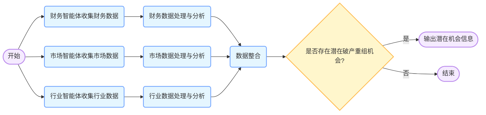

# 利用多智能体系统识别潜在的破产重组机会

> 关键词：多智能体系统、破产重组机会识别、人工智能、金融分析、决策支持

> 摘要：本文聚焦于利用多智能体系统识别潜在的破产重组机会这一前沿课题。首先介绍了研究的背景、目的、预期读者等信息，对相关术语进行了清晰定义。详细阐述了多智能体系统的核心概念、原理及架构，通过Python代码深入讲解了核心算法原理与具体操作步骤。运用数学模型和公式对该过程进行了理论分析，并给出举例说明。通过项目实战展示了如何搭建开发环境、实现源代码并进行解读分析。探讨了该技术在实际金融场景中的应用，推荐了学习资源、开发工具框架以及相关论文著作。最后总结了未来发展趋势与挑战，提供了常见问题解答和扩展阅读参考资料，旨在为相关领域的研究者和从业者提供全面且深入的技术指导。

## 1. 背景介绍 
### 1.1 目的和范围
在当今复杂多变的金融市场环境中，企业面临着诸多不确定性，破产重组事件时有发生。准确识别潜在的破产重组机会对于投资者、金融机构以及监管部门都具有重要意义。投资者可以通过提前发现这些机会，进行合理的资产配置和投资决策，获取潜在的高额回报；金融机构能够更好地评估风险，优化信贷策略；监管部门则可以加强对市场的监测和调控，维护金融市场的稳定。

本研究的范围主要集中在利用多智能体系统这一先进技术手段，综合考虑企业的财务状况、市场环境、行业竞争等多方面因素，构建一个高效、准确的潜在破产重组机会识别模型。研究将涵盖从理论模型的构建到实际应用的全过程，包括核心算法的设计、数学模型的建立、项目实战以及实际应用场景的分析等。

### 1.2 预期读者
本文预期读者包括金融领域的专业人士，如投资经理、风险分析师、信贷审批人员等，他们可以通过本文了解如何利用多智能体系统提升破产重组机会识别的准确性和效率，为投资决策和风险管理提供支持。同时，计算机科学领域的研究者和开发者也能从中获得启发，进一步探索多智能体系统在金融领域的应用。此外，对金融科技感兴趣的学生和学者也可以将本文作为学习和研究的参考资料。

### 1.3 文档结构概述
本文将按照以下结构展开：首先介绍研究的背景信息，包括目的、范围、预期读者和文档结构概述，并对相关术语进行定义和解释。接着详细阐述多智能体系统的核心概念、原理及架构，通过文本示意图和Mermaid流程图进行直观展示。然后深入讲解核心算法原理和具体操作步骤，结合Python代码进行详细说明。运用数学模型和公式对该过程进行理论分析，并给出具体的举例说明。通过项目实战，展示如何搭建开发环境、实现源代码并进行解读分析。探讨该技术在实际金融场景中的应用。推荐学习资源、开发工具框架以及相关论文著作。最后总结未来发展趋势与挑战，提供常见问题解答和扩展阅读参考资料。

### 1.4 术语表
#### 1.4.1 核心术语定义
- **多智能体系统（Multi - Agent System, MAS）**：由多个智能体组成的系统，每个智能体具有一定的自主性、智能性和交互能力，能够在复杂的环境中通过相互协作实现共同的目标。
- **破产重组**：当企业出现财务困境、资不抵债等情况时，通过一系列的法律程序和重组措施，对企业的资产、债务、股权等进行重新整合和调整，以恢复企业的经营能力和盈利能力。
- **潜在破产重组机会**：指企业虽然目前尚未正式进入破产重组程序，但存在一些迹象和因素表明其未来有可能进行破产重组的情况。
- **智能体（Agent）**：具有感知环境、做出决策和执行动作能力的实体，在多智能体系统中可以是软件程序、机器人等。

#### 1.4.2 相关概念解释
- **自主性**：智能体能够在没有外部直接干预的情况下，独立地感知环境并做出决策和行动。
- **智能性**：智能体具有一定的知识和推理能力，能够根据环境信息和自身目标做出合理的决策。
- **交互能力**：智能体之间可以通过某种通信机制进行信息交换和协作，以实现共同的目标。

#### 1.4.3 缩略词列表
- MAS：Multi - Agent System（多智能体系统）

## 2. 核心概念与联系 
### 核心概念原理
多智能体系统的核心原理在于多个智能体之间的协作和交互。每个智能体都有自己的目标和任务，它们通过感知环境信息，与其他智能体进行通信和协作，共同完成复杂的任务。在利用多智能体系统识别潜在的破产重组机会的场景中，不同类型的智能体可以分别负责收集企业的财务数据、市场信息、行业动态等，然后通过相互协作和信息共享，对企业的状况进行综合评估，从而识别出潜在的破产重组机会。

例如，财务智能体可以专门负责收集和分析企业的财务报表，包括资产负债表、利润表、现金流量表等，评估企业的财务健康状况；市场智能体可以关注企业的市场份额、产品销售情况、股价波动等市场信息；行业智能体则可以了解行业的发展趋势、竞争格局等。这些智能体通过通信机制将各自收集到的信息进行共享和整合，然后运用一定的算法和模型进行分析，最终得出企业是否存在潜在破产重组机会的结论。

### 架构的文本示意图
以下是一个简单的多智能体系统用于识别潜在破产重组机会的架构文本示意图：

|智能体类型|功能|信息来源|输出信息|
| ---- | ---- | ---- | ---- |
|财务智能体|收集和分析企业财务报表，评估财务状况|企业财务报表|财务指标分析结果，如资产负债率、利润率等|
|市场智能体|关注企业市场表现，包括市场份额、销售情况、股价等|市场数据平台、证券交易所|市场表现评估结果，如市场份额变化、股价波动情况等|
|行业智能体|了解行业发展趋势、竞争格局等|行业研究报告、行业协会数据|行业分析结果，如行业增长率、竞争激烈程度等|
|决策智能体|综合各智能体信息，进行决策判断|财务智能体、市场智能体、行业智能体|潜在破产重组机会判断结果|

### Mermaid 流程图


## 3. 核心算法原理 & 具体操作步骤 
### 核心算法原理
在利用多智能体系统识别潜在的破产重组机会中，核心算法主要涉及数据处理、特征提取和分类决策等步骤。以下是一个基于机器学习的分类算法示例，使用逻辑回归算法进行潜在破产重组机会的判断。

逻辑回归是一种常用的分类算法，它通过对输入特征进行线性组合，然后使用逻辑函数将线性组合的结果映射到概率值，从而实现分类任务。在本场景中，输入特征可以是财务指标、市场指标和行业指标等，输出是企业是否存在潜在破产重组机会的概率。

### 具体操作步骤
1. **数据收集**：各个智能体分别收集企业的财务数据、市场数据和行业数据。
2. **数据预处理**：对收集到的数据进行清洗、缺失值处理、归一化等操作，以提高数据质量。
3. **特征提取**：从预处理后的数据中提取有代表性的特征，如资产负债率、利润率、市场份额等。
4. **模型训练**：使用历史数据对逻辑回归模型进行训练，确定模型的参数。
5. **预测判断**：将新的数据输入到训练好的模型中，得到企业是否存在潜在破产重组机会的概率，根据设定的阈值进行判断。

### Python源代码实现
```python
import numpy as np
from sklearn.linear_model import LogisticRegression
from sklearn.model_selection import train_test_split
from sklearn.preprocessing import StandardScaler

# 模拟数据生成
# 假设我们有n个样本，每个样本有m个特征
n = 1000
m = 5
X = np.random.randn(n, m)
# 生成标签，0表示不存在潜在破产重组机会，1表示存在
y = np.random.randint(0, 2, n)

# 数据预处理：归一化
scaler = StandardScaler()
X_scaled = scaler.fit_transform(X)

# 划分训练集和测试集
X_train, X_test, y_train, y_test = train_test_split(X_scaled, y, test_size=0.2, random_state=42)

# 模型训练
model = LogisticRegression()
model.fit(X_train, y_train)

# 预测
y_pred = model.predict(X_test)

# 评估模型
accuracy = np.mean(y_pred == y_test)
print(f"模型准确率: {accuracy}")
```

### 代码解释
1. **数据生成**：使用`numpy`生成模拟的特征数据`X`和标签数据`y`。
2. **数据预处理**：使用`StandardScaler`对特征数据进行归一化处理，以提高模型的训练效果。
3. **数据划分**：使用`train_test_split`将数据划分为训练集和测试集，比例为8:2。
4. **模型训练**：使用`LogisticRegression`创建逻辑回归模型，并使用训练集数据进行训练。
5. **预测和评估**：使用训练好的模型对测试集数据进行预测，并计算模型的准确率。

## 4. 数学模型和公式 & 详细讲解 & 举例说明 
### 逻辑回归数学模型
逻辑回归的数学模型可以表示为：

$$P(y = 1|x) = \frac{1}{1 + e^{-(w_0 + w_1x_1 + w_2x_2 + \cdots + w_mx_m)}}$$

其中，$P(y = 1|x)$ 表示在给定特征向量 $x = (x_1, x_2, \cdots, x_m)$ 的情况下，样本属于正类（即存在潜在破产重组机会）的概率；$w_0, w_1, w_2, \cdots, w_m$ 是模型的参数；$e$ 是自然常数。

### 详细讲解
逻辑回归通过对输入特征进行线性组合 $z = w_0 + w_1x_1 + w_2x_2 + \cdots + w_mx_m$，然后使用逻辑函数 $\sigma(z) = \frac{1}{1 + e^{-z}}$ 将线性组合的结果映射到概率值。逻辑函数的取值范围是 $(0, 1)$，可以将其解释为概率。

在训练过程中，逻辑回归的目标是找到一组参数 $w_0, w_1, w_2, \cdots, w_m$，使得模型对训练数据的预测概率尽可能接近真实标签。通常使用最大似然估计的方法来求解参数，即最大化似然函数：

$$L(w) = \prod_{i = 1}^{n} [P(y^{(i)} = 1|x^{(i)})]^{y^{(i)}} [1 - P(y^{(i)} = 1|x^{(i)})]^{1 - y^{(i)}}$$

为了方便计算，通常对似然函数取对数，得到对数似然函数：

$$\ell(w) = \sum_{i = 1}^{n} [y^{(i)} \log P(y^{(i)} = 1|x^{(i)}) + (1 - y^{(i)}) \log (1 - P(y^{(i)} = 1|x^{(i)}))]$$

然后使用梯度下降等优化算法来最大化对数似然函数，从而得到最优的参数 $w$。

### 举例说明
假设我们有一个简单的逻辑回归模型，只有两个特征 $x_1$ 和 $x_2$，模型的参数为 $w_0 = -1$，$w_1 = 0.5$，$w_2 = 0.3$。给定一个样本 $x = (2, 3)$，我们可以计算该样本属于正类的概率：

首先计算线性组合：

$$z = w_0 + w_1x_1 + w_2x_2 = -1 + 0.5 \times 2 + 0.3 \times 3 = -1 + 1 + 0.9 = 0.9$$

然后使用逻辑函数计算概率：

$$P(y = 1|x) = \frac{1}{1 + e^{-z}} = \frac{1}{1 + e^{-0.9}} \approx 0.71$$

如果我们设定的阈值为 0.5，那么根据计算结果，该样本被预测为正类，即存在潜在破产重组机会。

## 5. 项目实战：代码实际案例和详细解释说明 
### 5.1  开发环境搭建
#### 操作系统
可以选择 Windows、Linux 或 macOS 操作系统，本案例以 Windows 10 为例进行说明。

#### 编程语言和版本
使用 Python 3.8 及以上版本，Python 是一种功能强大且易于学习的编程语言，拥有丰富的科学计算和机器学习库。

#### 安装必要的库
使用`pip`命令安装以下必要的库：
```sh
pip install numpy pandas scikit-learn matplotlib
```
- `numpy`：用于数值计算和数组操作。
- `pandas`：用于数据处理和分析。
- `scikit-learn`：提供了丰富的机器学习算法和工具。
- `matplotlib`：用于数据可视化。

### 5.2  源代码详细实现和代码解读
```python
import pandas as pd
import numpy as np
from sklearn.linear_model import LogisticRegression
from sklearn.model_selection import train_test_split
from sklearn.preprocessing import StandardScaler
from sklearn.metrics import accuracy_score
import matplotlib.pyplot as plt

# 1. 数据加载
data = pd.read_csv('bankruptcy_data.csv')

# 2. 数据预处理
# 分离特征和标签
X = data.drop('bankruptcy', axis=1)
y = data['bankruptcy']

# 处理缺失值
X = X.fillna(X.mean())

# 归一化处理
scaler = StandardScaler()
X_scaled = scaler.fit_transform(X)

# 3. 数据划分
X_train, X_test, y_train, y_test = train_test_split(X_scaled, y, test_size=0.2, random_state=42)

# 4. 模型训练
model = LogisticRegression()
model.fit(X_train, y_train)

# 5. 模型预测
y_pred = model.predict(X_test)

# 6. 模型评估
accuracy = accuracy_score(y_test, y_pred)
print(f"模型准确率: {accuracy}")

# 7. 特征重要性分析
feature_importance = pd.DataFrame({'feature': X.columns, 'importance': model.coef_[0]})
feature_importance = feature_importance.sort_values('importance', ascending=False)

# 8. 可视化特征重要性
plt.figure(figsize=(10, 6))
plt.bar(feature_importance['feature'], feature_importance['importance'])
plt.xticks(rotation=90)
plt.xlabel('特征')
plt.ylabel('重要性')
plt.title('特征重要性分析')
plt.show()
```

### 5.3  代码解读与分析
#### 数据加载
使用`pandas`的`read_csv`函数加载包含企业破产信息的数据集`bankruptcy_data.csv`。

#### 数据预处理
- **分离特征和标签**：将数据集中的特征列和标签列（`bankruptcy`）分离。
- **处理缺失值**：使用特征列的均值填充缺失值。
- **归一化处理**：使用`StandardScaler`对特征数据进行归一化，使特征具有相同的尺度，提高模型的训练效果。

#### 数据划分
使用`train_test_split`将数据划分为训练集和测试集，比例为 8:2。

#### 模型训练
使用`LogisticRegression`创建逻辑回归模型，并使用训练集数据进行训练。

#### 模型预测
使用训练好的模型对测试集数据进行预测。

#### 模型评估
使用`accuracy_score`计算模型的准确率，评估模型的性能。

#### 特征重要性分析
通过查看逻辑回归模型的系数，分析每个特征对预测结果的重要性，并将结果存储在`feature_importance`数据框中。

#### 可视化特征重要性
使用`matplotlib`绘制特征重要性的柱状图，直观展示每个特征的重要性。

## 6. 实际应用场景 
### 投资者决策
投资者可以利用多智能体系统识别潜在的破产重组机会，提前布局相关企业的股票、债券等资产。当识别出某个企业存在潜在破产重组机会时，投资者可以深入研究该企业的重组方案和发展前景，如果认为重组成功后企业的价值将大幅提升，就可以在合适的时机买入相关资产，等待重组带来的收益。

### 金融机构风险管理
金融机构在进行信贷审批、投资决策等业务时，需要评估企业的信用风险。通过多智能体系统识别潜在的破产重组机会，金融机构可以提前发现存在风险的企业，采取相应的措施，如调整信贷额度、增加担保要求等，降低信贷风险。同时，对于已经存在风险的企业，金融机构可以参与其破产重组过程，争取最大限度地收回债权。

### 监管部门市场监测
监管部门可以利用多智能体系统对金融市场进行实时监测，及时发现潜在的破产重组事件。通过对多个企业的综合分析，监管部门可以了解行业的整体风险状况，制定相应的监管政策和措施，维护金融市场的稳定。例如，当发现某个行业中存在较多企业有潜在破产重组风险时，监管部门可以加强对该行业的监管力度，引导企业进行合理的重组和调整。

### 企业自身战略规划
企业自身也可以利用多智能体系统分析行业内其他企业的潜在破产重组机会，为自身的战略规划提供参考。如果发现竞争对手存在破产重组的可能性，企业可以考虑通过并购、合作等方式获取其市场份额和资源，提升自身的竞争力。同时，企业也可以借鉴其他企业的破产重组经验，加强自身的风险管理和战略调整。

## 7. 工具和资源推荐
### 7.1 学习资源推荐
#### 7.1.1 书籍推荐
- 《多智能体系统导论》：全面介绍了多智能体系统的基本概念、理论和方法，是学习多智能体系统的经典教材。
- 《Python机器学习实战》：通过大量的实际案例，介绍了如何使用 Python 进行机器学习算法的实现和应用，对于理解和掌握利用多智能体系统进行数据分析和决策具有重要的参考价值。
- 《金融风险管理》：详细阐述了金融风险管理的理论和方法，结合实际金融场景，有助于读者将多智能体系统应用到金融风险评估和破产重组机会识别中。

#### 7.1.2 在线课程
- Coursera 上的“Machine Learning”课程：由斯坦福大学的 Andrew Ng 教授授课，系统地介绍了机器学习的基本概念、算法和应用，是学习机器学习的优质课程。
- edX 上的“Artificial Intelligence: Foundations of Computational Agents”课程：深入讲解了人工智能的基础理论和多智能体系统的相关知识，适合对多智能体系统感兴趣的学习者。
- 中国大学MOOC上的“金融数据分析与挖掘”课程：结合金融领域的实际问题，介绍了数据分析和挖掘的方法和技术，对于将多智能体系统应用于金融分析具有指导意义。

#### 7.1.3 技术博客和网站
- Medium：是一个汇聚了众多技术专家和开发者的博客平台，上面有很多关于多智能体系统、机器学习和金融科技的优质文章。
- Towards Data Science：专注于数据科学和机器学习领域的知识分享，提供了大量的技术文章和案例分析。
- 金融界网站：提供了丰富的金融市场信息和行业研究报告，有助于了解金融市场的动态和企业的财务状况。

### 7.2 开发工具框架推荐
#### 7.2.1 IDE和编辑器
- PyCharm：是一款专门为 Python 开发设计的集成开发环境（IDE），具有强大的代码编辑、调试和项目管理功能，适合开发复杂的 Python 项目。
- Jupyter Notebook：是一个基于网页的交互式开发环境，支持多种编程语言，特别适合进行数据分析和模型实验。用户可以在 Notebook 中编写代码、运行代码块、展示数据可视化结果等，方便进行快速迭代和验证。
- Visual Studio Code：是一款轻量级的代码编辑器，具有丰富的插件生态系统，可以通过安装各种插件来扩展其功能，支持 Python 开发和多智能体系统的开发。

#### 7.2.2 调试和性能分析工具
- PDB：是 Python 自带的调试工具，可以在代码中设置断点，逐行执行代码，查看变量的值和程序的执行流程，帮助开发者定位和解决代码中的问题。
- cProfile：是 Python 标准库中的性能分析工具，可以统计程序中各个函数的执行时间和调用次数，帮助开发者找出程序的性能瓶颈。
- TensorBoard：是 TensorFlow 提供的可视化工具，也可以用于其他深度学习框架的可视化。它可以展示模型的训练过程、损失函数的变化、模型的结构等信息，帮助开发者更好地理解和优化模型。

#### 7.2.3 相关框架和库
- Mesa：是一个用于构建多智能体系统的 Python 框架，提供了丰富的工具和接口，方便开发者快速搭建和模拟多智能体系统。
- scikit-learn：是一个常用的机器学习库，提供了各种机器学习算法和工具，如分类、回归、聚类等，可用于构建潜在破产重组机会识别模型。
- Pandas：是一个强大的数据处理和分析库，提供了高效的数据结构和数据操作方法，适合对企业的财务数据、市场数据等进行处理和分析。

### 7.3 相关论文著作推荐
#### 7.3.1 经典论文
- “Multi - Agent Systems: A Modern Approach to Distributed Artificial Intelligence”：该论文全面介绍了多智能体系统的概念、理论和应用，是多智能体系统领域的经典之作。
- “Logistic Regression: A Self - Learning Text”：详细阐述了逻辑回归算法的原理、实现和应用，对于理解和应用逻辑回归模型进行分类任务具有重要的参考价值。
- “Financial Distress Prediction Using Machine Learning Techniques”：探讨了如何使用机器学习技术进行金融困境预测，为利用多智能体系统识别潜在破产重组机会提供了理论基础和方法借鉴。

#### 7.3.2 最新研究成果
- 在 IEEE Transactions on Neural Networks and Learning Systems、Journal of Financial Economics 等学术期刊上，经常发表关于多智能体系统在金融领域应用、机器学习在破产预测中的最新研究成果。可以通过学术数据库如 IEEE Xplore、ScienceDirect 等进行搜索和阅读。

#### 7.3.3 应用案例分析
- 《金融科技应用案例集》：收集了多个金融科技领域的实际应用案例，包括利用数据分析和人工智能技术进行风险评估、投资决策等方面的案例，对于理解多智能体系统在金融领域的实际应用具有参考价值。
- 各大金融机构和科技公司的官方网站上也会发布一些关于金融科技应用的案例和研究报告，可以关注这些信息，了解行业内的最新动态和实践经验。

## 8. 总结：未来发展趋势与挑战
### 未来发展趋势
#### 与深度学习的融合
未来，多智能体系统可能会与深度学习技术更紧密地融合。深度学习具有强大的特征提取和模式识别能力，可以处理复杂的非结构化数据，如文本、图像等。通过将深度学习模型引入多智能体系统中，可以提高智能体对环境信息的感知和理解能力，从而更准确地识别潜在的破产重组机会。

#### 强化学习的应用
强化学习可以让智能体在与环境的交互中不断学习和优化策略，以实现长期的最优目标。在利用多智能体系统识别潜在破产重组机会的场景中，强化学习可以用于优化智能体的决策过程，例如智能体如何选择收集信息的方式、如何与其他智能体进行协作等，从而提高整个系统的性能和效率。

#### 跨领域应用拓展
除了金融领域，多智能体系统识别潜在破产重组机会的技术还可能拓展到其他领域，如制造业、能源业等。在这些领域中，企业也面临着类似的破产重组问题，通过将该技术应用到这些领域，可以帮助企业和相关机构更好地应对风险，实现资源的优化配置。

### 挑战
#### 数据质量和隐私问题
准确识别潜在的破产重组机会需要大量高质量的数据，但实际中数据可能存在缺失、错误、不一致等问题，影响模型的准确性和可靠性。此外，企业的财务数据、市场信息等往往涉及商业机密和个人隐私，如何在保证数据质量的同时，保护数据的安全和隐私是一个亟待解决的问题。

#### 模型可解释性
深度学习和强化学习等复杂模型虽然在性能上表现出色，但往往缺乏可解释性。在金融领域，决策需要有明确的依据和解释，因此如何提高模型的可解释性，让决策者能够理解模型的决策过程和结果，是一个重要的挑战。

#### 智能体协作和协调
多智能体系统中，智能体之间的协作和协调是实现系统目标的关键。然而，不同智能体可能具有不同的目标、策略和行为方式，如何设计有效的协作机制，确保智能体之间能够高效地协作，避免冲突和矛盾，是一个具有挑战性的问题。

## 9. 附录：常见问题与解答
### 问题 1：多智能体系统中的智能体是如何通信的？
答：智能体之间的通信方式有多种，常见的包括消息传递、共享内存、黑板系统等。消息传递是最常用的方式，智能体通过发送和接收消息来交换信息。消息可以包含数据、请求、指令等内容。共享内存方式是指智能体通过访问共享的内存区域来读取和写入信息。黑板系统则是一个共享的数据结构，智能体可以在黑板上发布和获取信息。

### 问题 2：如何评估多智能体系统识别潜在破产重组机会的准确性？
答：可以使用多种指标来评估系统的准确性，如准确率、召回率、F1 值等。准确率是指预测正确的样本数占总样本数的比例；召回率是指实际为正类的样本中被正确预测为正类的比例；F1 值是准确率和召回率的调和平均值。此外，还可以使用交叉验证等方法来评估模型的泛化能力。

### 问题 3：多智能体系统是否可以实时识别潜在破产重组机会？
答：理论上，多智能体系统可以实现实时识别。但要实现实时识别，需要解决数据实时采集、处理和传输等问题。同时，模型的计算复杂度也需要优化，以确保能够在短时间内完成预测。在实际应用中，需要根据具体的需求和系统资源来权衡实时性和准确性。

### 问题 4：如何选择合适的特征用于潜在破产重组机会的识别？
答：选择合适的特征需要综合考虑多个因素。首先，可以从财务、市场、行业等多个维度选取特征，如财务指标（资产负债率、利润率等）、市场指标（市场份额、股价波动等）、行业指标（行业增长率、竞争激烈程度等）。其次，可以使用特征选择方法，如相关性分析、方差分析、递归特征消除等，来筛选出对预测结果影响较大的特征。此外，还可以结合领域知识和经验，选择具有实际意义的特征。

## 10. 扩展阅读 & 参考资料
### 扩展阅读
- 《人工智能：一种现代的方法》：全面介绍了人工智能的基本概念、理论和方法，包括搜索算法、知识表示、机器学习等内容，对于深入理解多智能体系统的基础理论具有重要的帮助。
- 《大数据时代：生活、工作与思维的大变革》：探讨了大数据对社会、经济和生活的影响，以及如何利用大数据进行决策和创新。在利用多智能体系统识别潜在破产重组机会的过程中，大数据的采集、处理和分析是关键环节，这本书可以提供相关的思路和方法。
- 《复杂经济学：经济思想的新框架》：介绍了复杂经济学的基本概念和理论，强调经济系统是一个复杂的自适应系统，其中的个体（企业、消费者等）具有自主性和适应性。多智能体系统可以用于模拟和分析复杂经济系统中的现象，这本书可以为相关研究提供理论支持。

### 参考资料
- 相关学术期刊和会议论文，如 IEEE Transactions on Systems, Man, and Cybernetics: Systems、ACM Transactions on Intelligent Systems and Technology 等。
- 金融机构和监管部门发布的报告和统计数据，如中国人民银行、银保监会等发布的金融统计数据和监管报告。
- 企业的财务报表和公告，如上市公司的年报、半年报等。

作者：AI天才研究院/AI Genius Institute & 禅与计算机程序设计艺术 /Zen And The Art of Computer Programming