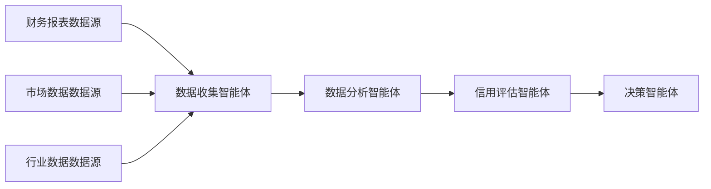

# 利用多智能体系统进行全面的公司信用风险分析

> 关键词：多智能体系统、公司信用风险分析、人工智能、信用评估模型、风险预警

> 摘要：本文旨在探讨如何利用多智能体系统进行全面的公司信用风险分析。首先介绍了多智能体系统和公司信用风险分析的背景知识，阐述了核心概念及它们之间的联系，给出了相关的原理和架构示意图。接着详细讲解了核心算法原理，并用Python代码进行阐述，同时介绍了相关的数学模型和公式。通过项目实战，展示了如何搭建开发环境、实现源代码并进行解读。分析了该技术在实际中的应用场景，推荐了学习资源、开发工具框架以及相关论文著作。最后总结了未来发展趋势与挑战，解答了常见问题，并提供了扩展阅读和参考资料。

## 1. 背景介绍 
### 1.1 目的和范围
公司信用风险分析对于金融机构、投资者和商业合作伙伴来说至关重要。准确评估公司的信用风险可以帮助他们做出合理的决策，如是否提供贷款、是否进行投资等。传统的信用风险分析方法往往依赖于单一的模型和有限的数据来源，难以全面、动态地反映公司的信用状况。

本文章的目的是介绍如何利用多智能体系统来进行全面的公司信用风险分析。多智能体系统由多个自主的智能体组成，这些智能体可以通过交互和协作来完成复杂的任务。我们将探讨如何设计和实现一个基于多智能体系统的信用风险分析模型，该模型可以整合多种数据来源，考虑公司的多个方面的信息，提高信用风险评估的准确性和可靠性。

本文的范围涵盖了多智能体系统的基本概念、公司信用风险分析的相关理论、核心算法原理、数学模型、项目实战、实际应用场景以及未来发展趋势等方面。

### 1.2 预期读者
本文的预期读者包括金融行业的从业者，如银行信贷人员、投资分析师、风险管理专家等；计算机科学领域的研究人员和开发者，特别是对人工智能、多智能体系统感兴趣的人员；以及对公司信用风险分析有兴趣的学者和学生。

### 1.3 文档结构概述
本文的结构如下：
- 核心概念与联系：介绍多智能体系统和公司信用风险分析的核心概念，以及它们之间的联系，并给出相关的原理和架构示意图。
- 核心算法原理 & 具体操作步骤：详细讲解核心算法原理，并用Python代码进行阐述。
- 数学模型和公式 & 详细讲解 & 举例说明：介绍相关的数学模型和公式，并进行详细讲解和举例说明。
- 项目实战：代码实际案例和详细解释说明：通过项目实战，展示如何搭建开发环境、实现源代码并进行解读。
- 实际应用场景：分析该技术在实际中的应用场景。
- 工具和资源推荐：推荐学习资源、开发工具框架以及相关论文著作。
- 总结：未来发展趋势与挑战：总结未来发展趋势与挑战。
- 附录：常见问题与解答：解答常见问题。
- 扩展阅读 & 参考资料：提供扩展阅读和参考资料。

### 1.4 术语表
#### 1.4.1 核心术语定义
- **多智能体系统（Multi - Agent System, MAS）**：由多个自主的智能体组成的系统，这些智能体可以感知环境、做出决策并与其他智能体进行交互和协作。
- **公司信用风险**：指公司在经营过程中可能无法按时履行债务或合同义务的风险。
- **信用评估模型**：用于评估公司信用风险的数学模型。
- **智能体**：具有自主性、反应性、社会性和主动性的实体，能够在一定的环境中独立地完成任务。

#### 1.4.2 相关概念解释
- **自主性**：智能体能够在没有外界干预的情况下自主地做出决策和行动。
- **反应性**：智能体能够感知环境的变化并及时做出反应。
- **社会性**：智能体能够与其他智能体进行交互和协作。
- **主动性**：智能体能够主动地追求自己的目标。

#### 1.4.3 缩略词列表
- MAS：Multi - Agent System（多智能体系统）
- AI：Artificial Intelligence（人工智能）
- ML：Machine Learning（机器学习）

## 2. 核心概念与联系 
### 多智能体系统
多智能体系统是一种分布式人工智能系统，它由多个智能体组成。每个智能体都有自己的目标、知识和能力，它们可以通过通信和协作来完成复杂的任务。多智能体系统的架构可以分为以下几种类型：
- **集中式架构**：所有智能体的决策都由一个中央控制器做出。
- **分布式架构**：智能体之间通过网络进行通信和协作，没有中央控制器。
- **混合式架构**：结合了集中式和分布式架构的特点。

多智能体系统的优点包括：
- 具有良好的灵活性和可扩展性，可以根据不同的任务需求添加或删除智能体。
- 能够处理复杂的问题，通过智能体之间的协作可以提高系统的性能。
- 具有较高的容错性，当部分智能体出现故障时，系统仍然可以正常运行。

### 公司信用风险分析
公司信用风险分析是评估公司在未来一段时间内按时履行债务或合同义务的可能性。常用的信用风险分析方法包括：
- **财务比率分析**：通过分析公司的财务报表，计算各种财务比率，如偿债能力比率、盈利能力比率等，来评估公司的信用风险。
- **信用评分模型**：利用历史数据建立信用评分模型，根据公司的相关信息计算信用评分，来评估公司的信用风险。
- **机器学习模型**：如决策树、支持向量机、神经网络等，利用大量的数据进行训练，来预测公司的信用风险。

### 核心概念的联系
多智能体系统可以应用于公司信用风险分析中，通过多个智能体的协作来实现更全面、准确的信用风险评估。例如，可以设计不同类型的智能体，如财务分析智能体、市场分析智能体、行业分析智能体等，每个智能体负责收集和分析不同方面的信息，然后通过智能体之间的通信和协作，综合考虑各种因素，得出更准确的信用风险评估结果。

### 原理和架构的文本示意图
我们可以设计一个基于多智能体系统的公司信用风险分析架构，主要包括以下几个部分：
- **数据收集智能体**：负责从各种数据源收集公司的相关信息，如财务报表、市场数据、行业数据等。
- **数据分析智能体**：对收集到的数据进行分析，提取有用的特征和信息。
- **信用评估智能体**：根据数据分析智能体提供的信息，利用信用评估模型对公司的信用风险进行评估。
- **决策智能体**：根据信用评估智能体的结果，做出决策，如是否提供贷款、是否进行投资等。

### Mermaid 流程图


## 3. 核心算法原理 & 具体操作步骤 
### 核心算法原理
在基于多智能体系统的公司信用风险分析中，我们可以使用机器学习算法来构建信用评估模型。这里以决策树算法为例进行说明。

决策树是一种基于树结构进行决策的算法，它通过对数据进行递归划分，构建一棵决策树。每个内部节点表示一个属性上的测试，每个分支表示一个测试输出，每个叶节点表示一个类别或值。

决策树的构建过程主要包括以下几个步骤：
1. **选择最优属性**：从所有属性中选择一个最优属性作为当前节点的划分属性。
2. **划分数据集**：根据最优属性的不同取值，将数据集划分为多个子集。
3. **递归构建子树**：对每个子集递归地构建决策树，直到满足终止条件。

### 具体操作步骤
以下是使用Python实现决策树算法进行公司信用风险分析的具体步骤：

#### 步骤1：导入必要的库
```python
import pandas as pd
from sklearn.model_selection import train_test_split
from sklearn.tree import DecisionTreeClassifier
from sklearn.metrics import accuracy_score
```

#### 步骤2：加载数据
假设我们有一个包含公司相关信息和信用风险标签的数据集 `credit_data.csv`。
```python
data = pd.read_csv('credit_data.csv')
X = data.drop('credit_risk', axis = 1)
y = data['credit_risk']
```

#### 步骤3：划分训练集和测试集
```python
X_train, X_test, y_train, y_test = train_test_split(X, y, test_size = 0.2, random_state = 42)
```

#### 步骤4：构建决策树模型
```python
model = DecisionTreeClassifier()
model.fit(X_train, y_train)
```

#### 步骤5：预测和评估
```python
y_pred = model.predict(X_test)
accuracy = accuracy_score(y_test, y_pred)
print(f"Accuracy: {accuracy}")
```

## 4. 数学模型和公式 & 详细讲解 & 举例说明 
### 信息熵
在决策树算法中，我们通常使用信息熵来衡量数据集的不确定性。信息熵的计算公式为：
$$H(X) = -\sum_{i = 1}^{n}p(x_i)\log_2p(x_i)$$
其中，$X$ 是一个随机变量，$p(x_i)$ 是 $X$ 取值为 $x_i$ 的概率，$n$ 是 $X$ 可能取值的个数。

信息熵的值越大，说明数据集的不确定性越大；信息熵的值越小，说明数据集的不确定性越小。

### 信息增益
信息增益是指在划分数据集前后信息熵的减少量。信息增益的计算公式为：
$$IG(D, A) = H(D) - \sum_{v\in Values(A)}\frac{|D_v|}{|D|}H(D_v)$$
其中，$D$ 是数据集，$A$ 是属性，$Values(A)$ 是属性 $A$ 的所有可能取值，$D_v$ 是属性 $A$ 取值为 $v$ 时的子集，$|D|$ 表示数据集 $D$ 的样本数量，$|D_v|$ 表示子集 $D_v$ 的样本数量。

信息增益越大，说明使用该属性划分数据集后，数据集的不确定性减少得越多，该属性越适合作为划分属性。

### 举例说明
假设我们有一个包含以下数据的数据集：

| 年龄 | 收入 | 信用等级 | 是否违约 |
| ---- | ---- | ---- | ---- |
| 青年 | 高 | 好 | 否 |
| 青年 | 高 | 好 | 否 |
| 中年 | 高 | 好 | 否 |
| 老年 | 中 | 好 | 否 |
| 老年 | 低 | 一般 | 是 |
| 中年 | 低 | 一般 | 是 |
| 青年 | 中 | 好 | 否 |
| 青年 | 低 | 一般 | 是 |
| 老年 | 中 | 一般 | 是 |
| 青年 | 中 | 一般 | 是 |

首先，计算整个数据集的信息熵：
总样本数 $|D| = 10$，违约样本数 $|D_{违约}| = 5$，不违约样本数 $|D_{不违约}| = 5$。
$p(违约)=\frac{5}{10}=0.5$，$p(不违约)=\frac{5}{10}=0.5$。
$$H(D)=-\left(0.5\log_20.5 + 0.5\log_20.5\right)= 1$$

然后，以“年龄”属性为例，计算信息增益：
- 青年样本数 $|D_{青年}| = 5$，其中违约样本数 $|D_{青年,违约}| = 3$，不违约样本数 $|D_{青年,不违约}| = 2$。
$p(违约|青年)=\frac{3}{5}=0.6$，$p(不违约|青年)=\frac{2}{5}=0.4$。
$$H(D_{青年})=-\left(0.6\log_20.6 + 0.4\log_20.4\right)\approx0.97$$

- 中年样本数 $|D_{中年}| = 2$，其中违约样本数 $|D_{中年,违约}| = 1$，不违约样本数 $|D_{中年,不违约}| = 1$。
$p(违约|中年)=\frac{1}{2}=0.5$，$p(不违约|中年)=\frac{1}{2}=0.5$。
$$H(D_{中年})=-\left(0.5\log_20.5 + 0.5\log_20.5\right)= 1$$

- 老年样本数 $|D_{老年}| = 3$，其中违约样本数 $|D_{老年,违约}| = 1$，不违约样本数 $|D_{老年,不违约}| = 2$。
$p(违约|老年)=\frac{1}{3}\approx0.33$，$p(不违约|老年)=\frac{2}{3}\approx0.67$。
$$H(D_{老年})=-\left(0.33\log_20.33 + 0.67\log_20.67\right)\approx0.92$$

$$IG(D, 年龄)=H(D)-\left(\frac{5}{10}H(D_{青年})+\frac{2}{10}H(D_{中年})+\frac{3}{10}H(D_{老年})\right)$$
$$=1-\left(\frac{5}{10}\times0.97+\frac{2}{10}\times1+\frac{3}{10}\times0.92\right)\approx0.06$$

我们可以按照同样的方法计算其他属性的信息增益，然后选择信息增益最大的属性作为当前节点的划分属性。

## 5. 项目实战：代码实际案例和详细解释说明 
### 5.1  开发环境搭建
#### 安装Python
首先，需要安装Python。可以从Python官方网站（https://www.python.org/downloads/）下载适合自己操作系统的Python版本，并按照安装向导进行安装。

#### 安装必要的库
我们需要安装一些必要的Python库，如 `pandas`、`scikit - learn` 等。可以使用以下命令进行安装：
```sh
pip install pandas scikit - learn
```

### 5.2  源代码详细实现和代码解读
以下是一个完整的基于决策树算法的公司信用风险分析的Python代码示例：

```python
import pandas as pd
from sklearn.model_selection import train_test_split
from sklearn.tree import DecisionTreeClassifier
from sklearn.metrics import accuracy_score

# 步骤1：加载数据
data = pd.read_csv('credit_data.csv')
# 提取特征和标签
X = data.drop('credit_risk', axis = 1)
y = data['credit_risk']

# 步骤2：划分训练集和测试集
X_train, X_test, y_train, y_test = train_test_split(X, y, test_size = 0.2, random_state = 42)

# 步骤3：构建决策树模型
model = DecisionTreeClassifier()
model.fit(X_train, y_train)

# 步骤4：预测和评估
y_pred = model.predict(X_test)
accuracy = accuracy_score(y_test, y_pred)
print(f"Accuracy: {accuracy}")
```

### 代码解读与分析
- **数据加载**：使用 `pandas` 库的 `read_csv` 函数加载数据集。假设数据集文件名为 `credit_data.csv`，其中包含一个名为 `credit_risk` 的列作为标签，其他列作为特征。
- **数据划分**：使用 `sklearn` 库的 `train_test_split` 函数将数据集划分为训练集和测试集，测试集占总数据集的20%。
- **模型构建**：使用 `sklearn` 库的 `DecisionTreeClassifier` 类构建决策树模型，并使用训练集数据进行训练。
- **预测和评估**：使用训练好的模型对测试集数据进行预测，并使用 `accuracy_score` 函数计算预测的准确率。

## 6. 实际应用场景 
### 金融机构贷款审批
金融机构在进行贷款审批时，需要评估借款人的信用风险。利用多智能体系统进行公司信用风险分析，可以综合考虑公司的财务状况、市场环境、行业竞争等多个因素，提高贷款审批的准确性和可靠性。例如，财务分析智能体可以分析公司的财务报表，评估其偿债能力和盈利能力；市场分析智能体可以关注市场动态，评估公司的市场竞争力；行业分析智能体可以分析行业的发展趋势，评估公司在行业中的地位。

### 投资者投资决策
投资者在进行投资决策时，需要评估投资对象的信用风险。通过多智能体系统进行公司信用风险分析，投资者可以更全面地了解公司的情况，做出更合理的投资决策。例如，信用评估智能体可以根据各种信息对公司的信用风险进行评估，为投资者提供参考。

### 商业合作伙伴选择
企业在选择商业合作伙伴时，也需要评估对方的信用风险。多智能体系统可以帮助企业全面分析合作伙伴的信用状况，降低合作风险。例如，通过数据收集智能体收集合作伙伴的相关信息，数据分析智能体进行分析，决策智能体根据分析结果做出是否合作的决策。

## 7. 工具和资源推荐
### 7.1 学习资源推荐
#### 7.1.1 书籍推荐
- 《人工智能：一种现代的方法》：全面介绍了人工智能的基本概念、算法和应用，是人工智能领域的经典教材。
- 《Python机器学习》：详细介绍了Python在机器学习中的应用，包括各种机器学习算法的实现和案例分析。
- 《多智能体系统：原理与编程》：深入讲解了多智能体系统的原理、架构和编程方法。

#### 7.1.2 在线课程
- Coursera上的“人工智能基础”课程：由知名高校的教授授课，系统地介绍了人工智能的基础知识。
- edX上的“机器学习”课程：提供了丰富的机器学习算法的理论和实践内容。
- Udemy上的“多智能体系统开发”课程：专注于多智能体系统的开发和应用。

#### 7.1.3 技术博客和网站
- Medium：有很多关于人工智能、多智能体系统和信用风险分析的优质文章。
- Towards Data Science：专注于数据科学和机器学习领域的技术分享。
- AI Time：提供人工智能领域的最新研究成果和技术动态。

### 7.2 开发工具框架推荐
#### 7.2.1 IDE和编辑器
- PyCharm：功能强大的Python集成开发环境，支持代码编辑、调试、版本控制等功能。
- Jupyter Notebook：交互式的开发环境，适合进行数据探索和模型实验。
- Visual Studio Code：轻量级的代码编辑器，支持多种编程语言和插件扩展。

#### 7.2.2 调试和性能分析工具
- PySnooper：可以方便地对Python代码进行调试，输出函数的执行过程和变量的值。
- cProfile：Python内置的性能分析工具，可以分析代码的运行时间和函数调用次数。
- TensorBoard：用于可视化深度学习模型的训练过程和性能指标。

#### 7.2.3 相关框架和库
- scikit - learn：提供了丰富的机器学习算法和工具，方便进行模型的训练和评估。
- PyTorch：深度学习框架，支持快速构建和训练神经网络模型。
- Mesa：用于构建多智能体系统的Python框架，提供了丰富的智能体和环境类。

### 7.3 相关论文著作推荐
#### 7.3.1 经典论文
- “A Mathematical Theory of Communication”：奠定了信息论的基础，对于理解信息熵等概念有重要意义。
- “Induction of Decision Trees”：提出了决策树算法的基本思想和构建方法。
- “Multi - Agent Systems: A Modern Approach to Distributed Artificial Intelligence”：系统地介绍了多智能体系统的理论和方法。

#### 7.3.2 最新研究成果
- 关注顶级学术会议如AAAI、IJCAI、NeurIPS等的论文，了解多智能体系统和信用风险分析领域的最新研究进展。
- 查阅相关学术期刊如Artificial Intelligence、Journal of Machine Learning Research等的文章。

#### 7.3.3 应用案例分析
- 金融机构的研究报告：可以了解多智能体系统在金融领域的实际应用案例和效果。
- 企业的实践经验分享：一些企业会分享他们在信用风险分析中使用多智能体系统的经验和成果。

## 8. 总结：未来发展趋势与挑战
### 未来发展趋势
- **与深度学习的融合**：多智能体系统与深度学习相结合，可以更好地处理复杂的非结构化数据，提高信用风险分析的准确性。例如，使用深度学习模型对文本数据、图像数据进行处理，然后将结果输入到多智能体系统中进行综合分析。
- **强化学习的应用**：强化学习可以使智能体在与环境的交互中不断学习和优化策略，提高多智能体系统的适应性和决策能力。在公司信用风险分析中，可以使用强化学习来动态调整信用评估模型的参数。
- **跨领域应用**：多智能体系统在公司信用风险分析中的应用可以拓展到其他领域，如供应链金融、保险等，实现更广泛的风险管理。

### 挑战
- **数据质量和隐私问题**：多智能体系统需要大量的高质量数据来进行训练和分析，但数据质量和隐私问题可能会影响系统的性能和可靠性。如何确保数据的准确性、完整性和安全性是一个重要的挑战。
- **智能体的协作和协调**：多个智能体之间的协作和协调是多智能体系统的关键，但智能体之间可能存在利益冲突和信息不对称的问题，如何解决这些问题，提高智能体之间的协作效率是一个挑战。
- **模型的可解释性**：深度学习等复杂模型在提高信用风险分析准确性的同时，也降低了模型的可解释性。在实际应用中，决策者需要了解模型的决策依据，如何提高模型的可解释性是一个亟待解决的问题。

## 9. 附录：常见问题与解答
### 问题1：多智能体系统与传统的信用风险分析方法有什么区别？
答：传统的信用风险分析方法往往依赖于单一的模型和有限的数据来源，难以全面、动态地反映公司的信用状况。而多智能体系统由多个自主的智能体组成，这些智能体可以通过交互和协作来整合多种数据来源，考虑公司的多个方面的信息，提高信用风险评估的准确性和可靠性。

### 问题2：如何选择合适的智能体类型和数量？
答：选择合适的智能体类型和数量需要根据具体的任务需求和数据特点来决定。一般来说，可以根据需要分析的信息类型来设计智能体类型，如财务分析智能体、市场分析智能体等。智能体的数量可以通过实验和评估来确定，以达到最佳的性能和效率。

### 问题3：多智能体系统的性能受哪些因素影响？
答：多智能体系统的性能受多种因素影响，包括智能体的设计和实现、智能体之间的通信和协作机制、数据的质量和数量、模型的选择和参数设置等。

## 10. 扩展阅读 & 参考资料
### 扩展阅读
- 《数据挖掘：概念与技术》：深入介绍了数据挖掘的各种算法和技术，对于理解信用风险分析中的数据处理和模型构建有帮助。
- 《复杂系统理论基础》：了解复杂系统的基本概念和理论，有助于更好地理解多智能体系统的原理和应用。

### 参考资料
- 本文中使用的代码示例可以在相关的开源代码库中找到，如GitHub。
- 相关的数据集可以从公开的数据平台获取，如Kaggle。

作者：AI天才研究院/AI Genius Institute & 禅与计算机程序设计艺术 /Zen And The Art of Computer Programming