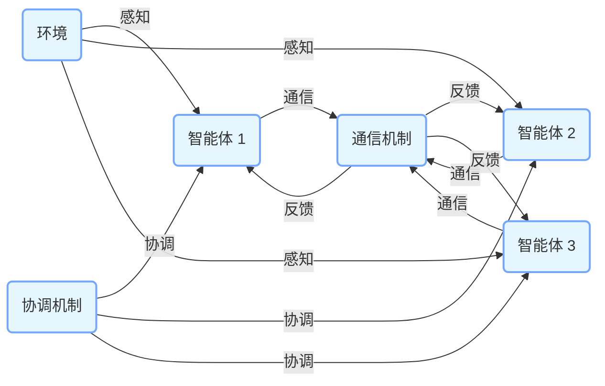

# 利用多智能体系统进行全面的公司创新指数评估

> 关键词：多智能体系统、公司创新指数评估、创新指标体系、智能体交互、评估算法

> 摘要：本文旨在探讨如何利用多智能体系统实现全面的公司创新指数评估。首先介绍了多智能体系统和公司创新指数评估的背景知识，阐述了核心概念及它们之间的联系。详细讲解了用于评估的核心算法原理，并给出具体操作步骤和 Python 代码示例。同时，引入了相关的数学模型和公式，并举例说明其应用。通过项目实战，展示了开发环境搭建、源代码实现和代码解读。接着分析了该评估方法的实际应用场景，推荐了相关的学习资源、开发工具框架以及论文著作。最后总结了未来发展趋势与挑战，并对常见问题进行了解答，提供了扩展阅读和参考资料。

## 1. 背景介绍 
### 1.1 目的和范围
在当今竞争激烈的商业环境中，公司的创新能力已成为其生存和发展的关键因素。准确评估公司的创新指数有助于公司了解自身的创新水平，发现优势和不足，从而制定合理的创新策略。同时，投资者、合作伙伴等外部利益相关者也需要通过创新指数评估来了解公司的创新潜力和价值。

本文的范围主要聚焦于利用多智能体系统来构建一个全面的公司创新指数评估体系。多智能体系统具有分布式、自主性和交互性等特点，能够模拟公司内部不同部门、不同角色之间的复杂关系和交互行为，从而更准确地评估公司的创新指数。

### 1.2 预期读者
本文的预期读者包括从事企业管理、创新研究、人工智能应用等领域的专业人士，以及对公司创新评估和多智能体系统感兴趣的科研人员、学生等。通过阅读本文，读者可以深入了解如何利用多智能体系统进行公司创新指数评估的原理、方法和实践。

### 1.3 文档结构概述
本文将按照以下结构进行组织：
1. **背景介绍**：阐述利用多智能体系统进行公司创新指数评估的目的、范围、预期读者和文档结构。
2. **核心概念与联系**：介绍多智能体系统和公司创新指数评估的核心概念，并说明它们之间的联系。
3. **核心算法原理 & 具体操作步骤**：详细讲解用于评估的核心算法原理，并给出具体操作步骤和 Python 代码示例。
4. **数学模型和公式 & 详细讲解 & 举例说明**：引入相关的数学模型和公式，并举例说明其应用。
5. **项目实战：代码实际案例和详细解释说明**：通过项目实战，展示开发环境搭建、源代码实现和代码解读。
6. **实际应用场景**：分析该评估方法的实际应用场景。
7. **工具和资源推荐**：推荐相关的学习资源、开发工具框架以及论文著作。
8. **总结：未来发展趋势与挑战**：总结未来发展趋势与挑战。
9. **附录：常见问题与解答**：对常见问题进行解答。
10. **扩展阅读 & 参考资料**：提供扩展阅读和参考资料。

### 1.4 术语表
#### 1.4.1 核心术语定义
- **多智能体系统（Multi - Agent System, MAS）**：由多个智能体组成的系统，每个智能体具有一定的自主性、交互能力和目标，它们通过相互协作和竞争来完成系统的整体任务。
- **公司创新指数**：用于衡量公司创新能力和创新水平的综合指标，反映了公司在技术创新、管理创新、市场创新等方面的表现。
- **智能体**：具有感知、决策和行动能力的实体，能够根据自身的目标和环境信息进行自主决策和行动。

#### 1.4.2 相关概念解释
- **创新指标体系**：由一系列反映公司创新能力的指标组成的体系，包括研发投入、专利数量、新产品销售额等。
- **智能体交互**：智能体之间通过消息传递、合作、竞争等方式进行信息交流和协作的过程。
- **评估算法**：用于计算公司创新指数的算法，根据创新指标体系和智能体交互的结果进行计算。

#### 1.4.3 缩略词列表
- MAS：Multi - Agent System（多智能体系统）
- R & D：Research and Development（研究与开发）

## 2. 核心概念与联系 
### 多智能体系统原理
多智能体系统由多个智能体组成，每个智能体都有自己的目标、知识和能力。智能体可以感知周围环境的信息，并根据这些信息做出决策和采取行动。智能体之间可以通过通信机制进行信息交流和协作，共同完成系统的整体任务。

多智能体系统的架构通常包括以下几个部分：
1. **智能体**：系统中的基本实体，具有自主性和交互能力。
2. **通信机制**：用于智能体之间的信息传递和交流。
3. **环境**：智能体所处的外部环境，提供了智能体感知和行动的背景。
4. **协调机制**：用于协调智能体之间的行为，避免冲突和实现协作。

以下是多智能体系统架构的 Mermaid 流程图：


### 公司创新指数评估原理
公司创新指数评估是通过建立一套科学合理的创新指标体系，收集和分析公司在各个指标上的数据，然后根据一定的算法计算出公司的创新指数。创新指标体系通常包括技术创新指标、管理创新指标、市场创新指标等多个方面。

技术创新指标可以包括研发投入、专利数量、新产品研发周期等；管理创新指标可以包括组织架构创新、管理制度创新等；市场创新指标可以包括新产品销售额、市场份额增长率等。

### 两者之间的联系
多智能体系统可以用于公司创新指数评估，主要体现在以下几个方面：
1. **模拟公司内部结构**：可以将公司的不同部门或角色抽象为智能体，每个智能体负责收集和处理与自身相关的创新指标数据。
2. **智能体交互促进信息共享**：智能体之间通过交互可以共享创新指标数据，避免信息孤岛，提高评估的准确性。
3. **动态评估**：多智能体系统可以实时感知公司环境的变化，动态调整创新指标数据，从而实现对公司创新指数的动态评估。

## 3. 核心算法原理 & 具体操作步骤 
### 核心算法原理
我们采用加权平均法来计算公司的创新指数。首先，为每个创新指标分配一个权重，权重反映了该指标在评估公司创新能力中的重要程度。然后，将每个指标的实际值乘以其对应的权重，最后将所有指标的加权值相加，得到公司的创新指数。

设公司的创新指标体系包含 $n$ 个指标，第 $i$ 个指标的实际值为 $x_i$，对应的权重为 $w_i$，则公司的创新指数 $I$ 可以表示为：

$I=\sum_{i = 1}^{n}w_ix_i$

其中，$\sum_{i = 1}^{n}w_i = 1$。

### 具体操作步骤
1. **确定创新指标体系**：根据公司的特点和行业需求，确定适合的创新指标体系。
2. **收集指标数据**：通过各种渠道收集每个指标的实际值。
3. **确定指标权重**：可以采用专家评估法、层次分析法等方法确定每个指标的权重。
4. **计算创新指数**：根据上述公式计算公司的创新指数。

### Python 代码示例
```python
# 创新指标实际值列表
innovation_indicators = [10, 20, 30, 40]
# 创新指标权重列表
weights = [0.1, 0.2, 0.3, 0.4]

# 计算创新指数
innovation_index = sum([x * w for x, w in zip(innovation_indicators, weights)])

print("公司的创新指数为:", innovation_index)
```

在上述代码中，我们首先定义了创新指标实际值列表 `innovation_indicators` 和创新指标权重列表 `weights`。然后，使用列表推导式计算每个指标的加权值，并将它们相加得到公司的创新指数。最后，打印出公司的创新指数。

## 4. 数学模型和公式 & 详细讲解 & 举例说明 
### 数学模型
我们在前面已经介绍了使用加权平均法计算公司创新指数的数学模型：

$I=\sum_{i = 1}^{n}w_ix_i$

其中，$I$ 表示公司的创新指数，$n$ 表示创新指标的数量，$x_i$ 表示第 $i$ 个指标的实际值，$w_i$ 表示第 $i$ 个指标的权重。

### 公式详细讲解
- **指标实际值 $x_i$**：是通过实际数据收集得到的，反映了公司在该指标上的实际表现。例如，研发投入指标的实际值可以是公司在一定时期内的研发费用总额。
- **指标权重 $w_i$**：反映了该指标在评估公司创新能力中的重要程度。权重的确定需要综合考虑多个因素，如行业特点、公司战略等。权重的取值范围在 $[0, 1]$ 之间，且所有指标的权重之和为 1。
- **创新指数 $I$**：是一个综合指标，反映了公司的整体创新能力。创新指数越高，说明公司的创新能力越强。

### 举例说明
假设我们选择了三个创新指标来评估一家公司的创新能力：研发投入（$x_1$）、专利数量（$x_2$）和新产品销售额（$x_3$）。经过专家评估，确定这三个指标的权重分别为 $w_1 = 0.3$，$w_2 = 0.3$，$w_3 = 0.4$。

该公司在这三个指标上的实际值分别为：$x_1 = 100$ 万元，$x_2 = 20$ 项，$x_3 = 500$ 万元。

根据上述公式，计算该公司的创新指数：

$I = w_1x_1+w_2x_2 + w_3x_3$

$=0.3\times100 + 0.3\times20+0.4\times500$

$=30 + 6+200$

$=236$

因此，该公司的创新指数为 236。通过与其他公司的创新指数进行比较，可以评估该公司在行业中的创新水平。

## 5. 项目实战：代码实际案例和详细解释说明 
### 5.1  开发环境搭建
在进行项目实战之前，需要搭建相应的开发环境。以下是具体的搭建步骤：
1. **安装 Python**：从 Python 官方网站（https://www.python.org/downloads/）下载并安装 Python 3.x 版本。
2. **安装必要的库**：我们需要安装一些必要的 Python 库，如 `numpy`、`pandas` 等。可以使用 `pip` 命令进行安装：
```sh
pip install numpy pandas
```

### 5.2  源代码详细实现和代码解读
以下是一个完整的 Python 代码示例，用于利用多智能体系统进行公司创新指数评估：
```python
import numpy as np
import pandas as pd

# 定义智能体类
class Agent:
    def __init__(self, indicator_name, weight):
        self.indicator_name = indicator_name
        self.weight = weight
        self.value = None

    def set_value(self, value):
        self.value = value

    def get_weighted_value(self):
        if self.value is not None:
            return self.weight * self.value
        return 0

# 定义多智能体系统类
class MultiAgentSystem:
    def __init__(self, agents):
        self.agents = agents

    def calculate_innovation_index(self):
        weighted_values = [agent.get_weighted_value() for agent in self.agents]
        return sum(weighted_values)

# 定义创新指标和权重
indicators = ["研发投入", "专利数量", "新产品销售额"]
weights = [0.3, 0.3, 0.4]

# 创建智能体
agents = [Agent(indicator, weight) for indicator, weight in zip(indicators, weights)]

# 创建多智能体系统
mas = MultiAgentSystem(agents)

# 模拟数据收集，设置每个指标的实际值
data = {
    "研发投入": 100,
    "专利数量": 20,
    "新产品销售额": 500
}

for agent in agents:
    agent.set_value(data[agent.indicator_name])

# 计算创新指数
innovation_index = mas.calculate_innovation_index()

print("公司的创新指数为:", innovation_index)
```

### 代码解读与分析
1. **智能体类 `Agent`**：
    - `__init__` 方法：初始化智能体的指标名称、权重和实际值。
    - `set_value` 方法：设置智能体的实际值。
    - `get_weighted_value` 方法：计算智能体的加权值。

2. **多智能体系统类 `MultiAgentSystem`**：
    - `__init__` 方法：初始化多智能体系统，接收一个智能体列表作为参数。
    - `calculate_innovation_index` 方法：计算公司的创新指数，通过将所有智能体的加权值相加得到。

3. **主程序部分**：
    - 定义创新指标和权重。
    - 创建智能体并添加到多智能体系统中。
    - 模拟数据收集，设置每个指标的实际值。
    - 调用 `calculate_innovation_index` 方法计算公司的创新指数。

通过以上代码，我们可以利用多智能体系统实现公司创新指数的评估。

## 6. 实际应用场景 
### 公司内部管理
公司可以利用多智能体系统进行创新指数评估，了解自身在不同方面的创新能力。通过对创新指数的分析，公司可以发现自身的优势和不足，制定针对性的创新策略。例如，如果发现研发投入指标的权重较高，但实际值较低，公司可以考虑增加研发投入，提高创新能力。

### 投资者决策
投资者可以利用公司的创新指数评估结果来判断公司的创新潜力和价值。创新指数较高的公司通常具有更强的竞争力和发展潜力，更有可能为投资者带来较高的回报。因此，投资者可以将创新指数作为投资决策的重要参考依据。

### 行业对比分析
通过对同行业不同公司的创新指数进行比较分析，可以了解行业的整体创新水平和竞争态势。公司可以根据行业对比结果，调整自身的创新策略，提高在行业中的竞争力。同时，行业协会等组织也可以利用创新指数评估结果，制定行业发展规划，推动整个行业的创新发展。

### 政府政策制定
政府可以利用公司创新指数评估结果来制定相关的产业政策和创新扶持政策。对于创新指数较高的公司，政府可以给予更多的政策支持和资金扶持，鼓励其继续创新发展；对于创新指数较低的公司，政府可以通过引导和培训等方式，帮助其提高创新能力。

## 7. 工具和资源推荐
### 7.1 学习资源推荐
#### 7.1.1 书籍推荐
- 《多智能体系统导论》：全面介绍了多智能体系统的基本概念、理论和方法，是学习多智能体系统的经典教材。
- 《创新管理：赢得持续竞争优势》：深入探讨了公司创新管理的理论和实践，对于理解公司创新指数评估具有重要的参考价值。
- 《Python 数据分析实战》：介绍了使用 Python 进行数据分析的方法和技巧，对于处理创新指标数据非常有帮助。

#### 7.1.2 在线课程
- Coursera 上的“Multi - Agent Systems”课程：由知名教授授课，系统地介绍了多智能体系统的相关知识。
- edX 上的“Innovation Management and Entrepreneurship”课程：帮助学习者了解创新管理的最新理论和实践。
- 网易云课堂上的“Python 数据分析从入门到精通”课程：适合初学者学习 Python 数据分析。

#### 7.1.3 技术博客和网站
- 博客园：有很多关于多智能体系统和数据分析的技术文章。
- 开源中国：提供了丰富的开源项目和技术资源。
- Kaggle：是一个数据科学竞赛平台，上面有很多关于数据分析和机器学习的案例和讨论。

### 7.2 开发工具框架推荐
#### 7.2.1 IDE和编辑器
- PyCharm：是一款专业的 Python 集成开发环境，具有代码编辑、调试、自动补全等功能。
- Jupyter Notebook：是一个交互式的编程环境，适合进行数据分析和模型验证。
- Visual Studio Code：是一款轻量级的代码编辑器，支持多种编程语言，具有丰富的插件扩展功能。

#### 7.2.2 调试和性能分析工具
- pdb：是 Python 内置的调试器，可以帮助开发者调试代码。
- cProfile：是 Python 标准库中的性能分析工具，可以分析代码的执行时间和函数调用情况。
- Py-Spy：是一个用于 Python 代码性能分析的工具，可以实时监测代码的运行情况。

#### 7.2.3 相关框架和库
- Mesa：是一个用于构建基于智能体的模型的 Python 框架，提供了丰富的智能体和环境建模工具。
- NetworkX：是一个用于复杂网络分析的 Python 库，可以用于分析智能体之间的交互关系。
- Scikit - learn：是一个常用的机器学习库，可用于对创新指标数据进行建模和分析。

### 7.3 相关论文著作推荐
#### 7.3.1 经典论文
- "Multi - Agent Systems: A Modern Approach to Distributed Artificial Intelligence"：该论文系统地介绍了多智能体系统的基本概念和方法，是多智能体系统领域的经典之作。
- "Measuring Innovation: A New Perspective"：提出了一种新的创新测量方法，对于构建创新指标体系具有重要的参考价值。

#### 7.3.2 最新研究成果
- 关注顶级学术会议如 IJCAI（国际人工智能联合会议）、AAAI（美国人工智能协会会议）等上发表的关于多智能体系统和创新评估的研究论文。
- 查阅相关学术期刊如《Artificial Intelligence》、《Management Science》等上的最新研究成果。

#### 7.3.3 应用案例分析
- 一些知名企业如谷歌、苹果等的创新案例分析报告，可以了解它们在创新管理和评估方面的实践经验。
- 行业研究机构发布的关于特定行业的创新评估报告，有助于了解行业的创新趋势和最佳实践。

## 8. 总结：未来发展趋势与挑战
### 未来发展趋势
1. **智能化程度提高**：随着人工智能技术的不断发展，多智能体系统的智能化程度将不断提高。智能体将具备更强的学习能力和决策能力，能够更好地适应复杂多变的环境。
2. **与其他技术融合**：多智能体系统将与区块链、物联网等技术深度融合。例如，利用区块链技术可以实现智能体之间的可信交互和数据共享；通过物联网技术可以实时获取公司的创新指标数据。
3. **应用领域拓展**：除了公司创新指数评估，多智能体系统还将在智慧城市、智能交通、医疗保健等领域得到更广泛的应用。

### 挑战
1. **智能体建模难度**：准确地对公司内部的不同部门和角色进行智能体建模是一个挑战。需要考虑到智能体的行为规则、知识表示和决策机制等多个方面。
2. **数据质量和安全**：创新指数评估依赖于大量的创新指标数据，数据的质量和安全是关键问题。需要建立有效的数据采集、存储和管理机制，确保数据的准确性和保密性。
3. **系统复杂性管理**：随着智能体数量的增加和交互关系的复杂化，多智能体系统的复杂性将不断提高。如何有效地管理系统的复杂性，保证系统的稳定性和可靠性是一个亟待解决的问题。

## 9. 附录：常见问题与解答
### 问题 1：如何确定创新指标的权重？
答：可以采用专家评估法、层次分析法等方法确定创新指标的权重。专家评估法是邀请相关领域的专家根据经验和专业知识对每个指标的重要程度进行评估；层次分析法是一种将复杂问题分解为多个层次，通过两两比较确定指标权重的方法。

### 问题 2：多智能体系统的开发难度大吗？
答：多智能体系统的开发难度相对较大，需要掌握多智能体系统的基本理论和方法，以及相关的编程语言和开发工具。但是，随着开源框架和工具的不断发展，开发难度也在逐渐降低。

### 问题 3：创新指数评估结果的准确性如何保证？
答：为了保证创新指数评估结果的准确性，需要建立科学合理的创新指标体系，确保指标的全面性和代表性。同时，要保证数据的质量，采用可靠的数据采集方法和数据处理技术。此外，还可以通过与其他评估方法进行比较和验证，提高评估结果的准确性。

## 10. 扩展阅读 & 参考资料
### 扩展阅读
- 《复杂系统科学与工程》：介绍了复杂系统的基本概念和方法，对于理解多智能体系统的复杂性具有重要的帮助。
- 《创新生态系统：理论与实践》：探讨了创新生态系统的构建和发展，为公司创新指数评估提供了更广阔的视角。

### 参考资料
- 相关学术期刊和会议论文，如《Artificial Intelligence》、IJCAI 会议论文等。
- 行业研究报告和统计数据，如《中国企业创新能力报告》等。

作者：AI天才研究院/AI Genius Institute & 禅与计算机程序设计艺术 /Zen And The Art of Computer Programming