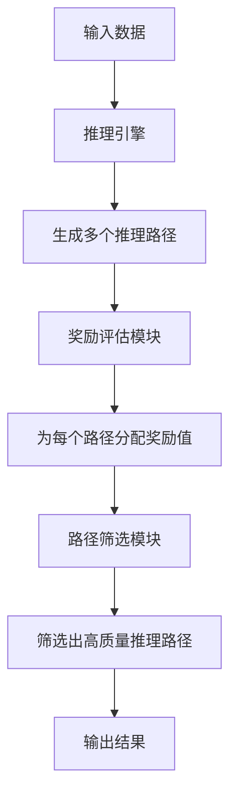

# 利用奖励引导综合筛选高质量推理路径

> 关键词：奖励引导、高质量推理路径、综合筛选、推理算法、人工智能

> 摘要：本文聚焦于利用奖励引导来综合筛选高质量推理路径这一核心主题。首先介绍了该研究的背景、目的、预期读者和文档结构，对相关术语进行了清晰定义。详细阐述了核心概念、联系及架构，给出了直观的文本示意图和 Mermaid 流程图。深入讲解了核心算法原理，通过 Python 源代码进行具体阐述，同时介绍了相关的数学模型和公式，并举例说明。通过项目实战部分，展示了开发环境搭建、源代码实现与解读。分析了实际应用场景，推荐了学习资源、开发工具框架和相关论文著作。最后对未来发展趋势与挑战进行了总结，还提供了常见问题解答和扩展阅读参考资料，旨在为读者全面深入地理解和应用利用奖励引导综合筛选高质量推理路径的技术提供系统的知识体系。

## 1. 背景介绍 
### 1.1 目的和范围
在人工智能和知识推理领域，如何从众多可能的推理路径中筛选出高质量的路径是一个关键问题。高质量的推理路径能够更准确地反映事物之间的逻辑关系，为决策、知识发现等提供更可靠的依据。利用奖励引导的方法进行综合筛选，旨在通过设定合理的奖励机制，激励系统选择那些具有更高价值和准确性的推理路径。

本文的范围涵盖了从核心概念的介绍、算法原理的讲解、数学模型的构建，到项目实战的展示以及实际应用场景的分析。通过全面的阐述，帮助读者深入理解利用奖励引导综合筛选高质量推理路径的技术，并掌握其实际应用方法。

### 1.2 预期读者
本文预期读者包括人工智能领域的研究人员、开发者、学生，以及对知识推理和路径筛选感兴趣的专业人士。对于希望深入了解推理算法和提高推理质量的读者，本文提供了系统的知识和实践指导。

### 1.3 文档结构概述
本文将按照以下结构进行组织：首先介绍背景知识，包括目的、预期读者和文档结构概述，以及相关术语的定义。接着阐述核心概念与联系，给出架构示意图和流程图。然后详细讲解核心算法原理和具体操作步骤，通过 Python 代码进行说明。之后介绍数学模型和公式，并举例说明。通过项目实战部分展示实际应用，包括开发环境搭建、源代码实现和代码解读。分析实际应用场景，推荐相关的学习资源、开发工具框架和论文著作。最后总结未来发展趋势与挑战，提供常见问题解答和扩展阅读参考资料。

### 1.4 术语表
#### 1.4.1 核心术语定义
- **奖励引导**：通过设定奖励机制，对不同的推理路径进行评估和激励，引导系统选择具有更高奖励值的路径。
- **高质量推理路径**：能够准确反映事物之间逻辑关系，具有较高准确性、可靠性和实用性的推理路径。
- **综合筛选**：综合考虑多个因素，如奖励值、路径长度、推理可信度等，对推理路径进行筛选。

#### 1.4.2 相关概念解释
- **推理路径**：从起始节点到目标节点的一系列推理步骤的组合，每个步骤表示一个推理关系。
- **奖励机制**：根据推理路径的质量、效率等因素，为每个路径分配一个奖励值，用于评估和比较不同路径的优劣。

#### 1.4.3 缩略词列表
- **AI**：Artificial Intelligence，人工智能
- **ML**：Machine Learning，机器学习

## 2. 核心概念与联系 
### 核心概念原理
利用奖励引导综合筛选高质量推理路径的核心思想是通过奖励机制来评估和选择推理路径。在推理过程中，系统会生成多个可能的推理路径，每个路径都有其对应的特征和属性。奖励机制会根据这些特征和属性，为每个路径分配一个奖励值。系统会优先选择奖励值较高的路径，从而实现高质量推理路径的筛选。

奖励机制的设计需要考虑多个因素，如推理的准确性、路径的长度、推理的可信度等。例如，一个准确的推理路径可能会获得较高的奖励值，而一个过长或可信度较低的路径可能会获得较低的奖励值。

### 架构示意图
以下是利用奖励引导综合筛选高质量推理路径的架构示意图：

```plaintext
输入数据 --> 推理引擎 --> 生成多个推理路径
推理路径 --> 奖励评估模块 --> 为每个路径分配奖励值
奖励值 --> 路径筛选模块 --> 筛选出高质量推理路径
高质量推理路径 --> 输出结果
```

### Mermaid 流程图


## 3. 核心算法原理 & 具体操作步骤 
### 核心算法原理
我们可以使用基于强化学习的算法来实现奖励引导的路径筛选。强化学习是一种通过智能体与环境进行交互，不断学习最优策略的方法。在这个问题中，智能体就是推理系统，环境就是推理问题的状态空间，动作就是选择不同的推理路径，奖励就是根据路径的质量分配的奖励值。

智能体的目标是最大化累计奖励，通过不断尝试不同的推理路径，学习到哪些路径能够获得更高的奖励，从而选择高质量的推理路径。

### 具体操作步骤
1. **初始化**：初始化推理系统的状态，包括输入数据、推理规则等。
2. **生成推理路径**：使用推理引擎生成多个可能的推理路径。
3. **奖励评估**：使用奖励评估模块为每个推理路径分配奖励值。
4. **路径选择**：根据奖励值，使用路径筛选模块选择高质量的推理路径。
5. **更新状态**：根据选择的路径，更新推理系统的状态。
6. **重复步骤 2 - 5**：直到达到终止条件，如找到目标节点或达到最大推理步数。

### Python 源代码实现
```python
import random

# 定义推理路径类
class ReasoningPath:
    def __init__(self, path, reward=0):
        self.path = path
        self.reward = reward

    def __repr__(self):
        return f"Path: {self.path}, Reward: {self.reward}"

# 推理引擎，生成多个推理路径
def inference_engine(input_data):
    # 这里简单模拟生成 3 个推理路径
    paths = []
    for i in range(3):
        path = [random.choice(['step1', 'step2', 'step3']) for _ in range(3)]
        paths.append(ReasoningPath(path))
    return paths

# 奖励评估模块
def reward_evaluation(paths):
    for path in paths:
        # 简单模拟奖励评估，路径长度越短奖励越高
        path.reward = 10 / len(path.path)
    return paths

# 路径筛选模块
def path_selection(paths):
    # 选择奖励值最高的路径
    best_path = max(paths, key=lambda x: x.reward)
    return best_path

# 主函数
def main(input_data):
    # 生成推理路径
    paths = inference_engine(input_data)
    # 奖励评估
    paths = reward_evaluation(paths)
    # 路径选择
    best_path = path_selection(paths)
    return best_path

# 测试
input_data = "test_input"
best_path = main(input_data)
print("Best path:", best_path)
```

## 4. 数学模型和公式 & 详细讲解 & 举例说明 
### 数学模型
我们可以使用马尔可夫决策过程（MDP）来描述利用奖励引导综合筛选高质量推理路径的问题。MDP 是一个五元组 $(S, A, P, R, \gamma)$，其中：
- $S$ 是状态空间，表示推理系统的所有可能状态。
- $A$ 是动作空间，表示推理系统可以选择的所有动作，即不同的推理路径。
- $P(s'|s, a)$ 是状态转移概率，表示在状态 $s$ 下选择动作 $a$ 后转移到状态 $s'$ 的概率。
- $R(s, a)$ 是奖励函数，表示在状态 $s$ 下选择动作 $a$ 所获得的奖励。
- $\gamma$ 是折扣因子，用于权衡即时奖励和未来奖励。

### 数学公式
智能体的目标是最大化累计折扣奖励，即：
$$
V^*(s) = \max_{\pi} \mathbb{E} \left[ \sum_{t=0}^{\infty} \gamma^t R(S_t, A_t) | S_0 = s, \pi \right]
$$
其中，$V^*(s)$ 是状态 $s$ 的最优值函数，$\pi$ 是策略，$S_t$ 是时间步 $t$ 的状态，$A_t$ 是时间步 $t$ 的动作。

### 详细讲解
在利用奖励引导综合筛选高质量推理路径的问题中，状态 $s$ 可以表示推理系统的当前状态，包括已经推理出的结果和剩余的推理任务。动作 $a$ 可以表示选择的推理路径。奖励函数 $R(s, a)$ 可以根据路径的质量、长度、可信度等因素来设计。

折扣因子 $\gamma$ 用于平衡即时奖励和未来奖励。如果 $\gamma$ 接近 1，则智能体更注重未来的奖励；如果 $\gamma$ 接近 0，则智能体更注重即时奖励。

### 举例说明
假设我们有一个简单的推理问题，状态空间 $S = \{s_0, s_1, s_2\}$，动作空间 $A = \{a_0, a_1\}$。状态转移概率如下：
$$
P(s_1|s_0, a_0) = 0.8, P(s_2|s_0, a_0) = 0.2
$$
$$
P(s_1|s_0, a_1) = 0.3, P(s_2|s_0, a_1) = 0.7
$$
奖励函数如下：
$$
R(s_0, a_0) = 10, R(s_0, a_1) = 5
$$
折扣因子 $\gamma = 0.9$。

我们可以使用动态规划或强化学习算法来求解最优策略，从而选择高质量的推理路径。

## 5. 项目实战：代码实际案例和详细解释说明 
### 5.1  开发环境搭建
- **Python 环境**：建议使用 Python 3.7 及以上版本。可以从 Python 官方网站（https://www.python.org/downloads/）下载并安装。
- **开发工具**：可以使用 PyCharm、Jupyter Notebook 等开发工具。PyCharm 是一个功能强大的 Python 集成开发环境，Jupyter Notebook 则适合交互式开发和代码演示。
- **依赖库**：本项目需要使用一些常见的 Python 库，如 `numpy`、`pandas` 等。可以使用 `pip` 命令进行安装：
```sh
pip install numpy pandas
```

### 5.2  源代码详细实现和代码解读
```python
import numpy as np
import random

# 定义推理图类
class ReasoningGraph:
    def __init__(self, nodes, edges):
        self.nodes = nodes
        self.edges = edges
        self.graph = {node: [] for node in nodes}
        for edge in edges:
            start, end, weight = edge
            self.graph[start].append((end, weight))

    def get_neighbors(self, node):
        return self.graph[node]

# 推理引擎，生成推理路径
def generate_paths(graph, start, end, max_length=5):
    paths = []
    def dfs(node, path, length):
        if node == end:
            paths.append(path.copy())
            return
        if length >= max_length:
            return
        neighbors = graph.get_neighbors(node)
        for neighbor, _ in neighbors:
            path.append(neighbor)
            dfs(neighbor, path, length + 1)
            path.pop()
    dfs(start, [start], 0)
    return paths

# 奖励评估模块
def evaluate_rewards(paths, graph):
    rewards = []
    for path in paths:
        reward = 0
        for i in range(len(path) - 1):
            start = path[i]
            end = path[i + 1]
            for neighbor, weight in graph.get_neighbors(start):
                if neighbor == end:
                    reward += weight
                    break
        rewards.append(reward)
    return rewards

# 路径筛选模块
def select_best_path(paths, rewards):
    best_index = np.argmax(rewards)
    return paths[best_index]

# 主函数
def main():
    # 定义节点和边
    nodes = ['A', 'B', 'C', 'D', 'E']
    edges = [('A', 'B', 2), ('A', 'C', 3), ('B', 'D', 4), ('C', 'D', 1), ('D', 'E', 5)]
    # 创建推理图
    graph = ReasoningGraph(nodes, edges)
    # 生成推理路径
    start = 'A'
    end = 'E'
    paths = generate_paths(graph, start, end)
    # 奖励评估
    rewards = evaluate_rewards(paths, graph)
    # 路径筛选
    best_path = select_best_path(paths, rewards)
    print("Best path:", best_path)

if __name__ == "__main__":
    main()
```

### 代码解读与分析
1. **ReasoningGraph 类**：用于表示推理图，包含节点和边的信息。`get_neighbors` 方法用于获取某个节点的邻居节点。
2. **generate_paths 函数**：使用深度优先搜索（DFS）算法生成从起始节点到目标节点的所有可能推理路径。
3. **evaluate_rewards 函数**：根据路径中每条边的权重计算路径的奖励值。
4. **select_best_path 函数**：选择奖励值最高的路径作为最佳路径。
5. **main 函数**：创建推理图，生成推理路径，进行奖励评估和路径筛选，并输出最佳路径。

## 6. 实际应用场景 
### 知识图谱推理
在知识图谱中，利用奖励引导综合筛选高质量推理路径可以帮助发现实体之间的隐含关系。例如，在一个医学知识图谱中，通过推理可以发现某种疾病与特定基因之间的关联。通过奖励机制，可以优先选择那些具有较高可信度和实用性的推理路径，提高知识发现的效率和准确性。

### 智能问答系统
在智能问答系统中，推理路径的质量直接影响回答的准确性和可靠性。利用奖励引导的方法，可以筛选出能够准确回答用户问题的推理路径。例如，在一个法律问答系统中，通过推理法律条文和案例，可以为用户提供准确的法律建议。

### 决策支持系统
在决策支持系统中，需要从多个可能的方案中选择最优方案。利用奖励引导综合筛选高质量推理路径可以帮助评估不同方案的优劣，选择具有最高收益和最低风险的方案。例如，在投资决策中，通过推理市场趋势和企业财务数据，可以为投资者提供合理的投资建议。

## 7. 工具和资源推荐
### 7.1 学习资源推荐
#### 7.1.1 书籍推荐
- 《人工智能：一种现代的方法》：这是一本经典的人工智能教材，涵盖了人工智能的各个领域，包括知识推理和强化学习。
- 《强化学习：原理与Python实现》：详细介绍了强化学习的原理和算法，并通过 Python 代码进行实现。
- 《知识图谱：方法、实践与应用》：介绍了知识图谱的构建、推理和应用，对利用奖励引导进行知识图谱推理有很好的参考价值。

#### 7.1.2 在线课程
- Coursera 上的“人工智能基础”课程：由知名教授授课，系统介绍了人工智能的基础知识和方法。
- edX 上的“强化学习”课程：深入讲解了强化学习的理论和实践。
- 中国大学MOOC上的“知识图谱技术与应用”课程：介绍了知识图谱的相关技术和应用案例。

#### 7.1.3 技术博客和网站
- Medium：有很多人工智能和机器学习领域的优秀博客文章，涵盖了最新的研究成果和实践经验。
- arXiv：一个预印本平台，提供了大量的学术论文，包括人工智能和知识推理方面的研究。
- 开源中国：提供了丰富的技术文章和开源项目，对学习和实践有很大的帮助。

### 7.2 开发工具框架推荐
#### 7.2.1 IDE和编辑器
- PyCharm：功能强大的 Python 集成开发环境，提供了代码编辑、调试、版本控制等功能。
- Jupyter Notebook：适合交互式开发和代码演示，支持多种编程语言。
- Visual Studio Code：轻量级的代码编辑器，支持丰富的插件扩展，可用于 Python 开发。

#### 7.2.2 调试和性能分析工具
- PDB：Python 自带的调试工具，可用于调试 Python 代码。
- cProfile：Python 标准库中的性能分析工具，可用于分析代码的性能瓶颈。
- TensorBoard：用于可视化深度学习模型的训练过程和性能指标。

#### 7.2.3 相关框架和库
- TensorFlow：一个开源的深度学习框架，可用于实现强化学习算法。
- PyTorch：另一个流行的深度学习框架，具有简洁易用的特点。
- NetworkX：用于创建、操作和研究复杂网络的 Python 库，可用于表示和分析推理图。

### 7.3 相关论文著作推荐
#### 7.3.1 经典论文
- “Reinforcement Learning: An Introduction”：强化学习领域的经典著作，系统介绍了强化学习的基本概念和算法。
- “Knowledge Graph Embedding: A Survey of Approaches and Applications”：对知识图谱嵌入技术进行了全面的综述。
- “Probabilistic Reasoning in Intelligent Systems: Networks of Plausible Inference”：介绍了概率推理的理论和方法。

#### 7.3.2 最新研究成果
- 关注 AAAI、IJCAI、NeurIPS 等顶级人工智能会议的论文，了解最新的研究动态和成果。
- 查阅顶级学术期刊，如 Journal of Artificial Intelligence Research（JAIR）、Artificial Intelligence 等。

#### 7.3.3 应用案例分析
- 分析一些实际应用案例的论文，了解利用奖励引导综合筛选高质量推理路径在不同领域的应用方法和效果。

## 8. 总结：未来发展趋势与挑战
### 未来发展趋势
- **与深度学习的融合**：将奖励引导的推理方法与深度学习技术相结合，如使用深度强化学习来学习更复杂的推理策略，提高推理的准确性和效率。
- **多模态推理**：结合文本、图像、语音等多种模态的信息进行推理，扩大推理的应用范围和能力。
- **可解释性推理**：提高推理路径的可解释性，让用户能够理解推理的过程和依据，增强系统的可信度和可靠性。

### 挑战
- **奖励机制设计**：设计合理的奖励机制是一个挑战，需要综合考虑多个因素，如推理的准确性、效率、可解释性等。
- **计算资源需求**：在大规模知识图谱和复杂推理问题中，推理过程可能需要大量的计算资源，如何优化算法和提高计算效率是一个重要问题。
- **数据质量和规模**：推理的准确性和可靠性依赖于高质量和大规模的数据，如何获取和处理这些数据是一个挑战。

## 9. 附录：常见问题与解答
### 问题 1：如何设计合理的奖励机制？
解答：设计合理的奖励机制需要综合考虑多个因素，如推理的准确性、路径的长度、推理的可信度等。可以根据具体的应用场景和需求，定义不同的奖励函数。例如，对于准确的推理路径可以给予较高的奖励，对于过长或可信度较低的路径可以给予较低的奖励。

### 问题 2：如何处理推理过程中的不确定性？
解答：可以使用概率推理的方法来处理推理过程中的不确定性。例如，使用贝叶斯网络、马尔可夫逻辑网等模型，对推理结果进行概率估计。同时，在奖励机制中可以考虑不确定性因素，对具有较高不确定性的推理路径给予较低的奖励。

### 问题 3：如何提高推理的效率？
解答：可以采用以下方法提高推理的效率：优化推理算法，如使用启发式搜索算法减少搜索空间；利用并行计算技术，如使用 GPU 加速推理过程；对知识图谱进行预处理，如进行知识压缩和索引。

## 10. 扩展阅读 & 参考资料
- 相关的学术论文和研究报告，可以从学术数据库如 IEEE Xplore、ACM Digital Library 等获取。
- 开源项目，如 DeepMind 的 AlphaGo 项目，了解强化学习在实际应用中的实现方法。
- 专业书籍，如《人工智能中的不确定性》《机器学习》等，深入学习相关的理论知识。

作者：AI天才研究院/AI Genius Institute & 禅与计算机程序设计艺术 /Zen And The Art of Computer Programming