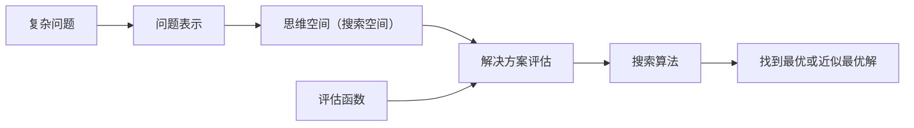

# 利用思维空间搜索解决复杂问题的方法

> 关键词：思维空间搜索、复杂问题解决、搜索算法、数学模型、实际应用

> 摘要：本文围绕利用思维空间搜索解决复杂问题的方法展开，详细阐述了其核心概念、算法原理、数学模型，并结合项目实战案例进行深入分析。探讨了该方法在不同实际场景中的应用，推荐了相关的学习资源、开发工具和论文著作。最后总结了该方法的未来发展趋势与挑战，并对常见问题进行解答，旨在为读者提供全面且深入的技术指导，帮助其掌握利用思维空间搜索解决复杂问题的有效途径。

## 1. 背景介绍 
### 1.1 目的和范围
在当今复杂多变的世界中，我们面临着各种各样的复杂问题，如人工智能中的路径规划、优化问题，工程领域的系统设计，社会科学中的决策分析等。这些问题往往具有高度的不确定性、多约束性和高维度性，传统的解决方法可能无法满足需求。利用思维空间搜索解决复杂问题的方法旨在提供一种有效的途径，通过对问题空间的搜索和探索，找到最优或近似最优的解决方案。本文将涵盖思维空间搜索的基本概念、核心算法、数学模型、实际应用案例等方面，全面介绍该方法的理论和实践。

### 1.2 预期读者
本文的预期读者包括计算机科学、人工智能、工程学、运筹学等领域的研究人员、开发者和学生。对于对解决复杂问题感兴趣，希望了解和应用思维空间搜索方法的专业人士和爱好者，本文也具有一定的参考价值。

### 1.3 文档结构概述
本文将按照以下结构进行组织：首先介绍思维空间搜索的背景和相关概念，包括核心术语的定义和解释；接着阐述思维空间搜索的核心算法原理和具体操作步骤，并通过Python代码进行详细说明；然后介绍该方法的数学模型和公式，并结合实际例子进行讲解；随后通过项目实战案例，展示如何在实际中应用思维空间搜索解决复杂问题；之后探讨该方法的实际应用场景；再推荐相关的学习资源、开发工具和论文著作；最后总结该方法的未来发展趋势与挑战，并对常见问题进行解答，同时提供扩展阅读和参考资料。

### 1.4 术语表
#### 1.4.1 核心术语定义
- **思维空间**：是一个抽象的概念，代表了问题的所有可能解决方案的集合。它可以是一个连续的空间，也可以是一个离散的空间。在思维空间中，每个点都代表一个可能的解决方案。
- **搜索**：是指在思维空间中寻找满足特定条件的解决方案的过程。搜索算法通过对思维空间的遍历和评估，逐步缩小搜索范围，最终找到最优或近似最优的解决方案。
- **启发式函数**：是一种用于评估搜索节点的函数，它可以为搜索算法提供额外的信息，引导搜索朝着更有希望的方向进行。启发式函数通常基于问题的特点和经验知识来设计。
- **最优解**：是指在所有可能的解决方案中，能够使目标函数达到最大值或最小值的解决方案。在某些情况下，由于问题的复杂性，可能无法找到最优解，此时可以寻找近似最优解。

#### 1.4.2 相关概念解释
- **状态空间**：与思维空间类似，状态空间是指问题的所有可能状态的集合。在搜索过程中，每个状态可以看作是思维空间中的一个点。
- **搜索策略**：是指搜索算法在思维空间中进行搜索的方式和规则。常见的搜索策略包括广度优先搜索、深度优先搜索、启发式搜索等。
- **剪枝**：是指在搜索过程中，通过一些规则和条件，排除那些不可能包含最优解的子空间，从而减少搜索的工作量。

#### 1.4.3 缩略词列表
- **A*算法**：A-star算法，一种常用的启发式搜索算法。
- **DFS**：深度优先搜索（Depth-First Search）。
- **BFS**：广度优先搜索（Breadth-First Search）。

## 2. 核心概念与联系 
### 核心概念原理
思维空间搜索的核心思想是将复杂问题转化为在一个抽象的思维空间中进行搜索的问题。在这个思维空间中，每个点代表一个可能的解决方案，而搜索算法的任务就是在这个空间中找到满足特定条件的点。为了实现这一目标，我们需要定义以下几个关键要素：
- **问题表示**：将实际问题转化为思维空间中的表示形式。这可能涉及到对问题的状态、变量、约束条件等进行定义和编码。
- **搜索空间**：确定思维空间的范围和边界，即所有可能的解决方案的集合。
- **评估函数**：用于评估每个解决方案的优劣程度。评估函数可以是一个简单的目标函数，也可以是一个复杂的多目标评估模型。
- **搜索算法**：选择合适的搜索算法在思维空间中进行搜索。搜索算法的选择取决于问题的特点和要求，常见的搜索算法包括广度优先搜索、深度优先搜索、启发式搜索等。

### 架构的文本示意图
```plaintext
复杂问题 --> 问题表示 --> 思维空间（搜索空间）
                                 |
                                 | 评估函数
                                 v
                          解决方案评估
                                 |
                                 | 搜索算法
                                 v
                      找到最优或近似最优解
```

### Mermaid流程图


## 3. 核心算法原理 & 具体操作步骤 
### 广度优先搜索（BFS）
#### 算法原理
广度优先搜索是一种逐层搜索的算法，它从起始节点开始，逐层扩展节点，直到找到目标节点或遍历完整个搜索空间。在每一层中，算法会按照节点的扩展顺序依次访问节点，因此可以保证找到的路径是最短的。

#### Python源代码实现
```python
from collections import deque

def bfs(graph, start, goal):
    # 初始化队列
    queue = deque([(start, [start])])
    # 记录已访问的节点
    visited = set()

    while queue:
        # 从队列中取出一个节点和路径
        (node, path) = queue.popleft()
        if node not in visited:
            if node == goal:
                return path
            visited.add(node)
            # 扩展当前节点的邻居节点
            for neighbor in graph[node]:
                if neighbor not in visited:
                    queue.append((neighbor, path + [neighbor]))

    return None

# 示例图的邻接表表示
graph = {
    'A': ['B', 'C'],
    'B': ['A', 'D', 'E'],
    'C': ['A', 'F'],
    'D': ['B'],
    'E': ['B', 'F'],
    'F': ['C', 'E']
}

start_node = 'A'
goal_node = 'F'
path = bfs(graph, start_node, goal_node)
if path:
    print(f"从 {start_node} 到 {goal_node} 的最短路径是: {' -> '.join(path)}")
else:
    print(f"从 {start_node} 到 {goal_node} 没有路径")
```

#### 具体操作步骤
1. 初始化一个队列，并将起始节点和其路径加入队列。
2. 初始化一个集合，用于记录已访问的节点。
3. 当队列不为空时，执行以下操作：
    - 从队列中取出一个节点和其路径。
    - 如果该节点未被访问过，则进行以下操作：
        - 如果该节点是目标节点，则返回路径。
        - 将该节点标记为已访问。
        - 扩展该节点的邻居节点，并将未访问的邻居节点和其路径加入队列。
4. 如果队列为空仍未找到目标节点，则返回None。

### 深度优先搜索（DFS）
#### 算法原理
深度优先搜索是一种沿着一条路径尽可能深地搜索的算法，直到无法继续搜索为止，然后回溯到上一个节点，继续搜索其他路径。深度优先搜索通常使用递归或栈来实现。

#### Python源代码实现
```python
def dfs(graph, start, goal, path=None):
    if path is None:
        path = []
    path = path + [start]
    if start == goal:
        return path
    if start not in graph:
        return None
    for neighbor in graph[start]:
        if neighbor not in path:
            new_path = dfs(graph, neighbor, goal, path)
            if new_path:
                return new_path
    return None

# 示例图的邻接表表示
graph = {
    'A': ['B', 'C'],
    'B': ['A', 'D', 'E'],
    'C': ['A', 'F'],
    'D': ['B'],
    'E': ['B', 'F'],
    'F': ['C', 'E']
}

start_node = 'A'
goal_node = 'F'
path = dfs(graph, start_node, goal_node)
if path:
    print(f"从 {start_node} 到 {goal_node} 的一条路径是: {' -> '.join(path)}")
else:
    print(f"从 {start_node} 到 {goal_node} 没有路径")
```

#### 具体操作步骤
1. 初始化一个路径列表，并将起始节点加入路径。
2. 如果起始节点是目标节点，则返回路径。
3. 如果起始节点没有邻居节点，则返回None。
4. 遍历起始节点的邻居节点：
    - 如果邻居节点不在路径中，则递归调用DFS函数，继续搜索。
    - 如果递归调用返回的路径不为空，则返回该路径。
5. 如果所有邻居节点都搜索完仍未找到目标节点，则返回None。

### A*算法
#### 算法原理
A*算法是一种启发式搜索算法，它结合了广度优先搜索和启发式函数的优点。A*算法通过维护一个优先队列，根据节点的评估值（$f(n) = g(n) + h(n)$，其中$g(n)$是从起始节点到节点$n$的实际代价，$h(n)$是从节点$n$到目标节点的估计代价）来选择下一个要扩展的节点。

#### Python源代码实现
```python
import heapq

def heuristic(a, b):
    # 曼哈顿距离作为启发式函数
    return abs(a[0] - b[0]) + abs(a[1] - b[1])

def a_star(graph, start, goal):
    open_set = []
    heapq.heappush(open_set, (0, start))
    came_from = {}
    g_score = {node: float('inf') for node in graph}
    g_score[start] = 0
    f_score = {node: float('inf') for node in graph}
    f_score[start] = heuristic(start, goal)

    while open_set:
        _, current = heapq.heappop(open_set)
        if current == goal:
            path = []
            while current in came_from:
                path.append(current)
                current = came_from[current]
            path.append(start)
            path.reverse()
            return path

        for neighbor in graph[current]:
            tentative_g_score = g_score[current] + 1
            if tentative_g_score < g_score[neighbor]:
                came_from[neighbor] = current
                g_score[neighbor] = tentative_g_score
                f_score[neighbor] = tentative_g_score + heuristic(neighbor, goal)
                heapq.heappush(open_set, (f_score[neighbor], neighbor))

    return None

# 示例图的邻接表表示
graph = {
    (0, 0): [(0, 1), (1, 0)],
    (0, 1): [(0, 0), (0, 2), (1, 1)],
    (0, 2): [(0, 1), (1, 2)],
    (1, 0): [(0, 0), (1, 1)],
    (1, 1): [(0, 1), (1, 0), (1, 2), (2, 1)],
    (1, 2): [(0, 2), (1, 1), (2, 2)],
    (2, 1): [(1, 1), (2, 2)],
    (2, 2): [(1, 2), (2, 1)]
}

start_node = (0, 0)
goal_node = (2, 2)
path = a_star(graph, start_node, goal_node)
if path:
    print(f"从 {start_node} 到 {goal_node} 的路径是: {path}")
else:
    print(f"从 {start_node} 到 {goal_node} 没有路径")
```

#### 具体操作步骤
1. 初始化一个优先队列，并将起始节点和其评估值加入队列。
2. 初始化两个字典，分别记录每个节点的$g$值和$f$值，并将起始节点的$g$值和$f$值初始化为0和启发式函数值。
3. 初始化一个字典，用于记录每个节点的父节点。
4. 当优先队列不为空时，执行以下操作：
    - 从优先队列中取出评估值最小的节点。
    - 如果该节点是目标节点，则通过回溯父节点字典构建路径并返回。
    - 遍历该节点的邻居节点：
        - 计算从起始节点到邻居节点的临时$g$值。
        - 如果临时$g$值小于邻居节点的当前$g$值，则更新邻居节点的$g$值、$f$值和父节点。
        - 将邻居节点和其$f$值加入优先队列。
5. 如果优先队列为空仍未找到目标节点，则返回None。

## 4. 数学模型和公式 & 详细讲解 & 举例说明 
### 评估函数
在思维空间搜索中，评估函数用于评估每个解决方案的优劣程度。常见的评估函数包括目标函数和启发式函数。

#### 目标函数
目标函数是一个将解决方案映射到一个实数的函数，用于衡量解决方案的质量。在优化问题中，我们通常希望找到使目标函数达到最大值或最小值的解决方案。例如，在旅行商问题中，目标函数可以是旅行路线的总长度，我们希望找到总长度最短的路线。

设$x$是一个解决方案，$f(x)$是目标函数，则优化问题可以表示为：
$$
\min_{x \in X} f(x) \quad \text{或} \quad \max_{x \in X} f(x)
$$
其中$X$是所有可能的解决方案的集合。

#### 启发式函数
启发式函数是一种用于评估搜索节点的函数，它可以为搜索算法提供额外的信息，引导搜索朝着更有希望的方向进行。启发式函数通常基于问题的特点和经验知识来设计。例如，在A*算法中，启发式函数$h(n)$用于估计从节点$n$到目标节点的代价。

### A*算法的数学模型
A*算法的核心是评估函数$f(n) = g(n) + h(n)$，其中$g(n)$是从起始节点到节点$n$的实际代价，$h(n)$是从节点$n$到目标节点的估计代价。

#### 详细讲解
- $g(n)$：表示从起始节点到节点$n$的实际代价，通常是通过搜索过程中记录的路径长度来计算。
- $h(n)$：表示从节点$n$到目标节点的估计代价，它是一个启发式函数。启发式函数的设计需要满足两个条件：一是它必须是可采纳的，即$h(n)$不能高估从节点$n$到目标节点的实际代价；二是它必须是一致的，即对于任意节点$n$和其邻居节点$m$，有$h(n) \leq c(n, m) + h(m)$，其中$c(n, m)$是从节点$n$到节点$m$的代价。
- $f(n)$：表示节点$n$的评估值，A*算法通过优先扩展$f(n)$值最小的节点来进行搜索。

#### 举例说明
考虑一个二维网格地图，其中每个网格点代表一个节点，相邻节点之间的代价为1。假设起始节点为$(0, 0)$，目标节点为$(3, 3)$，我们可以使用曼哈顿距离作为启发式函数：
$$
h((x_1, y_1), (x_2, y_2)) = |x_1 - x_2| + |y_1 - y_2|
$$
对于节点$(1, 1)$，$g((1, 1)) = 2$（从$(0, 0)$到$(1, 1)$的实际代价），$h((1, 1), (3, 3)) = |1 - 3| + |1 - 3| = 4$，则$f((1, 1)) = g((1, 1)) + h((1, 1), (3, 3)) = 2 + 4 = 6$。

## 5. 项目实战：代码实际案例和详细解释说明 
### 5.1  开发环境搭建
#### 编程语言和版本
本项目使用Python 3.x进行开发，Python是一种简单易学、功能强大的编程语言，拥有丰富的库和工具，适合用于实现思维空间搜索算法。

#### 开发工具
可以使用任何Python集成开发环境（IDE），如PyCharm、VS Code等。这些IDE提供了代码编辑、调试、运行等功能，方便开发和调试代码。

#### 依赖库
本项目主要使用Python的内置库，如`collections`、`heapq`等，无需额外安装依赖库。

### 5.2  源代码详细实现和代码解读
#### 问题描述
我们将实现一个简单的迷宫寻路问题，使用A*算法在迷宫中找到从起点到终点的最短路径。

#### 源代码实现
```python
import heapq

# 迷宫地图表示
maze = [
    [0, 1, 0, 0, 0],
    [0, 1, 0, 1, 0],
    [0, 0, 0, 0, 0],
    [0, 1, 1, 1, 0],
    [0, 0, 0, 1, 0]
]

# 起点和终点
start = (0, 0)
goal = (4, 4)

# 定义邻居节点的偏移量
neighbors = [(0, 1), (0, -1), (1, 0), (-1, 0)]

def heuristic(a, b):
    # 曼哈顿距离作为启发式函数
    return abs(a[0] - b[0]) + abs(a[1] - b[1])

def a_star(maze, start, goal):
    rows = len(maze)
    cols = len(maze[0])
    open_set = []
    heapq.heappush(open_set, (0, start))
    came_from = {}
    g_score = {node: float('inf') for node in [(i, j) for i in range(rows) for j in range(cols)]}
    g_score[start] = 0
    f_score = {node: float('inf') for node in [(i, j) for i in range(rows) for j in range(cols)]}
    f_score[start] = heuristic(start, goal)

    while open_set:
        _, current = heapq.heappop(open_set)
        if current == goal:
            path = []
            while current in came_from:
                path.append(current)
                current = came_from[current]
            path.append(start)
            path.reverse()
            return path

        for dx, dy in neighbors:
            neighbor = (current[0] + dx, current[1] + dy)
            if 0 <= neighbor[0] < rows and 0 <= neighbor[1] < cols and maze[neighbor[0]][neighbor[1]] == 0:
                tentative_g_score = g_score[current] + 1
                if tentative_g_score < g_score[neighbor]:
                    came_from[neighbor] = current
                    g_score[neighbor] = tentative_g_score
                    f_score[neighbor] = tentative_g_score + heuristic(neighbor, goal)
                    heapq.heappush(open_set, (f_score[neighbor], neighbor))

    return None

# 运行A*算法
path = a_star(maze, start, goal)
if path:
    print("找到路径:")
    for p in path:
        print(p)
else:
    print("未找到路径")
```

#### 代码解读
1. **迷宫地图表示**：使用二维列表`maze`表示迷宫地图，其中0表示可通行的区域，1表示障碍物。
2. **起点和终点**：定义起点`start`和终点`goal`的坐标。
3. **邻居节点的偏移量**：定义邻居节点的偏移量列表`neighbors`，用于遍历当前节点的邻居节点。
4. **启发式函数**：使用曼哈顿距离作为启发式函数`heuristic`，用于估计从当前节点到目标节点的代价。
5. **A*算法实现**：
    - 初始化优先队列`open_set`，并将起始节点和其评估值加入队列。
    - 初始化两个字典`came_from`、`g_score`和`f_score`，分别用于记录每个节点的父节点、$g$值和$f$值。
    - 当优先队列不为空时，执行以下操作：
        - 从优先队列中取出评估值最小的节点。
        - 如果该节点是目标节点，则通过回溯父节点字典构建路径并返回。
        - 遍历该节点的邻居节点：
            - 检查邻居节点是否在迷宫范围内且可通行。
            - 计算从起始节点到邻居节点的临时$g$值。
            - 如果临时$g$值小于邻居节点的当前$g$值，则更新邻居节点的$g$值、$f$值和父节点。
            - 将邻居节点和其$f$值加入优先队列。
    - 如果优先队列为空仍未找到目标节点，则返回None。

### 5.3  代码解读与分析
#### 复杂度分析
- **时间复杂度**：在最坏情况下，A*算法的时间复杂度为$O(b^d)$，其中$b$是分支因子（每个节点的平均邻居节点数），$d$是从起始节点到目标节点的最短路径长度。
- **空间复杂度**：A*算法的空间复杂度主要取决于优先队列和存储节点信息的字典，最坏情况下为$O(b^d)$。

#### 优点和局限性
- **优点**：A*算法结合了广度优先搜索和启发式函数的优点，能够在较短的时间内找到最优解。
- **局限性**：A*算法的性能高度依赖于启发式函数的设计，如果启发式函数设计不当，可能会导致搜索效率低下。此外，A*算法在处理大规模问题时，空间复杂度较高，可能会导致内存不足。

## 6. 实际应用场景 
### 人工智能领域
- **路径规划**：在机器人导航、游戏开发等领域，需要为机器人或角色找到从起点到终点的最短路径。思维空间搜索算法，如A*算法，可以有效地解决这类问题。
- **游戏AI**：在棋类游戏、策略游戏等中，AI需要通过搜索游戏状态空间来找到最优的决策。例如，在国际象棋中，AI可以使用搜索算法来评估不同的走法，并选择最优的走法。

### 工程领域
- **系统设计**：在工程系统的设计中，需要考虑多个因素，如成本、性能、可靠性等。思维空间搜索算法可以用于在设计空间中搜索最优的设计方案。
- **资源分配**：在资源有限的情况下，需要合理分配资源以达到最优的效果。例如，在云计算中，需要将计算资源分配给不同的任务，以提高资源利用率。

### 社会科学领域
- **决策分析**：在社会决策中，需要考虑多个目标和约束条件，选择最优的决策方案。思维空间搜索算法可以用于在决策空间中搜索最优的决策。
- **市场分析**：在市场分析中，需要预测市场趋势、消费者行为等。思维空间搜索算法可以用于在市场数据空间中搜索最优的预测模型。

## 7. 工具和资源推荐
### 7.1 学习资源推荐
#### 7.1.1 书籍推荐
- 《人工智能：一种现代的方法》（Artificial Intelligence: A Modern Approach）：这本书是人工智能领域的经典教材，全面介绍了人工智能的各个方面，包括搜索算法、知识表示、机器学习等。
- 《算法导论》（Introduction to Algorithms）：这本书是算法领域的权威著作，详细介绍了各种算法的原理和实现，包括搜索算法、排序算法、图算法等。
- 《Python数据科学手册》（Python Data Science Handbook）：这本书介绍了如何使用Python进行数据科学和机器学习，包括数据处理、可视化、机器学习算法等。

#### 7.1.2 在线课程
- Coursera上的“人工智能基础”（Foundations of Artificial Intelligence）课程：该课程由斯坦福大学的教授授课，全面介绍了人工智能的基本概念和算法。
- edX上的“算法设计与分析”（Algorithms Design and Analysis）课程：该课程由麻省理工学院的教授授课，深入介绍了各种算法的设计和分析方法。
- Udemy上的“Python机器学习实战”（Machine Learning A-Z™: Hands-On Python & R In Data Science）课程：该课程通过实际案例介绍了如何使用Python进行机器学习，包括数据预处理、模型选择、评估等。

#### 7.1.3 技术博客和网站
- Medium：Medium上有许多关于人工智能、算法等领域的技术博客，作者们分享了自己的经验和见解。
- Towards Data Science：这是一个专注于数据科学和机器学习的网站，提供了许多高质量的文章和教程。
- GeeksforGeeks：这是一个计算机科学领域的学习网站，提供了各种算法和数据结构的教程和代码实现。

### 7.2 开发工具框架推荐
#### 7.2.1 IDE和编辑器
- PyCharm：PyCharm是一款专业的Python集成开发环境，提供了代码编辑、调试、运行等功能，适合用于Python项目的开发。
- VS Code：VS Code是一款轻量级的代码编辑器，支持多种编程语言，通过安装Python扩展可以实现Python项目的开发。
- Jupyter Notebook：Jupyter Notebook是一个交互式的开发环境，适合用于数据科学和机器学习的实验和开发。

#### 7.2.2 调试和性能分析工具
- PDB：PDB是Python的内置调试器，可以帮助开发者在代码中设置断点、单步执行代码等，方便调试代码。
- cProfile：cProfile是Python的性能分析工具，可以帮助开发者分析代码的性能瓶颈，找出需要优化的部分。
- Py-Spy：Py-Spy是一个用于Python代码性能分析的工具，它可以实时监测Python进程的CPU使用率和函数调用情况。

#### 7.2.3 相关框架和库
- NumPy：NumPy是Python的一个科学计算库，提供了高效的多维数组对象和各种数学函数，适合用于数值计算和数据分析。
- Pandas：Pandas是Python的一个数据处理库，提供了高效的数据结构和数据处理方法，适合用于数据清洗、分析和可视化。
- Scikit-learn：Scikit-learn是Python的一个机器学习库，提供了各种机器学习算法和工具，适合用于机器学习模型的训练和评估。

### 7.3 相关论文著作推荐
#### 7.3.1 经典论文
- Hart, P. E., Nilsson, N. J., & Raphael, B. (1968). A formal basis for the heuristic determination of minimum cost paths. IEEE Transactions on Systems Science and Cybernetics, 4(2), 100-107. 这篇论文介绍了A*算法的基本原理和实现方法。
- Pearl, J. (1984). Heuristics: intelligent search strategies for computer problem solving. Addison-Wesley. 这本书详细介绍了启发式搜索算法的原理和应用。

#### 7.3.2 最新研究成果
- 可以关注人工智能领域的顶级会议，如NeurIPS、ICML、AAAI等，这些会议上会发表许多关于搜索算法和复杂问题解决的最新研究成果。
- 可以关注相关的学术期刊，如Artificial Intelligence、Journal of Artificial Intelligence Research等，这些期刊会发表高质量的研究论文。

#### 7.3.3 应用案例分析
- 可以参考一些实际应用案例的论文和报告，了解思维空间搜索算法在不同领域的应用情况和效果。例如，在机器人导航、游戏开发、工程设计等领域的应用案例。

## 8. 总结：未来发展趋势与挑战
### 未来发展趋势
- **与深度学习的结合**：深度学习在图像识别、自然语言处理等领域取得了巨大的成功，将思维空间搜索算法与深度学习相结合，可以充分发挥两者的优势，解决更加复杂的问题。例如，在强化学习中，使用搜索算法来优化策略网络的训练过程。
- **并行和分布式搜索**：随着计算机硬件的发展，并行和分布式计算技术越来越成熟。将思维空间搜索算法并行化和分布式化，可以提高搜索效率，处理大规模的问题。例如，在云计算环境中，使用多个计算节点并行搜索解决方案。
- **自适应搜索**：自适应搜索算法可以根据问题的特点和搜索过程中的反馈信息，动态调整搜索策略和参数，提高搜索效率和性能。例如，在搜索过程中，根据节点的评估值动态调整启发式函数的权重。

### 挑战
- **搜索空间的爆炸问题**：在处理复杂问题时，搜索空间可能会非常大，导致搜索算法的时间和空间复杂度急剧增加。如何有效地缩小搜索空间，提高搜索效率，是一个亟待解决的问题。
- **启发式函数的设计**：启发式函数的设计对搜索算法的性能影响很大，但设计一个好的启发式函数往往需要丰富的领域知识和经验。如何自动设计和优化启发式函数，是一个具有挑战性的问题。
- **不确定性和动态性**：在实际应用中，问题往往具有不确定性和动态性，如环境的变化、目标的改变等。如何在不确定和动态的环境中进行有效的搜索，是一个需要研究的问题。

## 9. 附录：常见问题与解答
### 1. 如何选择合适的搜索算法？
选择合适的搜索算法需要考虑问题的特点和要求。如果问题的搜索空间较小，且需要找到最短路径，可以使用广度优先搜索；如果问题的搜索空间较大，且对路径长度要求不高，可以使用深度优先搜索；如果问题可以使用启发式信息，且需要找到最优解，可以使用A*算法。

### 2. 启发式函数的设计有哪些方法？
启发式函数的设计方法有很多种，常见的方法包括：
- 基于问题的物理特性：例如，在路径规划问题中，可以使用曼哈顿距离、欧几里得距离等作为启发式函数。
- 基于经验和领域知识：根据问题的特点和经验，设计合适的启发式函数。
- 机器学习方法：使用机器学习算法，如神经网络、决策树等，学习启发式函数。

### 3. 搜索算法的时间和空间复杂度如何分析？
搜索算法的时间和空间复杂度分析通常需要考虑问题的规模、搜索策略和启发式函数等因素。对于广度优先搜索和深度优先搜索，时间复杂度通常为$O(b^d)$，其中$b$是分支因子，$d$是从起始节点到目标节点的最短路径长度；空间复杂度也为$O(b^d)$。对于A*算法，时间复杂度和空间复杂度也通常为$O(b^d)$，但在实际应用中，由于启发式函数的引导，搜索效率会更高。

### 4. 如何处理搜索过程中的死循环问题？
在搜索过程中，可以使用一些方法来避免死循环问题，例如：
- 记录已访问的节点：在搜索过程中，记录已经访问过的节点，避免重复访问。
- 剪枝策略：使用剪枝策略，排除那些不可能包含最优解的子空间，减少搜索的工作量。
- 设定搜索深度限制：在深度优先搜索中，可以设定搜索深度限制，避免无限深入搜索。

## 10. 扩展阅读 & 参考资料
- Russell, S. J., & Norvig, P. (2016). Artificial Intelligence: A Modern Approach (3rd ed.). Pearson.
- Cormen, T. H., Leiserson, C. E., Rivest, R. L., & Stein, C. (2009). Introduction to Algorithms (3rd ed.). MIT Press.
- VanderPlas, J. (2016). Python Data Science Handbook: Essential Tools for Working with Data. O'Reilly Media.

作者：AI天才研究院/AI Genius Institute & 禅与计算机程序设计艺术 /Zen And The Art of Computer Programming