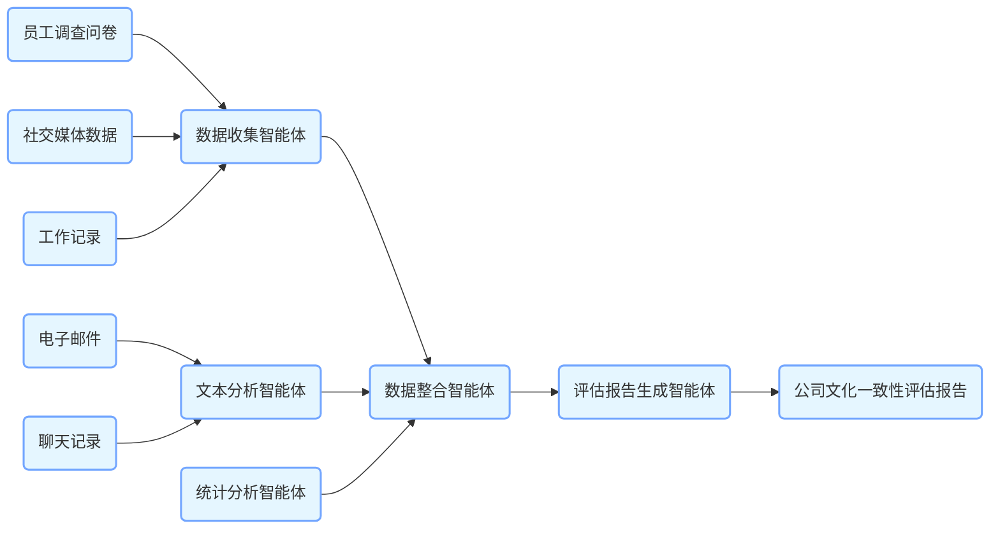
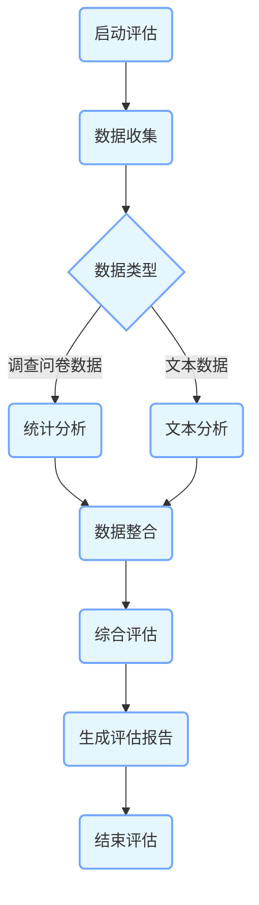

# 利用智能体协作进行全面的公司文化一致性评估

> 关键词：智能体协作、公司文化一致性评估、多智能体系统、文化分析、人工智能应用

> 摘要：本文聚焦于利用智能体协作开展全面的公司文化一致性评估。首先介绍了此评估的背景、目的、适用读者以及文档结构。接着阐述了相关核心概念及联系，包括智能体和公司文化一致性的原理，并给出了相应的架构示意图和流程图。详细讲解了核心算法原理，通过 Python 代码进行了说明。还探讨了数学模型和公式，辅以具体例子加深理解。在项目实战部分，给出了开发环境搭建步骤、源代码实现及解读。分析了实际应用场景，推荐了学习资源、开发工具框架以及相关论文著作。最后总结了未来发展趋势与挑战，解答了常见问题，并提供了扩展阅读和参考资料，旨在为企业利用智能体协作评估公司文化一致性提供全面的技术指导。

## 1. 背景介绍 
### 1.1 目的和范围
在当今竞争激烈的商业环境中，公司文化对于企业的长期发展和成功起着至关重要的作用。公司文化不仅影响员工的工作态度和行为，还关系到企业的创新能力、团队协作效率以及对外的品牌形象。然而，要准确评估公司文化的一致性并非易事，因为公司文化涉及到多个层面和众多因素，包括价值观、行为准则、沟通方式等。

本研究的目的是利用智能体协作的方法，实现对公司文化一致性的全面评估。通过智能体之间的协作和交互，能够从多个角度、多个数据源收集信息，更准确地分析公司文化在不同部门、不同层级之间的一致性程度。

本研究的范围涵盖了智能体协作技术在公司文化一致性评估中的应用，包括核心概念的阐述、算法原理的讲解、数学模型的构建、实际项目的开发以及应用场景的分析等方面。

### 1.2 预期读者
本文的预期读者包括企业的人力资源管理者、企业文化建设者、技术研发人员以及对人工智能在企业管理领域应用感兴趣的研究者。人力资源管理者和企业文化建设者可以从本文中了解如何利用智能体协作技术提升公司文化评估的准确性和效率；技术研发人员可以获取相关的技术原理和实现方法，为进一步的开发和研究提供参考；研究者则可以从理论和实践的角度深入探讨智能体协作在公司文化评估中的应用。

### 1.3 文档结构概述
本文共分为十个部分。第一部分为背景介绍，阐述了研究的目的、范围、预期读者和文档结构；第二部分介绍核心概念与联系，包括智能体和公司文化一致性的原理，以及它们之间的关系，并给出架构示意图和流程图；第三部分详细讲解核心算法原理，并通过 Python 代码进行说明；第四部分探讨数学模型和公式，结合具体例子进行详细讲解；第五部分是项目实战，包括开发环境搭建、源代码实现和代码解读；第六部分分析实际应用场景；第七部分推荐学习资源、开发工具框架和相关论文著作；第八部分总结未来发展趋势与挑战；第九部分为附录，解答常见问题；第十部分提供扩展阅读和参考资料。

### 1.4 术语表
#### 1.4.1 核心术语定义
- **智能体（Agent）**：是一种具有自主决策能力和交互能力的实体，能够感知环境信息，并根据预设的规则和目标进行行动。在本研究中，智能体可以是软件程序，用于收集、分析和处理与公司文化相关的数据。
- **公司文化一致性**：指公司在不同部门、不同层级之间，其价值观、行为准则、沟通方式等文化要素的统一程度。高度的文化一致性有助于企业形成强大的凝聚力和竞争力。
- **多智能体系统（Multi - Agent System，MAS）**：由多个智能体组成的系统，智能体之间通过协作和交互来完成共同的任务。在公司文化一致性评估中，多智能体系统可以用于整合不同数据源的信息，提高评估的准确性。

#### 1.4.2 相关概念解释
- **数据挖掘**：从大量的数据中提取有价值的信息和知识的过程。在公司文化评估中，数据挖掘技术可以用于分析员工的行为数据、沟通记录等，以发现潜在的文化特征和问题。
- **自然语言处理（NLP）**：让计算机理解和处理人类语言的技术。在本研究中，NLP 可以用于分析员工的文本数据，如调查问卷、电子邮件等，以获取关于公司文化的信息。

#### 1.4.3 缩略词列表
- MAS：Multi - Agent System，多智能体系统
- NLP：Natural Language Processing，自然语言处理

## 2. 核心概念与联系 

### 2.1 智能体原理
智能体是一个具有自主性、反应性、社会性和主动性的实体。自主性意味着智能体能够在没有外部干预的情况下独立完成任务；反应性表示智能体能够感知环境的变化并做出相应的反应；社会性体现了智能体可以与其他智能体或人类进行交互；主动性则是指智能体能够主动发起行动以实现自身的目标。

智能体通常由感知模块、决策模块和行动模块组成。感知模块用于收集环境信息，决策模块根据感知到的信息和预设的规则进行决策，行动模块则根据决策结果执行相应的动作。

### 2.2 公司文化一致性原理
公司文化一致性主要体现在价值观、行为准则和沟通方式等方面。价值观是公司文化的核心，它决定了员工的行为取向和决策标准。行为准则是价值观的具体体现，它规定了员工在工作中的行为规范。沟通方式则反映了公司内部的信息传递和交流模式，良好的沟通方式有助于促进文化的一致性。

评估公司文化一致性需要从多个维度进行分析，包括员工的认知、态度和行为等。通过比较不同部门、不同层级员工在这些维度上的表现，可以判断公司文化的一致性程度。

### 2.3 智能体与公司文化一致性评估的联系
智能体可以在公司文化一致性评估中发挥重要作用。不同类型的智能体可以分别负责收集不同来源的数据，如员工调查问卷、社交媒体数据、工作记录等。然后，智能体之间通过协作和交互，对这些数据进行整合和分析，从而全面评估公司文化的一致性。

例如，一个智能体可以负责收集员工的调查问卷数据，并对数据进行初步的统计分析；另一个智能体可以利用自然语言处理技术分析员工的电子邮件和聊天记录，以了解公司内部的沟通文化。最后，多个智能体将各自的分析结果进行汇总和综合，得出关于公司文化一致性的评估报告。

### 2.4 架构示意图


### 2.5 流程图


## 3. 核心算法原理 & 具体操作步骤 

### 3.1 数据收集算法
数据收集是公司文化一致性评估的第一步，需要从多个数据源收集相关数据。以下是一个简单的数据收集算法的 Python 实现：

```python
import requests

def collect_survey_data(url):
    try:
        response = requests.get(url)
        if response.status_code == 200:
            return response.json()
        else:
            print(f"Failed to collect survey data. Status code: {response.status_code}")
            return None
    except requests.RequestException as e:
        print(f"Request error: {e}")
        return None

def collect_social_media_data(api_key, query):
    # 这里假设使用某个社交媒体 API
    import json
    headers = {'Authorization': f'Bearer {api_key}'}
    url = f'https://api.example.com/search?q={query}'
    try:
        response = requests.get(url, headers=headers)
        if response.status_code == 200:
            return response.json()
        else:
            print(f"Failed to collect social media data. Status code: {response.status_code}")
            return None
    except requests.RequestException as e:
        print(f"Request error: {e}")
        return None

# 示例使用
survey_url = 'https://example.com/survey_data.json'
survey_data = collect_survey_data(survey_url)

api_key = 'your_api_key'
query = 'company_name'
social_media_data = collect_social_media_data(api_key, query)
```

### 3.2 文本分析算法
对于收集到的文本数据，如员工的电子邮件和聊天记录，需要进行文本分析以提取与公司文化相关的信息。以下是一个简单的基于自然语言处理的文本分析算法的 Python 实现：

```python
import nltk
from nltk.corpus import stopwords
from nltk.tokenize import word_tokenize
from collections import Counter

nltk.download('punkt')
nltk.download('stopwords')

def text_analysis(text):
    stop_words = set(stopwords.words('english'))
    tokens = word_tokenize(text.lower())
    filtered_tokens = [token for token in tokens if token.isalpha() and token not in stop_words]
    word_counts = Counter(filtered_tokens)
    return word_counts

# 示例使用
text = "Our company values innovation and teamwork. We always encourage employees to share ideas."
analysis_result = text_analysis(text)
print(analysis_result)
```

### 3.3 统计分析算法
统计分析用于对调查问卷数据等进行分析，以了解员工对公司文化的认知和态度。以下是一个简单的统计分析算法的 Python 实现：

```python
import numpy as np

def statistical_analysis(data):
    scores = [item['score'] for item in data]
    mean_score = np.mean(scores)
    std_score = np.std(scores)
    return mean_score, std_score

# 示例使用
survey_data = [{'score': 8}, {'score': 7}, {'score': 9}, {'score': 6}]
mean, std = statistical_analysis(survey_data)
print(f"Mean score: {mean}, Standard deviation: {std}")
```

### 3.4 数据整合算法
数据整合算法用于将不同类型的数据进行整合，以便进行综合评估。以下是一个简单的数据整合算法的 Python 实现：

```python
def data_integration(survey_data, text_analysis_result):
    integrated_data = {
        'survey_mean': np.mean([item['score'] for item in survey_data]),
        'text_top_words': text_analysis_result.most_common(5)
    }
    return integrated_data

# 示例使用
integrated = data_integration(survey_data, analysis_result)
print(integrated)
```

### 3.5 综合评估算法
综合评估算法根据整合后的数据，对公司文化的一致性进行评估。以下是一个简单的综合评估算法的 Python 实现：

```python
def comprehensive_evaluation(integrated_data):
    survey_mean = integrated_data['survey_mean']
    text_top_words = integrated_data['text_top_words']
    # 这里可以根据具体的评估规则进行打分
    if survey_mean > 7 and 'innovation' in [word for word, _ in text_top_words]:
        evaluation_score = 8
    else:
        evaluation_score = 6
    return evaluation_score

# 示例使用
evaluation = comprehensive_evaluation(integrated)
print(f"Comprehensive evaluation score: {evaluation}")
```

## 4. 数学模型和公式 & 详细讲解 & 举例说明 

### 4.1 数据相似度模型
在评估公司文化一致性时，需要比较不同部门或不同层级之间的数据相似度。常用的相似度度量方法有余弦相似度和欧几里得距离。

#### 4.1.1 余弦相似度
余弦相似度用于衡量两个向量之间的夹角余弦值，值越接近 1 表示两个向量越相似。对于两个向量 $\vec{A}=(a_1,a_2,\cdots,a_n)$ 和 $\vec{B}=(b_1,b_2,\cdots,b_n)$，余弦相似度的计算公式为：

$$
\cos(\theta)=\frac{\vec{A}\cdot\vec{B}}{\|\vec{A}\|\|\vec{B}\|}=\frac{\sum_{i = 1}^{n}a_ib_i}{\sqrt{\sum_{i = 1}^{n}a_i^2}\sqrt{\sum_{i = 1}^{n}b_i^2}}
$$

以下是一个计算余弦相似度的 Python 实现：

```python
import numpy as np

def cosine_similarity(A, B):
    dot_product = np.dot(A, B)
    norm_A = np.linalg.norm(A)
    norm_B = np.linalg.norm(B)
    return dot_product / (norm_A * norm_B)

# 示例使用
A = np.array([1, 2, 3])
B = np.array([2, 4, 6])
similarity = cosine_similarity(A, B)
print(f"Cosine similarity: {similarity}")
```

#### 4.1.2 欧几里得距离
欧几里得距离用于衡量两个向量之间的直线距离，距离越近表示两个向量越相似。对于两个向量 $\vec{A}=(a_1,a_2,\cdots,a_n)$ 和 $\vec{B}=(b_1,b_2,\cdots,b_n)$，欧几里得距离的计算公式为：

$$
d(\vec{A},\vec{B})=\sqrt{\sum_{i = 1}^{n}(a_i - b_i)^2}
$$

以下是一个计算欧几里得距离的 Python 实现：

```python
import numpy as np

def euclidean_distance(A, B):
    return np.linalg.norm(A - B)

# 示例使用
A = np.array([1, 2, 3])
B = np.array([2, 4, 6])
distance = euclidean_distance(A, B)
print(f"Euclidean distance: {distance}")
```

### 4.2 综合评估模型
综合评估模型用于将多个指标的评估结果综合起来，得出最终的公司文化一致性评估得分。一种简单的综合评估模型是加权平均法。

假设我们有 $n$ 个评估指标，每个指标的得分分别为 $x_1,x_2,\cdots,x_n$，对应的权重分别为 $w_1,w_2,\cdots,w_n$，且 $\sum_{i = 1}^{n}w_i = 1$，则综合评估得分 $S$ 的计算公式为：

$$
S=\sum_{i = 1}^{n}w_ix_i
$$

以下是一个使用加权平均法进行综合评估的 Python 实现：

```python
import numpy as np

def weighted_average_evaluation(scores, weights):
    return np.dot(scores, weights)

# 示例使用
scores = np.array([8, 7, 6])
weights = np.array([0.4, 0.3, 0.3])
evaluation_score = weighted_average_evaluation(scores, weights)
print(f"Weighted average evaluation score: {evaluation_score}")
```

### 4.3 举例说明
假设我们要评估两个部门（部门 A 和部门 B）的公司文化一致性，我们收集了两个指标的数据：员工满意度调查得分和团队协作频率。

部门 A 的员工满意度调查得分是 8 分，团队协作频率是每周 5 次；部门 B 的员工满意度调查得分是 7 分，团队协作频率是每周 4 次。我们将员工满意度调查得分和团队协作频率分别转换为向量 $\vec{A}=(8, 5)$ 和 $\vec{B}=(7, 4)$。

使用余弦相似度计算两个部门数据的相似度：

```python
A = np.array([8, 5])
B = np.array([7, 4])
similarity = cosine_similarity(A, B)
print(f"Cosine similarity between department A and B: {similarity}")
```

假设我们在综合评估时，员工满意度调查得分的权重是 0.6，团队协作频率的权重是 0.4。我们对部门 A 和部门 B 分别进行综合评估：

```python
scores_A = np.array([8, 5])
scores_B = np.array([7, 4])
weights = np.array([0.6, 0.4])
evaluation_score_A = weighted_average_evaluation(scores_A, weights)
evaluation_score_B = weighted_average_evaluation(scores_B, weights)
print(f"Comprehensive evaluation score of department A: {evaluation_score_A}")
print(f"Comprehensive evaluation score of department B: {evaluation_score_B}")
```

通过比较两个部门的综合评估得分和数据相似度，我们可以判断两个部门的公司文化一致性程度。

## 5. 项目实战：代码实际案例和详细解释说明 

### 5.1  开发环境搭建
#### 5.1.1 安装 Python
首先，确保你已经安装了 Python 环境。建议使用 Python 3.7 及以上版本。你可以从 Python 官方网站（https://www.python.org/downloads/）下载并安装适合你操作系统的 Python 版本。

#### 5.1.2 安装必要的库
在项目中，我们需要使用一些 Python 库，如 `requests`、`nltk`、`numpy` 等。可以使用 `pip` 命令来安装这些库：

```bash
pip install requests nltk numpy
```

同时，需要下载 `nltk` 的相关数据：

```python
import nltk
nltk.download('punkt')
nltk.download('stopwords')
```

### 5.2  源代码详细实现和代码解读
以下是一个完整的项目代码示例，实现了利用智能体协作进行公司文化一致性评估的功能：

```python
import requests
import nltk
from nltk.corpus import stopwords
from nltk.tokenize import word_tokenize
from collections import Counter
import numpy as np

# 数据收集智能体
def collect_survey_data(url):
    try:
        response = requests.get(url)
        if response.status_code == 200:
            return response.json()
        else:
            print(f"Failed to collect survey data. Status code: {response.status_code}")
            return None
    except requests.RequestException as e:
        print(f"Request error: {e}")
        return None

def collect_social_media_data(api_key, query):
    headers = {'Authorization': f'Bearer {api_key}'}
    url = f'https://api.example.com/search?q={query}'
    try:
        response = requests.get(url, headers=headers)
        if response.status_code == 200:
            return response.json()
        else:
            print(f"Failed to collect social media data. Status code: {response.status_code}")
            return None
    except requests.RequestException as e:
        print(f"Request error: {e}")
        return None

# 文本分析智能体
def text_analysis(text):
    stop_words = set(stopwords.words('english'))
    tokens = word_tokenize(text.lower())
    filtered_tokens = [token for token in tokens if token.isalpha() and token not in stop_words]
    word_counts = Counter(filtered_tokens)
    return word_counts

# 统计分析智能体
def statistical_analysis(data):
    scores = [item['score'] for item in data]
    mean_score = np.mean(scores)
    std_score = np.std(scores)
    return mean_score, std_score

# 数据整合智能体
def data_integration(survey_data, text_analysis_result):
    integrated_data = {
        'survey_mean': np.mean([item['score'] for item in survey_data]),
        'text_top_words': text_analysis_result.most_common(5)
    }
    return integrated_data

# 综合评估智能体
def comprehensive_evaluation(integrated_data):
    survey_mean = integrated_data['survey_mean']
    text_top_words = integrated_data['text_top_words']
    if survey_mean > 7 and 'innovation' in [word for word, _ in text_top_words]:
        evaluation_score = 8
    else:
        evaluation_score = 6
    return evaluation_score

# 主程序
if __name__ == "__main__":
    # 数据收集
    survey_url = 'https://example.com/survey_data.json'
    survey_data = collect_survey_data(survey_url)

    api_key = 'your_api_key'
    query = 'company_name'
    social_media_data = collect_social_media_data(api_key, query)

    if survey_data and social_media_data:
        # 文本分析
        text = " ".join([item['text'] for item in social_media_data])
        text_analysis_result = text_analysis(text)

        # 统计分析
        mean, std = statistical_analysis(survey_data)

        # 数据整合
        integrated = data_integration(survey_data, text_analysis_result)

        # 综合评估
        evaluation = comprehensive_evaluation(integrated)

        print(f"Comprehensive evaluation score: {evaluation}")
```

### 5.3  代码解读与分析
- **数据收集智能体**：`collect_survey_data` 函数用于从指定的 URL 收集调查问卷数据，`collect_social_media_data` 函数用于从社交媒体 API 收集相关数据。
- **文本分析智能体**：`text_analysis` 函数对收集到的文本数据进行分词、去除停用词等处理，并统计每个单词的出现次数。
- **统计分析智能体**：`statistical_analysis` 函数对调查问卷数据进行统计分析，计算平均分和标准差。
- **数据整合智能体**：`data_integration` 函数将调查问卷数据的平均分和文本分析的前 5 个高频词整合到一个字典中。
- **综合评估智能体**：`comprehensive_evaluation` 函数根据整合后的数据进行综合评估，给出最终的评估得分。

在主程序中，我们依次调用各个智能体的函数，完成数据收集、文本分析、统计分析、数据整合和综合评估的过程，并输出最终的评估得分。

## 6. 实际应用场景 
### 6.1 企业内部文化建设
企业可以利用智能体协作进行全面的公司文化一致性评估，及时发现不同部门之间文化差异，有针对性地开展文化建设活动。例如，如果评估发现某个部门对创新价值观的认知和实践与公司整体不一致，企业可以为该部门组织创新培训和交流活动，促进文化的统一。

### 6.2 企业并购与重组
在企业并购与重组过程中，文化融合是一个关键问题。通过智能体协作评估双方公司的文化一致性，可以提前发现潜在的文化冲突，制定相应的文化融合策略。例如，在并购前评估两家公司的决策方式、沟通风格等文化要素，为后续的整合提供参考。

### 6.3 员工招聘与选拔
在员工招聘与选拔过程中，企业可以利用智能体协作评估候选人与公司文化的匹配度。通过分析候选人的简历、面试表现等数据，判断其价值观和行为方式是否与公司文化一致，从而选拔出更符合公司文化的人才。

### 6.4 员工培训与发展
根据公司文化一致性评估结果，企业可以为员工提供个性化的培训与发展方案。对于文化认知和实践不足的员工，提供相关的培训课程，帮助他们更好地融入公司文化。例如，对于团队协作意识不强的员工，组织团队建设培训活动。

## 7. 工具和资源推荐
### 7.1 学习资源推荐
#### 7.1.1 书籍推荐
- 《多智能体系统：原理与编程》：全面介绍了多智能体系统的基本原理、设计方法和编程技巧，对于理解智能体协作技术非常有帮助。
- 《企业文化：企业生活中的礼仪与仪式》：深入探讨了企业文化的形成、发展和作用，为公司文化评估提供了理论基础。
- 《Python 自然语言处理》：详细介绍了 Python 在自然语言处理领域的应用，包括文本分析、情感分析等技术，对于处理公司文化相关的文本数据很有价值。

#### 7.1.2 在线课程
- Coursera 上的“Artificial Intelligence for Robotics”：该课程介绍了人工智能在机器人领域的应用，其中涉及到多智能体系统的相关知识。
- edX 上的“Natural Language Processing with Python and NLTK”：专门讲解 Python 和 NLTK 在自然语言处理中的应用，适合初学者学习。
- Udemy 上的“Company Culture: Creating a Positive Workplace”：课程围绕公司文化建设展开，提供了实用的方法和案例。

#### 7.1.3 技术博客和网站
- Towards Data Science：这是一个专注于数据科学和人工智能领域的博客平台，上面有很多关于智能体技术和文本分析的文章。
- Medium：涵盖了各种技术和商业领域的文章，其中有不少关于公司文化和人工智能应用的内容。
- AI Stack Exchange：一个专门的人工智能问答社区，可以在这里提问和获取相关技术的解答。

### 7.2 开发工具框架推荐
#### 7.2.1 IDE和编辑器
- PyCharm：一款专业的 Python 集成开发环境，提供了丰富的代码编辑、调试和项目管理功能。
- Jupyter Notebook：适合进行数据探索和代码演示，方便与团队成员分享分析结果。
- Visual Studio Code：一款轻量级的代码编辑器，支持多种编程语言，有丰富的插件可以扩展功能。

#### 7.2.2 调试和性能分析工具
- pdb：Python 自带的调试工具，可以帮助开发者定位代码中的问题。
- cProfile：用于分析 Python 代码的性能，找出性能瓶颈。
- Py-Spy：一个轻量级的 Python 性能分析工具，可以实时监控 Python 程序的运行情况。

#### 7.2.3 相关框架和库
- Mesa：一个用于构建基于智能体的模型的 Python 框架，提供了丰富的智能体和环境定义功能。
- SpaCy：一个高效的自然语言处理库，提供了快速的文本处理和分析功能。
- Scikit-learn：一个强大的机器学习库，可用于数据挖掘和数据分析，在公司文化评估中可以用于构建预测模型。

### 7.3 相关论文著作推荐
#### 7.3.1 经典论文
- “Multi - Agent Systems: A Modern Approach to Distributed Artificial Intelligence”：该论文系统地介绍了多智能体系统的基本概念、理论和应用，是多智能体系统领域的经典之作。
- “Corporate Culture and Performance”：研究了企业文化与企业绩效之间的关系，为公司文化评估提供了重要的理论依据。
- “Natural Language Processing: An Introduction”：全面介绍了自然语言处理的基本原理和方法，对于理解文本分析技术很有帮助。

#### 7.3.2 最新研究成果
- 可以关注 ACM SIGART（Association for Computing Machinery Special Interest Group on Artificial Intelligence）的会议论文集，其中包含了智能体技术和人工智能领域的最新研究成果。
- IEEE Transactions on Systems, Man, and Cybernetics: Systems 期刊上发表了很多关于多智能体系统和企业管理应用的研究论文。

#### 7.3.3 应用案例分析
- 《哈佛商业评论》上经常发表一些关于公司文化建设和评估的案例分析文章，具有很高的实践参考价值。
- McKinsey Quarterly 上的一些文章也会介绍企业在文化整合、员工激励等方面的成功案例。

## 8. 总结：未来发展趋势与挑战
### 8.1 未来发展趋势
#### 8.1.1 智能化程度不断提高
随着人工智能技术的不断发展，智能体的自主决策能力和学习能力将不断增强。未来的智能体可以自动调整评估策略，根据不同的企业场景和数据特点进行更精准的公司文化一致性评估。

#### 8.1.2 多模态数据融合
除了现有的文本数据和调查问卷数据，未来的评估将更多地融合图像、音频、视频等多模态数据。例如，通过分析员工的面部表情和语音语调，更全面地了解员工的情感和态度，从而提高评估的准确性。

#### 8.1.3 与企业管理系统深度集成
智能体协作评估系统将与企业的人力资源管理系统、财务管理系统等深度集成，实现数据的实时共享和交互。这样可以更及时地发现公司文化问题，并采取相应的措施进行调整。

### 8.2 挑战
#### 8.2.1 数据隐私和安全问题
在收集和分析员工数据时，需要严格保护员工的隐私和数据安全。如何在确保数据安全的前提下，获取足够的有效数据进行评估，是一个需要解决的问题。

#### 8.2.2 文化多样性的挑战
不同地区、不同行业的企业具有不同的文化特点，如何在评估中考虑文化多样性的因素，制定适用于不同企业的评估标准，是一个挑战。

#### 8.2.3 技术复杂性
智能体协作涉及到多智能体系统、自然语言处理、机器学习等多种技术，技术实现和系统维护的复杂性较高。需要专业的技术人员进行开发和管理。

## 9. 附录：常见问题与解答
### 9.1 如何确保数据收集的准确性和全面性？
为了确保数据收集的准确性和全面性，可以采取以下措施：
- 选择可靠的数据来源，如官方调查问卷、权威的社交媒体平台等。
- 设计合理的数据收集方案，确保涵盖公司文化的各个方面。
- 对收集到的数据进行清洗和预处理，去除噪声和错误数据。

### 9.2 智能体协作评估的结果是否可靠？
智能体协作评估的结果可靠性取决于多个因素，如数据的质量、算法的合理性、智能体的协作效率等。为了提高结果的可靠性，可以采取以下措施：
- 采用多种评估指标和方法进行综合评估，避免单一指标的局限性。
- 对评估结果进行验证和校准，与实际情况进行对比分析。
- 不断优化算法和智能体的协作策略，提高评估的准确性。

### 9.3 如何将评估结果应用到企业管理中？
可以将评估结果应用到企业管理的以下方面：
- 文化建设：根据评估结果，制定针对性的文化建设方案，加强文化一致性。
- 员工培训：为员工提供与公司文化相关的培训课程，提高员工的文化认知和实践能力。
- 人才选拔：在招聘和选拔人才时，参考评估结果，选择与公司文化匹配的候选人。
- 决策制定：在制定企业战略和决策时，考虑公司文化的因素，确保决策与文化一致。

## 10. 扩展阅读 & 参考资料
### 10.1 扩展阅读
- 《智能系统中的概率推理：似然网络》：深入探讨了概率推理在智能系统中的应用，对于理解智能体的决策机制有帮助。
- 《组织文化与领导力》：从领导力的角度研究组织文化，为企业管理者提供了文化建设的新思路。
- 《大数据时代：生活、工作与思维的大变革》：介绍了大数据技术的发展和应用，对于理解数据驱动的公司文化评估有启发。

### 10.2 参考资料
- 各相关技术文档和官方网站，如 Python 官方文档、NLTK 官方文档、Mesa 官方文档等。
- 企业内部的文化手册、规章制度等文件，为公司文化评估提供了基础信息。
- 行业报告和研究机构的统计数据，有助于了解行业内公司文化的普遍情况。

作者：AI天才研究院/AI Genius Institute & 禅与计算机程序设计艺术 /Zen And The Art of Computer Programming