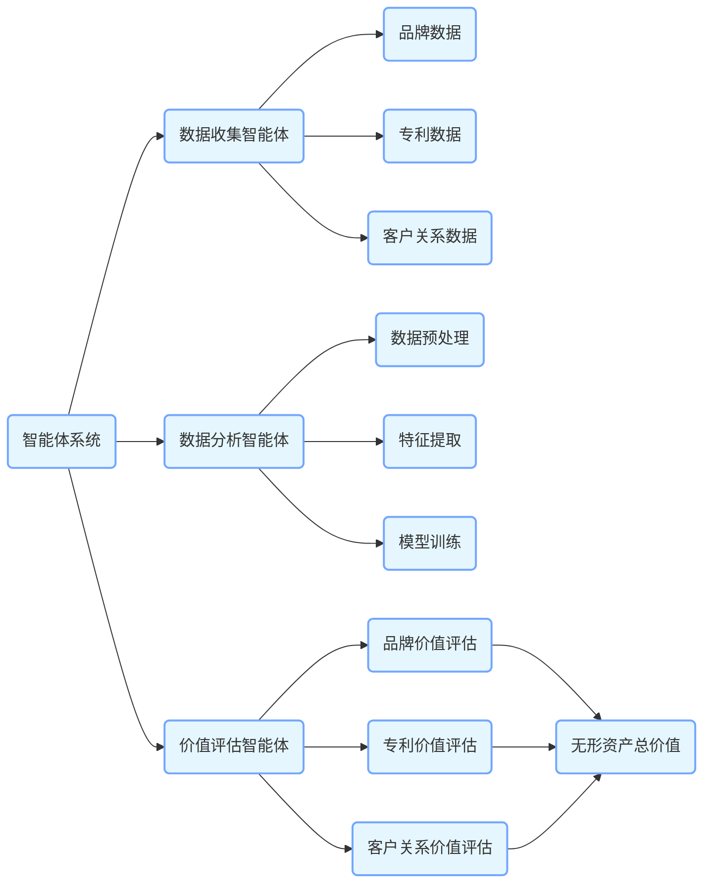

# 利用智能体系统进行全面的公司无形资产价值量化

> 关键词：智能体系统、公司无形资产、价值量化、人工智能、数据分析

> 摘要：本文聚焦于利用智能体系统对公司无形资产进行全面价值量化。首先介绍了研究的背景、目的、预期读者和文档结构等信息，阐述了相关核心概念及其联系，并给出了示意图和流程图。详细讲解了核心算法原理，通过Python代码进行示例说明，同时给出了相关数学模型和公式。结合项目实战，展示了开发环境搭建、源代码实现与解读。分析了该技术在实际中的应用场景，推荐了学习资源、开发工具框架以及相关论文著作。最后总结了未来发展趋势与挑战，提供了常见问题解答和扩展阅读参考资料，旨在为企业准确评估无形资产价值提供科学有效的方法和技术支持。

## 1. 背景介绍 
### 1.1 目的和范围
在当今知识经济时代，公司的无形资产如品牌价值、知识产权、客户关系等在企业的发展和竞争中扮演着越来越重要的角色。然而，与有形资产相比，无形资产的价值量化一直是一个具有挑战性的问题。本研究的目的在于利用智能体系统，开发一种全面、准确的公司无形资产价值量化方法。研究范围涵盖了常见的各类无形资产，包括但不限于品牌、专利、商标、商业秘密、客户忠诚度等，旨在为企业管理者、投资者和相关利益者提供科学的无形资产价值评估依据。

### 1.2 预期读者
本文预期读者包括企业管理人员，他们可以通过了解无形资产价值量化方法，更好地管理和决策企业的资源配置；投资者，能够借助准确的价值评估信息做出更明智的投资决策；学术研究人员，可将其作为相关领域研究的参考和启发；以及对人工智能和财务管理交叉领域感兴趣的技术爱好者。

### 1.3 文档结构概述
本文将按照以下结构展开：首先介绍核心概念与联系，明确智能体系统和公司无形资产的相关定义和关系；接着阐述核心算法原理和具体操作步骤，并给出Python代码示例；然后讲解相关数学模型和公式，并举例说明；通过项目实战展示代码的实际应用和详细解释；分析该技术在实际中的应用场景；推荐学习资源、开发工具框架和相关论文著作；最后总结未来发展趋势与挑战，提供常见问题解答和扩展阅读参考资料。

### 1.4 术语表
#### 1.4.1 核心术语定义
- **智能体系统**：由多个智能体组成的系统，每个智能体具有自主决策和行动的能力，能够感知环境、与其他智能体交互，并根据自身的目标和规则进行决策和行动。
- **公司无形资产**：指企业拥有或者控制的没有实物形态的可辨认非货币性资产，包括品牌、专利、商标、商业秘密、客户关系等。
- **价值量化**：将无形资产的价值用具体的货币或其他量化指标表示出来的过程。

#### 1.4.2 相关概念解释
- **人工智能**：研究、开发用于模拟、延伸和扩展人的智能的理论、方法、技术及应用系统的一门新的技术科学，智能体系统是人工智能的一种具体应用形式。
- **数据分析**：对大量的数据进行收集、整理、分析和解释，以发现数据中的规律和信息，为决策提供支持。在无形资产价值量化中，数据分析用于处理和挖掘与无形资产相关的数据。

#### 1.4.3 缩略词列表
- **AI**：Artificial Intelligence，人工智能
- **MAS**：Multi - Agent System，多智能体系统

## 2. 核心概念与联系 

### 核心概念原理
#### 智能体系统原理
智能体系统基于分布式人工智能的思想，每个智能体都有自己的知识、目标和行为规则。智能体可以感知周围环境的信息，根据自身的知识和目标进行推理和决策，然后采取相应的行动。智能体之间可以通过通信机制进行交互和协作，共同完成复杂的任务。例如，在无形资产价值量化中，可以设计不同类型的智能体，如数据收集智能体、数据分析智能体、价值评估智能体等，它们各自负责不同的任务，并通过协作完成整个价值量化过程。

#### 公司无形资产原理
公司无形资产是企业在长期的经营过程中积累形成的，具有独特的价值和特点。品牌是企业在市场上的形象和声誉，代表着消费者对企业产品或服务的认知和信任；专利是企业的技术创新成果，具有排他性和商业价值；客户关系是企业与客户之间长期建立的联系和互动，良好的客户关系可以为企业带来持续的收益。

### 核心概念架构
以下是智能体系统进行公司无形资产价值量化的架构示意图：



该架构图展示了智能体系统进行公司无形资产价值量化的主要组成部分和流程。数据收集智能体负责收集各类无形资产相关的数据，数据分析智能体对收集到的数据进行预处理、特征提取和模型训练，价值评估智能体根据训练好的模型对不同类型的无形资产进行价值评估，最终得到无形资产的总价值。

## 3. 核心算法原理 & 具体操作步骤 

### 核心算法原理
在利用智能体系统进行公司无形资产价值量化时，主要采用机器学习算法进行数据分析和价值评估。以品牌价值评估为例，常用的算法有支持向量机（SVM）和神经网络。

#### 支持向量机（SVM）原理
支持向量机是一种二分类模型，其基本思想是在特征空间中找到一个最优的超平面，使得不同类别的样本能够被最大程度地分开。在品牌价值评估中，可以将品牌相关的数据（如市场份额、品牌知名度等）作为特征，将品牌的价值分为不同的等级，然后使用SVM进行分类和预测。

#### 神经网络原理
神经网络是一种模仿人类神经系统的计算模型，由大量的神经元组成。神经网络可以自动学习数据中的复杂模式和关系，通过不断调整神经元之间的连接权重来优化模型的性能。在无形资产价值量化中，神经网络可以用于对各类无形资产的价值进行回归预测。

### 具体操作步骤
#### 数据收集
数据收集智能体负责收集与公司无形资产相关的数据，包括品牌数据（如品牌知名度、美誉度、市场份额等）、专利数据（如专利数量、专利质量、专利有效期等）、客户关系数据（如客户数量、客户忠诚度、客户消费金额等）。可以通过网络爬虫、企业内部数据库、市场调研等方式获取数据。

#### 数据预处理
数据分析智能体对收集到的数据进行预处理，包括数据清洗、数据归一化、数据编码等操作。数据清洗用于去除数据中的噪声和异常值，数据归一化将数据转换到相同的尺度上，数据编码将非数值型数据转换为数值型数据，以便机器学习算法能够处理。

#### 特征提取
从预处理后的数据中提取有代表性的特征，例如，可以使用主成分分析（PCA）方法提取品牌数据的主成分，减少数据的维度，同时保留数据的主要信息。

#### 模型训练
使用提取的特征和标注好的样本数据对机器学习模型进行训练，例如，使用支持向量机或神经网络对品牌价值进行训练。训练过程中需要调整模型的参数，以提高模型的准确性和泛化能力。

#### 价值评估
价值评估智能体使用训练好的模型对公司的无形资产进行价值评估，将评估结果汇总得到无形资产的总价值。

### Python源代码示例
以下是一个使用Python和Scikit - learn库实现支持向量机进行品牌价值评估的示例代码：

```python
import numpy as np
from sklearn import svm
from sklearn.model_selection import train_test_split
from sklearn.preprocessing import StandardScaler

# 生成示例数据
# 假设我们有100个样本，每个样本有3个特征（品牌知名度、美誉度、市场份额）
# 以及对应的品牌价值等级（0 - 低价值，1 - 高价值）
np.random.seed(0)
X = np.random.randn(100, 3)
y = np.random.randint(0, 2, 100)

# 数据划分
X_train, X_test, y_train, y_test = train_test_split(X, y, test_size=0.2, random_state=42)

# 数据归一化
scaler = StandardScaler()
X_train = scaler.fit_transform(X_train)
X_test = scaler.transform(X_test)

# 创建SVM模型
clf = svm.SVC(kernel='linear')

# 模型训练
clf.fit(X_train, y_train)

# 模型预测
y_pred = clf.predict(X_test)

# 输出预测结果
print("预测结果:", y_pred)
```

在上述代码中，首先生成了示例数据，然后将数据划分为训练集和测试集，并进行了数据归一化处理。接着创建了一个线性核的支持向量机模型，并使用训练集进行训练。最后使用测试集进行预测，并输出预测结果。

## 4. 数学模型和公式 & 详细讲解 & 举例说明 

### 支持向量机数学模型和公式
#### 线性可分情况
在二维空间中，假设有两类样本点 $\{(x_1, y_1), (x_2, y_2), \cdots, (x_n, y_n)\}$，其中 $x_i \in \mathbb{R}^2$ 是样本点的特征向量，$y_i \in \{-1, 1\}$ 是样本点的类别标签。支持向量机的目标是找到一个最优的超平面 $w^T x + b = 0$，使得不同类别的样本点能够被最大程度地分开。

超平面到样本点的距离可以表示为：
$$d_i = \frac{|w^T x_i + b|}{\|w\|}$$

为了使超平面能够正确分类样本点，需要满足以下约束条件：
$$y_i(w^T x_i + b) \geq 1, \quad i = 1, 2, \cdots, n$$

支持向量机的目标是最大化间隔 $\frac{2}{\|w\|}$，等价于最小化 $\frac{1}{2}\|w\|^2$，因此可以将支持向量机的优化问题表示为：
$$\min_{w, b} \frac{1}{2}\|w\|^2$$
$$\text{s.t. } y_i(w^T x_i + b) \geq 1, \quad i = 1, 2, \cdots, n$$

#### 线性不可分情况
在实际应用中，样本点往往不是线性可分的，此时需要引入松弛变量 $\xi_i \geq 0$ 来允许一些样本点被错误分类。支持向量机的优化问题变为：
$$\min_{w, b, \xi} \frac{1}{2}\|w\|^2 + C \sum_{i = 1}^{n} \xi_i$$
$$\text{s.t. } y_i(w^T x_i + b) \geq 1 - \xi_i, \quad \xi_i \geq 0, \quad i = 1, 2, \cdots, n$$

其中 $C$ 是惩罚参数，用于控制错误分类的惩罚程度。

### 神经网络数学模型和公式
#### 神经元模型
神经网络由多个神经元组成，每个神经元的输入是上一层神经元的输出。神经元的输出可以表示为：
$$y = f(\sum_{i = 1}^{n} w_i x_i + b)$$

其中 $x_i$ 是输入信号，$w_i$ 是连接权重，$b$ 是偏置，$f$ 是激活函数。常用的激活函数有 sigmoid 函数、ReLU 函数等。

#### 前馈神经网络
前馈神经网络是一种常见的神经网络结构，信息从输入层依次传递到隐藏层，最后传递到输出层。假设输入层有 $n$ 个神经元，隐藏层有 $m$ 个神经元，输出层有 $k$ 个神经元。第 $j$ 个隐藏层神经元的输入可以表示为：
$$z_j^h = \sum_{i = 1}^{n} w_{ji}^h x_i + b_j^h$$

其中 $w_{ji}^h$ 是输入层第 $i$ 个神经元到隐藏层第 $j$ 个神经元的连接权重，$b_j^h$ 是隐藏层第 $j$ 个神经元的偏置。隐藏层第 $j$ 个神经元的输出为：
$$a_j^h = f(z_j^h)$$

输出层第 $l$ 个神经元的输入为：
$$z_l^o = \sum_{j = 1}^{m} w_{lj}^o a_j^h + b_l^o$$

其中 $w_{lj}^o$ 是隐藏层第 $j$ 个神经元到输出层第 $l$ 个神经元的连接权重，$b_l^o$ 是输出层第 $l$ 个神经元的偏置。输出层第 $l$ 个神经元的输出为：
$$a_l^o = f(z_l^o)$$

#### 误差反向传播算法
误差反向传播算法用于训练神经网络，其基本思想是通过计算输出层的误差，然后将误差反向传播到隐藏层和输入层，更新连接权重和偏置，以减小误差。误差函数通常使用均方误差：
$$E = \frac{1}{2} \sum_{l = 1}^{k} (t_l - a_l^o)^2$$

其中 $t_l$ 是输出层第 $l$ 个神经元的目标输出。

### 举例说明
假设我们有一个简单的线性可分的二维数据集，样本点如下：
$$x_1 = [1, 2], y_1 = 1$$
$$x_2 = [2, 3], y_2 = 1$$
$$x_3 = [-1, -1], y_3 = -1$$
$$x_4 = [-2, -2], y_4 = -1$$

我们可以使用支持向量机来找到一个最优的超平面将这两类样本点分开。根据上述支持向量机的优化问题，我们可以使用拉格朗日乘子法求解最优的 $w$ 和 $b$。最终得到的超平面方程可以用于对新的样本点进行分类。

## 5. 项目实战：代码实际案例和详细解释说明 

### 5.1  开发环境搭建
#### 操作系统
可以选择 Windows、Linux 或 macOS 操作系统，本项目推荐使用 Linux 系统，如 Ubuntu 18.04 及以上版本，因为 Linux 系统在数据处理和机器学习开发方面具有良好的性能和稳定性。

#### 编程语言和库
- **Python**：选择 Python 3.7 及以上版本，Python 是一种功能强大、易于学习的编程语言，拥有丰富的机器学习和数据分析库。
- **Scikit - learn**：用于实现机器学习算法，如支持向量机、神经网络等。
- **Pandas**：用于数据处理和分析，提供了高效的数据结构和数据操作方法。
- **Numpy**：用于数值计算，提供了高效的多维数组对象和数学函数。

#### 安装步骤
可以使用 pip 包管理工具来安装所需的库，打开终端，执行以下命令：
```bash
pip install scikit-learn pandas numpy
```

### 5.2  源代码详细实现和代码解读
以下是一个完整的使用智能体系统进行公司无形资产价值量化的项目代码示例，以品牌价值评估为例：

```python
import pandas as pd
import numpy as np
from sklearn import svm
from sklearn.model_selection import train_test_split
from sklearn.preprocessing import StandardScaler
from sklearn.metrics import accuracy_score

# 数据收集智能体
def data_collection():
    # 假设从 CSV 文件中读取品牌数据
    data = pd.read_csv('brand_data.csv')
    X = data.drop('brand_value', axis=1).values
    y = data['brand_value'].values
    return X, y

# 数据分析智能体
def data_analysis(X, y):
    # 数据划分
    X_train, X_test, y_train, y_test = train_test_split(X, y, test_size=0.2, random_state=42)
    
    # 数据归一化
    scaler = StandardScaler()
    X_train = scaler.fit_transform(X_train)
    X_test = scaler.transform(X_test)
    
    return X_train, X_test, y_train, y_test

# 价值评估智能体
def value_evaluation(X_train, X_test, y_train, y_test):
    # 创建 SVM 模型
    clf = svm.SVC(kernel='linear')
    
    # 模型训练
    clf.fit(X_train, y_train)
    
    # 模型预测
    y_pred = clf.predict(X_test)
    
    # 计算准确率
    accuracy = accuracy_score(y_test, y_pred)
    print("模型准确率:", accuracy)
    
    return y_pred

# 主函数
def main():
    # 数据收集
    X, y = data_collection()
    
    # 数据分析
    X_train, X_test, y_train, y_test = data_analysis(X, y)
    
    # 价值评估
    y_pred = value_evaluation(X_train, X_test, y_train, y_test)

if __name__ == "__main__":
    main()
```

### 代码解读与分析
#### 数据收集智能体
`data_collection` 函数从 CSV 文件中读取品牌数据，并将特征数据和标签数据分离。假设 CSV 文件中包含多个品牌特征列和一个品牌价值标签列。

#### 数据分析智能体
`data_analysis` 函数将数据划分为训练集和测试集，并对数据进行归一化处理。归一化可以使不同特征具有相同的尺度，提高机器学习模型的性能。

#### 价值评估智能体
`value_evaluation` 函数创建一个线性核的支持向量机模型，并使用训练集进行训练。然后使用测试集进行预测，并计算模型的准确率。

#### 主函数
`main` 函数依次调用数据收集、数据分析和价值评估智能体，完成整个品牌价值评估的流程。

## 6. 实际应用场景 
### 企业战略决策
企业管理者可以利用智能体系统对公司的无形资产进行价值量化，了解各项无形资产的价值贡献，从而制定更加科学合理的战略决策。例如，如果品牌价值较高，可以加大品牌推广和维护的投入；如果专利价值较高，可以加强技术研发和专利保护。

### 投资决策
投资者在进行投资决策时，可以参考公司无形资产的价值量化结果。具有较高无形资产价值的公司往往具有更强的竞争力和发展潜力，投资风险相对较低。例如，在评估两家同行业公司时，无形资产价值较高的公司可能更值得投资。

### 企业并购与重组
在企业并购与重组过程中，准确评估目标公司的无形资产价值至关重要。智能体系统可以帮助收购方全面了解目标公司的无形资产状况，合理确定收购价格，避免高估或低估无形资产价值带来的风险。

### 知识产权交易
在知识产权交易市场中，需要对专利、商标等无形资产进行准确的价值评估。智能体系统可以提供科学的评估方法，为知识产权交易双方提供参考，促进知识产权的合理流转和利用。

## 7. 工具和资源推荐
### 7.1 学习资源推荐
#### 7.1.1 书籍推荐
- 《机器学习》（周志华）：全面介绍了机器学习的基本概念、算法和应用，是机器学习领域的经典教材。
- 《人工智能：一种现代的方法》（Stuart Russell、Peter Norvig）：系统阐述了人工智能的理论、方法和技术，涵盖了智能体系统等多个方面的内容。
- 《Python 数据分析实战》（Sebastian Raschka）：介绍了使用 Python 进行数据分析的方法和技巧，包括数据处理、可视化和机器学习等方面。

#### 7.1.2 在线课程
- Coursera 上的“机器学习”课程（Andrew Ng 教授）：是一门经典的机器学习入门课程，通过视频讲解、编程作业等方式，帮助学习者掌握机器学习的基本概念和算法。
- edX 上的“人工智能基础”课程：介绍了人工智能的基本原理和方法，包括智能体系统、搜索算法、机器学习等内容。
- 中国大学 MOOC 上的“Python 语言程序设计”课程：适合初学者学习 Python 编程语言，为后续的数据分析和机器学习开发打下基础。

#### 7.1.3 技术博客和网站
- 机器之心：提供人工智能领域的最新技术动态、研究成果和应用案例，是了解人工智能发展趋势的重要渠道。
- 博客园：有许多技术爱好者分享的机器学习、数据分析等方面的技术文章和经验总结。
- Kaggle：是一个数据科学竞赛平台，上面有大量的数据集和优秀的数据分析代码，可以学习到其他开发者的经验和技巧。

### 7.2 开发工具框架推荐
#### 7.2.1 IDE和编辑器
- PyCharm：是一款专门为 Python 开发设计的集成开发环境，具有代码自动补全、调试、版本控制等功能，提高开发效率。
- Jupyter Notebook：是一个交互式的开发环境，支持 Python 代码的实时运行和可视化展示，适合数据分析和机器学习的实验和探索。
- Visual Studio Code：是一款轻量级的代码编辑器，支持多种编程语言和插件扩展，可以通过安装 Python 相关插件来进行 Python 开发。

#### 7.2.2 调试和性能分析工具
- PDB：Python 自带的调试工具，可以在代码中设置断点，逐行调试代码，帮助开发者查找和解决问题。
- cProfile：Python 标准库中的性能分析工具，可以分析代码的运行时间和函数调用次数，找出性能瓶颈。
- TensorBoard：是 TensorFlow 提供的可视化工具，可以用于可视化神经网络的训练过程、模型结构等信息，帮助开发者优化模型。

#### 7.2.3 相关框架和库
- Scikit - learn：是一个简单易用的机器学习库，提供了丰富的机器学习算法和工具，如分类、回归、聚类等。
- TensorFlow：是一个开源的深度学习框架，广泛应用于图像识别、自然语言处理等领域，支持分布式训练和多种硬件平台。
- PyTorch：是另一个流行的深度学习框架，具有动态图机制，易于使用和调试，受到了很多研究者的喜爱。

### 7.3 相关论文著作推荐
#### 7.3.1 经典论文
- “Support - Vector Networks”（Cortes 和 Vapnik）：首次提出了支持向量机的概念和算法，是支持向量机领域的经典论文。
- “Learning Representations by Back - propagating Errors”（Rumelhart、Hinton 和 Williams）：介绍了误差反向传播算法，是神经网络领域的重要论文。

#### 7.3.2 最新研究成果
可以通过学术数据库如 IEEE Xplore、ACM Digital Library、ScienceDirect 等搜索关于智能体系统和无形资产价值量化的最新研究成果。关注相关领域的顶级会议，如 AAAI（Association for the Advancement of Artificial Intelligence）、IJCAI（International Joint Conference on Artificial Intelligence）等，获取最新的研究动态。

#### 7.3.3 应用案例分析
一些商业咨询公司和研究机构会发布关于企业无形资产价值评估的应用案例分析报告，可以通过他们的官方网站或专业数据库获取这些报告，了解实际应用中的方法和经验。

## 8. 总结：未来发展趋势与挑战
### 未来发展趋势
#### 智能化程度不断提高
随着人工智能技术的不断发展，智能体系统将变得更加智能化和自主化。智能体可以自动学习和适应环境的变化，更好地完成无形资产价值量化的任务。例如，智能体可以自动发现新的无形资产价值影响因素，并调整评估模型。

#### 与区块链技术结合
区块链技术具有去中心化、不可篡改等特点，可以为无形资产价值量化提供更加可靠的数据来源和记录方式。将智能体系统与区块链技术结合，可以实现无形资产数据的安全共享和可信评估，提高评估结果的可信度。

#### 跨领域融合
无形资产价值量化涉及到人工智能、财务管理、市场营销等多个领域，未来将更加注重跨领域的融合。例如，结合心理学和社会学的知识，更好地理解消费者对品牌的认知和情感，从而更准确地评估品牌价值。

### 挑战
#### 数据质量和获取难度
无形资产相关的数据往往具有多样性、复杂性和主观性，数据质量难以保证。同时，部分数据可能受到企业保密等因素的限制，获取难度较大。如何获取高质量、全面的无形资产数据是一个亟待解决的问题。

#### 模型解释性
机器学习模型如神经网络等往往是黑盒模型，难以解释模型的决策过程和结果。在无形资产价值量化中，决策者需要了解评估结果的依据和合理性，因此提高模型的解释性是一个重要的挑战。

#### 法律法规和伦理问题
无形资产价值量化涉及到企业的商业机密和个人隐私等问题，需要遵守相关的法律法规和伦理准则。如何在保证评估准确性的同时，保护企业和个人的合法权益是一个需要关注的问题。

## 9. 附录：常见问题与解答
### 问题 1：智能体系统进行无形资产价值量化的准确性如何保证？
解答：可以通过以下几个方面来保证准确性：一是确保数据的质量，进行严格的数据清洗和预处理；二是选择合适的机器学习算法和模型，并进行充分的模型训练和调优；三是引入多个智能体进行协作和验证，从不同的角度进行评估。

### 问题 2：无形资产价值量化的结果是否具有时效性？
解答：是的，无形资产的价值会随着市场环境、企业经营状况等因素的变化而变化。因此，无形资产价值量化的结果具有时效性，需要定期进行更新和评估。

### 问题 3：如何处理无形资产数据中的缺失值和异常值？
解答：对于缺失值，可以采用均值填充、中位数填充、插值法等方法进行填充；对于异常值，可以通过统计分析方法（如箱线图、Z - score 方法）进行识别和处理，也可以将异常值作为特殊情况进行单独分析。

### 问题 4：智能体系统是否可以应用于所有类型的无形资产价值量化？
解答：智能体系统具有一定的通用性，但不同类型的无形资产具有不同的特点和价值影响因素。在实际应用中，需要根据具体情况对智能体系统和评估模型进行调整和优化，以适应不同类型无形资产的价值量化需求。

## 10. 扩展阅读 & 参考资料
### 扩展阅读
- 《知识资产：在信息经济中赢得竞争优势》（Thomas A. Stewart）：深入探讨了知识资产在企业竞争中的重要性和管理方法。
- 《品牌资产管理》（Kevin Lane Keller）：介绍了品牌资产的概念、测量和管理方法，对品牌价值量化有一定的参考价值。

### 参考资料
- 相关学术论文和研究报告，如在 IEEE、ACM 等学术数据库中搜索到的关于智能体系统和无形资产价值量化的论文。
- 企业财务报表和市场调研数据，可用于获取实际的无形资产相关数据。

作者：AI天才研究院/AI Genius Institute & 禅与计算机程序设计艺术 /Zen And The Art of Computer Programming