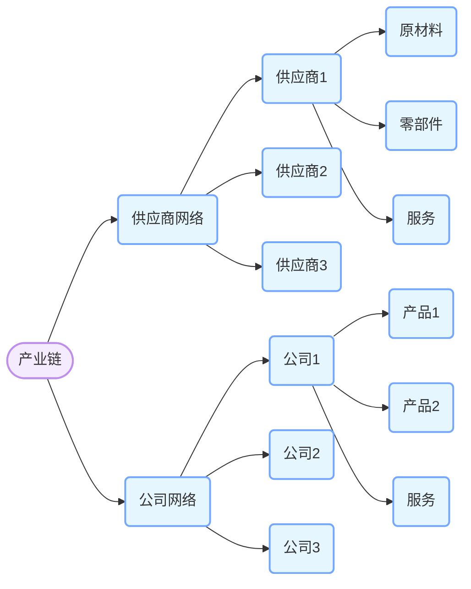

# 利用智能体网络分析公司在产业链中的地位变化

> 关键词：智能体网络、产业链、公司地位变化、复杂系统、数据分析

> 摘要：本文聚焦于利用智能体网络这一先进技术来分析公司在产业链中的地位变化。首先介绍了研究的背景、目的、预期读者和文档结构等内容。接着阐述了智能体网络及产业链相关的核心概念与联系，并给出了相应的示意图和流程图。详细讲解了核心算法原理和具体操作步骤，结合数学模型和公式进行深入分析。通过项目实战，给出了代码实际案例并进行详细解释。探讨了该方法在实际中的应用场景，推荐了相关的学习资源、开发工具框架和论文著作。最后总结了未来发展趋势与挑战，解答了常见问题，并提供了扩展阅读和参考资料，旨在为相关领域的研究者和从业者提供全面而深入的技术指导。

## 1. 背景介绍 
### 1.1 目的和范围
在当今全球化的经济环境下，产业链的结构日益复杂，公司在产业链中的地位不断动态变化。准确分析公司在产业链中的地位变化对于公司制定战略决策、投资者评估公司价值以及政府制定产业政策都具有至关重要的意义。本研究的目的是利用智能体网络这一强大的工具，深入剖析公司在产业链中的地位演变过程和机制。研究范围涵盖了不同行业的产业链，包括制造业、服务业等，通过构建智能体网络模型，模拟和分析公司之间的交互行为，从而揭示公司地位变化的规律。

### 1.2 预期读者
本文的预期读者包括从事产业经济研究的学者、企业的战略规划人员、投资机构的分析师以及对产业链分析和智能体网络技术感兴趣的技术爱好者。对于学者来说，本文提供了一种新的研究视角和方法；对于企业战略规划人员，有助于他们更好地了解公司在产业链中的位置，制定合理的发展战略；投资机构分析师可以利用该方法评估公司的投资价值；技术爱好者则可以学习智能体网络技术在实际中的应用。

### 1.3 文档结构概述
本文将按照以下结构进行组织：首先介绍智能体网络和产业链的核心概念与联系，通过文本示意图和 Mermaid 流程图进行直观展示；接着详细讲解核心算法原理和具体操作步骤，结合 Python 源代码进行说明；阐述相关的数学模型和公式，并通过具体例子进行解释；进行项目实战，包括开发环境搭建、源代码实现和代码解读；探讨该方法在实际中的应用场景；推荐相关的学习资源、开发工具框架和论文著作；总结未来发展趋势与挑战；解答常见问题；最后提供扩展阅读和参考资料。

### 1.4 术语表
#### 1.4.1 核心术语定义
- **智能体（Agent）**：具有自主性、反应性、社会性和主动性的实体，能够感知环境并根据自身的目标和规则进行决策和行动。在产业链分析中，智能体可以代表公司、供应商、客户等。
- **智能体网络（Agent Network）**：由多个智能体相互连接形成的网络，智能体之间通过信息传递和交互来影响彼此的行为和状态。
- **产业链（Industrial Chain）**：围绕某一核心产品或服务，从原材料供应、生产制造、销售到最终消费的一系列相互关联的产业环节所组成的链条。
- **公司地位（Company Status）**：公司在产业链中所处的位置和影响力，包括市场份额、技术实力、品牌知名度等方面。

#### 1.4.2 相关概念解释
- **复杂系统（Complex System）**：由大量相互作用的个体组成的系统，其行为和性质不能简单地从个体的性质推导得出。产业链可以看作是一个复杂系统，公司作为产业链中的个体，它们之间的相互作用使得产业链呈现出复杂的动态变化。
- **网络拓扑结构（Network Topology）**：智能体网络中智能体之间的连接方式和结构，不同的网络拓扑结构会影响智能体之间的信息传播和交互效率。

#### 1.4.3 缩略词列表
- **AI**：Artificial Intelligence，人工智能
- **MAS**：Multi - Agent System，多智能体系统

## 2. 核心概念与联系 

### 核心概念原理
智能体网络是一种基于多智能体系统的建模方法，它将产业链中的各个参与主体抽象为智能体。每个智能体具有自己的属性和行为规则，能够根据环境信息和自身目标进行决策和行动。智能体之间通过各种关系相互连接，形成一个复杂的网络结构。

在产业链中，公司作为智能体，其行为和决策受到多种因素的影响，包括市场需求、竞争对手、供应商关系等。公司通过与其他公司的交互，如合作、竞争等，不断调整自己的策略和行为，从而影响其在产业链中的地位。

### 架构的文本示意图
```plaintext
                          产业链
                            |
              +----------------------+
              |                      |
           供应商网络             公司网络
              |                      |
        +------+------+        +------+------+
        |      |      |        |      |      |
  供应商1 供应商2 供应商3 ...  公司1  公司2  公司3 ...
              |                      |
        +------+------+        +------+------+
        |      |      |        |      |      |
  原材料 零部件 服务   ...  产品1  产品2  服务 ...
```

### Mermaid 流程图


## 3. 核心算法原理 & 具体操作步骤 

### 核心算法原理
我们采用基于规则的智能体建模方法，每个智能体根据预设的规则进行决策和行动。智能体的决策规则主要考虑以下几个方面：
- **市场需求**：根据市场对产品或服务的需求情况，调整生产和销售策略。
- **竞争对手**：分析竞争对手的行为和策略，制定相应的竞争策略。
- **供应商关系**：维护与供应商的良好关系，确保原材料和零部件的稳定供应。

### 具体操作步骤
1. **定义智能体属性**：为每个智能体定义属性，如市场份额、技术水平、资金状况等。
2. **设定智能体规则**：根据产业链的实际情况，设定智能体的决策规则。
3. **初始化智能体网络**：确定智能体之间的连接关系和初始状态。
4. **模拟智能体交互**：按照设定的规则，模拟智能体之间的交互行为。
5. **分析公司地位变化**：通过监测智能体的状态变化，分析公司在产业链中的地位变化。

### Python 源代码实现
```python
import random

# 定义智能体类
class Agent:
    def __init__(self, id, market_share, technology_level, funds):
        self.id = id
        self.market_share = market_share
        self.technology_level = technology_level
        self.funds = funds

    def make_decision(self, market_demand, competitors):
        # 简单的决策规则示例
        if market_demand > 0:
            if self.technology_level > max([c.technology_level for c in competitors]):
                self.market_share += 0.1
                self.funds += 100
            else:
                self.market_share -= 0.05
                self.funds -= 50
        return self.market_share, self.funds

# 初始化智能体网络
agents = [
    Agent(1, 0.2, 80, 1000),
    Agent(2, 0.3, 70, 1200),
    Agent(3, 0.1, 90, 800)
]

# 模拟市场需求
market_demand = random.randint(0, 100)

# 模拟智能体交互
for agent in agents:
    competitors = [a for a in agents if a.id!= agent.id]
    market_share, funds = agent.make_decision(market_demand, competitors)
    print(f"Agent {agent.id}: Market Share = {market_share}, Funds = {funds}")
```

## 4. 数学模型和公式 & 详细讲解 & 举例说明 

### 数学模型
我们可以用一个向量来表示智能体的状态：
$$\mathbf{S}_i = [s_{i1}, s_{i2}, \cdots, s_{in}]$$
其中，$\mathbf{S}_i$ 表示第 $i$ 个智能体的状态向量，$s_{ij}$ 表示第 $i$ 个智能体的第 $j$ 个属性。

智能体之间的交互可以用一个矩阵来表示：
$$\mathbf{A} = [a_{ij}]_{n\times n}$$
其中，$a_{ij}$ 表示第 $i$ 个智能体与第 $j$ 个智能体之间的交互强度。

### 状态更新公式
智能体的状态更新可以表示为：
$$\mathbf{S}_i(t + 1) = f(\mathbf{S}_i(t), \sum_{j = 1}^{n}a_{ij}\mathbf{S}_j(t), \mathbf{E}(t))$$
其中，$\mathbf{S}_i(t)$ 表示第 $i$ 个智能体在时刻 $t$ 的状态向量，$\mathbf{E}(t)$ 表示时刻 $t$ 的外部环境因素，$f$ 表示状态更新函数。

### 详细讲解
状态向量 $\mathbf{S}_i$ 包含了智能体的各种属性，如市场份额、技术水平、资金状况等。交互矩阵 $\mathbf{A}$ 描述了智能体之间的相互关系，$a_{ij}$ 可以根据智能体之间的合作、竞争等关系来确定。状态更新公式表示智能体的下一个状态不仅取决于当前状态，还受到其他智能体的影响和外部环境的影响。

### 举例说明
假设有两个智能体 $\mathbf{S}_1 = [0.2, 80, 1000]$ 和 $\mathbf{S}_2 = [0.3, 70, 1200]$，交互矩阵 $\mathbf{A} = \begin{bmatrix}0 & 0.5\\0.5 & 0\end{bmatrix}$，外部环境因素 $\mathbf{E}(t) = [10, 20, 30]$。状态更新函数 $f$ 为简单的线性组合：
$$\mathbf{S}_i(t + 1) = \mathbf{S}_i(t) + 0.1\sum_{j = 1}^{2}a_{ij}\mathbf{S}_j(t) + 0.05\mathbf{E}(t)$$

对于智能体 $\mathbf{S}_1$：
$$
\begin{align*}
\mathbf{S}_1(t + 1) &= [0.2, 80, 1000] + 0.1\times(0\times[0.2, 80, 1000]+ 0.5\times[0.3, 70, 1200])+ 0.05\times[10, 20, 30]\\
&= [0.2, 80, 1000]+[0.015, 3.5, 60]+[0.5, 1, 1.5]\\
&= [0.215 + 0.5, 80+3.5 + 1, 1000+60+1.5]\\
&= [0.715, 84.5, 1061.5]
\end{align*}
$$

## 5. 项目实战：代码实际案例和详细解释说明 

### 5.1  开发环境搭建
- **Python 安装**：建议安装 Python 3.7 及以上版本，可以从 Python 官方网站（https://www.python.org/downloads/）下载安装包进行安装。
- **开发工具**：可以使用 PyCharm、Jupyter Notebook 等开发工具。PyCharm 是一款功能强大的 Python 集成开发环境，Jupyter Notebook 则适合进行交互式编程和数据分析。
- **依赖库安装**：本项目需要使用 `numpy`、`matplotlib` 等库，可以使用以下命令进行安装：
```sh
pip install numpy matplotlib
```

### 5.2  源代码详细实现和代码解读
```python
import numpy as np
import matplotlib.pyplot as plt

# 定义智能体类
class Agent:
    def __init__(self, id, market_share, technology_level, funds):
        self.id = id
        self.market_share = market_share
        self.technology_level = technology_level
        self.funds = funds
        self.history_market_share = [market_share]
        self.history_funds = [funds]

    def make_decision(self, market_demand, competitors):
        # 复杂的决策规则
        if market_demand > 0:
            if self.technology_level > max([c.technology_level for c in competitors]):
                if self.funds > 500:
                    self.market_share += 0.1
                    self.funds += 200
                else:
                    self.market_share += 0.05
                    self.funds += 100
            else:
                if self.funds > 300:
                    self.market_share -= 0.03
                    self.funds -= 80
                else:
                    self.market_share -= 0.05
                    self.funds -= 120
        self.history_market_share.append(self.market_share)
        self.history_funds.append(self.funds)
        return self.market_share, self.funds

# 初始化智能体网络
agents = [
    Agent(1, 0.2, 80, 1000),
    Agent(2, 0.3, 70, 1200),
    Agent(3, 0.1, 90, 800)
]

# 模拟多个时间步
num_steps = 20
for step in range(num_steps):
    market_demand = np.random.randint(0, 100)
    for agent in agents:
        competitors = [a for a in agents if a.id!= agent.id]
        agent.make_decision(market_demand, competitors)

# 绘制市场份额变化图
plt.figure(figsize=(10, 6))
for agent in agents:
    plt.plot(agent.history_market_share, label=f"Agent {agent.id}")
plt.xlabel("Time Step")
plt.ylabel("Market Share")
plt.title("Market Share Change of Agents")
plt.legend()
plt.show()

# 绘制资金变化图
plt.figure(figsize=(10, 6))
for agent in agents:
    plt.plot(agent.history_funds, label=f"Agent {agent.id}")
plt.xlabel("Time Step")
plt.ylabel("Funds")
plt.title("Funds Change of Agents")
plt.legend()
plt.show()
```

### 代码解读与分析
- **智能体类 `Agent`**：
  - `__init__` 方法：初始化智能体的属性，包括市场份额、技术水平、资金状况等，并记录历史市场份额和资金状况。
  - `make_decision` 方法：根据市场需求和竞争对手的情况，制定决策规则。如果市场需求大于 0 且自身技术水平高于竞争对手，且资金充足，则增加市场份额和资金；否则，减少市场份额和资金。每次决策后，更新历史记录。
- **模拟过程**：
  - 初始化智能体网络，包含 3 个智能体。
  - 模拟多个时间步，每个时间步随机生成市场需求，每个智能体根据市场需求和竞争对手情况进行决策。
- **可视化**：
  - 使用 `matplotlib` 库绘制市场份额和资金变化图，直观展示公司在产业链中的地位变化。

## 6. 实际应用场景 
### 企业战略规划
企业可以利用智能体网络分析自身在产业链中的地位变化，预测未来的发展趋势。通过模拟不同的战略决策，评估其对公司地位的影响，从而制定更加合理的发展战略。例如，企业可以分析与供应商合作、技术创新等策略对市场份额和资金状况的影响。

### 投资决策
投资机构可以使用该方法评估公司的投资价值。通过分析公司在产业链中的地位变化，判断公司的发展潜力和风险。如果一家公司在产业链中的地位不断上升，市场份额和资金状况良好，那么它可能是一个有潜力的投资对象。

### 产业政策制定
政府可以利用智能体网络分析产业链的整体结构和动态变化，制定更加有效的产业政策。例如，通过模拟不同政策对产业链中各公司的影响，选择能够促进产业升级和发展的政策措施。

## 7. 工具和资源推荐
### 7.1 学习资源推荐
#### 7.1.1 书籍推荐
- 《多智能体系统：原理与编程》：全面介绍了多智能体系统的基本原理、建模方法和编程实现，是学习智能体网络的经典书籍。
- 《产业链经济学》：深入探讨了产业链的结构、运行机制和发展规律，为产业链分析提供了理论基础。

#### 7.1.2 在线课程
- Coursera 上的“Multi - Agent Systems”课程：由知名高校的教授授课，系统讲解多智能体系统的理论和应用。
- edX 上的“Industrial Economics”课程：介绍了产业经济学的基本概念和分析方法，对理解产业链有很大帮助。

#### 7.1.3 技术博客和网站
- AI 社区：提供了丰富的人工智能和智能体网络相关的技术文章和案例。
- 产业经济研究网：专注于产业经济领域的研究和分析，发布最新的研究成果和行业动态。

### 7.2 开发工具框架推荐
#### 7.2.1 IDE和编辑器
- PyCharm：功能强大的 Python 集成开发环境，支持代码调试、自动补全、版本控制等功能。
- Jupyter Notebook：交互式编程环境，适合进行数据分析和模型验证。

#### 7.2.2 调试和性能分析工具
- `pdb`：Python 自带的调试工具，可以帮助开发者定位代码中的问题。
- `cProfile`：Python 的性能分析工具，用于分析代码的运行时间和资源消耗。

#### 7.2.3 相关框架和库
- Mesa：用于构建基于智能体的模型的 Python 框架，提供了丰富的智能体建模工具和可视化功能。
- NetworkX：用于创建、操作和研究复杂网络的 Python 库，可以方便地构建智能体网络。

### 7.3 相关论文著作推荐
#### 7.3.1 经典论文
- “Multi - Agent Systems: A Modern Approach to Distributed Artificial Intelligence”：系统介绍了多智能体系统的基本概念、理论和应用，是该领域的经典论文。
- “The Structure and Evolution of Industrial Networks”：研究了产业网络的结构和演化规律，对产业链分析具有重要的参考价值。

#### 7.3.2 最新研究成果
- 每年在国际学术会议如 AAMAS（International Conference on Autonomous Agents and Multi - Agent Systems）上发表的相关研究论文，展示了智能体网络和产业链分析领域的最新研究进展。
- 顶级学术期刊如《Artificial Intelligence》、《Management Science》上发表的关于智能体网络和产业链分析的研究成果。

#### 7.3.3 应用案例分析
- 一些知名企业的案例研究，如苹果公司在电子产业链中的地位变化分析，通过实际案例展示了智能体网络分析方法的应用效果。

## 8. 总结：未来发展趋势与挑战
### 未来发展趋势
- **与大数据和人工智能的深度融合**：随着大数据技术的发展，智能体网络可以获取更多的产业链数据，结合人工智能算法，提高分析的准确性和预测能力。
- **跨行业和跨国界的应用**：智能体网络分析方法将不仅应用于单一行业的产业链，还将扩展到跨行业和跨国界的产业链分析，为全球产业链的优化和协调提供支持。
- **可视化和交互性的增强**：未来的智能体网络分析工具将更加注重可视化和交互性，使用户能够更加直观地理解产业链的结构和动态变化。

### 挑战
- **数据质量和获取难度**：准确的产业链数据是智能体网络分析的基础，但数据的质量和获取难度是一个挑战。部分数据可能存在缺失、不准确等问题，同时获取一些敏感数据也存在困难。
- **模型复杂度和计算资源**：随着产业链的复杂性增加，智能体网络模型的复杂度也会相应提高，需要大量的计算资源来进行模拟和分析。
- **不确定性和动态性处理**：产业链中存在许多不确定性因素，如市场波动、政策变化等，如何在智能体网络模型中有效地处理这些不确定性和动态性是一个亟待解决的问题。

## 9. 附录：常见问题与解答
### 问题 1：智能体网络模型的准确性如何保证？
答：智能体网络模型的准确性取决于多个因素，包括数据质量、模型结构和参数设置等。为了保证模型的准确性，需要收集准确、全面的产业链数据，合理设计模型结构，并通过实验和验证来调整模型参数。

### 问题 2：如何选择合适的智能体属性和规则？
答：选择智能体属性和规则需要根据具体的产业链特点和研究目的来确定。一般来说，智能体属性应包括与公司地位相关的关键因素，如市场份额、技术水平、资金状况等。规则的制定应基于产业链中的实际行为和决策机制，可以参考相关的产业经济学理论和实际案例。

### 问题 3：智能体网络分析方法的计算复杂度如何？
答：智能体网络分析方法的计算复杂度与智能体的数量、交互关系的复杂度以及模拟的时间步长等因素有关。在实际应用中，可以通过优化算法、并行计算等方法来降低计算复杂度。

## 10. 扩展阅读 & 参考资料
### 扩展阅读
- 《复杂网络理论及其应用》：深入介绍了复杂网络的理论和方法，对理解智能体网络的结构和特性有很大帮助。
- 《产业集群与区域经济发展》：研究了产业集群的形成和发展机制，以及对区域经济的影响，为产业链分析提供了更广阔的视角。

### 参考资料
- 相关学术论文和研究报告，如在 IEEE、ACM 等学术数据库中搜索到的关于智能体网络和产业链分析的文献。
- 政府发布的产业政策和统计数据，如国家统计局发布的产业经济数据，为产业链分析提供了实际数据支持。

作者：AI天才研究院/AI Genius Institute & 禅与计算机程序设计艺术 /Zen And The Art of Computer Programming