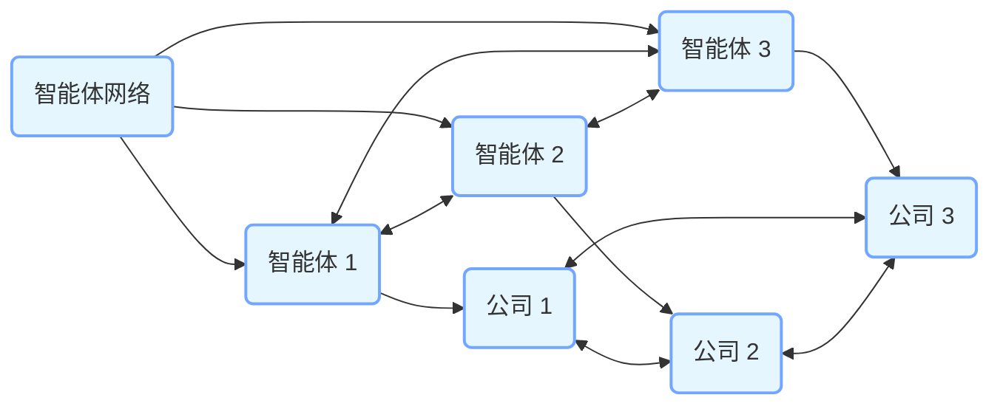

# 利用智能体网络分析公司间的隐藏关联风险

> 关键词：智能体网络、公司间关联风险、风险分析、复杂网络、人工智能

> 摘要：本文聚焦于利用智能体网络来分析公司间的隐藏关联风险。随着商业环境的日益复杂，公司之间的关联关系愈发隐蔽，传统的风险分析方法往往难以全面识别潜在风险。智能体网络作为一种新兴的分析工具，能够模拟公司之间的交互行为，挖掘隐藏的关联信息。文章首先介绍了相关背景，包括目的、预期读者等内容；接着阐述了智能体网络的核心概念与联系，通过文本示意图和 Mermaid 流程图进行直观展示；详细讲解了核心算法原理及具体操作步骤，并给出 Python 源代码；深入分析了数学模型和公式；通过项目实战给出代码实际案例及详细解释；探讨了实际应用场景；推荐了相关的工具和资源；最后总结了未来发展趋势与挑战，并对常见问题进行了解答，同时提供了扩展阅读和参考资料。

## 1. 背景介绍 
### 1.1 目的和范围
在当今全球化的商业环境中，公司之间的联系日益紧密，形成了复杂的商业网络。这些联系不仅包括直接的股权关系、业务合作关系，还存在许多隐藏的关联，如共同的供应商、客户群体、行业影响等。这些隐藏关联可能会在某些情况下引发连锁反应，导致一家公司的风险迅速传播到其他相关公司，从而对整个商业生态系统造成影响。

本研究的目的是利用智能体网络这一先进技术，全面分析公司间的隐藏关联风险。通过构建智能体网络模型，模拟公司之间的交互行为，挖掘潜在的关联信息，为企业管理者、投资者和监管机构提供更准确、全面的风险评估依据，以便他们能够及时采取措施，降低风险损失。

本研究的范围涵盖了各种类型的公司，包括上市公司、非上市公司，涉及不同行业和领域。研究重点在于分析公司间的隐藏关联风险，不涉及公司内部的具体运营风险。

### 1.2 预期读者
本文的预期读者包括以下几类人群：
1. **企业管理者**：企业管理者可以通过本文了解如何利用智能体网络分析公司间的隐藏关联风险，从而更好地制定企业战略，防范潜在风险，保障企业的稳定发展。
2. **投资者**：投资者在进行投资决策时，需要全面了解投资对象及其相关公司的风险状况。本文提供的分析方法和工具可以帮助投资者更准确地评估投资风险，做出更明智的投资决策。
3. **监管机构**：监管机构负责维护市场的稳定和健康发展，需要及时发现和防范系统性风险。利用智能体网络分析公司间的隐藏关联风险，可以为监管机构提供更有效的监管手段，提高监管效率。
4. **研究人员**：对于从事复杂网络、人工智能、风险管理等领域研究的人员，本文可以提供新的研究思路和方法，促进相关领域的学术研究。

### 1.3 文档结构概述
本文的文档结构如下：
1. **背景介绍**：介绍研究的目的、范围、预期读者和文档结构概述，让读者对本文的研究背景有一个全面的了解。
2. **核心概念与联系**：阐述智能体网络、公司间关联风险等核心概念，通过文本示意图和 Mermaid 流程图展示它们之间的联系，帮助读者建立起清晰的概念框架。
3. **核心算法原理 & 具体操作步骤**：详细讲解用于分析公司间隐藏关联风险的核心算法原理，并给出具体的操作步骤，同时提供 Python 源代码进行详细阐述。
4. **数学模型和公式 & 详细讲解 & 举例说明**：建立数学模型，推导相关公式，并通过具体例子进行详细说明，使读者能够深入理解算法的数学原理。
5. **项目实战：代码实际案例和详细解释说明**：通过实际项目案例，展示如何利用智能体网络分析公司间的隐藏关联风险，包括开发环境搭建、源代码详细实现和代码解读。
6. **实际应用场景**：探讨智能体网络在分析公司间隐藏关联风险方面的实际应用场景，为读者提供实际应用的参考。
7. **工具和资源推荐**：推荐相关的学习资源、开发工具框架和论文著作，帮助读者进一步深入学习和研究。
8. **总结：未来发展趋势与挑战**：总结本文的研究成果，分析未来的发展趋势和面临的挑战，为读者提供前瞻性的思考。
9. **附录：常见问题与解答**：对读者可能关心的常见问题进行解答，帮助读者更好地理解本文的内容。
10. **扩展阅读 & 参考资料**：提供相关的扩展阅读材料和参考资料，方便读者进一步深入研究。

### 1.4 术语表
#### 1.4.1 核心术语定义
1. **智能体（Agent）**：智能体是具有自主决策能力的实体，能够感知环境信息，并根据自身的目标和规则做出决策和行动。在本文中，智能体代表公司，能够感知其他公司的状态和行为，并根据自身的策略与其他公司进行交互。
2. **智能体网络（Agent Network）**：智能体网络是由多个智能体相互连接形成的网络结构。在公司间关联风险分析中，智能体网络模拟了公司之间的关联关系，通过智能体之间的交互来挖掘隐藏的关联信息。
3. **公司间关联风险**：公司间关联风险是指由于公司之间的关联关系而导致的风险传播和扩散。这种关联关系可能是直接的，如股权关系、业务合作关系；也可能是间接的，如共同的供应商、客户群体等。
4. **风险传播**：风险传播是指一家公司的风险通过关联关系传递到其他相关公司的过程。在智能体网络中，风险传播表现为智能体之间的状态变化和信息传递。

#### 1.4.2 相关概念解释
1. **复杂网络**：复杂网络是一种由大量节点和连接组成的网络结构，具有复杂的拓扑结构和动力学特性。智能体网络可以看作是一种复杂网络，其中智能体是节点，智能体之间的交互关系是连接。
2. **人工智能**：人工智能是研究如何使计算机系统具有智能行为的学科。在本文中，人工智能技术用于智能体的决策和学习，使智能体能够根据环境信息和历史数据做出更合理的决策。
3. **风险管理**：风险管理是指识别、评估和应对风险的过程。利用智能体网络分析公司间的隐藏关联风险是风险管理的一种新方法，旨在提高风险识别的准确性和及时性。

#### 1.4.3 缩略词列表
1. **AI**：Artificial Intelligence，人工智能
2. **ML**：Machine Learning，机器学习
3. **NN**：Neural Network，神经网络

## 2. 核心概念与联系 
### 核心概念原理
#### 智能体
智能体是智能体网络的基本组成单元，它具有自主性、反应性、社会性和适应性等特点。在公司间关联风险分析中，每个公司可以看作一个智能体。智能体具有以下属性和行为：
- **属性**：包括公司的财务状况、市场竞争力、业务类型等。这些属性可以通过各种数据来源进行获取和量化。
- **行为**：智能体可以感知其他智能体的状态和行为，并根据自身的策略与其他智能体进行交互。例如，当一个公司感知到与其有业务合作关系的另一个公司出现财务危机时，它可能会调整自己的业务策略，减少与该公司的合作。

#### 智能体网络
智能体网络是由多个智能体相互连接形成的网络结构。智能体之间的连接可以表示公司之间的关联关系，如股权关系、业务合作关系、供应链关系等。智能体网络的拓扑结构和动力学特性对公司间关联风险的传播和扩散具有重要影响。

#### 公司间关联风险
公司间关联风险是由于公司之间的关联关系而导致的风险传播和扩散。这种关联关系可以分为直接关联和间接关联。直接关联是指公司之间存在直接的业务往来或股权关系；间接关联是指公司之间通过共同的供应商、客户群体、行业影响等因素产生的关联。

### 架构的文本示意图
```plaintext
               ┌───────────────┐
               │  智能体网络  │
               └───────────────┘
                      │
                      │  包含
                      ▼
┌─────────────┐ ┌─────────────┐ ┌─────────────┐
│  智能体 1   │ │  智能体 2   │ │  智能体 3   │
└─────────────┘ └─────────────┘ └─────────────┘
     │            │            │
     │  关联关系  │  关联关系  │  关联关系
     ▼            ▼            ▼
┌─────────────┐ ┌─────────────┐ ┌─────────────┐
│  公司 1    │ │  公司 2    │ │  公司 3    │
└─────────────┘ └─────────────┘ └─────────────┘
```

### Mermaid 流程图


## 3. 核心算法原理 & 具体操作步骤 
### 核心算法原理
本研究采用基于智能体的建模方法来分析公司间的隐藏关联风险。核心算法的基本思想是通过模拟智能体之间的交互行为，挖掘公司之间的隐藏关联信息，并评估关联风险的传播和扩散。

具体来说，算法包括以下几个步骤：
1. **智能体初始化**：为每个智能体（公司）设置初始属性，如财务状况、市场竞争力等。
2. **关联关系建立**：根据公司之间的实际关联情况，建立智能体之间的连接关系，形成智能体网络。
3. **智能体交互**：智能体根据自身的策略和感知到的环境信息，与其他智能体进行交互。交互过程中，智能体可以传递信息、调整自身状态等。
4. **风险传播模拟**：模拟风险在智能体网络中的传播过程。当一个智能体（公司）出现风险时，通过关联关系将风险传递给其他相关智能体。
5. **风险评估**：根据智能体的状态变化和风险传播情况，评估公司间的关联风险。

### 具体操作步骤
#### 步骤 1：数据收集
收集公司的相关数据，包括财务数据、业务数据、股权结构数据等。这些数据可以从公开的财务报表、行业报告、企业数据库等渠道获取。

#### 步骤 2：智能体初始化
根据收集到的数据，为每个智能体（公司）设置初始属性。例如，可以用财务指标（如资产负债率、利润率等）来表示公司的财务状况，用市场份额来表示公司的市场竞争力。

#### 步骤 3：关联关系建立
分析公司之间的关联情况，建立智能体之间的连接关系。关联关系可以分为直接关联和间接关联。直接关联可以通过股权关系、业务合作关系等确定；间接关联可以通过共同的供应商、客户群体等因素来确定。

#### 步骤 4：智能体交互规则制定
为智能体制定交互规则，规定智能体在不同情况下的行为。例如，当一个智能体感知到与其有业务合作关系的另一个智能体出现财务危机时，它可以选择减少与该智能体的合作，或者增加自身的风险储备。

#### 步骤 5：风险传播模拟
模拟风险在智能体网络中的传播过程。可以采用蒙特卡罗模拟方法，多次随机模拟风险事件的发生和传播，以得到更准确的风险评估结果。

#### 步骤 6：风险评估
根据智能体的状态变化和风险传播情况，评估公司间的关联风险。可以采用风险指标（如风险概率、风险损失等）来衡量关联风险的大小。

### Python 源代码详细阐述
```python
import numpy as np
import networkx as nx

# 步骤 1：智能体初始化
class Agent:
    def __init__(self, id, financial_status, market_competitiveness):
        self.id = id
        self.financial_status = financial_status
        self.market_competitiveness = market_competitiveness
        self.risk = 0  # 初始风险为 0

    def update_risk(self, new_risk):
        self.risk = new_risk

# 步骤 2：关联关系建立
def build_network(agents, connections):
    G = nx.Graph()
    for agent in agents:
        G.add_node(agent.id, agent=agent)
    for connection in connections:
        G.add_edge(connection[0], connection[1])
    return G

# 步骤 3：智能体交互和风险传播模拟
def simulate_risk_spread(G, initial_risk_agent_id, risk_factor):
    # 初始化初始风险智能体
    initial_agent = G.nodes[initial_risk_agent_id]['agent']
    initial_agent.update_risk(risk_factor)

    # 模拟风险传播
    risk_agents = [initial_agent]
    while risk_agents:
        current_agent = risk_agents.pop(0)
        neighbors = G.neighbors(current_agent.id)
        for neighbor_id in neighbors:
            neighbor_agent = G.nodes[neighbor_id]['agent']
            if neighbor_agent.risk == 0:
                # 风险传播规则：根据关联强度传播风险
                neighbor_agent.update_risk(current_agent.risk * 0.5)
                risk_agents.append(neighbor_agent)

    return G

# 步骤 4：风险评估
def evaluate_risk(G):
    total_risk = 0
    for node in G.nodes():
        agent = G.nodes[node]['agent']
        total_risk += agent.risk
    return total_risk

# 示例使用
if __name__ == "__main__":
    # 初始化智能体
    agents = [
        Agent(0, 0.8, 0.7),
        Agent(1, 0.6, 0.5),
        Agent(2, 0.7, 0.6),
        Agent(3, 0.9, 0.8)
    ]

    # 关联关系
    connections = [(0, 1), (1, 2), (2, 3)]

    # 建立网络
    G = build_network(agents, connections)

    # 模拟风险传播
    initial_risk_agent_id = 0
    risk_factor = 0.5
    G = simulate_risk_spread(G, initial_risk_agent_id, risk_factor)

    # 风险评估
    total_risk = evaluate_risk(G)
    print(f"Total risk: {total_risk}")
```

## 4. 数学模型和公式 & 详细讲解 & 举例说明 
### 数学模型
我们可以将智能体网络看作一个图 $G=(V, E)$，其中 $V$ 是节点集合，代表智能体（公司）；$E$ 是边集合，代表智能体之间的关联关系。每个节点 $i \in V$ 有一个属性向量 $\mathbf{x}_i$，表示该智能体的状态，如财务状况、市场竞争力等。每条边 $(i, j) \in E$ 有一个权重 $w_{ij}$，表示节点 $i$ 和节点 $j$ 之间的关联强度。

风险传播过程可以用一个动态系统来描述。设 $r_i(t)$ 表示节点 $i$ 在时间 $t$ 的风险值，初始时刻 $t = 0$ 时，部分节点可能存在初始风险。风险传播规则可以表示为：

$$r_i(t + 1) = r_i(t) + \sum_{j \in N(i)} w_{ij} \cdot r_j(t) \cdot f(\mathbf{x}_i, \mathbf{x}_j)$$

其中，$N(i)$ 是节点 $i$ 的邻居节点集合，$f(\mathbf{x}_i, \mathbf{x}_j)$ 是一个函数，用于描述节点 $i$ 和节点 $j$ 之间的风险传播影响，它可以根据节点的属性向量 $\mathbf{x}_i$ 和 $\mathbf{x}_j$ 来确定。

### 详细讲解
- **节点风险更新公式**：节点 $i$ 在时间 $t + 1$ 的风险值 $r_i(t + 1)$ 由两部分组成：一部分是节点 $i$ 在时间 $t$ 的风险值 $r_i(t)$；另一部分是从其邻居节点传播过来的风险值。邻居节点 $j$ 传播给节点 $i$ 的风险值为 $w_{ij} \cdot r_j(t) \cdot f(\mathbf{x}_i, \mathbf{x}_j)$，其中 $w_{ij}$ 是边 $(i, j)$ 的权重，表示关联强度；$r_j(t)$ 是邻居节点 $j$ 在时间 $t$ 的风险值；$f(\mathbf{x}_i, \mathbf{x}_j)$ 是一个影响函数，用于考虑节点属性对风险传播的影响。

- **影响函数 $f(\mathbf{x}_i, \mathbf{x}_j)$**：影响函数 $f(\mathbf{x}_i, \mathbf{x}_j)$ 可以根据具体情况进行定义。例如，可以考虑节点的财务状况、市场竞争力等因素。如果节点 $i$ 的财务状况较好，可能对邻居节点传播过来的风险有一定的抵御能力，此时 $f(\mathbf{x}_i, \mathbf{x}_j)$ 的值可以较小；反之，如果节点 $i$ 的财务状况较差，可能更容易受到邻居节点风险的影响，此时 $f(\mathbf{x}_i, \mathbf{x}_j)$ 的值可以较大。

### 举例说明
假设我们有一个简单的智能体网络，包含三个节点 $A$、$B$、$C$，节点之间的关联关系和初始风险情况如下：
- 节点 $A$ 的初始风险 $r_A(0) = 0.5$，节点 $B$ 和节点 $C$ 的初始风险 $r_B(0) = r_C(0) = 0$。
- 边 $(A, B)$ 的权重 $w_{AB} = 0.6$，边 $(B, C)$ 的权重 $w_{BC} = 0.8$。
- 影响函数 $f(\mathbf{x}_i, \mathbf{x}_j) = 1$（为了简化计算，假设不考虑节点属性对风险传播的影响）。

根据风险传播公式，我们可以计算节点在不同时间的风险值：

- **时间 $t = 1$**：
  - 节点 $A$ 的风险值 $r_A(1) = r_A(0) = 0.5$。
  - 节点 $B$ 的风险值 $r_B(1) = r_B(0) + w_{AB} \cdot r_A(0) \cdot f(\mathbf{x}_B, \mathbf{x}_A) = 0 + 0.6 \times 0.5 \times 1 = 0.3$。
  - 节点 $C$ 的风险值 $r_C(1) = r_C(0) = 0$。

- **时间 $t = 2$**：
  - 节点 $A$ 的风险值 $r_A(2) = r_A(1) = 0.5$。
  - 节点 $B$ 的风险值 $r_B(2) = r_B(1) = 0.3$。
  - 节点 $C$ 的风险值 $r_C(2) = r_C(1) + w_{BC} \cdot r_B(1) \cdot f(\mathbf{x}_C, \mathbf{x}_B) = 0 + 0.8 \times 0.3 \times 1 = 0.24$。

通过不断迭代计算，我们可以得到节点在不同时间的风险值，从而评估风险的传播情况。

## 5. 项目实战：代码实际案例和详细解释说明 
### 5.1  开发环境搭建
#### 安装 Python
首先，需要安装 Python 环境。建议使用 Python 3.7 及以上版本。可以从 Python 官方网站（https://www.python.org/downloads/）下载适合你操作系统的安装包，然后按照安装向导进行安装。

#### 安装必要的库
本项目需要使用以下几个 Python 库：
- **NumPy**：用于数值计算。
- **NetworkX**：用于构建和分析图结构。

可以使用以下命令来安装这些库：
```sh
pip install numpy networkx
```

### 5.2  源代码详细实现和代码解读
```python
import numpy as np
import networkx as nx

# 步骤 1：智能体初始化
class Agent:
    def __init__(self, id, financial_status, market_competitiveness):
        self.id = id
        self.financial_status = financial_status
        self.market_competitiveness = market_competitiveness
        self.risk = 0  # 初始风险为 0

    def update_risk(self, new_risk):
        self.risk = new_risk

# 步骤 2：关联关系建立
def build_network(agents, connections):
    G = nx.Graph()
    for agent in agents:
        G.add_node(agent.id, agent=agent)
    for connection in connections:
        G.add_edge(connection[0], connection[1])
    return G

# 步骤 3：智能体交互和风险传播模拟
def simulate_risk_spread(G, initial_risk_agent_id, risk_factor):
    # 初始化初始风险智能体
    initial_agent = G.nodes[initial_risk_agent_id]['agent']
    initial_agent.update_risk(risk_factor)

    # 模拟风险传播
    risk_agents = [initial_agent]
    while risk_agents:
        current_agent = risk_agents.pop(0)
        neighbors = G.neighbors(current_agent.id)
        for neighbor_id in neighbors:
            neighbor_agent = G.nodes[neighbor_id]['agent']
            if neighbor_agent.risk == 0:
                # 风险传播规则：根据关联强度传播风险
                neighbor_agent.update_risk(current_agent.risk * 0.5)
                risk_agents.append(neighbor_agent)

    return G

# 步骤 4：风险评估
def evaluate_risk(G):
    total_risk = 0
    for node in G.nodes():
        agent = G.nodes[node]['agent']
        total_risk += agent.risk
    return total_risk

# 示例使用
if __name__ == "__main__":
    # 初始化智能体
    agents = [
        Agent(0, 0.8, 0.7),
        Agent(1, 0.6, 0.5),
        Agent(2, 0.7, 0.6),
        Agent(3, 0.9, 0.8)
    ]

    # 关联关系
    connections = [(0, 1), (1, 2), (2, 3)]

    # 建立网络
    G = build_network(agents, connections)

    # 模拟风险传播
    initial_risk_agent_id = 0
    risk_factor = 0.5
    G = simulate_risk_spread(G, initial_risk_agent_id, risk_factor)

    # 风险评估
    total_risk = evaluate_risk(G)
    print(f"Total risk: {total_risk}")
```

### 代码解读与分析
#### 智能体类 `Agent`
- `__init__` 方法：初始化智能体的属性，包括 `id`、`financial_status`、`market_competitiveness` 和 `risk`。
- `update_risk` 方法：用于更新智能体的风险值。

#### 关联关系建立函数 `build_network`
- 该函数接受智能体列表 `agents` 和关联关系列表 `connections` 作为输入。
- 使用 `networkx` 库创建一个无向图 `G`，并将智能体作为节点添加到图中，同时将关联关系作为边添加到图中。

#### 风险传播模拟函数 `simulate_risk_spread`
- 该函数接受图 `G`、初始风险智能体的 `id` 和风险因子 `risk_factor` 作为输入。
- 首先将初始风险智能体的风险值设置为 `risk_factor`。
- 然后使用队列 `risk_agents` 来模拟风险传播过程，当队列不为空时，取出队首智能体，将其风险传播给其邻居智能体（如果邻居智能体的风险值为 0）。

#### 风险评估函数 `evaluate_risk`
- 该函数接受图 `G` 作为输入，遍历图中的所有节点，将每个节点对应的智能体的风险值累加起来，得到总风险值。

#### 示例使用部分
- 初始化了 4 个智能体，并定义了它们之间的关联关系。
- 建立了智能体网络。
- 模拟了风险从智能体 0 开始传播的过程。
- 评估了整个网络的总风险值，并将结果打印输出。

## 6. 实际应用场景 
### 企业战略决策
企业管理者可以利用智能体网络分析公司间的隐藏关联风险，从而更好地制定企业战略。例如，当企业计划开展新的业务合作时，可以通过分析合作伙伴及其相关公司的关联风险，评估合作的潜在风险，避免因合作伙伴的风险问题而对自身造成不利影响。

### 投资决策
投资者在进行投资决策时，需要全面了解投资对象及其相关公司的风险状况。利用智能体网络分析公司间的隐藏关联风险，可以帮助投资者更准确地评估投资风险，选择更优质的投资标的。例如，投资者可以分析上市公司与其上下游企业之间的关联风险，判断上市公司的业绩稳定性和发展前景。

### 监管机构监管
监管机构负责维护市场的稳定和健康发展，需要及时发现和防范系统性风险。利用智能体网络分析公司间的隐藏关联风险，可以为监管机构提供更有效的监管手段。例如，监管机构可以通过监测金融机构之间的关联风险，及时发现潜在的金融风险，采取相应的监管措施，防止风险的扩散和蔓延。

### 供应链风险管理
在供应链管理中，企业需要管理与供应商和客户之间的关系，以确保供应链的稳定运行。利用智能体网络分析公司间的隐藏关联风险，可以帮助企业识别供应链中的潜在风险，提前采取措施进行防范。例如，企业可以分析供应商的财务状况和关联风险，评估供应商的稳定性，避免因供应商的问题而导致供应链中断。

## 7. 工具和资源推荐
### 7.1 学习资源推荐
#### 7.1.1 书籍推荐
- 《复杂网络：原理、方法与应用》：本书系统地介绍了复杂网络的基本概念、模型、分析方法和应用领域，对于理解智能体网络的拓扑结构和动力学特性有很大帮助。
- 《人工智能：一种现代的方法》：这是一本经典的人工智能教材，涵盖了人工智能的各个方面，包括智能体建模、机器学习、知识表示等内容，对于学习智能体网络的核心算法和技术有重要参考价值。
- 《风险管理与金融机构》：本书介绍了风险管理的基本概念、方法和技术，以及金融机构在风险管理中的应用，对于理解公司间关联风险的本质和评估方法有很大帮助。

#### 7.1.2 在线课程
- Coursera 上的“Complex Networks”课程：该课程由知名教授授课，系统地介绍了复杂网络的理论和应用，通过在线视频、作业和讨论等方式，帮助学习者深入理解复杂网络的相关知识。
- edX 上的“Artificial Intelligence”课程：这是一门全面的人工智能课程，涵盖了智能体建模、机器学习、自然语言处理等多个领域，通过实际案例和编程实践，帮助学习者掌握人工智能的核心技术。
- Udemy 上的“Risk Management in Finance”课程：该课程专注于金融领域的风险管理，介绍了风险评估、风险度量、风险控制等方法和技术，对于学习公司间关联风险的管理有很大帮助。

#### 7.1.3 技术博客和网站
- arXiv（https://arxiv.org/）：这是一个开放的学术预印本平台，提供了大量关于复杂网络、人工智能、风险管理等领域的最新研究论文，是获取前沿研究成果的重要渠道。
- Medium（https://medium.com/）：Medium 上有许多技术博客，涵盖了各种技术领域，包括智能体网络、人工智能等。通过阅读这些博客，可以了解到最新的技术动态和实践经验。
- Towards Data Science（https://towardsdatascience.com/）：这是一个专注于数据科学和机器学习的技术博客平台，提供了大量关于数据分析、模型构建、算法实现等方面的文章和教程，对于学习智能体网络的数据分析和建模方法有很大帮助。

### 7.2 开发工具框架推荐
#### 7.2.1 IDE和编辑器
- PyCharm：这是一款专业的 Python 集成开发环境（IDE），提供了丰富的代码编辑、调试、版本控制等功能，对于开发基于 Python 的智能体网络分析程序非常方便。
- Jupyter Notebook：Jupyter Notebook 是一个交互式的开发环境，支持多种编程语言，包括 Python。它可以将代码、文本、图表等内容整合在一起，方便进行数据分析和模型实验。
- Visual Studio Code：Visual Studio Code 是一款轻量级的代码编辑器，支持多种编程语言和插件扩展。它具有丰富的代码编辑功能和调试功能，对于开发智能体网络分析程序也非常适用。

#### 7.2.2 调试和性能分析工具
- PDB：PDB 是 Python 自带的调试工具，可以帮助开发者在代码运行过程中进行调试，查看变量的值、执行流程等信息。
- cProfile：cProfile 是 Python 自带的性能分析工具，可以分析代码的执行时间和函数调用情况，帮助开发者找出代码中的性能瓶颈。
- Py-Spy：Py-Spy 是一个轻量级的 Python 性能分析工具，可以在不修改代码的情况下对 Python 程序进行性能分析，提供函数调用栈、执行时间等信息。

#### 7.2.3 相关框架和库
- NetworkX：NetworkX 是一个用于构建、操作和研究复杂网络的 Python 库，提供了丰富的图算法和数据结构，对于构建智能体网络和分析网络拓扑结构非常方便。
- NumPy：NumPy 是一个用于科学计算的 Python 库，提供了高效的多维数组对象和各种数学函数，对于智能体网络的数值计算和数据分析非常有用。
- Pandas：Pandas 是一个用于数据处理和分析的 Python 库，提供了灵活的数据结构和数据操作方法，对于处理和分析公司的相关数据非常方便。

### 7.3 相关论文著作推荐
#### 7.3.1 经典论文
- Watts, D. J., & Strogatz, S. H. (1998). Collective dynamics of ‘small-world’networks. Nature, 393(6684), 440-442. 这篇论文提出了小世界网络模型，揭示了复杂网络中节点之间的短路径特性，对于理解智能体网络的拓扑结构有重要意义。
- Barabási, A. L., & Albert, R. (1999). Emergence of scaling in random networks. Science, 286(5439), 509-512. 这篇论文提出了无标度网络模型，发现了复杂网络中节点度分布的幂律特性，对于研究智能体网络的节点重要性和风险传播有重要参考价值。
- Epstein, J. M., & Axtell, R. (1996). Growing artificial societies: Social science from the bottom up. MIT press. 这本书介绍了基于智能体的建模方法在社会科学中的应用，为利用智能体网络分析公司间关联风险提供了理论基础和方法借鉴。

#### 7.3.2 最新研究成果
- Recent research on risk propagation in complex networks: 近年来，关于复杂网络中风险传播的研究取得了很多新的成果，这些研究主要关注风险传播的机制、影响因素和控制策略等方面。可以通过 arXiv、IEEE Xplore 等学术平台查找相关的研究论文。
- Applications of agent-based modeling in corporate risk analysis: 利用智能体建模方法分析公司风险的研究也在不断发展，涉及到不同行业和领域的风险分析。可以通过查阅相关的学术期刊和会议论文了解最新的研究进展。

#### 7.3.3 应用案例分析
- Case studies of using agent networks to analyze hidden association risks between companies: 一些实际应用案例可以帮助我们更好地理解如何利用智能体网络分析公司间的隐藏关联风险。可以通过查阅商业杂志、行业报告等资料获取相关的应用案例分析。

## 8. 总结：未来发展趋势与挑战
### 未来发展趋势
#### 多源数据融合
未来，智能体网络分析公司间隐藏关联风险将更加注重多源数据的融合。除了传统的财务数据、业务数据外，还将纳入社交媒体数据、物联网数据等，以更全面地了解公司的运营状况和关联关系，提高风险分析的准确性和及时性。

#### 与人工智能技术深度融合
智能体网络将与人工智能技术（如机器学习、深度学习）深度融合。通过机器学习算法可以自动挖掘公司之间的隐藏关联信息，通过深度学习模型可以更准确地预测风险的传播和扩散。

#### 可视化和交互性增强
为了更好地展示公司间的关联关系和风险情况，未来的智能体网络分析工具将更加注重可视化和交互性。用户可以通过直观的图形界面查看公司间的关联网络、风险传播路径等信息，并进行交互式的分析和决策。

#### 跨行业和跨领域应用拓展
智能体网络分析公司间隐藏关联风险的应用将不再局限于金融、商业等领域，而是向更多行业和领域拓展，如医疗、能源、交通等。通过分析不同行业公司之间的关联风险，可以更好地防范系统性风险，保障整个社会经济的稳定发展。

### 挑战
#### 数据质量和隐私问题
多源数据的融合面临着数据质量和隐私问题。不同数据源的数据格式、准确性和完整性可能存在差异，需要进行数据清洗和预处理。同时，在获取和使用数据时，需要保护企业和个人的隐私，遵守相关的法律法规。

#### 模型复杂度和可解释性
随着智能体网络模型的不断复杂，模型的可解释性成为一个重要的挑战。复杂的模型可能能够提供更准确的风险分析结果，但难以理解其决策过程和依据。如何在保证模型准确性的前提下，提高模型的可解释性，是未来需要解决的问题。

#### 计算资源和效率
智能体网络分析涉及到大量的计算和模拟，对计算资源和效率提出了较高的要求。特别是在处理大规模的公司数据和复杂的网络结构时，计算时间和内存消耗可能会成为瓶颈。如何优化算法和模型，提高计算效率，是未来需要研究的方向。

#### 不确定性和动态性处理
公司间的关联关系和风险状况是动态变化的，存在很多不确定性因素。如何在智能体网络模型中有效地处理这些不确定性和动态性，及时更新风险评估结果，是未来面临的挑战之一。

## 9. 附录：常见问题与解答
### 问题 1：智能体网络与传统的风险分析方法有什么区别？
传统的风险分析方法通常基于统计学和概率论，主要关注单个公司的风险评估，难以全面考虑公司之间的关联关系和风险传播。而智能体网络方法通过模拟公司之间的交互行为，能够挖掘隐藏的关联信息，更准确地评估公司间的关联风险，并且可以模拟风险的传播和扩散过程。

### 问题 2：如何确定智能体之间的关联强度？
智能体之间的关联强度可以根据多种因素来确定，如股权关系、业务合作金额、供应链依赖程度等。可以通过对相关数据的分析和量化，为每条关联关系赋予一个合理的权重，作为关联强度的度量。

### 问题 3：智能体网络模型的准确性如何保证？
为了保证智能体网络模型的准确性，需要注意以下几点：
1. **数据质量**：确保收集到的数据准确、完整、可靠。
2. **模型参数调整**：根据实际情况调整模型的参数，如风险传播规则、影响函数等。
3. **模型验证**：使用历史数据对模型进行验证和校准，不断优化模型。
4. **多模型融合**：可以结合多种模型进行风险分析，提高分析结果的准确性和可靠性。

### 问题 4：智能体网络分析公司间关联风险需要具备哪些技术能力？
需要具备以下技术能力：
1. **编程能力**：掌握 Python 等编程语言，能够实现智能体网络模型和相关算法。
2. **数据分析能力**：能够处理和分析公司的相关数据，提取有用的信息。
3. **复杂网络理论知识**：了解复杂网络的基本概念、模型和分析方法，能够构建和分析智能体网络。
4. **人工智能知识**：掌握机器学习、深度学习等人工智能技术，能够应用这些技术优化智能体网络模型。

### 问题 5：智能体网络分析公司间关联风险的应用前景如何？
智能体网络分析公司间关联风险具有广阔的应用前景。在企业战略决策、投资决策、监管机构监管、供应链风险管理等领域都有重要的应用价值。随着技术的不断发展和数据的不断丰富，智能体网络分析方法将在风险管理领域发挥越来越重要的作用。

## 10. 扩展阅读 & 参考资料
### 扩展阅读
- 《复杂》：这本书介绍了复杂系统的基本概念和研究方法，对于理解智能体网络的复杂性和动力学特性有很大帮助。
- 《大数据时代》：探讨了大数据的特点、应用和挑战，对于理解多源数据融合在智能体网络分析中的应用有启示作用。
- 《智能时代》：介绍了人工智能技术的发展和应用，对于了解智能体网络与人工智能技术的融合有一定的参考价值。

### 参考资料
1. NetworkX 官方文档：https://networkx.org/documentation/stable/
2. NumPy 官方文档：https://numpy.org/doc/stable/
3. Pandas 官方文档：https://pandas.pydata.org/docs/
4. 相关学术期刊：如《Complexity》、《Journal of Artificial Societies and Social Simulation》、《Risk Analysis》等。

作者：AI天才研究院/AI Genius Institute & 禅与计算机程序设计艺术 /Zen And The Art of Computer Programming