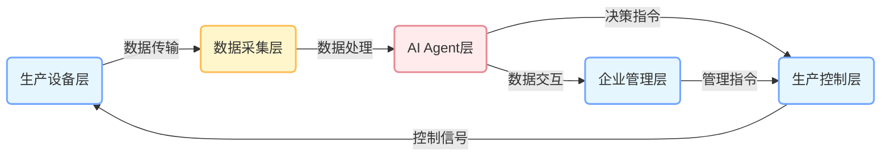

# 制造业中AI Agent的实践案例

> 关键词：制造业、AI Agent、实践案例、智能制造、自动化生产

> 摘要：本文聚焦于制造业中AI Agent的实践案例，深入探讨了AI Agent在该领域的应用。首先介绍了文章的背景信息，包括目的、预期读者、文档结构和相关术语。接着阐述了AI Agent的核心概念及其与制造业的联系，详细讲解了核心算法原理、数学模型和公式，并通过Python代码进行了说明。然后通过实际项目案例展示了AI Agent在制造业中的具体实现和应用。还分析了AI Agent在制造业的实际应用场景，推荐了相关的学习资源、开发工具和论文著作。最后总结了未来发展趋势与挑战，并提供了常见问题解答和扩展阅读参考资料，旨在为读者全面呈现AI Agent在制造业中的应用情况和发展前景。

## 1. 背景介绍 
### 1.1 目的和范围
本文章的目的是深入剖析AI Agent在制造业中的实践案例，揭示其在该领域的应用价值和潜力。通过详细介绍具体案例，分析AI Agent如何解决制造业中的实际问题，提高生产效率、降低成本和提升产品质量。范围涵盖了制造业的多个环节，如生产规划、质量控制、设备维护等，旨在为制造业企业和相关技术人员提供全面的参考和借鉴。

### 1.2 预期读者
预期读者包括制造业企业的管理人员、技术人员、工程师，以及对AI技术在制造业应用感兴趣的研究人员和学生。这些读者希望了解AI Agent在制造业中的实际应用情况，获取相关的技术知识和实践经验，以便在实际工作中进行应用和创新。

### 1.3 文档结构概述
本文将按照以下结构进行阐述：首先介绍AI Agent的核心概念和与制造业的联系，包括其原理和架构；接着详细讲解核心算法原理和具体操作步骤，并给出Python代码示例；然后介绍相关的数学模型和公式，并进行举例说明；通过实际项目案例展示AI Agent在制造业中的具体实现和代码解读；分析AI Agent在制造业的实际应用场景；推荐相关的学习资源、开发工具和论文著作；最后总结未来发展趋势与挑战，提供常见问题解答和扩展阅读参考资料。

### 1.4 术语表
#### 1.4.1 核心术语定义
- **AI Agent（人工智能智能体）**：是一种能够感知环境、自主决策并采取行动以实现特定目标的智能实体。在制造业中，AI Agent可以根据生产环境的信息，自动调整生产策略和参数。
- **智能制造**：是一种基于新一代信息技术，贯穿于设计、生产、管理、服务等制造活动各个环节，具有信息深度自感知、智慧优化自决策、精准控制自执行等功能的先进制造过程、系统与模式的总称。
- **自动化生产**：是指在生产过程中，通过采用自动化设备和控制系统，实现生产过程的自动运行和监控，减少人工干预，提高生产效率和质量。

#### 1.4.2 相关概念解释
- **机器学习**：是一门多领域交叉学科，涉及概率论、统计学、逼近论、凸分析、算法复杂度理论等多门学科。它专门研究计算机怎样模拟或实现人类的学习行为，以获取新的知识或技能，重新组织已有的知识结构使之不断改善自身的性能。在AI Agent中，机器学习用于训练智能体学习环境特征和决策策略。
- **深度学习**：是机器学习的一个分支领域，它是一种基于对数据进行表征学习的方法。深度学习通过构建具有很多层的神经网络模型，自动从大量数据中学习特征和模式，在图像识别、语音识别等领域取得了巨大成功。在制造业中，深度学习可用于质量检测、故障预测等任务。

#### 1.4.3 缩略词列表
- **AI**：Artificial Intelligence，人工智能
- **ML**：Machine Learning，机器学习
- **DL**：Deep Learning，深度学习

## 2. 核心概念与联系 

### 2.1 AI Agent核心概念原理
AI Agent的核心原理基于感知 - 决策 - 行动的循环。智能体首先通过传感器感知环境信息，然后根据内部的决策模型对这些信息进行分析和处理，做出决策，最后通过执行器采取相应的行动。这个过程不断循环，使智能体能够适应环境的变化，实现预定的目标。

例如，在制造业的生产线上，AI Agent可以通过摄像头、传感器等设备感知产品的质量、设备的运行状态等信息。然后，根据这些信息和预先设定的规则或训练好的模型，决定是否需要调整生产参数、进行设备维护或对产品进行分类处理等。

### 2.2 AI Agent与制造业的架构联系
在制造业中，AI Agent可以与生产系统的各个层面进行集成，形成一个多层次的架构。以下是一个典型的架构示意图：



- **生产设备层**：包括各种生产设备，如机床、机器人、传送带等，是实际生产活动的执行层。
- **数据采集层**：负责收集生产设备的运行数据、产品质量数据等信息，并进行初步的处理和存储。
- **AI Agent层**：是整个系统的核心，AI Agent根据采集到的数据进行分析和决策，生成相应的指令。
- **生产控制层**：接收AI Agent的指令，对生产设备进行控制和调整，实现生产过程的自动化。
- **企业管理层**：负责制定生产计划、管理资源和协调各部门之间的工作，与AI Agent进行数据交互，获取生产信息和决策支持。

## 3. 核心算法原理 & 具体操作步骤 

### 3.1 核心算法原理 - 强化学习
在制造业中，AI Agent常用的核心算法之一是强化学习。强化学习是一种通过智能体与环境进行交互，不断尝试不同的行动，并根据环境反馈的奖励信号来学习最优行动策略的算法。

强化学习的基本要素包括：
- **智能体（Agent）**：即AI Agent，负责感知环境、做出决策和采取行动。
- **环境（Environment）**：包括生产设备、生产流程、市场需求等，智能体在环境中进行交互。
- **状态（State）**：描述环境在某一时刻的特征，如设备的运行状态、产品的质量指标等。
- **行动（Action）**：智能体在某一状态下可以采取的操作，如调整生产参数、更换刀具等。
- **奖励（Reward）**：环境对智能体采取的行动给予的反馈，用于评估行动的好坏。智能体的目标是最大化长期累积奖励。

### 3.2 具体操作步骤及Python代码实现
以下是一个简单的强化学习示例，使用OpenAI Gym库模拟一个制造业生产环境，智能体通过学习找到最优的生产策略。

```python
import gym
import numpy as np

# 创建环境
env = gym.make('CartPole-v1')

# 初始化Q表
state_space_size = env.observation_space.shape[0]
action_space_size = env.action_space.n
q_table = np.zeros((state_space_size, action_space_size))

# 超参数设置
learning_rate = 0.1
discount_rate = 0.99
num_episodes = 1000
max_steps_per_episode = 200

# 训练智能体
for episode in range(num_episodes):
    state = env.reset()
    done = False
    for step in range(max_steps_per_episode):
        # 选择行动
        action = np.argmax(q_table[state, :])

        # 执行行动
        new_state, reward, done, info = env.step(action)

        # 更新Q表
        q_table[state, action] = (1 - learning_rate) * q_table[state, action] + \
                                 learning_rate * (reward + discount_rate * np.max(q_table[new_state, :]))

        state = new_state

        if done:
            break

# 测试智能体
state = env.reset()
done = False
total_reward = 0
for step in range(max_steps_per_episode):
    action = np.argmax(q_table[state, :])
    new_state, reward, done, info = env.step(action)
    total_reward += reward
    state = new_state
    if done:
        break

print(f"Total reward in test episode: {total_reward}")

env.close()
```

### 3.3 代码解释
1. **环境创建**：使用`gym.make('CartPole-v1')`创建一个CartPole环境，这是一个简单的控制问题，模拟一个杆子在小车上的平衡。
2. **Q表初始化**：Q表用于存储智能体在不同状态下采取不同行动的价值估计。
3. **超参数设置**：设置学习率、折扣率、训练回合数和每回合的最大步数。
4. **训练过程**：在每个回合中，智能体根据Q表选择行动，执行行动后更新Q表，直到回合结束。
5. **测试过程**：训练完成后，使用训练好的Q表进行测试，计算总奖励。

## 4. 数学模型和公式 & 详细讲解 & 举例说明 

### 4.1 Q学习算法的数学模型
Q学习是一种无模型的强化学习算法，其核心是更新Q表。Q表中的每个元素 $Q(s,a)$ 表示在状态 $s$ 下采取行动 $a$ 的价值估计。

Q学习的更新公式为：
$$Q(s,a) \leftarrow (1 - \alpha)Q(s,a) + \alpha\left[r + \gamma\max_{a'}Q(s',a')\right]$$

其中：
- $Q(s,a)$ 是当前状态 $s$ 下采取行动 $a$ 的Q值。
- $\alpha$ 是学习率，控制新信息对旧Q值的更新程度。
- $r$ 是执行行动 $a$ 后获得的即时奖励。
- $\gamma$ 是折扣率，用于权衡即时奖励和未来奖励的重要性。
- $s'$ 是执行行动 $a$ 后转移到的新状态。
- $\max_{a'}Q(s',a')$ 是在新状态 $s'$ 下所有可能行动的最大Q值。

### 4.2 详细讲解
- **学习率 $\alpha$**：如果 $\alpha$ 接近1，新的经验将对Q值产生较大的影响；如果 $\alpha$ 接近0，Q值的更新将比较缓慢，保留更多的历史信息。
- **折扣率 $\gamma$**：$\gamma$ 越接近1，智能体越关注未来的奖励；$\gamma$ 越接近0，智能体更注重即时奖励。

### 4.3 举例说明
假设在一个制造业生产环境中，智能体处于状态 $s$ 表示设备的温度过高，行动 $a$ 是降低设备的运行速度。执行行动 $a$ 后，获得即时奖励 $r = 10$，转移到新状态 $s'$ 表示设备温度恢复正常。

已知当前 $Q(s,a) = 20$，$\alpha = 0.1$，$\gamma = 0.9$，在新状态 $s'$ 下所有可能行动的最大Q值 $\max_{a'}Q(s',a') = 30$。

根据Q学习更新公式：
$$Q(s,a) = (1 - 0.1) \times 20 + 0.1\times(10 + 0.9\times 30)$$
$$Q(s,a) = 0.9\times 20 + 0.1\times(10 + 27)$$
$$Q(s,a) = 18 + 0.1\times 37$$
$$Q(s,a) = 18 + 3.7$$
$$Q(s,a) = 21.7$$

更新后的 $Q(s,a)$ 为21.7，表明在状态 $s$ 下采取行动 $a$ 的价值有所提高。

## 5. 项目实战：代码实际案例和详细解释说明 

### 5.1  开发环境搭建
- **Python环境**：安装Python 3.7或更高版本。可以从Python官方网站（https://www.python.org/downloads/）下载安装包进行安装。
- **必要的库**：安装OpenAI Gym、NumPy等库。可以使用以下命令进行安装：
```sh
pip install gym numpy
```
- **IDE**：推荐使用PyCharm或Jupyter Notebook，方便代码的编写、调试和运行。

### 5.2  源代码详细实现和代码解读
以下是一个更复杂的制造业生产调度案例，使用Python实现一个基于规则的AI Agent进行生产任务调度。

```python
import random

# 定义生产任务类
class ProductionTask:
    def __init__(self, task_id, processing_time, priority):
        self.task_id = task_id
        self.processing_time = processing_time
        self.priority = priority

# 定义生产设备类
class ProductionEquipment:
    def __init__(self, equipment_id, capacity):
        self.equipment_id = equipment_id
        self.capacity = capacity
        self.current_task = None
        self.remaining_time = 0

    def assign_task(self, task):
        self.current_task = task
        self.remaining_time = task.processing_time

    def process(self):
        if self.current_task is not None:
            self.remaining_time -= 1
            if self.remaining_time == 0:
                completed_task = self.current_task
                self.current_task = None
                return completed_task
        return None

# 定义AI Agent类
class ProductionAgent:
    def __init__(self, equipments):
        self.equipments = equipments

    def schedule_tasks(self, tasks):
        # 按优先级对任务进行排序
        sorted_tasks = sorted(tasks, key=lambda x: x.priority, reverse=True)

        for task in sorted_tasks:
            # 寻找可用的设备
            available_equipments = [eq for eq in self.equipments if eq.capacity >= task.processing_time]
            if available_equipments:
                # 随机选择一个可用设备
                selected_equipment = random.choice(available_equipments)
                selected_equipment.assign_task(task)

# 主程序
if __name__ == "__main__":
    # 创建生产设备
    equipment1 = ProductionEquipment(1, 10)
    equipment2 = ProductionEquipment(2, 8)
    equipments = [equipment1, equipment2]

    # 创建生产任务
    task1 = ProductionTask(1, 5, 2)
    task2 = ProductionTask(2, 3, 1)
    task3 = ProductionTask(3, 7, 3)
    tasks = [task1, task2, task3]

    # 创建AI Agent
    agent = ProductionAgent(equipments)

    # 调度任务
    agent.schedule_tasks(tasks)

    # 模拟生产过程
    completed_tasks = []
    while True:
        all_completed = True
        for equipment in equipments:
            completed_task = equipment.process()
            if completed_task is not None:
                completed_tasks.append(completed_task)
            if equipment.current_task is not None:
                all_completed = False
        if all_completed:
            break

    # 输出完成的任务
    print("Completed tasks:")
    for task in completed_tasks:
        print(f"Task ID: {task.task_id}, Processing Time: {task.processing_time}, Priority: {task.priority}")
```

### 5.3  代码解读与分析
1. **生产任务类（ProductionTask）**：表示一个生产任务，包含任务ID、处理时间和优先级。
2. **生产设备类（ProductionEquipment）**：表示一个生产设备，包含设备ID、容量、当前任务和剩余处理时间。`assign_task` 方法用于分配任务，`process` 方法用于模拟设备的处理过程。
3. **AI Agent类（ProductionAgent）**：负责生产任务的调度。`schedule_tasks` 方法首先按优先级对任务进行排序，然后为每个任务寻找可用的设备并进行分配。
4. **主程序**：创建生产设备和任务，实例化AI Agent，调用 `schedule_tasks` 方法进行任务调度，然后模拟生产过程，直到所有任务完成。最后输出完成的任务信息。

通过这个案例，我们可以看到AI Agent如何根据任务的优先级和设备的容量进行生产任务的调度，提高生产效率。

## 6. 实际应用场景 
### 6.1 生产规划与调度
AI Agent可以根据订单需求、设备状态、原材料供应等信息，自动生成最优的生产计划和调度方案。例如，在汽车制造企业中，AI Agent可以根据不同车型的订单数量和生产工艺要求，合理安排生产线的生产顺序和时间，提高生产效率和设备利用率。

### 6.2 质量控制
利用计算机视觉和机器学习技术，AI Agent可以对生产线上的产品进行实时检测和质量评估。例如，在电子产品制造中，AI Agent可以通过摄像头捕捉产品的图像，分析图像中的缺陷和瑕疵，及时发现不合格产品并进行分类处理，提高产品质量和良品率。

### 6.3 设备维护
AI Agent可以通过监测设备的运行状态和性能指标，预测设备的故障和维护需求。例如，在化工生产企业中，AI Agent可以实时采集设备的温度、压力、振动等数据，运用数据分析和机器学习算法，提前发现设备的潜在故障，及时安排维护人员进行维修，减少设备停机时间和维修成本。

### 6.4 供应链管理
AI Agent可以优化供应链的物流和库存管理。通过分析市场需求、供应商信息和运输成本等因素，AI Agent可以自动调整采购计划和库存水平，确保原材料的及时供应和产品的及时交付。例如，在服装制造企业中，AI Agent可以根据销售数据和市场趋势，预测不同款式服装的需求，合理安排原材料的采购和生产，降低库存积压风险。

## 7. 工具和资源推荐
### 7.1 学习资源推荐
#### 7.1.1 书籍推荐
- 《强化学习：原理与Python实现》：全面介绍了强化学习的基本原理、算法和应用，通过Python代码示例帮助读者理解和实践。
- 《深度学习》：由深度学习领域的三位顶尖专家Ian Goodfellow、Yoshua Bengio和Aaron Courville撰写，是深度学习领域的经典教材，涵盖了深度学习的理论、算法和应用。
- 《人工智能：一种现代的方法》：是人工智能领域的权威教材，全面介绍了人工智能的各个方面，包括搜索算法、知识表示、机器学习、自然语言处理等。

#### 7.1.2 在线课程
- Coursera上的“强化学习专项课程”：由阿尔伯塔大学的Richard Sutton教授等知名学者授课，系统地介绍了强化学习的理论和实践。
- edX上的“深度学习基础”：由DeepLearning.AI提供，由深度学习领域的先驱Andrew Ng教授授课，适合初学者快速入门深度学习。
- 中国大学MOOC上的“人工智能基础”：由国内多所高校的专家联合授课，介绍了人工智能的基本概念、算法和应用。

#### 7.1.3 技术博客和网站
- Towards Data Science：是一个专注于数据科学和人工智能的技术博客平台，上面有很多优秀的技术文章和实践案例。
- OpenAI Blog：OpenAI官方博客，发布了很多关于人工智能前沿技术的研究成果和应用案例。
- AI Time：国内的人工智能领域的资讯平台，提供了丰富的学术报告、技术文章和行业动态。

### 7.2 开发工具框架推荐
#### 7.2.1 IDE和编辑器
- PyCharm：是一款专门为Python开发设计的集成开发环境，具有代码编辑、调试、版本控制等功能，适合大型项目的开发。
- Jupyter Notebook：是一个基于Web的交互式计算环境，支持多种编程语言，方便进行数据探索、模型训练和结果展示。
- Visual Studio Code：是一款轻量级的代码编辑器，具有丰富的插件生态系统，支持多种编程语言和开发场景。

#### 7.2.2 调试和性能分析工具
- TensorBoard：是TensorFlow的可视化工具，可用于监控模型训练过程、可视化模型结构和分析性能指标。
- Py-Spy：是一个用于分析Python程序性能的工具，可以实时查看程序的CPU使用率和函数调用情况。
- cProfile：是Python标准库中的性能分析模块，可以统计程序中各个函数的执行时间和调用次数。

#### 7.2.3 相关框架和库
- TensorFlow：是Google开发的开源深度学习框架，具有高度的灵活性和可扩展性，支持多种深度学习模型的开发和训练。
- PyTorch：是Facebook开发的开源深度学习框架，以其简洁的API和动态计算图而受到广泛关注，适合研究和开发。
- Gym：是OpenAI开发的开源强化学习环境库，提供了丰富的模拟环境，方便进行强化学习算法的实验和测试。

### 7.3 相关论文著作推荐
#### 7.3.1 经典论文
- “Q-Learning”：由Christopher J. C. H. Watkins和Peter Dayan发表，首次提出了Q学习算法，是强化学习领域的经典论文。
- “ImageNet Classification with Deep Convolutional Neural Networks”：由Alex Krizhevsky、Ilya Sutskever和Geoffrey E. Hinton发表，介绍了AlexNet卷积神经网络，开启了深度学习在图像识别领域的热潮。
- “Attention Is All You Need”：由Ashish Vaswani等人发表，提出了Transformer模型，在自然语言处理领域取得了巨大成功。

#### 7.3.2 最新研究成果
- 关注NeurIPS、ICML、CVPR等顶级人工智能学术会议的最新论文，了解AI Agent在制造业和其他领域的最新研究进展。
- 查阅《Journal of Artificial Intelligence Research》、《Artificial Intelligence》等权威学术期刊，获取高质量的研究成果。

#### 7.3.3 应用案例分析
- 一些知名企业和研究机构会发布关于AI Agent在制造业应用的案例报告，如西门子、博世等公司的智能制造案例，以及MIT、斯坦福大学等高校的研究项目案例。可以通过企业官网、学术数据库等渠道获取这些案例资料。

## 8. 总结：未来发展趋势与挑战
### 8.1 未来发展趋势
- **智能化程度不断提高**：随着人工智能技术的不断发展，AI Agent将具备更强的感知、决策和学习能力，能够更加自主地应对复杂的生产环境和任务需求。例如，AI Agent可以通过深度学习算法自动学习生产过程中的复杂模式和规律，实现更精准的生产控制和优化。
- **与物联网、大数据深度融合**：物联网技术可以为AI Agent提供更丰富的生产数据，大数据技术可以对这些数据进行高效的存储和分析。AI Agent与物联网、大数据的深度融合将实现生产过程的全面数字化和智能化，提高生产效率和质量。例如，通过物联网传感器实时采集设备的运行数据，AI Agent可以利用大数据分析技术进行故障预测和预防性维护。
- **多智能体协同合作**：在制造业中，往往需要多个AI Agent协同工作，共同完成生产任务。未来，多智能体系统将得到更广泛的应用，不同类型的AI Agent可以根据各自的优势和任务需求进行分工合作，实现更高效的生产调度和管理。例如，在智能工厂中，生产调度智能体、质量控制智能体和设备维护智能体可以相互协作，共同优化生产过程。

### 8.2 挑战
- **数据安全和隐私问题**：AI Agent在运行过程中需要大量的生产数据，这些数据涉及企业的核心机密和商业隐私。如何保障数据的安全和隐私，防止数据泄露和滥用，是一个亟待解决的问题。例如，在工业互联网环境下，生产数据可能会通过网络传输，容易受到黑客攻击和恶意软件的威胁。
- **算法的可解释性和可靠性**：一些深度学习算法具有很强的黑盒性，其决策过程难以解释。在制造业中，尤其是涉及到安全和质量的关键环节，需要算法具有良好的可解释性和可靠性。例如，在医疗设备制造中，AI Agent的决策结果必须能够被医生和监管机构理解和信任。
- **技术人才短缺**：AI Agent技术的应用需要具备人工智能、机器学习、控制工程等多学科知识的复合型人才。目前，这类人才相对短缺，限制了AI Agent在制造业的推广和应用。企业和高校需要加强合作，培养更多适应智能制造需求的技术人才。

## 9. 附录：常见问题与解答
### 9.1 AI Agent在制造业中的应用成本高吗？
AI Agent在制造业中的应用成本因具体应用场景和规模而异。初期可能需要投入一定的资金用于硬件设备的采购、软件系统的开发和人员培训。但从长期来看，AI Agent可以提高生产效率、降低成本、提升产品质量，带来显著的经济效益。例如，通过优化生产调度，减少设备停机时间和原材料浪费，从而降低生产成本。

### 9.2 AI Agent能否完全替代人工？
目前，AI Agent还不能完全替代人工。虽然AI Agent在某些方面具有优势，如高效的数据处理和精确的决策能力，但在一些复杂的任务中，如创造性设计、灵活的操作和人际交往等方面，人类仍然具有不可替代的作用。在制造业中，通常是AI Agent与人类协同工作，发挥各自的优势，实现最佳的生产效果。

### 9.3 如何评估AI Agent在制造业中的应用效果？
可以从多个方面评估AI Agent在制造业中的应用效果，如生产效率、产品质量、成本控制、设备利用率等。例如，可以比较引入AI Agent前后的生产周期、良品率、生产成本等指标的变化。还可以通过用户反馈和满意度调查来评估AI Agent对生产过程和企业管理的影响。

### 9.4 AI Agent的开发难度大吗？
AI Agent的开发难度取决于具体的应用场景和所采用的技术。对于一些简单的规则-based的AI Agent，开发难度相对较低；而对于基于深度学习和强化学习的复杂AI Agent，开发难度较大，需要具备一定的专业知识和技术能力。但随着开源框架和工具的不断发展，开发AI Agent的门槛正在逐渐降低。

## 10. 扩展阅读 & 参考资料
### 10.1 扩展阅读
- 《智能制造发展战略研究》：深入探讨了智能制造的发展趋势、技术体系和应用案例，对理解AI Agent在制造业中的应用具有重要的参考价值。
- 《工业4.0：正在发生的未来》：介绍了工业4.0的概念、技术和应用，阐述了AI Agent等新兴技术在工业4.0时代的重要作用。
- 《人工智能时代的制造业转型》：分析了人工智能技术对制造业的影响和挑战，提出了制造业企业在人工智能时代的转型策略。

### 10.2 参考资料
- 相关学术论文和研究报告，如IEEE Transactions on Industrial Informatics、ACM Transactions on Intelligent Systems and Technology等期刊上的文章。
- 行业标准和规范，如ISO、IEC等国际标准组织发布的与智能制造相关的标准。
- 企业案例和实践经验分享，如西门子、ABB等公司的智能制造解决方案和应用案例。

作者：AI天才研究院/AI Genius Institute & 禅与计算机程序设计艺术 /Zen And The Art of Computer Programming