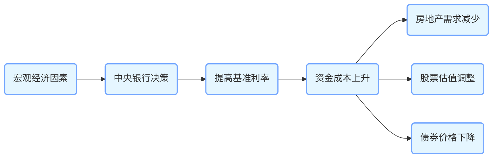

# 加息周期对长期资产的影响分析

> 关键词：加息周期、长期资产、资产价格、经济环境、投资策略

> 摘要：本文旨在深入分析加息周期对长期资产的影响。通过探讨加息周期的形成背景、核心概念，阐述其与长期资产之间的内在联系。详细讲解相关的核心算法原理和数学模型，结合实际案例分析加息周期下长期资产的表现。同时，介绍在该领域可利用的工具和资源，最后总结加息周期下长期资产的未来发展趋势与挑战，并解答常见问题。为投资者和相关研究人员在加息周期中对长期资产的管理和投资决策提供全面的参考。

## 1. 背景介绍 
### 1.1 目的和范围
本次分析的目的在于全面且深入地研究加息周期对长期资产的影响。我们将涵盖多种常见的长期资产，如房地产、股票、债券等，通过综合分析宏观经济数据、金融市场动态以及资产自身特性，探究加息周期在不同阶段对这些长期资产价格、收益和风险的具体影响，为投资者在加息环境下的资产配置和风险管理提供科学依据。

### 1.2 预期读者
本文的预期读者主要包括专业的投资者、金融分析师、经济研究人员以及对金融市场和资产投资感兴趣的普通大众。专业投资者可以借助本文的分析调整投资组合，优化资产配置；金融分析师可将其作为研究参考，为客户提供更精准的投资建议；经济研究人员能够从理论和实证层面获取新的研究视角；普通大众则可以通过本文了解加息周期对自身资产的潜在影响，增强风险意识。

### 1.3 文档结构概述
本文首先介绍背景信息，包括目的、预期读者和文档结构等。接着阐述核心概念与联系，构建清晰的理论框架。然后讲解核心算法原理和具体操作步骤，结合Python代码进行详细说明。之后给出数学模型和公式，并举例说明其应用。再通过项目实战部分展示代码实际案例及详细解释。随后分析实际应用场景，为投资者提供实际参考。接着推荐相关的工具和资源，帮助读者进一步学习和研究。最后进行总结，探讨未来发展趋势与挑战，解答常见问题，并提供扩展阅读和参考资料。

### 1.4 术语表
#### 1.4.1 核心术语定义
- **加息周期**：指中央银行在一段时间内持续提高基准利率的过程。基准利率的上调通常反映了货币政策从宽松向紧缩的转变，旨在抑制通货膨胀、控制经济过热等。
- **长期资产**：是指企业或个人拥有的、预期在较长时间（通常超过一年）内为其带来经济利益的资产。常见的长期资产包括房地产、股票、长期债券、基础设施投资等。
- **资产价格**：指资产在市场上的交易价格，它受到多种因素的影响，如供求关系、宏观经济环境、资产自身的盈利能力等。
- **收益率**：是指投资所获得的收益与投资成本的比率，用于衡量投资的盈利水平。不同类型的长期资产有不同的收益率计算方法，如股票的股息收益率、债券的票面利率等。

#### 1.4.2 相关概念解释
- **货币政策**：是指中央银行为实现特定的经济目标，如稳定物价、促进经济增长、实现充分就业等，而采用的各种调节货币供应量和利率的政策措施。加息是货币政策中的一种紧缩性手段。
- **通货膨胀**：是指物价总水平在一定时期内持续、普遍地上涨。通货膨胀会导致货币贬值，降低实际购买力。加息通常被用作抑制通货膨胀的手段之一。
- **经济周期**：是指经济活动沿着经济发展的总体趋势所经历的有规律的扩张和收缩。加息周期往往与经济周期中的繁荣或过热阶段相关，旨在防止经济过度膨胀。

#### 1.4.3 缩略词列表
- **CPI**：Consumer Price Index，消费者物价指数，用于衡量物价水平的变化，是反映通货膨胀程度的重要指标。
- **GDP**：Gross Domestic Product，国内生产总值，是衡量一个国家或地区经济活动总量的指标。
- **FED**：Federal Reserve System，美国联邦储备系统，简称美联储，是美国的中央银行，其货币政策决策对全球金融市场有重要影响。

## 2. 核心概念与联系 

### 核心概念原理
#### 加息周期原理
加息周期的启动通常是基于宏观经济形势的变化。当经济增长过快，出现通货膨胀压力时，中央银行会采取加息措施。加息的原理在于提高资金的使用成本，抑制投资和消费需求。具体来说，提高基准利率会使商业银行的贷款利率上升，企业和个人的借贷成本增加，从而减少投资和消费行为。例如，企业原本计划进行大规模的固定资产投资，但由于贷款利率上升，投资项目的预期收益可能无法覆盖成本，企业就会推迟或取消投资计划。

#### 长期资产特性原理
不同类型的长期资产具有不同的特性。房地产具有实物资产的属性，其价值受到地理位置、土地稀缺性、人口增长等因素的影响。房地产的投资周期较长，且具有一定的杠杆性，投资者通常会通过银行贷款来购买房产。股票代表了对企业的所有权，其价格波动与企业的盈利能力、行业前景、宏观经济环境等密切相关。股票市场具有较高的流动性和风险性，投资者可以通过买卖股票获取资本利得和股息收入。债券是一种固定收益证券，其收益相对稳定，主要取决于债券的票面利率和到期期限。债券的价格与市场利率呈反向变动关系，当市场利率上升时，债券价格会下降。

### 核心概念架构的文本示意图
```plaintext
加息周期
|
|-- 宏观经济因素（经济增长、通货膨胀等）
|   |
|   |-- 中央银行决策（提高基准利率）
|       |
|       |-- 影响资金成本（借贷利率上升）
|           |
|           |-- 对长期资产的影响
|               |
|               |-- 房地产（需求减少、价格波动）
|               |
|               |-- 股票（企业盈利受影响、估值调整）
|               |
|               |-- 债券（价格下降、收益率上升）
```

### Mermaid 流程图


## 3. 核心算法原理 & 具体操作步骤 

### 债券价格与利率关系的算法原理
债券价格与市场利率之间存在着密切的关系，通常可以用债券定价公式来表示。假设债券的面值为 $F$，票面利率为 $C$，每年付息次数为 $n$，剩余到期年限为 $T$，市场利率为 $r$，则债券的价格 $P$ 可以通过以下公式计算：

$$P = \sum_{t=1}^{nT} \frac{C/F}{n(1 + r/n)^t} + \frac{F}{(1 + r/n)^{nT}}$$

### Python 代码实现
```python
import numpy as np

def bond_price(face_value, coupon_rate, years_to_maturity, market_rate, payments_per_year=1):
    """
    计算债券价格
    :param face_value: 债券面值
    :param coupon_rate: 票面利率
    :param years_to_maturity: 剩余到期年限
    :param market_rate: 市场利率
    :param payments_per_year: 每年付息次数
    :return: 债券价格
    """
    num_payments = years_to_maturity * payments_per_year
    coupon_payment = face_value * coupon_rate / payments_per_year
    discount_rate = market_rate / payments_per_year
    
    # 计算利息的现值
    interest_present_value = np.sum([coupon_payment / (1 + discount_rate) ** i for i in range(1, num_payments + 1)])
    
    # 计算本金的现值
    principal_present_value = face_value / (1 + discount_rate) ** num_payments
    
    # 债券价格等于利息现值和本金现值之和
    bond_price = interest_present_value + principal_present_value
    
    return bond_price

# 示例
face_value = 1000
coupon_rate = 0.05
years_to_maturity = 10
market_rate = 0.06
payments_per_year = 1

price = bond_price(face_value, coupon_rate, years_to_maturity, market_rate, payments_per_year)
print(f"债券价格: {price}")
```
### 具体操作步骤
1. **输入参数**：确定债券的面值、票面利率、剩余到期年限、市场利率和每年付息次数。
2. **计算付息期数**：根据剩余到期年限和每年付息次数计算出总的付息期数。
3. **计算每期利息**：用债券面值乘以票面利率再除以每年付息次数得到每期的利息支付。
4. **计算折现率**：将市场利率除以每年付息次数得到每期的折现率。
5. **计算利息现值**：使用循环计算每期利息的现值，并将它们相加。
6. **计算本金现值**：根据折现率和付息期数计算本金的现值。
7. **计算债券价格**：将利息现值和本金现值相加得到债券的价格。

## 4. 数学模型和公式 & 详细讲解 & 举例说明 

### 债券价格与利率的数学模型
如前面所述，债券价格 $P$ 的计算公式为：

$$P = \sum_{t=1}^{nT} \frac{C/F}{n(1 + r/n)^t} + \frac{F}{(1 + r/n)^{nT}}$$

详细讲解：
- 公式的第一项 $\sum_{t=1}^{nT} \frac{C/F}{n(1 + r/n)^t}$ 表示债券利息的现值之和。其中，$C/F$ 是票面利率，$n$ 是每年付息次数，$t$ 是付息期数，$r$ 是市场利率。每一期的利息支付都需要按照市场利率进行折现，然后将所有期的折现值相加。
- 公式的第二项 $\frac{F}{(1 + r/n)^{nT}}$ 表示债券本金的现值。本金在债券到期时一次性支付，需要按照市场利率折现到当前时刻。

举例说明：
假设债券面值 $F = 1000$ 元，票面利率 $C = 5\%$，每年付息一次（$n = 1$），剩余到期年限 $T = 10$ 年，市场利率 $r = 6\%$。
- 首先计算每年的利息支付：$C/F \times F = 0.05 \times 1000 = 50$ 元。
- 然后计算利息的现值：
  - 第一年利息的现值：$\frac{50}{(1 + 0.06)^1} \approx 47.17$ 元。
  - 第二年利息的现值：$\frac{50}{(1 + 0.06)^2} \approx 44.50$ 元。
  - $\cdots$
  - 第十年利息的现值：$\frac{50}{(1 + 0.06)^{10}} \approx 27.92$ 元。
  - 利息现值之和：$\sum_{t=1}^{10} \frac{50}{(1 + 0.06)^t} \approx 368.00$ 元。
- 最后计算本金的现值：$\frac{1000}{(1 + 0.06)^{10}} \approx 558.39$ 元。
- 债券价格：$P = 368.00 + 558.39 = 926.39$ 元。

### 股票估值的数学模型（股息贴现模型）
股息贴现模型（Dividend Discount Model，DDM）是一种常用的股票估值方法。假设股票每年支付的股息为 $D_t$，市场要求的回报率为 $r$，则股票的内在价值 $V$ 可以表示为：

$$V = \sum_{t=1}^{\infty} \frac{D_t}{(1 + r)^t}$$

详细讲解：
- 该模型的基本思想是将股票未来所有股息的现值相加得到股票的内在价值。$D_t$ 表示第 $t$ 期的股息，$r$ 是市场要求的回报率，反映了投资者对股票投资的风险补偿要求。
- 在实际应用中，通常会对股息的增长情况进行假设。例如，如果股息以固定增长率 $g$ 增长，则模型可以简化为：

$$V = \frac{D_1}{r - g}$$

其中，$D_1$ 是下一期的股息。

举例说明：
假设某股票下一期的股息 $D_1 = 2$ 元，股息增长率 $g = 3\%$，市场要求的回报率 $r = 8\%$。
则股票的内在价值：

$$V = \frac{2}{0.08 - 0.03} = 40$$ 元。

## 5. 项目实战：代码实际案例和详细解释说明 

### 5.1  开发环境搭建
- **Python 安装**：从 Python 官方网站（https://www.python.org/downloads/）下载并安装适合你操作系统的 Python 版本，建议选择 Python 3.7 及以上版本。
- **开发工具**：可以选择使用 PyCharm、Jupyter Notebook 等开发工具。PyCharm 是一款功能强大的 Python 集成开发环境（IDE），适合进行大型项目的开发；Jupyter Notebook 则更适合进行交互式的代码编写和数据分析。
- **必要库安装**：在命令行中使用以下命令安装所需的库：
```bash
pip install numpy pandas matplotlib
```
- `numpy`：用于进行数值计算。
- `pandas`：用于数据处理和分析。
- `matplotlib`：用于数据可视化。

### 5.2  源代码详细实现和代码解读
以下是一个分析加息周期对债券和股票价格影响的 Python 代码示例：

```python
import numpy as np
import pandas as pd
import matplotlib.pyplot as plt

# 债券价格计算函数
def bond_price(face_value, coupon_rate, years_to_maturity, market_rate, payments_per_year=1):
    num_payments = years_to_maturity * payments_per_year
    coupon_payment = face_value * coupon_rate / payments_per_year
    discount_rate = market_rate / payments_per_year
    
    interest_present_value = np.sum([coupon_payment / (1 + discount_rate) ** i for i in range(1, num_payments + 1)])
    principal_present_value = face_value / (1 + discount_rate) ** num_payments
    
    bond_price = interest_present_value + principal_present_value
    return bond_price

# 股票估值函数（股息贴现模型）
def stock_value(next_dividend, required_return, growth_rate):
    return next_dividend / (required_return - growth_rate)

# 模拟加息周期
interest_rates = np.linspace(0.02, 0.1, 10)  # 假设市场利率从 2% 上升到 10%

# 债券参数
face_value = 1000
coupon_rate = 0.05
years_to_maturity = 10
payments_per_year = 1

# 股票参数
next_dividend = 2
growth_rate = 0.03

bond_prices = []
stock_prices = []

for rate in interest_rates:
    # 计算不同利率下的债券价格
    bond_prices.append(bond_price(face_value, coupon_rate, years_to_maturity, rate, payments_per_year))
    
    # 计算不同利率下的股票价格（假设市场要求的回报率等于市场利率）
    stock_prices.append(stock_value(next_dividend, rate, growth_rate))

# 创建 DataFrame 存储数据
data = pd.DataFrame({
    'Interest Rate': interest_rates,
    'Bond Price': bond_prices,
    'Stock Price': stock_prices
})

# 可视化结果
plt.figure(figsize=(12, 6))

plt.subplot(1, 2, 1)
plt.plot(data['Interest Rate'], data['Bond Price'])
plt.title('Bond Price vs Interest Rate')
plt.xlabel('Interest Rate')
plt.ylabel('Bond Price')

plt.subplot(1, 2, 2)
plt.plot(data['Interest Rate'], data['Stock Price'])
plt.title('Stock Price vs Interest Rate')
plt.xlabel('Interest Rate')
plt.ylabel('Stock Price')

plt.tight_layout()
plt.show()
```

### 代码解读与分析
- **函数定义**：
  - `bond_price` 函数用于计算债券价格，根据债券定价公式，输入债券的面值、票面利率、剩余到期年限、市场利率和每年付息次数，返回债券的价格。
  - `stock_value` 函数用于计算股票的内在价值，根据股息贴现模型，输入下一期的股息、市场要求的回报率和股息增长率，返回股票的内在价值。
- **模拟加息周期**：使用 `np.linspace` 函数生成从 2% 到 10% 的 10 个市场利率值，模拟加息周期中市场利率的上升过程。
- **计算资产价格**：遍历不同的市场利率，分别调用 `bond_price` 和 `stock_value` 函数计算债券和股票的价格，并将结果存储在列表中。
- **数据存储和可视化**：使用 `pandas` 的 `DataFrame` 存储市场利率、债券价格和股票价格的数据，然后使用 `matplotlib` 进行可视化，绘制债券价格和股票价格随市场利率变化的曲线。

从可视化结果可以看出，债券价格与市场利率呈反向变动关系，即随着市场利率的上升，债券价格下降；股票价格也受到市场利率的影响，当市场利率上升时，股票的内在价值下降。

## 6. 实际应用场景 
### 房地产市场
在加息周期中，房地产市场通常会受到较大影响。由于购房贷款成本增加，购房者的购买力下降，导致房地产需求减少。对于房地产开发商来说，融资成本上升，可能会放缓开发进度，减少新楼盘的供应。这会使得房地产市场的供需关系发生变化，房价可能会出现调整。例如，在 2004 - 2006 年美国加息周期中，房地产市场泡沫破裂，房价大幅下跌，引发了次贷危机。

### 股票市场
加息周期对股票市场的影响较为复杂。一方面，加息会提高企业的融资成本，压缩企业的利润空间，对企业的盈利能力产生负面影响，从而导致股票价格下跌。另一方面，加息也反映了经济的强劲增长，企业的业绩可能会随着经济的增长而提高，这对股票价格有一定的支撑作用。不同行业对加息的敏感度也不同，例如，金融行业可能会受益于加息，因为贷款利率上升会增加银行的息差收入；而房地产、公用事业等对资金成本较为敏感的行业可能会受到较大冲击。

### 债券市场
债券市场与加息周期的关系较为直接。如前面所述，债券价格与市场利率呈反向变动关系。在加息周期中，市场利率上升，债券价格下降，债券投资者会面临资本损失。因此，投资者在加息周期中可能会减少对债券的投资，转而寻求其他投资机会。不过，对于新发行的债券，由于票面利率会随着市场利率上升而提高，投资者可以获得更高的收益。

### 保险市场
加息周期对保险市场也有一定影响。保险公司的资产配置中通常包含大量的债券，债券价格的下跌会导致保险公司的资产价值下降。同时，加息会提高保险产品的预定利率，使得保险产品的吸引力下降。不过，加息也会增加保险公司的投资收益，因为保险公司可以将新增资金投资于更高收益的债券。

## 7. 工具和资源推荐
### 7.1 学习资源推荐
#### 7.1.1 书籍推荐
- 《货币金融学》（米什金著）：全面介绍了货币、银行、金融市场等方面的知识，对理解加息周期和金融市场的运行机制有很大帮助。
- 《投资学》（博迪著）：系统阐述了投资的基本原理、资产定价模型、投资组合管理等内容，是投资领域的经典教材。
- 《房地产经济学》（奥沙利文著）：深入分析了房地产市场的供需关系、价格形成机制以及政策对房地产市场的影响，有助于了解加息周期对房地产市场的作用。

#### 7.1.2 在线课程
- Coursera 上的“Financial Markets”（耶鲁大学）：由著名经济学家罗伯特·席勒教授授课，讲解金融市场的基本原理、资产定价等内容。
- edX 上的“Investment Management”（麻省理工学院）：介绍投资组合管理、资产配置等方面的知识和技能。
- 中国大学 MOOC 上的“货币银行学”：国内多所高校的教授联合授课，全面讲解货币银行学的基本理论和实践。

#### 7.1.3 技术博客和网站
- 华尔街见闻（https://wallstreetcn.com/）：提供全球金融市场的实时资讯、分析和评论，对加息周期和资产市场的动态有及时的报道。
- 金融界（https://www.jrj.com.cn/）：涵盖股票、基金、债券等多个金融领域的信息，有专业的分析师对市场进行解读。
- 中国人民银行官网（https://www.pbc.gov.cn/）：可以获取中国货币政策的相关信息和数据，了解央行的政策动态和加息决策的背景。

### 7.2 开发工具框架推荐
#### 7.2.1 IDE和编辑器
- PyCharm：功能强大的 Python IDE，具有代码自动补全、调试、版本控制等功能，适合进行数据分析和金融建模。
- Jupyter Notebook：交互式的代码编写和数据分析工具，支持 Markdown 文本和代码的混合编辑，方便进行数据可视化和结果展示。
- Visual Studio Code：轻量级的代码编辑器，支持多种编程语言，有丰富的插件可以扩展功能，适合快速开发和调试。

#### 7.2.2 调试和性能分析工具
- pdb：Python 内置的调试器，可以在代码中设置断点，逐步执行代码，查看变量的值和程序的执行流程。
- cProfile：Python 标准库中的性能分析工具，可以分析代码的运行时间和函数调用次数，帮助找出性能瓶颈。
- Py-Spy：一个简单易用的 Python 性能分析工具，可以实时监控 Python 程序的性能，找出耗时的函数和代码段。

#### 7.2.3 相关框架和库
- Pandas：用于数据处理和分析的 Python 库，提供了高效的数据结构和数据操作方法，适合处理金融数据。
- Numpy：用于进行数值计算的 Python 库，提供了多维数组和各种数学函数，是金融建模的基础库。
- Matplotlib：用于数据可视化的 Python 库，可以绘制各种类型的图表，如折线图、柱状图、散点图等，方便展示金融数据和分析结果。

### 7.3 相关论文著作推荐
#### 7.3.1 经典论文
- "The General Theory of Employment, Interest and Money"（凯恩斯著）：提出了凯恩斯主义的经济理论，对货币政策和宏观经济调控有重要的影响。
- "Efficient Capital Markets: A Review of Theory and Empirical Work"（法玛著）：阐述了有效市场假说，对理解金融市场的效率和资产定价有重要意义。
- "A Theory of the Term Structure of Interest Rates"（莫迪利亚尼和萨奇著）：提出了利率期限结构的理论模型，对债券市场的研究有重要贡献。

#### 7.3.2 最新研究成果
- 可以通过学术数据库如 Web of Science、EconLit 等搜索关于加息周期和长期资产关系的最新研究论文。近年来，一些研究关注了加息周期对新兴市场资产的影响、货币政策的溢出效应等问题。
- 国际货币基金组织（IMF）、世界银行等国际组织的研究报告也会涉及到加息周期和全球金融市场的相关内容。

#### 7.3.3 应用案例分析
- 可以参考一些金融机构的研究报告和案例分析，如高盛、摩根大通等投资银行的研究报告，了解它们在加息周期中的资产配置策略和投资建议。
- 一些专业的金融咨询公司也会发布关于加息周期对不同行业和资产影响的案例分析，为投资者提供实际的参考。

## 8. 总结：未来发展趋势与挑战
### 未来发展趋势
- **利率波动常态化**：随着全球经济的不确定性增加，利率波动可能会成为常态。各国央行会根据经济形势的变化灵活调整货币政策，加息和降息的周期可能会更加频繁和短暂。
- **资产价格分化加剧**：不同类型的长期资产在加息周期中的表现差异会更加明显。一些具有稳定现金流和抗通胀能力的资产，如优质房地产、基础设施投资等，可能会受到投资者的青睐；而一些高估值、高杠杆的资产，如部分新兴科技股、垃圾债券等，可能会面临较大的调整压力。
- **金融科技的应用增加**：金融科技的发展将为投资者提供更多的投资工具和风险管理手段。例如，智能投顾可以根据投资者的风险偏好和市场情况，为其提供个性化的资产配置方案；区块链技术可以提高金融交易的透明度和效率。

### 挑战
- **预测难度加大**：由于经济形势的复杂性和不确定性增加，准确预测加息周期的开始、结束时间和利率上升的幅度变得更加困难。这给投资者的资产配置和风险管理带来了挑战。
- **资产价格波动风险**：加息周期会导致资产价格的波动加剧，投资者可能会面临较大的资本损失。特别是对于一些杠杆率较高的投资者，资产价格的下跌可能会引发连锁反应，导致系统性风险。
- **全球金融市场联动性增强**：在全球化的背景下，各国金融市场的联动性越来越强。一个国家的加息政策可能会对其他国家的金融市场产生溢出效应，增加了全球金融市场的不稳定因素。

## 9. 附录：常见问题与解答
### 问题 1：加息周期一定会导致长期资产价格下跌吗？
不一定。虽然加息通常会对长期资产价格产生负面影响，但不同类型的资产受到的影响程度不同，而且还受到其他因素的综合影响。例如，在经济强劲增长的加息周期中，企业的盈利能力可能会提高，股票价格可能不会下跌反而上涨；房地产市场的供需关系、人口增长等因素也会影响房价的走势。

### 问题 2：在加息周期中，应该如何调整资产配置？
在加息周期中，可以考虑增加一些具有抗通胀和稳定收益的资产，如黄金、优质债券等；减少对高估值、高杠杆资产的投资。同时，可以适当增加现金储备，以应对市场的不确定性。具体的资产配置方案应根据个人的风险偏好、投资目标和财务状况来确定。

### 问题 3：加息周期对不同行业的股票有什么不同影响？
不同行业对加息的敏感度不同。金融行业可能会受益于加息，因为贷款利率上升会增加银行的息差收入；房地产、公用事业等对资金成本较为敏感的行业可能会受到较大冲击；而一些消费类、科技类行业，由于其业绩受经济周期的影响相对较小，可能对加息的反应相对较弱。

### 问题 4：如何判断加息周期的开始和结束？
判断加息周期的开始和结束需要综合考虑多个因素，如宏观经济数据（GDP、CPI 等）、中央银行的货币政策声明、利率走势等。一般来说，当经济增长过快、通货膨胀压力上升时，中央银行可能会开始加息；当经济增长放缓、通货膨胀得到控制时，加息周期可能会结束。但实际情况往往比较复杂，需要持续关注经济和政策的变化。

## 10. 扩展阅读 & 参考资料
### 扩展阅读
- 《金融炼金术》（乔治·索罗斯著）：介绍了索罗斯的投资哲学和金融市场的反身性理论，对理解金融市场的波动和不确定性有很大帮助。
- 《非理性繁荣》（罗伯特·席勒著）：分析了金融市场中的泡沫现象和投资者的非理性行为，对投资决策有一定的启示。
- 《资本的秩序》（张维迎著）：从经济学的角度探讨了资本的配置和经济增长的关系，有助于理解货币政策和资产市场的运行机制。

### 参考资料
- 各国中央银行的官方网站，获取货币政策相关信息和数据。
- 国际货币基金组织（IMF）、世界银行等国际组织的报告和研究成果。
- 金融数据提供商，如 Bloomberg、Wind 等，获取金融市场的实时数据和历史数据。

作者：AI天才研究院/AI Genius Institute & 禅与计算机程序设计艺术 /Zen And The Art of Computer Programming