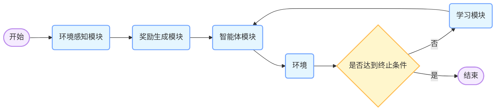

# 动态奖励模型:适应性AI决策的关键

> 关键词：动态奖励模型、适应性AI决策、强化学习、智能体、奖励机制

> 摘要：本文围绕动态奖励模型这一适应性AI决策的关键要素展开深入探讨。首先介绍了相关背景信息，包括目的范围、预期读者等。接着阐述了动态奖励模型的核心概念、原理及架构，给出了清晰的文本示意图和Mermaid流程图。详细讲解了核心算法原理，并用Python源代码进行说明，同时给出了数学模型和公式，并举例解释。通过项目实战展示了代码实现及解读，分析了实际应用场景。还推荐了相关的学习资源、开发工具框架和论文著作。最后总结了未来发展趋势与挑战，提供了常见问题解答及扩展阅读参考资料，旨在为读者全面深入地理解动态奖励模型及其在适应性AI决策中的作用提供参考。

## 1. 背景介绍 
### 1.1 目的和范围
在当今人工智能飞速发展的时代，适应性AI决策成为了众多领域追求的目标。动态奖励模型作为实现适应性AI决策的关键因素，对于提升AI系统的智能水平和决策能力具有重要意义。本文的目的在于深入剖析动态奖励模型的原理、算法、应用等方面，为研究人员、开发者和相关从业者提供全面而深入的知识体系。范围涵盖了动态奖励模型的基本概念、核心算法、数学模型、实际应用案例以及相关的工具和资源推荐等内容。

### 1.2 预期读者
本文预期读者主要包括人工智能领域的研究人员，他们可以从本文中获取动态奖励模型的最新研究进展和理论基础，为进一步的学术研究提供参考；AI开发者，能够借助本文的算法原理和代码示例，将动态奖励模型应用到实际的项目开发中；以及对人工智能感兴趣的爱好者，帮助他们了解适应性AI决策和动态奖励模型的基本概念和应用场景。

### 1.3 文档结构概述
本文将按照以下结构进行组织：首先介绍背景信息，让读者了解文章的目的和适用人群；接着阐述动态奖励模型的核心概念与联系，包括原理和架构；然后详细讲解核心算法原理和具体操作步骤，并用Python代码实现；给出数学模型和公式，并举例说明；通过项目实战展示代码的实际应用和详细解释；分析动态奖励模型的实际应用场景；推荐相关的学习资源、开发工具框架和论文著作；最后总结未来发展趋势与挑战，提供常见问题解答和扩展阅读参考资料。

### 1.4 术语表
#### 1.4.1 核心术语定义
- **动态奖励模型**：一种能够根据环境变化和智能体的行为实时调整奖励机制的模型，用于引导智能体做出更优的决策。
- **适应性AI决策**：AI系统能够根据不同的环境和任务需求，动态调整自身的决策策略，以达到更好的性能表现。
- **智能体（Agent）**：在人工智能中，能够感知环境并采取行动以实现特定目标的实体。
- **强化学习（Reinforcement Learning）**：一种机器学习范式，智能体通过与环境进行交互，根据环境反馈的奖励信号来学习最优的行为策略。

#### 1.4.2 相关概念解释
- **奖励信号**：在强化学习中，环境给予智能体的反馈信息，用于表示智能体的行为是否符合预期，正奖励表示行为得到认可，负奖励表示行为不被鼓励。
- **策略（Policy）**：智能体在给定状态下选择行动的规则，是强化学习中智能体学习的核心内容。
- **状态（State）**：描述环境和智能体当前情况的信息集合，智能体根据当前状态来选择合适的行动。

#### 1.4.3 缩略词列表
- **AI**：Artificial Intelligence，人工智能
- **RL**：Reinforcement Learning，强化学习

## 2. 核心概念与联系 

### 核心概念原理
动态奖励模型的核心原理是在强化学习的框架下，通过实时调整奖励信号来引导智能体的行为。传统的强化学习中，奖励信号通常是固定的，而动态奖励模型会根据环境的变化、智能体的行为历史以及任务的实时需求等因素动态地改变奖励的大小和类型。

例如，在一个机器人导航任务中，传统的奖励模型可能只是在机器人到达目标位置时给予一个固定的正奖励，而在动态奖励模型中，除了到达目标的奖励外，还可以根据机器人的路径规划效率、避免障碍物的能力等因素实时调整奖励。如果机器人选择了一条更短、更安全的路径，就可以给予额外的正奖励；如果机器人频繁碰撞障碍物，则给予负奖励。

### 架构的文本示意图
动态奖励模型的架构主要包括以下几个部分：
1. **环境感知模块**：负责实时获取环境的状态信息，如机器人所处的位置、周围障碍物的分布等。
2. **奖励生成模块**：根据环境感知模块提供的信息、智能体的行为历史以及预设的奖励规则，动态生成奖励信号。
3. **智能体模块**：根据当前的状态和奖励信号，选择合适的行动，并与环境进行交互。
4. **学习模块**：智能体根据奖励信号和环境反馈，不断学习和更新自己的策略。

其文本示意图如下：
环境感知模块 -> 奖励生成模块 -> 智能体模块 -> 环境 -> 学习模块 -> 智能体模块（更新策略）

### Mermaid流程图


## 3. 核心算法原理 & 具体操作步骤 

### 核心算法原理
动态奖励模型通常基于强化学习算法，如Q - learning、Deep Q - Network（DQN）等。这里以Q - learning为例进行讲解。

Q - learning的核心思想是学习一个Q函数 $Q(s, a)$，表示在状态 $s$ 下采取行动 $a$ 的预期累积奖励。智能体通过不断地与环境交互，根据奖励信号更新Q函数的值，从而找到最优的行动策略。

Q函数的更新公式为：
$$Q(s_t, a_t) \leftarrow Q(s_t, a_t) + \alpha [r_{t+1} + \gamma \max_{a} Q(s_{t+1}, a) - Q(s_t, a_t)]$$

其中：
- $s_t$ 是当前状态
- $a_t$ 是当前采取的行动
- $r_{t+1}$ 是采取行动 $a_t$ 后获得的即时奖励
- $s_{t+1}$ 是采取行动 $a_t$ 后转移到的下一个状态
- $\alpha$ 是学习率，控制每次更新的步长
- $\gamma$ 是折扣因子，用于权衡即时奖励和未来奖励的重要性

### 具体操作步骤
1. **初始化**：初始化Q表 $Q(s, a)$，将所有状态 - 行动对的Q值初始化为0。设置学习率 $\alpha$、折扣因子 $\gamma$ 和探索率 $\epsilon$。
2. **环境交互**：智能体根据当前状态 $s_t$，使用 $\epsilon$ - 贪心策略选择行动 $a_t$。以 $\epsilon$ 的概率随机选择一个行动，以 $1 - \epsilon$ 的概率选择Q值最大的行动。
3. **执行行动**：智能体执行行动 $a_t$，与环境进行交互，得到即时奖励 $r_{t+1}$ 和下一个状态 $s_{t+1}$。
4. **更新Q表**：根据Q函数的更新公式更新 $Q(s_t, a_t)$ 的值。
5. **状态转移**：将当前状态更新为 $s_{t+1}$。
6. **重复步骤2 - 5**：直到达到终止条件，如达到最大步数或完成任务。

### Python源代码实现
```python
import numpy as np

# 初始化参数
num_states = 10
num_actions = 4
alpha = 0.1
gamma = 0.9
epsilon = 0.1
max_steps = 100

# 初始化Q表
Q = np.zeros((num_states, num_actions))

# 定义环境交互函数
def get_reward(state, action):
    # 这里简单模拟奖励，实际应用中需要根据具体任务设计
    if state == 9 and action == 0:
        return 1
    else:
        return 0

def get_next_state(state, action):
    # 简单模拟状态转移，实际应用中需要根据具体任务设计
    if action == 0 and state < num_states - 1:
        return state + 1
    elif action == 1 and state > 0:
        return state - 1
    else:
        return state

# Q - learning算法
for episode in range(100):
    state = 0
    for step in range(max_steps):
        # 使用epsilon - 贪心策略选择行动
        if np.random.uniform(0, 1) < epsilon:
            action = np.random.choice(num_actions)
        else:
            action = np.argmax(Q[state, :])
        
        # 执行行动，获取奖励和下一个状态
        reward = get_reward(state, action)
        next_state = get_next_state(state, action)
        
        # 更新Q表
        Q[state, action] = Q[state, action] + alpha * (reward + gamma * np.max(Q[next_state, :]) - Q[state, action])
        
        # 状态转移
        state = next_state
        
        if state == 9:
            break
```

## 4. 数学模型和公式 & 详细讲解 & 举例说明 

### 数学模型和公式
在动态奖励模型中，除了前面提到的Q - learning的Q函数更新公式外，还有一些其他重要的数学模型和公式。

#### 贝尔曼方程（Bellman Equation）
贝尔曼方程是强化学习中的核心方程，它描述了最优Q函数的递归关系。对于最优Q函数 $Q^*(s, a)$，有：
$$Q^*(s, a) = \mathbb{E}_{s', r} [r + \gamma \max_{a'} Q^*(s', a') | s, a]$$

其中：
- $\mathbb{E}_{s', r}$ 表示对下一个状态 $s'$ 和奖励 $r$ 的期望
- $\gamma$ 是折扣因子

#### 策略梯度定理（Policy Gradient Theorem）
在基于策略梯度的强化学习算法中，策略梯度定理用于计算策略的梯度，以更新策略参数。策略梯度公式为：
$$\nabla_{\theta} J(\theta) = \mathbb{E}_{\tau \sim \pi_{\theta}} \left[ \sum_{t=0}^{T} \nabla_{\theta} \log \pi_{\theta}(a_t | s_t) G_t \right]$$

其中：
- $\theta$ 是策略的参数
- $J(\theta)$ 是策略的性能指标
- $\tau$ 是一个轨迹，由状态、行动和奖励序列组成
- $\pi_{\theta}(a_t | s_t)$ 是在状态 $s_t$ 下采取行动 $a_t$ 的概率
- $G_t$ 是从时间步 $t$ 开始的累积折扣奖励

### 详细讲解
#### 贝尔曼方程
贝尔曼方程的核心思想是，在状态 $s$ 下采取行动 $a$ 的最优Q值等于即时奖励 $r$ 加上下一个状态 $s'$ 的最优Q值的折扣期望。通过不断迭代求解贝尔曼方程，可以得到最优的Q函数，进而得到最优的策略。

#### 策略梯度定理
策略梯度定理表明，策略的梯度可以通过计算每个时间步的对数策略概率的梯度与累积折扣奖励的乘积的期望来得到。通过沿着策略梯度的方向更新策略参数，可以逐步提高策略的性能。

### 举例说明
#### 贝尔曼方程举例
考虑一个简单的迷宫问题，智能体在迷宫中移动，目标是到达出口。假设迷宫有4个状态 $s_1, s_2, s_3, s_4$，出口在状态 $s_4$。智能体有2个行动 $a_1$（向右移动）和 $a_2$（向下移动）。当智能体到达出口时，获得奖励1，否则奖励为0。

假设折扣因子 $\gamma = 0.9$，在状态 $s_3$ 下采取行动 $a_1$ 可以到达状态 $s_4$。则根据贝尔曼方程：
$$Q^*(s_3, a_1) = 1 + 0.9 \max_{a'} Q^*(s_4, a')$$

由于到达出口后任务结束，$Q^*(s_4, a') = 0$，所以 $Q^*(s_3, a_1) = 1$。

#### 策略梯度定理举例
假设一个智能体在一个简单的游戏中，有两个行动 $a_1$ 和 $a_2$，策略 $\pi_{\theta}(a_1 | s) = \frac{e^{\theta_1}}{\ e^{\theta_1}+e^{\theta_2}}$，$\pi_{\theta}(a_2 | s) = \frac{e^{\theta_2}}{\ e^{\theta_1}+e^{\theta_2}}$。

在一个轨迹中，智能体在某个状态 $s$ 下选择了行动 $a_1$，并获得了累积折扣奖励 $G = 5$。则根据策略梯度定理，策略参数 $\theta_1$ 的梯度为：
$$\nabla_{\theta_1} J(\theta) = \frac{e^{\theta_1}}{\ e^{\theta_1}+e^{\theta_2}} \times 5$$

## 5. 项目实战：代码实际案例和详细解释说明 

### 5.1  开发环境搭建
本项目实战使用Python进行开发，需要安装以下库：
- **NumPy**：用于数值计算和数组操作。
- **Matplotlib**：用于可视化结果。

可以使用以下命令进行安装：
```bash
pip install numpy matplotlib
```

### 5.2  源代码详细实现和代码解读
以下是一个基于动态奖励模型的简单机器人导航项目的源代码：
```python
import numpy as np
import matplotlib.pyplot as plt

# 定义环境参数
grid_size = 5
start_state = (0, 0)
goal_state = (4, 4)
obstacles = [(2, 2), (3, 2)]

# 初始化Q表
num_states = grid_size * grid_size
num_actions = 4  # 上、下、左、右
Q = np.zeros((num_states, num_actions))

# 定义参数
alpha = 0.1
gamma = 0.9
epsilon = 0.1
max_episodes = 1000
max_steps = 100

# 状态转换函数
def state_to_index(state):
    return state[0] * grid_size + state[1]

def index_to_state(index):
    return (index // grid_size, index % grid_size)

# 动作函数
def get_next_state(state, action):
    x, y = state
    if action == 0 and x > 0:  # 上
        new_state = (x - 1, y)
    elif action == 1 and x < grid_size - 1:  # 下
        new_state = (x + 1, y)
    elif action == 2 and y > 0:  # 左
        new_state = (x, y - 1)
    elif action == 3 and y < grid_size - 1:  # 右
        new_state = (x, y + 1)
    else:
        new_state = state
    if new_state in obstacles:
        new_state = state
    return new_state

# 奖励函数
def get_reward(state, action):
    next_state = get_next_state(state, action)
    if next_state == goal_state:
        return 100
    elif next_state in obstacles:
        return -10
    else:
        return -1

# Q - learning算法
rewards = []
for episode in range(max_episodes):
    state = start_state
    total_reward = 0
    for step in range(max_steps):
        state_index = state_to_index(state)
        # 使用epsilon - 贪心策略选择行动
        if np.random.uniform(0, 1) < epsilon:
            action = np.random.choice(num_actions)
        else:
            action = np.argmax(Q[state_index, :])
        
        # 执行行动，获取奖励和下一个状态
        reward = get_reward(state, action)
        next_state = get_next_state(state, action)
        next_state_index = state_to_index(next_state)
        
        # 更新Q表
        Q[state_index, action] = Q[state_index, action] + alpha * (reward + gamma * np.max(Q[next_state_index, :]) - Q[state_index, action])
        
        # 状态转移
        state = next_state
        total_reward += reward
        
        if state == goal_state:
            break
    
    rewards.append(total_reward)

# 可视化结果
plt.plot(rewards)
plt.xlabel('Episode')
plt.ylabel('Total Reward')
plt.title('Q - learning Training')
plt.show()
```

### 代码解读与分析
#### 环境定义
- `grid_size` 定义了网格世界的大小。
- `start_state` 和 `goal_state` 分别表示机器人的起始位置和目标位置。
- `obstacles` 列表存储了障碍物的位置。

#### Q表初始化
`Q` 是一个二维数组，用于存储每个状态 - 行动对的Q值。

#### 状态转换函数
`state_to_index` 和 `index_to_state` 函数用于在状态的坐标表示和索引表示之间进行转换。

#### 动作函数
`get_next_state` 函数根据当前状态和选择的行动，计算下一个状态，并考虑了障碍物的影响。

#### 奖励函数
`get_reward` 函数根据当前状态和行动，计算即时奖励。到达目标位置给予100的奖励，碰到障碍物给予 - 10的奖励，其他情况给予 - 1的奖励。

#### Q - learning算法
在每个回合中，智能体根据 $\epsilon$ - 贪心策略选择行动，执行行动后更新Q表，直到达到最大步数或到达目标位置。

#### 可视化结果
使用 `Matplotlib` 库绘制每个回合的总奖励曲线，直观地展示训练过程。

## 6. 实际应用场景 
### 游戏领域
在游戏中，动态奖励模型可以用于训练智能体（如游戏角色）的行为策略。例如，在实时策略游戏中，智能体需要根据不同的游戏局势（如资源数量、敌方兵力分布等）做出决策，动态奖励模型可以根据智能体的决策效果（如是否成功占领资源点、是否击败敌方单位等）实时调整奖励，从而引导智能体学习到更优的策略。

### 自动驾驶领域
在自动驾驶中，动态奖励模型可以帮助车辆根据不同的路况和交通规则做出合理的决策。例如，当车辆遇到交通拥堵时，动态奖励模型可以根据车辆的行驶速度、油耗等因素调整奖励，鼓励车辆选择更合适的路线和行驶方式。同时，在遇到紧急情况（如突然出现的行人）时，动态奖励模型可以给予车辆及时的负奖励，促使车辆采取紧急制动等措施。

### 金融投资领域
在金融投资中，动态奖励模型可以用于优化投资策略。投资者可以将市场的各种信息（如股票价格、利率等）作为状态，将不同的投资决策（如买入、卖出、持有等）作为行动，动态奖励模型根据投资的收益和风险等因素动态调整奖励，帮助投资者学习到更优的投资策略。

### 医疗领域
在医疗领域，动态奖励模型可以用于辅助医生制定治疗方案。医生可以将患者的病情、身体状况等信息作为状态，将不同的治疗方法作为行动，动态奖励模型根据患者的治疗效果（如康复速度、并发症发生率等）动态调整奖励，帮助医生选择更合适的治疗方案。

## 7. 工具和资源推荐
### 7.1 学习资源推荐
#### 7.1.1 书籍推荐
- 《Reinforcement Learning: An Introduction》（《强化学习：原理与Python实现》）：这是一本强化学习领域的经典教材，详细介绍了强化学习的基本概念、算法和应用，对于理解动态奖励模型的基础非常有帮助。
- 《Deep Reinforcement Learning Hands-On》（《深度强化学习实战》）：本书侧重于深度强化学习的实践，通过大量的代码示例和实际项目，帮助读者掌握深度强化学习算法在实际应用中的使用，包括动态奖励模型的应用。

#### 7.1.2 在线课程
- Coursera上的“Reinforcement Learning Specialization”：由知名教授授课，提供了系统的强化学习课程，包括动态奖励模型的相关内容。
- edX上的“Introduction to Artificial Intelligence”：该课程涵盖了人工智能的多个方面，其中包括强化学习和动态奖励模型的基础知识。

#### 7.1.3 技术博客和网站
- OpenAI Blog：OpenAI发布的技术博客，经常分享强化学习和动态奖励模型的最新研究成果和应用案例。
- Medium上的AI相关博客：有很多作者分享关于动态奖励模型的技术文章和实践经验。

### 7.2 开发工具框架推荐
#### 7.2.1 IDE和编辑器
- PyCharm：一款功能强大的Python集成开发环境，提供了代码编辑、调试、版本控制等功能，适合开发基于Python的动态奖励模型项目。
- Jupyter Notebook：交互式的开发环境，方便进行代码编写、实验和结果展示，非常适合用于动态奖励模型的研究和开发。

#### 7.2.2 调试和性能分析工具
- TensorBoard：用于可视化深度学习模型的训练过程和性能指标，在使用深度强化学习算法实现动态奖励模型时，可以使用TensorBoard来监控训练过程。
- cProfile：Python内置的性能分析工具，可以帮助开发者找出代码中的性能瓶颈，优化动态奖励模型的实现。

#### 7.2.3 相关框架和库
- OpenAI Gym：一个用于开发和比较强化学习算法的工具包，提供了各种不同的环境，方便开发者测试和验证动态奖励模型的性能。
- Stable Baselines：基于TensorFlow和PyTorch的强化学习库，提供了多种预训练的强化学习算法，方便开发者快速实现动态奖励模型。

### 7.3 相关论文著作推荐
#### 7.3.1 经典论文
- “Q - learning” by Watkins and Dayan：这是Q - learning算法的经典论文，详细介绍了Q - learning的原理和算法实现，是理解动态奖励模型中基于Q - learning方法的基础。
- “Policy Gradient Methods for Reinforcement Learning with Function Approximation” by Sutton et al.：该论文提出了策略梯度方法，为基于策略梯度的动态奖励模型提供了理论基础。

#### 7.3.2 最新研究成果
- 在NeurIPS、ICML等顶级机器学习会议上，每年都会有关于动态奖励模型的最新研究成果发表，这些论文反映了该领域的最新研究动态和技术趋势。
- 在Journal of Artificial Intelligence Research（JAIR）等期刊上，也会有高质量的关于动态奖励模型的研究论文。

#### 7.3.3 应用案例分析
- 一些行业报告和研究机构的论文会分析动态奖励模型在不同领域的应用案例，如麦肯锡关于金融领域应用动态奖励模型优化投资策略的报告，对于了解实际应用场景和效果非常有帮助。

## 8. 总结：未来发展趋势与挑战
### 未来发展趋势
#### 与深度学习的深度融合
随着深度学习技术的不断发展，动态奖励模型将与深度学习更加紧密地结合。通过使用深度神经网络来近似Q函数或策略函数，可以处理更复杂的状态和行动空间，提高动态奖励模型的性能和适应性。

#### 多智能体系统中的应用
在多智能体系统中，动态奖励模型可以用于协调多个智能体之间的行为。例如，在自动驾驶场景中，多辆车辆可以通过动态奖励模型进行协作，共同优化交通流量。未来，动态奖励模型在多智能体系统中的应用将越来越广泛。

#### 自适应奖励设计
未来的动态奖励模型将更加注重自适应奖励设计，能够根据不同的任务和环境自动调整奖励机制。例如，在一个复杂的工业生产场景中，动态奖励模型可以根据生产任务的变化和设备状态的实时反馈，自动调整奖励规则，提高生产效率。

### 挑战
#### 奖励工程难题
设计合理的奖励机制是动态奖励模型的关键，但也是一个难题。不合理的奖励机制可能导致智能体学习到错误的策略，出现过拟合或陷入局部最优解等问题。如何设计出既能引导智能体学习到最优策略，又具有通用性和可扩展性的奖励机制，是未来需要解决的重要问题。

#### 计算资源需求
随着动态奖励模型与深度学习的融合，模型的复杂度和计算量不断增加。训练和运行这些模型需要大量的计算资源，如GPU集群等。如何在有限的计算资源下提高模型的训练效率和性能，是一个挑战。

#### 安全性和可靠性
在一些关键应用领域，如自动驾驶和医疗领域，动态奖励模型的安全性和可靠性至关重要。模型的错误决策可能导致严重的后果。如何保证动态奖励模型在复杂环境下的安全性和可靠性，是未来需要研究的重要方向。

## 9. 附录：常见问题与解答
### 1. 动态奖励模型与传统奖励模型有什么区别？
传统奖励模型的奖励信号通常是固定的，不随环境和智能体的行为变化而改变。而动态奖励模型能够根据环境的实时状态、智能体的行为历史以及任务的需求等因素动态地调整奖励信号，从而更灵活地引导智能体学习到更优的策略。

### 2. 如何设计合理的动态奖励机制？
设计合理的动态奖励机制需要考虑多个因素。首先，要明确任务的目标，奖励机制应该能够引导智能体朝着目标前进。其次，要考虑环境的特点和智能体的行为空间，奖励信号应该能够反映智能体的行为对环境的影响。此外，还可以通过实验和调试来优化奖励机制，避免出现奖励稀疏或奖励不合理的问题。

### 3. 动态奖励模型在实际应用中可能会遇到哪些问题？
在实际应用中，动态奖励模型可能会遇到奖励工程难题，如奖励设计不合理导致智能体学习到错误的策略；计算资源需求大，训练和运行模型需要大量的计算资源；安全性和可靠性问题，模型的错误决策可能导致严重的后果。

### 4. 如何评估动态奖励模型的性能？
可以使用多种指标来评估动态奖励模型的性能，如累积奖励、任务完成率、策略的稳定性等。累积奖励反映了智能体在一个回合或多个回合中获得的总奖励，任务完成率表示智能体完成任务的比例，策略的稳定性表示智能体在不同环境下策略的一致性。

## 10. 扩展阅读 & 参考资料
### 扩展阅读
- 《Artificial Intelligence: A Modern Approach》（《人工智能：一种现代的方法》）：本书涵盖了人工智能的多个领域，包括强化学习和动态奖励模型的相关内容，对于拓宽知识面非常有帮助。
- 《Hands - on Machine Learning with Scikit - Learn, Keras, and TensorFlow》（《利用Python进行机器学习实战》）：书中介绍了机器学习的各种算法和工具，包括强化学习的实现，适合进一步深入学习动态奖励模型的实践应用。

### 参考资料
- Watkins, C. J. C. H., & Dayan, P. (1992). Q - learning. Machine learning, 8(3 - 4), 279 - 292.
- Sutton, R. S., McAllester, D. A., Singh, S. P., & Mansour, Y. (2000). Policy gradient methods for reinforcement learning with function approximation. In Advances in neural information processing systems (pp. 1057 - 1063).

作者：AI天才研究院/AI Genius Institute & 禅与计算机程序设计艺术 /Zen And The Art of Computer Programming