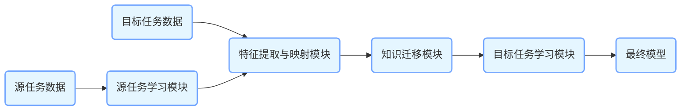

# 动态环境推理中概念迁移学习模型的应用研究

> 关键词：动态环境推理、概念迁移学习模型、知识迁移、机器学习、人工智能

> 摘要：本文聚焦于动态环境推理中概念迁移学习模型的应用研究。随着人工智能和机器学习技术的发展，在动态变化的环境中实现高效准确的推理成为重要研究方向。概念迁移学习模型能够将已有的知识和经验迁移到新的任务和环境中，有效提升模型在动态环境下的适应性和泛化能力。文章详细介绍了概念迁移学习模型的核心概念、算法原理、数学模型，通过项目实战展示其具体实现和应用，探讨了实际应用场景，推荐了相关工具和资源，并对未来发展趋势与挑战进行了总结，旨在为该领域的研究和应用提供全面深入的参考。

## 1. 背景介绍 
### 1.1 目的和范围
在当今复杂多变的现实环境中，许多任务和场景都处于动态变化之中，例如自动驾驶中的交通环境变化、金融市场的波动等。传统的机器学习模型往往是针对特定的静态环境进行训练，当环境发生变化时，模型的性能会显著下降。概念迁移学习模型的出现为解决这一问题提供了有效的途径。本研究的目的在于深入探讨概念迁移学习模型在动态环境推理中的应用原理、方法和效果，研究范围涵盖了从基础理论到实际应用的各个方面，包括模型的核心概念、算法实现、数学模型以及在不同领域的具体应用案例。

### 1.2 预期读者
本文预期读者包括从事人工智能、机器学习、模式识别等相关领域的研究人员、工程师和学生。对于希望了解动态环境推理和概念迁移学习模型的技术爱好者，以及对相关领域应用有兴趣的企业从业者也具有一定的参考价值。

### 1.3 文档结构概述
本文首先介绍背景知识，包括研究目的、预期读者和文档结构概述等内容。接着阐述概念迁移学习模型的核心概念与联系，通过文本示意图和 Mermaid 流程图进行详细说明。然后讲解核心算法原理和具体操作步骤，并使用 Python 源代码进行详细阐述。随后介绍数学模型和公式，结合具体例子进行详细讲解。通过项目实战展示代码实际案例和详细解释说明。探讨实际应用场景，推荐相关工具和资源。最后总结未来发展趋势与挑战，提供常见问题与解答以及扩展阅读和参考资料。

### 1.4 术语表
#### 1.4.1 核心术语定义
- **动态环境推理**：指在不断变化的环境中，通过对各种信息的分析和处理，得出合理结论和决策的过程。
- **概念迁移学习模型**：一种机器学习模型，旨在将从一个或多个源任务中学习到的知识和概念迁移到目标任务中，以提高目标任务的学习效率和性能。
- **知识迁移**：将在一个领域或任务中获得的知识、经验和技能应用到另一个领域或任务中的过程。
- **泛化能力**：模型在未见过的数据上表现出的性能，即模型能够从训练数据中学习到普遍规律，并应用到新的数据上的能力。

#### 1.4.2 相关概念解释
- **源任务**：是指已经有大量数据和知识的任务，模型可以从这些任务中学习到有用的信息和模式。
- **目标任务**：是指需要应用迁移学习的新任务，模型的目标是利用从源任务中迁移过来的知识来提高在目标任务上的性能。
- **特征空间**：是指用于表示数据的特征集合，不同的任务可能具有不同的特征空间，迁移学习需要解决特征空间不匹配的问题。

#### 1.4.3 缩略词列表
- **ML**：Machine Learning，机器学习
- **AI**：Artificial Intelligence，人工智能
- **TL**：Transfer Learning，迁移学习

## 2. 核心概念与联系 

### 核心概念原理
概念迁移学习模型的核心思想是利用已有的知识和经验来加速和改进新任务的学习。在动态环境推理中，环境的变化可能导致数据分布发生改变，传统的机器学习模型需要重新进行大量的训练才能适应新的环境。而概念迁移学习模型可以通过迁移已有的概念和知识，减少对新数据的依赖，快速适应环境的变化。

其基本原理是通过在源任务和目标任务之间寻找相似性，将源任务中学习到的有用信息迁移到目标任务中。这种相似性可以体现在数据特征、任务结构、语义信息等多个方面。例如，在图像识别任务中，不同类别的图像可能具有相似的纹理、边缘等特征，通过迁移这些特征可以提高模型对新类别图像的识别能力。

### 架构的文本示意图
概念迁移学习模型的架构主要包括以下几个部分：

1. **源任务学习模块**：负责从源任务的数据中学习知识和模式，通常采用传统的机器学习算法进行训练。
2. **特征提取与映射模块**：从源任务和目标任务的数据中提取特征，并将它们映射到一个共同的特征空间中，以解决特征空间不匹配的问题。
3. **知识迁移模块**：将源任务中学习到的知识和模式迁移到目标任务中，可以通过参数共享、特征加权等方式实现。
4. **目标任务学习模块**：利用迁移过来的知识和目标任务的数据进行训练，得到最终的模型。

### Mermaid 流程图


## 3. 核心算法原理 & 具体操作步骤 

### 核心算法原理
概念迁移学习模型的核心算法主要包括基于实例的迁移学习、基于特征的迁移学习和基于模型的迁移学习等。下面以基于特征的迁移学习为例进行详细介绍。

基于特征的迁移学习的基本思想是通过寻找源任务和目标任务之间的共同特征，将源任务的特征表示迁移到目标任务中。具体来说，首先需要从源任务和目标任务的数据中提取特征，然后通过某种方法将这些特征映射到一个共同的特征空间中，使得在这个特征空间中源任务和目标任务的数据具有相似的分布。最后，利用迁移后的特征进行目标任务的学习。

### 具体操作步骤
1. **数据预处理**：对源任务和目标任务的数据进行清洗、归一化等预处理操作，以提高数据的质量和可用性。
2. **特征提取**：使用合适的特征提取方法，如主成分分析（PCA）、线性判别分析（LDA）等，从源任务和目标任务的数据中提取特征。
3. **特征映射**：将源任务和目标任务的特征映射到一个共同的特征空间中，可以使用核方法、深度神经网络等技术实现。
4. **知识迁移**：将源任务中学习到的知识和模式迁移到目标任务中，可以通过参数共享、特征加权等方式实现。
5. **目标任务学习**：利用迁移后的特征和目标任务的数据进行训练，得到最终的模型。

### Python 源代码详细阐述
以下是一个简单的基于特征的迁移学习的 Python 示例代码：

```python
import numpy as np
from sklearn.decomposition import PCA
from sklearn.linear_model import LogisticRegression

# 生成源任务和目标任务的数据
# 源任务数据
X_source = np.random.randn(100, 10)
y_source = np.random.randint(0, 2, 100)

# 目标任务数据
X_target = np.random.randn(50, 10)
y_target = np.random.randint(0, 2, 50)

# 数据预处理
# 这里简单地进行归一化处理
X_source = (X_source - np.mean(X_source, axis=0)) / np.std(X_source, axis=0)
X_target = (X_target - np.mean(X_target, axis=0)) / np.std(X_target, axis=0)

# 特征提取
pca = PCA(n_components=5)
X_source_pca = pca.fit_transform(X_source)
X_target_pca = pca.transform(X_target)

# 知识迁移（这里简单地使用源任务的特征表示）
X_target_transferred = X_target_pca

# 目标任务学习
model = LogisticRegression()
model.fit(X_target_transferred, y_target)

# 预测
y_pred = model.predict(X_target_transferred)
print("预测结果:", y_pred)
```

在这个示例中，我们首先生成了源任务和目标任务的数据，然后对数据进行了归一化处理。接着使用主成分分析（PCA）进行特征提取，将源任务和目标任务的数据映射到一个低维的特征空间中。最后，使用逻辑回归模型进行目标任务的学习和预测。

## 4. 数学模型和公式 & 详细讲解 & 举例说明 

### 数学模型和公式
在基于特征的迁移学习中，一个重要的数学模型是最大均值差异（Maximum Mean Discrepancy，MMD）。MMD 用于衡量两个分布之间的差异，通过最小化源任务和目标任务在特征空间中的 MMD，可以使得它们的数据分布更加相似。

MMD 的定义如下：

设 $X = \{x_1, x_2, \cdots, x_n\}$ 是源任务的数据，$Y = \{y_1, y_2, \cdots, y_m\}$ 是目标任务的数据，$\phi$ 是特征映射函数，则 MMD 可以表示为：

$$MMD^2(X, Y) = \left\|\frac{1}{n}\sum_{i=1}^{n}\phi(x_i) - \frac{1}{m}\sum_{j=1}^{m}\phi(y_j)\right\|^2$$

### 详细讲解
MMD 的核心思想是通过比较两个分布在特征空间中的均值差异来衡量它们之间的相似性。如果两个分布的 MMD 值越小，说明它们在特征空间中的分布越相似。在迁移学习中，我们的目标是找到一个合适的特征映射函数 $\phi$，使得源任务和目标任务的 MMD 值最小。

### 举例说明
假设我们有两个一维的数据集 $X = \{1, 2, 3\}$ 和 $Y = \{4, 5, 6\}$，我们选择线性特征映射函数 $\phi(x) = x$，则：

$$\frac{1}{3}\sum_{i=1}^{3}\phi(x_i) = \frac{1 + 2 + 3}{3} = 2$$

$$\frac{1}{3}\sum_{j=1}^{3}\phi(y_j) = \frac{4 + 5 + 6}{3} = 5$$

$$MMD^2(X, Y) = \left\|2 - 5\right\|^2 = 9$$

可以看到，这两个数据集的 MMD 值较大，说明它们的分布差异较大。如果我们通过某种方法找到一个合适的特征映射函数，使得它们的 MMD 值变小，就可以实现更好的迁移学习效果。

## 5. 项目实战：代码实际案例和详细解释说明 

### 5.1  开发环境搭建
本项目实战使用 Python 语言进行开发，需要安装以下必要的库：

- **NumPy**：用于数值计算和数组操作。
- **Scikit-learn**：提供了丰富的机器学习算法和工具。
- **TensorFlow** 或 **PyTorch**：用于深度学习模型的开发和训练。

可以使用以下命令进行安装：

```sh
pip install numpy scikit-learn tensorflow
```

### 5.2  源代码详细实现和代码解读
以下是一个基于深度学习的概念迁移学习的项目实战代码：

```python
import tensorflow as tf
from tensorflow.keras.datasets import mnist
from tensorflow.keras.models import Sequential
from tensorflow.keras.layers import Dense, Flatten
from tensorflow.keras.utils import to_categorical

# 加载源任务数据（MNIST 手写数字识别）
(train_images, train_labels), (test_images, test_labels) = mnist.load_data()

# 数据预处理
train_images = train_images / 255.0
test_images = test_images / 255.0
train_labels = to_categorical(train_labels)
test_labels = to_categorical(test_labels)

# 构建源任务模型
source_model = Sequential([
    Flatten(input_shape=(28, 28)),
    Dense(128, activation='relu'),
    Dense(10, activation='softmax')
])

# 编译源任务模型
source_model.compile(optimizer='adam',
                     loss='categorical_crossentropy',
                     metrics=['accuracy'])

# 训练源任务模型
source_model.fit(train_images, train_labels, epochs=5, batch_size=64)

# 评估源任务模型
test_loss, test_acc = source_model.evaluate(test_images, test_labels)
print(f"源任务模型准确率: {test_acc}")

# 模拟目标任务数据（对 MNIST 数据进行简单变换）
target_train_images = train_images + 0.1 * np.random.randn(*train_images.shape)
target_test_images = test_images + 0.1 * np.random.randn(*test_images.shape)

# 迁移学习：使用源任务模型的部分层
target_model = Sequential()
for layer in source_model.layers[:-1]:
    target_model.add(layer)
    layer.trainable = False  # 冻结源任务模型的层

# 添加新的输出层
target_model.add(Dense(10, activation='softmax'))

# 编译目标任务模型
target_model.compile(optimizer='adam',
                     loss='categorical_crossentropy',
                     metrics=['accuracy'])

# 训练目标任务模型
target_model.fit(target_train_images, train_labels, epochs=5, batch_size=64)

# 评估目标任务模型
target_test_loss, target_test_acc = target_model.evaluate(target_test_images, test_labels)
print(f"目标任务模型准确率: {target_test_acc}")
```

### 5.3  代码解读与分析
1. **数据加载与预处理**：使用 `mnist.load_data()` 加载 MNIST 手写数字识别数据集，并对数据进行归一化处理和标签的 one-hot 编码。
2. **源任务模型构建与训练**：构建一个简单的全连接神经网络作为源任务模型，使用交叉熵损失函数和 Adam 优化器进行训练。
3. **目标任务数据模拟**：对 MNIST 数据进行简单的变换，模拟目标任务的数据。
4. **迁移学习**：将源任务模型的部分层添加到目标任务模型中，并冻结这些层的参数，然后添加一个新的输出层。
5. **目标任务模型训练与评估**：使用目标任务的数据对目标任务模型进行训练，并评估其准确率。

通过这个项目实战，我们可以看到概念迁移学习模型可以利用源任务的知识来提高目标任务的学习效率和性能。

## 6. 实际应用场景 
### 自动驾驶
在自动驾驶中，环境是动态变化的，不同的道路、天气和交通状况都会对自动驾驶系统的性能产生影响。概念迁移学习模型可以将在一种环境中学习到的驾驶经验和知识迁移到其他环境中，提高自动驾驶系统的适应性和安全性。例如，在晴天环境中训练的模型可以将其知识迁移到雨天环境中，减少在新环境中重新训练的时间和成本。

### 金融市场预测
金融市场是一个高度动态和复杂的环境，市场行情随时都在变化。概念迁移学习模型可以将在历史数据中学习到的市场规律和模式迁移到新的市场环境中，帮助投资者做出更准确的预测和决策。例如，将在股票市场中学习到的模型迁移到期货市场中，提高对期货价格走势的预测能力。

### 医疗诊断
在医疗诊断中，不同的患者和疾病可能具有相似的症状和病理特征。概念迁移学习模型可以将在一种疾病或患者群体中学习到的诊断知识和经验迁移到其他疾病或患者群体中，提高医疗诊断的准确性和效率。例如，将在肺癌诊断中学习到的模型迁移到乳腺癌诊断中，帮助医生更快地做出诊断。

### 智能客服
智能客服需要处理各种不同类型的用户问题和需求，用户的语言和问题类型也在不断变化。概念迁移学习模型可以将在一种领域或场景中学习到的问答知识和模式迁移到其他领域或场景中，提高智能客服的服务质量和响应速度。例如，将在电商领域中学习到的智能客服模型迁移到金融领域中，为用户提供更好的服务。

## 7. 工具和资源推荐
### 7.1 学习资源推荐
#### 7.1.1 书籍推荐
- 《机器学习》（周志华）：全面介绍了机器学习的基本概念、算法和应用，是机器学习领域的经典教材。
- 《深度学习》（Ian Goodfellow、Yoshua Bengio 和 Aaron Courville）：深入讲解了深度学习的原理、模型和算法，是深度学习领域的权威著作。
- 《迁移学习》（Qiang Yang 和 Yang Liu）：专门介绍了迁移学习的理论、方法和应用，是迁移学习领域的重要参考书籍。

#### 7.1.2 在线课程
- Coursera 上的“机器学习”课程（Andrew Ng 教授）：由机器学习领域的知名专家授课，内容全面，讲解详细，是学习机器学习的优秀课程。
- edX 上的“深度学习”课程（由多个知名高校和机构联合推出）：提供了深度学习的系统学习资源，包括视频讲座、作业和实验等。
- 中国大学 MOOC 上的“迁移学习”课程：由国内相关领域的专家授课，介绍了迁移学习的基本概念、算法和应用案例。

#### 7.1.