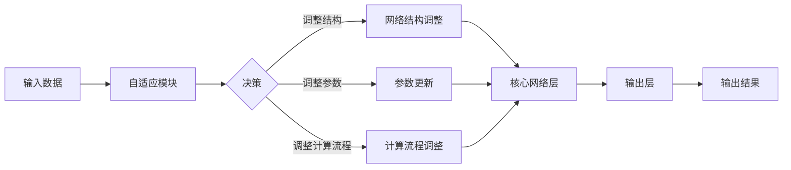

# 动态神经网络:适应性AI架构设计

> 关键词：动态神经网络、适应性AI、架构设计、深度学习、神经网络自适应、计算图动态调整、模型灵活性

> 摘要：本文围绕动态神经网络这一前沿领域展开，深入探讨适应性AI架构设计的相关内容。首先介绍动态神经网络的背景知识，包括其目的、适用读者和文档结构等。接着阐述动态神经网络的核心概念、算法原理及数学模型。通过项目实战展示动态神经网络在实际中的应用和代码实现。同时列举其实际应用场景，并推荐相关的学习资源、开发工具和论文著作。最后总结动态神经网络的未来发展趋势与挑战，为读者提供全面且深入的动态神经网络技术解读。

## 1. 背景介绍 
### 1.1 目的和范围
动态神经网络旨在设计一种具有自适应能力的AI架构，以应对复杂多变的现实环境和任务需求。传统的静态神经网络在面对不同的数据分布、任务类型或环境变化时，往往表现出一定的局限性。而动态神经网络通过在运行时动态调整网络结构、参数或计算流程，能够更好地适应各种情况，提高模型的性能和泛化能力。

本文的范围涵盖动态神经网络的基本概念、核心算法、数学模型、项目实战、应用场景以及相关的工具和资源推荐等方面。旨在为读者提供一个全面的动态神经网络技术指南，帮助读者理解动态神经网络的原理、实现方法和应用价值。

### 1.2 预期读者
本文预期读者包括但不限于以下几类人群：
- **研究人员**：对人工智能、机器学习和深度学习领域有深入研究兴趣的科研人员，希望了解动态神经网络的最新研究成果和发展趋势。
- **开发者**：从事人工智能相关项目开发的程序员和工程师，希望学习动态神经网络的实现技术和应用方法，以提升项目的性能和创新性。
- **学生**：计算机科学、人工智能、自动化等相关专业的学生，希望通过本文系统学习动态神经网络的知识，为进一步的学习和研究打下基础。
- **技术爱好者**：对人工智能技术充满热情的普通技术爱好者，希望通过本文了解动态神经网络的基本概念和应用场景，拓宽自己的技术视野。

### 1.3 文档结构概述
本文将按照以下结构进行组织：
- **核心概念与联系**：介绍动态神经网络的基本概念、原理和架构，通过文本示意图和Mermaid流程图进行直观展示。
- **核心算法原理 & 具体操作步骤**：详细讲解动态神经网络的核心算法原理，并使用Python源代码进行具体操作步骤的阐述。
- **数学模型和公式 & 详细讲解 & 举例说明**：给出动态神经网络的数学模型和相关公式，并进行详细讲解和举例说明。
- **项目实战：代码实际案例和详细解释说明**：通过一个实际的项目案例，展示动态神经网络的代码实现和详细解释。
- **实际应用场景**：列举动态神经网络在不同领域的实际应用场景。
- **工具和资源推荐**：推荐相关的学习资源、开发工具和论文著作。
- **总结：未来发展趋势与挑战**：总结动态神经网络的未来发展趋势和面临的挑战。
- **附录：常见问题与解答**：解答读者在学习和使用动态神经网络过程中常见的问题。
- **扩展阅读 & 参考资料**：提供相关的扩展阅读材料和参考资料，方便读者进一步深入学习。

### 1.4 术语表
#### 1.4.1 核心术语定义
- **动态神经网络（Dynamic Neural Network）**：一种在运行时能够动态调整网络结构、参数或计算流程的神经网络。
- **适应性AI（Adaptive AI）**：具有自适应能力的人工智能系统，能够根据环境变化和任务需求自动调整自身的行为和性能。
- **计算图（Computation Graph）**：用于表示神经网络计算过程的有向无环图，其中节点表示计算操作，边表示数据流动。
- **网络结构（Network Architecture）**：指神经网络的层结构、连接方式和神经元数量等组成部分。
- **参数（Parameters）**：神经网络中需要学习的变量，如权重和偏置。

#### 1.4.2 相关概念解释
- **静态神经网络（Static Neural Network）**：与动态神经网络相对，其网络结构和参数在训练和推理过程中保持不变。
- **自适应机制（Adaptive Mechanism）**：动态神经网络中用于实现自适应功能的方法和策略，如动态调整网络结构、参数更新策略等。
- **元学习（Meta - Learning）**：一种学习如何学习的方法，通过在多个任务上进行训练，使模型能够快速适应新的任务。

#### 1.4.3 缩略词列表
- **DNN**：Deep Neural Network（深度神经网络）
- **RNN**：Recurrent Neural Network（循环神经网络）
- **CNN**：Convolutional Neural Network（卷积神经网络）
- **LSTM**：Long Short - Term Memory（长短期记忆网络）

## 2. 核心概念与联系 
动态神经网络的核心思想是在运行时根据输入数据、任务需求或环境变化动态调整网络的结构、参数或计算流程，以提高模型的适应性和性能。

### 核心概念原理
传统的静态神经网络在训练前就确定了网络的结构和参数，在整个训练和推理过程中保持不变。而动态神经网络则引入了自适应机制，使其能够在不同的情况下做出相应的调整。

动态神经网络的自适应机制可以基于多种因素进行触发，例如：
- **输入数据特征**：根据输入数据的统计特征、分布情况或语义信息，动态调整网络的结构和参数。
- **任务需求**：根据不同的任务类型和目标，选择合适的网络结构和计算流程。
- **环境变化**：当环境条件发生变化时，如数据分布漂移、噪声干扰等，动态调整网络以适应新的环境。

### 架构的文本示意图
动态神经网络的架构可以分为以下几个主要部分：
- **输入层**：接收原始输入数据。
- **自适应模块**：根据输入数据、任务需求或环境变化，动态调整网络的结构、参数或计算流程。
- **核心网络层**：执行具体的计算任务，如特征提取、分类或回归等。
- **输出层**：输出最终的计算结果。

其文本示意图如下：

输入数据 -> 自适应模块 -> 核心网络层 -> 输出结果

### Mermaid流程图


## 3. 核心算法原理 & 具体操作步骤 
### 核心算法原理
动态神经网络的核心算法主要涉及自适应机制的实现，常见的自适应机制包括动态网络结构调整、动态参数更新和动态计算流程调整等。

#### 动态网络结构调整
动态网络结构调整是指在运行时根据需要增加或减少网络的层数、神经元数量或连接方式。一种常见的方法是基于网络的性能指标（如准确率、损失函数值等）来决定是否进行结构调整。例如，当模型的性能提升缓慢时，可以考虑增加网络的复杂度；当模型出现过拟合时，可以减少网络的复杂度。

#### 动态参数更新
动态参数更新是指根据输入数据的特点和任务需求，动态调整参数的更新策略。例如，在不同的训练阶段或面对不同的数据分布时，可以采用不同的学习率、优化算法或正则化方法。

#### 动态计算流程调整
动态计算流程调整是指根据输入数据的特征和任务需求，动态选择不同的计算路径或操作。例如，在图像分类任务中，对于不同类型的图像，可以选择不同的卷积核或池化操作。

### 具体操作步骤
下面使用Python代码结合PyTorch框架来详细阐述动态神经网络的具体操作步骤。

```python
import torch
import torch.nn as nn
import torch.optim as optim

# 定义一个简单的动态神经网络类
class DynamicNeuralNetwork(nn.Module):
    def __init__(self):
        super(DynamicNeuralNetwork, self).__init__()
        # 定义初始的网络层
        self.fc1 = nn.Linear(10, 20)
        self.relu = nn.ReLU()
        self.fc2 = nn.Linear(20, 1)

    def forward(self, x):
        # 前向传播过程
        out = self.fc1(x)
        out = self.relu(out)
        out = self.fc2(out)
        return out

    def adjust_structure(self, increase=False):
        # 动态调整网络结构的方法
        if increase:
            # 增加网络的复杂度，例如增加一个隐藏层
            new_fc = nn.Linear(20, 30)
            self.fc2 = nn.Sequential(
                new_fc,
                nn.ReLU(),
                nn.Linear(30, 1)
            )
        else:
            # 减少网络的复杂度，例如去掉一个隐藏层
            self.fc2 = nn.Linear(20, 1)

# 初始化模型
model = DynamicNeuralNetwork()

# 定义损失函数和优化器
criterion = nn.MSELoss()
optimizer = optim.SGD(model.parameters(), lr=0.01)

# 模拟训练数据
input_data = torch.randn(100, 10)
target_data = torch.randn(100, 1)

# 训练过程
for epoch in range(100):
    optimizer.zero_grad()
    output = model(input_data)
    loss = criterion(output, target_data)
    loss.backward()
    optimizer.step()

    # 根据损失值动态调整网络结构
    if loss.item() > 0.5:
        model.adjust_structure(increase=True)
    elif loss.item() < 0.1:
        model.adjust_structure(increase=False)

    print(f'Epoch {epoch}: Loss = {loss.item()}')
```

### 代码解释
1. **定义网络类**：`DynamicNeuralNetwork`类继承自`nn.Module`，定义了初始的网络层结构。
2. **前向传播方法**：`forward`方法实现了网络的前向传播过程。
3. **动态调整结构方法**：`adjust_structure`方法用于动态增加或减少网络的复杂度。
4. **训练过程**：在训练过程中，根据损失值的大小动态调整网络结构，以提高模型的性能。

## 4. 数学模型和公式 & 详细讲解 & 举例说明 
### 数学模型
动态神经网络的数学模型可以基于传统的神经网络模型进行扩展。以简单的多层感知机（MLP）为例，其传统的数学模型可以表示为：

$$
y = f(W_{L}f(W_{L - 1}\cdots f(W_{1}x + b_{1}) + b_{2})\cdots + b_{L})
$$

其中，$x$ 是输入向量，$W_{i}$ 是第 $i$ 层的权重矩阵，$b_{i}$ 是第 $i$ 层的偏置向量，$f$ 是激活函数，$y$ 是输出向量。

在动态神经网络中，网络的结构和参数是动态变化的，因此上述公式可以扩展为：

$$
y(t) = f(W_{L}(t)f(W_{L - 1}(t)\cdots f(W_{1}(t)x(t) + b_{1}(t)) + b_{2}(t))\cdots + b_{L}(t))
$$

其中，$t$ 表示时间步，$W_{i}(t)$ 和 $b_{i}(t)$ 分别表示第 $i$ 层在时间步 $t$ 的权重矩阵和偏置向量，$x(t)$ 表示在时间步 $t$ 的输入向量。

### 详细讲解
- **动态参数更新**：在动态神经网络中，参数的更新不再是固定的，而是根据输入数据和任务需求进行动态调整。例如，可以使用自适应学习率的优化算法，如Adagrad、Adadelta或Adam等，来根据参数的梯度信息动态调整学习率。

- **动态网络结构调整**：动态网络结构调整可以通过引入额外的控制变量来实现。例如，可以使用一个二进制变量 $s_{i}$ 来表示第 $i$ 层是否存在，如果 $s_{i} = 1$，则第 $i$ 层存在；如果 $s_{i} = 0$，则第 $i$ 层不存在。

### 举例说明
假设我们有一个简单的两层MLP，其输入维度为2，隐藏层维度为3，输出维度为1。传统的MLP数学模型可以表示为：

$$
h = \sigma(W_{1}x + b_{1})
$$

$$
y = \sigma(W_{2}h + b_{2})
$$

其中，$x$ 是输入向量，$h$ 是隐藏层向量，$y$ 是输出向量，$\sigma$ 是激活函数（如Sigmoid函数），$W_{1}$ 和 $W_{2}$ 是权重矩阵，$b_{1}$ 和 $b_{2}$ 是偏置向量。

在动态神经网络中，假设我们根据输入数据的特征动态调整隐藏层的维度。当输入数据的某个特征大于某个阈值时，将隐藏层维度增加到4；否则，保持隐藏层维度为3。此时，数学模型可以表示为：

当输入数据的某个特征大于阈值时：

$$
h = \sigma(W_{1}'x + b_{1}')
$$

$$
y = \sigma(W_{2}'h + b_{2}')
$$

其中，$W_{1}'$ 和 $W_{2}'$ 是调整后的权重矩阵，$b_{1}'$ 和 $b_{2}'$ 是调整后的偏置向量。

当输入数据的某个特征小于等于阈值时：

$$
h = \sigma(W_{1}x + b_{1})
$$

$$
y = \sigma(W_{2}h + b_{2})
$$

## 5. 项目实战：代码实际案例和详细解释说明 
### 5.1  开发环境搭建
- **操作系统**：可以选择Windows、Linux或macOS等主流操作系统。
- **Python版本**：建议使用Python 3.6及以上版本。
- **深度学习框架**：本文使用PyTorch框架，安装命令如下：
```sh
pip install torch torchvision
```
- **其他依赖库**：根据具体项目需求，可能还需要安装`numpy`、`matplotlib`等库，安装命令如下：
```sh
pip install numpy matplotlib
```

### 5.2  源代码详细实现和代码解读
下面我们以一个图像分类任务为例，展示动态神经网络的代码实现。

```python
import torch
import torch.nn as nn
import torch.optim as optim
import torchvision
import torchvision.transforms as transforms

# 数据预处理
transform = transforms.Compose([
    transforms.ToTensor(),
    transforms.Normalize((0.5, 0.5, 0.5), (0.5, 0.5, 0.5))
])

# 加载数据集
trainset = torchvision.datasets.CIFAR10(root='./data', train=True,
                                        download=True, transform=transform)
trainloader = torch.utils.data.DataLoader(trainset, batch_size=4,
                                          shuffle=True, num_workers=2)

testset = torchvision.datasets.CIFAR10(root='./data', train=False,
                                       download=True, transform=transform)
testloader = torch.utils.data.DataLoader(testset, batch_size=4,
                                         shuffle=False, num_workers=2)

# 定义动态神经网络类
class DynamicCNN(nn.Module):
    def __init__(self):
        super(DynamicCNN, self).__init__()
        # 初始的卷积层
        self.conv1 = nn.Conv2d(3, 6, 5)
        self.pool = nn.MaxPool2d(2, 2)
        self.conv2 = nn.Conv2d(6, 16, 5)
        self.fc1 = nn.Linear(16 * 5 * 5, 120)
        self.fc2 = nn.Linear(120, 84)
        self.fc3 = nn.Linear(84, 10)

    def forward(self, x):
        # 前向传播过程
        x = self.pool(torch.relu(self.conv1(x)))
        x = self.pool(torch.relu(self.conv2(x)))
        x = x.view(-1, 16 * 5 * 5)
        x = torch.relu(self.fc1(x))
        x = torch.relu(self.fc2(x))
        x = self.fc3(x)
        return x

    def adjust_structure(self, increase=False):
        # 动态调整网络结构的方法
        if increase:
            # 增加一个卷积层
            new_conv = nn.Conv2d(16, 32, 5)
            self.conv2 = nn.Sequential(
                self.conv2,
                nn.ReLU(),
                new_conv
            )
            self.fc1 = nn.Linear(32 * 1 * 1, 120)
        else:
            # 减少一个卷积层
            self.conv2 = nn.Conv2d(6, 16, 5)
            self.fc1 = nn.Linear(16 * 5 * 5, 120)

# 初始化模型
model = DynamicCNN()

# 定义损失函数和优化器
criterion = nn.CrossEntropyLoss()
optimizer = optim.SGD(model.parameters(), lr=0.001, momentum=0.9)

# 训练过程
for epoch in range(5):
    running_loss = 0.0
    for i, data in enumerate(trainloader, 0):
        inputs, labels = data
        optimizer.zero_grad()
        outputs = model(inputs)
        loss = criterion(outputs, labels)
        loss.backward()
        optimizer.step()

        running_loss += loss.item()
        if i % 2000 == 1999:
            print(f'[{epoch + 1}, {i + 1:5d}] loss: {running_loss / 2000:.3f}')
            running_loss = 0.0

    # 根据损失值动态调整网络结构
    if epoch == 2:
        model.adjust_structure(increase=True)

# 测试模型
correct = 0
total = 0
with torch.no_grad():
    for data in testloader:
        images, labels = data
        outputs = model(images)
        _, predicted = torch.max(outputs.data, 1)
        total += labels.size(0)
        correct += (predicted == labels).sum().item()

print(f'Accuracy of the network on the 10000 test images: {100 * correct / total}%')
```

### 5.3  代码解读与分析
1. **数据预处理**：使用`transforms.Compose`对图像数据进行预处理，包括转换为张量和归一化操作。
2. **数据集加载**：使用`torchvision.datasets.CIFAR10`加载CIFAR - 10数据集，并使用`DataLoader`进行批量加载。
3. **定义动态神经网络类**：`DynamicCNN`类继承自`nn.Module`，定义了初始的卷积层和全连接层结构。
4. **前向传播方法**：`forward`方法实现了网络的前向传播过程。
5. **动态调整结构方法**：`adjust_structure`方法用于动态增加或减少卷积层的数量。
6. **训练过程**：在训练过程中，根据损失值的大小动态调整网络结构，以提高模型的性能。
7. **测试模型**：使用测试集对训练好的模型进行测试，计算模型的准确率。

## 6. 实际应用场景 
### 图像识别领域
在图像识别任务中，不同的图像可能具有不同的特征和复杂度。动态神经网络可以根据输入图像的特点动态调整网络结构和参数，以提高识别准确率。例如，对于简单的图像，可以使用较浅的网络结构进行快速识别；对于复杂的图像，可以增加网络的复杂度以提取更多的特征。

### 自然语言处理领域
在自然语言处理任务中，如文本分类、机器翻译等，不同的文本数据可能具有不同的语义和语法结构。动态神经网络可以根据输入文本的特点动态选择合适的模型结构和计算流程，以提高处理效率和准确性。例如，对于短文本可以使用简单的模型进行快速处理；对于长文本可以使用更复杂的模型进行深入分析。

### 机器人控制领域
在机器人控制任务中，机器人需要根据不同的环境和任务需求做出相应的决策和动作。动态神经网络可以根据机器人的传感器数据和任务目标动态调整网络结构和参数，以实现更灵活和智能的控制。例如，当机器人遇到障碍物时，可以动态调整网络结构以更好地规划路径。

### 金融领域
在金融领域，如股票预测、风险评估等，市场数据具有高度的不确定性和动态性。动态神经网络可以根据市场数据的变化动态调整网络结构和参数，以提高预测的准确性和风险评估的可靠性。例如，当市场出现异常波动时，可以动态调整网络结构以适应新的市场环境。

## 7. 工具和资源推荐
### 7.1 学习资源推荐
#### 7.1.1 书籍推荐
- 《深度学习》（Deep Learning）：由Ian Goodfellow、Yoshua Bengio和Aaron Courville合著，是深度学习领域的经典教材，全面介绍了深度学习的基本概念、算法和应用。
- 《神经网络与深度学习》（Neural Networks and Deep Learning）：由Michael Nielsen编写，以通俗易懂的方式介绍了神经网络和深度学习的原理和实现方法。
- 《动手学深度学习》（Dive into Deep Learning）：由李沐等人编写，提供了丰富的代码示例和实践项目，适合初学者快速上手深度学习。

#### 7.1.2 在线课程
- Coursera上的“深度学习专项课程”（Deep Learning Specialization）：由Andrew Ng教授主讲，系统介绍了深度学习的各个方面，包括神经网络基础、卷积神经网络、循环神经网络等。
- edX上的“强化学习基础”（Foundations of Reinforcement Learning）：介绍了强化学习的基本概念、算法和应用，对于理解动态神经网络在强化学习中的应用有很大帮助。
- 哔哩哔哩（Bilibili）上的“李宏毅机器学习”：由李宏毅教授主讲，以生动有趣的方式讲解机器学习和深度学习的知识，适合初学者学习。

#### 7.1.3 技术博客和网站
- Medium上的Towards Data Science：汇集了众多数据科学和机器学习领域的优秀文章，包括动态神经网络的最新研究成果和实践经验。
- arXiv.org：提供了大量的学术论文，包括动态神经网络领域的前沿研究。
- 机器之心：专注于人工智能领域的资讯和技术分享，提供了丰富的动态神经网络相关的文章和案例。

### 7.2 开发工具框架推荐
#### 7.2.1 IDE和编辑器
- PyCharm：一款功能强大的Python集成开发环境，提供了代码编辑、调试、版本控制等功能，适合开发深度学习项目。
- Jupyter Notebook：一种交互式的开发环境，适合进行数据分析、模型训练和实验验证，方便展示代码和结果。
- Visual Studio Code：一款轻量级的代码编辑器，支持多种编程语言和插件扩展，可用于开发深度学习项目。

#### 7.2.2 调试和性能分析工具
- TensorBoard：TensorFlow提供的可视化工具，可用于查看模型的训练过程、损失曲线、准确率等指标，帮助调试和优化模型。
- PyTorch Profiler：PyTorch提供的性能分析工具，可用于分析模型的计算时间、内存使用等情况，帮助优化模型性能。
- NVIDIA Nsight Systems：一款针对GPU的性能分析工具，可用于分析深度学习模型在GPU上的运行性能，帮助优化GPU资源利用。

#### 7.2.3 相关框架和库
- PyTorch：一个开源的深度学习框架，提供了丰富的神经网络层和优化算法，支持动态计算图，方便实现动态神经网络。
- TensorFlow：另一个广泛使用的深度学习框架，提供了高效的分布式训练和部署能力，支持静态和动态计算图。
- Keras：一个高级神经网络API，基于TensorFlow或Theano等后端，提供了简单易用的接口，适合快速搭建深度学习模型。

### 7.3 相关论文著作推荐
#### 7.3.1 经典论文
- “Learning Transferable Architectures for Scalable Image Recognition”：提出了可迁移的网络架构搜索方法，为动态神经网络的结构设计提供了新的思路。
- “Neural Architecture Search with Reinforcement Learning”：介绍了使用强化学习进行神经网络架构搜索的方法，推动了动态神经网络架构设计的发展。
- “Dynamic Network Surgery for Efficient DNNs”：提出了动态网络剪枝的方法，用于减少神经网络的计算量和存储需求。

#### 7.3.2 最新研究成果
- 关注顶级学术会议如NeurIPS、ICML、CVPR等的最新论文，了解动态神经网络领域的最新研究进展。
- 参考知名学术期刊如Journal of Artificial Intelligence Research（JAIR）、Artificial Intelligence等发表的相关论文。

#### 7.3.3 应用案例分析
- 分析工业界和学术界在实际项目中应用动态神经网络的案例，了解其在不同领域的应用效果和实现方法。
- 参考相关的技术报告和白皮书，获取动态神经网络在实际应用中的经验和教训。

## 8. 总结：未来发展趋势与挑战
### 未来发展趋势
- **更强大的自适应能力**：未来的动态神经网络将具备更强大的自适应能力，能够在更复杂的环境和任务中自动调整网络结构和参数，实现更高的性能和泛化能力。
- **与其他技术的融合**：动态神经网络将与强化学习、元学习、迁移学习等技术深度融合，进一步提高模型的学习效率和适应性。
- **硬件支持**：随着硬件技术的不断发展，专门为动态神经网络设计的硬件将不断涌现，提高动态神经网络的计算效率和实时性。
- **应用领域的拓展**：动态神经网络将在更多的领域得到应用，如医疗保健、自动驾驶、智能家居等，为各行业带来新的发展机遇。

### 挑战
- **计算资源需求**：动态神经网络的自适应机制通常需要更多的计算资源和时间，如何在有限的计算资源下实现高效的动态调整是一个挑战。
- **模型可解释性**：动态神经网络的结构和参数是动态变化的，使得模型的可解释性变得更加困难，如何提高模型的可解释性是一个亟待解决的问题。
- **训练数据的要求**：动态神经网络需要更多的训练数据来学习自适应机制，如何获取高质量的训练数据是一个挑战。
- **算法复杂度**：动态神经网络的算法复杂度较高，如何设计高效的算法来实现动态调整是一个挑战。

## 9. 附录：常见问题与解答
### 问题1：动态神经网络与传统神经网络有什么区别？
动态神经网络在运行时能够动态调整网络结构、参数或计算流程，而传统神经网络的结构和参数在训练和推理过程中保持不变。动态神经网络具有更强的适应性和灵活性，能够更好地应对复杂多变的环境和任务需求。

### 问题2：动态神经网络的自适应机制是如何实现的？
动态神经网络的自适应机制可以基于多种因素进行触发，如输入数据特征、任务需求或环境变化等。常见的自适应机制包括动态网络结构调整、动态参数更新和动态计算流程调整等。具体实现方法可以根据不同的应用场景和需求进行选择。

### 问题3：动态神经网络的训练时间会比传统神经网络长吗？
一般来说，动态神经网络的训练时间可能会比传统神经网络长，因为动态神经网络需要在训练过程中动态调整网络结构和参数，增加了计算复杂度。但是，通过合理的算法设计和优化，可以在一定程度上减少训练时间。

### 问题4：动态神经网络在实际应用中有哪些优势？
动态神经网络在实际应用中具有以下优势：
- **更好的适应性**：能够根据不同的环境和任务需求自动调整网络结构和参数，提高模型的性能和泛化能力。
- **更高的灵活性**：可以根据输入数据的特点动态选择合适的计算路径和操作，提高处理效率。
- **更好的实时性**：在实时任务中，动态神经网络可以根据实时数据动态调整网络，及时做出决策。

## 10. 扩展阅读 & 参考资料
- Goodfellow, I., Bengio, Y., & Courville, A. (2016). Deep Learning. MIT Press.
- Nielsen, M. A. (2015). Neural Networks and Deep Learning. Determination Press.
- Li, M., Zhang, A., & Li, Z. (2020). Dive into Deep Learning. https://d2l.ai/
- Zoph, B., & Le, Q. V. (2016). Neural Architecture Search with Reinforcement Learning. arXiv preprint arXiv:1611.01578.
- Liu, H., Simonyan, K., & Yang, Y. (2018). DARTS: Differentiable Architecture Search. arXiv preprint arXiv:1806.09055.
- Han, S., Pool, J., Tran, J., & Dally, W. (2015). Learning both Weights and Connections for Efficient Neural Networks. In Advances in neural information processing systems (pp. 1135-1143).

作者：AI天才研究院/AI Genius Institute & 禅与计算机程序设计艺术 /Zen And The Art of Computer Programming