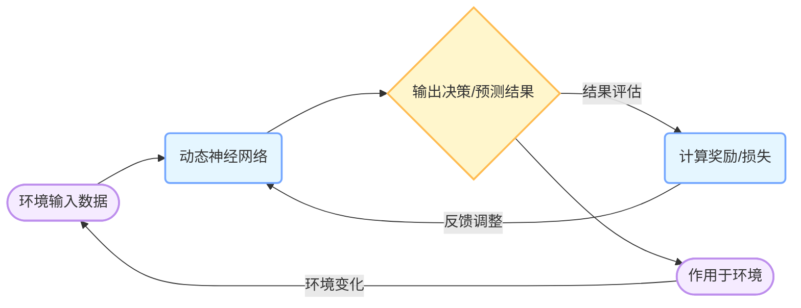

# 动态神经网络结构在适应性AI中的作用

> 关键词：动态神经网络结构、适应性AI、神经网络原理、算法实现、应用场景

> 摘要：本文深入探讨了动态神经网络结构在适应性AI中的作用。首先介绍了相关背景知识，包括目的、预期读者、文档结构和术语表。接着阐述了动态神经网络结构与适应性AI的核心概念及其联系，并给出了相应的文本示意图和Mermaid流程图。详细讲解了核心算法原理，使用Python源代码进行说明，同时给出了数学模型和公式并举例。通过项目实战，展示了代码实际案例及详细解释。分析了动态神经网络结构在适应性AI中的实际应用场景，推荐了学习资源、开发工具框架和相关论文著作。最后总结了未来发展趋势与挑战，并给出常见问题解答和扩展阅读参考资料，旨在帮助读者全面理解动态神经网络结构对适应性AI的重要意义。

## 1. 背景介绍 
### 1.1 目的和范围
本文章的目的在于全面且深入地探究动态神经网络结构在适应性AI中的具体作用。随着人工智能技术的不断发展，传统的静态神经网络在面对复杂多变的环境和任务时逐渐暴露出局限性。动态神经网络结构以其独特的灵活性和自适应性，为解决这些问题提供了新的思路和方法。我们将从理论原理、算法实现、实际应用等多个角度进行分析，旨在让读者清晰地了解动态神经网络结构如何提升AI的适应性，以及其在不同领域的应用潜力和价值。

### 1.2 预期读者
本文预期读者主要包括对人工智能领域有一定了解，希望深入研究动态神经网络和适应性AI的专业人士，如人工智能研究人员、算法工程师、软件开发者等。同时，也适合对该领域感兴趣的高校学生，特别是计算机科学、人工智能、自动化等相关专业的本科生和研究生，帮助他们拓宽知识面，深入理解前沿技术。

### 1.3 文档结构概述
本文将按照以下结构展开：首先介绍核心概念，明确动态神经网络结构和适应性AI的定义及相互联系；接着详细阐述核心算法原理和具体操作步骤，并给出Python代码示例；随后介绍相关的数学模型和公式，并举例说明其应用；通过项目实战展示代码的实际应用和详细解读；分析动态神经网络结构在不同场景下的实际应用；推荐学习资源、开发工具框架和相关论文著作；最后总结未来发展趋势与挑战，解答常见问题，并提供扩展阅读和参考资料。

### 1.4 术语表
#### 1.4.1 核心术语定义
- **动态神经网络结构**：指神经网络的拓扑结构、参数等可以在运行过程中动态变化的网络模型。与传统的静态神经网络不同，动态神经网络能够根据输入数据、任务需求或环境变化自动调整自身结构，以更好地适应不同的情况。
- **适应性AI**：具备自适应能力的人工智能系统，能够在不同的环境和任务中自动调整自身的行为和策略，以达到最优的性能表现。适应性AI可以根据新的数据和反馈不断学习和进化，从而更好地应对各种不确定性和变化。
- **神经网络拓扑结构**：描述了神经网络中神经元之间的连接方式和层次关系，包括输入层、隐藏层和输出层的神经元数量，以及它们之间的连接权重。拓扑结构决定了神经网络的计算能力和表达能力。

#### 1.4.2 相关概念解释
- **神经元**：神经网络的基本计算单元，类似于生物神经系统中的神经元。它接收多个输入信号，通过加权求和和激活函数处理后输出一个信号。
- **激活函数**：用于引入非线性因素，使神经网络能够学习和表示复杂的非线性关系。常见的激活函数有Sigmoid函数、ReLU函数等。
- **学习率**：在神经网络训练过程中，控制参数更新步长的超参数。学习率过大可能导致训练过程不稳定，无法收敛；学习率过小则会导致训练速度缓慢。

#### 1.4.3 缩略词列表
- **AI**：Artificial Intelligence，人工智能
- **DNN**：Deep Neural Network，深度神经网络
- **RNN**：Recurrent Neural Network，循环神经网络
- **LSTM**：Long Short-Term Memory，长短期记忆网络

## 2. 核心概念与联系 
### 核心概念原理
#### 动态神经网络结构
动态神经网络结构的核心思想是允许神经网络在运行过程中动态地改变其拓扑结构和参数。这种动态性可以体现在多个方面，例如增加或删除神经元、调整神经元之间的连接权重、改变网络的层数等。动态神经网络结构的实现方式有多种，常见的包括基于进化算法的动态网络生成、基于强化学习的网络结构调整等。

例如，在基于进化算法的动态网络生成中，通过遗传算法、粒子群算法等进化算法来搜索最优的网络结构。算法会初始化一组随机的网络结构，然后根据网络在特定任务上的性能表现进行评估，选择性能较好的网络进行交叉、变异等操作，生成新的网络结构。经过多次迭代，逐渐找到最优的网络结构。

#### 适应性AI
适应性AI强调人工智能系统能够根据环境的变化和任务的需求自动调整自身的行为和策略。它具备学习和适应的能力，可以在不同的情况下做出最优的决策。适应性AI的实现通常依赖于机器学习算法，如强化学习、迁移学习等。

以强化学习为例，智能体在与环境进行交互的过程中，通过不断尝试不同的动作，并根据环境给予的奖励信号来学习最优的策略。当环境发生变化时，智能体可以通过重新学习来调整自己的策略，以适应新的环境。

### 架构的文本示意图
动态神经网络结构与适应性AI的架构可以描述为：适应性AI系统作为一个整体，其核心部分是动态神经网络。动态神经网络接收外部环境的输入数据，根据输入数据和当前的任务需求，动态地调整自身的结构和参数。调整后的网络对输入数据进行处理，并输出相应的决策或预测结果。系统根据输出结果与目标的差异，计算奖励信号或损失函数，反馈给动态神经网络，进一步指导网络的结构和参数调整。

### Mermaid流程图


该流程图展示了动态神经网络在适应性AI系统中的工作流程。环境输入数据进入动态神经网络，网络输出决策或预测结果，对结果进行评估后计算奖励或损失，反馈给网络进行调整。输出结果作用于环境，环境的变化又会产生新的输入数据，形成一个闭环的自适应过程。

## 3. 核心算法原理 & 具体操作步骤 
### 基于强化学习的动态网络结构调整算法原理
在适应性AI中，我们可以使用强化学习来动态调整神经网络的结构。具体来说，我们将网络结构的调整看作是一个决策过程，每个决策对应一种网络结构的改变，如增加一个神经元、删除一条连接等。智能体通过与环境交互，根据环境给予的奖励信号来学习最优的网络结构调整策略。

以下是基于强化学习的动态网络结构调整算法的Python代码示例：

```python
import numpy as np
import gym

# 定义一个简单的环境类
class DynamicNetworkEnv(gym.Env):
    def __init__(self):
        # 初始化环境参数
        self.state = np.random.rand(10)  # 初始状态
        self.action_space = gym.spaces.Discrete(5)  # 定义动作空间，假设有5种可能的动作
        self.observation_space = gym.spaces.Box(low=0, high=1, shape=(10,))  # 定义观察空间

    def step(self, action):
        # 根据动作更新状态
        if action == 0:
            # 增加一个神经元
            self.state = self.state + np.random.rand(10) * 0.1
        elif action == 1:
            # 删除一个神经元
            self.state = self.state - np.random.rand(10) * 0.1
        # 其他动作...

        # 计算奖励
        reward = np.sum(self.state)  # 简单的奖励计算，奖励为状态的总和

        # 判断是否结束
        done = False

        # 其他信息
        info = {}

        return self.state, reward, done, info

    def reset(self):
        # 重置环境状态
        self.state = np.random.rand(10)
        return self.state

# 定义一个简单的策略网络
class PolicyNetwork:
    def __init__(self):
        self.weights = np.random.rand(10, 5)  # 随机初始化权重

    def forward(self, state):
        # 前向传播
        logits = np.dot(state, self.weights)
        probabilities = np.exp(logits) / np.sum(np.exp(logits))
        return probabilities

# 训练过程
env = DynamicNetworkEnv()
policy_network = PolicyNetwork()

num_episodes = 100
gamma = 0.9  # 折扣因子

for episode in range(num_episodes):
    state = env.reset()
    episode_rewards = []
    episode_actions = []
    episode_states = []

    while True:
        # 根据策略网络选择动作
        probabilities = policy_network.forward(state)
        action = np.random.choice(range(5), p=probabilities)

        # 执行动作
        next_state, reward, done, info = env.step(action)

        # 记录状态、动作和奖励
        episode_states.append(state)
        episode_actions.append(action)
        episode_rewards.append(reward)

        state = next_state

        if done:
            break

    # 计算累积奖励
    discounted_rewards = []
    cumulative_reward = 0
    for reward in reversed(episode_rewards):
        cumulative_reward = reward + gamma * cumulative_reward
        discounted_rewards.insert(0, cumulative_reward)

    # 简单的梯度更新（这里只是示例，实际中需要更复杂的实现）
    for i in range(len(episode_states)):
        state = episode_states[i]
        action = episode_actions[i]
        reward = discounted_rewards[i]

        # 计算梯度并更新策略网络的权重
        logits = np.dot(state, policy_network.weights)
        probabilities = np.exp(logits) / np.sum(np.exp(logits))
        grad_log_prob = np.zeros(5)
        grad_log_prob[action] = 1 - probabilities[action]
        grad = np.outer(state, grad_log_prob) * reward
        policy_network.weights += 0.01 * grad

    print(f"Episode {episode}: Total Reward = {sum(episode_rewards)}")
```

### 具体操作步骤
1. **环境定义**：定义一个环境类，如上述代码中的`DynamicNetworkEnv`，该类需要实现`step`、`reset`等方法。`step`方法根据智能体的动作更新环境状态，并返回新的状态、奖励、是否结束等信息；`reset`方法用于重置环境状态。
2. **策略网络定义**：定义一个策略网络，如上述代码中的`PolicyNetwork`，用于根据当前状态输出动作的概率分布。
3. **训练过程**：
    - 初始化环境和策略网络。
    - 进行多轮训练，每一轮训练包括以下步骤：
        - 重置环境状态。
        - 在每一个时间步，根据策略网络输出的概率分布选择一个动作。
        - 执行动作，获取新的状态、奖励和是否结束的信息。
        - 记录状态、动作和奖励。
        - 如果达到结束条件，计算累积奖励。
        - 根据累积奖励更新策略网络的权重。

## 4. 数学模型和公式 & 详细讲解 & 举例说明 
### 强化学习的数学模型
在强化学习中，我们通常使用马尔可夫决策过程（MDP）来描述智能体与环境的交互过程。一个马尔可夫决策过程可以用一个五元组 $\langle S, A, P, R, \gamma \rangle$ 表示，其中：
- $S$ 是状态空间，表示环境可能处于的所有状态的集合。
- $A$ 是动作空间，表示智能体可以采取的所有动作的集合。
- $P(s'|s, a)$ 是状态转移概率，表示在状态 $s$ 下采取动作 $a$ 后转移到状态 $s'$ 的概率。
- $R(s, a)$ 是奖励函数，表示在状态 $s$ 下采取动作 $a$ 后获得的即时奖励。
- $\gamma \in [0, 1]$ 是折扣因子，用于衡量未来奖励的重要性。

### 策略梯度算法的数学公式
策略梯度算法的目标是最大化累积奖励的期望。设策略函数为 $\pi_{\theta}(a|s)$，表示在状态 $s$ 下采取动作 $a$ 的概率，其中 $\theta$ 是策略网络的参数。累积奖励的期望可以表示为：

$$J(\theta) = \mathbb{E}_{\tau \sim \pi_{\theta}} \left[ \sum_{t=0}^{T} \gamma^t R(s_t, a_t) \right]$$

其中 $\tau = (s_0, a_0, s_1, a_1, \cdots, s_T, a_T)$ 是一个轨迹，$s_t$ 是第 $t$ 时刻的状态，$a_t$ 是第 $t$ 时刻的动作。

根据策略梯度定理，策略梯度可以表示为：

$$\nabla_{\theta} J(\theta) = \mathbb{E}_{\tau \sim \pi_{\theta}} \left[ \sum_{t=0}^{T} \nabla_{\theta} \log \pi_{\theta}(a_t|s_t) \sum_{k=t}^{T} \gamma^{k-t} R(s_k, a_k) \right]$$

在实际实现中，我们通常使用蒙特卡罗方法来估计策略梯度：

$$\nabla_{\theta} J(\theta) \approx \frac{1}{N} \sum_{i=1}^{N} \sum_{t=0}^{T_i} \nabla_{\theta} \log \pi_{\theta}(a_{i,t}|s_{i,t}) \sum_{k=t}^{T_i} \gamma^{k-t} R(s_{i,k}, a_{i,k})$$

其中 $N$ 是轨迹的数量，$T_i$ 是第 $i$ 条轨迹的长度。

### 举例说明
假设我们有一个简单的二维网格世界，智能体的目标是从起点走到终点。状态空间 $S$ 是网格中的所有位置，动作空间 $A$ 包括上下左右四个方向的移动。奖励函数 $R(s, a)$ 定义为：如果智能体到达终点，奖励为 10；如果智能体撞到墙壁，奖励为 -1；其他情况奖励为 0。

我们使用策略梯度算法来训练智能体。策略网络 $\pi_{\theta}(a|s)$ 接收当前状态 $s$ 作为输入，输出在该状态下采取每个动作的概率。在训练过程中，智能体根据策略网络选择动作，与环境进行交互，记录状态、动作和奖励。当一个轨迹结束后，计算累积奖励，并根据上述公式估计策略梯度，更新策略网络的参数。经过多次训练，智能体逐渐学会从起点走到终点的最优策略。

## 5. 项目实战：代码实际案例和详细解释说明 
### 5.1  开发环境搭建
#### 安装Python
首先需要安装Python，建议使用Python 3.7及以上版本。可以从Python官方网站（https://www.python.org/downloads/）下载并安装。

#### 安装必要的库
本项目需要使用一些常见的Python库，如`numpy`、`gym`等。可以使用以下命令进行安装：
```sh
pip install numpy gym
```

### 5.2  源代码详细实现和代码解读
以下是一个完整的基于强化学习的动态网络结构调整项目的源代码：

```python
import numpy as np
import gym

# 定义一个简单的环境类
class DynamicNetworkEnv(gym.Env):
    def __init__(self):
        # 初始化环境参数
        self.state = np.random.rand(10)  # 初始状态
        self.action_space = gym.spaces.Discrete(5)  # 定义动作空间，假设有5种可能的动作
        self.observation_space = gym.spaces.Box(low=0, high=1, shape=(10,))  # 定义观察空间

    def step(self, action):
        # 根据动作更新状态
        if action == 0:
            # 增加一个神经元
            self.state = self.state + np.random.rand(10) * 0.1
        elif action == 1:
            # 删除一个神经元
            self.state = self.state - np.random.rand(10) * 0.1
        elif action == 2:
            # 增加一条连接
            self.state = self.state + np.random.rand(10) * 0.05
        elif action == 3:
            # 删除一条连接
            self.state = self.state - np.random.rand(10) * 0.05
        else:
            # 不做任何改变
            pass

        # 计算奖励
        reward = np.sum(self.state)  # 简单的奖励计算，奖励为状态的总和

        # 判断是否结束
        done = False

        # 其他信息
        info = {}

        return self.state, reward, done, info

    def reset(self):
        # 重置环境状态
        self.state = np.random.rand(10)
        return self.state

# 定义一个简单的策略网络
class PolicyNetwork:
    def __init__(self):
        self.weights = np.random.rand(10, 5)  # 随机初始化权重

    def forward(self, state):
        # 前向传播
        logits = np.dot(state, self.weights)
        probabilities = np.exp(logits) / np.sum(np.exp(logits))
        return probabilities

    def update_weights(self, grad, learning_rate):
        # 更新权重
        self.weights += learning_rate * grad

# 计算梯度
def compute_gradient(state, action, reward, probabilities):
    logits = np.dot(state, policy_network.weights)
    grad_log_prob = np.zeros(5)
    grad_log_prob[action] = 1 - probabilities[action]
    grad = np.outer(state, grad_log_prob) * reward
    return grad

# 训练过程
env = DynamicNetworkEnv()
policy_network = PolicyNetwork()

num_episodes = 100
gamma = 0.9  # 折扣因子
learning_rate = 0.01

for episode in range(num_episodes):
    state = env.reset()
    episode_rewards = []
    episode_actions = []
    episode_states = []
    episode_probabilities = []

    while True:
        # 根据策略网络选择动作
        probabilities = policy_network.forward(state)
        action = np.random.choice(range(5), p=probabilities)

        # 执行动作
        next_state, reward, done, info = env.step(action)

        # 记录状态、动作、奖励和概率
        episode_states.append(state)
        episode_actions.append(action)
        episode_rewards.append(reward)
        episode_probabilities.append(probabilities)

        state = next_state

        if done:
            break

    # 计算累积奖励
    discounted_rewards = []
    cumulative_reward = 0
    for reward in reversed(episode_rewards):
        cumulative_reward = reward + gamma * cumulative_reward
        discounted_rewards.insert(0, cumulative_reward)

    # 更新策略网络的权重
    total_grad = np.zeros_like(policy_network.weights)
    for i in range(len(episode_states)):
        state = episode_states[i]
        action = episode_actions[i]
        reward = discounted_rewards[i]
        probabilities = episode_probabilities[i]

        grad = compute_gradient(state, action, reward, probabilities)
        total_grad += grad

    policy_network.update_weights(total_grad, learning_rate)

    print(f"Episode {episode}: Total Reward = {sum(episode_rewards)}")
```

### 代码解读与分析
#### 环境类 `DynamicNetworkEnv`
- `__init__` 方法：初始化环境的状态、动作空间和观察空间。
- `step` 方法：根据智能体的动作更新环境状态，计算奖励，并返回新的状态、奖励、是否结束等信息。
- `reset` 方法：重置环境状态。

#### 策略网络类 `PolicyNetwork`
- `__init__` 方法：随机初始化策略网络的权重。
- `forward` 方法：实现前向传播，根据输入状态输出动作的概率分布。
- `update_weights` 方法：根据梯度和学习率更新策略网络的权重。

#### 训练过程
- 初始化环境和策略网络。
- 进行多轮训练，每一轮训练包括以下步骤：
    - 重置环境状态。
    - 在每一个时间步，根据策略网络输出的概率分布选择一个动作。
    - 执行动作，获取新的状态、奖励和是否结束的信息。
    - 记录状态、动作、奖励和概率。
    - 如果达到结束条件，计算累积奖励。
    - 计算每一个时间步的梯度，并累加得到总梯度。
    - 根据总梯度更新策略网络的权重。

通过不断训练，策略网络逐渐学会选择最优的动作，从而动态调整网络结构，以获得更高的奖励。

## 6. 实际应用场景 
### 自动驾驶
在自动驾驶领域，环境复杂多变，道路状况、交通规则、其他车辆和行人的行为都在不断变化。动态神经网络结构可以使自动驾驶系统根据实时的环境信息动态调整网络结构，提高对不同场景的适应性。例如，在高速公路上，系统可以简化网络结构，减少计算量，提高处理速度；在城市拥堵路段，系统可以增加网络的复杂度，以更好地处理复杂的交通情况。

### 智能机器人
智能机器人需要在不同的环境中完成各种任务，如家庭服务、工业生产、探险等。动态神经网络结构可以让机器人根据环境的变化和任务的需求自动调整自身的感知、决策和控制策略。例如，在执行救援任务时，机器人可以根据废墟的结构和救援目标动态调整网络结构，提高搜索和救援的效率。

### 金融投资
金融市场具有高度的不确定性和复杂性，价格波动、市场趋势、政策变化等因素都会影响投资决策。动态神经网络结构可以用于构建金融预测模型，根据市场的实时数据动态调整网络结构，提高预测的准确性。例如，在股票市场中，模型可以根据不同的行业、公司和市场环境动态调整网络结构，以更好地预测股票价格的走势。

### 医疗诊断
医疗诊断需要处理大量的复杂数据，如病历、影像、检验结果等。动态神经网络结构可以使诊断模型根据患者的具体情况和疾病的特征动态调整网络结构，提高诊断的准确性和效率。例如，在癌症诊断中，模型可以根据肿瘤的类型、分期和患者的个体差异动态调整网络结构，以更好地识别癌细胞和制定治疗方案。

## 7. 工具和资源推荐
### 7.1 学习资源推荐
#### 7.1.1 书籍推荐
- 《深度学习》（Deep Learning）：由Ian Goodfellow、Yoshua Bengio和Aaron Courville撰写，是深度学习领域的经典教材，涵盖了深度学习的基本原理、算法和应用。
- 《强化学习：原理与Python实现》（Reinforcement Learning: An Introduction）：由Richard S. Sutton和Andrew G. Barto撰写，是强化学习领域的权威书籍，详细介绍了强化学习的理论和算法。
- 《神经网络与深度学习》（Neural Networks and Deep Learning）：由Michael Nielsen撰写，以通俗易懂的方式介绍了神经网络和深度学习的基本概念和算法，并提供了Python代码实现。

#### 7.1.2 在线课程
- Coursera上的“深度学习专项课程”（Deep Learning Specialization）：由Andrew Ng教授授课，包括五门课程，涵盖了深度学习的各个方面，如神经网络基础、卷积神经网络、循环神经网络等。
- edX上的“强化学习基础”（Fundamentals of Reinforcement Learning）：由DeepMind的研究人员授课，介绍了强化学习的基本概念、算法和应用。
- 中国大学MOOC上的“人工智能基础”：由国内知名高校的教授授课，系统介绍了人工智能的基本概念、算法和应用。

#### 7.1.3 技术博客和网站
- Medium：是一个技术博客平台，有很多关于人工智能、深度学习和强化学习的优质文章。
- arXiv：是一个预印本平台，提供了大量的人工智能领域的研究论文。
- OpenAI Blog：OpenAI的官方博客，发布了很多关于人工智能的最新研究成果和应用案例。

### 7.2 开发工具框架推荐
#### 7.2.1 IDE和编辑器
- PyCharm：是一款专业的Python集成开发环境，提供了代码编辑、调试、版本控制等功能，适合开发Python项目。
- Jupyter Notebook：是一个交互式的开发环境，支持Python、R等多种编程语言，适合进行数据分析、模型训练和实验。
- Visual Studio Code：是一款轻量级的代码编辑器，支持多种编程语言和插件，适合快速开发和调试。

#### 7.2.2 调试和性能分析工具
- TensorBoard：是TensorFlow的可视化工具，可以用于查看模型的训练过程、损失曲线、网络结构等信息。
- PyTorch Profiler：是PyTorch的性能分析工具，可以用于分析模型的运行时间、内存使用情况等。
- cProfile：是Python的内置性能分析工具，可以用于分析Python代码的运行时间和函数调用情况。

#### 7.2.3 相关框架和库
- TensorFlow：是一个开源的深度学习框架，提供了丰富的工具和库，支持多种深度学习模型的构建和训练。
- PyTorch：是另一个开源的深度学习框架，具有动态图机制，适合快速开发和实验。
- Gym：是OpenAI开发的一个用于开发和比较强化学习算法的工具包，提供了多种环境和接口。

### 7.3 相关论文著作推荐
#### 7.3.1 经典论文
- “Learning Internal Representations by Error Propagation”：由David E. Rumelhart、Geoffrey E. Hinton和Ronald J. Williams撰写，介绍了反向传播算法，是神经网络领域的经典论文。
- “Playing Atari with Deep Reinforcement Learning”：由Volodymyr Mnih等人撰写，提出了深度Q网络（DQN）算法，开启了深度强化学习的时代。
- “Attention Is All You Need”：由Ashish Vaswani等人撰写，提出了Transformer模型，在自然语言处理领域取得了巨大的成功。

#### 7.3.2 最新研究成果
- “Dynamic Neural Networks: A Survey”：对动态神经网络的研究进行了全面的综述，介绍了动态神经网络的各种方法和应用。
- “Adaptive AI for Autonomous Systems”：探讨了适应性AI在自主系统中的应用，包括自动驾驶、智能机器人等领域。
- “Meta-Learning for Adaptive Neural Networks”：研究了元学习在自适应神经网络中的应用，通过元学习来快速适应新的任务和环境。

#### 7.3.3 应用案例分析
- “Dynamic Neural Networks for Financial Forecasting”：介绍了动态神经网络在金融预测中的应用，通过动态调整网络结构提高预测的准确性。
- “Adaptive AI in Healthcare: A Case Study”：通过实际案例分析了适应性AI在医疗领域的应用，如疾病诊断、治疗方案推荐等。
- “Dynamic Neural Networks for Robotics: A Practical Guide”：提供了动态神经网络在机器人领域的实际应用指南，包括机器人的感知、决策和控制等方面。

## 8. 总结：未来发展趋势与挑战
### 未来发展趋势
#### 更高效的动态调整机制
未来的研究将致力于开发更高效的动态调整机制，使动态神经网络能够更快、更准确地适应环境的变化。例如，采用元学习的方法，让网络在训练过程中学习如何快速调整自身结构，以适应新的任务和环境。

#### 与其他技术的融合
动态神经网络将与其他技术，如量子计算、生物计算等进行融合，进一步提升其计算能力和适应性。例如，利用量子计算的并行计算能力，加速动态神经网络的训练和推理过程。

#### 更广泛的应用领域
随着技术的不断发展，动态神经网络将在更多的领域得到应用，如能源管理、环境保护、教育等。例如，在能源管理中，动态神经网络可以根据能源需求和供应的变化动态调整能源分配策略，提高能源利用效率。

### 挑战
#### 计算资源需求
动态神经网络的动态调整过程需要大量的计算资源，特别是在处理大规模数据和复杂任务时。如何降低计算资源需求，提高计算效率，是未来需要解决的一个重要问题。

#### 模型可解释性
动态神经网络的结构和参数在运行过程中不断变化，使得模型的可解释性变得更加困难。如何提高模型的可解释性，让用户能够理解模型的决策过程和结果，是动态神经网络应用中的一个关键挑战。

#### 数据隐私和安全
在动态神经网络的应用中，需要处理大量的敏感数据，如个人信息、医疗数据等。如何保障数据的隐私和安全，防止数据泄露和滥用，是动态神经网络发展过程中需要重视的问题。

## 9. 附录：常见问题与解答
### 动态神经网络与传统神经网络有什么区别？
传统神经网络的拓扑结构和参数在训练过程中是固定的，而动态神经网络的结构和参数可以在运行过程中动态变化。动态神经网络能够根据输入数据、任务需求或环境变化自动调整自身结构，以更好地适应不同的情况。

### 动态神经网络的训练时间会比传统神经网络长吗？
一般来说，动态神经网络的训练时间可能会比传统神经网络长，因为动态神经网络需要在训练过程中不断调整网络结构，增加了计算复杂度。但是，通过采用高效的动态调整机制和优化算法，可以在一定程度上缩短训练时间。

### 动态神经网络在实际应用中有哪些限制？
动态神经网络在实际应用中的限制主要包括计算资源需求大、模型可解释性差、数据隐私和安全等问题。此外，动态神经网络的设计和训练需要一定的专业知识和经验，对开发者的要求较高。

### 如何评估动态神经网络的性能？
评估动态神经网络的性能可以从多个方面进行，如准确率、召回率、F1值等传统的机器学习指标，以及适应性、灵活性等动态性能指标。可以通过在不同的数据集和任务上进行实验，比较动态神经网络与传统神经网络的性能差异。

## 10. 扩展阅读 & 参考资料
### 扩展阅读
- 《人工智能：现代方法》（Artificial Intelligence: A Modern Approach）：全面介绍了人工智能的各个领域，包括搜索算法、知识表示、机器学习、自然语言处理等。
- 《深度学习实战》（Deep Learning in Practice）：通过实际案例介绍了深度学习在计算机视觉、自然语言处理、语音识别等领域的应用。
- 《强化学习实战》（Reinforcement Learning in Practice）：提供了强化学习的实际应用案例和代码实现，帮助读者更好地理解和应用强化学习算法。

### 参考资料
- Goodfellow, I., Bengio, Y., & Courville, A. (2016). Deep Learning. MIT Press.
- Sutton, R. S., & Barto, A. G. (2018). Reinforcement Learning: An Introduction. MIT Press.
- Nielsen, M. A. (2015). Neural Networks and Deep Learning. Determination Press.

作者：AI天才研究院/AI Genius Institute & 禅与计算机程序设计艺术 /Zen And The Art of Computer Programming