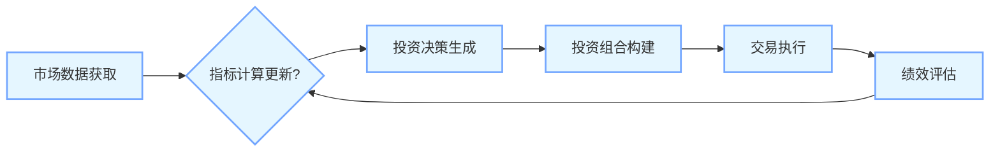

# 动量投资策略：利用价格趋势获取收益

> 关键词：动量投资策略、价格趋势、收益获取、金融市场、量化分析

> 摘要：本文围绕动量投资策略展开，深入探讨了如何利用价格趋势来获取收益。详细介绍了动量投资策略的背景知识，包括目的、预期读者、文档结构和相关术语。阐述了核心概念与联系，通过文本示意图和 Mermaid 流程图进行直观展示。对核心算法原理进行了深入剖析，并给出 Python 源代码示例。讲解了相关数学模型和公式，并举例说明。通过项目实战，展示了代码的实际案例和详细解释。分析了该策略在不同市场的实际应用场景，推荐了学习资源、开发工具框架和相关论文著作。最后总结了动量投资策略的未来发展趋势与挑战，解答了常见问题，并提供了扩展阅读和参考资料。

## 1. 背景介绍 
### 1.1 目的和范围
动量投资策略旨在通过识别和利用金融市场中的价格趋势来获取投资收益。在金融市场中，资产价格并非随机波动，而是常常呈现出一定的趋势性。动量投资策略的核心思想就是认为过去表现好的资产在未来一段时间内仍有较大概率继续表现良好，而过去表现差的资产则可能继续表现不佳。本文章的范围涵盖了动量投资策略的基本概念、算法原理、数学模型、实际应用案例以及相关的工具和资源推荐等方面，旨在为投资者和研究人员提供一个全面、深入的关于动量投资策略的知识体系。

### 1.2 预期读者
本文的预期读者主要包括以下几类人群：
- **投资者**：无论是个人投资者还是机构投资者，都可以从本文中了解动量投资策略的原理和应用方法，从而在实际投资中运用该策略来优化投资组合，提高投资收益。
- **金融分析师**：金融分析师可以通过深入研究动量投资策略，为客户提供更专业的投资建议，同时也有助于提升自身的分析能力和研究水平。
- **量化交易员**：量化交易员可以借鉴本文中的算法原理和代码实现，开发基于动量投资策略的量化交易模型，实现自动化交易。
- **金融研究人员**：金融研究人员可以将本文作为研究动量投资策略的参考资料，进一步深入探讨该策略在不同市场环境下的有效性和局限性。

### 1.3 文档结构概述
本文将按照以下结构进行组织：
- **核心概念与联系**：介绍动量投资策略的核心概念，包括动量的定义、形成机制以及与其他投资策略的联系，并通过文本示意图和 Mermaid 流程图进行直观展示。
- **核心算法原理 & 具体操作步骤**：详细阐述动量投资策略的核心算法原理，包括如何计算动量指标、如何根据动量指标进行投资决策等，并给出 Python 源代码示例。
- **数学模型和公式 & 详细讲解 & 举例说明**：介绍动量投资策略的数学模型和公式，包括动量指标的计算公式、投资组合的优化模型等，并通过具体的例子进行详细讲解。
- **项目实战：代码实际案例和详细解释说明**：通过一个实际的项目案例，展示如何使用 Python 实现动量投资策略，并对代码进行详细的解释和分析。
- **实际应用场景**：分析动量投资策略在不同金融市场中的实际应用场景，包括股票市场、期货市场、外汇市场等。
- **工具和资源推荐**：推荐一些学习动量投资策略的相关资源，包括书籍、在线课程、技术博客和网站等，同时也推荐一些开发工具框架和相关论文著作。
- **总结：未来发展趋势与挑战**：总结动量投资策略的发展现状，分析其未来的发展趋势和面临的挑战。
- **附录：常见问题与解答**：解答一些关于动量投资策略的常见问题，帮助读者更好地理解和应用该策略。
- **扩展阅读 & 参考资料**：提供一些扩展阅读的资料和参考书目，方便读者进一步深入研究动量投资策略。

### 1.4 术语表
#### 1.4.1 核心术语定义
- **动量投资策略（Momentum Investment Strategy）**：一种基于资产价格趋势的投资策略，通过买入过去表现好的资产，卖出过去表现差的资产来获取收益。
- **动量指标（Momentum Indicator）**：用于衡量资产价格趋势强度和持续性的指标，常见的动量指标包括相对强弱指数（RSI）、移动平均线收敛发散指标（MACD）等。
- **价格趋势（Price Trend）**：资产价格在一段时间内的变化方向和幅度，包括上升趋势、下降趋势和横盘整理趋势。
- **投资组合（Investment Portfolio）**：由多种资产组成的集合，投资者通过合理配置资产来实现投资目标。
- **夏普比率（Sharpe Ratio）**：一种衡量投资组合风险调整后收益的指标，计算公式为投资组合的预期收益率与无风险收益率之差除以投资组合的标准差。

#### 1.4.2 相关概念解释
- **市场效率（Market Efficiency）**：市场效率是指市场价格反映所有可用信息的程度。在有效市场中，资产价格能够及时、准确地反映所有公开信息，因此动量投资策略可能无法获得超额收益。然而，大量的实证研究表明，市场并非完全有效，存在一定的市场异象，动量投资策略就是其中之一。
- **行为金融学（Behavioral Finance）**：行为金融学是将心理学和金融学相结合的一门学科，它认为投资者的决策并非完全理性，而是受到心理因素的影响。动量投资策略的有效性可以从行为金融学的角度进行解释，例如投资者的过度自信、羊群效应等心理因素会导致资产价格出现趋势性波动。
- **风险控制（Risk Control）**：风险控制是投资过程中非常重要的一环，它旨在通过合理的投资组合配置和风险管理措施来降低投资风险。在动量投资策略中，风险控制可以通过设置止损点、控制仓位等方式来实现。

#### 1.4.3 缩略词列表
- **RSI**：相对强弱指数（Relative Strength Index）
- **MACD**：移动平均线收敛发散指标（Moving Average Convergence Divergence）
- **ETF**：交易型开放式指数基金（Exchange Traded Fund）
- **CAPM**：资本资产定价模型（Capital Asset Pricing Model）

## 2. 核心概念与联系 
### 核心概念原理
动量投资策略的核心原理基于市场的非有效性和投资者的行为偏差。在金融市场中，由于信息传播的不及时、投资者的情绪波动等因素，资产价格往往会出现趋势性的波动。动量投资策略认为，过去表现好的资产往往会吸引更多的投资者关注和资金流入，从而推动其价格继续上涨；而过去表现差的资产则会受到投资者的冷落，价格继续下跌。因此，通过买入过去表现好的资产，卖出过去表现差的资产，投资者可以在价格趋势延续的过程中获取收益。

### 架构的文本示意图
动量投资策略的基本架构可以用以下文本示意图表示：

```plaintext
市场数据获取 -> 动量指标计算 -> 投资决策生成 -> 投资组合构建 -> 交易执行 -> 绩效评估
```

- **市场数据获取**：从金融市场数据源获取资产的历史价格、成交量等数据。
- **动量指标计算**：根据获取的市场数据，计算动量指标，如相对强弱指数（RSI）、移动平均线收敛发散指标（MACD）等。
- **投资决策生成**：根据动量指标的计算结果，生成投资决策，如买入、卖出或持有资产。
- **投资组合构建**：根据投资决策，构建投资组合，合理配置资产的权重。
- **交易执行**：根据投资组合的配置，执行交易指令，买入或卖出相应的资产。
- **绩效评估**：定期对投资组合的绩效进行评估，分析投资策略的有效性和收益情况。

### Mermaid 流程图


这个流程图展示了动量投资策略的整个流程，从市场数据获取开始，经过动量指标计算、投资决策生成、投资组合构建、交易执行，最后到绩效评估。绩效评估的结果会反馈到动量指标计算环节，根据市场情况的变化更新指标计算，以实现投资策略的动态调整。

## 3. 核心算法原理 & 具体操作步骤 
### 核心算法原理
动量投资策略的核心算法主要涉及动量指标的计算和投资决策的生成。下面以简单的价格动量指标为例进行说明。

价格动量指标通常通过计算资产在过去一段时间内的收益率来衡量其价格趋势。假设我们选择过去 $n$ 个交易日作为计算周期，资产 $i$ 在第 $t$ 个交易日的价格动量指标 $M_{i,t}$ 可以表示为：

$M_{i,t}=\frac{P_{i,t}}{P_{i,t - n}}-1$

其中，$P_{i,t}$ 表示资产 $i$ 在第 $t$ 个交易日的收盘价，$P_{i,t - n}$ 表示资产 $i$ 在第 $t - n$ 个交易日的收盘价。

根据计算得到的动量指标，我们可以进行投资决策。一般来说，如果资产的动量指标大于某个阈值 $\theta$，则认为该资产具有较强的上升趋势，我们可以考虑买入该资产；如果资产的动量指标小于某个阈值 $-\theta$，则认为该资产具有较强的下降趋势，我们可以考虑卖出该资产；如果资产的动量指标在 $-\theta$ 和 $\theta$ 之间，则认为该资产的价格趋势不明显，我们可以考虑持有该资产。

### 具体操作步骤
下面是使用 Python 实现动量投资策略的具体操作步骤和代码示例：

```python
import pandas as pd
import numpy as np

# 步骤 1: 数据获取
# 假设我们已经从数据源获取了股票的历史收盘价数据，存储在一个 DataFrame 中
# 这里使用一个简单的示例数据
data = {
    'stock1': [100, 102, 105, 103, 106, 108, 110, 109, 112, 115],
    'stock2': [200, 202, 205, 203, 206, 208, 210, 209, 212, 215]
}
dates = pd.date_range(start='2023-01-01', periods=10)
df = pd.DataFrame(data, index=dates)

# 步骤 2: 动量指标计算
n = 3  # 计算周期
momentum = df / df.shift(n) - 1

# 步骤 3: 投资决策生成
theta = 0.05  # 阈值
signals = pd.DataFrame(index=df.index, columns=df.columns)
signals[momentum > theta] = 1  # 买入信号
signals[momentum < -theta] = -1  # 卖出信号
signals[(momentum >= -theta) & (momentum <= theta)] = 0  # 持有信号

# 步骤 4: 投资组合构建
portfolio = signals * 0.5  # 假设每个资产的初始权重为 0.5

# 步骤 5: 交易执行
# 这里简单模拟交易执行，计算投资组合的收益
returns = df.pct_change()
portfolio_returns = (portfolio.shift(1) * returns).sum(axis=1)

# 步骤 6: 绩效评估
cumulative_returns = (1 + portfolio_returns).cumprod()

print("投资组合的累积收益率:")
print(cumulative_returns)
```

### 代码解释
1. **数据获取**：使用一个简单的示例数据创建一个 DataFrame，包含两只股票的历史收盘价。
2. **动量指标计算**：通过 `df / df.shift(n) - 1` 计算每个股票在过去 $n$ 个交易日的价格动量指标。
3. **投资决策生成**：根据动量指标和阈值 $\theta$，生成买入、卖出或持有信号。
4. **投资组合构建**：根据投资决策，构建投资组合，每个资产的初始权重为 0.5。
5. **交易执行**：模拟交易执行，计算投资组合的每日收益率。
6. **绩效评估**：计算投资组合的累积收益率，以评估投资策略的绩效。

## 4. 数学模型和公式 & 详细讲解 & 举例说明 
### 动量指标计算公式
如前面所述，简单的价格动量指标计算公式为：

$M_{i,t}=\frac{P_{i,t}}{P_{i,t - n}}-1$

其中，$M_{i,t}$ 表示资产 $i$ 在第 $t$ 个交易日的价格动量指标，$P_{i,t}$ 表示资产 $i$ 在第 $t$ 个交易日的收盘价，$P_{i,t - n}$ 表示资产 $i$ 在第 $t - n$ 个交易日的收盘价。

**详细讲解**：该公式的核心思想是通过比较资产当前价格与过去 $n$ 个交易日的价格，来衡量资产价格的上涨或下跌幅度。如果 $M_{i,t}>0$，说明资产价格在过去 $n$ 个交易日内上涨；如果 $M_{i,t}<0$，说明资产价格在过去 $n$ 个交易日内下跌。$M_{i,t}$ 的绝对值越大，说明资产价格的趋势越强。

**举例说明**：假设股票 A 在第 10 个交易日的收盘价为 110 元，在第 7 个交易日的收盘价为 100 元，计算周期 $n = 3$。则该股票在第 10 个交易日的价格动量指标为：

$M_{A,10}=\frac{110}{100}-1=0.1$

这表明该股票在过去 3 个交易日内上涨了 10%。

### 投资组合优化模型
在动量投资策略中，投资组合的优化是一个重要的环节，旨在通过合理配置资产的权重，实现投资组合的风险和收益的平衡。一种常见的投资组合优化模型是均值 - 方差模型（Markowitz 模型）。

均值 - 方差模型的目标是在给定预期收益率的情况下，最小化投资组合的方差；或者在给定方差的情况下，最大化投资组合的预期收益率。假设投资组合由 $N$ 种资产组成，资产 $i$ 的权重为 $w_i$，预期收益率为 $\mu_i$，资产之间的协方差矩阵为 $\Sigma$，则投资组合的预期收益率 $\mu_p$ 和方差 $\sigma_p^2$ 可以表示为：

$\mu_p=\sum_{i = 1}^{N}w_i\mu_i$

$\sigma_p^2=\sum_{i = 1}^{N}\sum_{j = 1}^{N}w_iw_j\sigma_{ij}=w^T\Sigma w$

其中，$\sigma_{ij}$ 表示资产 $i$ 和资产 $j$ 之间的协方差，$w=(w_1,w_2,\cdots,w_N)^T$ 是资产权重向量。

均值 - 方差模型的优化问题可以表示为：

$\min_{w}\sigma_p^2=w^T\Sigma w$

s.t. $\sum_{i = 1}^{N}w_i = 1$

$\sum_{i = 1}^{N}w_i\mu_i=\mu_{target}$

$w_i\geq0, i = 1,2,\cdots,N$

其中，$\mu_{target}$ 是投资组合的目标预期收益率。

**详细讲解**：该模型的核心思想是通过求解一个二次规划问题，找到一组最优的资产权重，使得投资组合的方差最小，同时满足预期收益率的约束条件。约束条件 $\sum_{i = 1}^{N}w_i = 1$ 表示投资组合的权重之和为 1，即所有资金都用于投资；$w_i\geq0$ 表示不允许卖空。

**举例说明**：假设投资组合由三只股票组成，预期收益率分别为 $\mu_1 = 0.1$，$\mu_2 = 0.15$，$\mu_3 = 0.2$，协方差矩阵为：

$\Sigma=\begin{bmatrix}
0.04 & 0.02 & 0.01\\
0.02 & 0.06 & 0.03\\
0.01 & 0.03 & 0.08
\end{bmatrix}$

目标预期收益率 $\mu_{target}=0.16$。使用 Python 的 `scipy.optimize` 库可以求解该优化问题：

```python
import numpy as np
from scipy.optimize import minimize

# 预期收益率
mu = np.array([0.1, 0.15, 0.2])

# 协方差矩阵
Sigma = np.array([[0.04, 0.02, 0.01],
                  [0.02, 0.06, 0.03],
                  [0.01, 0.03, 0.08]])

# 目标预期收益率
mu_target = 0.16

# 初始权重
w0 = np.ones(len(mu)) / len(mu)

# 约束条件
cons = [{'type': 'eq', 'fun': lambda w: np.sum(w) - 1},
        {'type': 'eq', 'fun': lambda w: np.dot(w, mu) - mu_target}]

# 边界条件
bounds = [(0, None)] * len(mu)

# 优化函数
def objective(w):
    return np.dot(w.T, np.dot(Sigma, w))

# 求解优化问题
result = minimize(objective, w0, method='SLSQP', bounds=bounds, constraints=cons)

# 最优权重
optimal_w = result.x

print("最优权重:", optimal_w)
```

运行上述代码，即可得到投资组合的最优权重。

## 5. 项目实战：代码实际案例和详细解释说明 
### 5.1  开发环境搭建
在进行动量投资策略的项目实战之前，需要搭建相应的开发环境。以下是具体的搭建步骤：

#### 安装 Python
Python 是一种广泛使用的编程语言，具有丰富的科学计算和数据分析库，非常适合用于金融数据分析和量化交易。可以从 Python 官方网站（https://www.python.org/downloads/）下载并安装 Python 的最新版本。

#### 安装必要的库
在 Python 中，有许多库可以用于金融数据分析和量化交易，如 `pandas`、`numpy`、`matplotlib`、`yfinance` 等。可以使用 `pip` 命令来安装这些库：

```bash
pip install pandas numpy matplotlib yfinance
```

#### 安装开发工具
可以选择使用集成开发环境（IDE）来进行代码开发，如 PyCharm、Jupyter Notebook 等。PyCharm 是一款功能强大的 Python IDE，提供了代码编辑、调试、版本控制等功能；Jupyter Notebook 是一个交互式的开发环境，适合用于数据分析和可视化。

### 5.2  源代码详细实现和代码解读
以下是一个完整的动量投资策略的项目实战代码示例，使用 `yfinance` 库获取股票数据，实现动量指标计算、投资决策生成、投资组合构建和绩效评估等功能：

```python
import yfinance as yf
import pandas as pd
import numpy as np
import matplotlib.pyplot as plt

# 步骤 1: 数据获取
tickers = ['AAPL', 'MSFT', 'GOOG']  # 选择要投资的股票
start_date = '2020-01-01'
end_date = '2023-12-31'
data = yf.download(tickers, start=start_date, end=end_date)['Close']

# 步骤 2: 动量指标计算
n = 30  # 计算周期
momentum = data / data.shift(n) - 1

# 步骤 3: 投资决策生成
theta = 0.1  # 阈值
signals = pd.DataFrame(index=data.index, columns=data.columns)
signals[momentum > theta] = 1  # 买入信号
signals[momentum < -theta] = -1  # 卖出信号
signals[(momentum >= -theta) & (momentum <= theta)] = 0  # 持有信号

# 步骤 4: 投资组合构建
portfolio = signals * (1 / len(tickers))  # 等权重投资组合

# 步骤 5: 交易执行
returns = data.pct_change()
portfolio_returns = (portfolio.shift(1) * returns).sum(axis=1)

# 步骤 6: 绩效评估
cumulative_returns = (1 + portfolio_returns).cumprod()

# 绘制累积收益率曲线
plt.figure(figsize=(12, 6))
plt.plot(cumulative_returns, label='Portfolio Cumulative Returns')
plt.title('Momentum Investment Strategy Performance')
plt.xlabel('Date')
plt.ylabel('Cumulative Returns')
plt.legend()
plt.grid(True)
plt.show()
```

### 5.3  代码解读与分析
#### 数据获取
使用 `yfinance` 库的 `download` 函数从雅虎财经获取指定股票在指定日期范围内的收盘价数据。

#### 动量指标计算
通过 `data / data.shift(n) - 1` 计算每个股票在过去 $n$ 个交易日的价格动量指标。

#### 投资决策生成
根据动量指标和阈值 $\theta$，生成买入、卖出或持有信号。

#### 投资组合构建
采用等权重投资组合的方式，将资金平均分配到每只股票上。

#### 交易执行
计算每只股票的每日收益率，并根据投资组合的权重计算投资组合的每日收益率。

#### 绩效评估
计算投资组合的累积收益率，并使用 `matplotlib` 库绘制累积收益率曲线，直观展示投资策略的绩效。

通过对上述代码的分析，可以发现动量投资策略的核心在于利用股票价格的趋势性，通过买入表现好的股票，卖出表现差的股票来获取收益。同时，投资组合的构建和绩效评估也是非常重要的环节，直接影响到投资策略的有效性和收益情况。

## 6. 实际应用场景 
### 股票市场
在股票市场中，动量投资策略具有广泛的应用。投资者可以通过分析股票的价格趋势，选择过去一段时间内表现好的股票进行买入，表现差的股票进行卖出。例如，一些量化投资基金通过使用动量投资策略，构建股票投资组合，在市场中取得了较好的收益。动量投资策略在股票市场中的应用还可以结合其他基本面分析和技术分析方法，进一步提高投资决策的准确性。

### 期货市场
期货市场具有高杠杆、高风险的特点，动量投资策略在期货市场中也有一定的应用价值。期货价格的波动往往具有较强的趋势性，投资者可以利用动量指标来判断期货价格的走势，进行做多或做空操作。例如，在商品期货市场中，投资者可以根据农产品、金属等期货品种的价格动量指标，进行相应的交易决策。

### 外汇市场
外汇市场是全球最大的金融市场之一，货币对的价格波动频繁。动量投资策略可以帮助外汇投资者捕捉货币对的价格趋势，获取收益。投资者可以通过计算不同货币对的动量指标，选择具有较强上升趋势的货币对进行买入，具有较强下降趋势的货币对进行卖出。同时，外汇市场的交易时间较长，投资者可以更及时地根据市场变化调整投资策略。

### 加密货币市场
随着加密货币市场的兴起，动量投资策略也逐渐应用于该市场。加密货币价格的波动较大，具有较强的趋势性，适合使用动量投资策略进行交易。投资者可以通过分析比特币、以太坊等主流加密货币的价格动量指标，进行投资决策。然而，加密货币市场的风险也相对较高，投资者需要更加谨慎地使用动量投资策略。

## 7. 工具和资源推荐
### 7.1 学习资源推荐
#### 7.1.1 书籍推荐
- 《量化投资：策略与技术》：全面介绍了量化投资的基本概念、策略和技术，包括动量投资策略的原理和应用。
- 《金融市场技术分析》：经典的技术分析著作，详细介绍了各种技术分析方法和指标，对动量投资策略的学习有很大的帮助。
- 《行为金融学》：从心理学的角度解释了金融市场中的投资者行为和市场异象，有助于理解动量投资策略的有效性。

#### 7.1.2 在线课程
- Coursera 上的“量化投资基础”课程：由知名高校教授授课，系统介绍了量化投资的基本理论和方法，包括动量投资策略的实现。
- edX 上的“金融数据分析与量化交易”课程：通过实际案例和代码实现，讲解了金融数据分析和量化交易的相关知识，对动量投资策略的学习有很大的帮助。

#### 7.1.3 技术博客和网站
- 优矿（https://uqer.datayes.com/）：提供了丰富的金融数据和量化交易工具，同时也有很多关于动量投资策略的研究报告和案例分享。
- 聚宽（https://www.joinquant.com/）：国内知名的量化交易平台，有大量的量化策略和代码示例，包括动量投资策略。
- 雪球（https://xueqiu.com/）：一个投资者交流社区，有很多关于金融市场和投资策略的讨论，对学习动量投资策略有一定的参考价值。

### 7.2 开发工具框架推荐
#### 7.2.1 IDE和编辑器
- PyCharm：功能强大的 Python IDE，提供了代码编辑、调试、版本控制等功能，适合用于开发动量投资策略的 Python 代码。
- Jupyter Notebook：交互式的开发环境，适合用于数据分析和可视化，方便对动量投资策略的代码进行测试和验证。

#### 7.2.2 调试和性能分析工具
- pdb：Python 自带的调试工具，可以帮助开发者在代码中设置断点，逐步调试代码，查找问题。
- cProfile：Python 的性能分析工具，可以分析代码的运行时间和函数调用情况，帮助开发者优化代码性能。

#### 7.2.3 相关框架和库
- pandas：强大的数据分析库，提供了 DataFrame 和 Series 等数据结构，方便进行金融数据的处理和分析。
- numpy：科学计算库，提供了高效的数组和矩阵运算功能，在动量指标计算和投资组合优化中经常使用。
- matplotlib：数据可视化库，可以绘制各种图表，如累积收益率曲线、动量指标走势图等，直观展示投资策略的绩效。
- yfinance：用于获取金融数据的库，可以从雅虎财经获取股票、期货、外汇等金融产品的历史数据。

### 7.3 相关论文著作推荐
#### 7.3.1 经典论文
- Jegadeesh, N., & Titman, S. (1993). Returns to Buying Winners and Selling Losers: Implications for Stock Market Efficiency. The Journal of Finance, 48(1), 65-91. 该论文首次提出了动量投资策略的概念，并通过实证研究证明了动量投资策略在股票市场中的有效性。
- Carhart, M. M. (1997). On Persistence in Mutual Fund Performance. The Journal of Finance, 52(1), 57-82. 该论文在 Fama - French 三因子模型的基础上，加入了动量因子，提出了四因子模型，进一步解释了股票收益率的变化。

#### 7.3.2 最新研究成果
- Barroso, P., & Santa-Clara, P. (2015). Momentum Has Its Moments. The Journal of Financial Economics, 116(1), 111-120. 该论文研究了动量投资策略的时变性，发现动量投资策略在某些时期表现较好，而在其他时期表现较差。
- Asness, C. S., Moskowitz, T. J., & Pedersen, L. H. (2013). Value and Momentum Everywhere. The Journal of Finance, 68(3), 929-985. 该论文研究了动量投资策略在全球不同市场和资产类别的有效性，发现动量投资策略在多个市场和资产类别中都具有一定的盈利能力。

#### 7.3.3 应用案例分析
- 《量化投资策略与实践》：书中包含了多个动量投资策略的应用案例，详细介绍了策略的实现过程和绩效评估方法。
- 《金融量化分析与交易策略》：通过实际案例分析，讲解了动量投资策略在股票、期货、外汇等市场的应用，对实际投资具有一定的指导意义。

## 8. 总结：未来发展趋势与挑战
### 未来发展趋势
- **与人工智能技术的融合**：随着人工智能技术的不断发展，动量投资策略将与机器学习、深度学习等技术相结合，进一步提高投资决策的准确性和效率。例如，使用深度学习模型对市场数据进行分析和预测，挖掘更复杂的价格趋势和模式。
- **多资产类别的应用拓展**：动量投资策略将不仅仅局限于股票市场，还将在期货、外汇、加密货币等更多资产类别中得到广泛应用。投资者可以通过构建跨资产类别的投资组合，实现风险的分散和收益的最大化。
- **个性化投资策略的发展**：根据投资者的风险偏好、投资目标和投资期限等因素，定制个性化的动量投资策略将成为未来的发展趋势。投资者可以根据自己的需求，选择不同的动量指标、计算周期和阈值，构建适合自己的投资组合。

### 面临的挑战
- **市场环境的变化**：金融市场是复杂多变的，市场环境的变化可能会导致动量投资策略的有效性下降。例如，当市场出现剧烈波动或反转时，动量投资策略可能会产生较大的亏损。因此，投资者需要不断调整和优化投资策略，以适应市场环境的变化。
- **数据质量和信息不对称**：动量投资策略依赖于大量的市场数据和信息，数据质量的高低和信息的不对称性会影响投资决策的准确性。例如，数据中存在错误或缺失值，或者某些投资者拥有更及时、更准确的信息，都会导致动量投资策略的效果受到影响。
- **监管政策的影响**：金融市场受到严格的监管，监管政策的变化可能会对动量投资策略的实施产生影响。例如，某些国家或地区可能会对量化交易进行限制，或者对金融产品的交易规则进行调整，这都需要投资者密切关注监管政策的变化，及时调整投资策略。

## 9. 附录：常见问题与解答
### 1. 动量投资策略一定能获得收益吗？
动量投资策略并不是一定能获得收益的。虽然大量的实证研究表明，动量投资策略在很多市场和时间段内具有一定的有效性，但市场是复杂多变的，存在很多不确定性因素。当市场出现反转或异常波动时，动量投资策略可能会产生亏损。因此，投资者在使用动量投资策略时，需要充分认识到其风险，并结合其他投资策略和风险管理方法，以降低投资风险。

### 2. 如何选择合适的动量指标和计算周期？
选择合适的动量指标和计算周期需要根据具体的市场情况和投资目标来确定。不同的动量指标和计算周期对市场趋势的反应速度和敏感度不同。一般来说，可以通过历史数据回测的方法，比较不同动量指标和计算周期下投资策略的绩效，选择绩效最优的组合。同时，也可以参考相关的研究报告和经验，结合自己的投资经验和判断，进行综合考虑。

### 3. 动量投资策略适合所有投资者吗？
动量投资策略并不适合所有投资者。动量投资策略具有较高的风险，需要投资者具备一定的风险承受能力和投资经验。同时，动量投资策略需要进行频繁的交易，可能会产生较高的交易成本。因此，对于风险偏好较低、投资期限较长的投资者来说，可能不太适合使用动量投资策略。而对于风险偏好较高、追求短期收益的投资者来说，动量投资策略可以作为一种投资选择。

### 4. 如何控制动量投资策略的风险？
控制动量投资策略的风险可以从以下几个方面入手：
- **设置止损点**：在投资过程中，设置合理的止损点，当投资组合的亏损达到一定程度时，及时卖出资产，避免亏损进一步扩大。
- **控制仓位**：合理控制投资组合中每只资产的仓位，避免过度集中投资于某一只或某几只资产，以降低个别资产波动对投资组合的影响。
- **分散投资**：将资金分散投资于不同的资产类别、行业和市场，实现风险的分散。
- **定期调整投资组合**：根据市场情况的变化，定期调整投资组合的资产配置，以适应市场环境的变化。

## 10. 扩展阅读 & 参考资料
### 扩展阅读
- 《主动投资组合管理：创造高收益并控制风险的量化投资方法》：详细介绍了主动投资组合管理的理论和方法，对动量投资策略的优化和应用有一定的参考价值。
- 《量化交易：如何建立自己的算法交易业务》：介绍了量化交易的基本流程和方法，包括数据获取、策略开发、回测和实盘交易等环节，对动量投资策略的实际应用有很大的帮助。

### 参考资料
- Jegadeesh, N., & Titman, S. (1993). Returns to Buying Winners and Selling Losers: Implications for Stock Market Efficiency. The Journal of Finance, 48(1), 65-91.
- Carhart, M. M. (1997). On Persistence in Mutual Fund Performance. The Journal of Finance, 52(1), 57-82.
- Barroso, P., & Santa-Clara, P. (2015). Momentum Has Its Moments. The Journal of Financial Economics, 116(1), 111-120.
- Asness, C. S., Moskowitz, T. J., & Pedersen, L. H. (2013). Value and Momentum Everywhere. The Journal of Finance, 68(3), 929-985.

作者：AI天才研究院/AI Genius Institute & 禅与计算机程序设计艺术 /Zen And The Art of Computer Programming