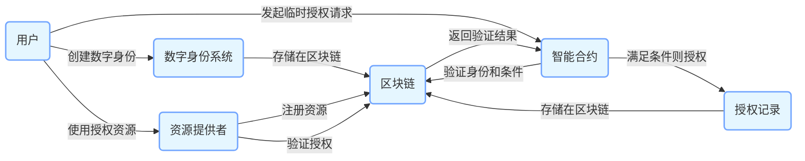

# 区块链在数字身份临时授权中的应用

> 关键词：区块链、数字身份、临时授权、智能合约、分布式账本

> 摘要：本文深入探讨了区块链技术在数字身份临时授权领域的应用。首先介绍了研究的背景、目的、预期读者和文档结构，明确了相关术语。接着阐述了区块链、数字身份和临时授权的核心概念及其联系，并给出了相应的原理和架构示意图。详细讲解了实现数字身份临时授权的核心算法原理，结合Python代码进行说明。通过数学模型和公式进一步剖析其内在逻辑，并举例说明。在项目实战部分，给出了开发环境搭建、源代码实现及解读。分析了区块链在数字身份临时授权中的实际应用场景，推荐了相关的学习资源、开发工具框架和论文著作。最后总结了未来发展趋势与挑战，解答了常见问题，并提供了扩展阅读和参考资料，旨在为该领域的研究和实践提供全面而深入的指导。

## 1. 背景介绍 
### 1.1 目的和范围
在当今数字化时代，数字身份的管理和使用变得至关重要。传统的数字身份管理方式存在诸多问题，如中心化管理带来的单点故障风险、数据易被篡改、用户隐私难以保障等。而临时授权作为数字身份使用中的一个常见需求，需要一种更加安全、可靠、灵活的解决方案。本研究旨在探讨区块链技术如何应用于数字身份临时授权，以解决传统方式的不足。研究范围涵盖了区块链技术的原理、数字身份临时授权的概念、相关算法和数学模型，以及实际应用场景和开发实践等方面。

### 1.2 预期读者
本文预期读者包括对区块链技术、数字身份管理感兴趣的技术人员，如程序员、软件架构师等；从事信息安全、隐私保护研究的学者；以及关注数字化转型和创新应用的企业管理者和决策者。

### 1.3 文档结构概述
本文首先介绍研究背景相关内容，为后续讨论奠定基础。接着阐述核心概念及其联系，帮助读者理解关键要素。详细讲解核心算法原理和操作步骤，结合Python代码加深理解。通过数学模型和公式进一步剖析内在逻辑。在项目实战部分，给出具体的开发步骤和代码解读。分析实际应用场景，为读者提供实践参考。推荐相关的学习资源、开发工具框架和论文著作，方便读者深入学习。最后总结未来发展趋势与挑战，解答常见问题，并提供扩展阅读和参考资料。

### 1.4 术语表
#### 1.4.1 核心术语定义
- **区块链（Blockchain）**：一种分布式账本技术，由一系列按时间顺序相连的区块组成，每个区块包含一定数量的交易信息，通过密码学技术保证数据的不可篡改和安全性。
- **数字身份（Digital Identity）**：指在数字世界中代表个人、组织或事物的唯一标识，包含一系列与身份相关的信息。
- **临时授权（Temporary Authorization）**：在特定时间段内，赋予特定主体对特定资源或服务的使用权限。
- **智能合约（Smart Contract）**：一种基于区块链的自动执行合约，其条款以代码形式存储在区块链上，当满足预设条件时自动执行。
- **分布式账本（Distributed Ledger）**：一种在多个节点之间共享、复制和同步的数据库，每个节点都保存着完整的账本副本。

#### 1.4.2 相关概念解释
- **公钥密码学（Public Key Cryptography）**：区块链中用于身份验证和数据加密的重要技术，使用一对密钥（公钥和私钥），公钥公开用于加密和验证签名，私钥由用户秘密保存用于签名和解密。
- **哈希函数（Hash Function）**：将任意长度的输入数据转换为固定长度的哈希值的函数，具有单向性和唯一性，用于保证数据的完整性和验证数据的一致性。
- **共识机制（Consensus Mechanism）**：区块链网络中节点达成一致的算法，确保所有节点对账本状态的共识，常见的共识机制有工作量证明（PoW）、权益证明（PoS）等。

#### 1.4.3 缩略词列表
- **PoW**：Proof of Work，工作量证明
- **PoS**：Proof of Stake，权益证明
- **PKI**：Public Key Infrastructure，公钥基础设施

## 2. 核心概念与联系 

### 核心概念原理
#### 区块链原理
区块链是一种去中心化的分布式账本技术，其核心原理基于密码学和分布式网络。区块链由一个个区块组成，每个区块包含前一个区块的哈希值、交易信息和时间戳等。通过哈希指针将各个区块连接成链，形成一个不可篡改的历史记录。区块链网络中的节点通过共识机制达成一致，确保账本的一致性和安全性。

#### 数字身份原理
数字身份是在数字世界中对实体的抽象表示，通常由一组属性和标识符组成。数字身份可以基于公钥密码学实现，用户拥有一对公私钥，公钥作为身份标识公开，私钥用于签名和证明身份。数字身份可以与用户的各种信息关联，如个人资料、信用记录等。

#### 临时授权原理
临时授权是在特定条件下赋予用户对特定资源或服务的使用权限。授权信息通常包含授权主体、被授权主体、授权资源、授权时间范围等。临时授权可以通过智能合约实现，当满足预设条件时，智能合约自动执行授权操作。

### 架构示意图


### 概念联系
区块链为数字身份和临时授权提供了安全、可靠的存储和管理平台。数字身份可以基于区块链的公钥基础设施实现，确保身份信息的不可篡改和隐私保护。临时授权可以通过智能合约在区块链上实现自动化执行，利用区块链的不可篡改特性保证授权记录的真实性和可靠性。数字身份是临时授权的基础，只有合法的数字身份才能发起和接受临时授权。临时授权则是数字身份在特定场景下的应用，通过授权机制实现对资源的安全访问。

## 3. 核心算法原理 & 具体操作步骤 

### 核心算法原理
在区块链数字身份临时授权中，主要涉及到身份验证算法和智能合约执行算法。

#### 身份验证算法
身份验证基于公钥密码学，用户使用私钥对消息进行签名，验证者使用公钥验证签名的有效性。以下是一个简单的Python示例，使用`ecdsa`库实现椭圆曲线数字签名算法（ECDSA）：

```python
import ecdsa
import hashlib

# 生成公私钥对
sk = ecdsa.SigningKey.generate(curve=ecdsa.SECP256k1)
vk = sk.get_verifying_key()

# 要签名的消息
message = b"Hello, World!"
message_hash = hashlib.sha256(message).digest()

# 签名
signature = sk.sign(message_hash)

# 验证签名
try:
    vk.verify(signature, message_hash)
    print("签名验证成功")
except ecdsa.BadSignatureError:
    print("签名验证失败")
```

#### 智能合约执行算法
智能合约是一段自动执行的代码，在区块链上运行。当满足预设条件时，智能合约自动执行相应的操作。以下是一个简单的Python示例，模拟智能合约实现临时授权：

```python
class TemporaryAuthorizationContract:
    def __init__(self, authorized_user, resource, start_time, end_time):
        self.authorized_user = authorized_user
        self.resource = resource
        self.start_time = start_time
        self.end_time = end_time
        self.is_authorized = False

    def check_authorization(self, user, current_time):
        if user == self.authorized_user and self.start_time <= current_time <= self.end_time:
            self.is_authorized = True
        else:
            self.is_authorized = False
        return self.is_authorized

# 使用示例
authorized_user = "user123"
resource = "resourceA"
start_time = 1630435200  # 示例时间戳
end_time = 1630521600
contract = TemporaryAuthorizationContract(authorized_user, resource, start_time, end_time)

current_user = "user123"
current_time = 1630450000
result = contract.check_authorization(current_user, current_time)
print(f"是否授权: {result}")
```

### 具体操作步骤
1. **数字身份创建**：用户使用公钥密码学生成公私钥对，公钥作为数字身份标识。用户可以将数字身份信息（如公钥、个人资料等）存储在区块链上。
2. **资源注册**：资源提供者将资源信息（如资源名称、描述等）注册到区块链上，并关联相应的访问规则。
3. **临时授权请求**：用户向智能合约发起临时授权请求，提供授权主体、被授权主体、授权资源、授权时间范围等信息。
4. **智能合约验证**：智能合约验证用户身份和授权条件，查询区块链上的数字身份信息和资源访问规则。
5. **授权执行**：如果验证通过，智能合约将授权信息记录到区块链上，并更新授权状态。
6. **资源访问**：被授权用户在授权时间范围内访问资源，资源提供者验证授权信息，查询区块链上的授权记录。

## 4. 数学模型和公式 & 详细讲解 & 举例说明 

### 数字签名数学模型
数字签名基于椭圆曲线密码学（ECC），以ECDSA为例。设椭圆曲线 $E$ 定义在有限域 $\mathbb{F}_p$ 上，$G$ 是曲线 $E$ 上的一个基点，阶为 $n$。用户的私钥 $d$ 是一个随机整数，$1 < d < n$，公钥 $Q = dG$。

#### 签名过程
1. 计算消息 $m$ 的哈希值 $h = H(m)$，其中 $H$ 是哈希函数。
2. 选择一个随机整数 $k$，$1 < k < n$。
3. 计算点 $(x_1, y_1) = kG$。
4. 计算 $r = x_1 \bmod n$，如果 $r = 0$，则重新选择 $k$。
5. 计算 $s = k^{-1}(h + dr) \bmod n$，如果 $s = 0$，则重新选择 $k$。
6. 签名为 $(r, s)$。

#### 验证过程
1. 计算消息 $m$ 的哈希值 $h = H(m)$。
2. 计算 $w = s^{-1} \bmod n$。
3. 计算 $u_1 = hw \bmod n$ 和 $u_2 = rw \bmod n$。
4. 计算点 $(x_1, y_1) = u_1G + u_2Q$。
5. 计算 $v = x_1 \bmod n$。
6. 如果 $v = r$，则签名验证成功。

### 智能合约条件判断公式
设授权用户为 $U$，资源为 $R$，授权开始时间为 $t_s$，结束时间为 $t_e$，当前时间为 $t$。智能合约的授权条件可以表示为：

$$
\text{Authorized} = 
\begin{cases}
\text{True}, & \text{if } U = U_{authorized} \text{ and } t_s \leq t \leq t_e \\
\text{False}, & \text{otherwise}
\end{cases}
$$

### 举例说明
假设用户 $A$ 的私钥 $d = 12345$，公钥 $Q = dG$。用户 $A$ 要对消息 $m = "Hello, World!"$ 进行签名。

1. 计算哈希值 $h = H(m) = \text{SHA256}(m)$。
2. 选择随机整数 $k = 67890$。
3. 计算 $(x_1, y_1) = kG$，$r = x_1 \bmod n$。
4. 计算 $s = k^{-1}(h + dr) \bmod n$。
5. 得到签名 $(r, s)$。

验证者使用公钥 $Q$ 对签名进行验证，按照上述验证过程计算 $v$，如果 $v = r$，则签名验证成功。

对于智能合约，假设授权用户为 $U_{authorized} = "userA"$，资源为 $R = "resource1"$，授权开始时间 $t_s = 1630435200$，结束时间 $t_e = 1630521600$。当用户 $U = "userA"$ 在时间 $t = 1630450000$ 访问资源时，满足 $U = U_{authorized}$ 且 $t_s \leq t \leq t_e$，智能合约返回授权结果为 $\text{True}$。

## 5. 项目实战：代码实际案例和详细解释说明 

### 5.1  开发环境搭建
#### 安装Python
首先需要安装Python，建议使用Python 3.7及以上版本。可以从Python官方网站（https://www.python.org/downloads/）下载安装包进行安装。

#### 安装必要的库
使用`pip`安装所需的库，包括`ecdsa`用于数字签名，`web3`用于与区块链交互。

```bash
pip install ecdsa web3
```

#### 搭建区块链环境
可以使用以太坊测试网络（如Ropsten、Rinkeby等）进行开发测试。需要安装以太坊客户端（如Geth），并配置好节点。

### 5.2  源代码详细实现和代码解读
以下是一个完整的Python示例，实现了数字身份临时授权的基本功能：

```python
import ecdsa
import hashlib
from web3 import Web3

# 连接到以太坊测试网络
w3 = Web3(Web3.HTTPProvider('https://ropsten.infura.io/v3/YOUR_INFURA_PROJECT_ID'))

# 生成公私钥对
sk = ecdsa.SigningKey.generate(curve=ecdsa.SECP256k1)
vk = sk.get_verifying_key()
private_key = sk.to_string().hex()
public_key = vk.to_string().hex()

# 数字身份信息
user_id = hashlib.sha256(public_key.encode()).hexdigest()

# 资源信息
resource = "resourceA"

# 临时授权信息
start_time = 1630435200
end_time = 1630521600

# 智能合约代码（简化示例）
contract_code = f"""
pragma solidity ^0.8.0;

contract TemporaryAuthorization {{
    address public authorizedUser;
    string public resource;
    uint256 public startTime;
    uint256 public endTime;

    constructor(address _authorizedUser, string memory _resource, uint256 _startTime, uint256 _endTime) {{
        authorizedUser = _authorizedUser;
        resource = _resource;
        startTime = _startTime;
        endTime = _endTime;
    }}

    function checkAuthorization() public view returns (bool) {{
        return (msg.sender == authorizedUser && block.timestamp >= startTime && block.timestamp <= endTime);
    }}
}}
"""

# 编译智能合约
from solcx import compile_standard
compiled_sol = compile_standard({
    "language": "Solidity",
    "sources": {
        "TemporaryAuthorization.sol": {
            "content": contract_code
        }
    },
    "settings": {
        "outputSelection": {
            "*": {
                "*": ["abi", "evm.bytecode"]
            }
        }
    }
})

# 获取合约ABI和字节码
abi = compiled_sol['contracts']['TemporaryAuthorization.sol']['TemporaryAuthorization']['abi']
bytecode = compiled_sol['contracts']['TemporaryAuthorization.sol']['TemporaryAuthorization']['evm']['bytecode']['object']

# 创建合约实例
account = w3.eth.account.from_key(private_key)
contract = w3.eth.contract(abi=abi, bytecode=bytecode)

# 部署合约
transaction = contract.constructor(account.address, resource, start_time, end_time).buildTransaction({
    'chainId': w3.eth.chain_id,
    'gas': 1000000,
    'gasPrice': w3.eth.gas_price,
    'nonce': w3.eth.getTransactionCount(account.address)
})

# 签名交易
signed_txn = w3.eth.account.signTransaction(transaction, private_key)

# 发送交易
tx_hash = w3.eth.sendRawTransaction(signed_txn.rawTransaction)
tx_receipt = w3.eth.waitForTransactionReceipt(tx_hash)

# 获取部署的合约地址
contract_address = tx_receipt.contractAddress

# 创建已部署合约的实例
deployed_contract = w3.eth.contract(address=contract_address, abi=abi)

# 检查授权
is_authorized = deployed_contract.functions.checkAuthorization().call({'from': account.address})
print(f"是否授权: {is_authorized}")
```

### 5.3  代码解读与分析
1. **连接到以太坊测试网络**：使用`web3`库连接到以太坊测试网络，需要提供Infura项目ID。
2. **生成公私钥对**：使用`ecdsa`库生成椭圆曲线公私钥对，用于数字身份标识和签名。
3. **定义数字身份和资源信息**：使用公钥的哈希值作为用户ID，定义要授权的资源。
4. **编写智能合约代码**：使用Solidity编写智能合约，实现临时授权的逻辑。
5. **编译智能合约**：使用`solcx`库编译Solidity代码，获取合约的ABI和字节码。
6. **部署合约**：创建合约实例，构建部署交易，签名并发送交易，等待交易确认。
7. **检查授权**：调用合约的`checkAuthorization`函数，检查当前用户是否被授权。

## 6. 实际应用场景 
### 共享经济领域
在共享经济中，如共享单车、共享汽车等，用户需要临时使用共享资源。通过区块链数字身份临时授权，平台可以确保只有授权用户在授权时间内使用资源。例如，用户使用数字身份发起租车请求，平台通过智能合约授予用户临时使用车辆的权限，车辆的解锁和使用状态可以记录在区块链上，保证交易的透明和安全。

### 企业内部资源访问
企业内部有许多敏感资源，如文件、数据库等。员工可能需要临时访问某些资源，通过区块链数字身份临时授权，企业可以精确控制员工的访问权限和时间。例如，项目团队成员在项目期间被授予临时访问项目相关文件的权限，项目结束后权限自动撤销。

### 活动票务管理
在活动票务管理中，区块链数字身份临时授权可以用于实现电子票务的安全验证和使用。主办方可以将票务信息存储在区块链上，用户使用数字身份购买门票，获得临时入场权限。在活动现场，通过验证用户的数字身份和授权信息，确保只有合法持票人入场。

### 医疗数据共享
在医疗领域，患者的医疗数据需要严格保护。当患者需要将自己的医疗数据共享给特定的医疗机构或医生时，可以通过区块链数字身份临时授权实现。患者使用数字身份发起授权请求，指定授权的医疗机构和时间范围，医疗机构在授权时间内可以访问患者的医疗数据。

## 7. 工具和资源推荐
### 7.1 学习资源推荐
#### 7.1.1 书籍推荐
- 《区块链技术指南》：全面介绍了区块链的技术原理、架构和应用场景，适合初学者入门。
- 《以太坊实战》：详细讲解了以太坊的开发和应用，包括智能合约的编写和部署。
- 《数字身份：概念、技术与应用》：深入探讨了数字身份的相关概念、技术和应用案例。

#### 7.1.2 在线课程
- Coursera上的“区块链基础”课程：由知名教授授课，系统介绍区块链的基本原理和技术。
- Udemy上的“以太坊智能合约开发实战”课程：通过实际项目案例，学习以太坊智能合约的开发。
- edX上的“数字身份与隐私保护”课程：讲解数字身份的管理和隐私保护技术。

#### 7.1.3 技术博客和网站
- Medium：有许多区块链和数字身份领域的技术博客，提供最新的技术动态和实践经验。
- Bitcoin Magazine：专注于比特币和区块链技术的报道和分析。
- Identity Woman：关注数字身份和隐私保护的专业网站，提供行业研究和观点。

### 7.2 开发工具框架推荐
#### 7.2.1 IDE和编辑器
- Remix：基于网页的以太坊智能合约开发IDE，支持Solidity代码的编写、编译和调试。
- Visual Studio Code：功能强大的代码编辑器，通过安装相关插件可以支持区块链开发。
- Truffle Suite：以太坊开发框架，提供项目管理、合约编译、部署和测试等功能。

#### 7.2.2 调试和性能分析工具
- Ganache：以太坊本地开发环境，用于快速搭建测试网络，方便调试智能合约。
- Solidity Linter：用于检查Solidity代码的语法和风格错误，提高代码质量。
- Web3.js和Web3.py：用于与以太坊区块链交互的JavaScript和Python库，方便进行开发和调试。

#### 7.2.3 相关框架和库
- Hyperledger Fabric：企业级区块链平台，提供灵活的架构和丰富的组件，适合开发企业级应用。
- Corda：专注于金融领域的区块链平台，支持分布式账本的开发和部署。
- Indy SDK：用于构建分布式身份管理系统的开源工具包，提供数字身份的创建、管理和验证功能。

### 7.3 相关论文著作推荐
#### 7.3.1 经典论文
- “Bitcoin: A Peer-to-Peer Electronic Cash System”：比特币的白皮书，提出了区块链的基本概念和实现原理。
- “Ethereum: A Next-Generation Smart Contract and Decentralized Application Platform”：以太坊的白皮书，介绍了以太坊的智能合约和去中心化应用平台。
- “A Secure and Privacy-Preserving Identity Management Scheme Based on Blockchain”：提出了一种基于区块链的安全隐私保护身份管理方案。

#### 7.3.2 最新研究成果
- 关注ACM、IEEE等学术会议和期刊上发表的关于区块链和数字身份的研究论文，了解最新的技术进展和研究成果。
- 查阅知名研究机构（如MIT Media Lab、Stanford Blockchain Lab等）发布的研究报告和技术文档。

#### 7.3.3 应用案例分析
- 分析国内外区块链数字身份临时授权的实际应用案例，了解其实现方法、技术架构和应用效果。可以参考相关企业的官方网站、技术博客和行业报告。

## 8. 总结：未来发展趋势与挑战
### 未来发展趋势
- **标准化和互操作性**：随着区块链数字身份临时授权的应用越来越广泛，标准化和互操作性将变得至关重要。不同的区块链平台和数字身份系统之间需要实现互联互通，以便用户在不同场景下方便地使用数字身份和临时授权。
- **与其他技术的融合**：区块链将与人工智能、物联网、大数据等技术深度融合，为数字身份临时授权带来更多的应用场景和创新模式。例如，通过人工智能技术实现更智能的授权决策，通过物联网设备实现更便捷的身份验证和授权操作。
- **行业应用拓展**：除了现有的共享经济、企业内部资源访问等领域，区块链数字身份临时授权将在更多行业得到应用，如教育、金融、政务等。例如，在教育领域，学生可以使用数字身份临时授权访问在线学习资源；在金融领域，客户可以通过临时授权进行安全的交易操作。

### 挑战
- **技术性能问题**：区块链技术目前还存在性能瓶颈，如交易处理速度慢、存储成本高。在大规模应用数字身份临时授权时，需要解决这些技术性能问题，以满足实际业务的需求。
- **法律和监管问题**：区块链数字身份临时授权涉及到用户隐私、数据安全等法律和监管问题。不同国家和地区的法律和监管政策存在差异，需要建立健全相关的法律和监管框架，确保技术的合法合规应用。
- **用户认知和接受度**：用户对区块链数字身份临时授权的认知和接受度还比较低。需要加强宣传和教育，提高用户对数字身份安全和隐私保护的意识，促进用户积极使用区块链数字身份临时授权技术。

## 9. 附录：常见问题与解答
### 1. 区块链数字身份临时授权与传统授权方式有什么区别？
区块链数字身份临时授权具有去中心化、不可篡改、安全可靠等特点。与传统授权方式相比，它不需要依赖中心化的机构进行管理，授权记录可以永久保存在区块链上，保证了授权信息的真实性和可靠性。同时，区块链的加密技术可以更好地保护用户的隐私和数据安全。

### 2. 如何保证区块链上数字身份信息的安全性？
区块链使用公钥密码学和哈希函数等加密技术来保证数字身份信息的安全性。用户的私钥由用户自己保管，只有使用私钥才能对身份信息进行签名和验证。同时，区块链的分布式账本特性使得数据在多个节点上备份，即使部分节点被攻击，也不会影响整个系统的安全性。

### 3. 智能合约出现漏洞怎么办？
智能合约的漏洞可能会导致严重的安全问题。为了避免智能合约出现漏洞，需要在开发过程中进行严格的代码审查和测试。可以使用形式化验证工具对智能合约进行验证，确保其逻辑的正确性。同时，在部署智能合约后，需要对其进行持续的监控和维护，及时发现和修复漏洞。

### 4. 区块链数字身份临时授权的成本高吗？
区块链数字身份临时授权的成本主要包括区块链网络的使用成本（如交易手续费）和开发成本。随着区块链技术的发展和成熟，交易手续费逐渐降低，开发成本也在不断下降。同时，区块链数字身份临时授权可以提高业务效率，降低管理成本，从长期来看，具有较好的经济效益。

## 10. 扩展阅读 & 参考资料
### 扩展阅读
- 《区块链革命：比特币底层技术如何改变货币、商业和世界》
- 《数字信任：从个人隐私到全球商业的未来》
- 《区块链应用开发实战》

### 参考资料
- Bitcoin whitepaper: https://bitcoin.org/bitcoin.pdf
- Ethereum whitepaper: https://ethereum.org/en/whitepaper/
- Hyperledger Fabric documentation: https://hyperledger-fabric.readthedocs.io/en/latest/
- Indy SDK documentation: https://github.com/hyperledger/indy-sdk

作者：AI天才研究院/AI Genius Institute & 禅与计算机程序设计艺术 /Zen And The Art of Computer Programming