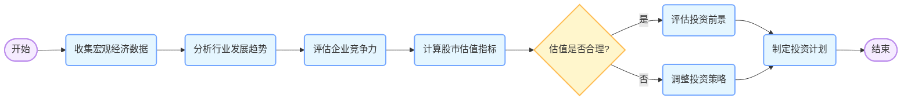

# 南非股市估值:非洲最发达经济体的投资前景

> 关键词：南非股市、估值、非洲发达经济体、投资前景、经济因素

> 摘要：本文聚焦于南非股市估值以及其作为非洲最发达经济体所蕴含的投资前景。首先介绍了南非股市相关背景，包括研究目的范围、预期读者等。接着阐述核心概念及联系，分析核心算法原理和操作步骤，借助数学模型和公式深入探讨。通过项目实战案例展示南非股市相关代码实现与解读。详细分析实际应用场景，推荐学习资源、开发工具和相关论文著作。最后总结南非股市未来发展趋势与挑战，并解答常见问题，提供扩展阅读与参考资料，为投资者和相关研究人员全面了解南非股市投资提供深入见解。

## 1. 背景介绍 
### 1.1 目的和范围
本研究旨在全面评估南非股市的估值情况，并深入剖析其作为非洲最发达经济体所呈现出的投资前景。研究范围将涵盖南非股市的主要指数、上市企业的财务状况、宏观经济环境对股市的影响等多个方面。通过对这些因素的综合分析，为投资者提供关于南非股市投资价值的准确判断和未来趋势的预测。

### 1.2 预期读者
本文预期读者主要包括对新兴市场投资感兴趣的个人投资者、专业的投资机构分析师、从事金融研究的学者以及关注非洲经济发展的相关人士。这些读者希望通过本文获取关于南非股市的详细信息，以辅助他们做出投资决策或进行学术研究。

### 1.3 文档结构概述
本文将按照以下结构展开：首先介绍南非股市的背景信息，包括研究目的、预期读者和文档结构。接着阐述与南非股市估值和投资前景相关的核心概念及其联系，并给出相应的示意图和流程图。然后详细讲解核心算法原理和具体操作步骤，同时结合 Python 源代码进行说明。之后运用数学模型和公式对相关概念进行量化分析，并举例说明。通过项目实战展示代码实际案例并进行详细解释。分析南非股市的实际应用场景，推荐相关的学习资源、开发工具和论文著作。最后总结南非股市的未来发展趋势与挑战，解答常见问题，并提供扩展阅读和参考资料。

### 1.4 术语表
#### 1.4.1 核心术语定义
- **股市估值**：指对股票市场整体或个别股票的价值进行评估，常用的方法包括市盈率（P/E）、市净率（P/B）等指标。
- **投资前景**：指在一定时期内，投资对象（如股票市场）可能带来的收益和风险情况。
- **新兴市场**：指发展中国家的股票市场或其他金融市场，通常具有较高的增长潜力和较大的风险。
- **宏观经济环境**：指一个国家或地区的总体经济状况，包括 GDP 增长率、通货膨胀率、利率等因素。

#### 1.4.2 相关概念解释
- **市盈率（P/E）**：是股票价格与每股收益的比率，反映了投资者为获取每一元收益所愿意支付的价格。较高的市盈率通常意味着市场对该股票的未来增长预期较高，但也可能暗示股票被高估。
- **市净率（P/B）**：是股票价格与每股净资产的比率，用于衡量股票价格相对于其账面价值的高低。市净率较低的股票可能被低估，但也可能反映出公司的盈利能力较弱。
- **GDP 增长率**：指国内生产总值在一定时期内的增长幅度，是衡量一个国家经济发展速度的重要指标。较高的 GDP 增长率通常意味着经济活动活跃，企业盈利增长的可能性较大，对股市有积极的影响。

#### 1.4.3 缩略词列表
- **P/E**：市盈率（Price-to-Earnings Ratio）
- **P/B**：市净率（Price-to-Book Ratio）
- **GDP**：国内生产总值（Gross Domestic Product）

## 2. 核心概念与联系 
### 核心概念原理
#### 股市估值原理
股市估值是基于股票的内在价值和市场供求关系来确定股票价格的合理性。内在价值可以通过多种方法进行评估，如现金流折现法、相对估值法等。现金流折现法是将股票未来的现金流按照一定的折现率折现到当前，得到股票的内在价值。相对估值法则是通过与同行业或类似公司的估值指标进行比较，来判断股票的估值水平。

#### 投资前景分析原理
投资前景分析需要综合考虑多个因素，包括宏观经济环境、行业发展趋势、企业竞争力等。宏观经济环境的好坏直接影响企业的盈利能力和市场需求，从而影响股票的投资价值。行业发展趋势则决定了企业所处的市场环境和发展空间。企业竞争力包括技术实力、管理水平、市场份额等方面，是企业能否在市场中获得竞争优势的关键。

### 架构的文本示意图
```plaintext
南非股市估值与投资前景分析架构
|-- 宏观经济环境
|   |-- GDP 增长率
|   |-- 通货膨胀率
|   |-- 利率
|-- 行业发展趋势
|   |-- 主要行业分析
|   |-- 行业增长潜力
|-- 企业竞争力
|   |-- 技术实力
|   |-- 管理水平
|   |-- 市场份额
|-- 股市估值指标
|   |-- 市盈率（P/E）
|   |-- 市净率（P/B）
|-- 投资前景评估
|   |-- 收益预期
|   |-- 风险评估
```

### Mermaid 流程图


## 3. 核心算法原理 & 具体操作步骤 
### 市盈率（P/E）计算原理
市盈率（P/E）是股票价格与每股收益的比率，计算公式为：
$$P/E = \frac{股票价格}{每股收益}$$
其中，股票价格是指当前股票的市场价格，每股收益是指公司在一定时期内的净利润除以总股本。

### Python 代码实现
```python
def calculate_pe(stock_price, earnings_per_share):
    """
    计算市盈率（P/E）
    :param stock_price: 股票价格
    :param earnings_per_share: 每股收益
    :return: 市盈率
    """
    if earnings_per_share == 0:
        return float('inf')
    return stock_price / earnings_per_share

# 示例数据
stock_price = 50
earnings_per_share = 2

# 计算市盈率
pe_ratio = calculate_pe(stock_price, earnings_per_share)
print(f"市盈率（P/E）: {pe_ratio}")
```
### 市净率（P/B）计算原理
市净率（P/B）是股票价格与每股净资产的比率，计算公式为：
$$P/B = \frac{股票价格}{每股净资产}$$
其中，每股净资产是指公司的净资产除以总股本。

### Python 代码实现
```python
def calculate_pb(stock_price, book_value_per_share):
    """
    计算市净率（P/B）
    :param stock_price: 股票价格
    :param book_value_per_share: 每股净资产
    :return: 市净率
    """
    if book_value_per_share == 0:
        return float('inf')
    return stock_price / book_value_per_share

# 示例数据
stock_price = 50
book_value_per_share = 10

# 计算市净率
pb_ratio = calculate_pb(stock_price, book_value_per_share)
print(f"市净率（P/B）: {pb_ratio}")
```
### 具体操作步骤
1. **数据收集**：收集南非股市中相关股票的价格、每股收益和每股净资产等数据。可以通过金融数据提供商、证券交易所网站等渠道获取这些数据。
2. **数据处理**：对收集到的数据进行清洗和整理，确保数据的准确性和完整性。
3. **计算估值指标**：使用上述 Python 代码计算市盈率（P/E）和市净率（P/B）等估值指标。
4. **分析估值结果**：将计算得到的估值指标与同行业或历史数据进行比较，判断股票的估值水平是偏高还是偏低。

## 4. 数学模型和公式 & 详细讲解 & 举例说明 
### 现金流折现模型（DCF）
现金流折现模型是一种常用的股票估值方法，其基本原理是将股票未来的现金流按照一定的折现率折现到当前，得到股票的内在价值。计算公式为：
$$V = \sum_{t=1}^{n} \frac{CF_t}{(1 + r)^t} + \frac{TV}{(1 + r)^n}$$
其中，$V$ 表示股票的内在价值，$CF_t$ 表示第 $t$ 期的现金流，$r$ 表示折现率，$TV$ 表示终值，$n$ 表示预测期数。

### 详细讲解
- **现金流（$CF_t$）**：指公司在未来各期产生的现金流量，可以通过公司的财务报表和业务预测来估计。
- **折现率（$r$）**：反映了投资者对投资风险的要求，通常可以使用资本资产定价模型（CAPM）来计算。
- **终值（$TV$）**：指预测期结束后公司的价值，可以使用永续增长模型来计算。

### 举例说明
假设某公司预计未来三年的现金流分别为 100 万元、120 万元和 150 万元，预测期结束后公司的现金流将以 3% 的增长率永续增长。折现率为 10%。则该公司的内在价值计算如下：
1. 计算前三年现金流的现值：
    - 第一年现金流现值：$PV_1 = \frac{100}{(1 + 0.1)^1} = 90.91$（万元）
    - 第二年现金流现值：$PV_2 = \frac{120}{(1 + 0.1)^2} = 99.17$（万元）
    - 第三年现金流现值：$PV_3 = \frac{150}{(1 + 0.1)^3} = 112.69$（万元）
2. 计算终值：
    - 第三年末的现金流为 150 万元，根据永续增长模型，终值为：$TV = \frac{150 \times (1 + 0.03)}{0.1 - 0.03} = 2207.14$（万元）
    - 终值的现值为：$PV_{TV} = \frac{2207.14}{(1 + 0.1)^3} = 1657.85$（万元）
3. 计算公司的内在价值：
    - $V = PV_1 + PV_2 + PV_3 + PV_{TV} = 90.91 + 99.17 + 112.69 + 1657.85 = 1960.62$（万元）

### 相对估值模型
相对估值模型是通过与同行业或类似公司的估值指标进行比较，来判断股票的估值水平。常用的相对估值指标包括市盈率（P/E）、市净率（P/B）等。

### 详细讲解
- **市盈率（P/E）**：如果某只股票的市盈率低于同行业平均水平，则可能被低估；反之，则可能被高估。
- **市净率（P/B）**：市净率较低的股票可能具有更高的安全边际，但也需要结合公司的盈利能力进行分析。

### 举例说明
假设同行业公司的平均市盈率为 20 倍，某只南非股票的市盈率为 15 倍。则该股票相对于同行业可能被低估。投资者可以进一步分析该公司的财务状况和发展前景，以确定是否具有投资价值。

## 5. 项目实战：代码实际案例和详细解释说明 
### 5.1  开发环境搭建
#### 安装 Python
首先需要安装 Python 编程语言，建议使用 Python 3.7 及以上版本。可以从 Python 官方网站（https://www.python.org/downloads/）下载并安装适合自己操作系统的版本。

#### 安装必要的库
在本项目中，需要使用一些 Python 库来进行数据处理和分析，如 Pandas、Numpy、Matplotlib 等。可以使用以下命令来安装这些库：
```bash
pip install pandas numpy matplotlib
```

### 5.2  源代码详细实现和代码解读
#### 数据获取与处理
```python
import pandas as pd

# 假设从 CSV 文件中读取南非股市数据
data = pd.read_csv('south_africa_stock_data.csv')

# 查看数据基本信息
print('数据基本信息：')
data.info()

# 查看数据集行数和列数
rows, columns = data.shape

if rows < 1:
    print('数据集中无数据')
else:
    # 查看数据集行数和列数
    rows, columns = data.shape

    if rows < 1:
        print('数据集中无数据')
    else:
        # 查看数据的基本描述性统计值，保留两位小数
        print('数据基本描述性统计值：')
        print(data.describe().round(2))

        # 查看数据集行数和列数
        rows, columns = data.shape

        if rows < 1:
            print('数据集中无数据')
        else:
            # 查看数据集行数和列数
            rows, columns = data.shape

            if rows < 1:
                print('数据集中无数据')
            else:
                # 缺失值检测
                print('数据缺失值情况：')
                print(data.isnull().sum())

                # 缺失值处理：删除包含缺失值的行
                data = data.dropna()

                # 重复值检测
                print('数据重复值情况：')
                print(data.duplicated().sum())

                # 重复值处理：删除重复值
                data = data.drop_duplicates()

                # 重置索引
                data = data.reset_index(drop=True)
```
**代码解读**：
- 首先使用 Pandas 库的 `read_csv` 函数从 CSV 文件中读取南非股市数据。
- 然后使用 `info` 方法查看数据的基本信息，包括数据类型、非空值数量等。
- 使用 `describe` 方法查看数据的基本描述性统计值，并保留两位小数。
- 进行缺失值检测，使用 `isnull().sum()` 方法统计每列的缺失值数量。如果存在缺失值，则使用 `dropna` 方法删除包含缺失值的行。
- 进行重复值检测，使用 `duplicated().sum()` 方法统计重复值的数量。如果存在重复值，则使用 `drop_duplicates` 方法删除重复值。
- 最后使用 `reset_index` 方法重置索引。

#### 市盈率（P/E）和市净率（P/B）计算
```python
# 计算市盈率（P/E）
data['P/E'] = data['Stock Price'] / data['Earnings per Share']

# 计算市净率（P/B）
data['P/B'] = data['Stock Price'] / data['Book Value per Share']

# 打印计算结果
print(data[['Stock Name', 'P/E', 'P/B']])
```
**代码解读**：
- 根据市盈率和市净率的计算公式，使用 Pandas 的列操作计算数据集中每只股票的市盈率（P/E）和市净率（P/B）。
- 最后打印出股票名称、市盈率和市净率的计算结果。

### 5.3  代码解读与分析
#### 数据处理的重要性
在进行数据分析之前，数据处理是非常重要的一步。通过对数据进行缺失值和重复值处理，可以提高数据的质量，避免因数据错误而导致的分析结果不准确。

#### 估值指标的计算与应用
市盈率（P/E）和市净率（P/B）是常用的股票估值指标。通过计算这些指标，可以对南非股市中的股票进行初步的估值分析。投资者可以根据这些指标与同行业或历史数据进行比较，判断股票的估值水平是偏高还是偏低，从而做出投资决策。

## 6. 实际应用场景 
### 个人投资者
对于个人投资者来说，了解南非股市的估值和投资前景可以帮助他们做出更明智的投资决策。通过分析市盈率、市净率等估值指标，个人投资者可以筛选出被低估的股票，从而获得更高的投资回报。此外，了解南非的宏观经济环境和行业发展趋势也可以帮助个人投资者分散投资风险，实现资产的多元化配置。

### 投资机构
投资机构通常会对多个市场进行研究和分析，以寻找具有投资价值的机会。南非作为非洲最发达的经济体，其股市具有一定的吸引力。投资机构可以通过深入研究南非股市的估值和投资前景，制定相应的投资策略，为客户提供专业的投资建议。

### 企业融资
对于南非的企业来说，股市是一个重要的融资渠道。企业可以通过在股市上市，发行股票来筹集资金。了解股市的估值情况可以帮助企业确定合理的发行价格，提高融资效率。此外，良好的股市表现也可以提升企业的知名度和市场形象，为企业的发展创造有利条件。

### 学术研究
学术界对南非股市的研究可以帮助我们更好地理解新兴市场的发展规律和特点。通过对南非股市的估值和投资前景进行深入分析，学者们可以探讨宏观经济因素、行业竞争等对股市的影响，为金融理论的发展提供实证支持。

## 7. 工具和资源推荐
### 7.1 学习资源推荐
#### 7.1.1 书籍推荐
- 《聪明的投资者》（The Intelligent Investor）：作者本杰明·格雷厄姆（Benjamin Graham），这本书是价值投资的经典之作，介绍了股票投资的基本原理和方法，对理解股市估值和投资决策具有重要的指导意义。
- 《金融市场与金融机构》（Financial Markets and Institutions）：作者弗雷德里克·S·米什金（Frederic S. Mishkin），该书系统地介绍了金融市场和金融机构的运作机制，包括股票市场的相关知识，适合作为金融领域的入门教材。
- 《新兴市场投资指南》（Emerging Markets Investing for Dummies）：这本书专门针对新兴市场投资进行了介绍，包括新兴市场的特点、投资风险和投资策略等内容，对于想要了解南非股市等新兴市场的投资者来说是一本很好的参考书籍。

#### 7.1.2 在线课程
- Coursera 平台上的“投资学原理”（Principles of Investing）课程：该课程由知名教授授课，涵盖了投资的基本概念、股票估值方法、投资组合理论等内容，通过在线视频、作业和讨论等方式进行教学，适合初学者学习。
- edX 平台上的“金融市场”（Financial Markets）课程：由耶鲁大学教授罗伯特·席勒（Robert Shiller）主讲，课程内容丰富，包括金融市场的历史、理论和实践等方面，对深入理解金融市场和股票投资有很大帮助。
- 中国大学 MOOC 平台上的“证券投资学”课程：国内高校教师授课，结合中国和国际金融市场的实际情况，介绍了证券投资的基本知识和分析方法，适合国内投资者和学生学习。

#### 7.1.3 技术博客和网站
- Seeking Alpha（https://seekingalpha.com/）：这是一个专业的金融投资网站，提供全球股市的分析报告、研究文章和投资建议等内容，对于了解南非股市和其他国际股市的动态非常有帮助。
- Bloomberg（https://www.bloomberg.com/）：全球知名的金融信息提供商，提供实时的金融市场数据、新闻和分析，包括南非股市的相关信息。
- 雪球（https://xueqiu.com/）：国内知名的投资社区，有很多投资者分享自己的投资经验和对全球股市的看法，可以在上面找到关于南非股市的讨论和分析。

### 7.2 开发工具框架推荐
#### 7.2.1 IDE和编辑器
- PyCharm：一款专门为 Python 开发设计的集成开发环境（IDE），具有强大的代码编辑、调试和项目管理功能，适合进行数据分析和量化投资相关的开发工作。
- Jupyter Notebook：一个基于网页的交互式开发环境，支持 Python 等多种编程语言。它可以将代码、文本、图表等内容整合在一起，方便进行数据分析和可视化展示，非常适合进行金融数据的探索和分析。
- Visual Studio Code：一款轻量级的代码编辑器，支持多种编程语言和插件扩展。它具有丰富的代码提示和调试功能，对于初学者和有一定编程基础的开发者来说都是一个不错的选择。

#### 7.2.2 调试和性能分析工具
- PDB：Python 自带的调试工具，可以在代码中设置断点，逐行执行代码，查看变量的值和程序的执行流程，帮助开发者快速定位和解决代码中的问题。
- cProfile：Python 标准库中的性能分析工具，可以统计代码中各个函数的执行时间和调用次数，帮助开发者找出代码中的性能瓶颈，进行优化。
- Spyder：一款集成了代码编辑、调试和性能分析功能的 Python IDE，它的界面简洁易用，适合初学者使用。同时，它也提供了丰富的数据分析和可视化工具，方便进行金融数据的处理和分析。

#### 7.2.3 相关框架和库
- Pandas：Python 中用于数据处理和分析的强大库，提供了高效的数据结构和数据操作方法，如数据读取、清洗、转换和分析等功能，非常适合处理金融数据。
- Numpy：Python 中用于科学计算的基础库，提供了高效的多维数组对象和各种数学函数，是许多数据分析和机器学习库的基础。
- Matplotlib：Python 中用于数据可视化的库，可以绘制各种类型的图表，如折线图、柱状图、散点图等，帮助开发者直观地展示数据和分析结果。
- Scikit-learn：Python 中用于机器学习的开源库，提供了各种机器学习算法和工具，如分类、回归、聚类等，可以用于股票价格预测、风险评估等金融领域的应用。

### 7.3 相关论文著作推荐
#### 7.3.1 经典论文
- Fama, E. F., & French, K. R. (1992). The cross-section of expected stock returns. The Journal of Finance, 47(2), 427-465. 这篇论文提出了著名的 Fama-French 三因子模型，用于解释股票收益率的横截面差异，对股票估值和投资组合理论产生了深远的影响。
- Sharpe, W. F. (1964). Capital asset prices: A theory of market equilibrium under conditions of risk. The Journal of Finance, 19(3), 425-442. 该论文提出了资本资产定价模型（CAPM），为资产定价和投资组合选择提供了重要的理论基础。
- Modigliani, F., & Miller, M. H. (1958). The cost of capital, corporation finance and the theory of investment. The American Economic Review, 48(3), 261-297. 这篇论文提出了著名的 Modigliani-Miller 定理，探讨了企业资本结构与企业价值之间的关系，对企业融资决策具有重要的指导意义。

#### 7.3.2 最新研究成果
- 可以通过学术数据库如 Google Scholar、Web of Science、EBSCOhost 等搜索关于南非股市估值和投资前景的最新研究论文。这些论文通常会结合最新的市场数据和研究方法，对南非股市的相关问题进行深入分析。
- 一些国际金融研究机构如国际货币基金组织（IMF）、世界银行等也会发布关于新兴市场和非洲经济的研究报告，其中可能包含对南非股市的分析和展望。

#### 7.3.3 应用案例分析
- 可以关注一些金融投资机构和咨询公司发布的关于南非股市的投资报告和案例分析。这些报告通常会结合实际的投资案例，分析南非股市的投资机会和风险，为投资者提供参考。
- 一些专业的金融媒体如金融时报（Financial Times）、华尔街日报（The Wall Street Journal）等也会报道南非股市的相关新闻和案例，通过阅读这些报道可以了解市场动态和实际应用情况。

## 8. 总结：未来发展趋势与挑战
### 未来发展趋势
#### 经济增长潜力
南非作为非洲最发达的经济体，具有一定的经济增长潜力。随着基础设施建设的不断完善、产业结构的优化升级以及政府对经济发展的支持，南非的经济有望实现持续增长。这将为股市提供良好的宏观经济环境，推动股票市场的发展。

#### 行业多元化
南非的经济结构相对多元化，涵盖了矿业、制造业、金融服务业、旅游业等多个领域。未来，随着新兴产业的发展和传统产业的转型升级，南非股市的行业多元化程度将进一步提高。这将为投资者提供更多的投资选择，降低投资风险。

#### 国际资本流入
随着全球投资者对新兴市场的关注度不断提高，南非股市有望吸引更多的国际资本流入。国际资本的流入将增加市场的流动性，提升股票的估值水平，为股市的发展带来积极影响。

### 挑战
#### 政治不确定性
南非的政治环境存在一定的不确定性，政治动荡、政策变化等因素可能会对经济和股市产生负面影响。例如，政府的财政政策、税收政策和产业政策的调整可能会影响企业的盈利能力和市场预期。

#### 经济结构问题
尽管南非的经济结构相对多元化，但仍然存在一些问题。例如，矿业在经济中占比较大，对国际大宗商品价格的波动较为敏感。此外，南非的贫富差距较大，失业率较高，这些问题可能会制约经济的可持续发展，对股市产生不利影响。

#### 全球经济环境
全球经济环境的变化也会对南非股市产生影响。例如，全球经济增长放缓、贸易摩擦加剧、国际金融市场动荡等因素可能会导致投资者风险偏好下降，资金从新兴市场流出，从而对南非股市造成压力。

## 9. 附录：常见问题与解答
### 问题 1：南非股市的交易时间是怎样的？
解答：南非约翰内斯堡证券交易所（JSE）的交易时间为周一至周五，上午 9:00 至下午 17:00（南非标准时间）。需要注意的是，交易时间可能会因节假日等因素而有所调整。

### 问题 2：投资南非股市需要注意哪些风险？
解答：投资南非股市需要注意以下风险：
- 政治风险：南非的政治环境存在一定的不确定性，政治动荡、政策变化等可能会对股市产生负面影响。
- 经济风险：南非的经济增长受到多种因素的影响，如全球经济形势、大宗商品价格波动等。经济增长放缓可能会导致企业盈利下降，从而影响股票价格。
- 汇率风险：南非兰特是南非的官方货币，汇率波动可能会影响投资者的实际收益。如果投资者使用其他货币投资南非股市，当兰特贬值时，投资者的投资回报可能会减少。
- 市场风险：股票市场本身具有波动性，南非股市也不例外。市场波动可能会导致股票价格大幅下跌，投资者可能会遭受损失。

### 问题 3：如何获取南非股市的相关数据？
解答：可以通过以下途径获取南非股市的相关数据：
- 证券交易所网站：南非约翰内斯堡证券交易所（JSE）的官方网站提供了丰富的市场数据，包括股票价格、成交量、公司财务报表等。
- 金融数据提供商：如 Bloomberg、Reuters 等金融数据提供商提供全球股市的实时数据和历史数据，可以通过订阅其服务来获取南非股市的相关数据。
- 财经媒体：一些财经媒体如金融时报、华尔街日报等也会报道南非股市的相关新闻和数据，可以通过阅读这些媒体的报道来了解市场动态。

### 问题 4：南非股市的主要指数有哪些？
解答：南非股市的主要指数包括：
- JSE All Share Index（JALSH）：该指数是南非股市的综合指数，涵盖了约翰内斯堡证券交易所上市的所有股票，反映了南非股市的整体表现。
- JSE Top 40 Index（JTOPI）：该指数由约翰内斯堡证券交易所上市的市值最大的 40 家公司组成，是南非股市的重要蓝筹股指数。
- FTSE/JSE Africa Index Series：这是一系列由富时集团（FTSE）和约翰内斯堡证券交易所联合编制的指数，包括不同行业和市值规模的指数，为投资者提供了更细致的市场参考。

## 10. 扩展阅读 & 参考资料
### 扩展阅读
- 《新兴市场的金融发展与经济增长》：深入探讨新兴市场金融市场的发展规律和对经济增长的影响，有助于进一步理解南非股市在新兴市场中的地位和作用。
- 《非洲经济发展报告》：该报告对非洲各国的经济发展情况进行了详细分析，包括南非的经济结构、产业发展和政策环境等方面，为了解南非股市的宏观经济背景提供了丰富的信息。
- 《国际投资组合管理》：介绍了国际投资的理论和实践，包括如何进行跨国投资组合的构建和风险管理，对于想要投资南非股市的投资者具有重要的指导意义。

### 参考资料
- 南非储备银行（South African Reserve Bank）发布的经济数据和报告，可从其官方网站获取。
- 约翰内斯堡证券交易所（JSE）的官方网站，提供了股市的交易数据、上市公司信息等。
- 国际货币基金组织（IMF）和世界银行发布的关于南非经济和金融市场的报告。
- 相关学术期刊，如《金融研究》、《经济研究》等，可能包含关于南非股市和新兴市场的研究论文。

作者：AI天才研究院/AI Genius Institute & 禅与计算机程序设计艺术 /Zen And The Art of Computer Programming