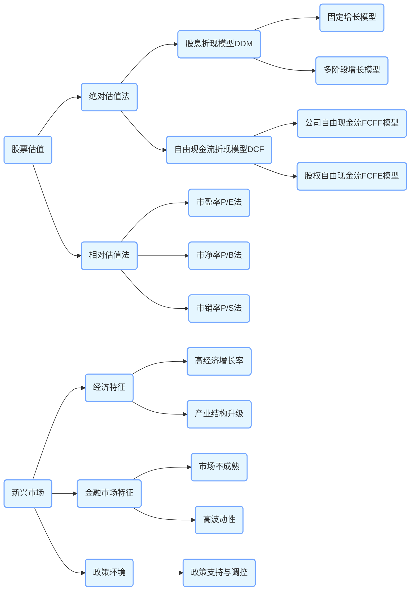

# 印度股市估值:新兴市场的机遇与风险

> 关键词：印度股市估值、新兴市场、机遇、风险、股票分析

> 摘要：本文聚焦于印度股市估值，深入探讨新兴市场背景下印度股市所蕴含的机遇与风险。首先介绍了研究的背景、目的、预期读者、文档结构和相关术语。接着阐述了股票估值等核心概念及其联系，给出了相应的文本示意图和 Mermaid 流程图。详细讲解了核心算法原理和具体操作步骤，并结合 Python 代码进行说明。同时，介绍了相关的数学模型和公式，并举例说明。通过项目实战，展示了开发环境搭建、源代码实现及代码解读。分析了印度股市在不同领域的实际应用场景。推荐了学习资源、开发工具框架和相关论文著作。最后总结了印度股市的未来发展趋势与挑战，还给出了常见问题解答和扩展阅读参考资料，旨在为投资者和相关研究人员提供全面的分析和决策参考。

## 1. 背景介绍 
### 1.1 目的和范围
本研究的主要目的是全面分析印度股市的估值情况，深入探究新兴市场中印度股市所存在的机遇与面临的风险。随着全球经济格局的不断变化，新兴市场在国际金融领域的地位日益重要，印度作为新兴市场的重要代表之一，其股市的发展状况备受关注。我们将聚焦于印度股市的估值方法、影响估值的因素、市场趋势以及与其他新兴市场和发达市场的比较等方面。同时，会分析不同行业在印度股市中的表现，以及宏观经济因素对股市估值的影响。通过对这些方面的研究，为投资者、金融分析师和相关政策制定者提供有价值的信息和决策依据。

### 1.2 预期读者
本文的预期读者主要包括以下几类人群：
- **投资者**：无论是个人投资者还是机构投资者，都希望通过对印度股市的深入了解，把握投资机会，降低投资风险。本文提供的估值分析和机遇风险评估能够帮助他们做出更明智的投资决策。
- **金融分析师**：专业的金融分析师需要对全球各个市场进行研究和分析，印度股市作为新兴市场的重要组成部分，其研究成果对于他们更新市场认知、完善分析框架具有重要意义。
- **政策制定者**：政府和相关监管机构的政策制定者可以从本文中了解印度股市的发展现状和趋势，为制定合理的金融政策和监管措施提供参考，促进股市的健康稳定发展。
- **学术研究人员**：从事金融、经济等领域研究的学术人员可以将本文作为研究印度股市的基础资料，进一步开展深入的学术研究和理论探讨。

### 1.3 文档结构概述
本文将按照以下结构进行阐述：
- **核心概念与联系**：介绍股票估值、新兴市场等核心概念，分析它们之间的内在联系，并通过文本示意图和 Mermaid 流程图进行直观展示。
- **核心算法原理 & 具体操作步骤**：详细讲解用于评估印度股市估值的核心算法原理，结合 Python 代码给出具体的操作步骤。
- **数学模型和公式 & 详细讲解 & 举例说明**：引入相关的数学模型和公式，对其进行详细解释，并通过具体的例子说明如何应用这些模型和公式进行估值分析。
- **项目实战：代码实际案例和详细解释说明**：通过实际的项目案例，展示如何搭建开发环境、实现源代码，并对代码进行解读和分析。
- **实际应用场景**：分析印度股市在不同领域的实际应用场景，如企业融资、产业发展等。
- **工具和资源推荐**：推荐学习印度股市相关知识的资源，包括书籍、在线课程、技术博客和网站等，同时介绍开发工具框架和相关论文著作。
- **总结：未来发展趋势与挑战**：总结印度股市的发展趋势，分析未来可能面临的挑战。
- **附录：常见问题与解答**：针对读者可能关心的常见问题进行解答。
- **扩展阅读 & 参考资料**：提供相关的扩展阅读材料和参考资料，方便读者进一步深入研究。

### 1.4 术语表
#### 1.4.1 核心术语定义
- **股票估值**：指对股票的内在价值进行评估的过程，通过各种方法和模型确定股票的合理价格。
- **新兴市场**：通常指那些经济发展速度较快、金融市场相对不成熟但具有较大发展潜力的国家和地区的市场。
- **市盈率（P/E）**：是股票价格与每股收益的比率，用于衡量股票的估值水平，反映投资者为获取每单位收益所愿意支付的价格。
- **市净率（P/B）**：是股票价格与每股净资产的比率，用于评估股票相对于其净资产的估值情况。
- **股息率**：是股息与股票价格的比率，反映了股票的分红收益水平。

#### 1.4.2 相关概念解释
- **股票市场有效性**：指股票市场能够及时、准确地反映所有相关信息的程度。在有效市场中，股票价格能够迅速调整以反映新的信息，投资者很难通过分析历史信息或公开信息获得超额收益。
- **宏观经济因素**：包括国内生产总值（GDP）增长率、通货膨胀率、利率、汇率等，这些因素会对整个经济和股市产生重要影响。
- **行业轮动**：指在不同的经济周期和市场环境下，各个行业的表现会出现差异，投资者会根据市场情况调整投资组合，从一个行业转向另一个行业。

#### 1.4.3 缩略词列表
- **P/E**：市盈率（Price-to-Earnings Ratio）
- **P/B**：市净率（Price-to-Book Ratio）
- **GDP**：国内生产总值（Gross Domestic Product）

## 2. 核心概念与联系 

### 核心概念原理
#### 股票估值原理
股票估值的核心是确定股票的内在价值，其基本原理基于未来现金流折现的思想。股票的价值等于其未来各期预期现金流的现值之和。对于一家持续经营的公司，其预期现金流主要包括股息和未来出售股票的收入。常用的估值方法有股息折现模型（DDM）、自由现金流折现模型（DCF）等。

股息折现模型（DDM）假设股票的价值等于其未来所有股息的现值之和。如果股息以固定增长率 $g$ 增长，且必要收益率为 $r$，则股票的价值 $V$ 可以表示为：
$$V = \frac{D_1}{r - g}$$
其中，$D_1$ 是下一期预计股息。

自由现金流折现模型（DCF）则是将公司的自由现金流折现来评估公司的价值。自由现金流是指公司在满足了所有运营成本和资本支出后剩余的现金流量。通过预测公司未来的自由现金流，并以适当的折现率折现到当前，得到公司的内在价值。

#### 新兴市场概念
新兴市场是相对于发达市场而言的，通常具有以下特点：
- **经济增长潜力大**：新兴市场国家往往处于经济快速发展阶段，具有较高的 GDP 增长率，产业结构不断优化升级。
- **金融市场不成熟**：金融体系相对不完善，市场机制不够健全，法律法规有待进一步完善。
- **高波动性**：由于市场规模较小、投资者结构不合理等原因，新兴市场的股票价格波动较大。
- **政策影响大**：政府的政策对新兴市场的发展具有重要影响，政策的变化可能导致市场的大幅波动。

### 架构的文本示意图
```plaintext
股票估值
|-- 股息折现模型（DDM）
|   |-- 固定增长模型
|   |-- 多阶段增长模型
|-- 自由现金流折现模型（DCF）
|   |-- 公司自由现金流（FCFF）模型
|   |-- 股权自由现金流（FCFE）模型
|-- 相对估值法
|   |-- 市盈率（P/E）法
|   |-- 市净率（P/B）法
|   |-- 市销率（P/S）法

新兴市场
|-- 经济特征
|   |-- 高经济增长率
|   |-- 产业结构升级
|-- 金融市场特征
|   |-- 市场不成熟
|   |-- 高波动性
|-- 政策环境
|   |-- 政策支持与调控
```

### Mermaid 流程图


## 3. 核心算法原理 & 具体操作步骤 

### 股息折现模型（DDM）算法原理
股息折现模型的核心思想是将股票未来的股息按照一定的折现率折现到当前，得到股票的内在价值。在固定增长模型中，假设股息以固定增长率 $g$ 增长，且必要收益率为 $r$（$r > g$），则股票的价值 $V$ 可以通过以下公式计算：
$$V = \frac{D_1}{r - g}$$
其中，$D_1$ 是下一期预计股息。

### 具体操作步骤及 Python 代码实现
```python
def ddm_valuation(D1, r, g):
    """
    股息折现模型（固定增长模型）计算股票价值
    :param D1: 下一期预计股息
    :param r: 必要收益率
    :param g: 股息固定增长率
    :return: 股票的内在价值
    """
    if r <= g:
        raise ValueError("必要收益率必须大于股息增长率")
    return D1 / (r - g)

# 示例参数
D1 = 2  # 下一期预计股息为 2 元
r = 0.1  # 必要收益率为 10%
g = 0.05  # 股息固定增长率为 5%

# 计算股票价值
stock_value = ddm_valuation(D1, r, g)
print(f"股票的内在价值为: {stock_value} 元")
```
### 代码解释
- 定义了一个名为 `ddm_valuation` 的函数，该函数接受三个参数：`D1`（下一期预计股息）、`r`（必要收益率）和 `g`（股息固定增长率）。
- 在函数内部，首先检查必要收益率是否大于股息增长率，如果不满足条件，则抛出 `ValueError` 异常。
- 然后根据股息折现模型的公式计算股票的内在价值，并返回该值。
- 最后，设置示例参数并调用 `ddm_valuation` 函数计算股票价值，并将结果打印输出。

### 自由现金流折现模型（DCF）算法原理
自由现金流折现模型将公司的自由现金流折现来评估公司的价值。公司自由现金流（FCFF）是指公司在满足了所有运营成本和资本支出后剩余的现金流量，可用于向所有投资者（包括股东和债权人）分配。股权自由现金流（FCFE）是指公司在满足了所有运营成本、资本支出和债务支付后剩余的现金流量，仅用于向股东分配。

公司价值 $V_{company}$ 可以通过以下公式计算：
$$V_{company} = \sum_{t = 1}^{n} \frac{FCFF_t}{(1 + WACC)^t} + \frac{TV}{(1 + WACC)^n}$$
其中，$FCFF_t$ 是第 $t$ 期的公司自由现金流，$WACC$ 是加权平均资本成本，$TV$ 是终值，$n$ 是预测期数。

股权价值 $V_{equity}$ 可以通过公司价值减去债务价值得到：
$$V_{equity} = V_{company} - D$$
其中，$D$ 是公司的债务价值。

### 具体操作步骤及 Python 代码实现
```python
import numpy as np

def fcff_valuation(fcff, wacc, terminal_growth_rate, debt_value):
    """
    自由现金流折现模型（公司自由现金流）计算股权价值
    :param fcff: 各期公司自由现金流列表
    :param wacc: 加权平均资本成本
    :param terminal_growth_rate: 终值阶段的永续增长率
    :param debt_value: 公司的债务价值
    :return: 股权的内在价值
    """
    n = len(fcff)
    # 计算预测期内自由现金流的现值
    present_value_fcff = np.sum([fcff[i] / ((1 + wacc) ** (i + 1)) for i in range(n)])
    # 计算终值
    terminal_value = fcff[-1] * (1 + terminal_growth_rate) / (wacc - terminal_growth_rate)
    # 计算终值的现值
    present_value_terminal = terminal_value / ((1 + wacc) ** n)
    # 计算公司价值
    company_value = present_value_fcff + present_value_terminal
    # 计算股权价值
    equity_value = company_value - debt_value
    return equity_value

# 示例参数
fcff = [100, 120, 140, 160, 180]  # 各期公司自由现金流
wacc = 0.1  # 加权平均资本成本为 10%
terminal_growth_rate = 0.03  # 终值阶段的永续增长率为 3%
debt_value = 500  # 公司的债务价值为 500

# 计算股权价值
equity_value = fcff_valuation(fcff, wacc, terminal_growth_rate, debt_value)
print(f"股权的内在价值为: {equity_value}")
```
### 代码解释
- 定义了一个名为 `fcff_valuation` 的函数，该函数接受四个参数：`fcff`（各期公司自由现金流列表）、`wacc`（加权平均资本成本）、`terminal_growth_rate`（终值阶段的永续增长率）和 `debt_value`（公司的债务价值）。
- 在函数内部，首先计算预测期内自由现金流的现值，通过列表推导式遍历各期自由现金流并折现求和。
- 然后计算终值，使用公式 $TV = \frac{FCFF_{last} \times (1 + g)}{WACC - g}$，其中 $FCFF_{last}$ 是最后一期的自由现金流，$g$ 是终值阶段的永续增长率。
- 接着计算终值的现值，将终值折现到当前。
- 计算公司价值，将预测期内自由现金流的现值和终值的现值相加。
- 最后计算股权价值，用公司价值减去债务价值。
- 设置示例参数并调用 `fcff_valuation` 函数计算股权价值，并将结果打印输出。

## 4. 数学模型和公式 & 详细讲解 & 举例说明 

### 股息折现模型（DDM）
#### 数学公式
在固定增长模型中，股票的价值 $V$ 计算公式为：
$$V = \frac{D_1}{r - g}$$
其中，$D_1$ 是下一期预计股息，$r$ 是必要收益率，$g$ 是股息固定增长率（$r > g$）。

#### 详细讲解
该公式的推导基于无限期股息流的现值计算。假设股息以固定增长率 $g$ 增长，第 $t$ 期的股息 $D_t$ 可以表示为 $D_t = D_0(1 + g)^t$，其中 $D_0$ 是当前股息。股票的价值等于未来所有股息的现值之和，即：
$$V = \sum_{t = 1}^{\infty} \frac{D_0(1 + g)^t}{(1 + r)^t}$$
这是一个等比数列求和的问题，当 $r > g$ 时，等比数列收敛，通过等比数列求和公式可以得到：
$$V = \frac{D_1}{r - g}$$

#### 举例说明
假设某股票当前股息 $D_0 = 1$ 元，预计股息增长率 $g = 5\%$，必要收益率 $r = 10\%$。则下一期预计股息 $D_1 = D_0(1 + g) = 1 \times (1 + 0.05) = 1.05$ 元。
根据股息折现模型，该股票的内在价值为：
$$V = \frac{D_1}{r - g} = \frac{1.05}{0.1 - 0.05} = 21$$ 元

### 自由现金流折现模型（DCF）
#### 数学公式
公司价值 $V_{company}$ 计算公式为：
$$V_{company} = \sum_{t = 1}^{n} \frac{FCFF_t}{(1 + WACC)^t} + \frac{TV}{(1 + WACC)^n}$$
其中，$FCFF_t$ 是第 $t$ 期的公司自由现金流，$WACC$ 是加权平均资本成本，$TV$ 是终值，$n$ 是预测期数。
终值 $TV$ 的计算公式为：
$$TV = \frac{FCFF_n(1 + g)}{WACC - g}$$
其中，$FCFF_n$ 是最后一期的公司自由现金流，$g$ 是终值阶段的永续增长率（$WACC > g$）。
股权价值 $V_{equity}$ 计算公式为：
$$V_{equity} = V_{company} - D$$
其中，$D$ 是公司的债务价值。

#### 详细讲解
自由现金流折现模型的核心思想是将公司未来的自由现金流折现到当前来评估公司的价值。预测期内的自由现金流需要分别折现，而终值是假设公司在预测期后以固定增长率永续增长的价值，也需要折现到当前。加权平均资本成本 $WACC$ 是公司各种融资来源的成本加权平均值，反映了公司的融资成本。

#### 举例说明
假设某公司未来 5 年的公司自由现金流分别为 $FCFF_1 = 100$ 万元，$FCFF_2 = 120$ 万元，$FCFF_3 = 140$ 万元，$FCFF_4 = 160$ 万元，$FCFF_5 = 180$ 万元，加权平均资本成本 $WACC = 10\%$，终值阶段的永续增长率 $g = 3\%$，公司的债务价值 $D = 500$ 万元。

首先计算预测期内自由现金流的现值：
$$PV_{FCFF} = \frac{100}{(1 + 0.1)^1} + \frac{120}{(1 + 0.1)^2} + \frac{140}{(1 + 0.1)^3} + \frac{160}{(1 + 0.1)^4} + \frac{180}{(1 + 0.1)^5} \approx 492.73$$ 万元

然后计算终值：
$$TV = \frac{180 \times (1 + 0.03)}{0.1 - 0.03} \approx 2657.14$$ 万元

终值的现值为：
$$PV_{TV} = \frac{2657.14}{(1 + 0.1)^5} \approx 1647.47$$ 万元

公司价值为：
$$V_{company} = PV_{FCFF} + PV_{TV} = 492.73 + 1647.47 = 2140.2$$ 万元

股权价值为：
$$V_{equity} = V_{company} - D = 2140.2 - 500 = 1640.2$$ 万元

### 相对估值法
#### 市盈率（P/E）法
##### 数学公式
市盈率（P/E）计算公式为：
$$P/E = \frac{P}{EPS}$$
其中，$P$ 是股票价格，$EPS$ 是每股收益。
通过同行业可比公司的平均市盈率来估算目标公司的股票价值：
$$P_{target} = EPS_{target} \times P/E_{average}$$
其中，$P_{target}$ 是目标公司的股票价格，$EPS_{target}$ 是目标公司的每股收益，$P/E_{average}$ 是同行业可比公司的平均市盈率。

##### 详细讲解
市盈率法是一种相对简单的估值方法，它通过比较目标公司与同行业可比公司的市盈率来评估目标公司的股票价值。市盈率反映了投资者为获取每单位收益所愿意支付的价格，不同行业的市盈率水平可能存在较大差异。

##### 举例说明
假设某行业有三家可比公司，它们的市盈率分别为 20、22、24，则该行业的平均市盈率为：
$$P/E_{average} = \frac{20 + 22 + 24}{3} = 22$$
目标公司的每股收益 $EPS_{target} = 2$ 元，则目标公司的股票价值为：
$$P_{target} = EPS_{target} \times P/E_{average} = 2 \times 22 = 44$$ 元

#### 市净率（P/B）法
##### 数学公式
市净率（P/B）计算公式为：
$$P/B = \frac{P}{BVPS}$$
其中，$P$ 是股票价格，$BVPS$ 是每股净资产。
通过同行业可比公司的平均市净率来估算目标公司的股票价值：
$$P_{target} = BVPS_{target} \times P/B_{average}$$
其中，$P_{target}$ 是目标公司的股票价格，$BVPS_{target}$ 是目标公司的每股净资产，$P/B_{average}$ 是同行业可比公司的平均市净率。

##### 详细讲解
市净率法适用于那些资产价值对公司价值影响较大的行业，如金融、房地产等。市净率反映了股票价格相对于每股净资产的倍数，较低的市净率可能意味着股票被低估。

##### 举例说明
假设某行业有三家可比公司，它们的市净率分别为 1.5、1.8、2.1，则该行业的平均市净率为：
$$P/B_{average} = \frac{1.5 + 1.8 + 2.1}{3} = 1.8$$
目标公司的每股净资产 $BVPS_{target} = 10$ 元，则目标公司的股票价值为：
$$P_{target} = BVPS_{target} \times P/B_{average} = 10 \times 1.8 = 18$$ 元

## 5. 项目实战：代码实际案例和详细解释说明 

### 5.1  开发环境搭建
#### 操作系统
本项目可以在 Windows、Linux 或 macOS 操作系统上进行开发，以下以 Windows 系统为例进行说明。

#### Python 安装
- 访问 Python 官方网站（https://www.python.org/downloads/），下载适合你操作系统的 Python 安装包（建议选择 Python 3.7 及以上版本）。
- 运行安装包，按照安装向导的提示进行安装，在安装过程中勾选 “Add Python to PATH” 选项，以便在命令行中可以直接使用 Python 命令。

#### 开发工具
推荐使用 PyCharm 作为开发工具，它是一款功能强大的 Python 集成开发环境（IDE）。
- 访问 PyCharm 官方网站（https://www.jetbrains.com/pycharm/download/），下载适合你操作系统的 PyCharm 社区版或专业版。
- 运行安装包，按照安装向导的提示进行安装。

#### 必要库安装
在命令行中使用 `pip` 命令安装以下必要的库：
```sh
pip install numpy pandas matplotlib yfinance
```
- `numpy`：用于进行数值计算。
- `pandas`：用于数据处理和分析。
- `matplotlib`：用于数据可视化。
- `yfinance`：用于获取雅虎财经的股票数据。

### 5.2  源代码详细实现和代码解读
#### 项目目标
本项目的目标是获取印度股市中某只股票的历史数据，使用股息折现模型和自由现金流折现模型对其进行估值，并将估值结果与实际股票价格进行对比分析。

#### 源代码实现
```python
import yfinance as yf
import numpy as np
import matplotlib.pyplot as plt

# 定义股息折现模型（固定增长模型）函数
def ddm_valuation(D1, r, g):
    if r <= g:
        raise ValueError("必要收益率必须大于股息增长率")
    return D1 / (r - g)

# 定义自由现金流折现模型（公司自由现金流）函数
def fcff_valuation(fcff, wacc, terminal_growth_rate, debt_value):
    n = len(fcff)
    present_value_fcff = np.sum([fcff[i] / ((1 + wacc) ** (i + 1)) for i in range(n)])
    terminal_value = fcff[-1] * (1 + terminal_growth_rate) / (wacc - terminal_growth_rate)
    present_value_terminal = terminal_value / ((1 + wacc) ** n)
    company_value = present_value_fcff + present_value_terminal
    equity_value = company_value - debt_value
    return equity_value

# 获取印度股市某只股票的历史数据
ticker = 'TCS.NS'  # 以塔塔咨询服务公司（TCS）为例
stock = yf.Ticker(ticker)
history = stock.history(period='1y')

# 假设参数
D1 = 5  # 下一期预计股息
r = 0.1  # 必要收益率
g = 0.05  # 股息固定增长率
fcff = [1000, 1200, 1400, 1600, 1800]  # 各期公司自由现金流
wacc = 0.1  # 加权平均资本成本
terminal_growth_rate = 0.03  # 终值阶段的永续增长率
debt_value = 5000  # 公司的债务价值

# 计算股票估值
ddm_value = ddm_valuation(D1, r, g)
fcff_value = fcff_valuation(fcff, wacc, terminal_growth_rate, debt_value)

# 打印估值结果
print(f"股息折现模型估值结果: {ddm_value}")
print(f"自由现金流折现模型估值结果: {fcff_value}")

# 绘制股票历史价格走势图
plt.figure(figsize=(12, 6))
plt.plot(history['Close'], label='Actual Price')
plt.title(f'{ticker} Stock Price History')
plt.xlabel('Date')
plt.ylabel('Price')
plt.legend()
plt.show()
```

#### 代码解读
- **导入必要的库**：导入 `yfinance` 用于获取股票历史数据，`numpy` 用于数值计算，`matplotlib.pyplot` 用于数据可视化。
- **定义估值函数**：定义了 `ddm_valuation` 函数用于计算股息折现模型的估值，`fcff_valuation` 函数用于计算自由现金流折现模型的估值。
- **获取股票历史数据**：使用 `yfinance` 库获取印度股市中塔塔咨询服务公司（TCS）的历史数据。
- **假设参数**：设置股息折现模型和自由现金流折现模型所需的参数，如股息、必要收益率、自由现金流等。
- **计算股票估值**：调用估值函数计算股票的估值结果。
- **打印估值结果**：将股息折现模型和自由现金流折现模型的估值结果打印输出。
- **绘制股票历史价格走势图**：使用 `matplotlib` 库绘制股票的历史价格走势图，直观展示股票价格的变化情况。

### 5.3  代码解读与分析
#### 估值结果分析
通过股息折现模型和自由现金流折现模型计算得到的估值结果可以与实际股票价格进行对比分析。如果估值结果高于实际股票价格，可能意味着股票被低估，具有投资价值；反之，如果估值结果低于实际股票价格，可能意味着股票被高估，投资风险较大。

#### 局限性分析
- **参数假设的主观性**：估值模型中的参数，如股息增长率、必要收益率、自由现金流等，都需要进行假设，这些假设的主观性较强，可能会对估值结果产生较大影响。
- **模型的简化性**：估值模型是对现实情况的简化，忽略了很多复杂的因素，如市场情绪、宏观经济政策的变化等，因此估值结果可能与实际情况存在一定偏差。

#### 改进建议
- **多模型综合分析**：可以结合多种估值模型进行综合分析，以提高估值的准确性。
- **动态调整参数**：根据市场情况和公司的实际发展情况，动态调整估值模型中的参数，使估值结果更符合实际情况。

## 6. 实际应用场景 
### 投资者决策
投资者可以利用印度股市估值分析来做出投资决策。通过对不同股票的估值评估，投资者可以筛选出被低估的股票进行投资，以获取潜在的收益。例如，当某只股票的估值结果显示其内在价值高于当前市场价格时，投资者可以考虑买入该股票；反之，当股票被高估时，投资者可以选择卖出或避免投资该股票。此外，投资者还可以通过分析不同行业的估值情况，进行行业轮动投资，即在不同的经济周期和市场环境下，调整投资组合，从估值较高的行业转向估值较低的行业。

### 企业融资
对于印度的企业来说，股市估值情况会影响其融资决策。当股市整体估值较高时，企业可以通过发行股票来筹集更多的资金，扩大生产规模、进行并购重组等。高估值意味着企业可以以较高的价格发行股票，从而获得更多的资金流入。相反，当股市估值较低时，企业可能会选择其他融资方式，如债券融资或银行贷款。

### 政策制定
政府和监管机构可以根据印度股市的估值情况制定相关政策。如果股市估值过高，可能存在泡沫风险，政府可以采取措施进行调控，如提高利率、加强监管等，以防止股市泡沫破裂对经济造成负面影响。如果股市估值过低，可能会影响企业的融资和经济的发展，政府可以出台一些刺激政策，如降低利率、放宽信贷等，以促进股市的稳定和发展。

### 金融机构业务开展
金融机构，如证券公司、基金公司等，可以根据印度股市估值情况开展相关业务。证券公司可以为投资者提供估值分析报告和投资建议，帮助投资者做出决策。基金公司可以根据股市估值情况调整基金的投资组合，优化资产配置。例如，当某些行业的股票被低估时，基金公司可以增加对这些行业的投资比例。

## 7. 工具和资源推荐
### 7.1 学习资源推荐
#### 7.1.1 书籍推荐
- 《证券分析》（Security Analysis）：由本杰明·格雷厄姆（Benjamin Graham）和戴维·多德（David Dodd）所著，被誉为投资领域的圣经，详细介绍了股票估值的基本原理和方法。
- 《聪明的投资者》（The Intelligent Investor）：同样是本杰明·格雷厄姆的经典著作，强调了价值投资的理念和方法，对股票估值和投资决策具有重要的指导意义。
- 《估值：难点、解决方案及相关案例》（Valuation: Measuring and Managing the Value of Companies）：由蒂姆·科勒（Tim Koller）、马克·戈德哈特（Marc Goedhart）和戴维·韦塞尔斯（David Wessels）所著，全面介绍了企业估值的各种方法和技术，包括现金流折现模型、相对估值法等。

#### 7.1.2 在线课程
- Coursera 上的 “Financial Markets” 课程：由耶鲁大学的罗伯特·席勒（Robert Shiller）教授授课，介绍了金融市场的基本原理和投资策略，包括股票估值的方法。
- edX 上的 “Investment Management” 课程：由哥伦比亚大学的布鲁斯·格林沃尔德（Bruce Greenwald）教授授课，深入讲解了投资管理的理论和实践，包括股票估值和投资组合管理。

#### 7.1.3 技术博客和网站
- Seeking Alpha：提供全球股市的分析和评论文章，包括印度股市的相关内容，有很多专业的分析师和投资者分享他们的观点和研究成果。
- Investing.com：提供实时的股票行情、财经新闻和分析工具，可用于跟踪印度股市的动态和进行估值分析。
- ValueWalk：专注于价值投资领域，发布有关股票估值、投资策略和市场趋势的文章，对印度股市的研究也有一定的参考价值。

### 7.2 开发工具框架推荐
#### 7.2.1 IDE和编辑器
- PyCharm：功能强大的 Python 集成开发环境，具有代码编辑、调试、版本控制等功能，适合开发与股票估值相关的 Python 程序。
- Jupyter Notebook：交互式的开发环境，方便进行数据探索、模型实验和结果展示，常用于数据分析和机器学习项目，可用于印度股市估值的研究和分析。

#### 7.2.2 调试和性能分析工具
- PDB：Python 自带的调试工具，可以帮助开发者在代码中设置断点、查看变量值，进行代码调试。
- cProfile：Python 的性能分析工具，可用于分析代码的运行时间和函数调用情况，帮助优化代码性能。

#### 7.2.3 相关框架和库
- yfinance：用于获取雅虎财经的股票数据，包括历史价格、股息等信息，方便进行股票估值分析。
- pandas：强大的数据处理和分析库，可用于处理和清洗股票数据，进行数据统计和分析。
- numpy：用于进行数值计算，提供了丰富的数学函数和数据结构，在股票估值模型的实现中经常使用。
- matplotlib：用于数据可视化，可绘制股票价格走势图、估值结果对比图等，直观展示分析结果。

### 7.3 相关论文著作推荐
#### 7.3.1 经典论文
- “The Capital Asset Pricing Model: Theory and Evidence”（资本资产定价模型：理论与实证）：由 Eugene F. Fama 和 Kenneth R. French 所著，介绍了资本资产定价模型的理论和实证研究，对股票估值和投资组合理论有重要影响。
- “Efficient Capital Markets: A Review of Theory and Empirical Work”（有效资本市场：理论与实证研究综述）：由 Eugene F. Fama 所著，对有效市场假说进行了系统的阐述和总结，对理解股票市场的有效性和估值有重要意义。

#### 7.3.2 最新研究成果
- 可以关注《Journal of Financial Economics》《Review of Financial Studies》等金融领域的顶级学术期刊，这些期刊会发表关于股票估值、新兴市场等方面的最新研究成果。

#### 7.3.3 应用案例分析
- 一些咨询公司和研究机构会发布关于印度股市的应用案例分析报告，如麦肯锡、波士顿咨询集团等。这些报告通常会结合实际案例，分析印度股市的估值情况和投资机会，具有较高的参考价值。

## 8. 总结：未来发展趋势与挑战
### 未来发展趋势
#### 经济增长驱动
印度作为新兴市场国家，经济增长潜力巨大。随着印度政府推动的一系列经济改革措施的实施，如基础设施建设、制造业发展、数字化转型等，印度的经济有望保持较高的增长率。经济的增长将带动企业盈利的增加，从而推动股票市场的发展。预计未来印度股市将受益于经济增长的红利，整体估值有望提升。

#### 金融市场改革
印度政府一直在推进金融市场改革，加强市场监管，完善法律法规，提高市场透明度和效率。这些改革措施将有助于吸引更多的国内外投资者参与印度股市，增加市场的流动性和活跃度。同时，金融市场的改革也将促进金融创新，推出更多的金融产品和服务，为投资者提供更多的投资选择。

#### 科技行业崛起
印度的科技行业近年来发展迅速，涌现出了一批具有国际竞争力的科技企业。随着全球数字化转型的加速，印度的科技行业有望迎来更大的发展机遇。科技企业的高成长性和创新性将吸引更多的投资者关注，推动科技板块在印度股市中的比重不断增加，对股市的整体估值产生积极影响。

### 挑战
#### 宏观经济不确定性
印度经济面临着一些宏观经济不确定性因素，如通货膨胀、汇率波动、财政赤字等。通货膨胀可能导致利率上升，增加企业的融资成本，对企业盈利产生负面影响；汇率波动可能影响印度企业的出口竞争力和海外投资收益；财政赤字过高可能引发市场对政府债务可持续性的担忧。这些宏观经济不确定性因素可能导致印度股市的波动加剧，给估值带来一定的困难。

#### 政治风险
印度的政治环境较为复杂，政治局势的不稳定可能对股市产生不利影响。政治事件、政策变化等都可能引发市场的恐慌情绪，导致股票价格下跌。此外，不同政治派别对经济政策的分歧也可能影响政策的连续性和稳定性，给企业的经营和发展带来不确定性。

#### 国际市场影响
全球经济和金融市场的波动对印度股市也有重要影响。国际经济形势的变化、主要经济体的货币政策调整、贸易摩擦等都可能引发全球资金的流动和风险偏好的变化，从而影响印度股市的资金供求和估值水平。例如，当全球市场出现动荡时，投资者可能会减少对新兴市场的投资，导致印度股市资金外流，股价下跌。

## 9. 附录：常见问题与解答
### 问题 1：如何确定股息折现模型中的必要收益率和股息增长率？
必要收益率通常可以根据资本资产定价模型（CAPM）来确定，公式为 $r = R_f + \beta (R_m - R_f)$，其中 $R_f$ 是无风险收益率，$\beta$ 是股票的贝塔系数，$R_m$ 是市场收益率。股息增长率可以通过分析公司的历史股息数据、行业发展趋势和公司的盈利预测来估计。

### 问题 2：自由现金流折现模型中的加权平均资本成本（WACC）如何计算？
加权平均资本成本（WACC）的计算公式为 $WACC = w_e r_e + w_d r_d (1 - T)$，其中 $w_e$ 和 $w_d$ 分别是股权和债务的权重，$r_e$ 是股权成本，$r_d$ 是债务成本，$T$ 是企业所得税税率。股权成本可以使用资本资产定价模型（CAPM）计算，债务成本可以根据公司的债券利率或银行贷款利率来确定。

### 问题 3：相对估值法的局限性有哪些？
相对估值法的局限性主要包括：
- 可比公司的选择具有主观性，不同的分析师可能选择不同的可比公司，导致估值结果存在差异。
- 行业平均市盈率、市净率等指标可能不能准确反映目标公司的真实情况，因为不同公司在盈利能力、成长潜力、风险水平等方面存在差异。
- 相对估值法没有考虑公司的未来现金流和内在价值，只是基于市场的相对定价，可能会忽略一些重要的因素。

### 问题 4：印度股市与其他新兴市场股市相比有哪些特点？
印度股市与其他新兴市场股市相比，具有以下特点：
- **行业结构**：印度的科技、金融、消费等行业在股市中占据重要地位，与其他新兴市场的行业结构有所不同。
- **经济增长模式**：印度的经济增长主要依靠内需和服务业，与一些以制造业和出口为主的新兴市场国家不同。
- **政策环境**：印度政府的经济政策和改革措施对股市的影响较大，政策的不确定性相对较高。
- **投资者结构**：印度股市的投资者结构中，外国投资者的占比较高，资金的流入和流出对股市的影响较大。

## 10. 扩展阅读 & 参考资料
### 扩展阅读
- 《新兴市场投资指南》：深入介绍了新兴市场的投资机会和风险，包括印度股市在内的多个新兴市场的分析和案例。
- 《金融炼金术》（The Alchemy of Finance）：由乔治·索罗斯（George Soros）所著，探讨了金融市场的运行机制和投资者的心理行为，对理解股票市场的波动和估值有一定的启发。

### 参考资料
- 雅虎财经（https://finance.yahoo.com/）：提供全球股市的实时行情、财经新闻和公司财务数据，可用于获取印度股市的相关信息。
- 印度证券交易所（https://www.bseindia.com/ 和 https://www.nseindia.com/）：印度两大主要证券交易所的官方网站，提供印度股市的交易数据、上市公司信息和市场规则等。
- 世界银行（https://data.worldbank.org/）：提供全球各国的宏观经济数据，可用于分析印度的经济状况和发展趋势。

作者：AI天才研究院/AI Genius Institute & 禅与计算机程序设计艺术 /Zen And The Art of Computer Programming